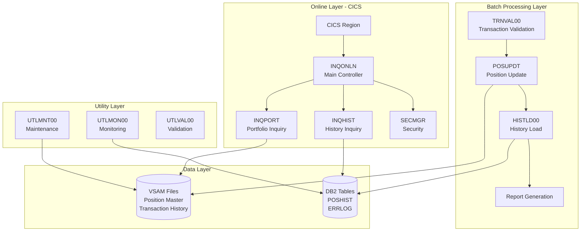

# COBOL Legacy Benchmark Suite


[]()
[]()
[]()

> A production-grade Investment Portfolio Management System designed to benchmark Large Language Model (LLM) translation tools for COBOL modernization efforts.

## Table of Contents

- [Overview](#overview)
- [Quickstart](#quickstart)
- [Project Structure](#project-structure)
- [Architecture](#architecture)
- [Configuration](#configuration)
- [Usage](#usage)
- [Development](#development)
- [Troubleshooting](#troubleshooting)
- [Contributing](#contributing)
- [License](#license)

## Overview

The COBOL Legacy Benchmark Suite (CLBS) is a comprehensive COBOL-based Investment Portfolio Management System that simulates the complexity of real-world legacy mainframe applications. Developed collaboratively with Anthropic Claude 3.5 Sonnet over five sprints, it serves as a robust test case for evaluating and fine-tuning LLM translation tools aimed at modernizing COBOL codebases.

### Purpose

This project addresses three key needs in the COBOL modernization space. First, it provides a complex, production-grade COBOL codebase to assess the capabilities of LLMs in translating legacy code to modern languages like Java or C#. Second, it serves as a detailed reference for the COBOL modernization community, addressing the scarcity of publicly available, complex COBOL projects. Third, it aids in the development and fine-tuning of LLM translation tools by offering realistic challenges beyond simplistic code snippets.

### Key Features

The system implements full transaction processing, portfolio management, and financial calculations with complex business logic. It includes batch processing, online transaction processing (CICS), reporting, utilities, and testing components in a comprehensive system architecture. The code follows industry best practices for error handling, data validation, security, and performance optimization to production-grade standards. It emulates key features of mainframe environments, exercising COBOL and z/OS functionalities through mainframe environment simulation.

### What the System Does

The Investment Portfolio Management System manages portfolios and transaction histories, processes financial transactions and updates positions, generates reports on positions, audits, and system statistics, and supports online inquiries for portfolio positions and transaction histories. While it is not intended for actual deployment, it mirrors the complexity and structure of real-world COBOL applications found in mainframe environments.

## Quickstart

This project is a reference implementation written in Enterprise COBOL for z/OS. The code is designed for mainframe deployment and cannot be executed in a standard development environment without a z/OS system or compatible COBOL compiler.

### Prerequisites

To work with this codebase, you need familiarity with COBOL programming and mainframe concepts, a text editor or IDE with COBOL syntax highlighting (VS Code with COBOL extension, Micro Focus, or similar), and optionally, access to a z/OS environment or GnuCOBOL for partial compilation testing.

### Getting Started

Clone the repository to begin exploring the codebase:

```bash
$ git clone https://github.com/COG-GTM/COBOL-Legacy-Benchmark-Suite.git
$ cd COBOL-Legacy-Benchmark-Suite
```

Review the documentation to understand the system architecture:

```bash
$ ls documentation/technical/
```

Explore the source code organized by component type:

```bash
$ ls src/programs/
```

### For LLM Translation Testing

To use this suite for benchmarking LLM translation tools, start by reviewing the system architecture document at `documentation/technical/system-architecture.md` to understand component relationships. Then examine individual programs in `src/programs/` along with their corresponding copybooks in `src/copybook/`. Use the data dictionary at `documentation/technical/data-dictionary.md` to understand data structures. Finally, compare your translated output against the original COBOL logic for accuracy.

## Project Structure

```text
COBOL-Legacy-Benchmark-Suite/
├── documentation/              # Project documentation
│   ├── assets/                # Images and logos
│   ├── technical/             # Technical specifications
│   │   ├── system-architecture.md
│   │   ├── data-dictionary.md
│   │   └── development-backlog.md
│   ├── operations/            # Operational guides
│   └── user/                  # User documentation
│
└── src/                       # Source code
    ├── programs/              # COBOL source programs
    │   ├── batch/            # Batch processing (TRNVAL00, POSUPDT, HISTLD00, etc.)
    │   ├── online/           # CICS transactions (INQONLN, INQPORT, INQHIST, etc.)
    │   ├── utility/          # Maintenance utilities (UTLMNT00, UTLMON00, UTLVAL00)
    │   ├── test/             # Test programs (TSTGEN00, TSTVAL00)
    │   ├── common/           # Shared subroutines
    │   └── portfolio/        # Portfolio management
    │
    ├── copybook/              # COBOL copybooks (shared data definitions)
    │   ├── batch/            # Batch processing copybooks
    │   ├── online/           # Online processing copybooks
    │   ├── db2/              # Database interface copybooks
    │   └── common/           # Shared system copybooks
    │
    ├── database/              # Database definitions
    │   ├── vsam/             # VSAM file definitions
    │   └── db2/              # DB2 table and index definitions
    │
    ├── jcl/                   # Job Control Language scripts
    │   ├── batch/            # Batch processing jobs
    │   ├── utility/          # Maintenance jobs
    │   ├── test/             # Test execution jobs
    │   └── portfolio/        # Portfolio management jobs
    │
    ├── maps/                  # BMS screen definitions for CICS
    ├── cics/                  # CICS resource definitions
    └── templates/             # Code templates and standards
```

## Architecture

The system comprises five main processing layers that work together to provide complete portfolio management functionality.

### High-Level Architecture



### Component Overview

The Batch Processing Layer handles daily transaction processing through TRNVAL00 for input validation, POSUPDT for position updates, and HISTLD00 for loading history to DB2. The batch control program BCHCTL00 manages process execution with checkpoint/restart capabilities.

The Online Layer provides real-time inquiry capabilities through CICS. INQONLN serves as the main controller managing screen flow, while INQPORT handles portfolio position lookups and INQHIST retrieves transaction history. SECMGR manages user authentication and authorization.

The Reporting System generates three types of reports: RPTPOS00 produces position and valuation reports, RPTAUD00 creates security and audit reports, and RPTSTA00 generates system performance statistics.

The Utility Layer includes UTLMNT00 for file maintenance and archival, UTLMON00 for resource monitoring and alerting, and UTLVAL00 for data integrity validation.

The Test Layer provides TSTGEN00 for generating test portfolios and transactions, and TSTVAL00 for executing test cases and validating results.

### Data Flow

Transactions flow through the system in a defined sequence. Input transactions are validated by TRNVAL00, which rejects invalid records. Valid transactions update the Position Master VSAM file via POSUPDT. Transaction history is loaded to DB2 tables by HISTLD00 for reporting and audit purposes. Online users can query current positions from VSAM and historical data from DB2.

## Configuration

Since this is a reference implementation, configuration is defined through JCL parameters and COBOL copybooks rather than environment variables.

### Key Configuration Files

| File | Location | Purpose |
|------|----------|---------|
| BCHCTL | `src/database/vsam/` | Batch control and checkpoint/restart |
| PRCCTL | `src/database/vsam/` | Process sequence and dependencies |
| PORTDFN.csd | `src/cics/` | CICS resource definitions |
| PORTPLAN.sql | `src/database/db2/` | DB2 application plan |

### Batch Job Parameters

The batch processing jobs in `src/jcl/batch/` accept parameters for processing date (YYYYMMDD format), checkpoint frequency (records between checkpoints), and restart indicator (Y/N for restart from last checkpoint).

### VSAM File Definitions

Position Master (POSMSTRE) is a KSDS file with a 15-byte key (Account + Fund ID) and 250-byte records. Transaction History (TRANHIST) is an ESDS file with 300-byte records. Batch Control (BCHCTL) is a KSDS file with a 16-byte key (Date + Process ID) and 200-byte records.

### DB2 Tables

POSHIST stores position history with a composite primary key of Account, Fund ID, and Transaction Date. ERRLOG captures error information with a timestamp and program ID as the primary key.

## Usage

### For Benchmarking LLM Translation Tools

This codebase is designed to test LLM capabilities in translating COBOL to modern languages. Here are recommended approaches:

**Component-Level Translation**: Start with isolated programs like utility modules (UTLMNT00, UTLVAL00) that have fewer dependencies. Progress to batch programs with VSAM access, then tackle online programs with CICS and DB2 integration.

**Pattern Recognition Testing**: Test translation of COBOL-specific patterns including level 88 condition names, REDEFINES clauses, COPY statements with REPLACING, CICS EXEC commands, and embedded SQL.

**Integration Testing**: After translating individual components, verify that translated programs maintain correct data flow, file handling semantics, and error handling behavior.

### Example: Analyzing a Batch Program

To understand how TRNVAL00 validates transactions:

```bash
$ cat src/programs/batch/TRNVAL00.cbl
```

Review the corresponding copybooks:

```bash
$ cat src/copybook/batch/TRNREC.cpy
$ cat src/copybook/common/POSREC.cpy
```

Examine the JCL that executes the program:

```bash
$ cat src/jcl/batch/TRNVAL.jcl
```

### Example: Understanding Online Flow

The online inquiry system demonstrates CICS programming patterns:

```bash
$ cat src/programs/online/INQONLN.cbl   # Main controller
$ cat src/programs/online/INQPORT.cbl   # Portfolio inquiry
$ cat src/maps/INQSET.bms               # Screen definitions
```

## Development

### Development Status

All core components are implemented and documented:

- Core Batch Processing Programs (TRNVAL00, POSUPDT, HISTLD00)
- Online Inquiry System (INQONLN, INQPORT, INQHIST)
- Utility Programs (UTLMNT00, UTLMON00, UTLVAL00)
- Reporting System (RPTPOS00, RPTAUD00, RPTSTA00)
- Test Components (TSTGEN00, TSTVAL00)
- Security Framework (SECMGR)
- DB2 Integration (DB2ONLN, DB2RECV)

### Code Standards

The codebase follows Enterprise COBOL for z/OS standards with structured programming principles, meaningful variable names following mainframe conventions, comprehensive error handling with standard return codes, and documentation through inline comments explaining business logic.

### Adding New Components

When contributing new COBOL programs, follow the existing patterns in `src/templates/` for program structure, use copybooks for shared data definitions, include appropriate error handling using ERRPROC patterns, document the program purpose and dependencies, and add corresponding JCL for batch programs or CSD entries for online programs.

### Testing Approach

Since the code cannot be executed without a z/OS environment, validation focuses on code review for COBOL syntax and standards compliance, static analysis using available COBOL linters, cross-reference verification ensuring copybook usage is consistent, and documentation review confirming technical accuracy.

## Troubleshooting

### Common Issues for Code Analysis

**Copybook Resolution**: If analyzing code and copybooks appear missing, check that you're looking in the correct subdirectory under `src/copybook/` (batch, online, common, or db2).

**Understanding REDEFINES**: COBOL REDEFINES clauses allow the same memory to be interpreted differently. When translating, ensure both interpretations are handled correctly in the target language.

**Level 88 Conditions**: These are condition names, not data items. They define valid values for the preceding data item and should be translated to constants or enums with validation logic.

**CICS Commands**: EXEC CICS commands are preprocessor directives. The actual API calls depend on the CICS runtime. When translating, map these to equivalent transaction management patterns in the target framework.

### Understanding Return Codes

| Code | Meaning | Action |
|------|---------|--------|
| 0000 | Success | Continue processing |
| 0004 | Warning | Review warnings, continue |
| 0008 | Errors occurred | Review errors, processing complete |
| 0012 | Critical error | Immediate intervention required |
| 0016 | Environment error | Contact system support |

### Documentation References

For detailed technical information, consult the System Architecture Document at `documentation/technical/system-architecture.md`, the Data Dictionary at `documentation/technical/data-dictionary.md`, and the Test Data Specifications at `documentation/operations/test-data-specs.md`.

## Contributing

Contributions are welcome, especially from those interested in COBOL modernization and LLM development. Areas where contributions are particularly valuable include adding new COBOL patterns not currently covered, expanding test scenarios with edge cases, improving documentation and examples, and creating benchmark translations to modern languages.

Please see [CONTRIBUTING.md](CONTRIBUTING.md) for detailed guidelines on code standards, the contribution process, and quality requirements.

## License

This project is available for use in COBOL modernization research and LLM development. Please review the repository for specific licensing terms.

---

## Additional Resources

- [System Architecture Document](documentation/technical/system-architecture.md) - Detailed component descriptions and process flows
- [Data Dictionary](documentation/technical/data-dictionary.md) - Complete field definitions and validation rules
- [Development Backlog](documentation/technical/development-backlog.md) - Project history and future plans

## Acknowledgments

This project was developed collaboratively with Anthropic Claude 3.5 Sonnet, demonstrating the potential of AI-assisted development in creating complex, production-grade COBOL systems for modernization benchmarking.
