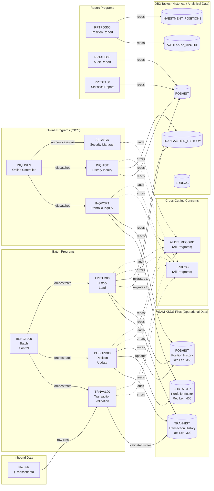
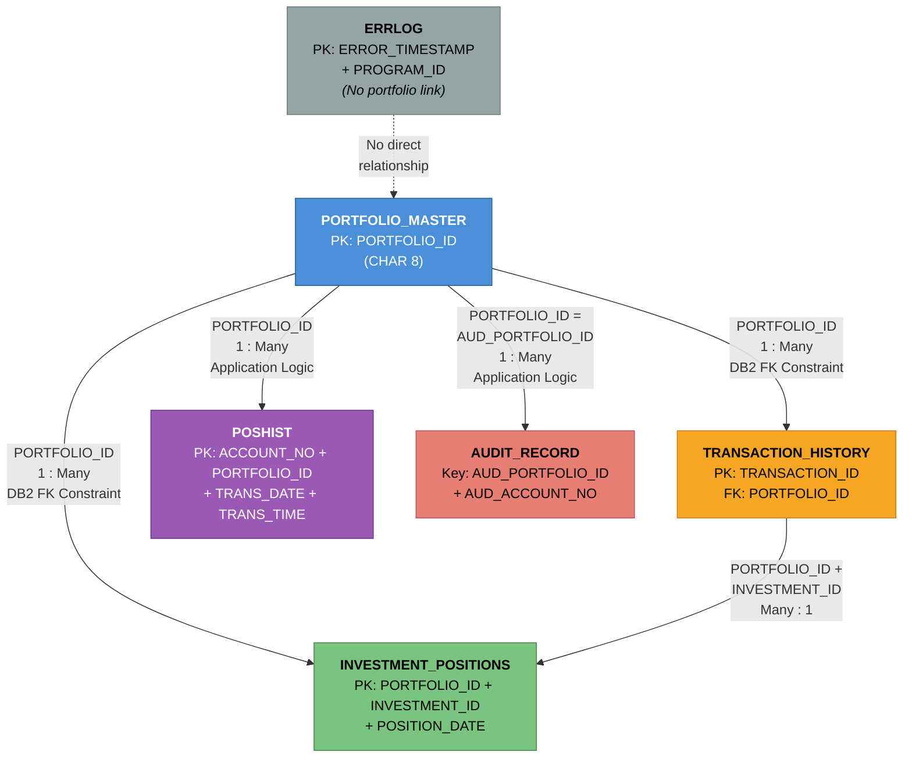

# Data Schema Diagram: Investment Portfolio Management System

> **COBOL Legacy Benchmark Suite (CLBS)**
> Comprehensive Visual Reference for Data Relationships, Schema, and Data Flow

---

## Table of Contents

1. [System Architecture Overview](#1-system-architecture-overview)
2. [Entity Relationship Diagram (ERD)](#2-entity-relationship-diagram-erd)
3. [Individual Entity Detail Boxes](#3-individual-entity-detail-boxes)
4. [Relationship Detail Diagram](#4-relationship-detail-diagram)
5. [VSAM Key Structure Diagrams](#5-vsam-key-structure-diagrams)
6. [Data Flow Diagram](#6-data-flow-diagram)
7. [COBOL Copybook to DB2 Table Mapping](#7-cobol-copybook-to-db2-table-mapping)
8. [Status and Type Code Reference](#8-status-and-type-code-reference)

---

## 1. System Architecture Overview

The Investment Portfolio Management System uses a **dual-storage architecture** that is typical of
enterprise mainframe applications. Operational, real-time data lives in **VSAM KSDS** (Key-Sequenced
Data Set) files for high-speed indexed access, while historical and analytical data is stored in
**DB2 relational tables** optimized for complex queries, reporting, and long-term retention.

This separation reflects a core mainframe design principle: VSAM files provide the raw throughput
needed for high-volume batch processing and low-latency online lookups, while DB2 tables offer the
SQL query flexibility required for ad-hoc reporting, trend analysis, and audit compliance.

Programs in the system are divided into **batch programs** (which run as scheduled jobs, typically
overnight), **online programs** (which run under CICS for interactive user sessions), and
**report/utility programs** (which generate output and perform system maintenance).



### How to Read This Diagram

- **Solid arrows** (`-->`) represent primary data reads and writes during normal processing.
- **Dashed arrows** (`-.->`) represent cross-cutting concerns (error logging and audit trails) that
  every program participates in.
- **Cylinder shapes** represent data stores (both VSAM files and DB2 tables).
- **Rectangle shapes** represent COBOL programs.
- The flow moves generally left-to-right: inbound flat files are validated, written to VSAM,
  then migrated to DB2, where online and report programs consume them.

---

## 2. Entity Relationship Diagram (ERD)

The following Entity Relationship Diagram shows all six major data entities in the system, their
complete field listings with data types, primary keys, foreign keys, and the cardinality of each
relationship.

In a traditional mainframe system, "relationships" are not enforced by the file system (VSAM has no
concept of foreign keys). Instead, relationships are maintained by application logic in the COBOL
programs. The DB2 tables, however, do define explicit foreign key constraints where applicable.

The `PORTFOLIO_ID` field is the central linking key that ties together portfolios, positions,
transactions, position history, and audit records. The `ERRLOG` entity stands alone as it logs
system-wide errors not necessarily tied to a specific portfolio.

```mermaid
erDiagram
    PORTFOLIO_MASTER {
        CHAR_8 PORTFOLIO_ID PK "Primary Key"
        CHAR_2 ACCOUNT_TYPE "Part of VSAM composite key"
        CHAR_2 BRANCH_ID "Part of VSAM composite key"
        CHAR_10 CLIENT_ID "Client identifier"
        VARCHAR_50 PORTFOLIO_NAME "Portfolio display name"
        CHAR_3 CURRENCY_CODE "Base currency (e.g. USD)"
        CHAR_1 RISK_LEVEL "Risk classification"
        CHAR_1 STATUS "A=Active, C=Closed, S=Suspended"
        DATE OPEN_DATE "Portfolio open date"
        DATE CLOSE_DATE "Portfolio close date (nullable)"
        TIMESTAMP LAST_MAINT_DATE "Last maintenance timestamp"
        VARCHAR_8 LAST_MAINT_USER "Last maintenance user ID"
    }

    INVESTMENT_POSITIONS {
        CHAR_8 PORTFOLIO_ID PK_FK "Composite PK part 1, FK to PORTFOLIO_MASTER"
        CHAR_10 INVESTMENT_ID PK "Composite PK part 2"
        DATE POSITION_DATE PK "Composite PK part 3"
        DECIMAL_18_4 QUANTITY "Holding quantity"
        DECIMAL_18_2 COST_BASIS "Total cost basis"
        DECIMAL_18_2 MARKET_VALUE "Current market value"
        CHAR_3 CURRENCY_CODE "Position currency"
        TIMESTAMP LAST_MAINT_DATE "Last maintenance timestamp"
        VARCHAR_8 LAST_MAINT_USER "Last maintenance user ID"
    }

    TRANSACTION_HISTORY {
        CHAR_20 TRANSACTION_ID PK "Primary Key (YYYYMMDDHHMMSS + seq)"
        CHAR_8 PORTFOLIO_ID FK "FK to PORTFOLIO_MASTER"
        DATE TRANSACTION_DATE "Transaction date"
        TIME TRANSACTION_TIME "Transaction time"
        CHAR_10 INVESTMENT_ID "Investment identifier"
        CHAR_2 TRANSACTION_TYPE "BU=Buy SL=Sell TR=Transfer FE=Fee"
        DECIMAL_18_4 QUANTITY "Transaction quantity"
        DECIMAL_18_4 PRICE "Transaction price"
        DECIMAL_18_2 AMOUNT "Transaction amount"
        CHAR_3 CURRENCY_CODE "Transaction currency"
        CHAR_1 STATUS "P=Pending D=Done F=Failed R=Reversed"
        TIMESTAMP PROCESS_DATE "Processing timestamp"
        VARCHAR_8 PROCESS_USER "Processing user ID"
    }

    POSHIST {
        CHAR_8 ACCOUNT_NO PK "Composite PK part 1"
        CHAR_10 PORTFOLIO_ID PK "Composite PK part 2"
        DATE TRANS_DATE PK "Composite PK part 3"
        TIME TRANS_TIME PK "Composite PK part 4"
        CHAR_2 TRANS_TYPE "BU=Buy SL=Sell TR=Transfer"
        CHAR_12 SECURITY_ID "Security identifier"
        DECIMAL_15_3 QUANTITY "Transaction quantity"
        DECIMAL_15_3 PRICE "Transaction price"
        DECIMAL_15_2 AMOUNT "Transaction amount"
        DECIMAL_15_2 FEES "Transaction fees"
        DECIMAL_15_2 TOTAL_AMOUNT "Total amount incl fees"
        DECIMAL_15_2 COST_BASIS "Cost basis amount"
        DECIMAL_15_2 GAIN_LOSS "Realized gain or loss"
        DATE PROCESS_DATE "Processing date"
        TIME PROCESS_TIME "Processing time"
        CHAR_8 PROGRAM_ID "Processing program"
        CHAR_8 USER_ID "Processing user"
        TIMESTAMP AUDIT_TIMESTAMP "Audit timestamp"
    }

    ERRLOG {
        TIMESTAMP ERROR_TIMESTAMP PK "Composite PK part 1"
        CHAR_8 PROGRAM_ID PK "Composite PK part 2"
        CHAR_1 ERROR_TYPE "S=System A=Application D=Data"
        INTEGER ERROR_SEVERITY "1=Info 2=Warning 3=Error 4=Severe"
        CHAR_8 ERROR_CODE "Application error code"
        VARCHAR_200 ERROR_MESSAGE "Error description"
        DATE PROCESS_DATE "Processing date"
        TIME PROCESS_TIME "Processing time"
        CHAR_8 USER_ID "Processing user"
        VARCHAR_500 ADDITIONAL_INFO "Extended error details"
    }

    AUDIT_RECORD {
        CHAR_26 AUD_TIMESTAMP "Audit event timestamp"
        CHAR_8 AUD_SYSTEM_ID "Originating system"
        CHAR_8 AUD_USER_ID "User who triggered event"
        CHAR_8 AUD_PROGRAM "Program that generated event"
        CHAR_8 AUD_TERMINAL "CICS terminal ID"
        CHAR_4 AUD_TYPE "TRAN=Transaction USER=User SYST=System"
        CHAR_8 AUD_ACTION "CREATE UPDATE DELETE INQUIRE etc"
        CHAR_4 AUD_STATUS "SUCC=Success FAIL=Failure WARN=Warning"
        CHAR_8 AUD_PORTFOLIO_ID FK "FK to PORTFOLIO_MASTER"
        CHAR_10 AUD_ACCOUNT_NO "Associated account number"
        CHAR_100 AUD_BEFORE_IMAGE "Data before change"
        CHAR_100 AUD_AFTER_IMAGE "Data after change"
        CHAR_100 AUD_MESSAGE "Audit message text"
    }

    PORTFOLIO_MASTER ||--o{ INVESTMENT_POSITIONS : "has positions"
    PORTFOLIO_MASTER ||--o{ TRANSACTION_HISTORY : "has transactions"
    PORTFOLIO_MASTER ||--o{ POSHIST : "has position history"
    PORTFOLIO_MASTER ||--o{ AUDIT_RECORD : "generates audit entries"
    TRANSACTION_HISTORY }o--|| INVESTMENT_POSITIONS : "affects position"
```

### Cardinality Summary

| Relationship | Type | Join Key | Description |
|---|---|---|---|
| PORTFOLIO_MASTER → INVESTMENT_POSITIONS | 1 : Many | `PORTFOLIO_ID` | One portfolio holds many investment positions |
| PORTFOLIO_MASTER → TRANSACTION_HISTORY | 1 : Many | `PORTFOLIO_ID` | One portfolio has many transactions over time |
| PORTFOLIO_MASTER → POSHIST | 1 : Many | `PORTFOLIO_ID` | One portfolio has many historical position snapshots |
| PORTFOLIO_MASTER → AUDIT_RECORD | 1 : Many | `PORTFOLIO_ID` = `AUD_PORTFOLIO_ID` | One portfolio generates many audit trail entries |
| TRANSACTION_HISTORY → INVESTMENT_POSITIONS | Many : 1 | `PORTFOLIO_ID` + `INVESTMENT_ID` | Many transactions affect one investment position |
| ERRLOG | Standalone | *(none)* | Error records are system-wide, not portfolio-specific |

---

## 3. Individual Entity Detail Boxes

The following ASCII-art "table cards" provide a detailed reference for each of the six entities
in the system. Each card shows the COBOL copybook field name, the corresponding COBOL PIC clause,
the DB2 SQL data type (where applicable), key indicators, and valid values for coded fields.

**Key to Indicators:**
- `PK` = Primary Key
- `FK` = Foreign Key
- `CK` = Composite Key component
- `88` = COBOL 88-level condition name (enumerated valid value)

---

### 3.1 PORTFOLIO_MASTER

This is the central master entity. In VSAM, it is stored in the `PORTMSTR` file. In DB2, it maps
to the `PORTFOLIO_MASTER` table. The COBOL copybook is `PORTFLIO.cpy`. Every portfolio in the system
has exactly one record in this entity, identified by `PORTFOLIO_ID`.

```
+=====================================================================================+
|                          PORTFOLIO_MASTER                                            |
+=====================================================================================+
| VSAM File:   PORTMSTR          | DB2 Table:    PORTFOLIO_MASTER                     |
| Copybook:    PORTFLIO.cpy      | Record Length: 400 bytes (VSAM)                     |
| VSAM Org:    KSDS (Fixed)      | VSAM Key Len:  12 bytes                             |
+-------------------------------------------------------------------------------------+
| COBOL Field          | PIC Clause           | DB2 SQL Type      | Key  | Notes      |
+----------------------+----------------------+-------------------+------+------------+
| PORT-ID              | PIC X(8)             | CHAR(8) NOT NULL  | PK   |            |
| PORT-ACCOUNT-NO      | PIC X(10)            | --                |      | VSAM only  |
| ACCOUNT-TYPE         | --                   | CHAR(2) NOT NULL  | CK   | DB2 only   |
| BRANCH-ID            | --                   | CHAR(2) NOT NULL  | CK   | DB2 only   |
| --                   | --                   | CHAR(10) NOT NULL |      | CLIENT_ID  |
| PORT-CLIENT-NAME     | PIC X(30)            | VARCHAR(50)       |      | PORT_NAME  |
| PORT-CLIENT-TYPE     | PIC X(1)             | --                |      | See 88s    |
| --                   | --                   | CHAR(3) NOT NULL  |      | CURRENCY   |
| --                   | --                   | CHAR(1) NOT NULL  |      | RISK_LEVEL |
| PORT-STATUS          | PIC X(1)             | CHAR(1) NOT NULL  |      | See 88s    |
| PORT-CREATE-DATE     | PIC 9(8)             | DATE NOT NULL     |      | OPEN_DATE  |
| --                   | --                   | DATE              |      | CLOSE_DATE |
| PORT-LAST-MAINT      | PIC 9(8)             | TIMESTAMP NOT NULL|      |            |
| PORT-TOTAL-VALUE     | PIC S9(13)V99 COMP-3 | --                |      | VSAM only  |
| PORT-CASH-BALANCE    | PIC S9(13)V99 COMP-3 | --                |      | VSAM only  |
| PORT-LAST-USER       | PIC X(8)             | VARCHAR(8) NOT NUL|      |            |
| PORT-LAST-TRANS      | PIC 9(8)             | --                |      | VSAM only  |
| PORT-FILLER          | PIC X(50)            | --                |      | Reserved   |
+----------------------+----------------------+-------------------+------+------------+
| 88-Level Values (PORT-CLIENT-TYPE):                                                 |
|   'I' = Individual   |  'C' = Corporate   |  'T' = Trust                            |
| 88-Level Values (PORT-STATUS):                                                      |
|   'A' = Active       |  'C' = Closed      |  'S' = Suspended                        |
+=====================================================================================+
```

---

### 3.2 INVESTMENT_POSITIONS

This entity tracks the current holdings within each portfolio. It exists only as a DB2 table
(`INVESTMENT_POSITIONS`). The COBOL copybook for position data is `POSREC.cpy`, which maps to the
VSAM `POSHIST` file for position snapshots. The DB2 table uses a three-part composite primary key:
`PORTFOLIO_ID`, `INVESTMENT_ID`, and `POSITION_DATE`.

```
+=====================================================================================+
|                        INVESTMENT_POSITIONS                                          |
+=====================================================================================+
| VSAM File:   (POSHIST - related)| DB2 Table:    INVESTMENT_POSITIONS                |
| Copybook:    POSREC.cpy         | Composite PK: PORTFOLIO_ID + INVESTMENT_ID        |
|                                 |                + POSITION_DATE                     |
+-------------------------------------------------------------------------------------+
| COBOL Field          | PIC Clause           | DB2 SQL Type       | Key  | Notes     |
+----------------------+----------------------+--------------------+------+-----------+
| POS-PORTFOLIO-ID     | PIC X(08)            | CHAR(8) NOT NULL   | PK,FK| -> PORT   |
| POS-INVESTMENT-ID    | PIC X(10)            | CHAR(10) NOT NULL  | PK   |           |
| POS-DATE             | PIC X(08)            | DATE NOT NULL      | PK   |           |
| POS-QUANTITY         | PIC S9(11)V9(4)      | DECIMAL(18,4)      |      |           |
|                      |   COMP-3             |   NOT NULL         |      |           |
| POS-COST-BASIS       | PIC S9(13)V9(2)      | DECIMAL(18,2)      |      |           |
|                      |   COMP-3             |   NOT NULL         |      |           |
| POS-MARKET-VALUE     | PIC S9(13)V9(2)      | DECIMAL(18,2)      |      |           |
|                      |   COMP-3             |   NOT NULL         |      |           |
| POS-CURRENCY         | PIC X(03)            | CHAR(3) NOT NULL   |      |           |
| POS-STATUS           | PIC X(01)            | --                 |      | See 88s   |
| POS-LAST-MAINT-DATE  | PIC X(26)            | TIMESTAMP NOT NULL |      |           |
| POS-LAST-MAINT-USER  | PIC X(08)            | VARCHAR(8) NOT NULL|      |           |
| POS-FILLER           | PIC X(50)            | --                 |      | Reserved  |
+----------------------+----------------------+--------------------+------+-----------+
| 88-Level Values (POS-STATUS):                                                       |
|   'A' = Active       |  'C' = Closed      |  'P' = Pending                          |
| Foreign Key: PORTFOLIO_ID REFERENCES PORTFOLIO_MASTER(PORTFOLIO_ID)                 |
+=====================================================================================+
```

---

### 3.3 TRANSACTION_HISTORY

This entity records every financial transaction (buy, sell, transfer, fee) against a portfolio.
In VSAM, transactions are stored in the `TRANHIST` file with a composite key that includes date,
time, portfolio ID, and a sequence number for uniqueness. In DB2, the `TRANSACTION_HISTORY` table
uses a single 20-character `TRANSACTION_ID` (formatted as `YYYYMMDDHHMMSS` + 6-digit sequence) as
its primary key. The COBOL copybook is `TRNREC.cpy`.

```
+=====================================================================================+
|                        TRANSACTION_HISTORY                                           |
+=====================================================================================+
| VSAM File:   TRANHIST           | DB2 Table:    TRANSACTION_HISTORY                 |
| Copybook:    TRNREC.cpy         | Record Length: 300 bytes (VSAM)                    |
| VSAM Org:    KSDS (Fixed)       | VSAM Key Len:  28 bytes (from copybook TRN-KEY)   |
+-------------------------------------------------------------------------------------+
| COBOL Field          | PIC Clause           | DB2 SQL Type       | Key  | Notes     |
+----------------------+----------------------+--------------------+------+-----------+
| TRN-DATE             | PIC X(08)            | DATE NOT NULL      | CK   | YYYYMMDD  |
| TRN-TIME             | PIC X(06)            | TIME NOT NULL      | CK   | HHMMSS    |
| TRN-PORTFOLIO-ID     | PIC X(08)            | CHAR(8) NOT NULL   | CK,FK| -> PORT   |
| TRN-SEQUENCE-NO      | PIC X(06)            | --                 | CK   | In TXN_ID |
| --                   | --                   | CHAR(20) NOT NULL  | PK   | TXN_ID    |
| TRN-INVESTMENT-ID    | PIC X(10)            | CHAR(10) NOT NULL  |      |           |
| TRN-TYPE             | PIC X(02)            | CHAR(2) NOT NULL   |      | See 88s   |
| TRN-QUANTITY         | PIC S9(11)V9(4)      | DECIMAL(18,4)      |      |           |
|                      |   COMP-3             |   NOT NULL         |      |           |
| TRN-PRICE            | PIC S9(11)V9(4)      | DECIMAL(18,4)      |      |           |
|                      |   COMP-3             |   NOT NULL         |      |           |
| TRN-AMOUNT           | PIC S9(13)V9(2)      | DECIMAL(18,2)      |      |           |
|                      |   COMP-3             |   NOT NULL         |      |           |
| TRN-CURRENCY         | PIC X(03)            | CHAR(3) NOT NULL   |      |           |
| TRN-STATUS           | PIC X(01)            | CHAR(1) NOT NULL   |      | See 88s   |
| TRN-PROCESS-DATE     | PIC X(26)            | TIMESTAMP NOT NULL |      |           |
| TRN-PROCESS-USER     | PIC X(08)            | VARCHAR(8) NOT NULL|      |           |
| TRN-FILLER           | PIC X(50)            | --                 |      | Reserved  |
+----------------------+----------------------+--------------------+------+-----------+
| 88-Level Values (TRN-TYPE):                                                         |
|   'BU' = Buy         |  'SL' = Sell       |  'TR' = Transfer   |  'FE' = Fee       |
| 88-Level Values (TRN-STATUS):                                                       |
|   'P' = Pending      |  'D' = Done        |  'F' = Failed      |  'R' = Reversed   |
| Foreign Key: PORTFOLIO_ID REFERENCES PORTFOLIO_MASTER(PORTFOLIO_ID)                 |
+=====================================================================================+
```

---

### 3.4 POSHIST (Position History)

This entity serves as the **analytical bridge** between the operational VSAM world and the DB2
reporting world. Position history records are initially written to the VSAM `POSHIST` file during
batch processing, then migrated to the DB2 `POSHIST` table by the `HISTLD00` program. The DB2
table is partitioned by `TRANS_DATE` for efficient quarterly archival. The COBOL host variable
copybook is `DBTBLS.cpy` (the `POSHIST-RECORD` section).

```
+=====================================================================================+
|                              POSHIST                                                 |
+=====================================================================================+
| VSAM File:   POSHIST            | DB2 Table:    POSHIST                             |
| Copybook:    DBTBLS.cpy         | Record Length: 350 bytes (VSAM)                    |
| VSAM Org:    KSDS (Fixed)       | DB2 Tablespace: POSMVP.POSHIST                    |
|                                 | Partitioned by: TRANS_DATE (quarterly)             |
+-------------------------------------------------------------------------------------+
| COBOL Host Var       | PIC Clause           | DB2 SQL Type       | Key  | Notes     |
+----------------------+----------------------+--------------------+------+-----------+
| PH-ACCOUNT-NO        | PIC X(8)             | CHAR(8) NOT NULL   | PK   |           |
| PH-PORTFOLIO-ID      | PIC X(10)            | CHAR(10) NOT NULL  | PK   |           |
| PH-TRANS-DATE        | PIC X(10)            | DATE NOT NULL      | PK   |           |
| PH-TRANS-TIME        | PIC X(8)             | TIME NOT NULL      | PK   |           |
| PH-TRANS-TYPE        | PIC X(2)             | CHAR(2) NOT NULL   |      | BU/SL/TR  |
| PH-SECURITY-ID       | PIC X(12)            | CHAR(12) NOT NULL  |      |           |
| PH-QUANTITY          | PIC S9(12)V9(3)      | DECIMAL(15,3)      |      |           |
|                      |   COMP-3             |   NOT NULL         |      |           |
| PH-PRICE             | PIC S9(12)V9(3)      | DECIMAL(15,3)      |      |           |
|                      |   COMP-3             |   NOT NULL         |      |           |
| PH-AMOUNT            | PIC S9(13)V9(2)      | DECIMAL(15,2)      |      |           |
|                      |   COMP-3             |   NOT NULL         |      |           |
| PH-FEES              | PIC S9(13)V9(2)      | DECIMAL(15,2)      |      | Default 0 |
|                      |   COMP-3             |   NOT NULL         |      |           |
| PH-TOTAL-AMOUNT      | PIC S9(13)V9(2)      | DECIMAL(15,2)      |      |           |
|                      |   COMP-3             |   NOT NULL         |      |           |
| PH-COST-BASIS        | PIC S9(13)V9(2)      | DECIMAL(15,2)      |      |           |
|                      |   COMP-3             |   NOT NULL         |      |           |
| PH-GAIN-LOSS         | PIC S9(13)V9(2)      | DECIMAL(15,2)      |      |           |
|                      |   COMP-3             |   NOT NULL         |      |           |
| PH-PROCESS-DATE      | PIC X(10)            | DATE NOT NULL      |      |           |
| PH-PROCESS-TIME      | PIC X(8)             | TIME NOT NULL      |      |           |
| PH-PROGRAM-ID        | PIC X(8)             | CHAR(8) NOT NULL   |      |           |
| PH-USER-ID           | PIC X(8)             | CHAR(8) NOT NULL   |      |           |
| PH-AUDIT-TIMESTAMP   | PIC X(26)            | TIMESTAMP NOT NULL |      | Default   |
+----------------------+----------------------+--------------------+------+-----------+
| Composite Primary Key: (ACCOUNT_NO, PORTFOLIO_ID, TRANS_DATE, TRANS_TIME)           |
| DB2 Indexes:                                                                        |
|   POSHIST_PK  - (ACCOUNT_NO, PORTFOLIO_ID, TRANS_DATE, TRANS_TIME) CLUSTER          |
|   POSHIST_IX1 - (SECURITY_ID, TRANS_DATE)                                           |
|   POSHIST_IX2 - (PROCESS_DATE, PROGRAM_ID)                                          |
+=====================================================================================+
```

---

### 3.5 ERRLOG (Error Log)

The `ERRLOG` entity captures application errors and warnings from all programs in the system. It is
a DB2-only entity (no corresponding VSAM file). Every program writes to `ERRLOG` when it encounters
an error condition. The COBOL host variable copybook is `DBTBLS.cpy` (the `ERRLOG-RECORD` section).
A stored procedure `ERRLOG_CLEANUP` handles retention-based purging.

```
+=====================================================================================+
|                               ERRLOG                                                 |
+=====================================================================================+
| VSAM File:   (none - DB2 only)  | DB2 Table:    ERRLOG                              |
| Copybook:    DBTBLS.cpy         | DB2 Tablespace: POSMVP.ERRLOG                     |
| Section:     ERRLOG-RECORD      | Cleanup Proc: ERRLOG_CLEANUP(RETENTION_DAYS)       |
+-------------------------------------------------------------------------------------+
| COBOL Host Var       | PIC Clause           | DB2 SQL Type       | Key  | Notes     |
+----------------------+----------------------+--------------------+------+-----------+
| EL-ERROR-TIMESTAMP   | PIC X(26)            | TIMESTAMP NOT NULL | PK   |           |
| EL-PROGRAM-ID        | PIC X(8)             | CHAR(8) NOT NULL   | PK   |           |
| EL-ERROR-TYPE        | PIC X(1)             | CHAR(1) NOT NULL   |      | See 88s   |
| EL-ERROR-SEVERITY    | PIC S9(4) COMP       | INTEGER NOT NULL   |      | See 88s   |
| EL-ERROR-CODE        | PIC X(8)             | CHAR(8) NOT NULL   |      |           |
| EL-ERROR-MESSAGE     | PIC X(200)           | VARCHAR(200)       |      |           |
|                      |                      |   NOT NULL         |      |           |
| EL-PROCESS-DATE      | PIC X(10)            | DATE NOT NULL      |      |           |
| EL-PROCESS-TIME      | PIC X(8)             | TIME NOT NULL      |      |           |
| EL-USER-ID           | PIC X(8)             | CHAR(8) NOT NULL   |      |           |
| EL-ADDITIONAL-INFO   | PIC X(500)           | VARCHAR(500)       |      | Nullable  |
+----------------------+----------------------+--------------------+------+-----------+
| 88-Level Values (EL-ERROR-TYPE):                                                    |
|   'S' = System       |  'A' = Application |  'D' = Data                             |
| 88-Level Values (EL-ERROR-SEVERITY):                                                |
|   1 = Info           |  2 = Warning       |  3 = Error          |  4 = Severe       |
| Composite Primary Key: (ERROR_TIMESTAMP, PROGRAM_ID)                                |
| DB2 Indexes:                                                                        |
|   ERRLOG_PK  - (ERROR_TIMESTAMP, PROGRAM_ID) CLUSTER                                |
|   ERRLOG_IX1 - (PROCESS_DATE, ERROR_SEVERITY DESC)                                  |
+=====================================================================================+
```

---

### 3.6 AUDIT_RECORD

The `AUDIT_RECORD` entity provides a comprehensive audit trail for all system activity. It is
defined in the `AUDITLOG.cpy` copybook and captures who did what, when, from where, and the
before/after images of any data changes. This entity is critical for regulatory compliance
and security monitoring. Every program in the system (batch, online, and utility) writes
audit records for significant actions.

```
+=====================================================================================+
|                            AUDIT_RECORD                                              |
+=====================================================================================+
| VSAM File:   (audit store)      | Copybook: AUDITLOG.cpy                            |
| Record Name: AUDIT-RECORD       | Used by:  All programs (batch, online, utility)    |
+-------------------------------------------------------------------------------------+
| COBOL Field          | PIC Clause           | Description                    | Key   |
+----------------------+----------------------+--------------------------------+-------+
| AUD-TIMESTAMP        | PIC X(26)            | Event timestamp (ISO format)   |       |
| AUD-SYSTEM-ID        | PIC X(8)             | Originating system identifier  |       |
| AUD-USER-ID          | PIC X(8)             | User who triggered the event   |       |
| AUD-PROGRAM          | PIC X(8)             | Program that generated event   |       |
| AUD-TERMINAL         | PIC X(8)             | CICS terminal ID (online only) |       |
| AUD-TYPE             | PIC X(4)             | Audit event type (see 88s)     |       |
| AUD-ACTION           | PIC X(8)             | Action performed (see 88s)     |       |
| AUD-STATUS           | PIC X(4)             | Outcome status (see 88s)       |       |
| AUD-PORTFOLIO-ID     | PIC X(8)             | Related portfolio identifier   | FK    |
| AUD-ACCOUNT-NO       | PIC X(10)            | Related account number         |       |
| AUD-BEFORE-IMAGE     | PIC X(100)           | Data snapshot before change    |       |
| AUD-AFTER-IMAGE      | PIC X(100)           | Data snapshot after change     |       |
| AUD-MESSAGE          | PIC X(100)           | Free-text audit message        |       |
+----------------------+----------------------+--------------------------------+-------+
| 88-Level Values (AUD-TYPE):                                                         |
|   'TRAN' = Transaction Event                                                        |
|   'USER' = User Action Event                                                        |
|   'SYST' = System Event                                                             |
| 88-Level Values (AUD-ACTION):                                                       |
|   'CREATE  ' | 'UPDATE  ' | 'DELETE  ' | 'INQUIRE '                                |
|   'LOGIN   ' | 'LOGOUT  ' | 'STARTUP ' | 'SHUTDOWN'                                |
|   (Note: Values are padded to 8 characters with trailing spaces)                    |
| 88-Level Values (AUD-STATUS):                                                       |
|   'SUCC' = Success    |  'FAIL' = Failure  |  'WARN' = Warning                      |
+=====================================================================================+
```

---

## 4. Relationship Detail Diagram

The following diagram visually illustrates how `PORTFOLIO_ID` serves as the **central hub** that
links all major entities together. In a mainframe COBOL application, these relationships are
enforced by application logic (especially for VSAM files) rather than by database constraints.
The DB2 tables do define explicit foreign keys where shown.

Think of `PORTFOLIO_ID` as the "spine" of the data model. Every significant data entity in the
system can be traced back to a portfolio through this key.



### Relationship Details

| From Entity | To Entity | Join Column(s) | Relationship | Enforcement |
|---|---|---|---|---|
| PORTFOLIO_MASTER | INVESTMENT_POSITIONS | `PORTFOLIO_ID` = `PORTFOLIO_ID` | One-to-Many | DB2 Foreign Key |
| PORTFOLIO_MASTER | TRANSACTION_HISTORY | `PORTFOLIO_ID` = `PORTFOLIO_ID` | One-to-Many | DB2 Foreign Key |
| PORTFOLIO_MASTER | POSHIST | `PORTFOLIO_ID` = `PORTFOLIO_ID` | One-to-Many | Application Logic |
| PORTFOLIO_MASTER | AUDIT_RECORD | `PORTFOLIO_ID` = `AUD_PORTFOLIO_ID` | One-to-Many | Application Logic |
| TRANSACTION_HISTORY | INVESTMENT_POSITIONS | `PORTFOLIO_ID` + `INVESTMENT_ID` | Many-to-One | Application Logic |
| ERRLOG | *(none)* | *(standalone)* | Independent | N/A |

---

## 5. VSAM Key Structure Diagrams

VSAM KSDS (Key-Sequenced Data Set) files use composite keys to uniquely identify records. The key
occupies the first N bytes of each record and determines the physical sort order of the data. Unlike
DB2 primary keys, VSAM keys are positional -- they are defined by byte offset and length within the
record, not by named columns.

Understanding the key structure is essential for COBOL modernization because the key layout directly
affects how records are accessed, how alternate indexes are built, and how sequential processing
traverses the file.

### 5.1 PORTMSTR Key (12 bytes)

The Portfolio Master key combines the portfolio identifier with account type and branch for
uniqueness across organizational units.

```
+----------+----------+----------+----------+----------+----------+----------+----------+----------+----------+----------+----------+
| Byte 0   | Byte 1   | Byte 2   | Byte 3   | Byte 4   | Byte 5   | Byte 6   | Byte 7   | Byte 8   | Byte 9   | Byte 10  | Byte 11  |
+----------+----------+----------+----------+----------+----------+----------+----------+----------+----------+----------+----------+
|<======================== PORT-ID (8 bytes) ========================>|<== ACCOUNT-TYPE ==>|<==== BRANCH-ID ====>|
|          PIC X(8) - Portfolio Identifier                           | PIC X(2) - Acct Typ| PIC X(2) - Branch   |
|          Example: "PORT0001"                                       | Example: "RT"      | Example: "NY"       |
+----------+----------+----------+----------+----------+----------+----------+----------+----------+----------+----------+----------+
|<=========================================== Total Key: 12 bytes ===========================================================>|

VSAM Definition:
  KEYS(12 0)     -- 12-byte key starting at position 0
  RECORDSIZE(400 400)
  CI SIZE: 4096
  FREESPACE: CI-20, CA-20
  SHARE OPTIONS: (2,3)
```

### 5.2 TRANHIST Key (28 bytes)

The Transaction History key is designed for chronological ordering. Date and time come first,
ensuring that sequential reads process transactions in time order. The portfolio ID and sequence
number provide uniqueness when multiple transactions occur at the same instant.

```
+------+------+------+------+------+------+------+------+------+------+------+------+------+------+
|  0   |  1   |  2   |  3   |  4   |  5   |  6   |  7   |  8   |  9   | 10   | 11   | 12   | 13   |
+------+------+------+------+------+------+------+------+------+------+------+------+------+------+
|<=============== TRN-DATE (8 bytes) ===============>|<========= TRN-TIME (6 bytes) =========>|
|   PIC X(8) - Transaction Date (YYYYMMDD)           |  PIC X(6) - Transaction Time (HHMMSS)  |
|   Example: "20240315"                               |  Example: "143052"                      |
+------+------+------+------+------+------+------+------+------+------+------+------+------+------+

+------+------+------+------+------+------+------+------+------+------+------+------+------+------+
| 14   | 15   | 16   | 17   | 18   | 19   | 20   | 21   | 22   | 23   | 24   | 25   | 26   | 27   |
+------+------+------+------+------+------+------+------+------+------+------+------+------+------+
|<========= TRN-PORTFOLIO-ID (8 bytes) =============>|<======= TRN-SEQUENCE-NO (6 bytes) ====>|
|   PIC X(8) - Portfolio Identifier                   |  PIC X(6) - Sequence Number            |
|   Example: "PORT0001"                               |  Example: "000001"                      |
+------+------+------+------+------+------+------+------+------+------+------+------+------+------+
|<============================================ Total Key: 28 bytes ===========================================>|

Full Key Example: "20240315143052PORT0001000001"

VSAM Definition:
  RECORDSIZE(300 300)
  CI SIZE: 4096
  FREESPACE: CI-10, CA-10
  SHARE OPTIONS: (2,3)
```

### 5.3 POSHIST Key (26 bytes)

The Position History key groups records by portfolio first, then by date, and finally by
investment ID. This ordering is optimized for portfolio-level queries that need to retrieve
all positions for a given date range.

```
+------+------+------+------+------+------+------+------+------+------+------+------+------+
|  0   |  1   |  2   |  3   |  4   |  5   |  6   |  7   |  8   |  9   | 10   | 11   | 12   |
+------+------+------+------+------+------+------+------+------+------+------+------+------+
|<========= POS-PORTFOLIO-ID (8 bytes) =============>|<======== POS-DATE (8 bytes) =========>
|   PIC X(8) - Portfolio Identifier                   |  PIC X(8) - Position Date (YYYYMMDD) |
|   Example: "PORT0001"                               |  Example: "20240315"                  |
+------+------+------+------+------+------+------+------+------+------+------+------+------+

+------+------+------+------+------+------+------+------+------+------+------+------+------+
| 13   | 14   | 15   | 16   | 17   | 18   | 19   | 20   | 21   | 22   | 23   | 24   | 25   |
+------+------+------+------+------+------+------+------+------+------+------+------+------+
  ====>|<================== POS-INVESTMENT-ID (10 bytes) ==========================>|
       |  PIC X(10) - Investment Identifier                                          |
       |  Example: "AAPL000001"                                                      |
+------+------+------+------+------+------+------+------+------+------+------+------+------+
|<=========================================== Total Key: 26 bytes ========================================>|

Full Key Example: "PORT000120240315AAPL000001"

VSAM Definition:
  RECORDSIZE(350 350)
  CI SIZE: 4096
  FREESPACE: CI-10, CA-10
  SHARE OPTIONS: (2,3)
```

### VSAM File Summary

| File Name | Org | Record Len | Key Len | Key Position | CI Size | Freespace | Share Options | Recovery |
|---|---|---|---|---|---|---|---|---|
| PORTMSTR | KSDS | 400 | 12 | 0 | 4096 | CI-20, CA-20 | (2,3) | Yes |
| TRANHIST | KSDS | 300 | 28* | 0 | 4096 | CI-10, CA-10 | (2,3) | Yes |
| POSHIST | KSDS | 350 | 26* | 0 | 4096 | CI-10, CA-10 | (2,3) | Yes |

> **\*** Note: The VSAM definitions file (`vsam-definitions.txt`) documents TRANHIST key length as
> 20 and POSHIST key length as 18. The values of 28 and 26 shown here are derived from the COBOL
> copybook key group definitions (`TRN-KEY` in `TRNREC.cpy` and `POS-KEY` in `POSREC.cpy`), which
> define the complete composite key fields. The difference may reflect partial key access patterns
> or alternate key definitions in the VSAM catalog.

---

## 6. Data Flow Diagram

The following diagram shows the complete data lifecycle in the Investment Portfolio Management
System, from inbound transaction data to final reports. Data flows through three major phases:

1. **Ingestion & Validation** -- Raw transaction files are validated and written to VSAM.
2. **Processing & Update** -- Validated transactions update portfolio positions and history.
3. **Migration & Reporting** -- VSAM data is migrated to DB2 for querying and report generation.

Throughout all phases, error logging flows to the `ERRLOG` DB2 table and audit logging flows to
`AUDIT_RECORD` from every program.

```mermaid
flowchart TD
    subgraph PHASE1["Phase 1: Ingestion & Validation"]
        FLAT["Flat File<br/>(Inbound Transactions)"]
        TRNVAL["TRNVAL00<br/>Transaction Validation<br/>- Format checks<br/>- Business rules<br/>- Referential integrity"]
        VALID["Validated<br/>Transactions"]
        REJECT["Rejected<br/>Transactions<br/>(Error Report)"]
    end

    subgraph PHASE2["Phase 2: Processing & Position Update"]
        POSUPD["POSUPD00<br/>Position Update<br/>- Apply buy/sell<br/>- Recalculate balances<br/>- Update market values"]
    end

    subgraph VSAM_STORE["VSAM KSDS Files"]
        TRANHIST_V[("TRANHIST<br/>Transaction History<br/>Key: Date+Time+Port+Seq")]
        PORTMSTR_V[("PORTMSTR<br/>Portfolio Master<br/>Key: PortID+AcctType+Branch")]
        POSHIST_V[("POSHIST<br/>Position History<br/>Key: PortID+Date+InvID")]
    end

    subgraph PHASE3["Phase 3: History Migration"]
        HISTLD["HISTLD00<br/>History Load<br/>- Read VSAM records<br/>- Transform formats<br/>- Insert into DB2"]
    end

    subgraph DB2_STORE["DB2 Tables"]
        PM_DB2[("PORTFOLIO_MASTER")]
        IP_DB2[("INVESTMENT_POSITIONS")]
        TH_DB2[("TRANSACTION_HISTORY")]
        PH_DB2[("POSHIST")]
        EL_DB2[("ERRLOG")]
    end

    subgraph ONLINE["Online Programs (CICS)"]
        INQONLN_O["INQONLN<br/>Main Controller"]
        SECMGR_O["SECMGR<br/>Security"]
        INQPORT_O["INQPORT<br/>Portfolio Inquiry"]
        INQHIST_O["INQHIST<br/>History Inquiry"]
    end

    subgraph REPORTS["Report Programs"]
        RPTPOS["RPTPOS00<br/>Position Report"]
        RPTAUD["RPTAUD00<br/>Audit Report"]
        RPTSTA["RPTSTA00<br/>Statistics Report"]
        RPT_OUT["Report Output<br/>(Spool / Print)"]
    end

    subgraph CROSSCUT["Cross-Cutting Concerns"]
        ERRLOG_T["ERRLOG<br/>(DB2 Table)"]
        AUDIT_T["AUDIT_RECORD<br/>(All Programs)"]
    end

    FLAT -->|"raw transaction<br/>records"| TRNVAL
    TRNVAL -->|"valid"| VALID
    TRNVAL -->|"invalid"| REJECT
    VALID -->|"write"| TRANHIST_V

    POSUPD -->|"read validated<br/>transactions"| TRANHIST_V
    POSUPD -->|"update portfolio<br/>totals & status"| PORTMSTR_V
    POSUPD -->|"write position<br/>snapshots"| POSHIST_V

    HISTLD -->|"read"| TRANHIST_V
    HISTLD -->|"read"| POSHIST_V
    HISTLD -->|"migrate"| PH_DB2
    HISTLD -->|"migrate"| TH_DB2

    INQONLN_O -->|"authenticate"| SECMGR_O
    INQONLN_O -->|"dispatch"| INQPORT_O
    INQONLN_O -->|"dispatch"| INQHIST_O
    INQPORT_O -->|"read current<br/>positions"| PORTMSTR_V
    INQPORT_O -->|"read position<br/>data"| POSHIST_V
    INQHIST_O -->|"read historical<br/>transactions"| PH_DB2
    INQHIST_O -->|"read transaction<br/>history"| TH_DB2

    RPTPOS -->|"read"| PM_DB2
    RPTPOS -->|"read"| IP_DB2
    RPTAUD -->|"read"| PH_DB2
    RPTSTA -->|"read"| PH_DB2
    RPTPOS --> RPT_OUT
    RPTAUD --> RPT_OUT
    RPTSTA --> RPT_OUT

    TRNVAL -.->|"errors"| ERRLOG_T
    POSUPD -.->|"errors"| ERRLOG_T
    HISTLD -.->|"errors"| ERRLOG_T
    INQPORT_O -.->|"errors"| ERRLOG_T
    INQHIST_O -.->|"errors"| ERRLOG_T

    TRNVAL -.->|"audit"| AUDIT_T
    POSUPD -.->|"audit"| AUDIT_T
    HISTLD -.->|"audit"| AUDIT_T
    SECMGR_O -.->|"audit"| AUDIT_T
    INQPORT_O -.->|"audit"| AUDIT_T
    INQHIST_O -.->|"audit"| AUDIT_T
    RPTPOS -.->|"audit"| AUDIT_T
    RPTAUD -.->|"audit"| AUDIT_T
    RPTSTA -.->|"audit"| AUDIT_T
```



### Data Flow Narrative

| Step | Program | Input | Output | Description |
|---|---|---|---|---|
| 1 | `TRNVAL00` | Flat file (raw transactions) | TRANHIST VSAM | Validates each transaction against business rules, format requirements, and referential integrity checks. Valid records are written to the TRANHIST VSAM file. Invalid records are logged to the error report. |
| 2 | `POSUPD00` | TRANHIST VSAM | PORTMSTR VSAM, POSHIST VSAM | Reads validated transactions and applies them to portfolio positions. Buy transactions increase holdings; sell transactions decrease them. Portfolio totals and market values are recalculated. Position snapshots are written to POSHIST. |
| 3 | `HISTLD00` | TRANHIST VSAM, POSHIST VSAM | POSHIST DB2, TRANSACTION_HISTORY DB2 | Migrates operational VSAM data into DB2 tables for long-term storage and analytical querying. Handles data type transformations between COBOL packed decimal and DB2 decimal formats. |
| 4 | `INQPORT` | User request (CICS) | Screen display | Reads current portfolio data from PORTMSTR VSAM and position data from POSHIST VSAM for real-time display to online users. |
| 5 | `INQHIST` | User request (CICS) | Screen display | Retrieves historical transaction and position data from DB2 tables for online display. Supports date range filtering and pagination. |
| 6 | `RPTPOS00` | DB2 tables | Print/spool output | Generates comprehensive portfolio position reports from PORTFOLIO_MASTER and INVESTMENT_POSITIONS DB2 tables. |
| 7 | `RPTAUD00` | DB2 POSHIST | Print/spool output | Produces audit trail reports from the POSHIST DB2 table for compliance and review purposes. |
| 8 | `RPTSTA00` | DB2 POSHIST | Print/spool output | Creates statistical analysis reports on system activity and performance metrics. |

---

## 7. COBOL Copybook to DB2 Table Mapping

COBOL copybooks define the in-memory data structures that programs use to read and write records.
Each copybook maps to one or more physical storage locations (VSAM files or DB2 tables). The
following mapping shows which copybook defines the layout for each storage target, and provides
a field-by-field correspondence.

In a mainframe environment, the same logical data may have slightly different representations
depending on whether it is stored in VSAM (using COBOL PIC clauses and packed decimal) or in
DB2 (using SQL data types). The copybooks serve as the "contract" between the COBOL program and
the data store.

### Mapping Overview

| Copybook File | COBOL Record Name | VSAM File | DB2 Table | Purpose |
|---|---|---|---|---|
| `PORTFLIO.cpy` | `PORT-RECORD` | PORTMSTR | PORTFOLIO_MASTER | Portfolio master data with client info, financials, and status |
| `POSREC.cpy` | `POSITION-RECORD` | POSHIST (VSAM) | INVESTMENT_POSITIONS | Investment position data with quantities, values, and status |
| `TRNREC.cpy` | `TRANSACTION-RECORD` | TRANHIST | TRANSACTION_HISTORY | Transaction records with type, amounts, and processing info |
| `DBTBLS.cpy` | `POSHIST-RECORD` | *(from VSAM POSHIST)* | POSHIST (DB2) | Position history with full transaction details for reporting |
| `DBTBLS.cpy` | `ERRLOG-RECORD` | *(none)* | ERRLOG | Error logging with severity, codes, and diagnostic info |
| `AUDITLOG.cpy` | `AUDIT-RECORD` | *(audit store)* | *(audit store)* | Audit trail with before/after images and action tracking |

### Detailed Field-by-Field Mapping

#### PORTFLIO.cpy -> PORTMSTR (VSAM) / PORTFOLIO_MASTER (DB2)

```
PORTFLIO.cpy                           PORTMSTR (VSAM)              PORTFOLIO_MASTER (DB2)
================================       ======================       ==========================
PORT-ID          PIC X(8)        --->  Key bytes 0-7          --->  PORTFOLIO_ID      CHAR(8)
PORT-ACCOUNT-NO  PIC X(10)       --->  Record field           --->  (see CLIENT_ID    CHAR(10))
PORT-CLIENT-NAME PIC X(30)       --->  Record field           --->  PORTFOLIO_NAME    VARCHAR(50)
PORT-CLIENT-TYPE PIC X(1)        --->  Record field           --->  (mapped to app logic)
PORT-CREATE-DATE PIC 9(8)        --->  Record field           --->  OPEN_DATE         DATE
PORT-LAST-MAINT  PIC 9(8)        --->  Record field           --->  LAST_MAINT_DATE   TIMESTAMP
PORT-STATUS      PIC X(1)        --->  Record field           --->  STATUS            CHAR(1)
PORT-TOTAL-VALUE PIC S9(13)V99   --->  Record field           --->  (computed at query time)
                   COMP-3
PORT-CASH-BALANCE PIC S9(13)V99  --->  Record field           --->  (computed at query time)
                   COMP-3
PORT-LAST-USER   PIC X(8)        --->  Record field           --->  LAST_MAINT_USER   VARCHAR(8)
PORT-LAST-TRANS  PIC 9(8)        --->  Record field           --->  (not in DB2)
PORT-FILLER      PIC X(50)       --->  Record field           --->  (not in DB2)
(not in copybook)                                             --->  ACCOUNT_TYPE      CHAR(2)
(not in copybook)                                             --->  BRANCH_ID         CHAR(2)
(not in copybook)                                             --->  CURRENCY_CODE     CHAR(3)
(not in copybook)                                             --->  RISK_LEVEL        CHAR(1)
(not in copybook)                                             --->  CLOSE_DATE        DATE
```

#### POSREC.cpy -> POSHIST (VSAM) / INVESTMENT_POSITIONS (DB2)

```
POSREC.cpy                             POSHIST (VSAM)               INVESTMENT_POSITIONS (DB2)
================================       ======================       ==============================
POS-PORTFOLIO-ID PIC X(08)       --->  Key bytes 0-7          --->  PORTFOLIO_ID      CHAR(8)
POS-DATE         PIC X(08)       --->  Key bytes 8-15         --->  POSITION_DATE     DATE
POS-INVESTMENT-ID PIC X(10)      --->  Key bytes 16-25        --->  INVESTMENT_ID     CHAR(10)
POS-QUANTITY     PIC S9(11)V9(4) --->  Record field           --->  QUANTITY          DECIMAL(18,4)
                   COMP-3
POS-COST-BASIS   PIC S9(13)V9(2) --->  Record field           --->  COST_BASIS        DECIMAL(18,2)
                   COMP-3
POS-MARKET-VALUE PIC S9(13)V9(2) --->  Record field           --->  MARKET_VALUE      DECIMAL(18,2)
                   COMP-3
POS-CURRENCY     PIC X(03)       --->  Record field           --->  CURRENCY_CODE     CHAR(3)
POS-STATUS       PIC X(01)       --->  Record field           --->  (status in app logic)
POS-LAST-MAINT-DATE PIC X(26)   --->  Record field           --->  LAST_MAINT_DATE   TIMESTAMP
POS-LAST-MAINT-USER PIC X(08)   --->  Record field           --->  LAST_MAINT_USER   VARCHAR(8)
POS-FILLER       PIC X(50)       --->  Record field           --->  (not in DB2)
```

#### TRNREC.cpy -> TRANHIST (VSAM) / TRANSACTION_HISTORY (DB2)

```
TRNREC.cpy                             TRANHIST (VSAM)              TRANSACTION_HISTORY (DB2)
================================       ======================       ==============================
TRN-DATE         PIC X(08)       --->  Key bytes 0-7          --->  TRANSACTION_DATE  DATE
TRN-TIME         PIC X(06)       --->  Key bytes 8-13         --->  TRANSACTION_TIME  TIME
TRN-PORTFOLIO-ID PIC X(08)       --->  Key bytes 14-21        --->  PORTFOLIO_ID      CHAR(8)
TRN-SEQUENCE-NO  PIC X(06)       --->  Key bytes 22-27        --->  (part of TRANSACTION_ID)
(composite of above fields)                                   --->  TRANSACTION_ID    CHAR(20)
TRN-INVESTMENT-ID PIC X(10)      --->  Record field           --->  INVESTMENT_ID     CHAR(10)
TRN-TYPE         PIC X(02)       --->  Record field           --->  TRANSACTION_TYPE  CHAR(2)
TRN-QUANTITY     PIC S9(11)V9(4) --->  Record field           --->  QUANTITY          DECIMAL(18,4)
                   COMP-3
TRN-PRICE        PIC S9(11)V9(4) --->  Record field           --->  PRICE             DECIMAL(18,4)
                   COMP-3
TRN-AMOUNT       PIC S9(13)V9(2) --->  Record field           --->  AMOUNT            DECIMAL(18,2)
                   COMP-3
TRN-CURRENCY     PIC X(03)       --->  Record field           --->  CURRENCY_CODE     CHAR(3)
TRN-STATUS       PIC X(01)       --->  Record field           --->  STATUS            CHAR(1)
TRN-PROCESS-DATE PIC X(26)       --->  Record field           --->  PROCESS_DATE      TIMESTAMP
TRN-PROCESS-USER PIC X(08)       --->  Record field           --->  PROCESS_USER      VARCHAR(8)
TRN-FILLER       PIC X(50)       --->  Record field           --->  (not in DB2)
```

#### DBTBLS.cpy (POSHIST-RECORD) -> POSHIST (DB2)

```
DBTBLS.cpy (POSHIST-RECORD)           POSHIST (DB2 Table)
================================       ==============================
PH-ACCOUNT-NO    PIC X(8)        --->  ACCOUNT_NO        CHAR(8)
PH-PORTFOLIO-ID  PIC X(10)       --->  PORTFOLIO_ID      CHAR(10)
PH-TRANS-DATE    PIC X(10)       --->  TRANS_DATE        DATE
PH-TRANS-TIME    PIC X(8)        --->  TRANS_TIME        TIME
PH-TRANS-TYPE    PIC X(2)        --->  TRANS_TYPE        CHAR(2)
PH-SECURITY-ID   PIC X(12)       --->  SECURITY_ID       CHAR(12)
PH-QUANTITY      PIC S9(12)V9(3) --->  QUANTITY          DECIMAL(15,3)
                   COMP-3
PH-PRICE         PIC S9(12)V9(3) --->  PRICE             DECIMAL(15,3)
                   COMP-3
PH-AMOUNT        PIC S9(13)V9(2) --->  AMOUNT            DECIMAL(15,2)
                   COMP-3
PH-FEES          PIC S9(13)V9(2) --->  FEES              DECIMAL(15,2)
                   COMP-3                                   DEFAULT 0
PH-TOTAL-AMOUNT  PIC S9(13)V9(2) --->  TOTAL_AMOUNT      DECIMAL(15,2)
                   COMP-3
PH-COST-BASIS    PIC S9(13)V9(2) --->  COST_BASIS        DECIMAL(15,2)
                   COMP-3
PH-GAIN-LOSS     PIC S9(13)V9(2) --->  GAIN_LOSS         DECIMAL(15,2)
                   COMP-3
PH-PROCESS-DATE  PIC X(10)       --->  PROCESS_DATE      DATE
PH-PROCESS-TIME  PIC X(8)        --->  PROCESS_TIME      TIME
PH-PROGRAM-ID    PIC X(8)        --->  PROGRAM_ID        CHAR(8)
PH-USER-ID       PIC X(8)        --->  USER_ID           CHAR(8)
PH-AUDIT-TIMESTAMP PIC X(26)     --->  AUDIT_TIMESTAMP   TIMESTAMP
```

#### DBTBLS.cpy (ERRLOG-RECORD) -> ERRLOG (DB2)

```
DBTBLS.cpy (ERRLOG-RECORD)            ERRLOG (DB2 Table)
================================       ==============================
EL-ERROR-TIMESTAMP PIC X(26)     --->  ERROR_TIMESTAMP   TIMESTAMP
EL-PROGRAM-ID    PIC X(8)        --->  PROGRAM_ID        CHAR(8)
EL-ERROR-TYPE    PIC X(1)        --->  ERROR_TYPE        CHAR(1)
EL-ERROR-SEVERITY PIC S9(4) COMP --->  ERROR_SEVERITY    INTEGER
EL-ERROR-CODE    PIC X(8)        --->  ERROR_CODE        CHAR(8)
EL-ERROR-MESSAGE PIC X(200)      --->  ERROR_MESSAGE     VARCHAR(200)
EL-PROCESS-DATE  PIC X(10)       --->  PROCESS_DATE      DATE
EL-PROCESS-TIME  PIC X(8)        --->  PROCESS_TIME      TIME
EL-USER-ID       PIC X(8)        --->  USER_ID           CHAR(8)
EL-ADDITIONAL-INFO PIC X(500)    --->  ADDITIONAL_INFO   VARCHAR(500)
```

#### AUDITLOG.cpy -> AUDIT_RECORD

```
AUDITLOG.cpy                           AUDIT_RECORD
================================       ==============================
AUD-TIMESTAMP    PIC X(26)       --->  Audit event timestamp
AUD-SYSTEM-ID    PIC X(8)        --->  Originating system ID
AUD-USER-ID      PIC X(8)        --->  User identifier
AUD-PROGRAM      PIC X(8)        --->  Program name
AUD-TERMINAL     PIC X(8)        --->  CICS terminal ID
AUD-TYPE         PIC X(4)        --->  Event type (TRAN/USER/SYST)
AUD-ACTION       PIC X(8)        --->  Action code (CREATE/UPDATE/...)
AUD-STATUS       PIC X(4)        --->  Outcome (SUCC/FAIL/WARN)
AUD-PORTFOLIO-ID PIC X(8)        --->  Related portfolio ID
AUD-ACCOUNT-NO   PIC X(10)       --->  Related account number
AUD-BEFORE-IMAGE PIC X(100)      --->  Data snapshot before change
AUD-AFTER-IMAGE  PIC X(100)      --->  Data snapshot after change
AUD-MESSAGE      PIC X(100)      --->  Free-text audit message
```

---

## 8. Status and Type Code Reference

Mainframe COBOL applications make extensive use of short coded values to represent statuses,
types, and categories. In COBOL, these are typically defined as **88-level condition names**
under the field they apply to, which allows programs to use readable condition checks like
`IF PORT-ACTIVE` instead of `IF PORT-STATUS = 'A'`.

The following reference cards document every coded value used across the system, organized by
domain. These codes are critical for anyone translating the COBOL system to a modern language,
as they must be preserved exactly (including trailing spaces for padded values) to maintain
data compatibility.

---

### Portfolio Status (`PORT-STATUS` / `PORTFOLIO_MASTER.STATUS`)

```
+-------+------------+------------------------------------------------------------------------+
| Code  | 88-Level   | Description                                                            |
+-------+------------+------------------------------------------------------------------------+
|  'A'  | PORT-ACTIVE    | Portfolio is active and available for trading and inquiries         |
|  'C'  | PORT-CLOSED    | Portfolio has been closed; no new transactions allowed             |
|  'S'  | PORT-SUSPENDED | Portfolio is temporarily suspended; may be reactivated             |
+-------+------------+------------------------------------------------------------------------+
  Defined in: PORTFLIO.cpy (PORT-STATUS field)
  Used by:    TRNVAL00 (validation), POSUPD00 (status checks), INQPORT (display)
```

---

### Client Type (`PORT-CLIENT-TYPE`)

```
+-------+-----------------+------------------------------------------------------------------+
| Code  | 88-Level        | Description                                                      |
+-------+-----------------+------------------------------------------------------------------+
|  'I'  | PORT-INDIVIDUAL | Individual retail client account                                 |
|  'C'  | PORT-CORPORATE  | Corporate/institutional client account                            |
|  'T'  | PORT-TRUST      | Trust or fiduciary account                                       |
+-------+-----------------+------------------------------------------------------------------+
  Defined in: PORTFLIO.cpy (PORT-CLIENT-TYPE field)
  Used by:    TRNVAL00 (validation), RPTPOS00 (reporting breakdowns)
```

---

### Transaction Type (`TRN-TYPE` / `TRANSACTION_HISTORY.TRANSACTION_TYPE`)

```
+-------+----------------+-------------------------------------------------------------------+
| Code  | 88-Level       | Description                                                       |
+-------+----------------+-------------------------------------------------------------------+
| 'BU'  | TRN-TYPE-BUY   | Purchase of investment securities                                 |
| 'SL'  | TRN-TYPE-SELL  | Sale of investment securities                                     |
| 'TR'  | TRN-TYPE-TRANS | Transfer of securities between portfolios or accounts             |
| 'FE'  | TRN-TYPE-FEE   | Fee charge (management fee, trading fee, etc.)                    |
+-------+----------------+-------------------------------------------------------------------+
  Defined in: TRNREC.cpy (TRN-TYPE field)
  Used by:    TRNVAL00 (validation), POSUPD00 (position calculation logic),
              HISTLD00 (migration), RPTPOS00/RPTAUD00 (reporting)
```

---

### Transaction Status (`TRN-STATUS` / `TRANSACTION_HISTORY.STATUS`)

```
+-------+------------------+-----------------------------------------------------------------+
| Code  | 88-Level         | Description                                                     |
+-------+------------------+-----------------------------------------------------------------+
|  'P'  | TRN-STATUS-PEND  | Transaction is pending processing                               |
|  'D'  | TRN-STATUS-DONE  | Transaction has been successfully processed                     |
|  'F'  | TRN-STATUS-FAIL  | Transaction processing failed (see ERRLOG for details)          |
|  'R'  | TRN-STATUS-REV   | Transaction has been reversed/cancelled                         |
+-------+------------------+-----------------------------------------------------------------+
  Defined in: TRNREC.cpy (TRN-STATUS field)
  Used by:    TRNVAL00 (initial status), POSUPD00 (status updates),
              INQHIST (display), RPTAUD00 (audit trail)
```

---

### Position Status (`POS-STATUS`)

```
+-------+--------------------+---------------------------------------------------------------+
| Code  | 88-Level           | Description                                                   |
+-------+--------------------+---------------------------------------------------------------+
|  'A'  | POS-STATUS-ACTIVE  | Position is currently active and held in the portfolio         |
|  'C'  | POS-STATUS-CLOSED  | Position has been fully liquidated (quantity = 0)              |
|  'P'  | POS-STATUS-PEND    | Position update is pending (awaiting settlement)              |
+-------+--------------------+---------------------------------------------------------------+
  Defined in: POSREC.cpy (POS-STATUS field)
  Used by:    POSUPD00 (status management), INQPORT (display filtering)
```

---

### Error Type (`EL-ERROR-TYPE` / `ERRLOG.ERROR_TYPE`)

```
+-------+-----------------+------------------------------------------------------------------+
| Code  | 88-Level        | Description                                                      |
+-------+-----------------+------------------------------------------------------------------+
|  'S'  | EL-TYPE-SYSTEM  | System-level error (I/O failure, resource unavailable, abend)    |
|  'A'  | EL-TYPE-APP     | Application-level error (business rule violation, logic error)   |
|  'D'  | EL-TYPE-DATA    | Data-level error (format error, missing field, invalid value)    |
+-------+-----------------+------------------------------------------------------------------+
  Defined in: DBTBLS.cpy (EL-ERROR-TYPE field)
  Used by:    All programs via centralized error handling (ERRHNDL)
```

---

### Error Severity (`EL-ERROR-SEVERITY` / `ERRLOG.ERROR_SEVERITY`)

```
+-------+-----------------+------------------------------------------------------------------+
| Value | 88-Level        | Description                                                      |
+-------+-----------------+------------------------------------------------------------------+
|   1   | EL-SEV-INFO     | Informational message; no action required                        |
|   2   | EL-SEV-WARN     | Warning condition; processing continues but should be reviewed   |
|   3   | EL-SEV-ERROR    | Error condition; individual record/transaction may have failed   |
|   4   | EL-SEV-SEVERE   | Severe error; batch step or program may need to terminate        |
+-------+-----------------+------------------------------------------------------------------+
  Defined in: DBTBLS.cpy (EL-ERROR-SEVERITY field, PIC S9(4) COMP)
  Used by:    All programs via centralized error handling (ERRHNDL)
  Note:       Stored as binary integer (COMP) in COBOL, INTEGER in DB2
```

---

### Audit Type (`AUD-TYPE`)

```
+--------+--------------------+--------------------------------------------------------------+
| Code   | 88-Level           | Description                                                  |
+--------+--------------------+--------------------------------------------------------------+
| 'TRAN' | AUD-TRANSACTION    | Transaction-related event (buy, sell, transfer processing)   |
| 'USER' | AUD-USER-ACTION    | User-initiated action (login, logout, inquiry)               |
| 'SYST' | AUD-SYSTEM-EVENT   | System-generated event (startup, shutdown, maintenance)      |
+--------+--------------------+--------------------------------------------------------------+
  Defined in: AUDITLOG.cpy (AUD-TYPE field, PIC X(4))
  Used by:    All programs writing audit trail records
```

---

### Audit Action (`AUD-ACTION`)

```
+------------+------------------+------------------------------------------------------------+
| Code       | 88-Level         | Description                                                |
+------------+------------------+------------------------------------------------------------+
| 'CREATE  ' | AUD-CREATE      | New record created (portfolio, position, transaction)      |
| 'UPDATE  ' | AUD-UPDATE      | Existing record modified                                   |
| 'DELETE  ' | AUD-DELETE      | Record deleted or logically removed                        |
| 'INQUIRE ' | AUD-INQUIRE     | Read-only access to data (online inquiry)                  |
| 'LOGIN   ' | AUD-LOGIN       | User authentication event (successful or failed)           |
| 'LOGOUT  ' | AUD-LOGOUT      | User session termination                                   |
| 'STARTUP ' | AUD-STARTUP     | System or batch process initialization                     |
| 'SHUTDOWN' | AUD-SHUTDOWN    | System or batch process termination                        |
+------------+------------------+------------------------------------------------------------+
  Defined in: AUDITLOG.cpy (AUD-ACTION field, PIC X(8))
  Note:       All values are padded with trailing spaces to fill 8 characters.
              When translating to modern languages, trim trailing spaces for comparison.
```

---

### Audit Status (`AUD-STATUS`)

```
+--------+-----------------+-----------------------------------------------------------------+
| Code   | 88-Level        | Description                                                     |
+--------+-----------------+-----------------------------------------------------------------+
| 'SUCC' | AUD-SUCCESS     | Action completed successfully                                   |
| 'FAIL' | AUD-FAILURE     | Action failed (see AUD-MESSAGE for details)                     |
| 'WARN' | AUD-WARNING     | Action completed with warnings (partial success)                |
+--------+-----------------+-----------------------------------------------------------------+
  Defined in: AUDITLOG.cpy (AUD-STATUS field, PIC X(4))
  Used by:    All programs writing audit trail records
```

---

### Complete Code Quick-Reference Card

For quick lookup, here is a consolidated view of all coded values in the system:

```
+=============================================================================+
|                    INVESTMENT PORTFOLIO MANAGEMENT SYSTEM                    |
|                       CODE VALUE QUICK REFERENCE                            |
+=============================================================================+
|                                                                             |
|  PORTFOLIO STATUS        TRANSACTION TYPE        TRANSACTION STATUS         |
|  ==================      ================        ====================       |
|  A = Active              BU = Buy                P = Pending                |
|  C = Closed              SL = Sell               D = Done                   |
|  S = Suspended           TR = Transfer           F = Failed                 |
|                          FE = Fee                R = Reversed               |
|                                                                             |
|  CLIENT TYPE             POSITION STATUS         ERROR TYPE                 |
|  ==================      ================        ====================       |
|  I = Individual          A = Active              S = System                 |
|  C = Corporate           C = Closed              A = Application            |
|  T = Trust               P = Pending             D = Data                   |
|                                                                             |
|  ERROR SEVERITY          AUDIT TYPE              AUDIT STATUS               |
|  ==================      ================        ====================       |
|  1 = Info                TRAN = Transaction      SUCC = Success             |
|  2 = Warning             USER = User Action      FAIL = Failure             |
|  3 = Error               SYST = System Event     WARN = Warning             |
|  4 = Severe                                                                 |
|                                                                             |
|  AUDIT ACTION                                                               |
|  ===========================================================               |
|  CREATE   UPDATE   DELETE   INQUIRE   LOGIN   LOGOUT                        |
|  STARTUP  SHUTDOWN                                                          |
|  (All padded to 8 characters with trailing spaces)                          |
|                                                                             |
+=============================================================================+
```

---

## Source File References

This document was generated from the following source files in the COBOL Legacy Benchmark Suite:

| Source File | Path | Description |
|---|---|---|
| Portfolio Copybook | `src/copybook/common/PORTFLIO.cpy` | Portfolio master record layout |
| Position Copybook | `src/copybook/common/POSREC.cpy` | Position record layout |
| Transaction Copybook | `src/copybook/common/TRNREC.cpy` | Transaction record layout |
| Audit Copybook | `src/copybook/common/AUDITLOG.cpy` | Audit trail record definitions |
| DB2 Host Variables | `src/copybook/db2/DBTBLS.cpy` | DB2 host variable mappings for POSHIST and ERRLOG |
| DB2 Table Definitions | `src/database/db2/db2-definitions.sql` | PORTFOLIO_MASTER, INVESTMENT_POSITIONS, TRANSACTION_HISTORY |
| POSHIST Table | `src/database/db2/POSHIST.sql` | POSHIST DB2 table definition |
| ERRLOG Table | `src/database/db2/ERRLOG.sql` | ERRLOG DB2 table definition |
| VSAM Definitions | `src/database/vsam/vsam-definitions.txt` | VSAM KSDS file definitions |

---

*Document generated for the COBOL Legacy Benchmark Suite (CLBS) - Investment Portfolio Management System*
