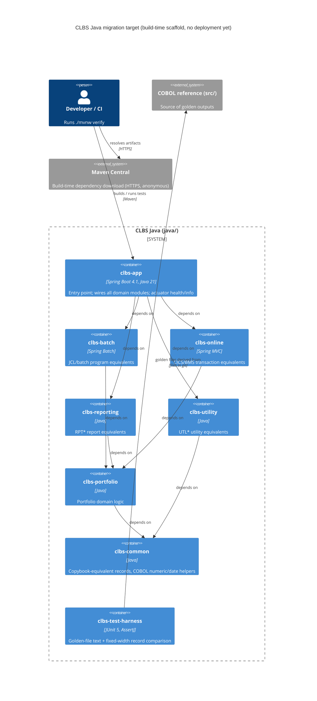

# 0001. Java 21 / Spring Boot as the COBOL migration target

- **Status:** Proposed
- **Date:** 2026-09-22
- **ARB ticket:** TO BE CREATED
- **Authors:** COBOL modernization team (AB-276 / AB-282)
- **Owning team:** COBOL modernization team (AB project)
- **Related ADRs:** none (first ADR in this repository)

## Context

AB-276 modernizes the COBOL Legacy Benchmark Suite (batch, online/CICS, reporting, utility and
portfolio programs under `src/programs`) into a maintainable codebase while preserving business
behaviour and byte-level output parity. AB-282 is the foundation ticket: it introduces the target
language, runtime, build system and quality gates that every later migration ticket (AB-283 to
AB-288) builds on. The repository previously contained COBOL, JCL, BMS and DB2 DDL only; no Java,
Maven or CI existed.

Constraints:

- The COBOL programs remain the behavioural reference; the Java port must be verifiable against
  golden outputs, so a parity test harness is part of the foundation.
- Module boundaries must mirror the existing COBOL domain folders so migration tickets map 1:1 to
  modules and reviewers can trace COBOL program -> Java module.
- Build and test must run with no external services (no database, no container runtime) so the
  empty project builds in CI and on any developer machine.

ARB triggers: **T7** (introduction of a new language, runtime and framework: Java 21, Spring Boot
4.1, Spring Batch, Spring MVC into a COBOL-only repository). Heuristic detector also flagged T3 on
XML namespace/DTD/licence URLs in POM, Checkstyle and wrapper files; these are schema identifiers
and build-time artifact downloads from Maven Central, not new vendor or third-party API
dependencies, and are dismissed. T1, T2, T4, T5, T6, T8, T9 are not triggered: the change ships no
deployable, no data store, no cross-domain contract, no infrastructure, no auth or network change,
and has no recurring cost.

## Decision

We will build the migration target as a Maven multi-module project under `java/` on **Java 21
(LTS)** and **Spring Boot 4.1**, with one module per COBOL domain (`clbs-common`, `clbs-portfolio`,
`clbs-batch` on Spring Batch, `clbs-online` on Spring MVC, `clbs-reporting`, `clbs-utility`), a
single Spring Boot entry point (`clbs-app`), a framework-free golden-file test harness
(`clbs-test-harness`) and an aggregate coverage module. Quality gates (google-java-format via
Spotless, Checkstyle, JaCoCo 80 % line coverage per module, Maven Enforcer) run in `./mvnw verify`
locally and in GitHub Actions on every PR.

## Alternatives considered

| Alternative | Pros | Cons | Why rejected |
| --- | --- | --- | --- |
| Do nothing (keep COBOL only) | Zero migration risk, no new toolchain | Does not deliver AB-276; benchmark suite cannot produce Java translation pairs | Contradicts the programme goal |
| Java 21 + Gradle (Kotlin DSL) | Faster incremental builds, concise build scripts | Less familiar to mainframe-adjacent teams; wrapper + plugin ecosystem for Checkstyle/JaCoCo/Spotless less uniform; Gradle 8.5 on the build image predates Spring Boot 4 plugin support | Maven's declarative, convention-heavy POMs are easier to review and the Spring Boot parent POM manages all versions |
| Java 21 + Jakarta EE / plain Java SE (no Spring) | Fewer dependencies, smaller runtime | Would require hand-rolling batch chunking, restart/skip semantics and HTTP wiring that Spring Batch / Spring MVC provide; weaker ecosystem for test slices | Spring Batch maps directly onto JCL step semantics; Spring MVC onto CICS transactions |
| C# / .NET 8 | Comparable ecosystem, strong batch story | Repository README and AB-276 name Java as the primary target; no .NET skills on the owning team | Out of scope for the programme's stated target |
| Single-module Java project | Simplest build | Loses the COBOL-domain -> module traceability and lets cross-domain dependencies form silently | Module boundaries are the main structural guardrail for the migration |

## Architecture

No data store, message broker or external API is introduced by this change. Persistence (VSAM/DB2
equivalents) will be decided in the domain migration tickets and will each receive their own ADR.

## Non-functional requirements

| NFR | Target | How met |
| --- | --- | --- |
| Availability SLO | N/A — nothing is deployed by this change; build-time scaffold only | — |
| p95 latency | N/A — no runtime endpoints beyond actuator health | — |
| RPO / RTO | N/A — no data | — |
| Peak load | N/A | — |
| Scaling model | N/A | — |
| Data retention | N/A — only source and golden test fixtures in git | — |
| Build time | CI `./mvnw verify` under 10 min for the empty scaffold (measured ~15 s locally) | Maven dependency cache in GitHub Actions |
| Output parity | Byte-exact for fixed-width records; line-exact for reports | `clbs-test-harness` golden-file comparisons, `.gitattributes` binary handling |
| Code coverage | >= 80 % line coverage per module | JaCoCo `check` bound to `verify` |

## Security & compliance

- **Data classification:** None. Only source code and synthetic test fixtures; no PII or business
  data is stored or processed by this change.
- **Encryption at rest:** N/A — no data store.
- **Encryption in transit:** Build dependencies are fetched over HTTPS from Maven Central; CI uses
  GitHub-hosted runners.
- **AuthN / AuthZ:** N/A — the application exposes only actuator `health` and `info` and is not
  deployed. Authentication for online endpoints will be decided in AB-286 (online domain) and
  needs its own ADR.
- **Secrets:** None introduced. CI workflow uses `permissions: contents: read` only.
- **Audit logging:** N/A.
- **Data residency / regions:** N/A.
- **Policy sections satisfied:** No infrastructure resources are created, so `approved-infra.yaml`
  is not exercised.
- **Threats considered:** Supply-chain risk from new third-party libraries — mitigated by pinning
  all versions through the Spring Boot BOM, Maven Enforcer `dependencyConvergence`, and Dependabot
  weekly updates on `/java` and GitHub Actions.

## Cost

| Item | Assumption | Monthly estimate |
| --- | --- | --- |
| GitHub Actions minutes | ~5 min per PR run, ubuntu-latest, within existing plan | $0 incremental (existing plan) |
| Artifact storage | Surefire + JaCoCo reports, 14-day retention, < 50 MB per run | ~$0 |
| **Total** | | **$0 / month** (below ARB cost threshold) |

## Operations

- **On-call rotation:** N/A — not deployed. To be defined before the first deployable increment.
- **Runbook:** `java/README.md` (local setup, build, quality gates, golden-file workflow).
- **Dashboards / alarms:** GitHub Actions status on the `Java CI` workflow; coverage summary in the
  job summary.
- **Rollback plan:** Revert the PR. The change is additive (`java/`, `.github/`, `docs/adr/`, one
  README section) and does not touch COBOL sources.
- **Migration / cut-over plan:** None for this ticket. Domain migrations follow in AB-283 to AB-288,
  each gated by golden-file parity tests against the COBOL reference.

## Policy exceptions requested

| Rule | Resource | Justification | Compensating control | Expiry |
| --- | --- | --- | --- | --- |
| none | | | | |

## Consequences

- Positive: one build command for the whole quality gate; module boundaries enforce
  COBOL-domain traceability; parity harness available from the first migrated program; Spring
  Batch/MVC align with JCL step and CICS transaction semantics.
- Negative / risks: Spring Boot 4.1 is a recent major line, so third-party starter compatibility
  may lag; two languages must be maintained in the repository until cut-over; 80 % per-module
  coverage floor will require tests in every module as soon as the first class lands.
- Follow-ups: ADRs for persistence choice (VSAM/DB2 replacement), online authentication, and
  deployment platform once the first deployable increment is scoped.

## Open questions

- Which persistence technology replaces VSAM/DB2 (AB-284)? Needs its own ADR.
- Target deployment platform and ownership for the runtime — TBD, owner to confirm before ARB.
- Whether the golden outputs will be generated from GnuCOBOL runs of `src/programs` or captured
  from a z/OS environment (affects EBCDIC vs ASCII handling in the harness).
