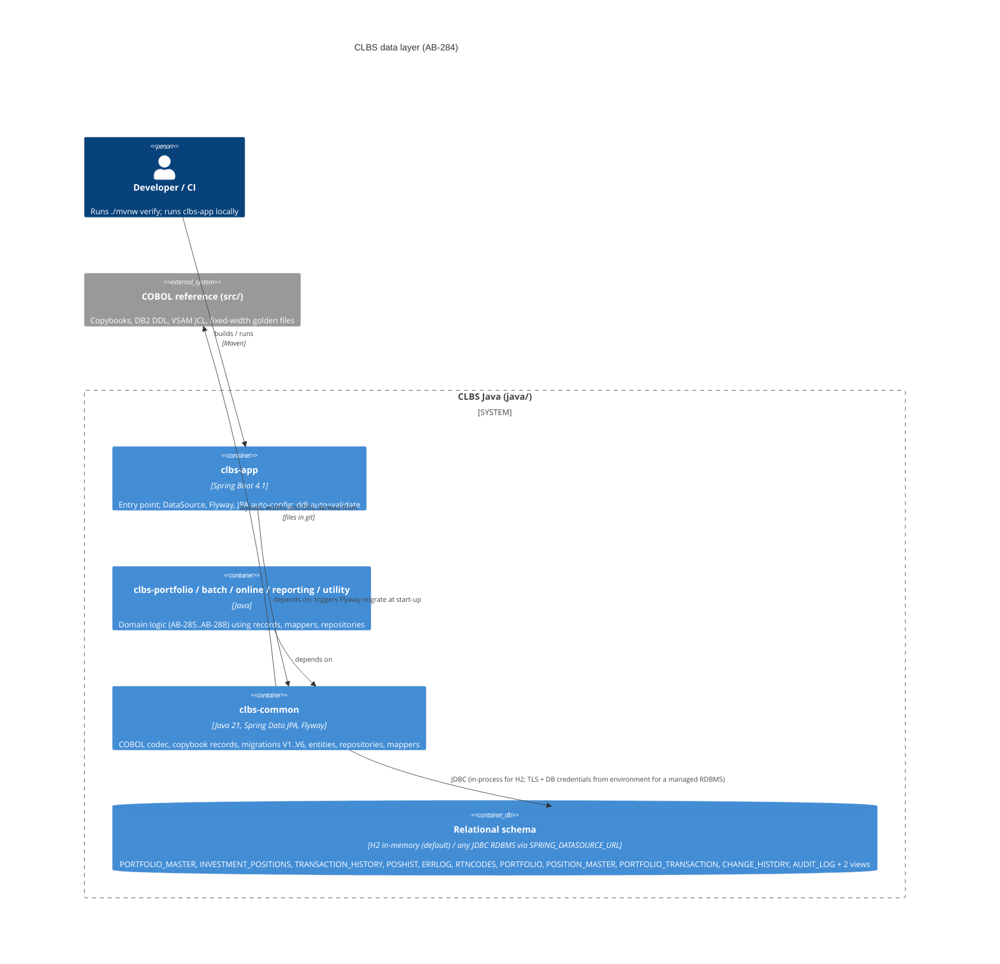

# 0002. Relational data layer: copybooks to Java records, DB2 DDL to Flyway, VSAM files to JPA tables

- **Status:** Proposed
- **Date:** 2026-09-23
- **ARB ticket:** TO BE CREATED
- **Authors:** COBOL modernization team (AB-284)
- **Owning team:** COBOL modernization team (AB project)
- **Related ADRs:** [0001](0001-java-21-spring-boot-migration-target.md) (deferred the persistence
  decision to this ticket)

## Context

The COBOL suite persists business data in two places: **DB2** tables defined in
`src/database/db2/*.sql` (`PORTFOLIO_MASTER`, `INVESTMENT_POSITIONS`, `TRANSACTION_HISTORY`,
`POSHIST`, `ERRLOG`, `RTNCODES`, two views, a bind plan) and **VSAM KSDS files** defined in
`src/database/vsam/*.jcl` (`PORTMSTR`, `TRANHIST`, `POSHIST`) whose record layouts live in the 20
copybooks under `src/copybook/{common,batch,db2,online}`. Every record is fixed-width; amounts are
`COMP-3` packed decimals and counters are `COMP` binaries, so the layouts carry exact byte
positions, digit counts and scales that the Java port must reproduce to keep golden-file parity.

AB-284 must give the domain migration tickets (AB-285 to AB-288) a persistence layer to build on:
typed Java equivalents of the copybooks, a schema that can be created on any developer machine and
in CI, and JPA mappings for the four VSAM-backed business files plus the DB2 tables.

Constraints:

- Byte-exact round trip: `record -> entity -> database -> entity -> record` must reproduce the
  original fixed-width bytes (including packed-decimal digit counts and scales).
- No DB2 or z/OS at build time (ADR 0001): the schema must apply to an embedded database in
  `./mvnw verify`, while remaining portable to a managed RDBMS later.
- DB2-only operational artifacts (databases, tablespaces, `GRANT`s, `COMMENT ON`, stored
  procedures, `PORTPLAN` bind plan) are platform glue and must not be copied blindly.

ARB triggers: **T2** (new/changed data store: VSAM files and DB2 tables become a Flyway-managed
relational schema holding portfolio, position and transaction business data) and **T8** (a new
shared platform component: `clbs-common` now carries the codec, records, migrations, entities and
repositories used by every domain module). Heuristic detector flagged T2 on the six migration
scripts. T3 is not triggered: the added dependencies (Spring Data JPA, Hibernate, Flyway, H2) are
in-process libraries managed by the already-approved Spring Boot BOM and make no network calls to a
vendor. T1, T4, T5, T6, T7, T9 are not triggered: nothing is deployed, no cross-domain contract or
infrastructure is created, auth/network are untouched, no framework changes, and recurring cost is
zero at this stage.

## Decision

We will model the data layer in `clbs-common` as three cooperating parts. (1) A small fixed-width
**COBOL codec** (`PackedDecimal`, `BinaryField`, `RecordReader`/`RecordWriter`, ASCII and IBM-1047
charsets) and one immutable Java `record` per copybook that exposes its exact `LENGTH`, uses
`BigDecimal` for every `COMP-3` field and `String`/`int`/`long` with explicit widths for
`PIC X`/`DISPLAY`/`COMP` fields; copybooks that are constants, condition names or working-storage
contracts (COMMON, RTNCODE, RETHND, ERRHAND, PORTVAL, BCHCON, SQLCA, DBPROC, DB2REQ, ERRHND,
INQCOM) become enums, constants and plain records rather than tables. (2) **Flyway** versioned SQL
migrations `V1..V6` translating the DB2 DDL into portable ANSI SQL (tables, PK/FK, indexes, the two
views) and adding relational tables for the VSAM files (`PORTFOLIO`, `POSITION_MASTER`,
`PORTFOLIO_TRANSACTION`, `CHANGE_HISTORY`) and the sequential audit log (`AUDIT_LOG`), with column
widths and `DECIMAL(p,s)` taken from the copybooks. (3) **Spring Data JPA** entities with embedded
composite keys mirroring the VSAM key fields, `@Column(length/precision/scale)` matching the DDL,
repositories, and static mappers between copybook records and entities. Hibernate runs with
`ddl-auto=validate` so schema/entity drift fails the build; H2 in-memory is the embedded default
for tests and local runs, and the production RDBMS is selected by `SPRING_DATASOURCE_URL` without
code changes.

## Alternatives considered

| Alternative | Pros | Cons | Why rejected |
| --- | --- | --- | --- |
| Do nothing (keep VSAM/DB2, access via z/OS connectors) | No schema translation; zero parity risk on storage | Requires a mainframe or emulator at build time; contradicts ADR 0001 constraint of no external services; blocks AB-285+ | Not buildable in CI; defeats the migration goal |
| Keep VSAM files as flat files read through the codec only (no relational store) | Minimal change; byte parity trivial | No indexed access by alternate keys, no transactions across files, no views; every domain module re-implements KSDS semantics | Loses the DB2 tables entirely and makes online inquiry (AB-286) impractical |
| Hibernate `ddl-auto=create` from entities (no Flyway) | Fewer files; entities are the single source of truth | Schema not reviewable as SQL, cannot evolve incrementally, diverges from the DB2 DDL that is the behavioural reference | Flyway keeps the DB2 DDL lineage visible and applies identically in CI and production |
| MyBatis / plain JDBC with the codec records as DTOs | No ORM mapping surface; explicit SQL | Composite keys, relationships and per-column widths must be hand-maintained in SQL strings; no schema validation at start-up | JPA `validate` gives compile-to-schema safety the ticket AC asks for |
| Ship the DB2 DDL unchanged and require DB2 (Db2 Community / Testcontainers) | Zero SQL translation | Container runtime in CI (ADR 0001 forbids), DB2 licence/ops footprint, tablespace/grant syntax not portable | Portable SQL plus H2 keeps the build self-contained; DB2-specific extras remain in `src/database/db2` for reference |

## Architecture

Data flow for a fixed-width file: bytes -> `RecordReader` -> copybook `record` -> `*Mapper` ->
JPA entity -> repository -> table, and the reverse for output files. Entities never leak COBOL
encodings (packed bytes, `YYYYMMDD` text); they hold `BigDecimal`, `LocalDate`, `LocalTime`,
`LocalDateTime` and trimmed strings, while the mappers restore the exact copybook representation.

## Non-functional requirements

| NFR | Target | How met |
| --- | --- | --- |
| Availability SLO | N/A — nothing is deployed by this change; the embedded H2 default is for tests and local runs only. Production SLO TBD — owner to confirm before ARB | — |
| p95 latency | N/A — no runtime endpoints added | — |
| RPO / RTO | N/A for embedded H2 (ephemeral). For a managed RDBMS: TBD — owner to confirm before ARB | Flyway history table makes the schema reproducible from git on any target |
| Peak load | Batch volumes follow the COBOL suite fixtures (thousands of records per run) — TBD to confirm real volumes | Indexes copied from the DB2 DDL (`IDX_*`, `POSHIST_IX*`, `ERRLOG_IX1`, `RTNCODES_*_IDX`) plus alternate-key indexes on the VSAM tables (`IDX_POSITION_MASTER_INVESTMENT`, `IDX_PORTFOLIO_TRANSACTION_PORT`, `IDX_AUDIT_LOG_*`) |
| Scaling model | Single JVM against one RDBMS; horizontal scaling not required by the benchmark suite | Stateless repositories; schema is portable |
| Data retention | `ERRLOG` cleanup retained as `ErrorLogRepository.deleteProcessedBefore` (DB2 stored procedure `CLEANUP_ERRLOG` not ported); other tables: no purge, mirrors COBOL | Repository method; retention windows TBD |
| Precision parity | Every `COMP-3` picture maps to `DECIMAL(p,s)` with identical `p,s`; `PIC X(n)` to `CHAR/VARCHAR(n)` | `EntityRoundTripTest` asserts byte-exact round trip for all seven mapped record types; `FlywayMigrationTest` validates entities against the migrated schema |
| Build time | `clbs-common` verify adds ~7 s (H2 start-up, 6 migrations, 66 tests) | Measured locally |

## Security & compliance

- **Data classification:** Internal business data (portfolio, account numbers, client names,
  positions, transactions, audit trail). Client names and account numbers are personal/financial
  identifiers; the benchmark suite uses synthetic fixtures only. Classification of production data
  TBD — owner to confirm before ARB.
- **Encryption at rest:** H2 in-memory default holds no data at rest. A managed RDBMS must use
  provider-managed encryption at rest (e.g. KMS CMK for RDS) — to be specified in the deployment
  ADR.
- **Encryption in transit:** In-process for H2. For a networked RDBMS, JDBC over TLS is required
  (`sslmode=require` or vendor equivalent in `SPRING_DATASOURCE_URL`).
- **AuthN / AuthZ:** Database credentials via `SPRING_DATASOURCE_USERNAME/PASSWORD` environment
  variables or a secrets manager; no credentials in the repository. DB2 `GRANT` statements were
  not ported; role design is deferred to the deployment ADR.
- **Secrets:** None introduced; the default H2 URL has no password.
- **Audit logging:** `AUDIT_LOG` table (AUDITLOG copybook) and `CHANGE_HISTORY` before/after
  images are preserved; `POSHIST.AUDIT_TIMESTAMP DEFAULT CURRENT_TIMESTAMP` mirrors the DB2 DDL.
- **Data residency / regions:** N/A — not deployed.
- **Policy sections satisfied:** No infrastructure resources are created, so `approved-infra.yaml`
  is not exercised. Dependencies are version-managed by the approved Spring Boot BOM.
- **Threats considered:** SQL injection — all access is through JPA/parameterised JPQL; schema
  drift — `ddl-auto=validate` fails start-up; supply chain — Flyway/Hibernate/H2 pinned by the
  BOM and covered by Dependabot; accidental production use of H2 — the embedded URL is a
  default that any deployment profile overrides, and H2 is `runtime`-scoped in `clbs-app` only.

## Cost

| Item | Assumption | Monthly estimate |
| --- | --- | --- |
| Embedded H2 for tests/local | In-process, no infrastructure | $0 |
| CI minutes | +~10 s per `verify` run within the existing plan | $0 incremental |
| Managed RDBMS (future) | Not provisioned by this change; sized in the deployment ADR | TBD — owner to confirm before ARB |
| **Total** | | **$0 / month** today (below ARB cost threshold) |

## Operations

- **On-call rotation:** N/A — not deployed. To be defined with the deployment ADR.
- **Runbook:** `java/README.md` (build, quality gates); migrations live in
  `java/clbs-common/src/main/resources/db/migration` and are applied automatically by Flyway at
  application start-up.
- **Dashboards / alarms:** GitHub Actions `Java CI`; Flyway logs applied versions at start-up.
- **Rollback plan:** Revert the PR. No data exists outside test JVMs. Once deployed, roll forward
  with a new `V7__` migration (Flyway Community has no undo); never edit an applied migration.
- **Migration / cut-over plan:** Loading production VSAM/DB2 data is out of scope for AB-284; the
  copybook records plus mappers are the intended ingestion path (read fixed-width dump ->
  `*Mapper.toEntity` -> repository) and will be scheduled in the batch tickets.

## Policy exceptions requested

| Rule | Resource | Justification | Compensating control | Expiry |
| --- | --- | --- | --- | --- |
| none | | | | |

## Consequences

- Positive: every copybook has a typed, tested Java equivalent with its exact length; the schema is
  versioned SQL reviewable next to the DB2 originals; entity/schema drift is caught at build time;
  domain tickets can persist through repositories instead of re-implementing VSAM semantics.
- Negative / risks: two representations (copybook record and entity) per business file must be
  kept in sync via the mappers; H2's SQL dialect may accept syntax a production RDBMS rejects (to
  be re-validated when the target is chosen); the DB2 `POSHIST` table and the VSAM `POSHIST`
  cluster share a name but different layouts (`POSHIST` table vs `CHANGE_HISTORY`), which needs
  care when loading data.
- Follow-ups: deployment/RDBMS selection ADR (encryption, roles, backup); data-load job for
  VSAM/DB2 extracts; decide whether `PORTPLAN` bind semantics (isolation CS, packages) need any
  equivalent in connection pool settings.

## Open questions

- Which managed RDBMS will host the schema in production (PostgreSQL vs Db2 LUW), and who owns it?
  TBD — owner to confirm before ARB.
- Production data classification and retention windows for `ERRLOG`, `AUDIT_LOG`,
  `CHANGE_HISTORY` — TBD.
- Should `TRANSACTION_HISTORY.TRANSACTION_ID` (DB2 `CHAR(20)`) be derived from the VSAM composite
  key (date+time+portfolio+sequence = 28 bytes) or stay an independently generated identifier?
