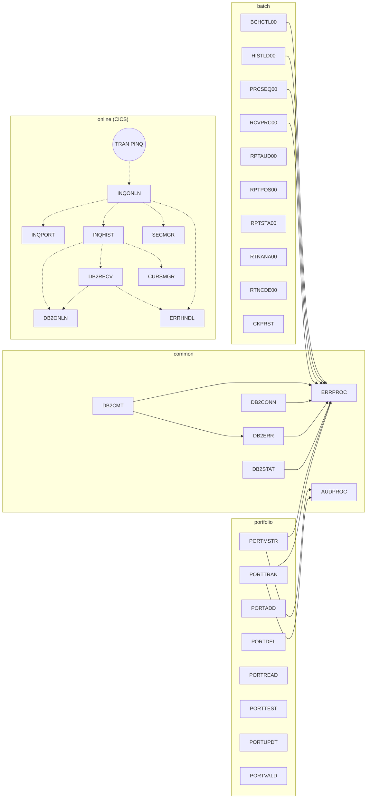

# Source Inventory — COBOL Legacy Benchmark Suite

Plan step `s1.1` (Discovery and scope). Every file under `src/` (87 files) appears exactly once in sections 1–6; anomalies are collected in section 9.

Counts are measured from the tree (`find src -type f`, `wc -l`), not from the architecture documentation; where they differ from the ticket/architecture doc the difference is listed in section 9.

| Category | Files | Lines |
| --- | ---: | ---: |
| Programs `src/programs/**/*.cbl` | 38 | 6,399 |
| Program templates `src/templates/**/*.cbl` | 4 | 708 |
| Copybooks `src/copybook/**/*.cpy` | 20 | 865 |
| JCL `src/jcl/**/*.jcl` | 15 | 251 |
| JCL READMEs `src/jcl/**/README.md` | 2 | 0 |
| BMS mapset `src/maps` | 1 | 100 |
| CICS CSD `src/cics` | 1 | 99 |
| DB2 DDL/BIND `src/database/db2` | 5 | 292 |
| VSAM definitions `src/database/vsam` | 1 | 99 |
| **Total** | **87** | |

Legend: **CICS** = contains `EXEC CICS`; **SQL** = contains `EXEC SQL`; **Copybooks** = `COPY` statements found in the source; **Calls** = static `CALL 'X'` (batch) or `EXEC CICS LINK PROGRAM('X')` (online); **JCL** = job whose `EXEC PGM=` names the program.

## 1. Programs (`src/programs`)

### 1.1 `batch/` — batch control, DB2 load, reporting (11 files, 1,897 lines)

| File | PROGRAM-ID | Lines | Role | CICS | SQL | Copybooks | Calls | Files (ASSIGN) | JCL |
| --- | --- | ---: | --- | :-: | :-: | --- | --- | --- | --- |
| `batch/BCHCTL00.cbl` | BCHCTL00 | 126 | Batch Control Processor — reads/updates the batch control file (job status, sequencing) | – | – | BCHCTL, BCHCON, ERRHAND | ERRPROC | BCHCTL | none |
| `batch/CKPRST.cbl` | CKPRST | 56 | Checkpoint/restart subroutine (writes/reads checkpoint VSAM record) | – | – | CKPRST (×2), RETHND | – | CKPTFILE | none |
| `batch/HISTLD00.cbl` | HISTLD00 | 232 | Position History DB2 Load — reads TRANHIST, inserts into `POSHIST`, uses batch control | – | Y | HISTREC, BCHCTL, DBTBLS, SQLCA, DBPROC, ERRHAND, BCHCON | ERRPROC | TRANHIST, BCHCTL | none |
| `batch/POSUPDT.cbl` | *(none — empty file)* | 0 | Named by architecture doc as the core position-update program | – | – | – | – | – | none |
| `batch/PRCSEQ00.cbl` | PRCSEQ00 | 344 | Process Sequence Manager — drives process steps from the PRCSEQ file, maintains BCHCTL | – | – | PRCSEQ, BCHCTL, BCHCON, ERRHAND | ERRPROC | PRCSEQ, BCHCTL | none |
| `batch/RCVPRC00.cbl` | RCVPRC00 | 301 | Process Recovery Handler — restarts failed sequences using BCHCTL/PRCSEQ | – | – | BCHCTL, PRCSEQ, BCHCON, ERRHAND | ERRPROC | BCHCTL, PRCSEQ | none |
| `batch/RPTAUD00.cbl` | RPTAUD00 | 146 | Audit Report Generator (security/audit/error trail) | – | – | AUDITLOG, ERRHAND, RTNCODE | – | AUDITLOG, ERRLOG, RPTFILE | `batch/RPTAUD.jcl` |
| `batch/RPTPOS00.cbl` | RPTPOS00 | 159 | Daily Position Report Generator | – | – | POSREC, TRNREC, RTNCODE, ERRHAND | – | POSMSTRE, TRANHIST, RPTFILE | `batch/RPTPOS.jcl` |
| `batch/RPTSTA00.cbl` | RPTSTA00 | 184 | System Statistics Report Generator | – | – | DB2STAT (**missing**), BCHCTL, RTNCODE, ERRHAND | – | DB2STATS, BCHSTATS, RPTFILE | `batch/RPTSTA.jcl` |
| `batch/RTNANA00.cbl` | RTNANA00 | 209 | Return Code Analysis Utility — cursor over `RTNCODES`, writes trend report | – | Y | *(none)* | – | RPTFILE | `RTNANA.jcl` |
| `batch/RTNCDE00.cbl` | RTNCDE00 | 140 | Standard Return Code Handler — inserts/queries `RTNCODES` | – | Y | RTNCODE | – | – | none |

### 1.2 `common/` — shared subroutines (6 files, 949 lines)

| File | PROGRAM-ID | Lines | Role | CICS | SQL | Copybooks | Calls | Files (ASSIGN) | JCL |
| --- | --- | ---: | --- | :-: | :-: | --- | --- | --- | --- |
| `common/AUDPROC.cbl` | AUDPROC | 95 | Audit Trail Processing Subroutine — writes `AUDIT-RECORD` to AUDFILE | – | – | AUDITLOG | – | AUDFILE | none (called) |
| `common/DB2CMT.cbl` | DB2CMT | 169 | DB2 Commit Controller — commit/rollback by unit-of-work counters | – | Y | SQLCA, DBPROC, ERRHAND | ERRPROC, DB2ERR | – | none (called) |
| `common/DB2CONN.cbl` | DB2CONN | 153 | DB2 Connection Manager — connect/disconnect with retry | – | Y | SQLCA, DBPROC, ERRHAND | ERRPROC, DELAY (system) | – | none (called) |
| `common/DB2ERR.cbl` | DB2ERR | 199 | DB2 SQL Error Handler — classifies SQLCODE, writes `ERRLOG` | – | Y | DBTBLS (REPLACING), SQLCA, DBPROC, ERRHAND | ERRPROC | – | none (called) |
| `common/DB2STAT.cbl` | DB2STAT | 227 | DB2 Statistics Collector — inserts/aggregates per-program statistics | – | Y | SQLCA, DBPROC, ERRHAND | ERRPROC | – | none |
| `common/ERRPROC.cbl` | ERRPROC | 106 | Standard Error Processing Subroutine — formats and writes ERRLOG | – | – | ERRHAND | – | ERRLOG | none (called) |

### 1.3 `online/` — CICS inquiry (8 files, 1,075 lines; all use `EXEC CICS`, all but one use `EXEC SQL`)

| File | PROGRAM-ID | Lines | Role | CICS | SQL | Copybooks | LINKs to | CSD |
| --- | --- | ---: | --- | :-: | :-: | --- | --- | --- |
| `online/CURSMGR.cbl` | CURSMGR | 90 | Cursor Management (open/fetch/close for online programs) | Y | Y | *(none)* | – | PROGRAM(CURSMGR) |
| `online/DB2ONLN.cbl` | DB2ONLN | 119 | Online DB2 Connection Manager (connection pool/reuse) | Y | Y | ERRHND | – | PROGRAM(DB2ONLN) |
| `online/DB2RECV.cbl` | DB2RECV | 144 | DB2 Recovery Manager (reconnect / retry) | Y | Y | ERRHND, DB2REQ | DB2ONLN, ERRHNDL | PROGRAM(DB2RECV) |
| `online/ERRHNDL.cbl` | ERRHNDL | 117 | Centralized online error handler — logs to `ERRLOG`, sends ERRMAP | Y | Y | ERRHND (×2) | – | **not defined** |
| `online/INQHIST.cbl` | INQHIST | 192 | Transaction History Inquiry — dynamic SQL over `POSHIST`, HISMAP | Y | Y | INQCOM (×2) | DB2ONLN, DB2RECV, CURSMGR | PROGRAM(INQHIST) |
| `online/INQONLN.cbl` | INQONLN | 170 | Portfolio Online Inquiry main handler — transaction `PINQ`, MENMAP | Y | – | INQCOM (×2), ERRHND | INQPORT, INQHIST, ERRHNDL, SECMGR | TRANSACTION(PINQ), PROGRAM(INQONLN) |
| `online/INQPORT.cbl` | INQPORT | 109 | Portfolio Position Inquiry — `EXEC CICS READ FILE('POSFILE')`, POSMAP | Y | Y | INQCOM (×2), POSREC | – | PROGRAM(INQPORT) |
| `online/SECMGR.cbl` | SECMGR | 134 | Security Manager — `AUTHFILE` lookup, `SESSION` table, `AUDITLOG` insert | Y | Y | ERRHND | – | PROGRAM(SECMGR) |

### 1.4 `portfolio/` — VSAM portfolio master maintenance (8 files, 1,449 lines)

| File | PROGRAM-ID | Lines | Role | CICS | SQL | Copybooks | Calls | Files (ASSIGN) | JCL |
| --- | --- | ---: | --- | :-: | :-: | --- | --- | --- | --- |
| `portfolio/PORTADD.cbl` | PORTADD | 147 | Portfolio Addition — loads new portfolio records from INPTFILE | – | – | PORTFLIO (×2) | – | PORTFILE, INPTFILE | `portfolio/PORTADD.jcl` |
| `portfolio/PORTDEL.cbl` | PORTDEL | 193 | Portfolio Deletion — processes deletion requests, writes audit | – | – | PORTFLIO | – | PORTFILE, DELEFILE, AUDFILE | `portfolio/PORTDEL.jcl` |
| `portfolio/PORTMSTR.cbl` | PORTMSTR | 287 | Portfolio Master File Maintenance — CRUD subroutine over PORTFILE | – | – | *(none — inline layout)* | ERRPROC, AUDPROC | PORTFILE | none |
| `portfolio/PORTREAD.cbl` | PORTREAD | 110 | Portfolio Record Reading (sequential read/display) | – | – | PORTFLIO | – | PORTFILE | `portfolio/PORTREAD.jcl` |
| `portfolio/PORTTEST.cbl` | PORTTEST | 118 | Portfolio Test Data Generator (writes TESTFILE) | – | – | PORTFLIO, ERRHAND | – | TESTFILE | `portfolio/PORTTEST.jcl` |
| `portfolio/PORTTRAN.cbl` | PORTTRAN | 316 | Portfolio Transaction Processing — applies TRANFILE to PORTFILE | – | – | TRNREC, PORTREC (**missing**), ERRHAND, AUDITLOG | AUDPROC, ERRPROC | TRANFILE, PORTFILE | none |
| `portfolio/PORTUPDT.cbl` | PORTUPDT | 159 | Portfolio Update — applies UPDTFILE changes to PORTFILE | – | – | PORTFLIO | – | PORTFILE, UPDTFILE | `portfolio/PORTUPDT.jcl` |
| `portfolio/PORTVALD.cbl` | PORTVALD | 119 | Portfolio Validation Subroutine (field/rule checks) | – | – | PORTVAL | – | – | none (called) |

### 1.5 `test/` — test tooling (2 files, 439 lines)

| File | PROGRAM-ID | Lines | Role | CICS | SQL | Copybooks | Calls | Files (ASSIGN) | JCL |
| --- | --- | ---: | --- | :-: | :-: | --- | --- | --- | --- |
| `test/TSTGEN00.cbl` | TSTGEN00 | 215 | Test Data Generator (portfolio + transaction data from config/seed) | – | – | PORTFLIO (REPLACING), TRNREC (REPLACING), RTNCODE, ERRHAND | – | TSTCFG, PORTOUT, TRANOUT, RANDSEED | `test/TSTGEN.jcl` |
| `test/TSTVAL00.cbl` | TSTVAL00 | 224 | Test Validation Suite (expected vs. actual comparison report) | – | – | RTNCODE, ERRHAND | – | TESTCASE, EXPECTED, ACTUAL, TESTRPT | `test/TSTVAL.jcl` |

### 1.6 `utility/` — operations utilities (3 files, 590 lines)

| File | PROGRAM-ID | Lines | Role | CICS | SQL | Copybooks | Calls | Files (ASSIGN) | JCL |
| --- | --- | ---: | --- | :-: | :-: | --- | --- | --- | --- |
| `utility/UTLMNT00.cbl` | UTLMNT00 | 181 | File Maintenance Utility (archive/purge per control file) | – | – | RTNCODE, ERRHAND | – | CTLFILE, ARCHFILE, RPTFILE | `utility/UTLMNT.jcl` |
| `utility/UTLMON00.cbl` | UTLMON00 | 220 | System Monitoring Utility (health/alerts) | – | – | DB2STAT (**missing**), RTNCODE, ERRHAND | ILBOABN0 (system abend) | MONCFG, MONLOG, ALERTS, DB2STATS | `utility/UTLMON.jcl` |
| `utility/UTLVAL00.cbl` | UTLVAL00 | 189 | Data Validation Utility (integrity checks on position/transaction files) | – | – | POSREC, TRNREC, RTNCODE, ERRHAND | – | VALCTL, POSMSTRE, TRANHIST, ERRRPT | `utility/UTLVAL.jcl` |

## 2. Program templates (`src/templates`, 4 files, 708 lines)

Skeletons, not deployable programs; they have placeholder PROGRAM-IDs and no JCL.

| File | PROGRAM-ID | Lines | Role | CICS | SQL | Notes |
| --- | --- | ---: | --- | :-: | :-: | --- |
| `templates/database/db2-handling.cbl` | DB2HNDL | 245 | Template for DB2 interaction patterns | – | Y | inline SQLCA |
| `templates/error/error-handling.cbl` | ERRHANDL | 186 | Template for error-handling patterns | – | – | `CALL 'CEE3ABD'` (LE abend) |
| `templates/program/file-handling.cbl` | FILEHNDL | 188 | Template for VSAM KSDS + sequential file handling | – | – | |
| `templates/program/standard-program.cbl` | PROGNAME | 89 | Standard program skeleton | – | – | |

## 3. Copybooks (`src/copybook`, 20 files, 865 lines)

| File | Lines | 01-level records / groups | Used by (COPY) |
| --- | ---: | --- | --- |
| `batch/BCHCON.cpy` | 64 | `BATCH-CONTROL-CONSTANTS` (status codes, record types) | BCHCTL00, HISTLD00, PRCSEQ00, RCVPRC00 |
| `batch/BCHCTL.cpy` | 48 | `BATCH-CONTROL-RECORD` (job-level control / sequencing record) | BCHCTL00, HISTLD00, PRCSEQ00, RCVPRC00, RPTSTA00 |
| `batch/CKPRST.cpy` | 75 | `CHECKPOINT-CONTROL`, `CHECKPOINT-RECORD` (checkpoint VSAM record) | CKPRST (×2) |
| `batch/PRCSEQ.cpy` | 74 | `PROCESS-SEQUENCE-RECORD`, `STANDARD-SEQUENCES` | PRCSEQ00, RCVPRC00 |
| `common/AUDITLOG.cpy` | 35 | `AUDIT-RECORD` (audit trail record) | AUDPROC, RPTAUD00, PORTTRAN |
| `common/COMMON.cpy` | 63 | `RETURN-CODES`, `STATUS-CODES`, `TRANSACTION-TYPES`, `COMMON-DATETIME`, `ERROR-HANDLING`, `AUDIT-FIELDS`, `CURRENCY-CODES` | **none** |
| `common/ERRHAND.cpy` | 55 | `ERR-CATEGORIES`, `ERR-RETURN-CODES`, `ERR-MESSAGE`, `ERR-VSAM-STATUSES`, `ERR-VSAM-MSGS` | BCHCTL00, HISTLD00, PRCSEQ00, RCVPRC00, RPTAUD00, RPTPOS00, RPTSTA00, DB2CMT, DB2CONN, DB2ERR, DB2STAT, ERRPROC, PORTTEST, PORTTRAN, TSTGEN00, TSTVAL00, UTLMNT00, UTLMON00, UTLVAL00 |
| `common/HISTREC.cpy` | 38 | `HISTORY-RECORD` (PT/PS/TR history record) | HISTLD00 |
| `common/PORTFLIO.cpy` | 33 | `PORT-RECORD` (portfolio master record, VSAM PORTMSTR) | PORTADD (×2), PORTDEL, PORTREAD, PORTTEST, PORTUPDT, TSTGEN00 (REPLACING) |
| `common/PORTVAL.cpy` | 45 | `VAL-RETURN-CODES`, `VAL-ERROR-MESSAGES`, `VAL-CONSTANTS`, `VAL-WORK-AREAS` | PORTVALD |
| `common/POSREC.cpy` | 32 | `POSITION-RECORD` | RPTPOS00, INQPORT, UTLVAL00 |
| `common/RETHND.cpy` | 65 | `RETURN-HANDLING`, `STD-ERROR-CODES` | CKPRST |
| `common/RTNCODE.cpy` | 31 | `RETURN-CODE-AREA` | RPTAUD00, RPTPOS00, RPTSTA00, RTNCDE00, TSTGEN00, TSTVAL00, UTLMNT00, UTLMON00, UTLVAL00 |
| `common/TRNREC.cpy` | 39 | `TRANSACTION-RECORD` | RPTPOS00, PORTTRAN, TSTGEN00 (REPLACING), UTLVAL00 |
| `db2/DBPROC.cpy` | 62 | `DB2-ERROR-HANDLING` (SQLCODE classification, retry counters) | HISTLD00, DB2CMT, DB2CONN, DB2ERR, DB2STAT |
| `db2/DBTBLS.cpy` | 49 | `POSHIST-RECORD`, `ERRLOG-RECORD` (host-variable layouts for DB2 tables) | HISTLD00, DB2ERR (REPLACING) |
| `db2/SQLCA.cpy` | 14 | `SQL-STATUS-CODES` (not the IBM SQLCA; named constants only) | HISTLD00, DB2CMT, DB2CONN, DB2ERR, DB2STAT |
| `online/DB2REQ.cpy` | 12 | `DB2-REQUEST-AREA` (COMMAREA for DB2ONLN/DB2RECV) | DB2RECV |
| `online/ERRHND.cpy` | 20 | `ERROR-HANDLING` (online error area) | DB2ONLN, DB2RECV, ERRHNDL (×2), INQONLN, SECMGR |
| `online/INQCOM.cpy` | 11 | `INQCOM-AREA` (inquiry COMMAREA) | INQHIST (×2), INQONLN (×2), INQPORT (×2) |

Copybooks referenced by `COPY` but absent from the tree: `PORTREC` (PORTTRAN), `DB2STAT` (RPTSTA00, UTLMON00) — see section 9.

## 4. JCL (`src/jcl`, 15 jobs + 2 READMEs)

| File | Lines | Job | Step → PGM | DD names → datasets |
| --- | ---: | --- | --- | --- |
| `RTNANA.jcl` | 9 | RTNANA00 | RTNANA → RTNANA00 | STEPLIB=PROD.LOAD.LIBRARY; RPTFILE=SYSOUT; SYSOUT/SYSUDUMP/SYSPRINT |
| `batch/RPTAUD.jcl` | 15 | RPTAUD00 | STEP01 → RPTAUD00 | STEPLIB=PROD.LOAD.LIBRARY; AUDITLOG=PROD.AUDIT.LOG; ERRLOG=PROD.ERROR.LOG; RPTFILE=PROD.AUDIT.REPORT (new) |
| `batch/RPTPOS.jcl` | 15 | RPTPOS00 | STEP01 → RPTPOS00 | STEPLIB=PROD.LOAD.LIBRARY; POSMSTRE=PROD.POSITION.MASTER; TRANHIST=PROD.TRANSACTION.HISTORY; RPTFILE=PROD.DAILY.POSITION.REPORT (new) |
| `batch/RPTSTA.jcl` | 15 | RPTSTA00 | STEP01 → RPTSTA00 | STEPLIB=PROD.LOAD.LIBRARY; DB2STATS=PROD.DB2.STATISTICS; BCHSTATS=PROD.BATCH.STATISTICS; RPTFILE=PROD.SYSTEM.STATS.REPORT (new) |
| `batch/README.md` | 0 | – | – | empty file |
| `portfolio/PORTADD.jcl` | 15 | PORTADD | STEP1 → PORTADD | STEPLIB=YOUR.LOADLIB; PORTFILE=PORTFOLIO.MASTER.FILE; INPTFILE=PORTFOLIO.INPUT.FILE |
| `portfolio/PORTDEF.jcl` | 32 | PORTDEF | DEFVSAM → IDCAMS (utility) | SYSIN=inline DEFINE CLUSTER for PORTFOLIO.MASTER.FILE |
| `portfolio/PORTDEL.jcl` | 16 | PORTDEL | STEP1 → PORTDEL | STEPLIB=YOUR.LOADLIB; PORTFILE=PORTFOLIO.MASTER.FILE; DELEFILE=PORTFOLIO.DELETE.FILE; AUDFILE=PORTFOLIO.AUDIT.FILE (MOD) |
| `portfolio/PORTREAD.jcl` | 14 | PORTREAD | STEP1 → PORTREAD | STEPLIB=YOUR.LOADLIB; PORTFILE=PORTFOLIO.MASTER.FILE |
| `portfolio/PORTTEST.jcl` | 17 | PORTTEST | STEP1 → PORTTEST | STEPLIB=YOUR.LOADLIB; TESTFILE=PORTFOLIO.TEST.FILE (new) |
| `portfolio/PORTUPDT.jcl` | 15 | PORTUPDT | STEP1 → PORTUPDT | STEPLIB=YOUR.LOADLIB; PORTFILE=PORTFOLIO.MASTER.FILE; UPDTFILE=PORTFOLIO.UPDATE.FILE |
| `test/TSTGEN.jcl` | 19 | TSTGEN00 | STEP01 → TSTGEN00 | STEPLIB=TEST.LOAD.LIBRARY; TSTCFG=TEST.CONFIG.FILE; PORTOUT=TEST.PORTFOLIO.DATA (new); TRANOUT=TEST.TRANSACTION.DATA (new); RANDSEED=TEST.RANDOM.SEED |
| `test/TSTVAL.jcl` | 16 | TSTVAL00 | STEP01 → TSTVAL00 | STEPLIB=TEST.LOAD.LIBRARY; TESTCASE=TEST.CASE.FILE; EXPECTED=TEST.EXPECTED.RESULTS; ACTUAL=TEST.ACTUAL.RESULTS; TESTRPT=TEST.VALIDATION.REPORT (new) |
| `utility/README.md` | 0 | – | – | empty file |
| `utility/UTLMNT.jcl` | 18 | UTLMNT00 | STEP01 → UTLMNT00 | STEPLIB=PROD.LOAD.LIBRARY; CTLFILE=PROD.CONTROL.FILE; ARCHFILE=PROD.ARCHIVE.FILE (new); RPTFILE=PROD.MAINTENANCE.REPORT (new) |
| `utility/UTLMON.jcl` | 19 | UTLMON00 | STEP01 → UTLMON00 | STEPLIB=PROD.LOAD.LIBRARY; MONCFG=PROD.MONITOR.CONFIG; MONLOG=PROD.MONITOR.LOG (new); ALERTS=PROD.MONITOR.ALERTS (new); DB2STATS=PROD.DB2.STATISTICS |
| `utility/UTLVAL.jcl` | 16 | UTLVAL00 | STEP01 → UTLVAL00 | STEPLIB=PROD.LOAD.LIBRARY; VALCTL=PROD.VALIDATION.CONTROL; POSMSTRE=PROD.POSITION.MASTER; TRANHIST=PROD.TRANSACTION.HISTORY; ERRRPT=PROD.VALIDATION.REPORT (new) |

All jobs also allocate `SYSOUT`, `SYSPRINT`, `SYSUDUMP` to `SYSOUT=*`. Every JCL job is single-step. Programs with **no** JCL: BCHCTL00, CKPRST, HISTLD00, POSUPDT, PRCSEQ00, RCVPRC00, RTNCDE00, PORTMSTR, PORTTRAN, DB2STAT, and all callable subroutines.

## 5. Online definitions

| File | Lines | Contents |
| --- | ---: | --- |
| `src/maps/INQSET.bms` | 100 | Mapset `INQSET` (MODE=INOUT, LANG=COBOL) with 4 maps, all 24×80: `MENMAP` (menu; field `OPTION`, `ERRMSG`), `POSMAP` (position inquiry; `ACCTIN`, `FUNDOUT`, `NAMEOUT`, `UNITOUT`, `COSTOUT`, `VALOUT`, `POSMSG`), `HISMAP` (history; `HISAIN`, `ROW1`–`ROW10`, `HISMSG`), `ERRMAP` (`ERRCOUT`, `ERRDOUT`). |
| `src/cics/PORTDFN.csd` | 99 | Group `PORTGRP`: `TRANSACTION(PINQ)`→INQONLN; `PROGRAM` INQONLN, INQPORT, INQHIST, DB2ONLN, CURSMGR, DB2RECV, SECMGR; `MAPSET(INQSET)`; `FILE(POSFILE)`→`PORTFOLIO.POSITION.VSAM` (RECORDSIZE 200, read/browse/add only); `DB2ENTRY(PORTDB2)`; `DB2TRAN(PINQ)`; `LIST(PORTLST)`. |

## 6. Database definitions

| File | Lines | Objects |
| --- | ---: | --- |
| `src/database/db2/ERRLOG.sql` | 64 | `TABLESPACE ERRLOG`, `TABLE ERRLOG`, indexes `ERRLOG_PK`, `ERRLOG_IX1`, comments, grants, `PROCEDURE ERRLOG_CLEANUP` |
| `src/database/db2/PORTPLAN.sql` | 9 | `BIND PLAN PORTPLAN PKLIST(*.PORTPKG.*) ISOLATION(CS) …` |
| `src/database/db2/POSHIST.sql` | 98 | `DATABASE POSMVP`, `TABLESPACE POSHIST`, `TABLE POSHIST`, indexes `POSHIST_PK`, `POSHIST_IX1`, `POSHIST_IX2`, comments, grants |
| `src/database/db2/RTNCODES.sql` | 17 | `TABLE RTNCODES`, indexes `RTNCODES_PRG_IDX`, `RTNCODES_STS_IDX` |
| `src/database/db2/db2-definitions.sql` | 104 | Tables `PORTFOLIO_MASTER`, `INVESTMENT_POSITIONS`, `TRANSACTION_HISTORY`; indexes `IDX_PORT_MASTER_CLIENT`, `IDX_POSITIONS_DATE`, `IDX_TRANS_HIST_PORT`, `IDX_TRANS_HIST_DATE`; views `ACTIVE_PORTFOLIOS`, `CURRENT_POSITIONS` |
| `src/database/vsam/vsam-definitions.txt` | 99 | KSDS specs for `PORTMSTR` (LRECL 400, key 12 @1), `TRANHIST` (LRECL 300, key 20 @1), `POSHIST` (LRECL 350, key 18 @1) plus sample IDCAMS `DEFINE CLUSTER` for `PORTFOLIO.MASTER.FILE` |

DB2 tables referenced from programs: `POSHIST` (HISTLD00, INQHIST), `ERRLOG` (DB2ERR, ERRHNDL), `RTNCODES` (RTNCDE00, RTNANA00), `AUTHFILE`, `SESSION`, `AUDITLOG` (SECMGR — no DDL, see section 9). DB2STAT inserts into a statistics table defined only inside the program.

## 7. Call graph

Solid edges = static `CALL`; dashed = `EXEC CICS LINK`; dotted = JCL `EXEC PGM=`. System routines (`DELAY`, `ILBOABN0`, `CEE3ABD`) omitted.

Observations: nothing calls `DB2CONN`, `DB2CMT`, `DB2STAT`, `CKPRST`, `PORTMSTR`, `PORTVALD`, `RTNCDE00`; the architecture doc's `BCHCTL00 → POSUPDT` and `POSUPDT → DB2CONN` edges have no code behind them. The only JCL-driven entry points are the 14 programs listed in section 4 (plus IDCAMS).

## 8. Copybook-usage matrix

`x` = `COPY` present; `2` = copied twice; `R` = with `REPLACING`. Columns are the 20 real copybooks plus the two missing ones (`PORTREC`, `DB2STAT`). `COMMON.cpy` has no users.

| Program | BCHCON | BCHCTL | CKPRST | PRCSEQ | AUDITLOG | ERRHAND | HISTREC | PORTFLIO | PORTVAL | POSREC | RETHND | RTNCODE | TRNREC | DBPROC | DBTBLS | SQLCA | DB2REQ | ERRHND | INQCOM | *PORTREC* | *DB2STAT* |
| --- | :-: | :-: | :-: | :-: | :-: | :-: | :-: | :-: | :-: | :-: | :-: | :-: | :-: | :-: | :-: | :-: | :-: | :-: | :-: | :-: | :-: |
| BCHCTL00 | x | x | | | | x | | | | | | | | | | | | | | | |
| CKPRST | | | 2 | | | | | | | | x | | | | | | | | | | |
| HISTLD00 | x | x | | | | x | x | | | | | | | x | x | x | | | | | |
| PRCSEQ00 | x | x | | x | | x | | | | | | | | | | | | | | | |
| RCVPRC00 | x | x | | x | | x | | | | | | | | | | | | | | | |
| RPTAUD00 | | | | | x | x | | | | | | x | | | | | | | | | |
| RPTPOS00 | | | | | | x | | | | x | | x | x | | | | | | | | |
| RPTSTA00 | | x | | | | x | | | | | | x | | | | | | | | | x |
| RTNCDE00 | | | | | | | | | | | | x | | | | | | | | | |
| AUDPROC | | | | | x | | | | | | | | | | | | | | | | |
| DB2CMT | | | | | | x | | | | | | | | x | | x | | | | | |
| DB2CONN | | | | | | x | | | | | | | | x | | x | | | | | |
| DB2ERR | | | | | | x | | | | | | | | x | R | x | | | | | |
| DB2STAT | | | | | | x | | | | | | | | x | | x | | | | | |
| ERRPROC | | | | | | x | | | | | | | | | | | | | | | |
| DB2ONLN | | | | | | | | | | | | | | | | | | x | | | |
| DB2RECV | | | | | | | | | | | | | | | | | x | x | | | |
| ERRHNDL | | | | | | | | | | | | | | | | | | 2 | | | |
| INQHIST | | | | | | | | | | | | | | | | | | | 2 | | |
| INQONLN | | | | | | | | | | | | | | | | | | x | 2 | | |
| INQPORT | | | | | | | | | | x | | | | | | | | | 2 | | |
| SECMGR | | | | | | | | | | | | | | | | | | x | | | |
| PORTADD | | | | | | | | 2 | | | | | | | | | | | | | |
| PORTDEL | | | | | | | | x | | | | | | | | | | | | | |
| PORTREAD | | | | | | | | x | | | | | | | | | | | | | |
| PORTTEST | | | | | | x | | x | | | | | | | | | | | | | |
| PORTTRAN | | | | | x | x | | | | | | | x | | | | | | | x | |
| PORTUPDT | | | | | | | | x | | | | | | | | | | | | | |
| PORTVALD | | | | | | | | | x | | | | | | | | | | | | |
| TSTGEN00 | | | | | | x | | R | | | | x | R | | | | | | | | |
| TSTVAL00 | | | | | | x | | | | | | x | | | | | | | | | |
| UTLMNT00 | | | | | | x | | | | | | x | | | | | | | | | |
| UTLMON00 | | | | | | x | | | | | | x | | | | | | | | | x |
| UTLVAL00 | | | | | | x | | | | x | | x | x | | | | | | | | |

Programs with no `COPY`: POSUPDT (empty), RTNANA00, CURSMGR, PORTMSTR, and the four templates.

## 9. Anomalies

1. **`src/programs/batch/POSUPDT.cbl` is 0 bytes.** `documentation/technical/system-architecture.md` names POSUPDT (a.k.a. POSUPD00) as the core position-update batch program with dependencies on DB2CONN/ERRPROC; there is no source, no JCL, and nothing calls it.
2. **`COPY PORTREC` has no copybook.** `src/programs/portfolio/PORTTRAN.cbl:40` copies `PORTREC`; the only portfolio layout is `PORTFLIO.cpy` (`PORT-RECORD`). PORTTRAN cannot compile as-is.
3. **`COPY DB2STAT` has no copybook.** `RPTSTA00.cbl:35` and `UTLMON00.cbl:43` copy `DB2STAT`; `DB2STAT` exists only as a program (`common/DB2STAT.cbl`). Both programs cannot compile as-is.
4. **No sample data files are checked in.** `documentation/operations/test-data-specs.md` describes sample portfolio/transaction records, but there is no `data/` directory or any `.dat`/`.txt` fixture in the repository; PORTTEST/TSTGEN00 are the only ways to produce data.
5. **Counts differ from the ticket/architecture doc.** Actual: 38 programs (plus 4 templates) — not 40; 20 copybooks — not 21; 15 JCL jobs — not 18. `src/jcl/batch/README.md` and `src/jcl/utility/README.md` are both 0 bytes.
6. **`ERRHNDL` is LINKed to but not defined in `PORTDFN.csd`** (INQONLN, DB2RECV link to it; no `DEFINE PROGRAM(ERRHNDL)`). `ERRHNDL.cbl` is also written in column 1 (free-format) unlike every other program, so it needs a different compile option.
7. **Uncalled / undriven programs.** DB2CONN, DB2CMT, DB2STAT, CKPRST, PORTMSTR, PORTVALD, RTNCDE00, HISTLD00, BCHCTL00, PRCSEQ00, RCVPRC00, PORTTRAN have neither a caller in `src/` nor a JCL job. The whole batch control/checkpoint framework (BCHCTL00→PRCSEQ00→RCVPRC00→CKPRST) is therefore reachable only from documentation.
8. **DB2 objects referenced without DDL.** SECMGR reads `AUTHFILE`, updates `SESSION` and inserts into `AUDITLOG` as DB2 tables; DB2STAT inserts into a statistics table. None are defined in `src/database/db2`. Conversely `PORTFOLIO_MASTER`, `INVESTMENT_POSITIONS`, `TRANSACTION_HISTORY` and the two views in `db2-definitions.sql` are not referenced by any program.
9. **`COMMON.cpy` is unused**, and its `ERROR-HANDLING` group has the same name as the 01-level in `online/ERRHND.cpy`, so the two cannot be copied into one program.
10. **`CKPRST.cbl` copies `CKPRST.cpy` twice** (FD and LINKAGE SECTION), which duplicates both 01-level names (`CHECKPOINT-CONTROL`, `CHECKPOINT-RECORD`) in one program. `PORTADD.cbl` likewise copies `PORTFLIO` under two FDs (duplicate `PORT-RECORD`); `ERRHNDL`, `INQHIST`, `INQONLN`, `INQPORT` copy `ERRHND`/`INQCOM` twice (WORKING-STORAGE + LINKAGE).
11. **`db2/SQLCA.cpy` is not the SQLCA.** It only defines `SQL-STATUS-CODES` constants; programs that need the real SQLCA use `EXEC SQL INCLUDE SQLCA`.
12. **Record-length mismatches.** `PORTDFN.csd` defines `POSFILE` with RECORDSIZE 200 while `vsam-definitions.txt` specifies POSHIST LRECL 350 and PORTMSTR LRECL 400; INQPORT reads POSFILE into `POSITION-RECORD` (POSREC.cpy).
13. **Loadlib placeholders.** Portfolio JCL uses `YOUR.LOADLIB`; batch/utility JCL uses `PROD.LOAD.LIBRARY`; test JCL uses `TEST.LOAD.LIBRARY`. `RTNANA.jcl` sits at the `src/jcl` root instead of `src/jcl/batch`.
14. **Environment build notes mention `PORTLOAD`** as an executable, but there is no `PORTLOAD.cbl` in `src/`.
