# COBOL Legacy Benchmark Suite — Dependency Graph & System Overview

## Table of Contents

- [System Overview](#system-overview)
- [High-Level Architecture (ASCII)](#high-level-architecture)
- [Program Call Graph (Mermaid)](#program-call-graph)
- [Copybook Dependency Map (Mermaid)](#copybook-dependency-map)
- [System Architecture (Mermaid)](#system-architecture-overview)
- [Program Dependency Summary](#program-dependency-summary)
- [Copybook Cross-Reference](#copybook-cross-reference)
- [JCL Job Orchestration](#jcl-job-orchestration)
- [Key Architectural Patterns](#key-architectural-patterns)

---

## System Overview

The COBOL Legacy Benchmark Suite implements a production-grade **Investment Portfolio Management System** spanning four architectural layers: **Online/CICS** (real-time terminal inquiries), **Batch Processing** (high-volume transaction validation, reporting, and position updates), **Portfolio Management** (VSAM-based CRUD operations on portfolio master records), and **Common Services** (shared DB2 connectivity, error handling, and audit trail processing).

The system comprises **38 COBOL programs**, **20 copybooks**, and **15 JCL jobs**. Programs communicate via `CALL` statements (batch layer), `EXEC CICS LINK` commands (online layer), and shared copybook data structures. Data persistence is split between **VSAM files** (position master, portfolio records) and **DB2 tables** (transaction history, audit logs, security), with sequential files used for reports and batch control.

The dependency graph below reveals a layered architecture with clear separation of concerns: the Online layer handles real-time inquiries through CICS transactions, the Batch layer processes high-volume operations through JCL-orchestrated job steps, and both layers converge on the Common Services layer for DB2 access, error handling, and audit logging.

---

## High-Level Architecture

```
┌──────────────────────────────────────────────────────────────────────────┐
│                        ONLINE LAYER (CICS/BMS)                          │
│                                                                          │
│   ┌───────────┐    ┌───────────┐    ┌───────────┐                       │
│   │  INQONLN  │───▶│  INQPORT  │    │  INQHIST  │                       │
│   │  (Main    │───▶│  (Position│    │  (History  │                       │
│   │  Inquiry) │    │   Inquiry)│    │   Inquiry) │                       │
│   └─────┬─────┘    └───────────┘    └─────┬─────┘                       │
│         │                                  │                             │
│         ▼                                  ▼                             │
│   ┌───────────┐    ┌───────────┐    ┌───────────┐    ┌───────────┐      │
│   │  SECMGR   │    │  DB2ONLN  │    │  CURSMGR  │    │  DB2RECV  │      │
│   │ (Security)│    │ (DB2 Conn)│    │ (Cursor   │    │ (DB2      │      │
│   └───────────┘    └───────────┘    │  Manager) │    │  Recovery)│      │
│                                     └───────────┘    └─────┬─────┘      │
│   ┌───────────┐                                            │            │
│   │  ERRHNDL  │◀───────────────────────────────────────────┘            │
│   │ (Error    │                                                          │
│   │  Handler) │                                                          │
│   └───────────┘                                                          │
└──────────────────────────────────┬───────────────────────────────────────┘
                                   │
                    ┌──────────────▼──────────────┐
                    │       DATA LAYER             │
                    │                              │
                    │  ┌────────┐  ┌────────────┐  │
                    │  │ VSAM   │  │    DB2      │  │
                    │  │ Files  │  │   Tables    │  │
                    │  │(POSFILE│  │(POSHIST,    │  │
                    │  │ PORT*) │  │ AUDIT,SEC)  │  │
                    │  └────────┘  └────────────┘  │
                    │  ┌────────────────────────┐  │
                    │  │   Sequential Files      │  │
                    │  │ (Reports, Logs, Config) │  │
                    │  └────────────────────────┘  │
                    └──────────────┬──────────────┘
                                   │
┌──────────────────────────────────▼───────────────────────────────────────┐
│                         BATCH LAYER (JCL)                                │
│                                                                          │
│   ┌───────────┐    ┌───────────┐    ┌───────────┐    ┌───────────┐      │
│   │ BCHCTL00  │    │ PRCSEQ00  │    │ RCVPRC00  │    │  CKPRST   │      │
│   │ (Batch    │    │ (Process  │    │ (Recovery │    │(Checkpoint│      │
│   │  Control) │    │  Sequence)│    │  Handler) │    │  Restart) │      │
│   └───────────┘    └───────────┘    └───────────┘    └───────────┘      │
│                                                                          │
│   ┌───────────┐    ┌───────────┐    ┌───────────┐                       │
│   │ HISTLD00  │    │  POSUPDT  │    │ RTNANA00  │                       │
│   │ (History  │    │ (Position │    │ (Return   │                       │
│   │  Load)    │    │  Update)  │    │  Analysis)│                       │
│   └───────────┘    └───────────┘    └───────────┘                       │
│                                                                          │
│   ┌───────────┐    ┌───────────┐    ┌───────────┐    ┌───────────┐      │
│   │ RPTAUD00  │    │ RPTPOS00  │    │ RPTSTA00  │    │ RTNCDE00  │      │
│   │ (Audit    │    │ (Position │    │(Statistics│    │ (Return   │      │
│   │  Report)  │    │  Report)  │    │  Report)  │    │  Codes)   │      │
│   └───────────┘    └───────────┘    └───────────┘    └───────────┘      │
└──────────────────────────────────┬───────────────────────────────────────┘
                                   │
┌──────────────────────────────────▼───────────────────────────────────────┐
│                      PORTFOLIO LAYER (VSAM)                              │
│                                                                          │
│   ┌───────────┐    ┌───────────┐    ┌───────────┐    ┌───────────┐      │
│   │  PORTADD  │    │ PORTUPDT  │    │  PORTDEL  │    │ PORTREAD  │      │
│   │  (Add)    │    │ (Update)  │    │ (Delete)  │    │ (Read)    │      │
│   └───────────┘    └───────────┘    └───────────┘    └───────────┘      │
│                                                                          │
│   ┌───────────┐    ┌───────────┐    ┌───────────┐    ┌───────────┐      │
│   │ PORTMSTR  │    │ PORTTRAN  │    │ PORTVALD  │    │ PORTTEST  │      │
│   │ (Master   │    │ (Trans-   │    │(Validate) │    │ (Test     │      │
│   │  Maint.)  │    │  action)  │    │           │    │  Data)    │      │
│   └─────┬─────┘    └─────┬─────┘    └───────────┘    └───────────┘      │
│         │                │                                               │
│         ▼                ▼                                               │
└──────────────────────────────────┬───────────────────────────────────────┘
                                   │
┌──────────────────────────────────▼───────────────────────────────────────┐
│                      COMMON SERVICES LAYER                               │
│                                                                          │
│   ┌───────────┐    ┌───────────┐    ┌───────────┐                       │
│   │  ERRPROC  │    │  AUDPROC  │    │  DB2CONN  │                       │
│   │ (Error    │    │ (Audit    │    │ (DB2      │                       │
│   │  Process) │    │  Trail)   │    │  Connect) │                       │
│   └───────────┘    └───────────┘    └───────────┘                       │
│                                                                          │
│   ┌───────────┐    ┌───────────┐    ┌───────────┐                       │
│   │  DB2CMT   │    │  DB2ERR   │    │  DB2STAT  │                       │
│   │ (Commit   │    │ (SQL      │    │(Statistics│                       │
│   │  Control) │    │  Errors)  │    │ Collect)  │                       │
│   └───────────┘    └───────────┘    └───────────┘                       │
└──────────────────────────────────────────────────────────────────────────┘
                                   │
┌──────────────────────────────────▼───────────────────────────────────────┐
│                    UTILITY & TEST LAYER                                   │
│                                                                          │
│   ┌───────────┐    ┌───────────┐    ┌───────────┐                       │
│   │ UTLMNT00  │    │ UTLMON00  │    │ UTLVAL00  │                       │
│   │ (File     │    │ (System   │    │ (Data     │                       │
│   │  Maint.)  │    │  Monitor) │    │  Validate)│                       │
│   └───────────┘    └───────────┘    └───────────┘                       │
│                                                                          │
│   ┌───────────┐    ┌───────────┐                                        │
│   │ TSTGEN00  │    │ TSTVAL00  │                                        │
│   │ (Test     │    │ (Test     │                                        │
│   │  Generate)│    │  Validate)│                                        │
│   └───────────┘    └───────────┘                                        │
└──────────────────────────────────────────────────────────────────────────┘
```

---

## Program Call Graph

```mermaid
graph TD
    subgraph "Online Layer — CICS"
        INQONLN["INQONLN<br/><i>Main Inquiry</i>"]
        INQPORT["INQPORT<br/><i>Position Inquiry</i>"]
        INQHIST["INQHIST<br/><i>History Inquiry</i>"]
        SECMGR["SECMGR<br/><i>Security Manager</i>"]
        DB2ONLN["DB2ONLN<br/><i>DB2 Online</i>"]
        DB2RECV["DB2RECV<br/><i>DB2 Recovery</i>"]
        CURSMGR["CURSMGR<br/><i>Cursor Manager</i>"]
        ERRHNDL["ERRHNDL<br/><i>Error Handler</i>"]
    end

    subgraph "Batch Layer"
        BCHCTL00["BCHCTL00<br/><i>Batch Control</i>"]
        HISTLD00["HISTLD00<br/><i>History Load</i>"]
        PRCSEQ00["PRCSEQ00<br/><i>Process Sequence</i>"]
        RCVPRC00["RCVPRC00<br/><i>Recovery Process</i>"]
        RPTAUD00["RPTAUD00<br/><i>Audit Report</i>"]
        RPTPOS00["RPTPOS00<br/><i>Position Report</i>"]
        RPTSTA00["RPTSTA00<br/><i>Statistics Report</i>"]
        RTNANA00["RTNANA00<br/><i>Return Analysis</i>"]
        RTNCDE00["RTNCDE00<br/><i>Return Codes</i>"]
        CKPRST["CKPRST<br/><i>Checkpoint/Restart</i>"]
        POSUPDT["POSUPDT<br/><i>Position Update</i>"]
    end

    subgraph "Portfolio Layer"
        PORTMSTR["PORTMSTR<br/><i>Master Maintenance</i>"]
        PORTTRAN["PORTTRAN<br/><i>Transaction Processing</i>"]
        PORTADD["PORTADD<br/><i>Add Portfolio</i>"]
        PORTUPDT["PORTUPDT<br/><i>Update Portfolio</i>"]
        PORTDEL["PORTDEL<br/><i>Delete Portfolio</i>"]
        PORTREAD["PORTREAD<br/><i>Read Portfolio</i>"]
        PORTVALD["PORTVALD<br/><i>Validate Portfolio</i>"]
        PORTTEST["PORTTEST<br/><i>Test Data</i>"]
    end

    subgraph "Common Services"
        ERRPROC["ERRPROC<br/><i>Error Processing</i>"]
        AUDPROC["AUDPROC<br/><i>Audit Trail</i>"]
        DB2CONN["DB2CONN<br/><i>DB2 Connection</i>"]
        DB2CMT["DB2CMT<br/><i>DB2 Commit</i>"]
        DB2ERR["DB2ERR<br/><i>DB2 Error Handler</i>"]
        DB2STAT["DB2STAT<br/><i>DB2 Statistics</i>"]
    end

    subgraph "Utility & Test"
        UTLMNT00["UTLMNT00<br/><i>File Maintenance</i>"]
        UTLMON00["UTLMON00<br/><i>System Monitor</i>"]
        UTLVAL00["UTLVAL00<br/><i>Data Validation</i>"]
        TSTGEN00["TSTGEN00<br/><i>Test Data Gen</i>"]
        TSTVAL00["TSTVAL00<br/><i>Test Validation</i>"]
    end

    %% Online Layer calls
    INQONLN -->|"CICS LINK"| INQPORT
    INQONLN -->|"CICS LINK"| INQHIST
    INQONLN -->|"CICS LINK"| ERRHNDL
    INQONLN -->|"CICS LINK"| SECMGR
    INQHIST -->|"CICS LINK"| DB2ONLN
    INQHIST -->|"CICS LINK"| DB2RECV
    INQHIST -->|"CICS LINK"| CURSMGR
    DB2RECV -->|"CICS LINK"| DB2ONLN
    DB2RECV -->|"CICS LINK"| ERRHNDL

    %% Batch Layer calls
    BCHCTL00 -->|"CALL"| ERRPROC
    HISTLD00 -->|"CALL"| ERRPROC
    PRCSEQ00 -->|"CALL"| ERRPROC
    RCVPRC00 -->|"CALL"| ERRPROC

    %% Portfolio Layer calls
    PORTMSTR -->|"CALL"| ERRPROC
    PORTMSTR -->|"CALL"| AUDPROC
    PORTTRAN -->|"CALL"| AUDPROC
    PORTTRAN -->|"CALL"| ERRPROC

    %% Common Services internal calls
    DB2CMT -->|"CALL"| ERRPROC
    DB2CMT -->|"CALL"| DB2ERR
    DB2CONN -->|"CALL"| ERRPROC
    DB2ERR -->|"CALL"| ERRPROC
    DB2STAT -->|"CALL"| ERRPROC

    %% Styling
    classDef online fill:#4a90d9,stroke:#2d5f8a,color:#fff
    classDef batch fill:#e8a838,stroke:#b07c1e,color:#fff
    classDef portfolio fill:#5cb85c,stroke:#3d7c3d,color:#fff
    classDef common fill:#d9534f,stroke:#a33a37,color:#fff
    classDef utility fill:#9b59b6,stroke:#6d3a80,color:#fff

    class INQONLN,INQPORT,INQHIST,SECMGR,DB2ONLN,DB2RECV,CURSMGR,ERRHNDL online
    class BCHCTL00,HISTLD00,PRCSEQ00,RCVPRC00,RPTAUD00,RPTPOS00,RPTSTA00,RTNANA00,RTNCDE00,CKPRST,POSUPDT batch
    class PORTMSTR,PORTTRAN,PORTADD,PORTUPDT,PORTDEL,PORTREAD,PORTVALD,PORTTEST portfolio
    class ERRPROC,AUDPROC,DB2CONN,DB2CMT,DB2ERR,DB2STAT common
    class UTLMNT00,UTLMON00,UTLVAL00,TSTGEN00,TSTVAL00 utility
```



---

## Copybook Dependency Map

```mermaid
graph LR
    subgraph "Batch Programs"
        BCHCTL00
        CKPRST
        HISTLD00
        PRCSEQ00
        RCVPRC00
        RPTAUD00
        RPTPOS00
        RPTSTA00
        RTNCDE00
    end

    subgraph "Online Programs"
        DB2ONLN
        DB2RECV
        ERRHNDL
        INQHIST
        INQONLN
        INQPORT
        SECMGR
    end

    subgraph "Portfolio Programs"
        PORTADD
        PORTDEL
        PORTMSTR_P["PORTMSTR"]
        PORTREAD
        PORTTEST
        PORTTRAN
        PORTUPDT
        PORTVALD
    end

    subgraph "Common Programs"
        AUDPROC
        DB2CMT
        DB2CONN
        DB2ERR
        DB2STAT_P["DB2STAT"]
        ERRPROC
    end

    subgraph "Copybooks"
        BCHCTL_C["BCHCTL"]
        BCHCON_C["BCHCON"]
        CKPRST_C["CKPRST"]
        PRCSEQ_C["PRCSEQ"]
        ERRHAND_C["ERRHAND"]
        ERRHND_C["ERRHND"]
        AUDITLOG_C["AUDITLOG"]
        PORTFLIO_C["PORTFLIO"]
        PORTVAL_C["PORTVAL"]
        POSREC_C["POSREC"]
        TRNREC_C["TRNREC"]
        HISTREC_C["HISTREC"]
        RTNCODE_C["RTNCODE"]
        RETHND_C["RETHND"]
        COMMON_C["COMMON"]
        SQLCA_C["SQLCA"]
        DBTBLS_C["DBTBLS"]
        DBPROC_C["DBPROC"]
        INQCOM_C["INQCOM"]
        DB2REQ_C["DB2REQ"]
    end

    %% Batch → Copybooks
    BCHCTL00 --> BCHCTL_C & BCHCON_C & ERRHAND_C
    CKPRST --> CKPRST_C & RETHND_C
    HISTLD00 --> HISTREC_C & BCHCTL_C & DBTBLS_C & SQLCA_C & DBPROC_C & ERRHAND_C & BCHCON_C
    PRCSEQ00 --> PRCSEQ_C & BCHCTL_C & BCHCON_C & ERRHAND_C
    RCVPRC00 --> BCHCTL_C & PRCSEQ_C & BCHCON_C & ERRHAND_C
    RPTAUD00 --> AUDITLOG_C & ERRHAND_C & RTNCODE_C
    RPTPOS00 --> POSREC_C & TRNREC_C & RTNCODE_C & ERRHAND_C
    RPTSTA00 --> BCHCTL_C & RTNCODE_C & ERRHAND_C
    RTNCDE00 --> RTNCODE_C

    %% Online → Copybooks
    DB2ONLN --> ERRHND_C
    DB2RECV --> ERRHND_C & DB2REQ_C
    ERRHNDL --> ERRHND_C
    INQHIST --> INQCOM_C
    INQONLN --> INQCOM_C & ERRHND_C
    INQPORT --> INQCOM_C & POSREC_C
    SECMGR --> ERRHND_C

    %% Portfolio → Copybooks
    PORTADD --> PORTFLIO_C
    PORTDEL --> PORTFLIO_C
    PORTREAD --> PORTFLIO_C
    PORTTEST --> PORTFLIO_C & ERRHAND_C
    PORTTRAN --> TRNREC_C & ERRHAND_C & AUDITLOG_C
    PORTUPDT --> PORTFLIO_C
    PORTVALD --> PORTVAL_C

    %% Common → Copybooks
    AUDPROC --> AUDITLOG_C
    DB2CMT --> SQLCA_C & DBPROC_C & ERRHAND_C
    DB2CONN --> SQLCA_C & DBPROC_C & ERRHAND_C
    DB2ERR --> DBTBLS_C & SQLCA_C & DBPROC_C & ERRHAND_C
    DB2STAT_P --> SQLCA_C & DBPROC_C & ERRHAND_C
    ERRPROC --> ERRHAND_C

    %% Styling
    classDef cpy fill:#f5f5dc,stroke:#8b7355,color:#333
    class BCHCTL_C,BCHCON_C,CKPRST_C,PRCSEQ_C,ERRHAND_C,ERRHND_C,AUDITLOG_C,PORTFLIO_C,PORTVAL_C,POSREC_C,TRNREC_C,HISTREC_C,RTNCODE_C,RETHND_C,COMMON_C,SQLCA_C,DBTBLS_C,DBPROC_C,INQCOM_C,DB2REQ_C cpy
```



---

## System Architecture Overview

```mermaid
graph TB
    subgraph "Terminal Users"
        TERM["3270 Terminals"]
    end

    subgraph "Online/CICS Layer"
        direction LR
        INQ["Inquiry System<br/>(INQONLN → INQPORT, INQHIST)"]
        SEC["Security<br/>(SECMGR)"]
        DBONL["DB2 Online<br/>(DB2ONLN, DB2RECV, CURSMGR)"]
        ERRH["Error Handler<br/>(ERRHNDL)"]
    end

    subgraph "BMS Maps"
        MAPS["INQMAP | POSMAP | HISMAP | INQMNU"]
    end

    subgraph "Batch Processing Layer"
        direction LR
        CTRL["Job Control<br/>(BCHCTL00, PRCSEQ00)"]
        LOAD["Data Loading<br/>(HISTLD00)"]
        RPT["Reporting<br/>(RPTAUD00, RPTPOS00, RPTSTA00)"]
        RCV["Recovery<br/>(RCVPRC00, CKPRST)"]
        RTN["Analysis<br/>(RTNANA00, RTNCDE00)"]
    end

    subgraph "Portfolio Management Layer"
        direction LR
        CRUD["CRUD Operations<br/>(PORTADD, PORTREAD,<br/>PORTUPDT, PORTDEL)"]
        MSTR["Master Maintenance<br/>(PORTMSTR)"]
        TXN["Transaction Processing<br/>(PORTTRAN)"]
        VALD["Validation<br/>(PORTVALD)"]
    end

    subgraph "Common Services Layer"
        direction LR
        ERR["Error Processing<br/>(ERRPROC)"]
        AUD["Audit Trail<br/>(AUDPROC)"]
        DB2S["DB2 Services<br/>(DB2CONN, DB2CMT,<br/>DB2ERR, DB2STAT)"]
    end

    subgraph "Data Layer"
        direction LR
        VSAM["VSAM Files<br/>(Position Master,<br/>Portfolio Records)"]
        DB2["DB2 Tables<br/>(POSHIST, AUDIT,<br/>SECURITY)"]
        SEQ["Sequential Files<br/>(Reports, Logs,<br/>Batch Control)"]
    end

    subgraph "Utility & Test Layer"
        direction LR
        UTL["Utilities<br/>(UTLMNT00, UTLMON00, UTLVAL00)"]
        TST["Testing<br/>(TSTGEN00, TSTVAL00)"]
    end

    TERM --> MAPS
    MAPS --> INQ
    INQ --> SEC
    INQ --> DBONL
    INQ --> ERRH
    DBONL --> DB2

    CTRL --> LOAD
    CTRL --> RPT
    CTRL --> RCV
    LOAD --> DB2S
    RPT --> SEQ

    CRUD --> VSAM
    MSTR --> ERR
    MSTR --> AUD
    TXN --> AUD
    TXN --> ERR

    ERR --> SEQ
    AUD --> SEQ
    DB2S --> DB2

    UTL --> VSAM
    UTL --> SEQ
    TST --> SEQ

    classDef online fill:#4a90d9,stroke:#2d5f8a,color:#fff
    classDef batch fill:#e8a838,stroke:#b07c1e,color:#fff
    classDef portfolio fill:#5cb85c,stroke:#3d7c3d,color:#fff
    classDef common fill:#d9534f,stroke:#a33a37,color:#fff
    classDef data fill:#607d8b,stroke:#455a64,color:#fff
    classDef utility fill:#9b59b6,stroke:#6d3a80,color:#fff

    class INQ,SEC,DBONL,ERRH,MAPS online
    class CTRL,LOAD,RPT,RCV,RTN batch
    class CRUD,MSTR,TXN,VALD portfolio
    class ERR,AUD,DB2S common
    class VSAM,DB2,SEQ data
    class UTL,TST utility
```



---

## Program Dependency Summary

| Program | Layer | Calls (outbound) | Called By (inbound) | Copybooks Used | DB2 | VSAM | CICS | Files |
|---------|-------|-------------------|---------------------|----------------|-----|------|------|-------|
| **BCHCTL00** | Batch | ERRPROC | JCL | BCHCTL, BCHCON, ERRHAND | — | — | — | BATCH-CONTROL-FILE |
| **CKPRST** | Batch | — | JCL | CKPRST, RETHND | — | — | — | CHECKPOINT-FILE |
| **HISTLD00** | Batch | ERRPROC | JCL | HISTREC, BCHCTL, DBTBLS, SQLCA, DBPROC, ERRHAND, BCHCON | Yes | — | — | TRANSACTION-HISTORY, BATCH-CONTROL-FILE |
| **POSUPDT** | Batch | — | JCL | — | — | — | — | — |
| **PRCSEQ00** | Batch | ERRPROC | JCL | PRCSEQ, BCHCTL, BCHCON, ERRHAND | — | — | — | PROCESS-SEQ-FILE, BATCH-CONTROL-FILE |
| **RCVPRC00** | Batch | ERRPROC | JCL | BCHCTL, PRCSEQ, BCHCON, ERRHAND | — | — | — | BATCH-CONTROL-FILE, PROCESS-SEQ-FILE |
| **RPTAUD00** | Batch | — | JCL | AUDITLOG, ERRHAND, RTNCODE | — | — | — | AUDIT-FILE, ERROR-FILE, REPORT-FILE |
| **RPTPOS00** | Batch | — | JCL | POSREC, TRNREC, RTNCODE, ERRHAND | — | Yes | — | POSITION-MASTER, TRANSACTION-HISTORY, REPORT-FILE |
| **RPTSTA00** | Batch | — | JCL | DB2STAT, BCHCTL, RTNCODE, ERRHAND | — | — | — | DB2-STATS, BATCH-STATS, REPORT-FILE |
| **RTNANA00** | Batch | — | JCL | — | Yes | — | — | REPORT-FILE |
| **RTNCDE00** | Batch | — | JCL | RTNCODE | Yes | — | — | — |
| **AUDPROC** | Common | — | PORTMSTR, PORTTRAN | AUDITLOG | — | — | — | AUDIT-FILE |
| **DB2CMT** | Common | ERRPROC, DB2ERR | — | SQLCA, DBPROC, ERRHAND | Yes | — | — | — |
| **DB2CONN** | Common | ERRPROC | — | SQLCA, DBPROC, ERRHAND | Yes | — | — | — |
| **DB2ERR** | Common | ERRPROC | DB2CMT | DBTBLS, SQLCA, DBPROC, ERRHAND | Yes | — | — | — |
| **DB2STAT** | Common | ERRPROC | — | SQLCA, DBPROC, ERRHAND | Yes | — | — | — |
| **ERRPROC** | Common | — | BCHCTL00, HISTLD00, PRCSEQ00, RCVPRC00, PORTMSTR, PORTTRAN, DB2CMT, DB2CONN, DB2ERR, DB2STAT | ERRHAND | — | — | — | ERROR-LOG |
| **CURSMGR** | Online | — | INQHIST | — | Yes | — | Yes | — |
| **DB2ONLN** | Online | — | INQHIST, DB2RECV | ERRHND | Yes | — | Yes | — |
| **DB2RECV** | Online | DB2ONLN, ERRHNDL | INQHIST | ERRHND, DB2REQ | Yes | — | Yes | — |
| **ERRHNDL** | Online | — | INQONLN, DB2RECV | ERRHND | Yes | — | Yes | — |
| **INQHIST** | Online | DB2ONLN, DB2RECV, CURSMGR | INQONLN | INQCOM | Yes | — | Yes | — |
| **INQONLN** | Online | INQPORT, INQHIST, ERRHNDL, SECMGR | Terminal (CICS) | INQCOM, ERRHND | — | — | Yes | — |
| **INQPORT** | Online | — | INQONLN | INQCOM, POSREC | Yes | Yes | Yes | POSFILE |
| **SECMGR** | Online | — | INQONLN | ERRHND | Yes | — | Yes | — |
| **PORTADD** | Portfolio | — | JCL | PORTFLIO | — | Yes | — | PORTFOLIO-FILE, INPUT-FILE |
| **PORTDEL** | Portfolio | — | JCL | PORTFLIO | — | Yes | — | PORTFOLIO-FILE, DELETE-FILE, AUDIT-FILE |
| **PORTMSTR** | Portfolio | ERRPROC, AUDPROC | JCL | — | — | Yes | — | PORTFOLIO-FILE |
| **PORTREAD** | Portfolio | — | JCL | PORTFLIO | — | Yes | — | PORTFOLIO-FILE |
| **PORTTEST** | Portfolio | — | JCL | PORTFLIO, ERRHAND | — | Yes | — | TEST-FILE |
| **PORTTRAN** | Portfolio | AUDPROC, ERRPROC | JCL | TRNREC, ERRHAND, AUDITLOG | — | Yes | — | TRANSACTION-FILE, PORTFOLIO-FILE |
| **PORTUPDT** | Portfolio | — | JCL | PORTFLIO | — | Yes | — | PORTFOLIO-FILE, UPDATE-FILE |
| **PORTVALD** | Portfolio | — | JCL | PORTVAL | — | — | — | — |
| **TSTGEN00** | Test | — | JCL | PORTFLIO, TRNREC, RTNCODE, ERRHAND | — | — | — | TEST-CONFIG, PORTFOLIO-OUT, TRANSACTION-OUT, RANDOM-SEED |
| **TSTVAL00** | Test | — | JCL | RTNCODE, ERRHAND | — | — | — | TEST-CASES, EXPECTED-RESULTS, ACTUAL-RESULTS, TEST-REPORT |
| **UTLMNT00** | Utility | — | JCL | RTNCODE, ERRHAND | — | — | — | CONTROL-FILE, ARCHIVE-FILE, REPORT-FILE |
| **UTLMON00** | Utility | — | JCL | DB2STAT, RTNCODE, ERRHAND | — | — | — | MONITOR-CONFIG, MONITOR-LOG, ALERT-FILE |
| **UTLVAL00** | Utility | — | JCL | POSREC, TRNREC, RTNCODE, ERRHAND | — | Yes | — | VALIDATION-CONTROL, POSITION-MASTER, TRANSACTION-HISTORY, ERROR-REPORT |

---

## Copybook Cross-Reference

| Copybook | Location | Used By Programs | Purpose |
|----------|----------|-----------------|---------|
| **BCHCTL** | `src/copybook/batch/` | BCHCTL00, HISTLD00, PRCSEQ00, RCVPRC00, RPTSTA00 | Batch control record layout — job parameters, status flags, step tracking |
| **BCHCON** | `src/copybook/batch/` | BCHCTL00, HISTLD00, PRCSEQ00, RCVPRC00 | Batch constants — limits, thresholds, default values |
| **CKPRST** | `src/copybook/batch/` | CKPRST | Checkpoint/restart data structures — commit points, recovery info |
| **PRCSEQ** | `src/copybook/batch/` | PRCSEQ00, RCVPRC00 | Process sequence record layout — step ordering and status |
| **AUDITLOG** | `src/copybook/common/` | RPTAUD00, AUDPROC, PORTTRAN | Audit log record layout — timestamps, user IDs, action types |
| **COMMON** | `src/copybook/common/` | *(General-purpose)* | Shared system-wide constants and common data definitions |
| **ERRHAND** | `src/copybook/common/` | BCHCTL00, HISTLD00, PRCSEQ00, RCVPRC00, RPTAUD00, RPTPOS00, RPTSTA00, PORTTEST, PORTTRAN, DB2CMT, DB2CONN, DB2ERR, DB2STAT, ERRPROC, TSTGEN00, TSTVAL00, UTLMNT00, UTLMON00, UTLVAL00 | Error handling data structures — error codes, messages, severity levels |
| **HISTREC** | `src/copybook/common/` | HISTLD00 | History record layout — transaction history fields |
| **PORTFLIO** | `src/copybook/common/` | PORTADD, PORTDEL, PORTREAD, PORTTEST, PORTUPDT, TSTGEN00 | Portfolio record layout — portfolio ID, holdings, account info |
| **PORTVAL** | `src/copybook/common/` | PORTVALD | Portfolio validation rules and field constraints |
| **POSREC** | `src/copybook/common/` | RPTPOS00, INQPORT, UTLVAL00 | Position master record layout — instrument, quantity, cost basis |
| **RETHND** | `src/copybook/common/` | CKPRST | Return/recovery handling data structures |
| **RTNCODE** | `src/copybook/common/` | RPTAUD00, RPTPOS00, RPTSTA00, RTNCDE00, TSTGEN00, TSTVAL00, UTLMNT00, UTLMON00, UTLVAL00 | Standard return code definitions and condition names |
| **TRNREC** | `src/copybook/common/` | RPTPOS00, PORTTRAN, TSTGEN00, UTLVAL00 | Transaction record layout — trade type, amount, dates |
| **DBPROC** | `src/copybook/db2/` | HISTLD00, DB2CMT, DB2CONN, DB2ERR, DB2STAT | DB2 processing parameters — connection info, SQL options |
| **DBTBLS** | `src/copybook/db2/` | HISTLD00, DB2ERR | DB2 table/column definitions — host variables for SQL |
| **SQLCA** | `src/copybook/db2/` | HISTLD00, DB2CMT, DB2CONN, DB2ERR, DB2STAT | SQL Communication Area — SQLCODE, SQLERRM, diagnostics |
| **DB2REQ** | `src/copybook/online/` | DB2RECV | DB2 request/response area for online recovery |
| **ERRHND** | `src/copybook/online/` | DB2ONLN, DB2RECV, ERRHNDL, INQONLN, SECMGR | Online error handling structures (CICS-specific) |
| **INQCOM** | `src/copybook/online/` | INQHIST, INQONLN, INQPORT | Inquiry COMMAREA — shared data area for CICS LINK calls |

---

## JCL Job Orchestration

| JCL File | Location | Programs Executed | Purpose |
|----------|----------|-------------------|---------|
| **RPTAUD.jcl** | `src/jcl/batch/` | RPTAUD00 | Generate audit trail report from log files |
| **RPTPOS.jcl** | `src/jcl/batch/` | RPTPOS00 | Generate position report from VSAM master and history |
| **RPTSTA.jcl** | `src/jcl/batch/` | RPTSTA00 | Generate system statistics report |
| **RTNANA.jcl** | `src/jcl/` | RTNANA00 | Return code analysis batch job |
| **PORTADD.jcl** | `src/jcl/portfolio/` | PORTADD | Add new portfolio records to VSAM master |
| **PORTDEF.jcl** | `src/jcl/portfolio/` | *(VSAM define)* | Define/initialize VSAM portfolio cluster |
| **PORTDEL.jcl** | `src/jcl/portfolio/` | PORTDEL | Delete portfolio records with audit trail |
| **PORTREAD.jcl** | `src/jcl/portfolio/` | PORTREAD | Read and display portfolio records |
| **PORTTEST.jcl** | `src/jcl/portfolio/` | PORTTEST | Execute portfolio test data generation |
| **PORTUPDT.jcl** | `src/jcl/portfolio/` | PORTUPDT | Update existing portfolio records |
| **TSTGEN.jcl** | `src/jcl/test/` | TSTGEN00 | Generate synthetic test data for benchmarking |
| **TSTVAL.jcl** | `src/jcl/test/` | TSTVAL00 | Validate test results against expected outcomes |
| **UTLMNT.jcl** | `src/jcl/utility/` | UTLMNT00 | File maintenance — archival and cleanup operations |
| **UTLMON.jcl** | `src/jcl/utility/` | UTLMON00 | System health monitoring and alerting |
| **UTLVAL.jcl** | `src/jcl/utility/` | UTLVAL00 | Data integrity validation across VSAM and sequential files |

---

## Key Architectural Patterns

### 1. Layered Service Architecture
The system follows a strict layered architecture where each layer has a specific responsibility:
- **Online Layer** handles real-time terminal interactions via CICS
- **Batch Layer** handles high-volume processing via JCL
- **Portfolio Layer** manages VSAM-based master records
- **Common Services** provides shared infrastructure (DB2, errors, audit)

### 2. ERRPROC as Central Error Hub
`ERRPROC` is the most heavily depended-upon program, called by **10 different programs** across batch, portfolio, and common layers. It provides standardized error logging and processing through the `ERRHAND` copybook.

### 3. Dual Error Handling Systems
The system implements two distinct error handling paths:
- **Batch/Common**: `ERRPROC` (called via `CALL` statement) using `ERRHAND` copybook
- **Online/CICS**: `ERRHNDL` (called via `EXEC CICS LINK`) using `ERRHND` copybook

### 4. COMMAREA-Based Communication (CICS)
Online programs pass data between linked programs using the CICS COMMAREA, defined in the `INQCOM` copybook. `INQONLN` serves as the main router, dispatching to `INQPORT` and `INQHIST` based on user menu selections.

### 5. Checkpoint/Restart Framework
The `CKPRST` program with its `CKPRST` and `RETHND` copybooks provides a checkpoint/restart framework for long-running batch jobs, allowing recovery from failures without reprocessing completed work.

### 6. DB2 Service Stack
DB2 access is managed through a dedicated service stack:
```
DB2CONN (Connection) → DB2CMT (Commit) → DB2ERR (Error) → DB2STAT (Statistics)
```
Each service calls `ERRPROC` for error reporting, creating a cascading error handling chain.

### 7. Audit Trail Pattern
Two programs (`PORTMSTR` and `PORTTRAN`) explicitly call `AUDPROC` to maintain an audit trail of portfolio modifications, writing to the `AUDIT-FILE` using the `AUDITLOG` copybook layout.

### 8. Copybook Reuse
The most reused copybook is `ERRHAND` (19 programs), followed by `RTNCODE` (9 programs) and `PORTFLIO` (6 programs). This demonstrates effective code reuse through shared data definitions.
