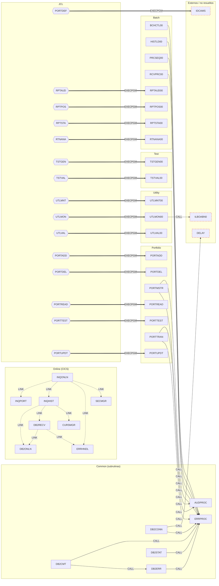

# Grafo de dependencias — CLBS (COBOL Legacy Benchmark Suite)

Generado automáticamente por `extract_deps.py` (extracción estática) y `render_graph.py` (render).
Regenerar: `python3 documentation/dependency-graph/extract_deps.py && python3 documentation/dependency-graph/render_graph.py`.

Inventario: **38 programas**, **20 copybooks**, **15 JCL**, **190 aristas**
(CALL: 15, COPY: 83, EXECPGM: 15, FILE: 51, LINK: 9, SQL: 8, SQL-INCLUDE: 9).

Leyenda de aristas: `-->|CALL|` llamada COBOL estática · `-.->|LINK|` EXEC CICS LINK/XCTL · `==>|EXECPGM|` paso JCL
· `-.->|COPY|` copybook · `-->|SQL|` tabla DB2 · `-->|FILE|` fichero VSAM/QSAM (DDNAME).
Nodos con borde rojo discontinuo = destino no resuelto en el repositorio (rutinas del sistema como IDCAMS, ILBOABN0).

La documentación funcional de cada programa está en [`documentation/programs/<grupo>/`](../programs/).

## 1. Flujo de control entre programas (CALL / CICS LINK / JCL)

## 2. Acceso a datos (tablas DB2 y ficheros VSAM/QSAM)

```mermaid
flowchart LR
  subgraph sg_batch["Batch"]
    P_BCHCTL00["BCHCTL00"]
    P_CKPRST["CKPRST"]
    P_HISTLD00["HISTLD00"]
    P_PRCSEQ00["PRCSEQ00"]
    P_RCVPRC00["RCVPRC00"]
    P_RPTAUD00["RPTAUD00"]
    P_RPTPOS00["RPTPOS00"]
    P_RPTSTA00["RPTSTA00"]
    P_RTNANA00["RTNANA00"]
    P_RTNCDE00["RTNCDE00"]
  end
  subgraph sg_common["Common (subrutinas)"]
    P_AUDPROC["AUDPROC"]
    P_DB2ERR["DB2ERR"]
    P_DB2STAT["DB2STAT"]
    P_ERRPROC["ERRPROC"]
  end
  subgraph sg_online["Online (CICS)"]
    P_ERRHNDL["ERRHNDL"]
    P_SECMGR["SECMGR"]
  end
  subgraph sg_portfolio["Portfolio"]
    P_PORTADD["PORTADD"]
    P_PORTDEL["PORTDEL"]
    P_PORTMSTR["PORTMSTR"]
    P_PORTREAD["PORTREAD"]
    P_PORTTEST["PORTTEST"]
    P_PORTTRAN["PORTTRAN"]
    P_PORTUPDT["PORTUPDT"]
  end
  subgraph sg_test["Test"]
    P_TSTGEN00["TSTGEN00"]
    P_TSTVAL00["TSTVAL00"]
  end
  subgraph sg_utility["Utility"]
    P_UTLMNT00["UTLMNT00"]
    P_UTLMON00["UTLMON00"]
    P_UTLVAL00["UTLVAL00"]
  end
  subgraph sg_copybooks["Copybooks"]
    C_AUDITLOG[["AUDITLOG"]]
    C_BCHCTL[["BCHCTL"]]
    C_PRCSEQ[["PRCSEQ"]]
  end
  subgraph sg_db2["Tablas DB2"]
    T_AUTHFILE[("AUTHFILE")]
    T_ERRLOG[("ERRLOG")]
    T_POSHIST[("POSHIST")]
    T_RTNCODES[("RTNCODES")]
    T_SESSION[("SESSION")]
  end
  subgraph sg_files["Ficheros (DDNAME)"]
    F_ACTUAL[/"ACTUAL"/]
    F_ALERTS[/"ALERTS"/]
    F_ARCHFILE[/"ARCHFILE"/]
    F_AUDFILE[/"AUDFILE"/]
    F_BCHSTATS[/"BCHSTATS"/]
    F_CKPTFILE[/"CKPTFILE"/]
    F_CTLFILE[/"CTLFILE"/]
    F_DB2STATS[/"DB2STATS"/]
    F_DELEFILE[/"DELEFILE"/]
    F_ERRRPT[/"ERRRPT"/]
    F_EXPECTED[/"EXPECTED"/]
    F_INPTFILE[/"INPTFILE"/]
    F_MONCFG[/"MONCFG"/]
    F_MONLOG[/"MONLOG"/]
    F_PORTFILE[/"PORTFILE"/]
    F_PORTOUT[/"PORTOUT"/]
    F_POSMSTRE[/"POSMSTRE"/]
    F_RANDSEED[/"RANDSEED"/]
    F_RPTFILE[/"RPTFILE"/]
    F_TESTCASE[/"TESTCASE"/]
    F_TESTFILE[/"TESTFILE"/]
    F_TESTRPT[/"TESTRPT"/]
    F_TRANFILE[/"TRANFILE"/]
    F_TRANHIST[/"TRANHIST"/]
    F_TRANOUT[/"TRANOUT"/]
    F_TSTCFG[/"TSTCFG"/]
    F_UPDTFILE[/"UPDTFILE"/]
    F_VALCTL[/"VALCTL"/]
  end
  P_BCHCTL00 -->|FILE| C_BCHCTL
  P_CKPRST -->|FILE| F_CKPTFILE
  P_HISTLD00 -->|SQL| T_POSHIST
  P_HISTLD00 -->|FILE| F_TRANHIST
  P_HISTLD00 -->|FILE| C_BCHCTL
  P_PRCSEQ00 -->|FILE| C_PRCSEQ
  P_PRCSEQ00 -->|FILE| C_BCHCTL
  P_RCVPRC00 -->|FILE| C_BCHCTL
  P_RCVPRC00 -->|FILE| C_PRCSEQ
  P_RPTAUD00 -->|FILE| C_AUDITLOG
  P_RPTAUD00 -->|FILE| T_ERRLOG
  P_RPTAUD00 -->|FILE| F_RPTFILE
  P_RPTPOS00 -->|FILE| F_POSMSTRE
  P_RPTPOS00 -->|FILE| F_TRANHIST
  P_RPTPOS00 -->|FILE| F_RPTFILE
  P_RPTSTA00 -->|FILE| F_DB2STATS
  P_RPTSTA00 -->|FILE| F_BCHSTATS
  P_RPTSTA00 -->|FILE| F_RPTFILE
  P_RTNANA00 -->|SQL| T_RTNCODES
  P_RTNANA00 -->|FILE| F_RPTFILE
  P_RTNCDE00 -->|SQL| T_RTNCODES
  P_AUDPROC -->|FILE| F_AUDFILE
  P_DB2ERR -->|SQL| T_ERRLOG
  P_DB2STAT -->|SQL| T_SESSION
  P_ERRPROC -->|FILE| T_ERRLOG
  P_ERRHNDL -->|SQL| T_ERRLOG
  P_SECMGR -->|SQL| T_AUTHFILE
  P_SECMGR -->|SQL| C_AUDITLOG
  P_PORTADD -->|FILE| F_PORTFILE
  P_PORTADD -->|FILE| F_INPTFILE
  P_PORTDEL -->|FILE| F_PORTFILE
  P_PORTDEL -->|FILE| F_DELEFILE
  P_PORTDEL -->|FILE| F_AUDFILE
  P_PORTMSTR -->|FILE| F_PORTFILE
  P_PORTREAD -->|FILE| F_PORTFILE
  P_PORTTEST -->|FILE| F_TESTFILE
  P_PORTTRAN -->|FILE| F_TRANFILE
  P_PORTTRAN -->|FILE| F_PORTFILE
  P_PORTUPDT -->|FILE| F_PORTFILE
  P_PORTUPDT -->|FILE| F_UPDTFILE
  P_TSTGEN00 -->|FILE| F_TSTCFG
  P_TSTGEN00 -->|FILE| F_PORTOUT
  P_TSTGEN00 -->|FILE| F_TRANOUT
  P_TSTGEN00 -->|FILE| F_RANDSEED
  P_TSTVAL00 -->|FILE| F_TESTCASE
  P_TSTVAL00 -->|FILE| F_EXPECTED
  P_TSTVAL00 -->|FILE| F_ACTUAL
  P_TSTVAL00 -->|FILE| F_TESTRPT
  P_UTLMNT00 -->|FILE| F_CTLFILE
  P_UTLMNT00 -->|FILE| F_ARCHFILE
  P_UTLMNT00 -->|FILE| F_RPTFILE
  P_UTLMON00 -->|FILE| F_MONCFG
  P_UTLMON00 -->|FILE| F_MONLOG
  P_UTLMON00 -->|FILE| F_ALERTS
  P_UTLMON00 -->|FILE| F_DB2STATS
  P_UTLVAL00 -->|FILE| F_VALCTL
  P_UTLVAL00 -->|FILE| F_POSMSTRE
  P_UTLVAL00 -->|FILE| F_TRANHIST
  P_UTLVAL00 -->|FILE| F_ERRRPT
  classDef unresolved stroke-dasharray: 5 5,stroke:#c00;
```

## 3. Uso de copybooks

```mermaid
flowchart LR
  subgraph sg_batch["Batch"]
    P_BCHCTL00["BCHCTL00"]
    P_CKPRST["CKPRST"]
    P_HISTLD00["HISTLD00"]
    P_PRCSEQ00["PRCSEQ00"]
    P_RCVPRC00["RCVPRC00"]
    P_RPTAUD00["RPTAUD00"]
    P_RPTPOS00["RPTPOS00"]
    P_RPTSTA00["RPTSTA00"]
    P_RTNANA00["RTNANA00"]
    P_RTNCDE00["RTNCDE00"]
  end
  subgraph sg_common["Common (subrutinas)"]
    P_AUDPROC["AUDPROC"]
    P_DB2CMT["DB2CMT"]
    P_DB2CONN["DB2CONN"]
    P_DB2ERR["DB2ERR"]
    P_DB2STAT["DB2STAT"]
    P_ERRPROC["ERRPROC"]
  end
  subgraph sg_online["Online (CICS)"]
    P_CURSMGR["CURSMGR"]
    P_DB2ONLN["DB2ONLN"]
    P_DB2RECV["DB2RECV"]
    P_ERRHNDL["ERRHNDL"]
    P_INQHIST["INQHIST"]
    P_INQONLN["INQONLN"]
    P_INQPORT["INQPORT"]
    P_SECMGR["SECMGR"]
  end
  subgraph sg_portfolio["Portfolio"]
    P_PORTADD["PORTADD"]
    P_PORTDEL["PORTDEL"]
    P_PORTREAD["PORTREAD"]
    P_PORTTEST["PORTTEST"]
    P_PORTTRAN["PORTTRAN"]
    P_PORTUPDT["PORTUPDT"]
    P_PORTVALD["PORTVALD"]
  end
  subgraph sg_test["Test"]
    P_TSTGEN00["TSTGEN00"]
    P_TSTVAL00["TSTVAL00"]
  end
  subgraph sg_utility["Utility"]
    P_UTLMNT00["UTLMNT00"]
    P_UTLMON00["UTLMON00"]
    P_UTLVAL00["UTLVAL00"]
  end
  subgraph sg_copybooks["Copybooks"]
    C_AUDITLOG[["AUDITLOG"]]
    C_BCHCON[["BCHCON"]]
    C_BCHCTL[["BCHCTL"]]
    C_DB2REQ[["DB2REQ"]]
    C_DBPROC[["DBPROC"]]
    C_DBTBLS[["DBTBLS"]]
    C_ERRHAND[["ERRHAND"]]
    C_ERRHND[["ERRHND"]]
    C_HISTREC[["HISTREC"]]
    C_INQCOM[["INQCOM"]]
    C_PORTFLIO[["PORTFLIO"]]
    C_PORTREC[["PORTREC"]]
    C_PORTVAL[["PORTVAL"]]
    C_POSREC[["POSREC"]]
    C_PRCSEQ[["PRCSEQ"]]
    C_RETHND[["RETHND"]]
    C_RTNCODE[["RTNCODE"]]
    C_SQLCA[["SQLCA"]]
    C_SQLPOS[["SQLPOS"]]
    C_TRNREC[["TRNREC"]]
  end
  P_BCHCTL00 -.->|COPY| C_BCHCTL
  P_BCHCTL00 -.->|COPY| C_BCHCON
  P_BCHCTL00 -.->|COPY| C_ERRHAND
  P_CKPRST -.->|COPY| P_CKPRST
  P_CKPRST -.->|COPY| C_RETHND
  P_HISTLD00 -.->|COPY| C_HISTREC
  P_HISTLD00 -.->|COPY| C_BCHCTL
  P_HISTLD00 -.->|COPY| C_DBTBLS
  P_HISTLD00 -.->|COPY| C_SQLCA
  P_HISTLD00 -.->|COPY| C_DBPROC
  P_HISTLD00 -.->|COPY| C_ERRHAND
  P_HISTLD00 -.->|COPY| C_BCHCON
  P_PRCSEQ00 -.->|COPY| C_PRCSEQ
  P_PRCSEQ00 -.->|COPY| C_BCHCTL
  P_PRCSEQ00 -.->|COPY| C_BCHCON
  P_PRCSEQ00 -.->|COPY| C_ERRHAND
  P_RCVPRC00 -.->|COPY| C_BCHCTL
  P_RCVPRC00 -.->|COPY| C_PRCSEQ
  P_RCVPRC00 -.->|COPY| C_BCHCON
  P_RCVPRC00 -.->|COPY| C_ERRHAND
  P_RPTAUD00 -.->|COPY| C_AUDITLOG
  P_RPTAUD00 -.->|COPY| C_ERRHAND
  P_RPTAUD00 -.->|COPY| C_RTNCODE
  P_RPTPOS00 -.->|COPY| C_POSREC
  P_RPTPOS00 -.->|COPY| C_TRNREC
  P_RPTPOS00 -.->|COPY| C_RTNCODE
  P_RPTPOS00 -.->|COPY| C_ERRHAND
  P_RPTSTA00 -.->|COPY| P_DB2STAT
  P_RPTSTA00 -.->|COPY| C_BCHCTL
  P_RPTSTA00 -.->|COPY| C_RTNCODE
  P_RPTSTA00 -.->|COPY| C_ERRHAND
  P_RTNANA00 -.->|SQL-INCLUDE| C_SQLCA
  P_RTNCDE00 -.->|COPY| C_RTNCODE
  P_RTNCDE00 -.->|SQL-INCLUDE| C_SQLCA
  P_AUDPROC -.->|COPY| C_AUDITLOG
  P_DB2CMT -.->|COPY| C_SQLCA
  P_DB2CMT -.->|COPY| C_DBPROC
  P_DB2CMT -.->|COPY| C_ERRHAND
  P_DB2CONN -.->|COPY| C_SQLCA
  P_DB2CONN -.->|COPY| C_DBPROC
  P_DB2CONN -.->|COPY| C_ERRHAND
  P_DB2ERR -.->|COPY| C_DBTBLS
  P_DB2ERR -.->|COPY| C_SQLCA
  P_DB2ERR -.->|COPY| C_DBPROC
  P_DB2ERR -.->|COPY| C_ERRHAND
  P_DB2STAT -.->|COPY| C_SQLCA
  P_DB2STAT -.->|COPY| C_DBPROC
  P_DB2STAT -.->|COPY| C_ERRHAND
  P_ERRPROC -.->|COPY| C_ERRHAND
  P_CURSMGR -.->|SQL-INCLUDE| C_SQLCA
  P_DB2ONLN -.->|COPY| C_ERRHND
  P_DB2ONLN -.->|SQL-INCLUDE| C_SQLCA
  P_DB2RECV -.->|COPY| C_ERRHND
  P_DB2RECV -.->|COPY| C_DB2REQ
  P_DB2RECV -.->|SQL-INCLUDE| C_SQLCA
  P_ERRHNDL -.->|COPY| C_ERRHND
  P_ERRHNDL -.->|SQL-INCLUDE| C_SQLCA
  P_INQHIST -.->|COPY| C_INQCOM
  P_INQHIST -.->|SQL-INCLUDE| C_SQLCA
  P_INQONLN -.->|COPY| C_INQCOM
  P_INQONLN -.->|COPY| C_ERRHND
  P_INQPORT -.->|COPY| C_INQCOM
  P_INQPORT -.->|COPY| C_POSREC
  P_INQPORT -.->|SQL-INCLUDE| C_SQLPOS
  P_SECMGR -.->|COPY| C_ERRHND
  P_SECMGR -.->|SQL-INCLUDE| C_SQLCA
  P_PORTADD -.->|COPY| C_PORTFLIO
  P_PORTDEL -.->|COPY| C_PORTFLIO
  P_PORTREAD -.->|COPY| C_PORTFLIO
  P_PORTTEST -.->|COPY| C_PORTFLIO
  P_PORTTEST -.->|COPY| C_ERRHAND
  P_PORTTRAN -.->|COPY| C_TRNREC
  P_PORTTRAN -.->|COPY| C_PORTREC
  P_PORTTRAN -.->|COPY| C_ERRHAND
  P_PORTTRAN -.->|COPY| C_AUDITLOG
  P_PORTUPDT -.->|COPY| C_PORTFLIO
  P_PORTVALD -.->|COPY| C_PORTVAL
  P_TSTGEN00 -.->|COPY| C_PORTFLIO
  P_TSTGEN00 -.->|COPY| C_TRNREC
  P_TSTGEN00 -.->|COPY| C_RTNCODE
  P_TSTGEN00 -.->|COPY| C_ERRHAND
  P_TSTVAL00 -.->|COPY| C_RTNCODE
  P_TSTVAL00 -.->|COPY| C_ERRHAND
  P_UTLMNT00 -.->|COPY| C_RTNCODE
  P_UTLMNT00 -.->|COPY| C_ERRHAND
  P_UTLMON00 -.->|COPY| P_DB2STAT
  P_UTLMON00 -.->|COPY| C_RTNCODE
  P_UTLMON00 -.->|COPY| C_ERRHAND
  P_UTLVAL00 -.->|COPY| C_POSREC
  P_UTLVAL00 -.->|COPY| C_TRNREC
  P_UTLVAL00 -.->|COPY| C_RTNCODE
  P_UTLVAL00 -.->|COPY| C_ERRHAND
  classDef unresolved stroke-dasharray: 5 5,stroke:#c00;
  class C_PORTREC,C_SQLPOS,P_DB2STAT unresolved;
```

## 4. Índice de programas

| Grupo | Programa | Fuente | Llama a | Llamado por | Documentación |
|---|---|---|---|---|---|
| batch | `BCHCTL00` | [BCHCTL00.cbl](../../src/programs/batch/BCHCTL00.cbl) | ERRPROC | — | [BCHCTL00.md](../programs/batch/BCHCTL00.md) |
| batch | `CKPRST` | [CKPRST.cbl](../../src/programs/batch/CKPRST.cbl) | — | — | [CKPRST.md](../programs/batch/CKPRST.md) |
| batch | `HISTLD00` | [HISTLD00.cbl](../../src/programs/batch/HISTLD00.cbl) | ERRPROC | — | [HISTLD00.md](../programs/batch/HISTLD00.md) |
| batch | `POSUPDT` | [POSUPDT.cbl](../../src/programs/batch/POSUPDT.cbl) | — | — | [POSUPDT.md](../programs/batch/POSUPDT.md) |
| batch | `PRCSEQ00` | [PRCSEQ00.cbl](../../src/programs/batch/PRCSEQ00.cbl) | ERRPROC | — | [PRCSEQ00.md](../programs/batch/PRCSEQ00.md) |
| batch | `RCVPRC00` | [RCVPRC00.cbl](../../src/programs/batch/RCVPRC00.cbl) | ERRPROC | — | [RCVPRC00.md](../programs/batch/RCVPRC00.md) |
| batch | `RPTAUD00` | [RPTAUD00.cbl](../../src/programs/batch/RPTAUD00.cbl) | — | RPTAUD | [RPTAUD00.md](../programs/batch/RPTAUD00.md) |
| batch | `RPTPOS00` | [RPTPOS00.cbl](../../src/programs/batch/RPTPOS00.cbl) | — | RPTPOS | [RPTPOS00.md](../programs/batch/RPTPOS00.md) |
| batch | `RPTSTA00` | [RPTSTA00.cbl](../../src/programs/batch/RPTSTA00.cbl) | — | RPTSTA | [RPTSTA00.md](../programs/batch/RPTSTA00.md) |
| batch | `RTNANA00` | [RTNANA00.cbl](../../src/programs/batch/RTNANA00.cbl) | — | RTNANA | [RTNANA00.md](../programs/batch/RTNANA00.md) |
| batch | `RTNCDE00` | [RTNCDE00.cbl](../../src/programs/batch/RTNCDE00.cbl) | — | — | [RTNCDE00.md](../programs/batch/RTNCDE00.md) |
| common | `AUDPROC` | [AUDPROC.cbl](../../src/programs/common/AUDPROC.cbl) | — | PORTMSTR, PORTTRAN | [AUDPROC.md](../programs/common/AUDPROC.md) |
| common | `DB2CMT` | [DB2CMT.cbl](../../src/programs/common/DB2CMT.cbl) | DB2ERR, ERRPROC | — | [DB2CMT.md](../programs/common/DB2CMT.md) |
| common | `DB2CONN` | [DB2CONN.cbl](../../src/programs/common/DB2CONN.cbl) | DELAY, ERRPROC | — | [DB2CONN.md](../programs/common/DB2CONN.md) |
| common | `DB2ERR` | [DB2ERR.cbl](../../src/programs/common/DB2ERR.cbl) | ERRPROC | DB2CMT | [DB2ERR.md](../programs/common/DB2ERR.md) |
| common | `DB2STAT` | [DB2STAT.cbl](../../src/programs/common/DB2STAT.cbl) | ERRPROC | — | [DB2STAT.md](../programs/common/DB2STAT.md) |
| common | `ERRPROC` | [ERRPROC.cbl](../../src/programs/common/ERRPROC.cbl) | — | BCHCTL00, DB2CMT, DB2CONN, DB2ERR, DB2STAT, HISTLD00, PORTMSTR, PORTTRAN, PRCSEQ00, RCVPRC00 | [ERRPROC.md](../programs/common/ERRPROC.md) |
| online | `CURSMGR` | [CURSMGR.cbl](../../src/programs/online/CURSMGR.cbl) | — | INQHIST | [CURSMGR.md](../programs/online/CURSMGR.md) |
| online | `DB2ONLN` | [DB2ONLN.cbl](../../src/programs/online/DB2ONLN.cbl) | — | DB2RECV, INQHIST | [DB2ONLN.md](../programs/online/DB2ONLN.md) |
| online | `DB2RECV` | [DB2RECV.cbl](../../src/programs/online/DB2RECV.cbl) | DB2ONLN, ERRHNDL | INQHIST | [DB2RECV.md](../programs/online/DB2RECV.md) |
| online | `ERRHNDL` | [ERRHNDL.cbl](../../src/programs/online/ERRHNDL.cbl) | — | DB2RECV, INQONLN | [ERRHNDL.md](../programs/online/ERRHNDL.md) |
| online | `INQHIST` | [INQHIST.cbl](../../src/programs/online/INQHIST.cbl) | CURSMGR, DB2ONLN, DB2RECV | INQONLN | [INQHIST.md](../programs/online/INQHIST.md) |
| online | `INQONLN` | [INQONLN.cbl](../../src/programs/online/INQONLN.cbl) | ERRHNDL, INQHIST, INQPORT, SECMGR | — | [INQONLN.md](../programs/online/INQONLN.md) |
| online | `INQPORT` | [INQPORT.cbl](../../src/programs/online/INQPORT.cbl) | — | INQONLN | [INQPORT.md](../programs/online/INQPORT.md) |
| online | `SECMGR` | [SECMGR.cbl](../../src/programs/online/SECMGR.cbl) | — | INQONLN | [SECMGR.md](../programs/online/SECMGR.md) |
| portfolio | `PORTADD` | [PORTADD.cbl](../../src/programs/portfolio/PORTADD.cbl) | — | PORTADD | [PORTADD.md](../programs/portfolio/PORTADD.md) |
| portfolio | `PORTDEL` | [PORTDEL.cbl](../../src/programs/portfolio/PORTDEL.cbl) | — | PORTDEL | [PORTDEL.md](../programs/portfolio/PORTDEL.md) |
| portfolio | `PORTMSTR` | [PORTMSTR.cbl](../../src/programs/portfolio/PORTMSTR.cbl) | AUDPROC, ERRPROC | — | [PORTMSTR.md](../programs/portfolio/PORTMSTR.md) |
| portfolio | `PORTREAD` | [PORTREAD.cbl](../../src/programs/portfolio/PORTREAD.cbl) | — | PORTREAD | [PORTREAD.md](../programs/portfolio/PORTREAD.md) |
| portfolio | `PORTTEST` | [PORTTEST.cbl](../../src/programs/portfolio/PORTTEST.cbl) | — | PORTTEST | [PORTTEST.md](../programs/portfolio/PORTTEST.md) |
| portfolio | `PORTTRAN` | [PORTTRAN.cbl](../../src/programs/portfolio/PORTTRAN.cbl) | AUDPROC, ERRPROC | — | [PORTTRAN.md](../programs/portfolio/PORTTRAN.md) |
| portfolio | `PORTUPDT` | [PORTUPDT.cbl](../../src/programs/portfolio/PORTUPDT.cbl) | — | PORTUPDT | [PORTUPDT.md](../programs/portfolio/PORTUPDT.md) |
| portfolio | `PORTVALD` | [PORTVALD.cbl](../../src/programs/portfolio/PORTVALD.cbl) | — | — | [PORTVALD.md](../programs/portfolio/PORTVALD.md) |
| test | `TSTGEN00` | [TSTGEN00.cbl](../../src/programs/test/TSTGEN00.cbl) | — | TSTGEN | [TSTGEN00.md](../programs/test/TSTGEN00.md) |
| test | `TSTVAL00` | [TSTVAL00.cbl](../../src/programs/test/TSTVAL00.cbl) | — | TSTVAL | [TSTVAL00.md](../programs/test/TSTVAL00.md) |
| utility | `UTLMNT00` | [UTLMNT00.cbl](../../src/programs/utility/UTLMNT00.cbl) | — | UTLMNT | [UTLMNT00.md](../programs/utility/UTLMNT00.md) |
| utility | `UTLMON00` | [UTLMON00.cbl](../../src/programs/utility/UTLMON00.cbl) | ILBOABN0 | UTLMON | [UTLMON00.md](../programs/utility/UTLMON00.md) |
| utility | `UTLVAL00` | [UTLVAL00.cbl](../../src/programs/utility/UTLVAL00.cbl) | — | UTLVAL | [UTLVAL00.md](../programs/utility/UTLVAL00.md) |

## 5. Destinos no resueltos

- `CALL` `DB2CONN` → `DELAY`
- `CALL` `UTLMON00` → `ILBOABN0`
- `COPY` `PORTTRAN` → `PORTREC`
- `COPY` `RPTSTA00` → `DB2STAT`
- `COPY` `UTLMON00` → `DB2STAT`
- `EXECPGM` `PORTDEF` → `IDCAMS`
- `SQL-INCLUDE` `INQPORT` → `SQLPOS`

## Archivos

- `deps.json` — aristas y nodos (fuente de verdad)
- `graph.dot` — mismo grafo en formato Graphviz (`dot -Tsvg graph.dot -o graph.svg`)
