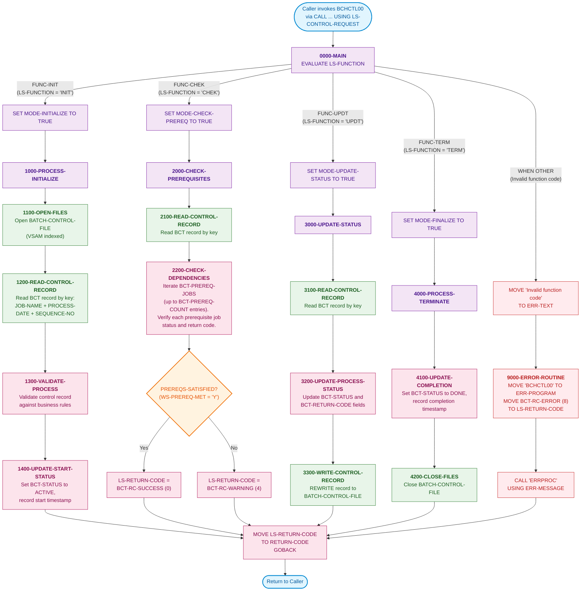

# BCHCTL00 — Batch Control Processor

## Program Description

**BCHCTL00** is a called batch control program that manages job-level sequencing, prerequisite checking, and status tracking for the Investment Portfolio Management System's batch processing layer. It operates on a VSAM indexed control file (`BATCH-CONTROL-FILE`) and is invoked by other batch programs via the `CALL` interface with a function code that determines the operation to perform.

### Key Characteristics

| Attribute | Value |
|---|---|
| **Program ID** | BCHCTL00 |
| **Type** | Called subprogram (LINKAGE SECTION interface) |
| **Platform** | IBM z/OS |
| **File I/O** | VSAM indexed file (dynamic access) |
| **DB2 Operations** | None |
| **CALL Statements** | `CALL 'ERRPROC'` (error handler) |
| **Copybooks** | `BCHCTL` (control record), `BCHCON` (constants), `ERRHAND` (error handling) |

### Supported Functions

| Code | Function | Description |
|---|---|---|
| `INIT` | Initialize | Opens files, reads/validates control record, sets start status |
| `CHEK` | Check Prerequisites | Reads control record, verifies job dependencies are satisfied |
| `UPDT` | Update Status | Reads control record, updates process status, writes back |
| `TERM` | Terminate | Updates completion info, closes files |

### Return Codes

| Code | Meaning |
|---|---|
| 0 | Success |
| 4 | Warning (e.g., prerequisites pending) |
| 8 | Error |
| 12 | Severe |
| 16 | Critical |

## Logic Flow Diagram

