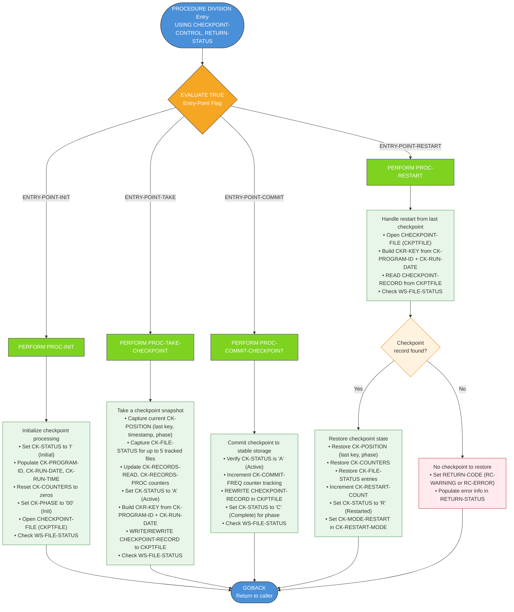

# CKPRST — Checkpoint/Restart Program

## Program Description

**CKPRST** is a batch checkpoint/restart utility program in the Investment Portfolio Management System. It provides a reusable framework for taking, committing, and restoring checkpoints during long-running batch jobs, enabling reliable recovery from failures without reprocessing all data.

The program is invoked via `CALL` from other batch programs (e.g., `HISTLD00`) and uses an `EVALUATE`-based dispatcher to route control to one of four operations based on an entry-point flag passed through the `CHECKPOINT-CONTROL` linkage structure. It manages checkpoint state in an indexed VSAM file (`CKPTFILE`), keyed by program ID and run date.

### Key Components

| Component | Description |
|---|---|
| **Copybook `CKPRST.cpy`** | Defines `CHECKPOINT-CONTROL` (linkage) and `CHECKPOINT-RECORD` (VSAM file record) |
| **Copybook `RETHND.cpy`** | Defines `RETURN-STATUS` for standardized return/error handling |
| **VSAM File `CKPTFILE`** | Indexed checkpoint file; key = `CKR-PROGRAM-ID` + `CKR-RUN-DATE` |

### Data Structures

- **CHECKPOINT-CONTROL** (Linkage): Header (program ID, run date/time, status flags), counters (records read/processed/errors, restart count), position tracking (last key, phase), file resource states (up to 5 files), and control info (commit frequency, max errors/restarts, restart mode).
- **CHECKPOINT-RECORD** (VSAM): Keyed record with `CKR-PROGRAM-ID` (8 bytes) + `CKR-RUN-DATE` (8 bytes) as composite key and 400-byte data area.
- **RETURN-STATUS** (Linkage): Return code (0=success, 4=warning, 8=error, 12=severe, 16=critical), reason code, module/function IDs, error location, error info, and retry actions.

---

## Logic Flow Diagram



---

## Caller Integration

Other batch programs invoke CKPRST through the standard calling convention documented in `CKPRST.cpy`:

```
CALL 'CKPINIT' USING CHECKPOINT-CONTROL RETURN-STATUS   (Initialize)
CALL 'CKPTAKE' USING CHECKPOINT-CONTROL RETURN-STATUS   (Take checkpoint)
CALL 'CKPCMIT' USING CHECKPOINT-CONTROL RETURN-STATUS   (Commit checkpoint)
CALL 'CKPRSTR' USING CHECKPOINT-CONTROL RETURN-STATUS   (Restart from checkpoint)
```

For example, `HISTLD00` (History Loader) calls checkpoint routines during its processing loop to enable restart after failures.

## File I/O Summary

| Operation | File | Access | Key |
|---|---|---|---|
| OPEN | CKPTFILE (VSAM Indexed) | DYNAMIC | `CKR-PROGRAM-ID + CKR-RUN-DATE` |
| READ | CKPTFILE | By key | Composite key lookup |
| WRITE | CKPTFILE | Sequential/Key | New checkpoint record |
| REWRITE | CKPTFILE | By key | Update existing checkpoint |

## Status Flags (Level 88)

| Flag | Value | Meaning |
|---|---|---|
| `CK-INITIAL` | `'I'` | Checkpoint initialized |
| `CK-ACTIVE` | `'A'` | Checkpoint in progress |
| `CK-COMPLETE` | `'C'` | Checkpoint committed |
| `CK-FAILED` | `'F'` | Checkpoint failed |
| `CK-RESTARTED` | `'R'` | Restarted from checkpoint |

## Phase Codes

| Phase | Value | Description |
|---|---|---|
| `CK-PHASE-INIT` | `'00'` | Initialization |
| `CK-PHASE-READ` | `'10'` | Reading input |
| `CK-PHASE-PROC` | `'20'` | Processing records |
| `CK-PHASE-UPDT` | `'30'` | Updating output |
| `CK-PHASE-TERM` | `'40'` | Termination |
