# HISTLD00 — Position History DB2 Load Program

## Program Description

**HISTLD00** is a batch COBOL program that loads transaction history records from an indexed VSAM file (`TRANSACTION-HISTORY`) into a DB2 table (`POSHIST`). It is part of the Investment Portfolio Management System's batch processing layer.

The program follows a standard mainframe batch pattern:

- **Initialization**: Opens input files, connects to DB2 (`POSMVP`), and activates a checkpoint control record in the `BATCH-CONTROL-FILE`.
- **Processing loop**: Sequentially reads history records, maps fields to the DB2 row layout, and performs an `INSERT`. Duplicate keys (SQLCODE -803) are silently skipped. A `COMMIT WORK` is issued every 1 000 records, and the batch control checkpoint is updated.
- **Termination**: Issues a final commit, closes files, disconnects from DB2, and displays processing statistics. The program's return code is set to the total error count.
- **Error handling**: On any error the program calls the external `ERRPROC` routine and issues a `ROLLBACK WORK`. Processing stops when the error count exceeds 100.

### Key Artifacts

| Artifact | Type | Usage |
|---|---|---|
| `TRANSACTION-HISTORY` (TRANHIST) | Indexed VSAM file | Input — sequential read |
| `BATCH-CONTROL-FILE` (BCHCTL) | Indexed VSAM file | I-O — checkpoint tracking |
| `POSHIST` | DB2 table | Output — INSERT target |
| `POSMVP` | DB2 subsystem | SQL connection |
| `ERRPROC` | External program | Called for error logging |

### Copybooks

`HISTREC`, `BCHCTL`, `DBTBLS`, `SQLCA`, `DBPROC`, `ERRHAND`, `BCHCON`

---

## Logic Flow Diagram

```mermaid
flowchart TD
    START([HISTLD00 Start]) --> MAIN["0000-MAIN"]

    MAIN --> INIT["1000-INITIALIZE"]

    subgraph INIT_SUB ["1000-INITIALIZE"]
        INIT --> OPEN["1100-OPEN-FILES"]
        OPEN --> OPEN_TH["OPEN INPUT<br/>TRANSACTION-HISTORY"]
        OPEN_TH --> CHK_TH{WS-TH-STATUS<br/>= '00'?}
        CHK_TH -- No --> ERR1["Set ERR-TEXT<br/>'Error opening history file'"]
        ERR1 --> ERR_RTN["9000-ERROR-ROUTINE"]
        CHK_TH -- Yes --> OPEN_BCT["OPEN I-O<br/>BATCH-CONTROL-FILE"]
        OPEN_BCT --> CHK_BCT{WS-BCT-STATUS<br/>= '00'?}
        CHK_BCT -- No --> ERR2["Set ERR-TEXT<br/>'Error opening control file'"]
        ERR2 --> ERR_RTN
        CHK_BCT -- Yes --> CONN["1200-CONNECT-DB2"]

        CONN --> CONN_DB2["EXEC SQL<br/>CONNECT TO POSMVP"]
        CONN_DB2 --> CHK_CONN{SQLCODE = 0?}
        CHK_CONN -- No --> DB2_ERR["DB2-ERROR-ROUTINE<br/>(ROLLBACK + CALL ERRPROC)"]
        CHK_CONN -- Yes --> CKPT["1300-INIT-CHECKPOINTS"]

        CKPT --> READ_BCT["READ BATCH-CONTROL-FILE<br/>KEY = 'HISTLD00'"]
        READ_BCT --> CHK_KEY{INVALID KEY?}
        CHK_KEY -- Yes --> ERR3["Set ERR-TEXT<br/>'Control record not found'"]
        ERR3 --> ERR_RTN
        CHK_KEY -- No --> SET_ACT["Set BCT-STATUS = 'A' (Active)"]
        SET_ACT --> RW_BCT["REWRITE BATCH-CONTROL-RECORD"]
    end

    RW_BCT --> LOOP_START

    subgraph PROCESS_LOOP ["2000-PROCESS  (loop until EOF or errors > 100)"]
        LOOP_START{EOF reached?<br/>or errors > 100?}
        LOOP_START -- No --> READ_HIST["2100-READ-HISTORY<br/>READ TRANSACTION-HISTORY"]
        READ_HIST --> AT_END{AT END?}
        AT_END -- Yes --> SET_EOF["Set END-OF-FILE = 'Y'"]
        SET_EOF --> LOOP_START
        AT_END -- No --> INC_READ["WS-RECORDS-READ + 1"]
        INC_READ --> MORE_CHK{MORE-RECORDS?}
        MORE_CHK -- No --> LOOP_START
        MORE_CHK -- Yes --> LOAD["2200-LOAD-TO-DB2"]

        LOAD --> MAP["Map TH-* fields<br/>to PH-* (POSHIST-RECORD)"]
        MAP --> INSERT["EXEC SQL<br/>INSERT INTO POSHIST<br/>VALUES (:POSHIST-RECORD)"]
        INSERT --> SQL_CHK{SQLCODE?}
        SQL_CHK -- "= 0<br/>(success)" --> INC_WRITE["WS-RECORDS-WRITTEN + 1"]
        SQL_CHK -- "= -803<br/>(duplicate)" --> SKIP["CONTINUE<br/>(skip duplicate)"]
        SQL_CHK -- "other<br/>(error)" --> INC_ERR["WS-ERROR-COUNT + 1"]
        INC_ERR --> DB2_ERR2["DB2-ERROR-ROUTINE<br/>(ROLLBACK + CALL ERRPROC)"]

        INC_WRITE --> COMMIT_CHK["2300-CHECK-COMMIT"]
        SKIP --> COMMIT_CHK
        DB2_ERR2 --> COMMIT_CHK

        COMMIT_CHK --> INC_CMT["WS-COMMIT-COUNT + 1"]
        INC_CMT --> THR_CHK{COMMIT-COUNT<br/>>= 1000?}
        THR_CHK -- No --> LOOP_START
        THR_CHK -- Yes --> DO_COMMIT["EXEC SQL COMMIT WORK"]
        DO_COMMIT --> RESET_CMT["Reset WS-COMMIT-COUNT = 0"]
        RESET_CMT --> UPD_CKP["2310-UPDATE-CHECKPOINT<br/>REWRITE BATCH-CONTROL-RECORD<br/>with counts"]
        UPD_CKP --> CHK_RW{INVALID KEY?}
        CHK_RW -- Yes --> ERR4["Set ERR-TEXT<br/>'Error updating checkpoint'"]
        ERR4 --> ERR_RTN
        CHK_RW -- No --> LOOP_START
    end

    LOOP_START -- Yes --> TERM["3000-TERMINATE"]

    subgraph TERM_SUB ["3000-TERMINATE"]
        TERM --> FINAL["3100-FINAL-COMMIT"]
        FINAL --> FINAL_CMT["EXEC SQL COMMIT WORK"]
        FINAL_CMT --> FINAL_CKP["2310-UPDATE-CHECKPOINT"]
        FINAL_CKP --> CLOSE["3200-CLOSE-FILES"]
        CLOSE --> CLOSE_FILES["CLOSE TRANSACTION-HISTORY<br/>CLOSE BATCH-CONTROL-FILE"]
        CLOSE_FILES --> DISC["3300-DISCONNECT-DB2"]
        DISC --> DISC_SQL["EXEC SQL COMMIT WORK<br/>EXEC SQL CONNECT RESET"]
        DISC_SQL --> STATS["3400-DISPLAY-STATS"]
        STATS --> DISP["DISPLAY Records Read,<br/>Records Written, Errors"]
    end

    DISP --> SET_RC["MOVE WS-ERROR-COUNT<br/>TO RETURN-CODE"]
    SET_RC --> GOBACK([GOBACK])

    subgraph ERR_SUB ["9000-ERROR-ROUTINE"]
        ERR_RTN --> SET_PGM["Set ERR-PROGRAM = 'HISTLD00'"]
        SET_PGM --> CALL_ERR["CALL 'ERRPROC'<br/>USING ERR-MESSAGE"]
        CALL_ERR --> ROLLBACK["EXEC SQL<br/>ROLLBACK WORK"]
    end

    style START fill:#2d6a4f,stroke:#1b4332,color:#fff
    style GOBACK fill:#2d6a4f,stroke:#1b4332,color:#fff
    style ERR_RTN fill:#d62828,stroke:#6a040f,color:#fff
    style DB2_ERR fill:#d62828,stroke:#6a040f,color:#fff
    style DB2_ERR2 fill:#d62828,stroke:#6a040f,color:#fff
    style INSERT fill:#0077b6,stroke:#023e8a,color:#fff
    style DO_COMMIT fill:#0077b6,stroke:#023e8a,color:#fff
    style FINAL_CMT fill:#0077b6,stroke:#023e8a,color:#fff
    style DISC_SQL fill:#0077b6,stroke:#023e8a,color:#fff
    style ROLLBACK fill:#0077b6,stroke:#023e8a,color:#fff
    style CONN_DB2 fill:#0077b6,stroke:#023e8a,color:#fff
    style OPEN_TH fill:#606c38,stroke:#283618,color:#fff
    style OPEN_BCT fill:#606c38,stroke:#283618,color:#fff
    style READ_BCT fill:#606c38,stroke:#283618,color:#fff
    style READ_HIST fill:#606c38,stroke:#283618,color:#fff
    style RW_BCT fill:#606c38,stroke:#283618,color:#fff
    style CLOSE_FILES fill:#606c38,stroke:#283618,color:#fff
    style CALL_ERR fill:#e76f51,stroke:#9b2226,color:#fff
```

### Color Legend

| Color | Meaning |
|---|---|
| 🟢 Green | Program entry / exit |
| 🟤 Olive | VSAM file I/O operations |
| 🔵 Blue | DB2 SQL operations |
| 🔴 Red | Error handling paths |
| 🟠 Orange | External program call (`ERRPROC`) |
