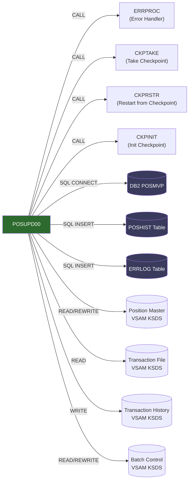

# POSUPDT (POSUPD00) — Position Update Program

## Program Description

POSUPDT is a batch COBOL program in the Investment Portfolio Management System that updates position records based on validated transactions. It runs as the second step in the daily batch processing sequence (after TRNVAL00) within the 1815–1900 time window.

The program reads validated transactions from TRNVAL00, updates the VSAM Position Master file (adding/modifying holdings and cost basis), writes audit records to the Transaction History VSAM file, and logs position changes to DB2 via embedded SQL. It implements checkpoint/restart logic (every 500 updates) for recoverability, uses standard batch control (BCHCTL) for job sequencing, and calls shared error-handling routines (ERRPROC) for consistent error management.

### Key Characteristics

| Attribute            | Value                                          |
| -------------------- | ---------------------------------------------- |
| Program ID           | POSUPD00                                       |
| Member Name          | POSUPDT                                        |
| Type                 | Batch (z/OS)                                   |
| Dependencies         | DB2CONN, ERRPROC                               |
| Prerequisite         | TRNVAL00 (RC ≤ 0004)                           |
| Downstream           | HISTLD00 (RC ≤ 0004)                           |
| Input Files          | Transaction File (validated), Batch Control    |
| Output Files         | Position Master (VSAM), Transaction History    |
| DB2 Access           | Read/Write (POSHIST, ERRLOG)                   |
| Checkpoint Frequency | Every 500 updates                              |
| Restartable          | Yes                                            |
| Copybooks            | POSREC, TRNREC, HISTREC, BCHCTL, BCHCON, CKPRST, ERRHAND, DBTBLS, DBPROC, SQLCA |

---

## Logic Flow Diagram

```mermaid
flowchart TD
    START([Program Entry: POSUPD00]) --> MAIN[0000-MAIN]

    subgraph INIT["1000-INITIALIZE"]
        I1[1100-OPEN-FILES<br/>Open TRANFILE INPUT<br/>Open POSMASTR I-O<br/>Open TRANHIST OUTPUT<br/>Open BCHCTL I-O]
        I2[1200-CONNECT-DB2<br/>EXEC SQL CONNECT TO POSMVP<br/>via DBPROC copybook]
        I3[1300-INIT-CHECKPOINTS<br/>Read BCHCTL record for POSUPD00<br/>Check restart mode]
        I4{Restart<br/>Mode?}
        I5[1310-NORMAL-START<br/>Set CK-PHASE to INIT<br/>Set BCT-STATUS to ACTIVE]
        I6[1320-RESTART-PROCESSING<br/>CALL CKPRSTR to read<br/>last checkpoint<br/>Position files to<br/>CK-LAST-KEY]
        I1 --> I2 --> I3 --> I4
        I4 -- Normal --> I5
        I4 -- Restart --> I6
    end

    MAIN --> INIT

    INIT --> LOOP_CHECK{End of File?<br/>OR<br/>Error Count > 100?}

    subgraph PROCESS["2000-PROCESS (Loop)"]
        P1[2100-READ-TRANSACTION<br/>READ TRANFILE<br/>AT END set EOF flag]
        P2{More<br/>Records?}
        P3[2200-VALIDATE-TRANSACTION<br/>Check TRN-STATUS = Pending<br/>Validate TRN-PORTFOLIO-ID<br/>Validate TRN-INVESTMENT-ID]
        P4{Valid?}
        P5[2300-LOOKUP-POSITION<br/>READ POSMASTR<br/>using POS-PORTFOLIO-ID<br/>+ POS-INVESTMENT-ID]
        P6{Position<br/>Found?}
        P7[2400-PROCESS-TRANSACTION<br/>EVALUATE TRN-TYPE]
        P8[2500-WRITE-HISTORY<br/>Build HISTORY-RECORD<br/>WRITE TRANHIST]
        P9[2600-CHECK-COMMIT<br/>Increment commit counter]

        P1 --> P2
        P2 -- Yes --> P3
        P2 -- "No (EOF)" --> P2_EXIT([Return to Loop Check])
        P3 --> P4
        P4 -- Yes --> P5
        P4 -- No --> P_ERR1[Log validation error<br/>ADD 1 TO error count]
        P_ERR1 --> P9
        P5 --> P6
        P6 -- Yes --> P7
        P6 -- "No (New Position)" --> P7A[2310-INIT-NEW-POSITION<br/>Initialize POSITION-RECORD<br/>Set POS-STATUS-ACTIVE]
        P7A --> P7
        P7 --> P8 --> P9
    end

    LOOP_CHECK -- No --> PROCESS
    PROCESS --> LOOP_CHECK

    subgraph TXN_TYPES["2400-PROCESS-TRANSACTION (EVALUATE TRN-TYPE)"]
        direction TB
        T_EVAL{TRN-TYPE?}
        T_BUY["2410-PROCESS-BUY (BU)<br/>ADD TRN-QUANTITY TO POS-QUANTITY<br/>COMPUTE POS-COST-BASIS =<br/>  POS-COST-BASIS + TRN-AMOUNT<br/>REWRITE POSITION-RECORD<br/>Set TRN-STATUS-DONE"]
        T_SELL["2420-PROCESS-SELL (SL)<br/>Check POS-QUANTITY >= TRN-QUANTITY<br/>SUBTRACT TRN-QUANTITY FROM POS-QUANTITY<br/>COMPUTE gain/loss<br/>COMPUTE POS-COST-BASIS adjustment<br/>REWRITE POSITION-RECORD<br/>Set TRN-STATUS-DONE"]
        T_XFER["2430-PROCESS-TRANSFER (TR)<br/>Read source position<br/>Read/create target position<br/>Subtract from source quantity<br/>Add to target quantity<br/>REWRITE both positions<br/>Set TRN-STATUS-DONE"]
        T_FEE["2440-PROCESS-FEE (FE)<br/>COMPUTE POS-COST-BASIS =<br/>  POS-COST-BASIS + TRN-AMOUNT<br/>REWRITE POSITION-RECORD<br/>Set TRN-STATUS-DONE"]
        T_OTHER[Set TRN-STATUS-FAIL<br/>Log unknown type error]

        T_EVAL -- BU --> T_BUY
        T_EVAL -- SL --> T_SELL
        T_EVAL -- TR --> T_XFER
        T_EVAL -- FE --> T_FEE
        T_EVAL -- Other --> T_OTHER
    end

    subgraph SELL_CHECK["2420 — Insufficient Balance Check"]
        S1{POS-QUANTITY<br/>>= TRN-QUANTITY?}
        S2[Proceed with sell]
        S3[Set TRN-STATUS-FAIL<br/>Log E004 error:<br/>Insufficient Position Balance]
        S1 -- Yes --> S2
        S1 -- No --> S3
    end

    subgraph COMMIT_CK["2600-CHECK-COMMIT"]
        C1[ADD 1 TO WS-COMMIT-COUNT]
        C2{WS-COMMIT-COUNT<br/>>= 500?}
        C3["EXEC SQL COMMIT WORK"]
        C4[2610-TAKE-CHECKPOINT<br/>CALL CKPTAKE<br/>Update CK-LAST-KEY<br/>Update CK counters]
        C5[2620-UPDATE-BATCH-CONTROL<br/>REWRITE BATCH-CONTROL-RECORD<br/>with current stats]
        C6[Reset WS-COMMIT-COUNT to 0]
        C1 --> C2
        C2 -- Yes --> C3 --> C4 --> C5 --> C6
        C2 -- No --> C_SKIP([Continue])
    end

    subgraph DB2_OPS["DB2 Operations (within 2500-WRITE-HISTORY)"]
        D1[Build POSHIST-RECORD<br/>from transaction data]
        D2["EXEC SQL INSERT INTO POSHIST<br/>VALUES (:POSHIST-RECORD)"]
        D3{SQLCODE?}
        D4[Success: increment<br/>WS-RECORDS-WRITTEN]
        D5["Dup Key (-803):<br/>CONTINUE (skip)"]
        D6[Other error:<br/>PERFORM DB2-ERROR-ROUTINE<br/>increment error count]
        D1 --> D2 --> D3
        D3 -- "= 0" --> D4
        D3 -- "= -803" --> D5
        D3 -- Other --> D6
    end

    subgraph TERMINATE["3000-TERMINATE"]
        T1["3100-FINAL-COMMIT<br/>EXEC SQL COMMIT WORK<br/>Take final checkpoint"]
        T2[3200-UPDATE-FINAL-STATUS<br/>Set BCT-STATUS to DONE<br/>Set BCT-RETURN-CODE<br/>REWRITE BATCH-CONTROL-RECORD]
        T3[3300-CLOSE-FILES<br/>CLOSE TRANFILE<br/>CLOSE POSMASTR<br/>CLOSE TRANHIST<br/>CLOSE BCHCTL]
        T4[3400-DISCONNECT-DB2<br/>EXEC SQL COMMIT WORK<br/>EXEC SQL CONNECT RESET]
        T5[3500-DISPLAY-STATS<br/>Display records read<br/>Display records updated<br/>Display errors]
        T1 --> T2 --> T3 --> T4 --> T5
    end

    LOOP_CHECK -- Yes --> TERMINATE

    TERMINATE --> RC_SET[MOVE WS-ERROR-COUNT<br/>TO RETURN-CODE]
    RC_SET --> GOBACK([GOBACK])

    subgraph ERROR["9000-ERROR-ROUTINE"]
        E1[MOVE 'POSUPD00' TO ERR-PROGRAM]
        E2["CALL 'ERRPROC' USING ERR-MESSAGE"]
        E3["EXEC SQL ROLLBACK WORK"]
        E4{Severity?}
        E5[Warning: increment count<br/>and continue]
        E6[Error/Severe: set BCT-STATUS-ERROR<br/>write control record<br/>GOBACK with RC=12]
        E1 --> E2 --> E3 --> E4
        E4 -- "Warning (4)" --> E5
        E4 -- "Error (8+)" --> E6
    end

    style START fill:#2d6a2e,color:#fff
    style GOBACK fill:#8b0000,color:#fff
    style INIT fill:#1a3a5c,color:#fff
    style PROCESS fill:#4a3a6c,color:#fff
    style TERMINATE fill:#5c3a1a,color:#fff
    style ERROR fill:#6b1a1a,color:#fff
    style TXN_TYPES fill:#3a5c4a,color:#fff
    style SELL_CHECK fill:#5c5c1a,color:#fff
    style COMMIT_CK fill:#1a5c5c,color:#fff
    style DB2_OPS fill:#3a3a5c,color:#fff
```

---

## Call Graph

---

## Paragraph Summary

| Paragraph                | Section     | Description                                                        |
| ------------------------ | ----------- | ------------------------------------------------------------------ |
| 0000-MAIN                | Control     | Main driver: Init → Process loop → Terminate → GOBACK              |
| 1000-INITIALIZE          | Init        | Orchestrates file opens, DB2 connect, checkpoint init              |
| 1100-OPEN-FILES          | Init        | Opens TRANFILE, POSMASTR, TRANHIST, BCHCTL with status checks     |
| 1200-CONNECT-DB2         | Init        | Connects to DB2 subsystem POSMVP via DBPROC                       |
| 1300-INIT-CHECKPOINTS    | Init        | Reads batch control record; determines normal vs. restart mode     |
| 1310-NORMAL-START        | Init        | Sets checkpoint phase to INIT, batch status to ACTIVE              |
| 1320-RESTART-PROCESSING  | Init        | CALLs CKPRSTR, repositions files to last checkpoint key            |
| 2000-PROCESS             | Processing  | Main loop body: read → validate → lookup → process → history      |
| 2100-READ-TRANSACTION    | Processing  | Sequential READ of validated transaction file                      |
| 2200-VALIDATE-TRANSACTION| Processing  | Validates transaction status, portfolio ID, and investment ID      |
| 2300-LOOKUP-POSITION     | Processing  | Reads Position Master by composite key (portfolio + investment)    |
| 2310-INIT-NEW-POSITION   | Processing  | Initializes new POSITION-RECORD for first-time holdings           |
| 2400-PROCESS-TRANSACTION | Processing  | EVALUATE on TRN-TYPE dispatching to BUY/SELL/TRANSFER/FEE         |
| 2410-PROCESS-BUY         | Processing  | Adds quantity, increases cost basis, REWRITEs position             |
| 2420-PROCESS-SELL        | Processing  | Checks balance, subtracts quantity, calculates gain/loss           |
| 2430-PROCESS-TRANSFER    | Processing  | Moves holdings between portfolios (two-position update)            |
| 2440-PROCESS-FEE         | Processing  | Adjusts cost basis for fee transactions                            |
| 2500-WRITE-HISTORY       | Processing  | Writes HISTORY-RECORD to TRANHIST VSAM; INSERTs into DB2 POSHIST  |
| 2600-CHECK-COMMIT        | Processing  | Checks if 500-record threshold reached for commit point            |
| 2610-TAKE-CHECKPOINT     | Processing  | CALLs CKPTAKE to persist checkpoint state                          |
| 2620-UPDATE-BATCH-CONTROL| Processing  | REWRITEs batch control record with current processing stats        |
| 3000-TERMINATE           | Termination | Orchestrates final commit, file close, DB2 disconnect, stats       |
| 3100-FINAL-COMMIT        | Termination | Final SQL COMMIT and checkpoint                                    |
| 3200-UPDATE-FINAL-STATUS | Termination | Sets BCT-STATUS to DONE, writes final return code                  |
| 3300-CLOSE-FILES         | Termination | CLOSEs all four VSAM files                                        |
| 3400-DISCONNECT-DB2      | Termination | SQL COMMIT + CONNECT RESET                                        |
| 3500-DISPLAY-STATS       | Termination | Displays processing statistics to SYSOUT                           |
| 9000-ERROR-ROUTINE       | Error       | Formats error message, CALLs ERRPROC, SQL ROLLBACK                |

---

## File I/O Summary

| DD Name   | File                | Org        | Access     | Operations               |
| --------- | ------------------- | ---------- | ---------- | ------------------------ |
| TRANFILE  | Transaction File    | VSAM KSDS  | Sequential | READ (input)             |
| POSMASTR  | Position Master     | VSAM KSDS  | Dynamic    | READ, WRITE, REWRITE     |
| TRANHIST  | Transaction History | VSAM KSDS  | Sequential | WRITE (output)           |
| BCHCTL    | Batch Control       | VSAM KSDS  | Dynamic    | READ, REWRITE            |

## DB2 Operations Summary

| Operation | Table   | SQLCODE Handling                                   |
| --------- | ------- | -------------------------------------------------- |
| CONNECT   | POSMVP  | ≠ 0 → DB2-ERROR-ROUTINE                           |
| INSERT    | POSHIST | 0 = success, -803 = dup (skip), other = error      |
| INSERT    | ERRLOG  | Error logging (best effort)                        |
| COMMIT    | —       | Every 500 records + final commit                   |
| ROLLBACK  | —       | On error in 9000-ERROR-ROUTINE                     |
| RESET     | —       | Connection close in 3400-DISCONNECT-DB2            |
