# PRCSEQ00 — Process Sequence Manager

## Program Description

**PRCSEQ00** is a batch COBOL program that manages the sequencing and orchestration of batch processes in the Investment Portfolio Management System. It acts as a workflow controller, determining which batch jobs should run next based on process definitions, dependency chains, and completion status.

The program is invoked via `CALL` with a linkage-section request structure (`LS-SEQUENCE-REQUEST`) and supports four operations:

| Function | Code   | Purpose                                              |
|----------|--------|------------------------------------------------------|
| INIT     | `INIT` | Load process definitions and create control records  |
| NEXT     | `NEXT` | Determine and activate the next ready process        |
| STAT     | `STAT` | Check and update the status of a running process     |
| TERM     | `TERM` | Finalize the sequence and report completion status   |

### Key Characteristics

- **File I/O**: Two indexed VSAM files — `PROCESS-SEQ-FILE` (process definitions) and `BATCH-CONTROL-FILE` (runtime control records). Operations include `OPEN I-O`, `READ`, `START`, `WRITE`, `REWRITE`, and `CLOSE`.
- **CALL Statements**: Calls external error handler `ERRPROC` via `CALL 'ERRPROC' USING ERR-MESSAGE`.
- **Copybooks**: `PRCSEQ` (process sequence record), `BCHCTL` (batch control record), `BCHCON` (batch constants), `ERRHAND` (error handling fields).
- **No DB2 Operations**: This program operates entirely through VSAM file I/O; there are no embedded SQL or DB2 calls.
- **In-memory Process Table**: Maintains a 100-entry working-storage table (`WS-PROCESS-TABLE`) to track process IDs, sequence numbers, statuses, and return codes.

---

## Logic Flow Diagram

```mermaid
flowchart TD
    START([PRCSEQ00 Entry via CALL]) --> MAIN[0000-MAIN<br/>Evaluate LS-FUNCTION]

    MAIN -->|FUNC-INIT| INIT[1000-INITIALIZE-SEQUENCE]
    MAIN -->|FUNC-NEXT| NEXT[2000-GET-NEXT-PROCESS]
    MAIN -->|FUNC-STAT| STAT[3000-CHECK-STATUS]
    MAIN -->|FUNC-TERM| TERM[4000-TERMINATE-SEQUENCE]
    MAIN -->|OTHER| ERR_INVALID[Set ERR-TEXT =<br/>'Invalid function code']
    ERR_INVALID --> ERR[9000-ERROR-ROUTINE]

    %% ============================================================
    %% INIT path
    %% ============================================================
    INIT --> OPEN[1100-OPEN-FILES]
    OPEN --> OPEN_SEQ[OPEN I-O PROCESS-SEQ-FILE]
    OPEN_SEQ --> CHK_SEQ{WS-PSR-STATUS<br/>= '00'?}
    CHK_SEQ -->|No| ERR_OPEN_SEQ[Set ERR-TEXT =<br/>'Error opening sequence file'] --> ERR
    CHK_SEQ -->|Yes| OPEN_BCT[OPEN I-O BATCH-CONTROL-FILE]
    OPEN_BCT --> CHK_BCT{WS-BCT-STATUS<br/>= '00'?}
    CHK_BCT -->|No| ERR_OPEN_BCT[Set ERR-TEXT =<br/>'Error opening control file'] --> ERR
    CHK_BCT -->|Yes| BUILD[1200-BUILD-SEQUENCE]

    BUILD --> BUILD_INIT[Initialize WS-PROCESS-TABLE<br/>Set WS-PROC-IX = 1]
    BUILD_INIT --> BUILD_START[START PROCESS-SEQ-FILE<br/>KEY >= LS-PROCESS-DATE]
    BUILD_START --> CHK_START{INVALID KEY?}
    CHK_START -->|Yes| ERR_NO_SEQ[Set ERR-TEXT =<br/>'No sequence found for date'] --> ERR
    CHK_START -->|No| READ_LOOP{WS-PSR-STATUS<br/>= '10'?}

    READ_LOOP -->|Yes| CREATE_CTL[1300-CREATE-CONTROL-RECORDS]
    READ_LOOP -->|No| READ_NEXT[READ PROCESS-SEQ-FILE<br/>NEXT RECORD]
    READ_NEXT --> AT_END{AT END?}
    AT_END -->|Yes| SET_EOF[Set WS-PSR-STATUS = '10'] --> READ_LOOP
    AT_END -->|No| CHK_TYPE{PSR-TYPE =<br/>LS-SEQUENCE-TYPE?}
    CHK_TYPE -->|No| READ_LOOP
    CHK_TYPE -->|Yes| ADD_SEQ[1210-ADD-TO-SEQUENCE<br/>Increment WS-PROCESS-COUNT<br/>Store process ID, seq#, status=READY<br/>Advance WS-PROC-IX]
    ADD_SEQ --> READ_LOOP

    CREATE_CTL --> CTL_LOOP{WS-SEQUENCE-IX<br/>> WS-PROCESS-COUNT?}
    CTL_LOOP -->|Yes| INIT_DONE([INIT Complete])
    CTL_LOOP -->|No| WRITE_CTL[Initialize BATCH-CONTROL-RECORD<br/>Set BCT-JOB-NAME, DATE, SEQ#, STATUS=READY<br/>WRITE BATCH-CONTROL-RECORD]
    WRITE_CTL --> CHK_WRITE{INVALID KEY?}
    CHK_WRITE -->|Yes| ERR_WRITE[Set ERR-TEXT =<br/>'Error creating control record'] --> ERR
    CHK_WRITE -->|No| CTL_NEXT[Increment WS-SEQUENCE-IX] --> CTL_LOOP

    %% ============================================================
    %% NEXT path
    %% ============================================================
    NEXT --> FIND[2100-FIND-NEXT-READY]
    FIND --> FIND_LOOP{WS-SEQUENCE-IX<br/>> WS-PROCESS-COUNT?}
    FIND_LOOP -->|Yes| NO_READY[Set LS-NEXT-PROCESS = SPACES] --> CHK_DEP
    FIND_LOOP -->|No| CHK_READY{WS-PROC-STATUS<br/>= READY?}
    CHK_READY -->|No| FIND_INC[Increment WS-SEQUENCE-IX] --> FIND_LOOP
    CHK_READY -->|Yes| SET_NEXT[Set LS-NEXT-PROCESS =<br/>WS-PROC-ID] --> CHK_DEP

    CHK_DEP[2200-CHECK-DEPENDENCIES]
    CHK_DEP --> READ_DEF[READ PROCESS-SEQ-FILE<br/>by LS-NEXT-PROCESS]
    READ_DEF --> CHK_DEF_KEY{INVALID KEY?}
    CHK_DEF_KEY -->|Yes| ERR_DEF[Set ERR-TEXT =<br/>'Process definition not found'] --> ERR
    CHK_DEF_KEY -->|No| DEP_LOOP{WS-SUB ><br/>PSR-DEP-COUNT?}

    DEP_LOOP -->|Yes| CHK_RC_ZERO{LS-RETURN-CODE<br/>= ZERO?}
    DEP_LOOP -->|No| DEP_CHK[2210-CHECK-DEP-STATUS<br/>READ BATCH-CONTROL-FILE<br/>by dependency ID + date]
    DEP_CHK --> CHK_DEP_KEY{INVALID KEY?}
    CHK_DEP_KEY -->|Yes| ERR_DEP_NF[Set ERR-TEXT =<br/>'Dependency record not found'] --> ERR
    CHK_DEP_KEY -->|No| CHK_DONE{BCT-STATUS<br/>= DONE?}

    CHK_DONE -->|No| CHK_HARD{PSR-DEP-HARD?}
    CHK_HARD -->|Yes| SET_WARN[Set LS-RETURN-CODE =<br/>BCT-RC-WARNING] --> DEP_EXIT[EXIT PERFORM]
    CHK_HARD -->|No| DEP_INC[Increment WS-SUB] --> DEP_LOOP

    CHK_DONE -->|Yes| CHK_DEP_RC{BCT-RETURN-CODE ><br/>PSR-DEP-RC?}
    CHK_DEP_RC -->|Yes| SET_ERR_RC[Set LS-RETURN-CODE =<br/>BCT-RC-ERROR] --> DEP_EXIT
    CHK_DEP_RC -->|No| DEP_INC

    DEP_EXIT --> CHK_RC_ZERO

    CHK_RC_ZERO -->|No| NEXT_DONE([NEXT Complete<br/>Dependencies not met])
    CHK_RC_ZERO -->|Yes| UPD_STAT[2300-UPDATE-PROCESS-STATUS]

    UPD_STAT --> READ_BCT_UPD[READ BATCH-CONTROL-FILE<br/>by LS-NEXT-PROCESS + date]
    READ_BCT_UPD --> CHK_UPD_KEY{INVALID KEY?}
    CHK_UPD_KEY -->|Yes| ERR_UPD[Set ERR-TEXT =<br/>'Process record not found'] --> ERR
    CHK_UPD_KEY -->|No| SET_ACTIVE[Set BCT-STATUS = ACTIVE<br/>Set BCT-START-TIME = current timestamp<br/>REWRITE BATCH-CONTROL-RECORD]
    SET_ACTIVE --> CHK_RW{INVALID KEY?}
    CHK_RW -->|Yes| ERR_RW[Set ERR-TEXT =<br/>'Error updating control record'] --> ERR
    CHK_RW -->|No| NEXT_OK([NEXT Complete<br/>Process activated])

    %% ============================================================
    %% STAT path
    %% ============================================================
    STAT --> READ_STAT[3100-READ-CONTROL-STATUS<br/>READ BATCH-CONTROL-FILE<br/>by LS-NEXT-PROCESS + date]
    READ_STAT --> CHK_STAT_KEY{INVALID KEY?}
    CHK_STAT_KEY -->|Yes| ERR_STAT[Set ERR-TEXT =<br/>'Process record not found'] --> ERR
    CHK_STAT_KEY -->|No| UPD_TBL[3200-UPDATE-SEQUENCE-TABLE]

    UPD_TBL --> TBL_LOOP{WS-SEQUENCE-IX ><br/>WS-PROCESS-COUNT?}
    TBL_LOOP -->|Yes| COMP_CHK[3300-CHECK-COMPLETION]
    TBL_LOOP -->|No| TBL_MATCH{WS-PROC-ID =<br/>BCT-JOB-NAME?}
    TBL_MATCH -->|No| TBL_INC[Increment WS-SEQUENCE-IX] --> TBL_LOOP
    TBL_MATCH -->|Yes| TBL_UPD[Update WS-PROC-STATUS<br/>and WS-PROC-RC from BCT record] --> COMP_CHK

    COMP_CHK --> COMP_INIT[Set WS-ACTIVE-COUNT = 0<br/>Set WS-ERROR-COUNT = 0]
    COMP_INIT --> COMP_LOOP{WS-SEQUENCE-IX ><br/>WS-PROCESS-COUNT?}
    COMP_LOOP -->|Yes| STAT_DONE([STAT Complete])
    COMP_LOOP -->|No| COMP_ACTIVE{Status = ACTIVE?}
    COMP_ACTIVE -->|Yes| INC_ACT[Increment WS-ACTIVE-COUNT] --> COMP_ERR
    COMP_ACTIVE -->|No| COMP_ERR{Status = ERROR?}
    COMP_ERR -->|Yes| INC_ERR[Increment WS-ERROR-COUNT] --> COMP_INC
    COMP_ERR -->|No| COMP_INC[Increment WS-SEQUENCE-IX] --> COMP_LOOP

    %% ============================================================
    %% TERM path
    %% ============================================================
    TERM --> FINAL[4100-CHECK-FINAL-STATUS]
    FINAL --> FINAL_COMP[PERFORM 3300-CHECK-COMPLETION]
    FINAL_COMP --> CHK_ERR_CT{WS-ERROR-COUNT<br/>> 0?}
    CHK_ERR_CT -->|Yes| RC_ERROR[Set LS-RETURN-CODE =<br/>BCT-RC-ERROR] --> CLOSE
    CHK_ERR_CT -->|No| CHK_ACT_CT{WS-ACTIVE-COUNT<br/>> 0?}
    CHK_ACT_CT -->|Yes| RC_WARN[Set LS-RETURN-CODE =<br/>BCT-RC-WARNING] --> CLOSE
    CHK_ACT_CT -->|No| RC_OK[Set LS-RETURN-CODE =<br/>BCT-RC-SUCCESS] --> CLOSE

    CLOSE[4200-CLOSE-FILES]
    CLOSE --> CLOSE_FILES[CLOSE PROCESS-SEQ-FILE<br/>CLOSE BATCH-CONTROL-FILE]
    CLOSE_FILES --> CHK_CLOSE{File status<br/>errors?}
    CHK_CLOSE -->|Yes| ERR_CLOSE[Set ERR-TEXT =<br/>'Error closing files'] --> ERR
    CHK_CLOSE -->|No| TERM_DONE([TERM Complete])

    %% ============================================================
    %% Error routine
    %% ============================================================
    ERR --> ERR_DETAIL[Set ERR-PROGRAM = 'PRCSEQ00'<br/>Set LS-RETURN-CODE = BCT-RC-ERROR<br/>CALL 'ERRPROC' USING ERR-MESSAGE]
    ERR_DETAIL --> GOBACK

    %% ============================================================
    %% All paths converge to GOBACK
    %% ============================================================
    INIT_DONE --> GOBACK
    NEXT_DONE --> GOBACK
    NEXT_OK --> GOBACK
    STAT_DONE --> GOBACK
    TERM_DONE --> GOBACK

    GOBACK([Set RETURN-CODE<br/>GOBACK])

    %% ============================================================
    %% Styling
    %% ============================================================
    classDef mainNode fill:#4a90d9,stroke:#2c5f8a,color:#fff
    classDef initNode fill:#2ecc71,stroke:#1a9c54,color:#fff
    classDef nextNode fill:#e67e22,stroke:#c0640d,color:#fff
    classDef statNode fill:#9b59b6,stroke:#7d3c98,color:#fff
    classDef termNode fill:#e74c3c,stroke:#c0392b,color:#fff
    classDef errorNode fill:#c0392b,stroke:#96281b,color:#fff
    classDef endNode fill:#34495e,stroke:#2c3e50,color:#fff
    classDef fileOp fill:#f39c12,stroke:#d68910,color:#fff

    class MAIN mainNode
    class INIT,OPEN,BUILD,BUILD_INIT,BUILD_START,ADD_SEQ,CREATE_CTL initNode
    class NEXT,FIND,CHK_DEP,DEP_CHK,UPD_STAT nextNode
    class STAT,READ_STAT,UPD_TBL,COMP_CHK,COMP_INIT statNode
    class TERM,FINAL,FINAL_COMP,CLOSE termNode
    class ERR,ERR_DETAIL,ERR_INVALID,ERR_OPEN_SEQ,ERR_OPEN_BCT,ERR_NO_SEQ,ERR_WRITE,ERR_DEF,ERR_DEP_NF,ERR_STAT,ERR_UPD,ERR_RW,ERR_CLOSE errorNode
    class START,GOBACK,INIT_DONE,NEXT_DONE,NEXT_OK,STAT_DONE,TERM_DONE endNode
    class OPEN_SEQ,OPEN_BCT,READ_NEXT,READ_DEF,READ_BCT_UPD,READ_STAT,WRITE_CTL,CLOSE_FILES fileOp
```

---

## Paragraph Reference

| Paragraph                  | Section       | Purpose                                                              |
|----------------------------|---------------|----------------------------------------------------------------------|
| `0000-MAIN`                | Entry         | Dispatches to INIT / NEXT / STAT / TERM based on `LS-FUNCTION`      |
| `1000-INITIALIZE-SEQUENCE` | INIT          | Orchestrates file open, sequence build, and control record creation  |
| `1100-OPEN-FILES`          | INIT          | Opens `PROCESS-SEQ-FILE` and `BATCH-CONTROL-FILE` in I-O mode       |
| `1200-BUILD-SEQUENCE`      | INIT          | Reads process definitions by date and type into in-memory table      |
| `1210-ADD-TO-SEQUENCE`     | INIT          | Adds a matching process entry to `WS-PROCESS-TABLE`                  |
| `1300-CREATE-CONTROL-RECORDS` | INIT       | Writes a `BATCH-CONTROL-RECORD` for each process in the table       |
| `2000-GET-NEXT-PROCESS`    | NEXT          | Finds and activates the next ready process                           |
| `2100-FIND-NEXT-READY`     | NEXT          | Scans table for the first process with status = READY                |
| `2200-CHECK-DEPENDENCIES`  | NEXT          | Validates all dependencies for the candidate process                 |
| `2210-CHECK-DEP-STATUS`    | NEXT          | Reads dependency control record and checks completion / return code  |
| `2300-UPDATE-PROCESS-STATUS` | NEXT        | Sets the process to ACTIVE with a start timestamp                    |
| `3000-CHECK-STATUS`        | STAT          | Reads current status and updates in-memory tracking                  |
| `3100-READ-CONTROL-STATUS` | STAT          | Reads the batch control record for a given process                   |
| `3200-UPDATE-SEQUENCE-TABLE` | STAT        | Syncs control file status back into the in-memory process table      |
| `3300-CHECK-COMPLETION`    | STAT / TERM   | Counts ACTIVE and ERROR processes across the sequence                |
| `4000-TERMINATE-SEQUENCE`  | TERM          | Checks final status and closes files                                 |
| `4100-CHECK-FINAL-STATUS`  | TERM          | Determines final return code (SUCCESS / WARNING / ERROR)             |
| `4200-CLOSE-FILES`         | TERM          | Closes both VSAM files                                               |
| `9000-ERROR-ROUTINE`       | Error         | Sets error fields and calls external `ERRPROC` handler               |

## File I/O Summary

| File                  | DD Name | Organization | Access Mode | Operations Used                    |
|-----------------------|---------|--------------|-------------|------------------------------------|
| `PROCESS-SEQ-FILE`    | PRCSEQ  | Indexed      | Dynamic     | OPEN I-O, START, READ NEXT, READ, CLOSE |
| `BATCH-CONTROL-FILE`  | BCHCTL  | Indexed      | Dynamic     | OPEN I-O, READ, WRITE, REWRITE, CLOSE  |

## External Calls

| Target Program | Linkage               | Purpose                            |
|----------------|-----------------------|------------------------------------|
| `ERRPROC`      | `USING ERR-MESSAGE`   | Centralized error logging/handling |
