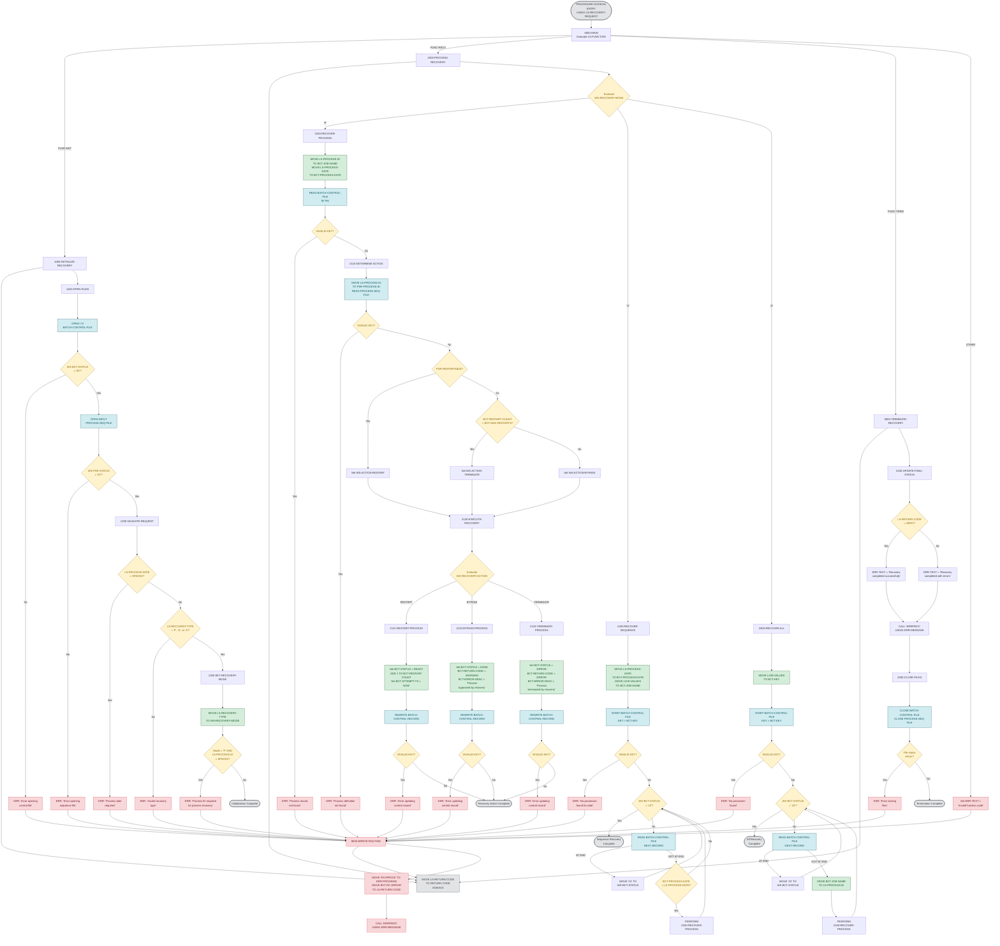

# RCVPRC00 — Process Recovery Handler

## Program Description

**RCVPRC00** is a batch COBOL program that provides process recovery capabilities for the Investment Portfolio Management System. It is invoked via `CALL` with a linkage area (`LS-RECOVERY-REQUEST`) that specifies one of three functions:

| Function | Description |
|----------|-------------|
| `INIT`   | Opens VSAM files, validates the recovery request, and sets the recovery mode. |
| `RECV`   | Executes recovery based on the selected mode — single process, all processes for a date, or all processes system-wide. |
| `TERM`   | Logs a final status message and closes all files. |

### Key Characteristics

- **File I/O (VSAM):** Two indexed files — `BATCH-CONTROL-FILE` (I-O, keyed on `BCT-KEY`) and `PROCESS-SEQ-FILE` (INPUT, keyed on `PSR-KEY`). Operations include `READ` (keyed and sequential), `START`, `REWRITE`, `OPEN`, and `CLOSE`.
- **CALL Statements:** Calls external program `ERRPROC` for error logging and final status reporting.
- **Copybooks:** `BCHCTL`, `PRCSEQ` (file records), `BCHCON` (batch constants), `ERRHAND` (error handling fields).
- **Recovery Modes:** Process (`P`), Sequence (`S`), All (`A`).
- **Recovery Actions:** Restart (`R`), Bypass (`B`), Terminate (`T`) — determined by whether the process is restartable and how many restart attempts have occurred.
- **DB2 Operations:** None. This program operates exclusively on VSAM files.

---

## Logic Flow Diagram

---

## Paragraph Reference

| Paragraph | Purpose |
|-----------|---------|
| `0000-MAIN` | Entry point. Dispatches to INIT, RECV, or TERM based on `LS-FUNCTION`. Sets `RETURN-CODE` and returns via `GOBACK`. |
| `1000-INITIALIZE-RECOVERY` | Orchestrates initialization: open files, validate request, set recovery mode. |
| `1100-OPEN-FILES` | Opens `BATCH-CONTROL-FILE` (I-O) and `PROCESS-SEQ-FILE` (INPUT). Checks file statuses. |
| `1200-VALIDATE-REQUEST` | Validates `LS-PROCESS-DATE` is not spaces and `LS-RECOVERY-TYPE` is `P`, `S`, or `A`. |
| `1300-SET-RECOVERY-MODE` | Sets `WS-RECOVERY-MODE`. Validates `LS-PROCESS-ID` is present when mode is `P`. |
| `2000-PROCESS-RECOVERY` | Dispatches to recovery handler based on mode: Process, Sequence, or All. |
| `2100-RECOVER-PROCESS` | Reads the batch control record by key, determines recovery action, and executes it. |
| `2110-DETERMINE-ACTION` | Reads process definition from `PROCESS-SEQ-FILE`. Sets action to Restart (if restartable), Terminate (if max restarts exceeded), or Bypass. |
| `2120-EXECUTE-RECOVERY` | Dispatches to Restart, Bypass, or Terminate based on determined action. |
| `2121-RESTART-PROCESS` | Sets status to READY, increments restart count, timestamps, and rewrites the control record. |
| `2122-BYPASS-PROCESS` | Sets status to DONE with WARNING return code and rewrites the control record. |
| `2123-TERMINATE-PROCESS` | Sets status to ERROR with ERROR return code and rewrites the control record. |
| `2200-RECOVER-SEQUENCE` | Positions at the given date and sequentially recovers all matching processes. |
| `2300-RECOVER-ALL` | Positions at the start of the file and recovers every process record. |
| `3000-TERMINATE-RECOVERY` | Orchestrates termination: logs final status, closes files. |
| `3100-UPDATE-FINAL-STATUS` | Logs success or error message via `CALL 'ERRPROC'`. |
| `3200-CLOSE-FILES` | Closes both VSAM files and checks for close errors. |
| `9000-ERROR-ROUTINE` | Sets program name and error return code, calls `ERRPROC` for error logging. |

## External Program Calls

| Program | Usage |
|---------|-------|
| `ERRPROC` | Called in `9000-ERROR-ROUTINE` and `3100-UPDATE-FINAL-STATUS` for error/status logging. Receives `ERR-MESSAGE`. |

## File I/O Summary

| File | DD Name | Access | Operations |
|------|---------|--------|------------|
| `BATCH-CONTROL-FILE` | `BCHCTL` | I-O (Indexed, Dynamic) | `OPEN`, `READ` (keyed), `START`, `READ NEXT`, `REWRITE`, `CLOSE` |
| `PROCESS-SEQ-FILE` | `PRCSEQ` | INPUT (Indexed, Dynamic) | `OPEN`, `READ` (keyed), `CLOSE` |

## Copybooks Used

| Copybook | Section | Purpose |
|----------|---------|---------|
| `BCHCTL` | FILE SECTION | Record layout for Batch Control File |
| `PRCSEQ` | FILE SECTION | Record layout for Process Sequence File |
| `BCHCON` | WORKING-STORAGE | Batch processing constants (status codes, return codes) |
| `ERRHAND` | WORKING-STORAGE | Error handling fields (`ERR-TEXT`, `ERR-PROGRAM`, `ERR-MESSAGE`) |
