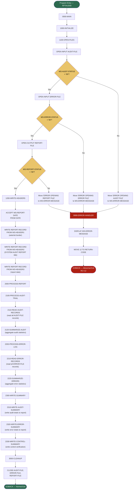

# RPTAUD00 — Audit Report Generator

## Program Description

RPTAUD00 is a batch COBOL program that generates a comprehensive system audit report. It reads from two indexed input files — an audit trail log (`AUDITLOG`) and an error log (`ERRLOG`) — and produces a formatted sequential report (`RPTFILE`). The report includes:

- **Security audit trails** — login/logout events, user actions, system events
- **Process audit reporting** — transaction create/update/delete/inquire records
- **Error summary reporting** — aggregated error records by program, category, and severity
- **Control verification** — summary totals and control counts

The program uses three copybooks: `AUDITLOG` (audit record layout with level-88 type/action/status flags), `ERRHAND` (error categories, return codes, VSAM status handling), and `RTNCODE` (return code management). There are no CALL statements or DB2 operations; all data is sourced from VSAM indexed files.

### Files

| Logical Name | DD Name    | Organization | Access     | Direction |
|-------------|------------|--------------|------------|-----------|
| AUDIT-FILE  | `AUDITLOG` | Indexed      | Sequential | Input     |
| ERROR-FILE  | `ERRLOG`   | Indexed      | Sequential | Input     |
| REPORT-FILE | `RPTFILE`  | Sequential   | Sequential | Output    |

## Logic Flow Diagram

