# RPTPOS00 — Daily Position Report Generator

## Program Description

**RPTPOS00** is a batch COBOL program that generates the Daily Position Report for the Investment Portfolio Management System. It reads portfolio positions from an indexed VSAM master file (`POSMSTRE`) and transaction activity from an indexed VSAM history file (`TRANHIST`), then produces a fixed-length (132-column) sequential report file (`RPTFILE`).

The report includes:

- **Portfolio position details** — portfolio ID, description, quantity, current market value, and percent change from the previous value.
- **Transaction activity summary** — aggregated view of transactions processed during the period.
- **Exception reporting** — positions or transactions that fall outside expected thresholds.
- **Performance metrics** — key indicators derived from position and transaction data.

### Key Characteristics

| Attribute | Detail |
|---|---|
| Program ID | `RPTPOS00` |
| Type | Batch report generator |
| Input Files | `POSMSTRE` (Position Master, indexed VSAM), `TRANHIST` (Transaction History, indexed VSAM) |
| Output Files | `RPTFILE` (Report, sequential fixed-length 132-byte records) |
| Copybooks | `POSREC`, `TRNREC` (file section), `RTNCODE`, `ERRHAND` (working storage) |
| CALL Statements | None — self-contained program |
| DB2 Operations | None — purely VSAM file-based |
| Error Handling | Centralized via `9999-ERROR-HANDLER`; sets return code 12 and terminates on any file open failure |

## Logic Flow Diagram

```mermaid
flowchart TD
    START([Program Entry<br/>RPTPOS00]) --> MAIN["<b>0000-MAIN</b>"]

    MAIN --> INIT["<b>1000-INITIALIZE</b>"]
    INIT --> OPEN["<b>1100-OPEN-FILES</b>"]

    OPEN --> OPEN_POS["OPEN INPUT<br/>POSITION-MASTER"]
    OPEN_POS --> CHK_POS{WS-POSITION-STATUS<br/>= '00'?}
    CHK_POS -- No --> ERR1["MOVE 'ERROR OPENING<br/>POSITION MASTER'<br/>to WS-ERROR-MESSAGE"]
    ERR1 --> ERRH1["<b>9999-ERROR-HANDLER</b><br/>DISPLAY message<br/>MOVE 12 TO RETURN-CODE<br/>GOBACK"]
    CHK_POS -- Yes --> OPEN_TRN["OPEN INPUT<br/>TRANSACTION-HISTORY"]

    OPEN_TRN --> CHK_TRN{WS-TRAN-STATUS<br/>= '00'?}
    CHK_TRN -- No --> ERR2["MOVE 'ERROR OPENING<br/>TRANSACTION HISTORY'<br/>to WS-ERROR-MESSAGE"]
    ERR2 --> ERRH2["<b>9999-ERROR-HANDLER</b><br/>DISPLAY message<br/>MOVE 12 TO RETURN-CODE<br/>GOBACK"]
    CHK_TRN -- Yes --> OPEN_RPT["OPEN OUTPUT<br/>REPORT-FILE"]

    OPEN_RPT --> CHK_RPT{WS-REPORT-STATUS<br/>= '00'?}
    CHK_RPT -- No --> ERR3["MOVE 'ERROR OPENING<br/>REPORT FILE'<br/>to WS-ERROR-MESSAGE"]
    ERR3 --> ERRH3["<b>9999-ERROR-HANDLER</b><br/>DISPLAY message<br/>MOVE 12 TO RETURN-CODE<br/>GOBACK"]
    CHK_RPT -- Yes --> HEADERS["<b>1200-WRITE-HEADERS</b><br/>ACCEPT date FROM DATE<br/>WRITE Header1 (stars)<br/>WRITE Header2 (title)<br/>WRITE Header3 (date)"]

    HEADERS --> PROCESS["<b>2000-PROCESS-REPORT</b>"]
    PROCESS --> READPOS["<b>2100-READ-POSITIONS</b>"]

    READPOS --> FIRST_READ["READ POSITION-MASTER"]
    FIRST_READ --> EOF_CHK{AT END?}
    EOF_CHK -- Yes --> SKIP_LOOP["Skip position loop"]
    EOF_CHK -- No --> LOOP_START["Enter PERFORM UNTIL<br/>END-OF-POSITIONS loop"]

    LOOP_START --> FORMAT["<b>2110-FORMAT-POSITION</b><br/>MOVE POS-PORTFOLIO-ID<br/>MOVE POS-DESCRIPTION<br/>MOVE POS-QUANTITY<br/>MOVE POS-CURRENT-VALUE<br/>COMPUTE change % =<br/>&lpar;current - previous&rpar; /<br/>previous * 100<br/>WRITE detail to report"]
    FORMAT --> NEXT_READ["READ POSITION-MASTER"]
    NEXT_READ --> LOOP_CHK{AT END?}
    LOOP_CHK -- Yes --> SKIP_LOOP
    LOOP_CHK -- No --> LOOP_START

    SKIP_LOOP --> PROC_TRN["<b>2200-PROCESS-TRANSACTIONS</b>"]
    PROC_TRN --> READ_TRN["<b>2210-READ-TRANSACTIONS</b><br/>(read TRANSACTION-HISTORY)"]
    READ_TRN --> SUM_ACT["<b>2220-SUMMARIZE-ACTIVITY</b><br/>(aggregate transaction data)"]

    SUM_ACT --> SUMMARY["<b>2300-WRITE-SUMMARY</b>"]
    SUMMARY --> TOTALS["<b>2310-WRITE-TOTALS</b><br/>(write summary totals<br/>to report)"]
    TOTALS --> EXCEPT["<b>2320-WRITE-EXCEPTIONS</b><br/>(write exception items<br/>to report)"]
    EXCEPT --> METRICS["<b>2330-WRITE-METRICS</b><br/>(write performance<br/>metrics to report)"]

    METRICS --> CLEANUP["<b>3000-CLEANUP</b><br/>CLOSE POSITION-MASTER<br/>CLOSE TRANSACTION-HISTORY<br/>CLOSE REPORT-FILE"]
    CLEANUP --> GOBACK([GOBACK<br/>Program Exit])

    style START fill:#2d6a4f,color:#fff
    style GOBACK fill:#2d6a4f,color:#fff
    style ERRH1 fill:#d62828,color:#fff
    style ERRH2 fill:#d62828,color:#fff
    style ERRH3 fill:#d62828,color:#fff
    style CHK_POS fill:#f4a261,color:#000
    style CHK_TRN fill:#f4a261,color:#000
    style CHK_RPT fill:#f4a261,color:#000
    style EOF_CHK fill:#f4a261,color:#000
    style LOOP_CHK fill:#f4a261,color:#000
    style FORMAT fill:#264653,color:#fff
    style HEADERS fill:#264653,color:#fff
    style TOTALS fill:#264653,color:#fff
    style EXCEPT fill:#264653,color:#fff
    style METRICS fill:#264653,color:#fff
```



## Paragraph Reference

| Paragraph | Purpose |
|---|---|
| `0000-MAIN` | Top-level driver: initialize, process, cleanup, then GOBACK |
| `1000-INITIALIZE` | Orchestrates file opens and header writes |
| `1100-OPEN-FILES` | Opens all three files (POSITION-MASTER, TRANSACTION-HISTORY, REPORT-FILE) with status checks |
| `1200-WRITE-HEADERS` | Accepts system date and writes the three report header lines |
| `2000-PROCESS-REPORT` | Orchestrates position reading, transaction processing, and summary writing |
| `2100-READ-POSITIONS` | Reads POSITION-MASTER sequentially until EOF, formatting each record |
| `2110-FORMAT-POSITION` | Formats a single position record (portfolio, description, quantity, value, % change) and writes it |
| `2200-PROCESS-TRANSACTIONS` | Orchestrates transaction reading and summarization |
| `2210-READ-TRANSACTIONS` | Reads TRANSACTION-HISTORY records |
| `2220-SUMMARIZE-ACTIVITY` | Aggregates transaction data for the summary section |
| `2300-WRITE-SUMMARY` | Orchestrates totals, exceptions, and metrics output |
| `2310-WRITE-TOTALS` | Writes summary totals to the report |
| `2320-WRITE-EXCEPTIONS` | Writes exception items to the report |
| `2330-WRITE-METRICS` | Writes performance metrics to the report |
| `3000-CLEANUP` | Closes all three files |
| `9999-ERROR-HANDLER` | Displays error message, sets RETURN-CODE to 12, and terminates via GOBACK |

## File I/O Summary

```
 POSITION-MASTER (POSMSTRE)          TRANSACTION-HISTORY (TRANHIST)
 +--------------------------+        +-----------------------------+
 | Indexed VSAM             |        | Indexed VSAM                |
 | Key: POS-KEY             |        | Key: TRAN-KEY               |
 |   POS-PORTFOLIO-ID (8)   |        |   TRN-DATE (8)              |
 |   POS-DATE (8)           |        |   TRN-TIME (6)              |
 |   POS-INVESTMENT-ID (10) |        |   TRN-PORTFOLIO-ID (8)      |
 | Access: Sequential read  |        |   TRN-SEQUENCE-NO (6)       |
 +--------------------------+        | Access: Sequential read     |
            |                        +-----------------------------+
            |                                    |
            +----------------+-------------------+
                             |
                             v
                  +---------------------+
                  | REPORT-FILE (RPTFILE)|
                  | Sequential output    |
                  | Fixed 132-byte recs  |
                  +---------------------+
```
