# RPTSTA00 — System Statistics Report Generator

## Program Overview

**Program ID:** `RPTSTA00`
**Type:** Batch
**Purpose:** Generates a system performance and statistics report by reading DB2 and batch execution statistics from indexed VSAM files, calculating performance metrics (averages, success rates), and writing a formatted report to a sequential output file.

### Key Characteristics

| Attribute            | Details                                                                 |
|----------------------|-------------------------------------------------------------------------|
| **Input Files**      | `DB2-STATS` (indexed VSAM, sequential read), `BATCH-STATS` (indexed VSAM, sequential read) |
| **Output Files**     | `REPORT-FILE` (sequential, 132-byte fixed-length records)              |
| **Copybooks**        | `DB2STAT`, `BCHCTL`, `RTNCODE`, `ERRHAND`                             |
| **CALL Statements**  | None                                                                    |
| **DB2 SQL**          | None (reads pre-collected statistics from VSAM files)                  |
| **Error Handling**   | File-status checks on every OPEN; errors routed to `9999-ERROR-HANDLER` (RC=12, GOBACK) |
| **Report Sections**  | DB2 performance metrics, Batch job metrics, Trend analysis             |

### Report Sections Produced

1. **Header Block** — Title, report date
2. **DB2 Statistics** — Total calls, average response time
3. **Batch Statistics** — Total jobs, success rate (%)
4. **Trend Analysis** — Performance trends over time

---

## Logic Flow Diagram

```mermaid
flowchart TD
    START([RPTSTA00 Program Start]) --> MAIN["0000-MAIN"]

    MAIN --> INIT["1000-INITIALIZE"]
    MAIN --> PROCESS["2000-PROCESS-REPORT"]
    MAIN --> CLEANUP["3000-CLEANUP"]
    CLEANUP --> GOBACK([GOBACK — Return to Caller])

    %% ── 1000-INITIALIZE ──
    subgraph INIT_SUB ["1000-INITIALIZE"]
        direction TB
        INIT_START["1000-INITIALIZE"] --> OPEN_FILES["1100-OPEN-FILES"]
        OPEN_FILES --> WRITE_HDR["1200-WRITE-HEADERS"]
        WRITE_HDR --> INIT_ACC["1300-INIT-ACCUMULATORS"]
    end

    %% ── 1100-OPEN-FILES ──
    subgraph OPEN_SUB ["1100-OPEN-FILES"]
        direction TB
        OPEN_DB2["OPEN INPUT DB2-STATS"] --> CHK_DB2{WS-DB2-STATUS = '00'?}
        CHK_DB2 -- No --> ERR1["MOVE 'ERROR OPENING DB2 STATS'\nto WS-ERROR-MESSAGE"]
        ERR1 --> ERR_HANDLER1["PERFORM 9999-ERROR-HANDLER"]
        CHK_DB2 -- Yes --> OPEN_BCH["OPEN INPUT BATCH-STATS"]
        OPEN_BCH --> CHK_BCH{WS-BCH-STATUS = '00'?}
        CHK_BCH -- No --> ERR2["MOVE 'ERROR OPENING BATCH STATS'\nto WS-ERROR-MESSAGE"]
        ERR2 --> ERR_HANDLER2["PERFORM 9999-ERROR-HANDLER"]
        CHK_BCH -- Yes --> OPEN_RPT["OPEN OUTPUT REPORT-FILE"]
        OPEN_RPT --> CHK_RPT{WS-REPORT-STATUS = '00'?}
        CHK_RPT -- No --> ERR3["MOVE 'ERROR OPENING REPORT FILE'\nto WS-ERROR-MESSAGE"]
        ERR3 --> ERR_HANDLER3["PERFORM 9999-ERROR-HANDLER"]
        CHK_RPT -- Yes --> OPEN_DONE["All files opened successfully"]
    end

    %% ── 1200-WRITE-HEADERS ──
    subgraph HDR_SUB ["1200-WRITE-HEADERS"]
        direction TB
        GET_DATE["ACCEPT WS-REPORT-DATE FROM DATE"] --> WR_H1["WRITE REPORT-RECORD FROM WS-HEADER1\n(asterisk border line)"]
        WR_H1 --> WR_H2["WRITE REPORT-RECORD FROM WS-HEADER2\n(report title)"]
        WR_H2 --> WR_H3["WRITE REPORT-RECORD FROM WS-HEADER3\n(report date)"]
    end

    %% ── 1300-INIT-ACCUMULATORS ──
    subgraph ACC_SUB ["1300-INIT-ACCUMULATORS"]
        direction TB
        INIT_PERF["INITIALIZE WS-PERFORMANCE-METRICS\n(zeroes all DB2 and Batch accumulators)"]
    end

    %% ── 2000-PROCESS-REPORT ──
    subgraph PROC_SUB ["2000-PROCESS-REPORT"]
        direction TB
        PROC_START["2000-PROCESS-REPORT"] --> DB2_STATS["2100-PROCESS-DB2-STATS"]
        DB2_STATS --> BCH_STATS["2200-PROCESS-BATCH-STATS"]
        BCH_STATS --> CALC_MET["2300-CALCULATE-METRICS"]
        CALC_MET --> WRITE_RPT["2400-WRITE-REPORT"]
    end

    %% ── 2100-PROCESS-DB2-STATS ──
    subgraph DB2_SUB ["2100-PROCESS-DB2-STATS"]
        direction TB
        RD_DB2_1["READ DB2-STATS"] --> CHK_EOF_DB2{AT END?}
        CHK_EOF_DB2 -- Yes --> DB2_DONE["SET END-OF-DB2-STATS TO TRUE\n(skip loop)"]
        CHK_EOF_DB2 -- No --> DB2_LOOP["PERFORM UNTIL END-OF-DB2-STATS"]
        DB2_LOOP --> ACC_DB2["2110-ACCUMULATE-DB2-STATS\n(aggregate DB2 call counts,\nelapsed time, CPU, wait)"]
        ACC_DB2 --> RD_DB2_N["READ DB2-STATS"]
        RD_DB2_N --> CHK_EOF_DB2_N{AT END?}
        CHK_EOF_DB2_N -- Yes --> DB2_EOF["SET END-OF-DB2-STATS TO TRUE\n(exit loop)"]
        CHK_EOF_DB2_N -- No --> DB2_LOOP
    end

    %% ── 2200-PROCESS-BATCH-STATS ──
    subgraph BCH_SUB ["2200-PROCESS-BATCH-STATS"]
        direction TB
        RD_BCH_1["READ BATCH-STATS"] --> CHK_EOF_BCH{AT END?}
        CHK_EOF_BCH -- Yes --> BCH_DONE["SET END-OF-BATCH-STATS TO TRUE\n(skip loop)"]
        CHK_EOF_BCH -- No --> BCH_LOOP["PERFORM UNTIL END-OF-BATCH-STATS"]
        BCH_LOOP --> ACC_BCH["2210-ACCUMULATE-BATCH-STATS\n(aggregate job counts,\nsuccess/fail counts, elapsed)"]
        ACC_BCH --> RD_BCH_N["READ BATCH-STATS"]
        RD_BCH_N --> CHK_EOF_BCH_N{AT END?}
        CHK_EOF_BCH_N -- Yes --> BCH_EOF["SET END-OF-BATCH-STATS TO TRUE\n(exit loop)"]
        CHK_EOF_BCH_N -- No --> BCH_LOOP
    end

    %% ── 2300-CALCULATE-METRICS ──
    subgraph CALC_SUB ["2300-CALCULATE-METRICS"]
        direction TB
        CALC_DB2["2310-CALC-DB2-METRICS\n(compute avg response time:\nWS-DB2-ELAPSED / WS-DB2-CALLS)"]
        CALC_DB2 --> CALC_BCH["2320-CALC-BATCH-METRICS\n(compute success rate:\nWS-BATCH-SUCCESS / WS-BATCH-JOBS * 100)"]
    end

    %% ── 2400-WRITE-REPORT ──
    subgraph WRITE_SUB ["2400-WRITE-REPORT"]
        direction TB
        WR_DB2["2410-WRITE-DB2-SECTION\n(write DB2 calls count,\navg response time)"]
        WR_DB2 --> WR_BCH["2420-WRITE-BATCH-SECTION\n(write batch job totals,\nsuccess rate %)"]
        WR_BCH --> WR_TREND["2430-WRITE-TREND-ANALYSIS\n(write trend analysis section)"]
    end

    %% ── 3000-CLEANUP ──
    subgraph CLOSE_SUB ["3000-CLEANUP"]
        direction TB
        CLOSE_ALL["CLOSE DB2-STATS\nCLOSE BATCH-STATS\nCLOSE REPORT-FILE"]
    end

    %% ── 9999-ERROR-HANDLER ──
    subgraph ERR_SUB ["9999-ERROR-HANDLER"]
        direction TB
        DISP_ERR["DISPLAY WS-ERROR-MESSAGE"] --> SET_RC["MOVE 12 TO RETURN-CODE"]
        SET_RC --> ERR_GOBACK([GOBACK — Abnormal Termination])
    end

    %% ── Link subgraphs to main flow ──
    INIT --> INIT_SUB
    OPEN_FILES --> OPEN_SUB
    WRITE_HDR --> HDR_SUB
    INIT_ACC --> ACC_SUB
    PROCESS --> PROC_SUB
    DB2_STATS --> DB2_SUB
    BCH_STATS --> BCH_SUB
    CALC_MET --> CALC_SUB
    WRITE_RPT --> WRITE_SUB
    CLEANUP --> CLOSE_SUB
    ERR_HANDLER1 --> ERR_SUB
    ERR_HANDLER2 --> ERR_SUB
    ERR_HANDLER3 --> ERR_SUB

    %% ── Styles ──
    classDef startEnd fill:#2d6a4f,stroke:#1b4332,color:#fff
    classDef process fill:#264653,stroke:#1d3557,color:#fff
    classDef decision fill:#e76f51,stroke:#c1440e,color:#fff
    classDef error fill:#9d0208,stroke:#6a040f,color:#fff
    classDef io fill:#457b9d,stroke:#1d3557,color:#fff
    classDef subHead fill:#2a9d8f,stroke:#264653,color:#fff

    class START,GOBACK,ERR_GOBACK startEnd
    class MAIN,INIT,PROCESS,CLEANUP process
    class CHK_DB2,CHK_BCH,CHK_RPT,CHK_EOF_DB2,CHK_EOF_BCH,CHK_EOF_DB2_N,CHK_EOF_BCH_N decision
    class ERR1,ERR2,ERR3,DISP_ERR,SET_RC error
    class OPEN_DB2,OPEN_BCH,OPEN_RPT,RD_DB2_1,RD_DB2_N,RD_BCH_1,RD_BCH_N,CLOSE_ALL,WR_H1,WR_H2,WR_H3,WR_DB2,WR_BCH,WR_TREND io
```



---

## Data Flow Summary

```
+------------------+       +-------------------+
|   DB2-STATS      |       |   BATCH-STATS     |
|  (Indexed VSAM)  |       |  (Indexed VSAM)   |
|                  |       |                   |
| - DB2 call count |       | - Job name        |
| - Elapsed time   |       | - Process status  |
| - CPU time       |       | - Start/End time  |
| - Wait time      |       | - Return code     |
+--------+---------+       +---------+---------+
         |                           |
         v                           v
    2100-PROCESS              2200-PROCESS
    -DB2-STATS                -BATCH-STATS
         |                           |
         +----------+    +-----------+
                    |    |
                    v    v
             2300-CALCULATE-METRICS
             (avg response, success %)
                    |
                    v
             2400-WRITE-REPORT
                    |
                    v
         +---------------------+
         |    REPORT-FILE      |
         |   (Sequential)      |
         |                     |
         | - Header block      |
         | - DB2 statistics    |
         | - Batch statistics  |
         | - Trend analysis    |
         +---------------------+
```

## Paragraph Reference

| Paragraph              | Purpose                                                                 |
|------------------------|-------------------------------------------------------------------------|
| `0000-MAIN`            | Top-level driver: initialize, process, cleanup, then GOBACK             |
| `1000-INITIALIZE`      | Orchestrates file opens, header writes, and accumulator initialization  |
| `1100-OPEN-FILES`      | Opens all three files with status checks; errors route to 9999          |
| `1200-WRITE-HEADERS`   | Accepts system date and writes three header lines to report             |
| `1300-INIT-ACCUMULATORS` | Zeros all performance metric accumulators                             |
| `2000-PROCESS-REPORT`  | Orchestrates stats collection, metric calculation, and report output    |
| `2100-PROCESS-DB2-STATS` | Reads DB2-STATS sequentially, accumulates metrics until EOF           |
| `2110-ACCUMULATE-DB2-STATS` | Aggregates individual DB2 record values into running totals        |
| `2200-PROCESS-BATCH-STATS` | Reads BATCH-STATS sequentially, accumulates metrics until EOF       |
| `2210-ACCUMULATE-BATCH-STATS` | Aggregates individual batch record values into running totals    |
| `2300-CALCULATE-METRICS` | Computes derived metrics from accumulated totals                      |
| `2310-CALC-DB2-METRICS`  | Calculates DB2 average response time                                 |
| `2320-CALC-BATCH-METRICS` | Calculates batch job success rate percentage                        |
| `2400-WRITE-REPORT`     | Writes all report detail sections to output file                      |
| `2410-WRITE-DB2-SECTION` | Formats and writes DB2 statistics detail line                        |
| `2420-WRITE-BATCH-SECTION` | Formats and writes batch statistics detail line                    |
| `2430-WRITE-TREND-ANALYSIS` | Writes trend analysis section to report                           |
| `3000-CLEANUP`          | Closes all three files                                                |
| `9999-ERROR-HANDLER`    | Displays error message, sets RC=12, terminates with GOBACK            |
