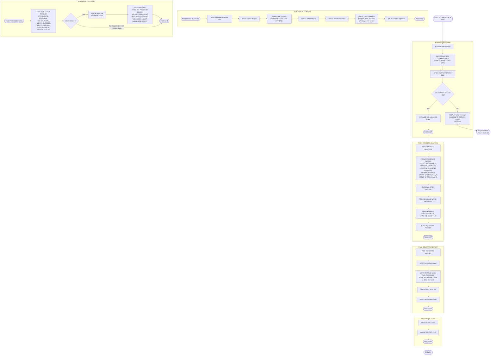

# RTNANA00 - Return Code Analysis Utility

## Program Description

**RTNANA00** is a batch COBOL program that analyzes return codes across the system and produces a formatted analysis report. It queries the `RTNCODES` DB2 table to aggregate return code statistics by program, categorizing each entry as Success (`S`), Warning (`W`), Error (`E`), or Severe/Fatal (`F`). The program generates a sequential report file containing per-program breakdowns and summary totals.

### Key Characteristics

| Attribute         | Details                                                                 |
|-------------------|-------------------------------------------------------------------------|
| **Program ID**    | RTNANA00                                                                |
| **Type**          | Batch                                                                   |
| **File I/O**      | Sequential output to `REPORT-FILE` (DD name `RPTFILE`, fixed 133-byte records) |
| **DB2 Table**     | `RTNCODES` (columns: `PROGRAM_ID`, `STATUS_CODE`)                      |
| **DB2 Cursor**    | `PRGCUR` - aggregates counts by `PROGRAM_ID` with `GROUP BY` / `ORDER BY` |
| **CALL Statements** | None                                                                  |
| **SQLCA**         | Included for DB2 return code handling                                   |

### Sections and Paragraphs

| Paragraph               | Purpose                                                        |
|--------------------------|----------------------------------------------------------------|
| `P100-INIT-PROGRAM`      | Captures current date/time, opens report file, initializes counters |
| `P200-PROCESS-ANALYSIS`  | Declares and opens DB2 cursor, drives header and detail writing, closes cursor |
| `P210-WRITE-HEADERS`     | Writes report header lines (title, date/time, column headers)  |
| `P220-PROCESS-DETAIL`    | Fetches each row from cursor, writes detail line, accumulates totals |
| `P300-GENERATE-REPORT`   | Writes summary totals line at end of report                    |
| `P900-CLOSE-FILES`       | Closes the report file                                         |

## Logic Flow Diagram

