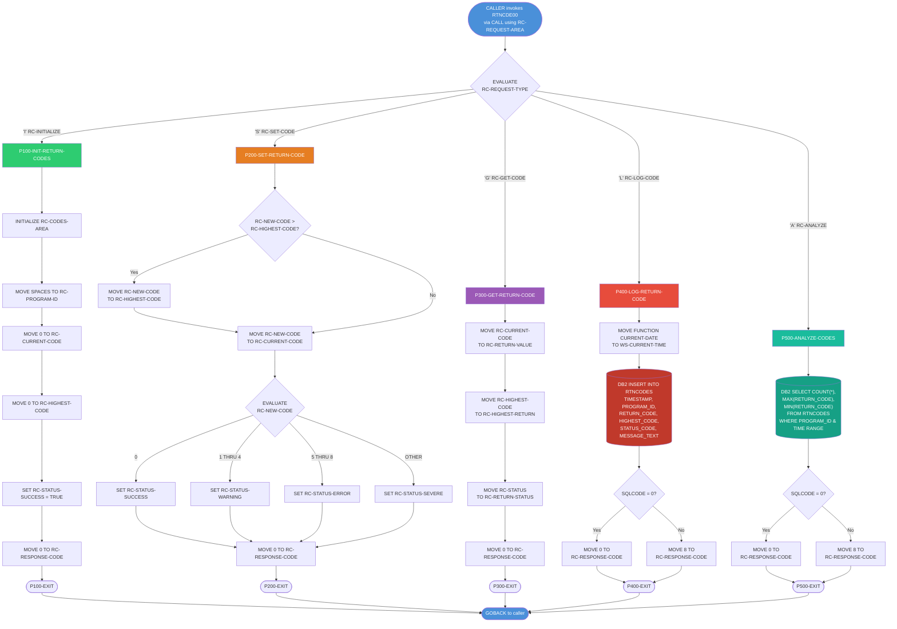

# RTNCDE00 — Standard Return Code Handler

## Program Description

**RTNCDE00** is a reusable COBOL subprogram that provides centralized return code management across the Investment Portfolio Management System. It is invoked via `CALL` from other programs using a shared `LINKAGE SECTION` communication area defined in the `RTNCODE` copybook.

The program supports five operations, dispatched by an `EVALUATE` on the request type flag (`RC-REQUEST-TYPE`):

| Request Type | Flag | Paragraph | Description |
|---|---|---|---|
| Initialize | `I` | `P100-INIT-RETURN-CODES` | Resets all return code fields to defaults |
| Set Code | `S` | `P200-SET-RETURN-CODE` | Sets a new return code and derives status |
| Get Code | `G` | `P300-GET-RETURN-CODE` | Retrieves current and highest return codes |
| Log Code | `L` | `P400-LOG-RETURN-CODE` | Inserts a return code record into DB2 `RTNCODES` table |
| Analyze | `A` | `P500-ANALYZE-CODES` | Queries DB2 for aggregate return code statistics |

### Key Characteristics

- **No File I/O**: The program does not perform any VSAM or sequential file operations.
- **DB2 Operations**: Two SQL statements — an `INSERT` (P400) and a `SELECT` aggregate query (P500) — interact with the `RTNCODES` table.
- **No CALL Statements**: RTNCDE00 does not call any other subprograms; it is a leaf-level utility.
- **Linkage Section Interface**: All data is exchanged through `RC-REQUEST-AREA` (copybook `RTNCODE`), making it a stateless, reentrant service.
- **SQLCA**: Included for DB2 return code checking (`SQLCODE`).

## Logic Flow Diagram

## Data Structures

### RTNCODE Copybook (`src/copybook/common/RTNCODE.cpy`)

| Field | PIC | Purpose |
|---|---|---|
| `RC-REQUEST-TYPE` | `X` | Operation selector (`I`/`S`/`G`/`L`/`A`) |
| `RC-PROGRAM-ID` | `X(8)` | Calling program identifier |
| `RC-CURRENT-CODE` | `S9(4) COMP` | Most recently set return code |
| `RC-HIGHEST-CODE` | `S9(4) COMP` | High-water mark across all set operations |
| `RC-NEW-CODE` | `S9(4) COMP` | Input code for Set operation |
| `RC-STATUS` | `X` | Derived status: `S`=Success, `W`=Warning, `E`=Error, `F`=Severe |
| `RC-MESSAGE` | `X(80)` | Free-text message for logging |
| `RC-RESPONSE-CODE` | `S9(8) COMP` | 0 = OK, 8 = DB2 failure |
| `RC-START-TIME` / `RC-END-TIME` | `X(26)` | Time range for Analyze query |
| `RC-TOTAL-CODES` | `S9(8) COMP` | Count result from Analyze |
| `RC-MAX-CODE` / `RC-MIN-CODE` | `S9(4) COMP` | Aggregate results from Analyze |
| `RC-RETURN-VALUE` | `S9(4) COMP` | Output: current code (Get) |
| `RC-HIGHEST-RETURN` | `S9(4) COMP` | Output: highest code (Get) |
| `RC-RETURN-STATUS` | `X` | Output: status flag (Get) |

### DB2 Table — `RTNCODES` (`src/database/db2/RTNCODES.sql`)

| Column | Type | Notes |
|---|---|---|
| `TIMESTAMP` | `TIMESTAMP` | PK (with PROGRAM_ID) |
| `PROGRAM_ID` | `CHAR(8)` | PK |
| `RETURN_CODE` | `INTEGER` | Current code at log time |
| `HIGHEST_CODE` | `INTEGER` | High-water mark at log time |
| `STATUS_CODE` | `CHAR(1)` | Derived status flag |
| `MESSAGE_TEXT` | `VARCHAR(80)` | Optional message |
