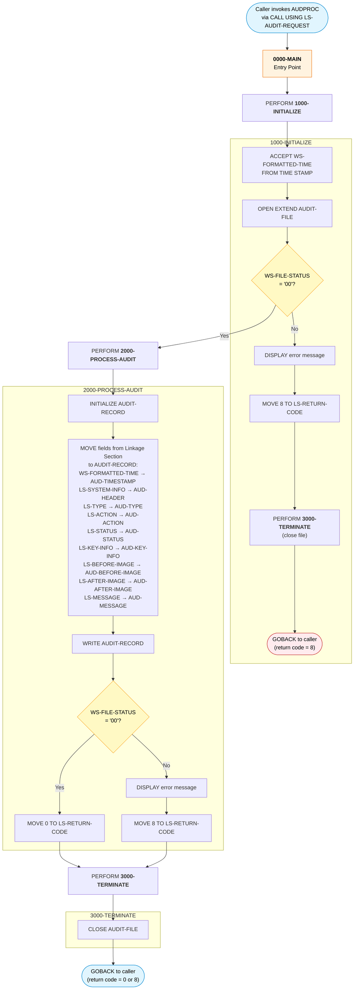

# AUDPROC - Audit Trail Processing Subroutine

## Program Description

**AUDPROC** is a COBOL subroutine that provides centralized audit trail logging for the Investment Portfolio Management System. It is invoked via `CALL` from other programs (batch, online, and utility) through the `LINKAGE SECTION`, receiving an audit request record that contains system information, audit type, action, status, key identifiers, before/after data images, and a free-text message.

The program writes a single audit record to a sequential audit trail file (`AUDFILE`) in append mode. It performs file status validation after both the `OPEN` and `WRITE` operations, returning a status code (`LS-RETURN-CODE`) to the caller: `0` for success or `8` for any file I/O error.

### Key Characteristics

| Attribute | Detail |
|---|---|
| **Program Type** | Called subroutine (`CALL` / `GOBACK`) |
| **File I/O** | Sequential file — `OPEN EXTEND`, `WRITE`, `CLOSE` |
| **DB2 Operations** | None |
| **CICS Usage** | None |
| **CALL Statements** | None (leaf program) |
| **Copybook** | `AUDITLOG` — defines the `AUDIT-RECORD` layout |
| **Linkage** | `LS-AUDIT-REQUEST` — caller-provided audit data |
| **Return Codes** | `0` = Success, `8` = File I/O error |

### Audit Record Fields (via AUDITLOG copybook)

| Field | Size | Description | Level-88 Values |
|---|---|---|---|
| `AUD-TIMESTAMP` | X(26) | Timestamp from system clock | — |
| `AUD-SYSTEM-ID` | X(8) | Originating system identifier | — |
| `AUD-USER-ID` | X(8) | User performing the action | — |
| `AUD-PROGRAM` | X(8) | Calling program name | — |
| `AUD-TERMINAL` | X(8) | Terminal identifier | — |
| `AUD-TYPE` | X(4) | Audit event type | `TRAN`, `USER`, `SYST` |
| `AUD-ACTION` | X(8) | Action performed | `CREATE`, `UPDATE`, `DELETE`, `INQUIRE`, `LOGIN`, `LOGOUT`, `STARTUP`, `SHUTDOWN` |
| `AUD-STATUS` | X(4) | Outcome status | `SUCC`, `FAIL`, `WARN` |
| `AUD-PORTFOLIO-ID` | X(8) | Portfolio identifier | — |
| `AUD-ACCOUNT-NO` | X(10) | Account number | — |
| `AUD-BEFORE-IMAGE` | X(100) | Data state before change | — |
| `AUD-AFTER-IMAGE` | X(100) | Data state after change | — |
| `AUD-MESSAGE` | X(100) | Free-text audit message | — |

---

## Logic Flow Diagram

