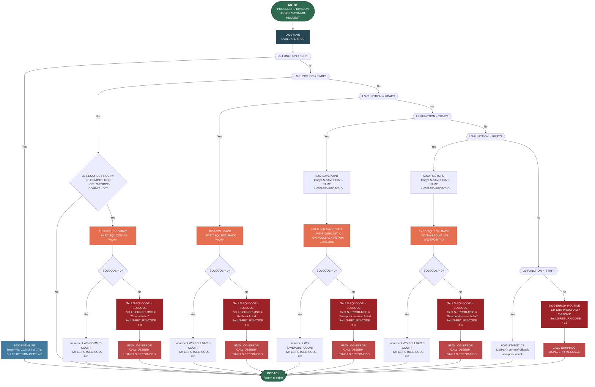

# DB2CMT — DB2 Commit Controller: Logic Flow Diagram

## Program Overview

**DB2CMT** is a reusable COBOL sub-program that provides centralized DB2 transaction commit control for the Investment Portfolio Management System. It is called by other programs via the `CALL` statement and receives instructions through the `LS-COMMIT-REQUEST` linkage area.

The program supports six functions:

| Function Code | Name         | Description                                      |
|---------------|--------------|--------------------------------------------------|
| `INIT`        | Initialize   | Resets commit/rollback/savepoint counters        |
| `CMIT`        | Commit       | Conditionally issues a DB2 `COMMIT WORK`         |
| `RBAK`        | Rollback     | Issues a DB2 `ROLLBACK WORK`                     |
| `SAVE`        | Savepoint    | Creates a named DB2 savepoint                    |
| `REST`        | Restore      | Rolls back to a named DB2 savepoint              |
| `STAT`        | Statistics   | Displays commit/rollback/savepoint counts        |

### Key Characteristics

- **No file I/O** — all persistence is handled through DB2 SQL operations.
- **Copybooks used**: `SQLCA` (SQL Communication Area), `DBPROC` (DB2 standard procedures), `ERRHAND` (standard error handling definitions).
- **External CALL statements**: `ERRPROC` (error processing routine) and `DB2ERR` (DB2-specific error logging).
- **Linkage-driven**: The caller controls behavior by setting `LS-FUNCTION`, `LS-SAVEPOINT-NAME`, `LS-RECORDS-PROC`, `LS-COMMIT-FREQ`, and `LS-FORCE-FLAG`.

## Mermaid Flowchart

## Legend

| Shape / Color | Meaning |
|---|---|
| Green rounded rectangles | Program entry and exit (`GOBACK`) |
| Dark blue rectangle | Main dispatcher (`EVALUATE TRUE`) |
| Blue rectangle | Initialization paragraph |
| Orange/red rectangles | DB2 SQL operations (`COMMIT`, `ROLLBACK`, `SAVEPOINT`) |
| Dark red rectangles | Error states (return code 8 or 12) |
| Red rectangles | External error-handling calls (`DB2ERR`, `ERRPROC`) |
| Hexagons | Function-code decision branches |
| Diamonds | Conditional logic (SQLCODE checks, commit-frequency checks) |

## DB2 Operations Summary

| Paragraph | SQL Statement | Purpose |
|---|---|---|
| `2100-ISSUE-COMMIT` | `COMMIT WORK` | Persist all pending changes |
| `3000-ROLLBACK` | `ROLLBACK WORK` | Undo all changes since last commit |
| `4000-SAVEPOINT` | `SAVEPOINT :id ON ROLLBACK RETAIN CURSORS` | Create a named recovery point |
| `5000-RESTORE` | `ROLLBACK TO SAVEPOINT :id` | Undo changes back to a named savepoint |

## External Calls

| Paragraph | Called Program | Data Passed | Purpose |
|---|---|---|---|
| `9000-ERROR-ROUTINE` | `ERRPROC` | `ERR-MESSAGE` (from `ERRHAND` copybook) | General error processing |
| `9100-LOG-ERROR` | `DB2ERR` | `LS-ERROR-INFO` (SQLCODE + error message) | DB2-specific error logging |
