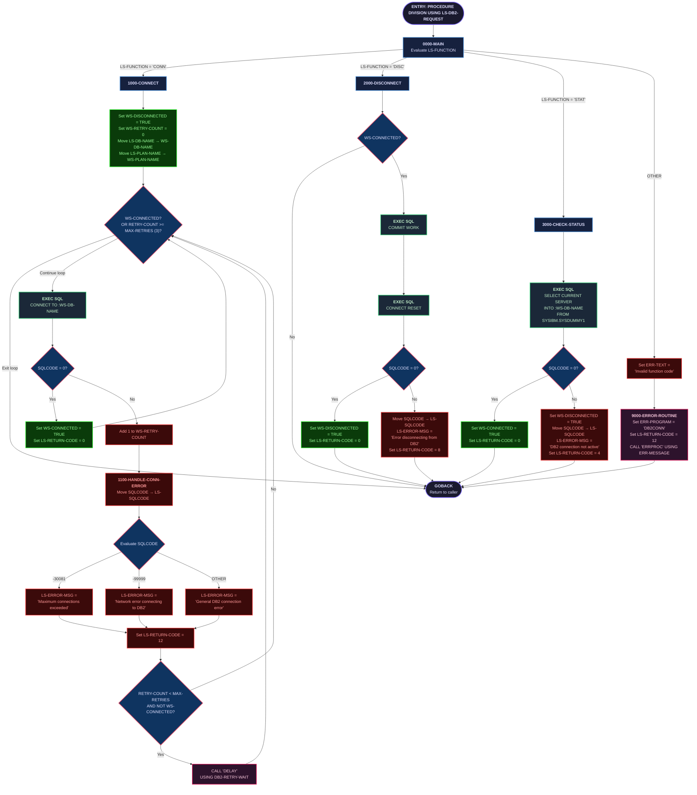

# DB2CONN — DB2 Connection Manager

## Program Description

**DB2CONN** is a shared utility COBOL program that provides centralized DB2 connection management for the Investment Portfolio Management System. It is invoked via `CALL` from other programs through the `LINKAGE SECTION` interface and supports three operations:

- **CONN** — Establish a DB2 connection with retry logic (up to 3 attempts with a delay between retries).
- **DISC** — Gracefully disconnect from DB2 after committing pending work.
- **STAT** — Check whether the DB2 connection is still active by querying `SYSIBM.SYSDUMMY1`.

The program uses copybooks `SQLCA` (DB2 SQL Communication Area), `DBPROC` (standard DB2 procedures and retry parameters), and `ERRHAND` (standard error message structure and return codes). Return codes follow the standard convention: 0 = success, 4 = warning, 8 = error, 12 = severe.

### Key Characteristics

| Aspect | Detail |
|---|---|
| **Program ID** | `DB2CONN` |
| **Type** | Called subprogram (no `STOP RUN`) |
| **Interface** | `LINKAGE SECTION` / `PROCEDURE DIVISION USING` |
| **Copybooks** | `SQLCA`, `DBPROC`, `ERRHAND` |
| **CALL Statements** | `CALL 'DELAY'` (retry wait), `CALL 'ERRPROC'` (error logging) |
| **DB2 Operations** | `CONNECT TO`, `COMMIT WORK`, `CONNECT RESET`, `SELECT CURRENT SERVER` |
| **File I/O** | None |
| **CICS** | None (batch utility) |

---

## Logic Flow Diagram

