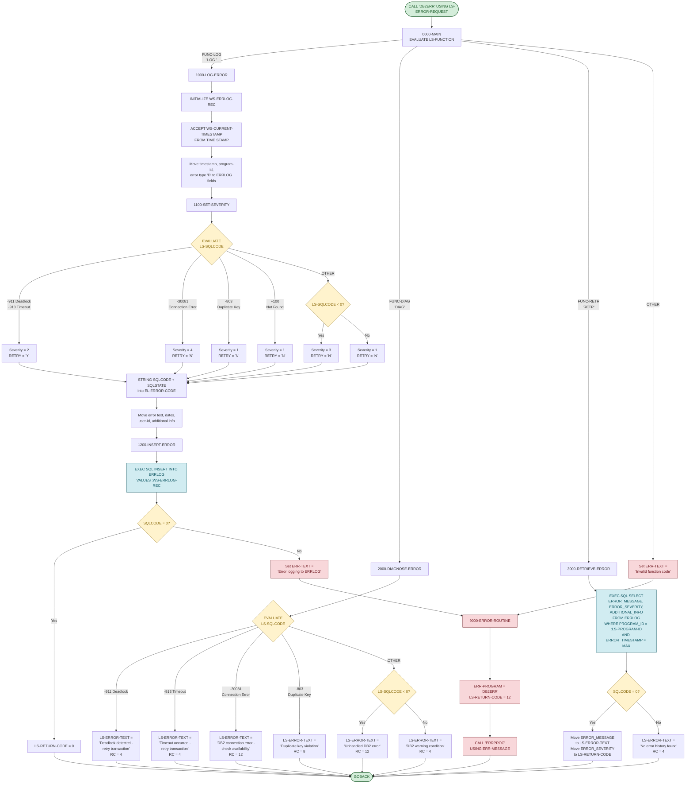

# DB2ERR — DB2 SQL Error Handler

## Program Overview

**Program ID:** `DB2ERR`
**Location:** `src/programs/common/DB2ERR.cbl`

DB2ERR is a shared utility program that provides centralized DB2 SQL error handling for the Investment Portfolio Management System. It is invoked via `CALL` from other programs through a linkage section interface (`LS-ERROR-REQUEST`) and supports three functions:

| Function | Code   | Description |
|----------|--------|-------------|
| **LOG**  | `LOG ` | Logs a DB2 error to the `ERRLOG` table with severity classification and retry guidance. |
| **DIAG** | `DIAG` | Diagnoses a SQLCODE and returns a human-readable error description with a return code. |
| **RETR** | `RETR` | Retrieves the most recent error record for a given program from the `ERRLOG` table. |

### Key Characteristics

- **Copybooks used:** `DBTBLS` (DB2 table layouts), `SQLCA` (SQL Communication Area), `DBPROC` (DB2 standard procedures), `ERRHAND` (error handling definitions).
- **DB2 operations:** `INSERT INTO ERRLOG` (logging), `SELECT FROM ERRLOG` (retrieval).
- **CALL statements:** Calls external program `ERRPROC` for fatal error escalation.
- **SQLCODE categories handled:** Deadlock (`-911`), Timeout (`-913`), Connection Error (`-30081`), Duplicate Key (`-803`), Not Found (`+100`).
- **No file I/O:** All persistence is through DB2 SQL operations.

## Logic Flow Diagram

