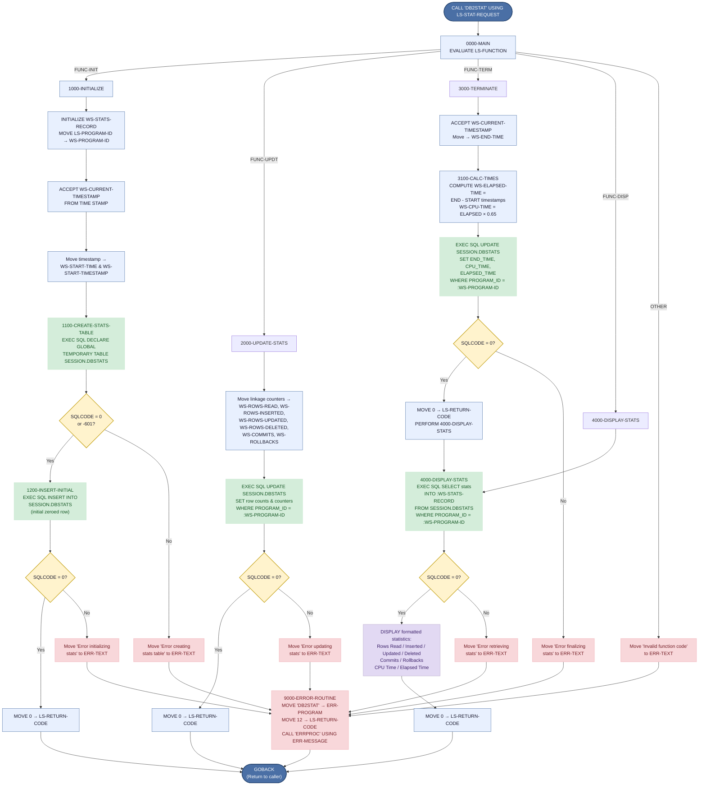

# DB2STAT — DB2 Statistics Collector

## Program Description

**DB2STAT** is a shared COBOL utility program that collects and reports DB2 execution statistics for other programs in the Investment Portfolio Management System. It is invoked via `CALL` with a linkage-section request structure (`LS-STAT-REQUEST`) that specifies one of four function codes:

| Function | Code   | Purpose |
|----------|--------|---------|
| INIT     | `INIT` | Initialize statistics tracking — creates a DB2 Global Temporary Table (`SESSION.DBSTATS`) and inserts an initial row for the calling program. |
| UPDT     | `UPDT` | Update running statistics (rows read/inserted/updated/deleted, commits, rollbacks) from the caller's counters. |
| TERM     | `TERM` | Finalize statistics — captures end timestamp, calculates elapsed and CPU time, updates the table, and displays results. |
| DISP     | `DISP` | Display current statistics by querying the temporary table and writing formatted output. |

### Key Characteristics

- **Type**: Called sub-program (not standalone) — receives parameters via `LINKAGE SECTION`.
- **DB2 Operations**: `DECLARE GLOBAL TEMPORARY TABLE`, `INSERT`, `UPDATE`, `SELECT INTO`.
- **Copybooks**: `SQLCA` (DB2 communication area), `DBPROC` (DB2 standard procedures), `ERRHAND` (error handling definitions).
- **External CALL**: Invokes `ERRPROC` for error logging when any DB2 operation fails.
- **No File I/O**: All persistence is through the DB2 temporary table `SESSION.DBSTATS`.
- **Error Handling**: Every DB2 operation checks `SQLCODE`; failures route to `9000-ERROR-ROUTINE` which sets return code 12 and calls `ERRPROC`.

---

## Logic Flow Diagram

---

## Paragraph Reference

| Paragraph | Lines | Purpose |
|-----------|-------|---------|
| `0000-MAIN` | 58–74 | Entry point — dispatches to the appropriate function based on `LS-FUNCTION`. |
| `1000-INITIALIZE` | 76–86 | Initializes stats record, captures start timestamp, creates temp table, inserts initial row. |
| `1100-CREATE-STATS-TABLE` | 88–109 | Executes `DECLARE GLOBAL TEMPORARY TABLE SESSION.DBSTATS`. Tolerates SQLCODE -601 (table already exists). |
| `1200-INSERT-INITIAL` | 111–128 | Inserts zeroed-out initial statistics row for the calling program. |
| `2000-UPDATE-STATS` | 130–155 | Copies linkage counters to working storage and updates the DB2 row. |
| `3000-TERMINATE` | 157–178 | Captures end timestamp, calculates times, finalizes DB2 row, and displays results. |
| `3100-CALC-TIMES` | 180–187 | Computes elapsed time (end − start) and estimates CPU time as 65% of elapsed. |
| `4000-DISPLAY-STATS` | 189–222 | Queries the temp table and writes formatted statistics to SYSOUT via `DISPLAY`. |
| `9000-ERROR-ROUTINE` | 224–228 | Sets return code 12 and calls external `ERRPROC` for error logging. |

## DB2 Operations Summary

| Operation | SQL Statement | Table | Paragraph |
|-----------|--------------|-------|-----------|
| DDL | `DECLARE GLOBAL TEMPORARY TABLE` | `SESSION.DBSTATS` | `1100-CREATE-STATS-TABLE` |
| INSERT | `INSERT INTO SESSION.DBSTATS` | `SESSION.DBSTATS` | `1200-INSERT-INITIAL` |
| UPDATE | `UPDATE SESSION.DBSTATS SET row counts` | `SESSION.DBSTATS` | `2000-UPDATE-STATS` |
| UPDATE | `UPDATE SESSION.DBSTATS SET times` | `SESSION.DBSTATS` | `3000-TERMINATE` |
| SELECT | `SELECT ... INTO :WS-STATS-RECORD` | `SESSION.DBSTATS` | `4000-DISPLAY-STATS` |

## External Dependencies

| Dependency | Type | Source |
|------------|------|--------|
| `SQLCA` | Copybook | DB2 SQL Communication Area |
| `DBPROC` | Copybook | `src/copybook/db2/DBPROC.cpy` — standard DB2 procedures |
| `ERRHAND` | Copybook | `src/copybook/common/ERRHAND.cpy` — error handling definitions |
| `ERRPROC` | Called program | External error processing routine |
