# ERRPROC - Standard Error Processing Subroutine

## Program Overview

**ERRPROC** is a shared COBOL subroutine that provides standardized error processing for the Investment Portfolio Management System. It is invoked via `CALL` from other programs and receives error details through a linkage section parameter (`LS-ERROR-REQUEST`).

The program performs three main functions:
1. **Initializes** the error logging environment by opening a sequential error log file in extend mode.
2. **Processes** the error by formatting fields from the caller into a standard error message structure (defined in the `ERRHAND` copybook), writing the record to the error log file, and displaying the error to the system console.
3. **Terminates** by closing the error log file and returning control to the caller with the error severity as the return code.

### Key Characteristics

| Attribute          | Details                                                    |
|--------------------|------------------------------------------------------------|
| **Program ID**     | ERRPROC                                                    |
| **Type**           | Called subroutine (entered via `CALL`, exits via `GOBACK`) |
| **Copybooks**      | `ERRHAND` (error categories, return codes, message layout) |
| **File I/O**       | Sequential file `ERROR-LOG` (OPEN EXTEND, WRITE, CLOSE)   |
| **DB2 Operations** | None                                                       |
| **CICS Usage**     | None                                                       |
| **CALL Statements**| None (this program is itself a called subroutine)          |

### Linkage Section Interface

The calling program passes `LS-ERROR-REQUEST`:

| Field              | PIC             | Description                        |
|--------------------|-----------------|------------------------------------|
| `LS-PROGRAM-ID`   | X(8)            | Name of the calling program        |
| `LS-CATEGORY`     | X(2)            | Error category (VS, VL, PR, SY)   |
| `LS-ERROR-CODE`   | X(4)            | Application-specific error code    |
| `LS-SEVERITY`     | S9(4) COMP      | Severity level (0, 4, 8, 12, 16)  |
| `LS-ERROR-TEXT`   | X(80)           | Short error description            |
| `LS-ERROR-DETAILS`| X(256)          | Extended error information         |
| `LS-RETURN-CODE`  | S9(4) COMP      | Return code set by ERRPROC        |

## Logic Flow Diagram

```mermaid
flowchart TD
    A([Caller invokes ERRPROC<br/>via CALL using LS-ERROR-REQUEST]) --> B[0000-MAIN]

    B --> C[PERFORM 1000-INITIALIZE]
    C --> C1[INITIALIZE WS-WORK-AREAS]
    C1 --> C2[ACCEPT WS-FORMATTED-TIME<br/>FROM TIME STAMP]
    C2 --> C3[OPEN EXTEND ERROR-LOG]
    C3 --> C4{WS-LOG-STATUS<br/>NOT = '00'?}
    C4 -- Yes --> C5[DISPLAY<br/>'Error opening log file:' WS-LOG-STATUS]
    C5 --> D
    C4 -- No --> D

    D[PERFORM 2000-PROCESS-ERROR]
    D --> D1[MOVE WS-FORMATTED-TIME<br/>TO ERR-TIMESTAMP]
    D1 --> D2[MOVE LS-PROGRAM-ID TO ERR-PROGRAM<br/>MOVE LS-CATEGORY TO ERR-CATEGORY<br/>MOVE LS-ERROR-CODE TO ERR-CODE<br/>MOVE LS-SEVERITY TO ERR-SEVERITY<br/>MOVE LS-ERROR-TEXT TO ERR-TEXT<br/>MOVE LS-ERROR-DETAILS TO ERR-DETAILS]
    D2 --> D3[PERFORM 2100-WRITE-LOG]

    D3 --> W1[MOVE ERR-MESSAGE TO LOG-DATA]
    W1 --> W2[WRITE ERROR-LOG-RECORD]
    W2 --> W3{WS-LOG-STATUS<br/>NOT = '00'?}
    W3 -- Yes --> W4[DISPLAY<br/>'Error writing to log:' WS-LOG-STATUS]
    W4 --> D4
    W3 -- No --> D4

    D4[PERFORM 2200-DISPLAY-ERROR]
    D4 --> E1["DISPLAY separator line (====)"]
    E1 --> E2[DISPLAY ERROR DETECTED: ERR-TIMESTAMP<br/>DISPLAY PROGRAM: ERR-PROGRAM<br/>DISPLAY CATEGORY: ERR-CATEGORY<br/>DISPLAY CODE: ERR-CODE<br/>DISPLAY SEVERITY: ERR-SEVERITY<br/>DISPLAY MESSAGE: ERR-TEXT<br/>DISPLAY DETAILS: ERR-DETAILS]
    E2 --> E3["DISPLAY separator line (====)"]
    E3 --> D5

    D5[MOVE LS-SEVERITY<br/>TO LS-RETURN-CODE]
    D5 --> F

    F[PERFORM 3000-TERMINATE]
    F --> F1[CLOSE ERROR-LOG]
    F1 --> G([GOBACK to caller<br/>LS-RETURN-CODE = severity])
```

