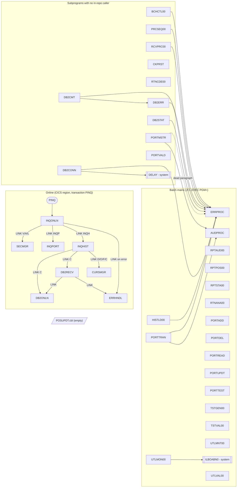

# Program Inventory and Call Graph

Source-derived inventory of every `.cbl` file under `src/programs/`, with entry
points, invocation style, static `CALL` / `EXEC CICS LINK` relationships,
copybook usage, and error/return-code behaviour.

All relationships below were extracted from the source text (`CALL '...'`,
`EXEC CICS LINK PROGRAM('...')`, `COPY`, `EXEC SQL INCLUDE`, `SELECT ... ASSIGN TO`).
Where a program's source is a stub or empty, that is stated explicitly rather than
inferred from the architecture prose.

## 1. Program count

| Source | Count |
|---|---|
| Jira AB-285 description | 37 programs |
| Epic AB-276 category breakdown (batch 11 + online 8 + portfolio 8 + common 6 + utility 3 + test 2) | 38 |
| `find src/programs -name '*.cbl'` | **38 files** |
| Files with a `PROGRAM-ID` | 37 |

The discrepancy is `src/programs/batch/POSUPDT.cbl`, which is a **zero-byte file**.
It is listed in the inventory as an empty placeholder (see P-04) so that the
"every program" acceptance criterion is met by enumeration, not by omission.

## 2. Inventory

Legend for **Kind**: `MAIN` = batch main program (no `PROCEDURE DIVISION USING`),
`SUB` = called subprogram (`PROCEDURE DIVISION USING ...`), `CICS` = CICS program
(entered via `DFHCOMMAREA` or `LINK`, exits with `EXEC CICS RETURN`).

### 2.1 Batch (`src/programs/batch/`, 11 files)

| # | PROGRAM-ID | File | Kind | Purpose (from source) | Implementation status |
|---|---|---|---|---|---|
| P-01 | `BCHCTL00` | batch/BCHCTL00.cbl | SUB | Batch control: INIT / CHEK / UPDT / TERM functions over the `BCHCTL` KSDS | Skeleton. Source comments say `1100-OPEN-FILES`, `1200-READ-CONTROL-RECORD`, `1300-VALIDATE-PROCESS`, `3300-WRITE-CONTROL-RECORD` etc. "remain to be implemented" |
| P-02 | `CKPRST` | batch/CKPRST.cbl | SUB | Checkpoint/restart service: INIT / TAKE / COMMIT / RESTART over `CKPTFILE` KSDS | Stub. `PROC-INIT`, `PROC-TAKE-CHECKPOINT`, `PROC-COMMIT-CHECKPOINT`, `PROC-RESTART` contain only comments |
| P-03 | `HISTLD00` | batch/HISTLD00.cbl | MAIN | Reads `TRANHIST` KSDS sequentially, maps `TH-*` to `PH-*` and `INSERT INTO POSHIST`; commits every N rows and updates `BCHCTL` checkpoint | Implemented |
| P-04 | *(none)* | batch/POSUPDT.cbl | — | Empty file (0 bytes). Architecture docs refer to a position-update step (`POSUPD00` / `POSUPDT`) that is expected to live here | **Missing** |
| P-05 | `PRCSEQ00` | batch/PRCSEQ00.cbl | SUB | Process-sequence manager: INIT / NEXT / STAT / TERM; walks `PRCSEQ` KSDS and checks hard/soft dependencies against `BCHCTL` | Implemented |
| P-06 | `RCVPRC00` | batch/RCVPRC00.cbl | SUB | Recovery processor: recovers a process (`P`), a sequence (`S`) or all (`A`); decides restart / bypass / terminate | Implemented |
| P-07 | `RPTAUD00` | batch/RPTAUD00.cbl | MAIN | Audit report: reads `AUDITLOG` + `ERRLOG` flat files, writes `RPTFILE` | Implemented (report body paragraphs are high-level) |
| P-08 | `RPTPOS00` | batch/RPTPOS00.cbl | MAIN | Daily position report: reads `POSMSTRE` + `TRANHIST`, computes % change, writes `RPTFILE` | Implemented |
| P-09 | `RPTSTA00` | batch/RPTSTA00.cbl | MAIN | System statistics report: reads `DB2STATS` + `BCHSTATS`, writes `RPTFILE` | Implemented; depends on missing copybook `DB2STAT` |
| P-10 | `RTNANA00` | batch/RTNANA00.cbl | MAIN | Return-code analysis report: cursor `PRGCUR` over DB2 `RTNCODES`, grouped by program | Implemented |
| P-11 | `RTNCDE00` | batch/RTNCDE00.cbl | SUB | Return-code service: INIT / SET / GET / LOG / ANALYZE; classifies codes and `INSERT INTO RTNCODES` | Implemented |

### 2.2 Common (`src/programs/common/`, 6 files)

| # | PROGRAM-ID | File | Kind | Purpose | Status |
|---|---|---|---|---|---|
| P-12 | `AUDPROC` | common/AUDPROC.cbl | SUB | Appends an `AUDIT-RECORD` to sequential `AUDFILE`; RC 0 / 8 | Implemented |
| P-13 | `DB2CMT` | common/DB2CMT.cbl | SUB | Unit-of-work service: COMMIT WORK, ROLLBACK WORK, SAVEPOINT, ROLLBACK TO SAVEPOINT; counts commits/rollbacks/savepoints | Implemented |
| P-14 | `DB2CONN` | common/DB2CONN.cbl | SUB | `CONNECT TO :WS-DB-NAME` with retry loop (`CALL 'DELAY'` between attempts), `CONNECT RESET`, `SELECT CURRENT SERVER` status | Implemented |
| P-15 | `DB2ERR` | common/DB2ERR.cbl | SUB | Classifies SQLCODE (-911, -913, -30081, -803, +100), `INSERT INTO ERRLOG`, retrieves last error for a program | Implemented |
| P-16 | `DB2STAT` | common/DB2STAT.cbl | SUB | Declares `SESSION.DBSTATS` global temp table; INSERT/UPDATE/SELECT run statistics; CPU estimated as 65 % of elapsed | Implemented |
| P-17 | `ERRPROC` | common/ERRPROC.cbl | SUB | Central batch error logger: formats `ERR-MESSAGE`, writes 400-byte record to sequential `ERRLOG`, DISPLAYs it, returns severity as RC | Implemented |

### 2.3 Online / CICS (`src/programs/online/`, 8 files)

| # | PROGRAM-ID | File | Kind | Purpose | Status |
|---|---|---|---|---|---|
| P-18 | `CURSMGR` | online/CURSMGR.cbl | CICS | Cursor service: DECLARE / OPEN / FETCH / CLOSE using host-variable cursor name and statement text; optional 20-row array fetch | Partially implemented (P300/P400 truncated at end of file) |
| P-19 | `DB2ONLN` | online/DB2ONLN.cbl | CICS | Online DB2 connection manager: `CONNECT TO POSMVP`, `DISCONNECT`, status; max 100 connections; generates a connection token | Implemented |
| P-20 | `DB2RECV` | online/DB2RECV.cbl | CICS | Recovery: reconnect via `LINK DB2ONLN` up to 3 times with `EXEC CICS DELAY`, `ROLLBACK`, cursor recovery via `LINK ERRHNDL` | Implemented |
| P-21 | `ERRHNDL` | online/ERRHNDL.cbl | CICS | Central online error handler: `INSERT INTO ERRLOG` (8-column shape), formats message, decides RETURN / CONTINUE / ABEND | Implemented; source is not in standard COBOL column format (starts in column 1) |
| P-22 | `INQHIST` | online/INQHIST.cbl | CICS | History inquiry: connects via `DB2ONLN`, recovers via `DB2RECV`, runs dynamic `SELECT ... FROM POSHIST WHERE ACCOUNT_NO = ?` through `CURSMGR`, `SEND MAP('HISMAP')` | Implemented |
| P-23 | `INQONLN` | online/INQONLN.cbl | CICS | Transaction `PINQ` entry: `RECEIVE MAP('INQMAP')`, dispatches MENU / INQP / INQH / EXIT, security check via `SECMGR` (validate, authorize, audit) | Implemented |
| P-24 | `INQPORT` | online/INQPORT.cbl | CICS | Position inquiry: `EXEC CICS READ FILE('POSFILE')` into `POSITION-RECORD`, `SEND MAP('POSMAP')` | Implemented; depends on missing `SQLPOS` include |
| P-25 | `SECMGR` | online/SECMGR.cbl | CICS | Security: `ASSIGN USERID`, `SELECT COUNT(*) FROM AUTHFILE`, `INSERT INTO AUDITLOG` (DB2) | Implemented; `AUTHFILE` and DB2 `AUDITLOG` tables have no DDL |

### 2.4 Portfolio (`src/programs/portfolio/`, 8 files)

| # | PROGRAM-ID | File | Kind | Purpose | Status |
|---|---|---|---|---|---|
| P-26 | `PORTADD` | portfolio/PORTADD.cbl | MAIN | Loads new `PORT-RECORD`s from `INPTFILE` into `PORTFILE` KSDS; counts adds / dups / errors | Implemented |
| P-27 | `PORTDEL` | portfolio/PORTDEL.cbl | MAIN | Deletes portfolios listed in `DELEFILE`; writes a 80-byte audit line to `AUDFILE` | Implemented |
| P-28 | `PORTMSTR` | portfolio/PORTMSTR.cbl | SUB | CRUD service over `PORTFILE` (C/R/U/D command byte, 100-byte record) | Implemented; `2100-LOG-PORTFOLIO-UPDATE` (performed on update) and `2100-HANDLE-VSAM-ERROR` (never performed) reference undeclared `LS-ERROR-REQUEST` / `LS-AUDIT-REQUEST` |
| P-29 | `PORTREAD` | portfolio/PORTREAD.cbl | MAIN | Sequential browse of `PORTFILE`, DISPLAYs each record | Implemented |
| P-30 | `PORTTEST` | portfolio/PORTTEST.cbl | MAIN | Generates 100 random `PORT-RECORD`s to `TESTFILE` | Implemented |
| P-31 | `PORTTRAN` | portfolio/PORTTRAN.cbl | MAIN | Validates `TRANFILE` transactions against `PORTFILE`; BU/SL/FE update units and cost; TR not implemented; audit via `AUDPROC` | Implemented; `2200-UPDATE-POSITIONS` is never PERFORMed from the main flow |
| P-32 | `PORTUPDT` | portfolio/PORTUPDT.cbl | MAIN | Applies S/V/N updates from `UPDTFILE` to `PORTFILE` | Implemented |
| P-33 | `PORTVALD` | portfolio/PORTVALD.cbl | SUB | Field validators: ID (`PORT` + 4 digits), account (numeric, non-zero), investment type (STK/BND/MMF/ETF), amount range | Implemented |

### 2.5 Test (`src/programs/test/`, 2 files)

| # | PROGRAM-ID | File | Kind | Purpose | Status |
|---|---|---|---|---|---|
| P-34 | `TSTGEN00` | test/TSTGEN00.cbl | MAIN | Test-data generator driven by `TSTCFG` (PORTFOLIO / TRANSACTN / ERROR / VOLUME); writes `PORTOUT`, `TRANOUT` | Skeleton – generator leaf paragraphs (`2210-`, `2220-`, `2310-`, `2320-`, `2410-`…`2520-`) are referenced but not defined |
| P-35 | `TSTVAL00` | test/TSTVAL00.cbl | MAIN | Test validator: reads `TESTCASE`, `EXPECTED`, `ACTUAL`; writes `TESTRPT` with pass/fail summary | Skeleton – `2200-`…`2800-` leaf paragraphs referenced but not defined |

### 2.6 Utility (`src/programs/utility/`, 3 files)

| # | PROGRAM-ID | File | Kind | Purpose | Status |
|---|---|---|---|---|---|
| P-36 | `UTLMNT00` | utility/UTLMNT00.cbl | MAIN | File maintenance driven by `CTLFILE` (ARCHIVE / CLEANUP / REORG / ANALYZE) | Skeleton – leaf paragraphs referenced but not defined |
| P-37 | `UTLMON00` | utility/UTLMON00.cbl | MAIN | System monitor loop until hour 23; reads `MONCFG`, `DB2STATS`; writes `MONLOG`, `ALERTS`; `CALL 'ILBOABN0'` | Skeleton – leaf paragraphs referenced but not defined; depends on missing copybook `DB2STAT` |
| P-38 | `UTLVAL00` | utility/UTLVAL00.cbl | MAIN | Data validation driven by `VALCTL` (INTEGRITY / XREF / FORMAT / BALANCE) over `POSMSTRE` + `TRANHIST`; writes `ERRRPT` | Skeleton – leaf paragraphs referenced but not defined |

## 3. Call graph

### 3.1 Static CALL edges (batch / portfolio)

Every `CALL 'literal'` in the source tree:

| Caller | Callee | Linkage passed | Notes |
|---|---|---|---|
| `BCHCTL00` | `ERRPROC` | `ERR-MESSAGE` | from `9000-ERROR-ROUTINE` |
| `HISTLD00` | `ERRPROC` | `ERR-MESSAGE` | followed by `ROLLBACK WORK` |
| `PRCSEQ00` | `ERRPROC` | `ERR-MESSAGE` | |
| `RCVPRC00` | `ERRPROC` | `ERR-MESSAGE` | |
| `DB2CMT` | `ERRPROC` | `ERR-MESSAGE` | RC 12 |
| `DB2CMT` | `DB2ERR` | `LS-ERROR-INFO` | logs SQL failures to DB2 `ERRLOG` |
| `DB2CONN` | `ERRPROC` | `ERR-MESSAGE` | RC 12 |
| `DB2CONN` | `DELAY` | `DB2-RETRY-WAIT` | **external / system routine, no source in repo** |
| `DB2ERR` | `ERRPROC` | `ERR-MESSAGE` | fallback when DB2 logging itself fails |
| `DB2STAT` | `ERRPROC` | `ERR-MESSAGE` | |
| `PORTMSTR` | `ERRPROC` | `LS-ERROR-REQUEST` | in `2100-HANDLE-VSAM-ERROR`, which is never PERFORMed; the group is not declared |
| `PORTMSTR` | `AUDPROC` | `LS-AUDIT-REQUEST` | in `2100-LOG-PORTFOLIO-UPDATE`, performed after every update; the group is not declared |
| `PORTTRAN` | `ERRPROC` | `ERR-MESSAGE` | |
| `PORTTRAN` | `AUDPROC` | `AUDIT-RECORD` | |
| `UTLMON00` | `ILBOABN0` | `WS-MINUTE` | **IBM runtime abend routine, no source in repo** |

Programs that are designed as subprograms but have **no caller anywhere in the
repository**: `BCHCTL00`, `CKPRST`, `PRCSEQ00`, `RCVPRC00`, `RTNCDE00`, `DB2CMT`,
`DB2CONN`, `DB2STAT`, `PORTMSTR`, `PORTVALD`. Their intended callers are described
in `documentation/technical/system-architecture.md` (a batch driver that invokes
`BCHCTL00` → `PRCSEQ00` → step programs, with `CKPRST` checkpointing) but that
driver does not exist in `src/`. This is the single most important gap for
migration sequencing: the orchestration layer must be re-derived from
`PRCSEQ.cpy` / `BCHCTL.cpy` semantics rather than ported from code.

### 3.2 CICS LINK edges (online)

| Caller | Callee | COMMAREA | Notes |
|---|---|---|---|
| CICS transaction `PINQ` | `INQONLN` | terminal / `INQCOM` | defined in `src/cics/PORTDFN.csd` |
| `INQONLN` | `SECMGR` | `WS-SECURITY-REQUEST` | three LINKs: `V` validate, `A` authorize (`INQONLN`/`READ`), `L` audit |
| `INQONLN` | `INQPORT` | `WS-COMMAREA` (`INQCOM`) | function `INQP` |
| `INQONLN` | `INQHIST` | `WS-COMMAREA` (`INQCOM`) | function `INQH` |
| `INQONLN` | `ERRHNDL` | `WS-ERROR-AREA` (`ERRHND`) | `P900-ERROR-ROUTINE`; `ABEND ABCODE('IERR')` if handler returns ABEND |
| `INQHIST` | `DB2ONLN` | `WS-DB2-REQUEST` | `C` connect |
| `INQHIST` | `DB2RECV` | `WS-RECOVERY-REQUEST` | `C` connection recovery; on success re-PERFORMs connect (recursive PERFORM of `P150`) |
| `INQHIST` | `CURSMGR` | `WS-CURSOR-REQUEST` | `D` declare, `O` open, `F` fetch, `C` close of `HISTORY_CURSOR` |
| `DB2RECV` | `DB2ONLN` | `WS-DB2-REQUEST` (`DB2REQ`) | reconnect attempts |
| `DB2RECV` | `ERRHNDL` | `WS-ERROR-AREA` (`ERRHND`) | cursor recovery |

`INQPORT` links to nothing; it reads `POSFILE` directly with `EXEC CICS READ`.
`CURSMGR`, `DB2ONLN`, `ERRHNDL`, `SECMGR` are leaf services.

### 3.3 Graph



### 3.4 Intended (documented) batch orchestration

From `documentation/technical/system-architecture.md` and `PRCSEQ.cpy`; **not
present as code**:

```
Driver (missing) ──► BCHCTL00 FUNC-INIT
                 ──► PRCSEQ00 FUNC-INIT / FUNC-NEXT  (reads PRCSEQ, checks BCHCTL deps)
                        │  for each PSR-PROGRAM:
                        ├─► TRNVAL00 / "TRNMAIN"  (no source)
                        ├─► POSUPD00 / POSUPDT     (empty file)
                        ├─► HISTLD00               (exists)
                        └─► RPTGEN00 / RPT*00      (RPTPOS00, RPTAUD00, RPTSTA00 exist)
                 ──► CKPRST  ENTRY-POINT-TAKE / COMMIT every N records  (stub)
                 ──► RCVPRC00 on failure                                (exists)
                 ──► BCHCTL00 FUNC-UPDT / FUNC-TERM
```

## 4. Per-program detail

Each entry lists: entry / dispatch; copybooks; files (DDNAME, org, open mode,
verbs); SQL; CICS; error / RC behaviour. `—` = none.

### P-01 `BCHCTL00`
- **Entry:** `PROCEDURE DIVISION USING LS-CONTROL-REQUEST`; dispatch on `FUNC-INIT` / `FUNC-CHEK` / `FUNC-UPDT` / `FUNC-TERM`, `WHEN OTHER` → error.
- **COPY:** `BCHCTL` (FD), `BCHCON`, `ERRHAND`.
- **Files:** `BCHCTL` – KSDS, `ACCESS DYNAMIC`, key `BCT-KEY`, status `WS-BCT-STATUS`. Verbs intended: READ / WRITE / REWRITE (paragraphs unimplemented).
- **SQL / CICS:** —
- **Errors:** `9000-ERROR-ROUTINE` sets `ERR-PROGRAM='BCHCTL00'`, `LS-RETURN-CODE = BCT-RC-ERROR (8)`, `CALL 'ERRPROC'`. `MOVE LS-RETURN-CODE TO RETURN-CODE` before `GOBACK`.

### P-02 `CKPRST`
- **Entry:** `PROCEDURE DIVISION USING CHECKPOINT-CONTROL RETURN-STATUS`; dispatch on `ENTRY-POINT-INIT / TAKE / COMMIT / RESTART`.
- **COPY:** `CKPRST` (linkage), `RETHND` (linkage).
- **Files:** `CKPTFILE` – KSDS, dynamic, key `CKR-KEY`, status `WS-FILE-STATUS`. No I/O verbs implemented.
- **Errors:** none implemented; contract is `RETURN-STATUS` (`RETHND`).

### P-03 `HISTLD00`
- **Entry:** `0000-MAIN` → `1000-INITIALIZE` (connect, open, read checkpoint) → `2000-PROCESS` loop → `3000-TERMINATE` (final commit, update checkpoint, disconnect).
- **COPY:** `HISTREC` (FD), `BCHCTL` (FD), `DBTBLS` (in `EXEC SQL BEGIN DECLARE SECTION`), `SQLCA`, `DBPROC`, `ERRHAND`, `BCHCON`.
- **Name mismatch:** the program reads `TH-KEY`, `TH-ACCOUNT-NO`, `TH-PORTFOLIO-ID`, `TH-TRANS-DATE`, `TH-QUANTITY`, `TH-PRICE` … but `HISTREC.cpy` defines `HIST-KEY`, `HIST-PORTFOLIO-ID`, `HIST-BEFORE-IMAGE` … (an audit-image record, not a transaction). The `TH-*` layout is the one described in the data dictionary for `TRANHIST` and matches `POSHIST` columns; it has no copybook in the repo.
- **Files:** `TRANHIST` – KSDS, `ACCESS SEQUENTIAL`, key `TH-KEY`, READ NEXT; `BCHCTL` – KSDS dynamic, READ / REWRITE for checkpoint.
- **SQL:** `CONNECT` (via `DBPROC` `CONNECT-TO-DB2` → `POSMVP`), `INSERT INTO POSHIST VALUES (:POSHIST-RECORD)`, `COMMIT WORK` every `WS-COMMIT-THRESHOLD` rows, `ROLLBACK WORK` on error, `CONNECT RESET`.
- **Errors:** `9000-ERROR-ROUTINE` → `CALL 'ERRPROC'` then `ROLLBACK WORK`.
- **Data flow:** `TRANHIST(TH-*)` → `POSHIST-RECORD(PH-*)` → DB2 `POSHIST`; progress → `BCHCTL` record.

### P-04 `POSUPDT.cbl`
- Empty file. No `PROGRAM-ID`. Documented behaviour (data-dictionary §"Position Update"): apply validated transactions to `POSMSTRE`, checkpoint every 500 updates, enforce non-negative share balance, recalc average cost on buys.

### P-05 `PRCSEQ00`
- **Entry:** `USING LS-SEQUENCE-REQUEST`; `FUNC-INIT / FUNC-NEXT / FUNC-STAT / FUNC-TERM`.
- **COPY:** `PRCSEQ` (FD), `BCHCTL` (FD), `BCHCON`, `ERRHAND`.
- **Files:** `PRCSEQ` – KSDS dynamic, key `PSR-KEY`, READ / READ NEXT; `BCHCTL` – KSDS dynamic, READ by `(BCT-JOB-NAME, BCT-PROCESS-DATE)`.
- **Errors:** `9000-ERROR-ROUTINE` → `ERRPROC`. Dependency rule in `2210-CHECK-DEP-STATUS`: dependency not DONE and hard → RC 4 (wait); dependency DONE but `BCT-RETURN-CODE > PSR-DEP-RC` → RC 8.

### P-06 `RCVPRC00`
- **Entry:** `USING` `LS-PROCESS-DATE`, `LS-PROCESS-ID`, `LS-RECOVERY-TYPE` (`P`/`S`/`A`), `LS-RECOVERY-PARM`.
- **COPY:** `BCHCTL`, `PRCSEQ` (FDs), `BCHCON`, `ERRHAND`.
- **Files:** `BCHCTL` KSDS (READ / REWRITE), `PRCSEQ` KSDS (READ).
- **Errors:** `ERRPROC`. Decision: `PSR-RESTARTABLE` → restart (`BCT-STATUS='R'`, `BCT-RESTART-COUNT+1`, `BCT-ATTEMPT-TS`); else if `BCT-RESTART-COUNT > BCT-MAX-RESTARTS(3)` → terminate; else bypass.

### P-07 `RPTAUD00`
- **COPY:** `AUDITLOG`, `ERRHAND`, `RTNCODE`.
- **Files:** `AUDITLOG` (seq, INPUT), `ERRLOG` (seq, INPUT), `RPTFILE` (seq, OUTPUT, 132-byte lines).
- **Errors:** `9999-ERROR-HANDLER`: DISPLAY, `RETURN-CODE = 12`, `GOBACK`.

### P-08 `RPTPOS00`
- **COPY:** `POSREC`, `TRNREC`, `RTNCODE`, `ERRHAND`.
- **Files:** `POSMSTRE` (KSDS, INPUT), `TRANHIST` (KSDS, INPUT), `RPTFILE` (seq, OUTPUT).
- **Logic:** `WS-POS-CHANGE-PCT = (POS-CURRENT-VALUE − POS-PREVIOUS-VALUE) / POS-PREVIOUS-VALUE × 100` (no zero-divisor guard). Note: `POS-CURRENT-VALUE`/`POS-PREVIOUS-VALUE` are not fields of `POSREC.cpy`.
- **Errors:** RC 12 + GOBACK.

### P-09 `RPTSTA00`
- **COPY:** `DB2STAT` (**not in `src/copybook`**), `BCHCTL`, `RTNCODE`, `ERRHAND`.
- **Files:** `DB2STATS` (INPUT), `BCHSTATS` (INPUT), `RPTFILE` (OUTPUT).
- **Errors:** RC 12 + GOBACK.

### P-10 `RTNANA00`
- **COPY:** `EXEC SQL INCLUDE SQLCA`.
- **Files:** `RPTFILE` (seq, OUTPUT).
- **SQL:** `DECLARE PRGCUR CURSOR FOR SELECT PROGRAM_ID, COUNT(*), COUNT(CASE STATUS_CODE='S'), …'W', 'E', 'F' FROM RTNCODES GROUP BY PROGRAM_ID ORDER BY PROGRAM_ID`; OPEN / FETCH / CLOSE.
- **Errors:** DISPLAY SQLCODE, RC 12.

### P-11 `RTNCDE00`
- **Entry:** `USING RETURN-CODE-AREA` (`RTNCODE.cpy`); `RC-INITIALIZE / RC-SET-CODE / RC-GET-CODE / RC-LOG-CODE / RC-ANALYZE`.
- **COPY:** `RTNCODE`, `INCLUDE SQLCA`.
- **SQL:** `INSERT INTO RTNCODES (TIMESTAMP, PROGRAM_ID, RETURN_CODE, HIGHEST_CODE, STATUS_CODE, MESSAGE_TEXT)`; analysis `SELECT ... FROM RTNCODES`.
- **Logic:** classification `0`→S, `1–4`→W, `5–8`→E, other→F; `RC-HIGHEST-CODE = MAX(RC-HIGHEST-CODE, RC-NEW-CODE)`.

### P-12 `AUDPROC`
- **Entry:** `USING LS-AUDIT-REQUEST` (system id, user, program, terminal, type, action, status, portfolio/account, before/after images, message, RC).
- **COPY:** `AUDITLOG` (FD).
- **Files:** `AUDFILE` (seq, `OPEN EXTEND`/WRITE). RC 0 success, 8 on open/write failure.

### P-13 `DB2CMT`
- **Entry:** `USING LS-COMMIT-REQUEST` (function C/R/S/B, savepoint name, RC, error msg).
- **COPY:** `SQLCA`, `DBPROC`, `ERRHAND`.
- **SQL:** `COMMIT WORK`, `ROLLBACK WORK`, `SAVEPOINT :WS-SAVEPOINT-ID ON ROLLBACK RETAIN CURSORS`, `ROLLBACK TO SAVEPOINT`.
- **Errors:** `CALL 'DB2ERR'`; generic → `ERRPROC`, RC 12.

### P-14 `DB2CONN`
- **Entry:** `USING LS-CONN-REQUEST` (connect / disconnect / status).
- **COPY:** `SQLCA`, `DBPROC`, `ERRHAND`.
- **SQL:** `CONNECT TO :WS-DB-NAME` in `PERFORM UNTIL WS-CONNECTED OR WS-RETRY-COUNT >= WS-MAX-RETRIES` with `CALL 'DELAY' USING DB2-RETRY-WAIT`; `COMMIT WORK` + `CONNECT RESET`; `SELECT CURRENT SERVER INTO :WS-DB-NAME FROM SYSIBM.SYSDUMMY1`.
- **Errors:** `ERRPROC`, RC 12.

### P-15 `DB2ERR`
- **Entry:** `USING LS-ERROR-INFO` (program id, SQLCODE, function log/get/classify).
- **COPY:** `SQLCA`, `DBPROC`, `DBTBLS REPLACING …` (for `ERRLOG-RECORD`), `ERRHAND`.
- **SQL:** `INSERT INTO ERRLOG VALUES (:WS-ERRLOG-REC)`; `SELECT ERROR_MESSAGE, ERROR_SEVERITY, ADDITIONAL_INFO FROM ERRLOG WHERE PROGRAM_ID=:… AND ERROR_TIMESTAMP=(SELECT MAX(ERROR_TIMESTAMP) …)`.
- **Logic:** SQLCODE classes: −911 deadlock, −913 timeout, −30081 connection, −803 duplicate, +100 not found.

### P-16 `DB2STAT`
- **COPY:** `SQLCA`, `DBPROC`, `ERRHAND`.
- **SQL:** `DECLARE GLOBAL TEMPORARY TABLE SESSION.DBSTATS (...) ON COMMIT PRESERVE ROWS`; `INSERT INTO SESSION.DBSTATS`; `UPDATE SESSION.DBSTATS SET … WHERE PROGRAM_ID=…`; `SELECT … FROM SESSION.DBSTATS`.
- **Logic:** `ELAPSED = NUMVAL(END(1:15)) − NUMVAL(START(1:15))`; `CPU = ELAPSED × 0.65`.

### P-17 `ERRPROC`
- **Entry:** `USING LS-ERROR-REQUEST` (program id, category, code, severity, text, details, RC).
- **COPY:** `ERRHAND`.
- **Files:** `ERRLOG` (seq, 400-byte `LOG-DATA`, WRITE).
- **Logic:** timestamps, moves LS→`ERR-MESSAGE`, `2100-WRITE-LOG`, `2200-DISPLAY-ERROR` (boxed console dump), `LS-RETURN-CODE = LS-SEVERITY`.

### P-18 `CURSMGR`
- **Entry:** `USING CURSOR-REQUEST-AREA` (`D`/`O`/`F`/`C`, cursor name X(18), statement X(240), array flag, RC, 3000-byte data area).
- **COPY:** `INCLUDE SQLCA`.
- **SQL:** `DECLARE :CURS-NAME CURSOR FOR :CURS-STMT` (host-variable cursor name – not valid static SQL), `OPEN :CURS-NAME`; fetch/close paragraphs truncated.
- **CICS:** `EXEC CICS RETURN`.

### P-19 `DB2ONLN`
- **Entry:** `USING DB2-REQUEST-AREA` (inline copy of `DB2REQ.cpy` layout).
- **COPY:** `ERRHND`, `INCLUDE SQLCA`.
- **SQL:** `CONNECT TO POSMVP`, `DISCONNECT`, `SELECT CURRENT SERVER INTO :DB2-ERROR-MSG`.
- **Logic:** pool counters in WORKING-STORAGE (`WS-MAX-CONNECTIONS = 100`); token = `CURRENT-DATE` + active count. `P300-CHECK-STATUS` sets `DB2-RESPONSE-CODE` to 0/−1 and then unconditionally overwrites it with `WS-ACTIVE-CONNECTIONS`, so callers cannot distinguish failure from "N connections".

### P-20 `DB2RECV`
- **Entry:** `USING RECOVERY-REQUEST-AREA` (`C` connection / `T` transaction / `R` cursor).
- **COPY:** `ERRHND`, `DB2REQ`, `INCLUDE SQLCA`.
- **SQL:** `ROLLBACK`.
- **CICS:** `LINK DB2ONLN`, `DELAY INTERVAL(WS-RETRY-INTERVAL=2)`, `LINK ERRHNDL`, `RETURN`. Max 3 retries.

### P-21 `ERRHNDL`
- **Entry:** `DFHCOMMAREA` = `ERRHND` layout.
- **COPY:** `ERRHND` (×2), `INCLUDE SQLCA`.
- **SQL:** `INSERT INTO ERRLOG VALUES (:LOG-TIMESTAMP, :LOG-PROGRAM, :LOG-PARAGRAPH, :LOG-SQLCODE, :LOG-CICS-RESP, :LOG-SEVERITY, :LOG-MESSAGE, :LOG-TRACE-ID)` – **8 columns; DDL `ERRLOG` has 10 different columns**.
- **Logic:** trace id = `FUNCTION RANDOM` if blank; FATAL→ABEND, WARNING/INFO→CONTINUE, other→RETURN.

### P-22 `INQHIST`
- **Entry:** `DFHCOMMAREA` = `INQCOM`.
- **COPY:** `INQCOM` (×2), `INCLUDE SQLCA`; inline copies of `DB2REQ`, cursor and recovery request areas.
- **SQL (dynamic text):** `SELECT TRANS_DATE, TRANS_TYPE, TRANS_UNITS, TRANS_PRICE, TRANS_AMOUNT FROM POSHIST WHERE ACCOUNT_NO = ? ORDER BY TRANS_DATE DESC` – columns `TRANS_UNITS`, `TRANS_PRICE`, `TRANS_AMOUNT` do not exist in `POSHIST.sql` (`QUANTITY`, `PRICE`, `AMOUNT`).
- **CICS:** `HANDLE CONDITION ERROR`, `LINK DB2ONLN / DB2RECV / CURSMGR`, `SEND MAP('HISMAP') MAPSET('INQSET')`, `RETURN`.
- **Note:** references undeclared `WS-DB2-TOKEN`.

### P-23 `INQONLN`
- **Entry:** `DFHCOMMAREA` = `INQCOM`; loop `P100-PROCESS-REQUEST UNTIL SESSION-TERMINATED` (pseudo-conversational pattern not used – it loops inside one task).
- **COPY:** `INQCOM` (×2), `ERRHND`; inline `SECMGR` request area.
- **CICS:** `HANDLE CONDITION ERROR PGMIDERR NOTFND`, `RECEIVE MAP('INQMAP') MAPSET('INQSET')` (map `INQMAP` not in `INQSET.bms`; BMS defines `MENMAP`), `SEND MAP('INQMNU')` (also not in BMS), `LINK INQPORT / INQHIST / SECMGR / ERRHNDL`, `ASSIGN USERID`, `ABEND ABCODE('IERR')`, `RETURN`.
- **Note:** evaluates `WS-COMMAREA-FUNCTION` but `INQCOM.cpy` names the field `INQCOM-FUNCTION`.

### P-24 `INQPORT`
- **COPY:** `INQCOM` (×2), `POSREC`, `INCLUDE SQLPOS` (**missing**).
- **CICS:** `HANDLE CONDITION ERROR NOTFND`, `READ FILE('POSFILE') INTO(WS-POSITION-RECORD) RIDFLD(POSITION-ACCOUNT …)`, `SEND MAP('POSMAP') MAPSET('INQSET') FROM(WS-POSITION-RECORD)`, `RETURN`.
- **Note:** `POSITION-ACCOUNT`, `WS-COMMAREA-ACCOUNT-NO` are not fields of `POSREC.cpy` / `INQCOM.cpy`; `POSREC` key is `(portfolio-id, date, investment-id)`, not account.

### P-25 `SECMGR`
- **Entry:** `USING SECURITY-REQUEST-AREA` (`V`/`A`/`L`).
- **COPY:** `ERRHND`, `INCLUDE SQLCA`.
- **SQL:** `SELECT COUNT(*) INTO :WS-DB2-AREA FROM AUTHFILE WHERE USER_ID=… AND RESOURCE=… AND ACCESS_TYPE=…` (host var is the SQLCA group – type error); `INSERT INTO AUDITLOG (TIMESTAMP, USER_ID, TERMINAL_ID, TRANS_ID, PROGRAM, ACCESS_TYPE)`.
- **CICS:** `ASSIGN USERID / TERMID / TRANSID`, `RETURN`. RC 0 / 8 (denied) / 12 (system).

### P-26 `PORTADD`
- **COPY:** `PORTFLIO` (×2, FD for both files – duplicate 01 name `PORT-RECORD`).
- **Files:** `PORTFILE` KSDS random, key `PORT-KEY`, `OPEN I-O`, WRITE; `INPTFILE` seq INPUT, `READ … INTO PORT-RECORD`.
- **Rules:** reject if `PORT-ID` or `PORT-CLIENT-NAME` blank or `PORT-STATUS ≠ 'A'`; stamps `PORT-CREATE-DATE` / `PORT-LAST-MAINT` with today; status `22` counted as duplicate.
- **RC:** `WS-RETURN-CODE` (0 / 8 on open failure) → `RETURN-CODE`.

### P-27 `PORTDEL`
- **COPY:** `PORTFLIO`.
- **Files:** `PORTFILE` KSDS random (READ, DELETE); `DELEFILE` seq INPUT (`DEL-KEY`, `DEL-REASON-CODE` 01/02/03); `AUDFILE` seq OUTPUT (`AUD-TIMESTAMP, AUD-ACTION='DELETE', AUD-KEY, AUD-REASON, AUD-STATUS` – 80 bytes, **different layout from `AUDITLOG.cpy`**).
- **RC:** 0 / 8.

### P-28 `PORTMSTR`
- **Entry:** `USING LS-COMMAND-AREA` (`C`/`R`/`U`/`D`, 100-byte `LS-PORTFOLIO`, RC).
- **COPY:** none (inline 100-byte `PORTFOLIO-RECORD` – **differs from `PORTFLIO.cpy`**, key `PORT-ID` X(10) vs X(8)).
- **Files:** `PORTFILE` KSDS dynamic, `OPEN I-O`, WRITE / READ / REWRITE / DELETE.
- **Rules (`2100-VALIDATE-PORTFOLIO`):** `PORT-ID(1:4)='PORT'` and `PORT-ID(5:5)` numeric; name required; status ∈ {A, I, C}.
- **Errors:** `9000-ERROR` → RC 8, close, GOBACK.

### P-29 `PORTREAD`
- **COPY:** `PORTFLIO`. **Files:** `PORTFILE` KSDS dynamic, INPUT, `READ NEXT`. DISPLAY only. RC 0 / 8.

### P-30 `PORTTEST`
- **COPY:** `PORTFLIO` (FD), `ERRHAND`. **Files:** `TESTFILE` seq OUTPUT. Generates 100 records: `PORT-ID = 'PORT' + count`, account = count + 1 000 000 000, type ∈ I/C/T, status ∈ A/C/S, value = RANDOM × 1 000 000, cash = 10 % of value.

### P-31 `PORTTRAN`
- **COPY:** `TRNREC` (FD), `PORTREC` (FD, **missing copybook**), `ERRHAND`, `AUDITLOG`.
- **Files:** `TRANFILE` seq INPUT; `PORTFILE` KSDS random `OPEN I-O`, READ / REWRITE.
- **Main loop:** `2000-PROCESS-TRANSACTIONS UNTIL END-OF-FILE OR WS-ERROR-COUNT > 100`; only validation (`2100`) runs — `2200-UPDATE-POSITIONS` is dead code.
- **Rules:** see business-rules catalog BR-T01…BR-T09.
- **Errors:** `9000-ERROR-ROUTINE` increments error count, `ERR-CATEGORY = 'PR'`, `CALL 'ERRPROC'`.

### P-32 `PORTUPDT`
- **COPY:** `PORTFLIO`. **Files:** `PORTFILE` KSDS random I-O (READ, REWRITE); `UPDTFILE` seq INPUT (`UPDT-KEY`, action `S`/`V`/`N`, 50-byte new value).
- **Rules:** `S` → `PORT-STATUS`, `N` → `PORT-CLIENT-NAME`, `V` → `PORT-TOTAL-VALUE` via numeric work field. No value validation.

### P-33 `PORTVALD`
- **Entry:** `USING LS-VALIDATION-REQUEST` (`I`/`A`/`T`/`M`, 50-byte input, RC, 50-byte msg). **COPY:** `PORTVAL`. Pure function; no I/O.

### P-34 `TSTGEN00`
- **COPY:** `PORTFLIO REPLACING ==:PREFIX:== BY ==PORT==`, `TRNREC REPLACING ==:PREFIX:== BY ==TRAN==` (copybooks contain no `:PREFIX:` token, so REPLACING is a no-op), `RTNCODE`, `ERRHAND`.
- **Files:** `TSTCFG` INPUT (`CFG-TEST-TYPE`, `CFG-VOLUME`, params), `PORTOUT` OUTPUT, `TRANOUT` OUTPUT, `RANDSEED` INPUT.
- **Errors:** count; RC 12 + GOBACK after 100 errors.

### P-35 `TSTVAL00`
- **COPY:** `RTNCODE`, `ERRHAND`. **Files:** `TESTCASE`, `EXPECTED`, `ACTUAL` INPUT; `TESTRPT` OUTPUT (132). Test types FUNCTIONAL / INTEGRATE / PERFORM / ERROR. Success rate = passed / total × 100 (no zero guard). RC 12 on error.

### P-36 `UTLMNT00`
- **COPY:** `RTNCODE`, `ERRHAND`. **Files:** `CTLFILE` INPUT (`CTL-FUNCTION`, `CTL-FILE-NAME`, params), `ARCHFILE` OUTPUT (V, 32 760), `RPTFILE` OUTPUT. Functions ARCHIVE / CLEANUP / REORG / ANALYZE. RC 12 after 100 errors.

### P-37 `UTLMON00`
- **COPY:** `DB2STAT` (**missing**), `RTNCODE`, `ERRHAND`. **Files:** `MONCFG` INPUT, `MONLOG` OUTPUT, `ALERTS` OUTPUT, `DB2STATS` KSDS dynamic INPUT (key `STAT-KEY`). Loop `UNTIL WS-HOUR = 23`; `CALL 'ILBOABN0' USING WS-MINUTE` each cycle (an abend routine used as if it were a wait). RC 12 on error.

### P-38 `UTLVAL00`
- **COPY:** `POSREC`, `TRNREC` (in FILE SECTION without FDs), `RTNCODE`, `ERRHAND`. **Files:** `VALCTL` INPUT, `POSMSTRE` KSDS dynamic INPUT (key `POS-KEY`), `TRANHIST` KSDS dynamic INPUT (key `TRAN-KEY` – `TRNREC` defines `TRN-KEY`), `ERRRPT` OUTPUT. Validation types INTEGRITY / XREF / FORMAT / BALANCE. Errors are written to `ERRRPT`, not abended.

## 5. Program × copybook matrix

| Program | AUDITLOG | COMMON | ERRHAND | HISTREC | PORTFLIO | PORTVAL | POSREC | RETHND | RTNCODE | TRNREC | BCHCON | BCHCTL | CKPRST | PRCSEQ | DBPROC | DBTBLS | SQLCA | DB2REQ | ERRHND | INQCOM | *missing* |
|---|---|---|---|---|---|---|---|---|---|---|---|---|---|---|---|---|---|---|---|---|---|
| BCHCTL00 | | | x | | | | | | | | x | x | | | | | | | | | |
| CKPRST | | | | | | | | x | | | | | x | | | | | | | | |
| HISTLD00 | | | x | x | | | | | | | x | x | | | x | x | x | | | | |
| POSUPDT | | | | | | | | | | | | | | | | | | | | | *(empty)* |
| PRCSEQ00 | | | x | | | | | | | | x | x | | x | | | | | | | |
| RCVPRC00 | | | x | | | | | | | | x | x | | x | | | | | | | |
| RPTAUD00 | x | | x | | | | | | x | | | | | | | | | | | | |
| RPTPOS00 | | | x | | | | x | | x | x | | | | | | | | | | | |
| RPTSTA00 | | | x | | | | | | x | | | x | | | | | | | | | DB2STAT |
| RTNANA00 | | | | | | | | | | | | | | | | | x | | | | |
| RTNCDE00 | | | | | | | | | x | | | | | | | | x | | | | |
| AUDPROC | x | | | | | | | | | | | | | | | | | | | | |
| DB2CMT | | | x | | | | | | | | | | | | x | | x | | | | |
| DB2CONN | | | x | | | | | | | | | | | | x | | x | | | | |
| DB2ERR | | | x | | | | | | | | | | | | x | x | x | | | | |
| DB2STAT | | | x | | | | | | | | | | | | x | | x | | | | |
| ERRPROC | | | x | | | | | | | | | | | | | | | | | | |
| CURSMGR | | | | | | | | | | | | | | | | | x | | | | |
| DB2ONLN | | | | | | | | | | | | | | | | | x | | x | | |
| DB2RECV | | | | | | | | | | | | | | | | | x | x | x | | |
| ERRHNDL | | | | | | | | | | | | | | | | | x | | x | | |
| INQHIST | | | | | | | | | | | | | | | | | x | | | x | |
| INQONLN | | | | | | | | | | | | | | | | | | | x | x | |
| INQPORT | | | | | | | x | | | | | | | | | | | | | x | SQLPOS |
| SECMGR | | | | | | | | | | | | | | | | | x | | x | | |
| PORTADD | | | | | x | | | | | | | | | | | | | | | | |
| PORTDEL | | | | | x | | | | | | | | | | | | | | | | |
| PORTMSTR | | | | | | | | | | | | | | | | | | | | | *(inline record)* |
| PORTREAD | | | | | x | | | | | | | | | | | | | | | | |
| PORTTEST | | | x | | x | | | | | | | | | | | | | | | | |
| PORTTRAN | x | | x | | | | | | | x | | | | | | | | | | | PORTREC |
| PORTUPDT | | | | | x | | | | | | | | | | | | | | | | |
| PORTVALD | | | | | | x | | | | | | | | | | | | | | | |
| TSTGEN00 | | | x | | x | | | | x | x | | | | | | | | | | | |
| TSTVAL00 | | | x | | | | | | x | | | | | | | | | | | | |
| UTLMNT00 | | | x | | | | | | x | | | | | | | | | | | | |
| UTLMON00 | | | x | | | | | | x | | | | | | | | | | | | DB2STAT |
| UTLVAL00 | | | x | | | | x | | x | x | | | | | | | | | | | |

`COMMON.cpy` is not copied by any program. `SQLCA.cpy` is copied by 5 batch/common
programs; online programs use `EXEC SQL INCLUDE SQLCA` (precompiler-supplied) instead.
