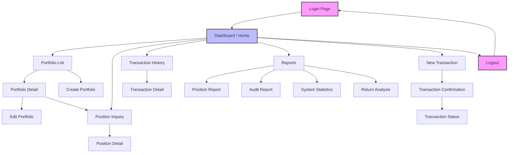

# JIRA-001: Modernize Portfolio Management System - Frontend Web UI

| Field         | Value                                                    |
|---------------|----------------------------------------------------------|
| **Type**      | Epic                                                     |
| **Priority**  | High                                                     |
| **Status**    | Open                                                     |
| **Labels**    | `modernization`, `frontend`, `web-ui`                    |
| **Components**| Portfolio Management, Transaction Processing, Reporting  |
| **Created**   | 2026-04-02                                               |
| **Reporter**  | --                                                       |
| **Assignee**  | Unassigned                                                |

---

## Description

Migrate the existing COBOL/CICS green-screen Portfolio Management System to a modern web-based frontend. The legacy system is currently defined in [`src/maps/INQSET.bms`](../../src/maps/INQSET.bms) and consists of four BMS maps:

| BMS Map   | Purpose                        | Lines in INQSET.bms |
|-----------|--------------------------------|---------------------|
| **MENMAP** | Main menu / option selection  | 7 -- 19              |
| **POSMAP** | Portfolio position inquiry    | 23 -- 49             |
| **HISMAP** | Transaction history inquiry   | 53 -- 85             |
| **ERRMAP** | System error display          | 89 -- 100            |

The backend COBOL programs and data stores will remain as-is in the initial phase. The new frontend will use **mock/static JSON data fixtures** that mirror the existing COBOL copybook data structures, with clearly defined API integration points so the backend can be connected in a subsequent phase.

---

## Acceptance Criteria / User Stories

The modernization effort is broken down into **8 functional requirement areas**, each captured as a sub-task below.

### US-1: Authentication & Session Management

**As a** portfolio manager, **I want** a login/logout page with session timeout handling and role-based access gating, **so that** the system enforces the same security model as the legacy SECMGR program.

**References:**
- SECMGR program behavior documented in [`documentation/technical/system-architecture.md` (lines 225--231)](../technical/system-architecture.md)
- Security actions defined in [`src/copybook/common/AUDITLOG.cpy`](../../src/copybook/common/AUDITLOG.cpy): `AUD-LOGIN`, `AUD-LOGOUT`

**Acceptance Criteria:**
- [ ] Login page with username/password fields
- [ ] Session timeout after configurable inactivity period
- [ ] Role-based access gating for admin vs. read-only users
- [ ] Logout functionality that clears session state
- [ ] Failed login attempts are logged (mirrors `AUD-FAILURE` status)

---

### US-2: Portfolio Management (CRUD)

**As a** portfolio manager, **I want** to list, view, create, edit, and delete portfolios, **so that** I can manage the full lifecycle of client portfolios.

**References:**
- Maps to COBOL programs: `PORTADD`, `PORTREAD`, `PORTUPDT`, `PORTDEL`, `PORTMSTR`
- Data structures: [`src/copybook/common/PORTFLIO.cpy`](../../src/copybook/common/PORTFLIO.cpy), [`src/copybook/common/POSREC.cpy`](../../src/copybook/common/POSREC.cpy)

**Key data fields from `PORTFLIO.cpy`:**
| Field               | PIC Clause          | Description                  |
|---------------------|---------------------|------------------------------|
| `PORT-ID`           | `X(8)`              | Portfolio identifier         |
| `PORT-ACCOUNT-NO`   | `X(10)`             | Account number               |
| `PORT-CLIENT-NAME`  | `X(30)`             | Client name                  |
| `PORT-CLIENT-TYPE`  | `X(1)`              | I=Individual, C=Corporate, T=Trust |
| `PORT-STATUS`       | `X(1)`              | A=Active, C=Closed, S=Suspended |
| `PORT-TOTAL-VALUE`  | `S9(13)V99 COMP-3`  | Total portfolio value        |
| `PORT-CASH-BALANCE` | `S9(13)V99 COMP-3`  | Cash balance                 |

**Acceptance Criteria:**
- [ ] Portfolio list view with search/filter by account number, client name, status
- [ ] Portfolio detail view showing all fields from `PORT-RECORD`
- [ ] Create portfolio form with validation for client type and required fields
- [ ] Edit portfolio form (pre-populated with existing data)
- [ ] Delete portfolio with confirmation dialog
- [ ] Status indicators (Active / Closed / Suspended) displayed visually

---

### US-3: Portfolio Position Inquiry

**As a** portfolio analyst, **I want** to search for an account and view a summary table of portfolio positions, **so that** I can quickly assess portfolio holdings and valuation.

**References:**
- Replaces **POSMAP** screen from [`src/maps/INQSET.bms` (lines 23--49)](../../src/maps/INQSET.bms)
- Maps to `INQPORT` program
- Data structure: [`src/copybook/common/POSREC.cpy`](../../src/copybook/common/POSREC.cpy)

**Key data fields from `POSREC.cpy`:**
| Field               | PIC Clause             | Description            |
|---------------------|------------------------|------------------------|
| `POS-PORTFOLIO-ID`  | `X(08)`                | Portfolio identifier   |
| `POS-INVESTMENT-ID` | `X(10)`                | Investment/Fund ID     |
| `POS-QUANTITY`      | `S9(11)V9(4) COMP-3`  | Units held             |
| `POS-COST-BASIS`    | `S9(13)V9(2) COMP-3`  | Total cost basis       |
| `POS-MARKET-VALUE`  | `S9(13)V9(2) COMP-3`  | Current market value   |
| `POS-STATUS`        | `X(01)`                | A=Active, C=Closed, P=Pending |

**Acceptance Criteria:**
- [ ] Account search input field
- [ ] Position summary table with columns: Fund ID, Fund Name, Units, Cost Basis, Market Value
- [ ] Pagination (replaces PF7/PF8 key navigation from legacy POSMAP)
- [ ] Portfolio valuation summary (total market value, total cost basis, gain/loss)
- [ ] Currency display formatting
- [ ] Status filter for active/closed/pending positions

---

### US-4: Transaction Processing

**As a** portfolio manager, **I want** to submit BUY, SELL, and TRANSFER transactions with client-side validation and confirmation, **so that** I can process trades accurately before they reach the backend.

**References:**
- Maps to `PORTTRAN` and `PORTVALD` programs
- Data structure: [`src/copybook/common/TRNREC.cpy`](../../src/copybook/common/TRNREC.cpy)

**Key data fields from `TRNREC.cpy`:**
| Field               | PIC Clause             | Description                           |
|---------------------|------------------------|---------------------------------------|
| `TRN-PORTFOLIO-ID`  | `X(08)`                | Portfolio identifier                  |
| `TRN-INVESTMENT-ID` | `X(10)`                | Investment identifier                 |
| `TRN-TYPE`          | `X(02)`                | BU=Buy, SL=Sell, TR=Transfer, FE=Fee  |
| `TRN-QUANTITY`      | `S9(11)V9(4) COMP-3`  | Transaction quantity                  |
| `TRN-PRICE`         | `S9(11)V9(4) COMP-3`  | Transaction price per unit            |
| `TRN-AMOUNT`        | `S9(13)V9(2) COMP-3`  | Total transaction amount              |
| `TRN-STATUS`        | `X(01)`                | P=Pending, D=Done, F=Failed, R=Reversed |

**Acceptance Criteria:**
- [ ] Transaction submission form with fields for type (BUY/SELL/TRANSFER), investment ID, quantity, price
- [ ] Client-side validation: required fields, numeric ranges, sufficient balance for SELL
- [ ] Confirmation step before final submission (review screen)
- [ ] Transaction status view showing pending/completed/failed transactions
- [ ] Amount auto-calculation (quantity x price)
- [ ] Currency selection field

---

### US-5: Transaction History Inquiry

**As a** portfolio analyst, **I want** to search transaction history by account and date range, with a paginated results table and drill-down capability, **so that** I can audit past activity.

**References:**
- Replaces **HISMAP** screen from [`src/maps/INQSET.bms` (lines 53--85)](../../src/maps/INQSET.bms)
- Maps to `INQHIST` program
- Data structure: [`src/copybook/common/HISTREC.cpy`](../../src/copybook/common/HISTREC.cpy)

**Key data fields from `HISTREC.cpy`:**
| Field               | PIC Clause  | Description                                    |
|---------------------|-------------|------------------------------------------------|
| `HIST-PORTFOLIO-ID` | `X(08)`     | Portfolio identifier                           |
| `HIST-DATE`         | `X(08)`     | History date (YYYYMMDD)                        |
| `HIST-TIME`         | `X(06)`     | History time (HHMMSS)                          |
| `HIST-RECORD-TYPE`  | `X(02)`     | PT=Portfolio, PS=Position, TR=Transaction      |
| `HIST-ACTION-CODE`  | `X(01)`     | A=Add, C=Change, D=Delete                     |
| `HIST-REASON-CODE`  | `X(04)`     | Reason for change                              |

**Acceptance Criteria:**
- [ ] Account-based history search input
- [ ] Date range filter (start date, end date)
- [ ] Paginated history table with columns: Date, Type, Units, Price, Amount (replaces PF7/PF8 from legacy HISMAP which displayed 10 rows at a time)
- [ ] Drill-down to transaction detail view on row click
- [ ] Record type filter (Portfolio / Position / Transaction changes)
- [ ] Export history results to CSV

---

### US-6: Reporting & Analytics

**As a** portfolio manager, **I want** report views for positions, audits, system statistics, and return analysis, with filtering and export capabilities, **so that** I can generate the same reports currently produced by batch programs.

**References:**
- Maps to batch report programs:
  - `RPTPOS00` -- Position/valuation reports
  - `RPTAUD00` -- Audit trail reports
  - `RPTSTA00` -- System statistics reports
  - `RTNANA00` -- Return analysis
- Data structure: [`src/copybook/common/AUDITLOG.cpy`](../../src/copybook/common/AUDITLOG.cpy)

**Key data fields from `AUDITLOG.cpy`:**
| Field              | PIC Clause | Description                                         |
|--------------------|------------|-----------------------------------------------------|
| `AUD-TIMESTAMP`    | `X(26)`    | Event timestamp                                     |
| `AUD-USER-ID`      | `X(8)`     | User who performed action                           |
| `AUD-PROGRAM`      | `X(8)`     | Program that generated the event                    |
| `AUD-TYPE`         | `X(4)`     | TRAN=Transaction, USER=User Action, SYST=System     |
| `AUD-ACTION`       | `X(8)`     | CREATE, UPDATE, DELETE, INQUIRE, LOGIN, LOGOUT, etc.|
| `AUD-STATUS`       | `X(4)`     | SUCC=Success, FAIL=Failure, WARN=Warning            |

**Acceptance Criteria:**
- [ ] Position report view with portfolio valuation summaries
- [ ] Audit report view with filterable event log
- [ ] System statistics dashboard (processing volumes, error rates)
- [ ] Return analysis view with period-over-period comparisons
- [ ] Report filtering by date range, portfolio, user
- [ ] Export to CSV and PDF

---

### US-7: Error Handling & User Feedback

**As a** system user, **I want** clear inline validation, global error notifications, and structured error detail display, **so that** I understand what went wrong and how to correct it.

**References:**
- Replaces **ERRMAP** screen from [`src/maps/INQSET.bms` (lines 89--100)](../../src/maps/INQSET.bms)
- Legacy ERRMAP displays: Error Code (`ERRCOUT`, 8 chars) and Details (`ERRDOUT`, 65 chars)

**Acceptance Criteria:**
- [ ] Inline form validation with field-level error messages
- [ ] Global error notifications (toast or banner) for API/system errors
- [ ] Structured error detail display showing error code and description (mirrors ERRMAP layout)
- [ ] Graceful handling of network/timeout errors
- [ ] User-friendly messages (no raw error codes displayed to end users)
- [ ] Consistent error patterns across all pages

---

### US-8: Navigation & Layout

**As a** system user, **I want** a modern dashboard with primary navigation, breadcrumbs, and responsive layout, **so that** I can navigate the system intuitively without PF-key knowledge.

**References:**
- Replaces **MENMAP** menu from [`src/maps/INQSET.bms` (lines 7--19)](../../src/maps/INQSET.bms)
- Legacy menu options: 1. Portfolio Position Inquiry, 2. Transaction History, 3. Exit
- PF-key navigation (PF3=Exit, PF7=Previous, PF8=Next) replaced by standard web UI controls

**Acceptance Criteria:**
- [ ] Dashboard/home page with key portfolio metrics (total AUM, active portfolios, recent transactions)
- [ ] Primary navigation (sidebar or top-nav) with sections: Portfolios, Transactions, History, Reports
- [ ] Breadcrumb navigation replacing PF-key flows
- [ ] Responsive desktop-first layout (functional on tablet viewports)
- [ ] Consistent header/footer across all pages
- [ ] Keyboard shortcuts as optional enhancement

---

## Navigation & Page Flow

The following diagram illustrates the target page flow for the modernized frontend:

---

## Technical Notes

### Mock Data Strategy

The frontend will be implemented with **mock/static JSON data fixtures** that mirror the COBOL copybook record structures. This decouples frontend development from backend readiness.

| Copybook File                                                                          | JSON Fixture Purpose         |
|----------------------------------------------------------------------------------------|------------------------------|
| [`PORTFLIO.cpy`](../../src/copybook/common/PORTFLIO.cpy)                               | Portfolio master records     |
| [`POSREC.cpy`](../../src/copybook/common/POSREC.cpy)                                   | Position/holding records     |
| [`TRNREC.cpy`](../../src/copybook/common/TRNREC.cpy)                                   | Transaction records          |
| [`HISTREC.cpy`](../../src/copybook/common/HISTREC.cpy)                                 | History/change log records   |
| [`AUDITLOG.cpy`](../../src/copybook/common/AUDITLOG.cpy)                               | Audit trail records          |

### API Integration Points

Each functional area maps to a future REST API endpoint. These should be defined as service interfaces in the frontend so the mock data layer can be swapped for real API calls:

| Endpoint Pattern                  | Method(s)        | Maps to COBOL Program(s)     |
|-----------------------------------|------------------|------------------------------|
| `/api/auth/login`                 | POST             | SECMGR                       |
| `/api/auth/logout`                | POST             | SECMGR                       |
| `/api/portfolios`                 | GET, POST        | PORTMSTR, PORTADD            |
| `/api/portfolios/:id`             | GET, PUT, DELETE | PORTREAD, PORTUPDT, PORTDEL  |
| `/api/portfolios/:id/positions`   | GET              | INQPORT                      |
| `/api/transactions`               | GET, POST        | PORTTRAN, PORTVALD            |
| `/api/transactions/:id`           | GET              | PORTTRAN                      |
| `/api/history`                    | GET              | INQHIST                      |
| `/api/reports/positions`          | GET              | RPTPOS00                      |
| `/api/reports/audit`              | GET              | RPTAUD00                      |
| `/api/reports/statistics`         | GET              | RPTSTA00                      |
| `/api/reports/returns`            | GET              | RTNANA00                      |

### Technology Considerations

- Frontend framework TBD (React, Angular, or Vue recommended)
- State management for session and portfolio data
- Mock data served via local JSON files or an in-memory service layer
- All monetary values must handle COMP-3 packed decimal precision (up to 15 digits with 2-4 decimal places)

---

## Sub-tasks

| Sub-task ID | Title                                  | User Story | Status  |
|-------------|----------------------------------------|------------|---------|
| JIRA-001-01 | Authentication & Session Management    | US-1       | To Do   |
| JIRA-001-02 | Portfolio Management (CRUD)            | US-2       | To Do   |
| JIRA-001-03 | Portfolio Position Inquiry             | US-3       | To Do   |
| JIRA-001-04 | Transaction Processing                 | US-4       | To Do   |
| JIRA-001-05 | Transaction History Inquiry            | US-5       | To Do   |
| JIRA-001-06 | Reporting & Analytics                  | US-6       | To Do   |
| JIRA-001-07 | Error Handling & User Feedback         | US-7       | To Do   |
| JIRA-001-08 | Navigation & Layout                    | US-8       | To Do   |

### Sub-task Details

#### JIRA-001-01: Authentication & Session Management
- Implement login page with username/password form
- Add session timeout handling with configurable duration
- Implement role-based access gating (admin / read-only)
- Create logout flow clearing all session state
- Mock user data fixture with roles and credentials

#### JIRA-001-02: Portfolio Management (CRUD)
- Build portfolio list view with search/filter capabilities
- Build portfolio detail view displaying all `PORT-RECORD` fields
- Implement create/edit forms with validation for client type (`I`, `C`, `T`) and status (`A`, `C`, `S`)
- Add delete with confirmation dialog
- Create mock portfolio data fixture from `PORTFLIO.cpy` structure

#### JIRA-001-03: Portfolio Position Inquiry
- Build account search input component
- Build position summary table (Fund ID, Fund Name, Units, Cost Basis, Market Value)
- Implement client-side pagination replacing PF7/PF8 keys
- Add portfolio valuation summary row (totals + gain/loss)
- Create mock position data fixture from `POSREC.cpy` structure

#### JIRA-001-04: Transaction Processing
- Build transaction submission form (type selector, investment ID, quantity, price)
- Implement client-side validation (required fields, numeric ranges, balance checks)
- Add confirmation/review step before submission
- Build transaction status view (pending / completed / failed / reversed)
- Create mock transaction data fixture from `TRNREC.cpy` structure

#### JIRA-001-05: Transaction History Inquiry
- Build account-based history search with date range filter
- Build paginated history table (Date, Type, Units, Price, Amount)
- Implement drill-down to transaction detail on row selection
- Add CSV export for history results
- Create mock history data fixture from `HISTREC.cpy` structure

#### JIRA-001-06: Reporting & Analytics
- Build position report view with valuation summaries
- Build audit report view with filterable event log
- Build system statistics dashboard (volumes, error rates, performance)
- Build return analysis view with period-over-period comparison
- Implement report filtering (date range, portfolio, user) and CSV/PDF export
- Create mock report data fixtures from `AUDITLOG.cpy` and batch program outputs

#### JIRA-001-07: Error Handling & User Feedback
- Implement inline form validation pattern (field-level messages)
- Build global error notification component (toast/banner)
- Build structured error detail display (error code + description, mirrors ERRMAP)
- Add network/timeout error handling
- Ensure consistent error UX across all pages

#### JIRA-001-08: Navigation & Layout
- Build dashboard/home page with key metrics (total AUM, active portfolios, recent transactions)
- Implement primary navigation (sidebar or top-nav): Portfolios, Transactions, History, Reports
- Add breadcrumb navigation
- Implement responsive desktop-first layout (desktop + tablet breakpoints)
- Add consistent header/footer

---

## Definition of Done

- [ ] All 8 functional areas (US-1 through US-8) implemented as frontend pages/components
- [ ] Mock data fixtures created matching COBOL copybook data structures (`PORTFLIO.cpy`, `POSREC.cpy`, `TRNREC.cpy`, `HISTREC.cpy`, `AUDITLOG.cpy`)
- [ ] Responsive layout working on desktop and tablet viewports
- [ ] Navigation between all pages functional (no dead links)
- [ ] Form validation working on all input forms (login, portfolio CRUD, transaction submission, search/filter)
- [ ] Error handling patterns implemented consistently across all pages
- [ ] API integration points clearly defined as swappable service interfaces
- [ ] Page flow matches the navigation diagram above

---

## Related Documentation

- [System Architecture](../technical/system-architecture.md)
- [BMS Map Definitions (INQSET.bms)](../../src/maps/INQSET.bms)
- [PORTFLIO Copybook](../../src/copybook/common/PORTFLIO.cpy)
- [POSREC Copybook](../../src/copybook/common/POSREC.cpy)
- [TRNREC Copybook](../../src/copybook/common/TRNREC.cpy)
- [HISTREC Copybook](../../src/copybook/common/HISTREC.cpy)
- [AUDITLOG Copybook](../../src/copybook/common/AUDITLOG.cpy)
