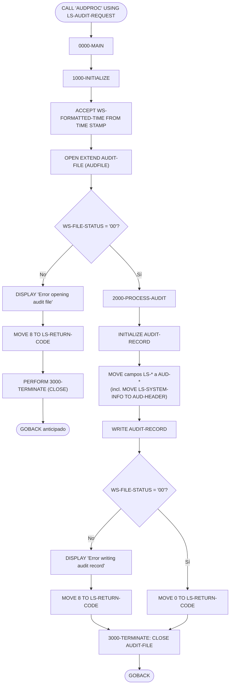
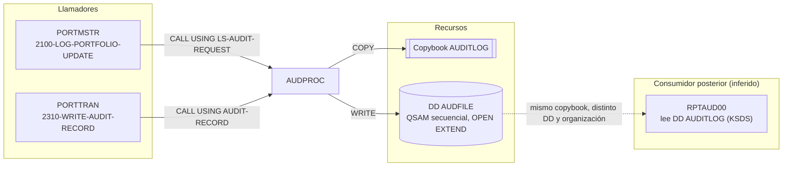

# AUDPROC — Subrutina común de escritura de pista de auditoría (audit trail)

> Generado a partir del análisis del código fuente `src/programs/common/AUDPROC.cbl`. Ver el [grafo de dependencias global](../technical/dependency-graph.md).

## Ficha técnica
| Campo | Valor |
| --- | --- |
| Ruta | `src/programs/common/AUDPROC.cbl` |
| Categoría | common |
| Tipo | subrutina común (batch, sin CICS ni DB2) |
| Líneas | 96 |
| Punto de entrada | subrutina invocada por `CALL 'AUDPROC' USING ...`; no existe JCL ni transacción CICS que la ejecute directamente |
| Invocado por | `PORTMSTR` (párrafo `2100-LOG-PORTFOLIO-UPDATE`), `PORTTRAN` (párrafo `2310-WRITE-AUDIT-RECORD`) |
| Invoca a | Ninguno (no hay `CALL`, `EXEC CICS` ni `EXEC SQL`) |

## Propósito
`AUDPROC` es la subrutina común del sistema CLBS encargada de persistir un registro de auditoría por cada evento de negocio relevante (creación, modificación o borrado de carteras, transacciones, eventos de sistema). Recibe del programa llamador una petición de auditoría (`LS-AUDIT-REQUEST`) con la identificación del sistema/usuario/programa/terminal, el tipo y la acción auditada, las claves de negocio afectadas (cartera y cuenta), las imágenes "antes" y "después" del dato y un mensaje descriptivo, y la añade como un registro nuevo al final del fichero secuencial `AUDFILE`. Encaja en la capa de servicios comunes junto a `ERRPROC` (errores) y `DB2CONN`/`DB2CMT`/`DB2ERR`/`DB2STAT` (soporte DB2), y sus registros son la materia prima teórica del informe de auditoría `RPTAUD00`.

## Funcionamiento
El programa es lineal: no tiene bucle de proceso porque cada invocación escribe exactamente un registro. Abre y cierra el fichero en cada llamada.

### `0000-MAIN`
Ejecuta en secuencia `1000-INITIALIZE`, `2000-PROCESS-AUDIT` y `3000-TERMINATE` y termina con `GOBACK`, devolviendo el control al llamador. No hay lógica condicional en este párrafo; la salida anticipada por error se hace desde `1000-INITIALIZE`.

### `1000-INITIALIZE`
1. `ACCEPT WS-FORMATTED-TIME FROM TIME STAMP`: intenta obtener la marca de tiempo actual en un campo `PIC X(26)` (ver observaciones: esta sintaxis no es estándar de Enterprise COBOL).
2. `OPEN EXTEND AUDIT-FILE`: abre el fichero de auditoría en modo extensión (append), de forma que los registros nuevos se añaden tras los existentes.
3. Si `WS-FILE-STATUS` no es `'00'`:
   - muestra por `DISPLAY` el mensaje `Error opening audit file: ` seguido del FILE STATUS,
   - mueve `8` a `LS-RETURN-CODE` (en el área del llamador),
   - ejecuta `3000-TERMINATE` (que hace `CLOSE` del fichero que no llegó a abrirse) y
   - hace `GOBACK` directamente desde dentro del párrafo, sin volver a `0000-MAIN`.

### `2000-PROCESS-AUDIT`
1. `INITIALIZE AUDIT-RECORD`: limpia el área del registro (copybook `AUDITLOG`).
2. Copia campo a campo la petición recibida al registro:

   | Origen (LINKAGE) | Destino (`AUDIT-RECORD`) | Observación |
   | --- | --- | --- |
   | `WS-FORMATTED-TIME` | `AUD-TIMESTAMP` | Marca de tiempo obtenida en `1000-INITIALIZE` |
   | `LS-SYSTEM-INFO` (grupo de 32 bytes) | `AUD-HEADER` (grupo de 58 bytes, cuyo primer campo es `AUD-TIMESTAMP`) | **MOVE de grupo a grupo desalineado**: sobrescribe la marca de tiempo (ver observaciones) |
   | `LS-TYPE` | `AUD-TYPE` | `'TRAN'`, `'USER'`, `'SYST'` |
   | `LS-ACTION` | `AUD-ACTION` | `'CREATE  '`, `'UPDATE  '`, `'DELETE  '`, ... |
   | `LS-STATUS` | `AUD-STATUS` | `'SUCC'`, `'FAIL'`, `'WARN'` |
   | `LS-KEY-INFO` | `AUD-KEY-INFO` | `LS-PORT-ID` + `LS-ACCT-NO` (18 bytes, misma disposición en ambos lados) |
   | `LS-BEFORE-IMAGE` | `AUD-BEFORE-IMAGE` | 100 bytes |
   | `LS-AFTER-IMAGE` | `AUD-AFTER-IMAGE` | 100 bytes |
   | `LS-MESSAGE` | `AUD-MESSAGE` | 100 bytes |

3. `WRITE AUDIT-RECORD`: escribe el registro (392 bytes, longitud implícita del `01 AUDIT-RECORD`).
4. Si `WS-FILE-STATUS` no es `'00'`, muestra `Error writing audit record: ` + FILE STATUS y mueve `8` a `LS-RETURN-CODE`; en caso contrario mueve `0` a `LS-RETURN-CODE`.

### `3000-TERMINATE`
`CLOSE AUDIT-FILE`. No comprueba el FILE STATUS del `CLOSE`.

## Interfaz
- **Parámetros / LINKAGE SECTION / COMMAREA**: el programa recibe por `PROCEDURE DIVISION USING` un único parámetro, `LS-AUDIT-REQUEST` (368 bytes). No usa COMMAREA (no es CICS). Estructura:

  | Campo | PIC | Desplazamiento | Descripción |
  | --- | --- | --- | --- |
  | `LS-SYSTEM-INFO` | grupo (32) | 1 | Identificación del origen del evento |
  | &nbsp;&nbsp;`LS-SYSTEM-ID` | `X(8)` | 1 | Identificador del sistema/aplicación (p. ej. `'PORTFOLIO'` en `PORTMSTR`, que se trunca a 8) |
  | &nbsp;&nbsp;`LS-USER-ID` | `X(8)` | 9 | Usuario |
  | &nbsp;&nbsp;`LS-PROGRAM` | `X(8)` | 17 | Programa llamador |
  | &nbsp;&nbsp;`LS-TERMINAL` | `X(8)` | 25 | Terminal |
  | `LS-TYPE` | `X(4)` | 33 | Tipo de evento (`TRAN`/`USER`/`SYST`) |
  | `LS-ACTION` | `X(8)` | 37 | Acción (`CREATE`, `UPDATE`, `DELETE`, `INQUIRE`, `LOGIN`, `LOGOUT`, `STARTUP`, `SHUTDOWN`) |
  | `LS-STATUS` | `X(4)` | 45 | Resultado (`SUCC`/`FAIL`/`WARN`) |
  | `LS-KEY-INFO` | grupo (18) | 49 | Claves de negocio |
  | &nbsp;&nbsp;`LS-PORT-ID` | `X(8)` | 49 | Identificador de cartera |
  | &nbsp;&nbsp;`LS-ACCT-NO` | `X(10)` | 57 | Número de cuenta |
  | `LS-BEFORE-IMAGE` | `X(100)` | 67 | Imagen del dato antes del cambio |
  | `LS-AFTER-IMAGE` | `X(100)` | 167 | Imagen del dato después del cambio |
  | `LS-MESSAGE` | `X(100)` | 267 | Texto libre |
  | `LS-RETURN-CODE` | `S9(4) COMP` | 367 | **Salida**: código de retorno para el llamador |

  Los valores admitidos de tipo/acción/estado no se validan en `AUDPROC`; solo están documentados como condiciones de nivel 88 en el copybook `AUDITLOG`. Esta estructura no está en ningún copybook del repositorio: cada llamador debería declararla por su cuenta (ver observaciones sobre `PORTMSTR` y `PORTTRAN`).

- **Ficheros (DDNAME, organización, modo de apertura, clave)**:

  | Fichero COBOL | DDNAME | Organización | Modo | Clave | Registro | FILE STATUS |
  | --- | --- | --- | --- | --- | --- | --- |
  | `AUDIT-FILE` | `AUDFILE` | `SEQUENTIAL` (QSAM), `RECORDING MODE F`, `BLOCK CONTAINS 0` | `OPEN EXTEND` (append) | No aplica | `AUDIT-RECORD` (copybook `AUDITLOG`, 392 bytes) | `WS-FILE-STATUS` |

  El único JCL del repositorio que define el DD `AUDFILE` es `src/jcl/portfolio/PORTDEL.jcl` (`DSN=PORTFOLIO.AUDIT.FILE,DISP=MOD`), pero ese job ejecuta `PORTDEL`, no un programa que llame a `AUDPROC`. No hay JCL para `PORTMSTR` ni `PORTTRAN`, por lo que el dataset real que recibiría los registros de `AUDPROC` no está definido en el repositorio.

- **Tablas DB2 y sentencias SQL**: No aplica.
- **Mapas BMS / comandos CICS**: No aplica.
- **Códigos de retorno / RETURN-CODE**: el resultado se devuelve exclusivamente en el campo `LS-RETURN-CODE` del área del llamador; el registro especial `RETURN-CODE` **no** se modifica.

  | `LS-RETURN-CODE` | Cuándo |
  | --- | --- |
  | `0` | `WRITE` correcto (`WS-FILE-STATUS = '00'`) |
  | `8` | Fallo en `OPEN EXTEND` (el programa retorna sin escribir) o fallo en `WRITE` |

## Estructuras de datos clave
- **Copybook `AUDITLOG`** (`src/copybook/common/AUDITLOG.cpy`), incluido en la `FILE SECTION` bajo el `FD AUDIT-FILE`. Define el registro de auditoría `AUDIT-RECORD` (392 bytes):

  | Campo | PIC | Desplazamiento | Valores 88 |
  | --- | --- | --- | --- |
  | `AUD-HEADER` | grupo (58) | 1 | |
  | &nbsp;&nbsp;`AUD-TIMESTAMP` | `X(26)` | 1 | |
  | &nbsp;&nbsp;`AUD-SYSTEM-ID` | `X(8)` | 27 | |
  | &nbsp;&nbsp;`AUD-USER-ID` | `X(8)` | 35 | |
  | &nbsp;&nbsp;`AUD-PROGRAM` | `X(8)` | 43 | |
  | &nbsp;&nbsp;`AUD-TERMINAL` | `X(8)` | 51 | |
  | `AUD-TYPE` | `X(4)` | 59 | `AUD-TRANSACTION 'TRAN'`, `AUD-USER-ACTION 'USER'`, `AUD-SYSTEM-EVENT 'SYST'` |
  | `AUD-ACTION` | `X(8)` | 63 | `AUD-CREATE`, `AUD-UPDATE`, `AUD-DELETE`, `AUD-INQUIRE`, `AUD-LOGIN`, `AUD-LOGOUT`, `AUD-STARTUP`, `AUD-SHUTDOWN` |
  | `AUD-STATUS` | `X(4)` | 71 | `AUD-SUCCESS 'SUCC'`, `AUD-FAILURE 'FAIL'`, `AUD-WARNING 'WARN'` |
  | `AUD-KEY-INFO` | grupo (18) | 75 | |
  | &nbsp;&nbsp;`AUD-PORTFOLIO-ID` | `X(8)` | 75 | |
  | &nbsp;&nbsp;`AUD-ACCOUNT-NO` | `X(10)` | 83 | |
  | `AUD-BEFORE-IMAGE` | `X(100)` | 93 | |
  | `AUD-AFTER-IMAGE` | `X(100)` | 193 | |
  | `AUD-MESSAGE` | `X(100)` | 293 | |

  El mismo copybook lo usan `PORTTRAN` (en `WORKING-STORAGE`, para construir el registro que pasa a `AUDPROC`) y `RPTAUD00` (en `FILE SECTION`, para leer el fichero de auditoría).

- **WORKING-STORAGE**:
  - `WS-FILE-STATUS PIC X(2)`: FILE STATUS de `AUDIT-FILE`, único mecanismo de detección de errores.
  - `WS-FORMATTED-TIME PIC X(26)`: marca de tiempo destinada a `AUD-TIMESTAMP`.

  No hay contadores, flags, umbrales de commit ni áreas de checkpoint: el programa procesa un único registro por invocación.

## Reglas de negocio y validaciones
El programa no implementa reglas de negocio ni validaciones propias; actúa como un simple "escritor" del registro de auditoría. Concretamente:
1. Cada `CALL` produce exactamente un registro de auditoría añadido al final de `AUDFILE` (`OPEN EXTEND`).
2. La marca de tiempo la fija `AUDPROC` (no el llamador) en `1000-INITIALIZE`, aunque en la práctica queda sobrescrita por el `MOVE LS-SYSTEM-INFO TO AUD-HEADER` (ver observaciones).
3. No se valida que `LS-TYPE`, `LS-ACTION` o `LS-STATUS` contengan alguno de los valores 88 definidos en `AUDITLOG`; cualquier valor se graba tal cual.
4. No se valida la longitud ni el contenido del parámetro recibido; si el llamador pasa un área con una disposición distinta (caso de `PORTTRAN`), los campos se interpretan desplazados.
5. La semántica de los valores (`TRAN`/`USER`/`SYST`, `CREATE`/`UPDATE`/`DELETE`..., `SUCC`/`FAIL`/`WARN`) la fijan los llamadores: `PORTMSTR` graba `TRAN`/`UPDATE  `/`SUCC` tras un `REWRITE` de cartera; `PORTTRAN` mapea `BU`→`CREATE  `, `SL`→`DELETE  `, `TR`/`FE`→`UPDATE  ` y `SUCC`/`FAIL` según `WS-PORT-STATUS`.

## Manejo de errores y recuperación
- **FILE STATUS**: se comprueba tras `OPEN EXTEND` y tras `WRITE`. En ambos casos el tratamiento es idéntico: `DISPLAY` de un mensaje con el código de estado en SYSOUT y `MOVE 8 TO LS-RETURN-CODE`. No se comprueba el estado del `CLOSE`.
- **Salida anticipada**: si falla el `OPEN`, `1000-INITIALIZE` ejecuta `3000-TERMINATE` y hace `GOBACK` desde el propio párrafo, evitando el `WRITE`. Ese `CLOSE` sobre un fichero no abierto devolverá probablemente FILE STATUS `'42'`, que no se examina.
- **No abends**: el programa nunca aborta; la responsabilidad de decidir qué hacer ante un fallo de auditoría es del llamador (`PORTTRAN` llama a `ERRPROC`; `PORTMSTR` no comprueba el resultado).
- **SQLCODE / condiciones CICS**: No aplica (sin DB2 ni CICS).
- **Checkpoint/restart, rollback**: No aplica. Al ser un fichero QSAM abierto en `EXTEND`, un registro escrito no puede deshacerse; tampoco se integra con `CKPRST`.
- **Rutinas comunes**: no llama a `ERRPROC`, `ERRHNDL` ni `DB2ERR`; los errores solo se reportan por `DISPLAY` y por `LS-RETURN-CODE`.

## Dependencias

## Observaciones y problemas detectados
1. **`MOVE LS-SYSTEM-INFO TO AUD-HEADER` corrompe la cabecera del registro (bug funcional).** `LS-SYSTEM-INFO` son 32 bytes (`SYSTEM-ID`, `USER-ID`, `PROGRAM`, `TERMINAL`), mientras que `AUD-HEADER` son 58 bytes y su primer subcampo es `AUD-TIMESTAMP PIC X(26)`. Un MOVE de grupo a grupo es alfanumérico y alinea por la izquierda, de modo que: `AUD-TIMESTAMP` recibe `LS-SYSTEM-ID` + `LS-USER-ID` + `LS-PROGRAM` + 2 bytes de `LS-TERMINAL` (destruyendo la marca de tiempo recién asignada), `AUD-SYSTEM-ID` recibe los 6 bytes restantes de `LS-TERMINAL` más espacios, y `AUD-USER-ID`, `AUD-PROGRAM` y `AUD-TERMINAL` quedan en blanco. El registro grabado carece de fecha/hora y de identificación fiable del origen. La corrección esperable sería mover campo a campo (`LS-SYSTEM-ID` → `AUD-SYSTEM-ID`, etc.) o hacer el MOVE de la marca de tiempo después del MOVE de grupo.
2. **`ACCEPT WS-FORMATTED-TIME FROM TIME STAMP` no es sintaxis válida de Enterprise COBOL.** La sentencia `ACCEPT ... FROM` solo admite `DATE`, `DAY`, `DAY-OF-WEEK` y `TIME` (además de nombres mnemónicos); `TIME STAMP` provocaría probablemente un error de compilación. Incluso con `FROM TIME` el resultado sería `HHMMSSss` (8 bytes), no una marca de tiempo de 26 bytes. El mismo patrón aparece en `DB2STAT`. La forma habitual sería `MOVE FUNCTION CURRENT-DATE TO ...` (como hace `PORTTRAN`).
3. **`PORTTRAN` pasa un área con otra disposición.** `PORTTRAN` invoca `CALL 'AUDPROC' USING AUDIT-RECORD` (392 bytes, formato del copybook `AUDITLOG`), pero `AUDPROC` interpreta el parámetro como `LS-AUDIT-REQUEST` (368 bytes, sin marca de tiempo al inicio). Todos los campos se leen desplazados 26 bytes (p. ej. `LS-TYPE` recibe parte de `AUD-USER-ID`), y `LS-RETURN-CODE` se escribe en las posiciones 367-368 del `AUDIT-RECORD` del llamador, es decir, dentro de `AUD-MESSAGE`. Además `PORTTRAN` comprueba `RETURN-CODE` (registro especial) tras la llamada, que `AUDPROC` nunca establece, por lo que un fallo de escritura pasaría desapercibido.
4. **`PORTMSTR` referencia campos que no declara.** `PORTMSTR` usa `LS-AUDIT-REQUEST`, `LS-SYSTEM-ID`, `LS-USER-ID`, `LS-PROGRAM`, `LS-TERMINAL`, `LS-TYPE`, `LS-ACTION`, `LS-STATUS`, `LS-PORT-ID`, `LS-ACCT-NO`, `LS-BEFORE-IMAGE`, `LS-AFTER-IMAGE`, `LS-MESSAGE`, `USERID`, `TERMINAL-ID`, `PORT-ACCOUNT-NO`, `WS-BEFORE-IMAGE` y `PORT-RECORD` sin definirlos ni incluir ningún copybook que los defina (`LS-AUDIT-REQUEST` no existe como copybook en `src/copybook/`). Tal como está, `PORTMSTR` no compilaría. Además `PORTMSTR` mueve `'PORTFOLIO'` (9 caracteres) a `LS-SYSTEM-ID PIC X(8)` y su `PORT-ID PIC X(10)` a `LS-PORT-ID PIC X(8)`, con truncamiento. Tampoco comprueba `LS-RETURN-CODE` tras la llamada.
5. **No existe un copybook para la interfaz `LS-AUDIT-REQUEST`.** La estructura del parámetro está definida únicamente en la `LINKAGE SECTION` de `AUDPROC`; cada llamador tiene que replicarla a mano, lo que explica las inconsistencias de los puntos 3 y 4.
6. **Tres "logs de auditoría" incompatibles entre sí.** `AUDPROC` escribe registros de 392 bytes en un fichero QSAM secuencial (DD `AUDFILE`); `RPTAUD00`, el supuesto consumidor, lee un fichero **KSDS** (`ORGANIZATION IS INDEXED`, `RECORD KEY IS AUD-KEY`) por el DD `AUDITLOG` (`PROD.AUDIT.LOG` en `RPTAUD.jcl`), y `AUD-KEY` no existe en el copybook `AUDITLOG`; `SECMGR` inserta en una tabla DB2 llamada `AUDITLOG` sin DDL en `src/database/db2/`; y `PORTDEL` escribe en el DD `AUDFILE` (`PORTFOLIO.AUDIT.FILE`) un registro de auditoría propio con un formato distinto (`AUD-ACTION PIC X(6)`, `AUD-REASON`...). No hay un dataset de auditoría coherente extremo a extremo.
7. **Falta la definición del dataset de auditoría.** `src/database/vsam/vsam-definitions.txt` define `PORTMSTR`, `TRANHIST` y `POSHIST` pero ningún fichero de auditoría; `documentation/technical/data-dictionary.md` tampoco documenta el registro `AUDITLOG`. El único DD `AUDFILE` del repositorio está en `PORTDEL.jcl`; no existe JCL para `PORTMSTR` ni `PORTTRAN`.
8. **Discrepancias con `system-architecture.md`.** El documento de arquitectura no menciona `AUDPROC`; atribuye el mantenimiento de la pista de auditoría a `HISTLD00` y sitúa el "Audit Logging" bajo `SECMGR` (DB2), y en la tabla 5.1.1 indica que `RPTAUD00` depende de `DB2CONN` y lee un "Audit Log". El código muestra que la auditoría de carteras la escribe `AUDPROC` en un fichero QSAM. Manda el código.
9. **`CLOSE` sobre fichero no abierto en la ruta de error.** Si falla el `OPEN`, `1000-INITIALIZE` ejecuta `3000-TERMINATE`, cuyo `CLOSE` sobre un fichero cerrado devolverá probablemente FILE STATUS `'42'`; el valor no se comprueba y sobrescribe el código de error original del `OPEN` en `WS-FILE-STATUS` (aunque el `DISPLAY` ya se ha emitido).
10. **`OPEN`/`CLOSE` en cada invocación.** El fichero se abre y cierra por cada registro, lo que penaliza el rendimiento en procesos batch con muchas transacciones (`PORTTRAN` llama a `AUDPROC` una vez por transacción). Es una decisión de diseño, no un error, pero conviene tenerla en cuenta.
11. **Comentario de cabecera incompleto**: `Author: [Author name]` es un marcador sin rellenar (patrón común en todo el repositorio).

## Referencias
- Programa: [AUDPROC.cbl](../../src/programs/common/AUDPROC.cbl)
- Copybook: [AUDITLOG.cpy](../../src/copybook/common/AUDITLOG.cpy)
- Llamadores: [PORTMSTR.cbl](../../src/programs/portfolio/PORTMSTR.cbl), [PORTTRAN.cbl](../../src/programs/portfolio/PORTTRAN.cbl)
- Consumidor del fichero de auditoría: [RPTAUD00.cbl](../../src/programs/batch/RPTAUD00.cbl), [RPTAUD.jcl](../../src/jcl/batch/RPTAUD.jcl)
- Otros escritores de auditoría: [PORTDEL.cbl](../../src/programs/portfolio/PORTDEL.cbl), [PORTDEL.jcl](../../src/jcl/portfolio/PORTDEL.jcl) (único JCL con DD `AUDFILE`), [SECMGR.cbl](../../src/programs/online/SECMGR.cbl)
- Definiciones VSAM: [vsam-definitions.txt](../../src/database/vsam/vsam-definitions.txt)
- Documentación de contexto: [system-architecture.md](../technical/system-architecture.md), [data-dictionary.md](../technical/data-dictionary.md), [dependency-graph.md](../technical/dependency-graph.md)
