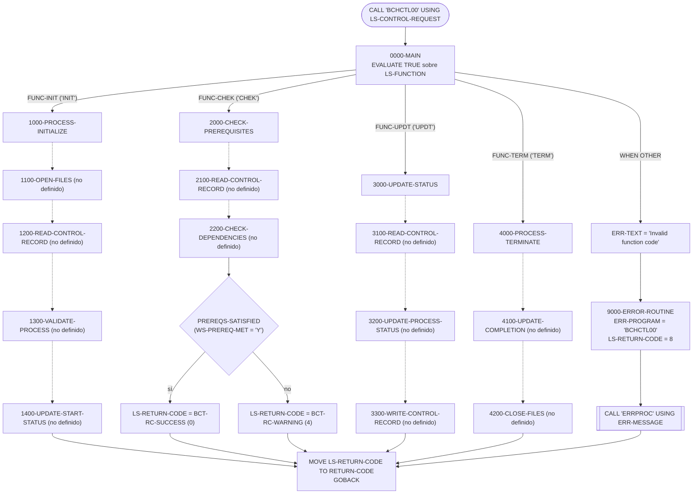
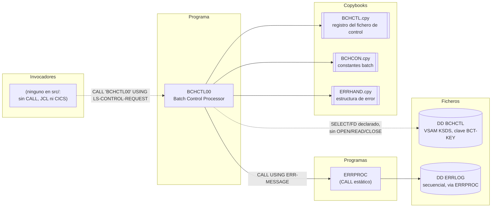

# BCHCTL00 — Procesador de control batch (esqueleto de subrutina)

> Generado a partir del análisis del código fuente `src/programs/batch/BCHCTL00.cbl`. Ver el [grafo de dependencias global](../technical/dependency-graph.md).

## Ficha técnica
| Campo | Valor |
| --- | --- |
| Ruta | `src/programs/batch/BCHCTL00.cbl` |
| Categoría | batch |
| Tipo | subrutina común (batch, sin CICS ni DB2) invocada por `CALL` |
| Líneas | 127 |
| Punto de entrada | subrutina invocada por `CALL` con `LS-CONTROL-REQUEST`; ningún invocador conocido en `src/` (ni `CALL`, ni JCL `EXEC PGM=`, ni CICS) |
| Invocado por | — (programa huérfano según el grafo de dependencias) |
| Invoca a | `ERRPROC` (`CALL` estático, solo en la rutina de error) |

## Propósito
`BCHCTL00` es el "Batch Control Processor" de la CLBS: la subrutina que, según su cabecera y los copybooks que usa, debe gestionar el ciclo de vida de un paso batch dentro del **fichero de control batch** (`BCHCTL`, VSAM KSDS) — inicializar el registro de control del job, comprobar que sus prerrequisitos (jobs previos) han terminado, actualizar su estado y registrar su finalización. Encaja en la capa de control batch descrita en `system-architecture.md` (§1.2.1 y §2.1), junto a `PRCSEQ00` (secuenciación de procesos) y `RCVPRC00` (recuperación), que comparten el mismo fichero `BCHCTL` y los mismos copybooks `BCHCTL`/`BCHCON`.

En su estado actual el programa es **un esqueleto**: sólo están codificados el despachador (`0000-MAIN`), los cuatro párrafos de primer nivel y la rutina de error. Los once párrafos de detalle que realizan el trabajo real (abrir/leer/reescribir el fichero, comprobar dependencias, cerrar) se `PERFORM` pero **no existen** en el fuente, tal y como reconoce el bloque de comentarios final ("Detailed procedures to be implemented"). El programa no compilaría tal cual.

## Funcionamiento

### Interfaz de invocación
El programa se invoca con `CALL 'BCHCTL00' USING LS-CONTROL-REQUEST`. El campo `LS-FUNCTION` (4 caracteres) selecciona la operación:

| `LS-FUNCTION` | Condición 88 | Modo interno (`WS-PROCESS-MODE`) | Párrafo |
| --- | --- | --- | --- |
| `INIT` | `FUNC-INIT` | `MODE-INITIALIZE` (`'I'`) | `1000-PROCESS-INITIALIZE` |
| `CHEK` | `FUNC-CHEK` | `MODE-CHECK-PREREQ` (`'C'`) | `2000-CHECK-PREREQUISITES` |
| `UPDT` | `FUNC-UPDT` | `MODE-UPDATE-STATUS` (`'U'`) | `3000-UPDATE-STATUS` |
| `TERM` | `FUNC-TERM` | `MODE-FINALIZE` (`'F'`) | `4000-PROCESS-TERMINATE` |
| otro | — | — | `9000-ERROR-ROUTINE` con texto `'Invalid function code'` |

Cada invocación es independiente: el programa no tiene bucle de proceso ni mantiene estado explícito entre llamadas (aunque, al no haber `INITIAL` ni `CANCEL`, la WORKING-STORAGE y el estado de apertura del fichero persistirían entre `CALL`s dentro de la misma unidad de ejecución; esto es una inferencia sobre el diseño previsto: `INIT` abre el fichero y `TERM` lo cierra).

### Paso a paso por párrafo

**`0000-MAIN`**
1. `EVALUATE TRUE` sobre las condiciones 88 de `LS-FUNCTION`.
2. Para cada función válida, activa el flag de modo correspondiente (`SET MODE-xxx TO TRUE`) y ejecuta el párrafo de primer nivel. El flag de modo **no se consulta en ningún otro punto** del programa.
3. `WHEN OTHER`: mueve `'Invalid function code'` a `ERR-TEXT` y ejecuta `9000-ERROR-ROUTINE`.
4. Copia `LS-RETURN-CODE` al registro especial `RETURN-CODE` y hace `GOBACK`, de modo que el código de retorno queda disponible tanto en el área de comunicación como en el `RETURN-CODE` del llamador.

**`1000-PROCESS-INITIALIZE`** (función `INIT`)
Encadena cuatro `PERFORM`: `1100-OPEN-FILES`, `1200-READ-CONTROL-RECORD`, `1300-VALIDATE-PROCESS` y `1400-UPDATE-START-STATUS`. **Ninguno de los cuatro está definido.** Por los nombres y por el patrón equivalente implementado en `PRCSEQ00` (`1100-OPEN-FILES` → `OPEN I-O BATCH-CONTROL-FILE`; `2300-UPDATE-PROCESS-STATUS` → `MOVE BCT-STAT-ACTIVE TO BCT-STATUS`, `ACCEPT ... FROM TIME STAMP`, `REWRITE`), la intención probable es: abrir `BCHCTL` en I-O, leer el registro cuya clave es `LS-JOB-NAME`/`LS-PROCESS-DATE`/`LS-SEQUENCE-NO`, validar que está en estado `READY` y pasarlo a `ACTIVE` sellando `BCT-START-TIME`/`BCT-ATTEMPT-TS`. No fija `LS-RETURN-CODE`.

**`2000-CHECK-PREREQUISITES`** (función `CHEK`)
1. `PERFORM 2100-READ-CONTROL-RECORD` (no definido).
2. `PERFORM 2200-CHECK-DEPENDENCIES` (no definido; se esperaría que recorriera `BCT-PREREQ-JOBS` (1..`BCT-PREREQ-COUNT`) y fijara `WS-PREREQ-MET`).
3. Si `PREREQS-SATISFIED` (`WS-PREREQ-MET = 'Y'`) → `LS-RETURN-CODE = BCT-RC-SUCCESS` (0); en caso contrario → `BCT-RC-WARNING` (4). Es la **única lógica de negocio real** del programa. Como nada asigna `WS-PREREQ-MET`, con el código actual el resultado depende del contenido inicial (no inicializado) de WORKING-STORAGE.

**`3000-UPDATE-STATUS`** (función `UPDT`)
`PERFORM` de `3100-READ-CONTROL-RECORD`, `3200-UPDATE-PROCESS-STATUS` y `3300-WRITE-CONTROL-RECORD`, los tres sin definir. La intención probable es leer el registro de control, cambiar `BCT-STATUS`/`BCT-RETURN-INFO` y reescribirlo (`REWRITE`, dado que el nombre dice "WRITE" pero el registro ya existe). No fija `LS-RETURN-CODE`.

**`4000-PROCESS-TERMINATE`** (función `TERM`)
`PERFORM` de `4100-UPDATE-COMPLETION` y `4200-CLOSE-FILES`, ambos sin definir. Intención probable: marcar `BCT-STATUS = 'D'`, rellenar `BCT-END-TIME`/`BCT-COMPLETE-TS`/`BCT-RETURN-CODE` y `CLOSE BATCH-CONTROL-FILE`. No fija `LS-RETURN-CODE`.

**`9000-ERROR-ROUTINE`**
1. `MOVE 'BCHCTL00' TO ERR-PROGRAM`.
2. `MOVE BCT-RC-ERROR TO LS-RETURN-CODE` (8).
3. `CALL 'ERRPROC' USING ERR-MESSAGE` para registrar el error en el log de errores (`ERRLOG`) y mostrarlo por `DISPLAY`.
No hay `STOP RUN` ni `GOBACK` dentro de la rutina: el control vuelve al punto del `PERFORM` y el programa continúa hasta el `GOBACK` de `0000-MAIN`.

### Diagrama de flujo

Las flechas discontinuas señalan `PERFORM` a párrafos que no existen en el fuente.

## Interfaz

- **Parámetros / LINKAGE SECTION / COMMAREA**: `PROCEDURE DIVISION USING LS-CONTROL-REQUEST` (26 bytes):

  | Campo | PIC | Uso en el código |
  | --- | --- | --- |
  | `LS-FUNCTION` | `X(4)` | Código de función: `INIT` / `CHEK` / `UPDT` / `TERM` (condiciones 88 `FUNC-INIT`, `FUNC-CHEK`, `FUNC-UPDT`, `FUNC-TERM`). Único campo de entrada que se lee. |
  | `LS-JOB-NAME` | `X(8)` | Nombre del job; se corresponde con `BCT-JOB-NAME` de la clave. **No se referencia** en el código existente. |
  | `LS-PROCESS-DATE` | `X(8)` | Fecha de proceso; se corresponde con `BCT-PROCESS-DATE`. **No se referencia.** |
  | `LS-SEQUENCE-NO` | `9(4)` | Secuencia dentro del job; se corresponde con `BCT-SEQUENCE-NO`. **No se referencia.** |
  | `LS-RETURN-CODE` | `S9(4) COMP` | Salida: código de retorno (ver más abajo). También se copia a `RETURN-CODE`. |

  No hay COMMAREA ni `DFHCOMMAREA` (no es un programa CICS).

- **Ficheros (DDNAME, organización, modo de apertura, clave)**:

  | Fichero lógico | DDNAME | Organización / acceso | Clave | FILE STATUS | Modo de apertura | Uso real en el código |
  | --- | --- | --- | --- | --- | --- | --- |
  | `BATCH-CONTROL-FILE` | `BCHCTL` | `INDEXED`, `ACCESS MODE IS DYNAMIC` (VSAM KSDS) | `BCT-KEY` (`BCT-JOB-NAME` + `BCT-PROCESS-DATE` + `BCT-SEQUENCE-NO`, 20 bytes) | `WS-BCT-STATUS` | No determinable: el `OPEN` estaría en `1100-OPEN-FILES`, que no existe (en `PRCSEQ00`/`RCVPRC00` el mismo fichero se abre `I-O`) | Sólo se declara (`SELECT`/`FD`). Ninguna sentencia `OPEN`, `READ`, `REWRITE`, `WRITE` ni `CLOSE` en el fuente. |

  El registro tiene 381 bytes según `BCHCTL.cpy` (clave 20 + `BCT-DATA` 257 + `BCT-STATISTICS` 54 + `BCT-FILLER` 50). No existe en el repositorio ningún JCL que asigne el DD `BCHCTL` ni una definición IDCAMS del clúster en `vsam-definitions.txt`.

- **Tablas DB2 y sentencias SQL**: No aplica (no hay `EXEC SQL` ni copybook `SQLCA`).

- **Mapas BMS / comandos CICS**: No aplica.

- **Códigos de retorno / RETURN-CODE**: el valor de `LS-RETURN-CODE` se copia siempre a `RETURN-CODE` antes del `GOBACK`.

  | Valor | Constante (`BCHCON`) | Cuándo |
  | --- | --- | --- |
  | 0 | `BCT-RC-SUCCESS` | `CHEK` con `PREREQS-SATISFIED`. |
  | 4 | `BCT-RC-WARNING` | `CHEK` con prerrequisitos pendientes (`PREREQS-PENDING` o flag no inicializado). |
  | 8 | `BCT-RC-ERROR` | Cualquier paso por `9000-ERROR-ROUTINE`; en el código actual sólo ocurre con un `LS-FUNCTION` no reconocido. |
  | sin cambio | — | `INIT`, `UPDT` y `TERM` no asignan `LS-RETURN-CODE`: se devuelve el valor que el llamador tuviera en el área. |

  `BCT-RC-SEVERE` (12) y `BCT-RC-CRITICAL` (16) están definidos pero no se usan.

## Estructuras de datos clave

### Copybooks
| Copybook | Ruta | Sección | Qué aporta |
| --- | --- | --- | --- |
| `BCHCTL` | `src/copybook/batch/BCHCTL.cpy` | `FILE SECTION` (registro del `FD BATCH-CONTROL-FILE`) | `BATCH-CONTROL-RECORD`: clave `BCT-KEY` (job + fecha + secuencia); `BCT-STATUS` con 88 `BCT-STATUS-READY/ACTIVE/WAITING/DONE/ERROR` (`R/A/W/D/E`); `BCT-PROCESS-CONTROL` (`BCT-STEP-NAME`, `BCT-PROGRAM-NAME`, `BCT-START-TIME`, `BCT-END-TIME`, todos `X(8)`); `BCT-DEPENDENCIES` (`BCT-PREREQ-COUNT` + tabla `BCT-PREREQ-JOBS OCCURS 10` con `BCT-PREREQ-NAME`, `BCT-PREREQ-SEQ`, `BCT-PREREQ-RC`); `BCT-RETURN-INFO` (`BCT-RETURN-CODE`, `BCT-ERROR-DESC X(80)`); `BCT-STATISTICS` (`BCT-RESTART-COUNT`, `BCT-ATTEMPT-TS`, `BCT-COMPLETE-TS`). |
| `BCHCON` | `src/copybook/batch/BCHCON.cpy` | `WORKING-STORAGE` | Constantes: estados (`BCT-STAT-*`), umbrales de RC (`BCT-RC-SUCCESS/WARNING/ERROR/SEVERE/CRITICAL` = 0/4/8/12/16), límites (`BCT-MAX-PREREQ` 10, `BCT-MAX-RESTARTS` 3, `BCT-WAIT-INTERVAL` 300 s, `BCT-MAX-WAIT-TIME` 3600 s), tipos de proceso (`INI/UPD/RPT/CLN`), tipos de dependencia (`R/O/X`), nombres especiales (`STARTDAY`, `ENDDAY`, `EMERGENCY`), tipos de registro (`C/P/D/H`) y mensajes estándar `BCT-MSG-*`. El programa sólo usa `BCT-RC-SUCCESS`, `BCT-RC-WARNING` y `BCT-RC-ERROR`. |
| `ERRHAND` | `src/copybook/common/ERRHAND.cpy` | `WORKING-STORAGE` | Estructura `ERR-MESSAGE` (`ERR-TIMESTAMP`, `ERR-PROGRAM`, `ERR-CATEGORY`, `ERR-CODE`, `ERR-SEVERITY`, `ERR-TEXT X(80)`, `ERR-DETAILS X(256)`) que se pasa a `ERRPROC`; categorías `ERR-CAT-*`, códigos `ERR-SUCCESS..ERR-TERMINAL` y tablas de FILE STATUS VSAM (`ERR-VSAM-*`). El programa sólo rellena `ERR-PROGRAM` y `ERR-TEXT`. |

### WORKING-STORAGE propia
| Campo | PIC | Uso |
| --- | --- | --- |
| `WS-BCT-STATUS` | `X(2)` | FILE STATUS de `BATCH-CONTROL-FILE`. Nunca se consulta. |
| `WS-CURRENT-TIME` | `X(26)` | Previsto para `ACCEPT ... FROM TIME STAMP` (así se usa en `PRCSEQ00`). Nunca se referencia. |
| `WS-PREREQ-MET` | `X(1)` | Flag con 88 `PREREQS-SATISFIED` (`'Y'`) / `PREREQS-PENDING` (`'N'`). Se evalúa en `2000-CHECK-PREREQUISITES` pero nunca se asigna (debería hacerlo `2200-CHECK-DEPENDENCIES`). Sin cláusula `VALUE`. |
| `WS-PROCESS-MODE` | `X(1)` | Flag de modo con 88 `MODE-INITIALIZE/CHECK-PREREQ/UPDATE-STATUS/FINALIZE` (`I/C/U/F`). Se asigna en `0000-MAIN` y no se vuelve a leer. |

No hay contadores de registros, frecuencia de commit ni umbrales propios: el programa no realiza checkpoint (esa responsabilidad está en `CKPRST`, según los comentarios de `BCHCTL.cpy`).

## Reglas de negocio y validaciones
Reglas efectivamente implementadas en el código:

1. **Validación del código de función**: `LS-FUNCTION` debe ser exactamente `INIT`, `CHEK`, `UPDT` o `TERM`; cualquier otro valor se trata como error (`'Invalid function code'`, RC 8).
2. **Semántica de la comprobación de prerrequisitos** (`2000-CHECK-PREREQUISITES`): prerrequisitos satisfechos → RC 0; prerrequisitos pendientes → RC 4 (aviso, no error). El llamador debe interpretar RC 4 como "esperar/reintentar" (coherente con `BCT-WAIT-INTERVAL`/`BCT-MAX-WAIT-TIME` de `BCHCON`, aunque el programa no implementa la espera).
3. **Propagación del código de retorno**: el RC se devuelve por duplicado en `LS-RETURN-CODE` y en `RETURN-CODE`.

Reglas **previstas pero no implementadas** (inferidas de nombres de párrafos, copybooks y programas hermanos; no están en el código):
- Localizar el registro de control por `LS-JOB-NAME` + `LS-PROCESS-DATE` + `LS-SEQUENCE-NO`.
- Validar el estado del proceso antes de arrancar (`1300-VALIDATE-PROCESS`), probablemente exigir `BCT-STATUS-READY` y `BCT-RESTART-COUNT <= BCT-MAX-RESTARTS`.
- Recorrer hasta `BCT-PREREQ-COUNT` (máx. `BCT-MAX-PREREQ` = 10) entradas de `BCT-PREREQ-JOBS`, comprobando que cada job prerrequisito esté `DONE` y que su `BCT-RETURN-CODE` no supere `BCT-PREREQ-RC` (así lo hace `PRCSEQ00` en `2210-CHECK-DEP-STATUS`).
- Transiciones de estado `R → A → D/E` con sellado de `BCT-START-TIME`, `BCT-END-TIME`, `BCT-ATTEMPT-TS`, `BCT-COMPLETE-TS`.

## Manejo de errores y recuperación
- **Rutina única `9000-ERROR-ROUTINE`**: identifica el programa (`ERR-PROGRAM = 'BCHCTL00'`), fija RC 8 y llama a `ERRPROC`, que añade el mensaje al fichero secuencial `ERRLOG` (`OPEN EXTEND`) y lo muestra por `DISPLAY`. No se rellenan `ERR-CATEGORY`, `ERR-CODE`, `ERR-SEVERITY`, `ERR-DETAILS` ni `ERR-TIMESTAMP` (ERRPROC sobrescribe el timestamp por su cuenta).
- **Interfaz con `ERRPROC`**: `ERRPROC` declara `LS-ERROR-REQUEST` (`LS-PROGRAM-ID X(8)`, `LS-CATEGORY X(2)`, `LS-ERROR-CODE X(4)`, `LS-SEVERITY S9(4) COMP`, `LS-ERROR-TEXT X(80)`, `LS-ERROR-DETAILS X(256)`, `LS-RETURN-CODE S9(4) COMP`; 354 bytes), mientras que `BCHCTL00` le pasa `ERR-MESSAGE` (370 bytes) que empieza por `ERR-TIMESTAMP X(18)`. Los campos quedan desalineados 18 bytes: `ERRPROC` leería el programa desde el timestamp, el texto desde mitad de `ERR-CODE`/`ERR-SEVERITY`/`ERR-TEXT`, etc., y escribiría su `LS-RETURN-CODE` sobre los últimos bytes de `ERR-DETAILS`. El mismo patrón se repite en `PRCSEQ00`, `RCVPRC00` y `HISTLD00`; es un defecto de la convención de llamada del repositorio, no exclusivo de este programa.
- **FILE STATUS**: `WS-BCT-STATUS` se declara pero, al no existir los párrafos de E/S, no hay ninguna comprobación de estado VSAM (`'00'`, `'23'`, etc.) ni uso de las tablas `ERR-VSAM-*` de `ERRHAND`. Tampoco hay cláusulas `INVALID KEY`/`AT END` ni `DECLARATIVES`.
- **Continuación tras error**: `9000-ERROR-ROUTINE` no interrumpe la ejecución; tras el `PERFORM` el flujo continúa hasta `GOBACK`. En el código actual esto es inocuo (sólo se llama desde `WHEN OTHER`), pero si los párrafos de E/S se implementaran siguiendo el patrón de `PRCSEQ00`, un fallo en `OPEN` seguiría intentando `READ`.
- **SQLCODE / condiciones CICS**: no aplica.
- **Checkpoint / restart / rollback**: el programa no toma checkpoints ni hace `COMMIT`/`ROLLBACK`. El diseño (comentarios de `BCHCTL.cpy`) reparte responsabilidades: `BCHCTL00` gestiona el estado a nivel de job en `BCHCTL`; el checkpoint a nivel de programa lo hace `CKPRST` sobre `CKPTFILE`; la recuperación de procesos fallidos la hace `RCVPRC00`. `BCT-RESTART-COUNT` y `BCT-MAX-RESTARTS` existen para limitar reintentos, pero `BCHCTL00` no los usa.

## Dependencias

Otros programas que comparten el fichero `BCHCTL` y sus copybooks (no lo invocan ni son invocados por él): `PRCSEQ00`, `RCVPRC00`, `HISTLD00` (los tres con `SELECT ... ASSIGN TO BCHCTL`) y `RPTSTA00` (sólo `COPY BCHCTL`).

## Observaciones y problemas detectados

1. **Programa incompleto / no compilable**: se `PERFORM`an 11 párrafos que no existen en el fuente: `1100-OPEN-FILES`, `1200-READ-CONTROL-RECORD`, `1300-VALIDATE-PROCESS`, `1400-UPDATE-START-STATUS`, `2100-READ-CONTROL-RECORD`, `2200-CHECK-DEPENDENCIES`, `3100-READ-CONTROL-RECORD`, `3200-UPDATE-PROCESS-STATUS`, `3300-WRITE-CONTROL-RECORD`, `4100-UPDATE-COMPLETION`, `4200-CLOSE-FILES`. Un `PERFORM` a un párrafo inexistente es un error de compilación en Enterprise COBOL. Toda la E/S sobre `BCHCTL` (abrir, leer, reescribir, cerrar) y la lógica de dependencias están pendientes.
2. **La lista de "Detailed procedures to be implemented" está incompleta**: enumera 9 párrafos y omite `2100-READ-CONTROL-RECORD` y `3100-READ-CONTROL-RECORD`, que también se `PERFORM`an y no existen. Además, se usan tres nombres distintos para lo que parece la misma operación de lectura (`1200-`, `2100-`, `3100-READ-CONTROL-RECORD`).
3. **Fichero declarado pero nunca abierto ni accedido**: `BATCH-CONTROL-FILE` (DD `BCHCTL`) tiene `SELECT`/`FD` pero ninguna sentencia de E/S; `WS-BCT-STATUS` nunca se comprueba.
4. **`WS-PREREQ-MET` se evalúa sin haber sido asignado**: `2000-CHECK-PREREQUISITES` decide RC 0/4 según `PREREQS-SATISFIED`, pero ningún código mueve `'Y'`/`'N'` al flag y no tiene `VALUE` inicial; el resultado es indeterminado.
5. **`LS-RETURN-CODE` no se inicializa** en las rutas `INIT`, `UPDT` y `TERM`: el programa devuelve al llamador el valor que ya tuviera el área (no fuerza `BCT-RC-SUCCESS`).
6. **Parámetros de entrada ignorados**: `LS-JOB-NAME`, `LS-PROCESS-DATE` y `LS-SEQUENCE-NO` nunca se mueven a `BCT-KEY`; con el código actual sería imposible posicionar el registro de control.
7. **Código muerto**: `WS-PROCESS-MODE` (y sus 88 `MODE-*`) se asigna pero nunca se consulta; `WS-CURRENT-TIME` no se referencia.
8. **Desalineación en la llamada a `ERRPROC`**: se pasa `ERR-MESSAGE` (empieza por `ERR-TIMESTAMP X(18)`) mientras `ERRPROC` espera `LS-ERROR-REQUEST` (empieza por `LS-PROGRAM-ID X(8)`); los campos quedan desplazados 18 bytes y `ERRPROC` escribe su `LS-RETURN-CODE` dentro de `ERR-DETAILS`. Además `ERR-CATEGORY`, `ERR-CODE` y `ERR-SEVERITY` no se rellenan antes de la llamada. Defecto común a `PRCSEQ00`, `RCVPRC00` y `HISTLD00`.
9. **Cabecera de comentario en columna incorrecta**: la línea 1 tiene el `*` en la columna 8 (área A) en vez de la columna 7 (área de indicador), por lo que el compilador la interpretaría como código y fallaría. Mismo defecto en `PRCSEQ00.cbl`, `RCVPRC00.cbl` y `HISTLD00.cbl`.
10. **Programa huérfano**: ningún programa hace `CALL 'BCHCTL00'`, ningún JCL lo ejecuta y no hay definición CICS. `system-architecture.md` (§5.2.1) lo dibuja como orquestador que "invoca" a `POSUPDT`, `HISTLD00`, informes y utilidades, pero el código no llama a ninguno de ellos ni es llamado por ellos: la relación real es que comparten el fichero `BCHCTL`.
11. **Discrepancia con `system-architecture.md` §5.1.1**: la tabla indica "DB2 Access: Write" para `BCHCTL00`; el programa no contiene ninguna sentencia SQL ni copybook DB2. Manda el código.
12. **Discrepancia con `data-dictionary.md` §2.4**: el diccionario describe `BCHCTL` con prefijo `BCH-`, clave `PROCESS-DATE + PROCESS-ID`, 200 bytes y estados `W/P/C/E`; el copybook real `BCHCTL.cpy` usa prefijo `BCT-`, clave `BCT-JOB-NAME + BCT-PROCESS-DATE + BCT-SEQUENCE-NO` (20 bytes), 381 bytes y estados `R/A/W/D/E`. También describe un "Checkpoint/Restart Record (In VSAM BCHCTL)" que no existe en el copybook (el checkpoint va en `CKPRST.cpy` / fichero `CKPTFILE`). Manda el código.
13. **Sin definición física del fichero**: `vsam-definitions.txt` no incluye el clúster `BCHCTL` (sólo `PORTMSTR`, `TRANHIST`, `POSHIST`) y ningún JCL de `src/jcl/` declara el DD `BCHCTL`.
14. **Literal demasiado largo en `BCHCON.cpy`**: `BCT-EMERGENCY PIC X(8) VALUE 'EMERGENCY'` (9 caracteres en un campo de 8); el compilador emitiría un aviso y truncaría a `'EMERGENC'`. No afecta a `BCHCTL00` directamente porque no usa la constante.
15. **Campos de hora de 8 bytes vs. timestamps de 26**: `BCT-START-TIME`/`BCT-END-TIME` son `X(8)` mientras `WS-CURRENT-TIME` (y `BCT-ATTEMPT-TS`/`BCT-COMPLETE-TS`) son `X(26)`; si `1400-UPDATE-START-STATUS` siguiera el patrón de `PRCSEQ00` (`MOVE WS-CURRENT-TIME TO BCT-START-TIME`) el valor se truncaría a los 8 primeros caracteres.

## Referencias
- Programa: [BCHCTL00.cbl](../../src/programs/batch/BCHCTL00.cbl)
- Copybooks: [BCHCTL.cpy](../../src/copybook/batch/BCHCTL.cpy), [BCHCON.cpy](../../src/copybook/batch/BCHCON.cpy), [ERRHAND.cpy](../../src/copybook/common/ERRHAND.cpy)
- Programa invocado: [ERRPROC.cbl](../../src/programs/common/ERRPROC.cbl)
- Programas relacionados que comparten `BCHCTL`: [PRCSEQ00.cbl](../../src/programs/batch/PRCSEQ00.cbl), [RCVPRC00.cbl](../../src/programs/batch/RCVPRC00.cbl), [HISTLD00.cbl](../../src/programs/batch/HISTLD00.cbl), [CKPRST.cpy](../../src/copybook/batch/CKPRST.cpy) (checkpoint a nivel de programa)
- Definiciones VSAM (sin entrada para `BCHCTL`): [vsam-definitions.txt](../../src/database/vsam/vsam-definitions.txt)
- Documentación de contexto: [system-architecture.md](../technical/system-architecture.md), [data-dictionary.md](../technical/data-dictionary.md), [dependency-graph.md](../technical/dependency-graph.md), [dependency-graph.json](../technical/dependency-graph.json)
