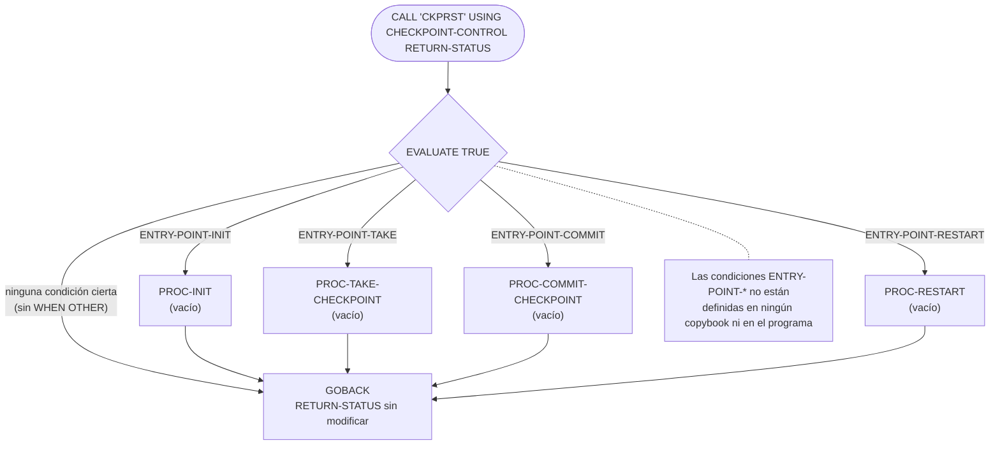
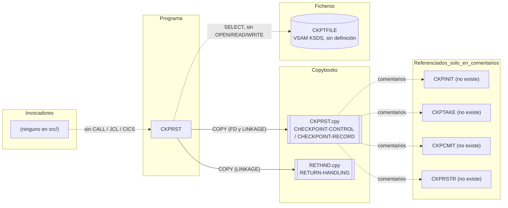

# CKPRST — Rutina de checkpoint/restart a nivel de programa (esqueleto sin implementar)

> Generado a partir del análisis del código fuente `src/programs/batch/CKPRST.cbl`. Ver el [grafo de dependencias global](../technical/dependency-graph.md).

## Ficha técnica
| Campo | Valor |
| --- | --- |
| Ruta | `src/programs/batch/CKPRST.cbl` |
| Categoría | batch |
| Tipo | subrutina común (batch, invocada por `CALL ... USING`) |
| Líneas | 57 |
| Punto de entrada | subrutina invocada por `CALL` (recibe `CHECKPOINT-CONTROL` y `RETURN-STATUS` en `PROCEDURE DIVISION USING`); ninguno conocido en el repositorio |
| Invocado por | Ninguno. No existe ningún `CALL 'CKPRST'`, `EXEC PGM=CKPRST` ni definición CICS en `src/` |
| Invoca a | Ningún programa. Copybooks: `CKPRST` (dos veces), `RETHND`. Fichero: `CKPTFILE` (declarado, nunca usado) |

## Propósito
CKPRST está concebido como la rutina común de **checkpoint/restart a nivel de programa** del subsistema batch de CLBS: un servicio al que los programas batch de larga duración (validación de transacciones, actualización de posiciones, carga de histórico) llamarían para inicializar el control de checkpoints, tomar un checkpoint cada N registros, confirmarlo y, tras un fallo, reposicionarse en el último punto consistente. Complementa al control a nivel de *job* que gestiona `BCHCTL00` con el fichero `BCHCTL` (el propio copybook `BCHCTL.cpy` dice: *"This control file manages job-level sequencing and dependencies, while CKPRST handles program-level checkpointing"*).

Sin embargo, **en su estado actual el programa es un esqueleto**: define la interfaz (estructura de control, estado de retorno y fichero VSAM de checkpoints) y un despachador por punto de entrada, pero los cuatro párrafos de proceso están vacíos, el fichero nunca se abre y las condiciones que seleccionan el punto de entrada no están definidas. Tal como está, no compila y no realiza ninguna función.

## Funcionamiento

### Estructura del programa
1. **`ENVIRONMENT DIVISION` / `FILE-CONTROL`**: declara el fichero `CHECKPOINT-FILE` (DDNAME `CKPTFILE`) como VSAM KSDS (`ORGANIZATION IS INDEXED`, `ACCESS MODE IS DYNAMIC`), con clave `CKR-KEY` y `FILE STATUS IS WS-FILE-STATUS`.
2. **`FILE SECTION`**: el `FD CHECKPOINT-FILE` toma su descripción de registro de `COPY CKPRST`, lo que introduce bajo el FD **dos** niveles 01 (`CHECKPOINT-CONTROL`, 424 bytes, y `CHECKPOINT-RECORD`, 416 bytes; véase [Observaciones](#observaciones-y-problemas-detectados)).
3. **`WORKING-STORAGE SECTION`**: un único campo, `WS-FILE-STATUS PIC X(2)`.
4. **`LINKAGE SECTION`**: vuelve a incluir `COPY CKPRST` (estructura `CHECKPOINT-CONTROL` que el llamador debe pasar) y `COPY RETHND` (estructura `RETURN-HANDLING`, de la que se usa el subgrupo `RETURN-STATUS`).
5. **`PROCEDURE DIVISION USING CHECKPOINT-CONTROL RETURN-STATUS`**: cuerpo principal, sin nombre de párrafo.

### Flujo de ejecución (párrafo por párrafo)

| Paso | Párrafo | Qué hace realmente el código |
| --- | --- | --- |
| 1 | *(cuerpo principal, sin nombre)* | `EVALUATE TRUE` sobre cuatro condiciones de nivel 88: `ENTRY-POINT-INIT`, `ENTRY-POINT-TAKE`, `ENTRY-POINT-COMMIT`, `ENTRY-POINT-RESTART`. Según la que sea cierta, ejecuta `PERFORM` del párrafo correspondiente. No hay `WHEN OTHER`. |
| 2a | `PROC-INIT` | Vacío. Solo contiene el texto `* Initialize checkpoint processing` y un punto. Intención (según el nombre y el copybook): inicializar `CHECKPOINT-CONTROL` y abrir `CKPTFILE`. |
| 2b | `PROC-TAKE-CHECKPOINT` | Vacío (`* Take a checkpoint`). Intención: grabar en `CKPTFILE` un `CHECKPOINT-RECORD` con la posición actual (`CK-LAST-KEY`, contadores, fase). |
| 2c | `PROC-COMMIT-CHECKPOINT` | Vacío (`* Commit checkpoint`). Intención: marcar el checkpoint como confirmado tras el `COMMIT` de la unidad de trabajo del llamador. |
| 2d | `PROC-RESTART` | Vacío (`* Handle restart processing`). Intención: leer el último checkpoint por `CKR-PROGRAM-ID` + `CKR-RUN-DATE` y devolver la posición de reanudación en `CK-POSITION`. |
| 3 | *(cuerpo principal)* | `GOBACK`. `RETURN-STATUS` no se modifica en ningún camino. |

Ningún camino abre, lee, escribe ni cierra `CHECKPOINT-FILE`; `WS-FILE-STATUS` nunca se consulta.

## Interfaz

- **Parámetros / LINKAGE SECTION / COMMAREA**: `PROCEDURE DIVISION USING CHECKPOINT-CONTROL RETURN-STATUS`.
  - `CHECKPOINT-CONTROL` (copybook `CKPRST`, 424 bytes): estructura de control que el llamador conserva entre llamadas. Campos clave: `CK-PROGRAM-ID`, `CK-RUN-DATE`, `CK-RUN-TIME`, `CK-STATUS` (88: `CK-INITIAL` 'I', `CK-ACTIVE` 'A', `CK-COMPLETE` 'C', `CK-FAILED` 'F', `CK-RESTARTED` 'R'), contadores `CK-RECORDS-READ/PROC/ERROR`, `CK-RESTART-COUNT`, posición `CK-LAST-KEY`/`CK-LAST-TIME`/`CK-PHASE` (88: `CK-PHASE-INIT` '00' … `CK-PHASE-TERM` '40'), tabla `CK-RESOURCES` de 5 ficheros y parámetros `CK-COMMIT-FREQ`, `CK-MAX-ERRORS`, `CK-MAX-RESTARTS`, `CK-RESTART-MODE` (88: `CK-MODE-NORMAL` 'N', `CK-MODE-RESTART` 'R', `CK-MODE-RECOVER` 'C').
  - `RETURN-STATUS` (subgrupo 05 de `RETURN-HANDLING`, copybook `RETHND`, 20 bytes): `RETURN-CODE PIC S9(4) COMP` (88: `RC-SUCCESS` 0, `RC-WARNING` 4, `RC-ERROR` 8, `RC-SEVERE` 12, `RC-CRITICAL` 16), `REASON-CODE`, `MODULE-ID`, `FUNCTION-ID`.
  - No es un programa CICS; no hay COMMAREA.

- **Ficheros**:

| DDNAME | Nombre COBOL | Organización | Acceso | Modo de apertura | Clave | Registro | Uso real |
| --- | --- | --- | --- | --- | --- | --- | --- |
| `CKPTFILE` | `CHECKPOINT-FILE` | `INDEXED` (VSAM KSDS) | `DYNAMIC` | Ninguno: no hay `OPEN` | `CKR-KEY` = `CKR-PROGRAM-ID` X(8) + `CKR-RUN-DATE` X(8) (16 bytes) | `CHECKPOINT-RECORD` (416 bytes: clave + `CKR-DATA` X(400)) | Solo declarado; ninguna sentencia de E/S |

  `CKPTFILE` no aparece en `src/database/vsam/vsam-definitions.txt` ni en ningún JCL de `src/jcl/`; no se define en el repositorio.

- **Tablas DB2 y sentencias SQL**: No aplica.
- **Mapas BMS / comandos CICS**: No aplica.
- **Códigos de retorno / RETURN-CODE**: el contrato implícito es devolver el resultado en `RETURN-STATUS` (`RC-SUCCESS`, `RC-WARNING`, `RC-ERROR`, `RC-SEVERE`, `RC-CRITICAL` más `REASON-CODE`, `MODULE-ID`, `FUNCTION-ID`), pero **el código no asigna ningún valor** a `RETURN-STATUS` ni al registro especial `RETURN-CODE`; el llamador recibe exactamente lo que envió.

## Estructuras de datos clave

### Copybook `CKPRST` (`src/copybook/batch/CKPRST.cpy`)
Se incluye **dos veces**: bajo el `FD CHECKPOINT-FILE` y en `LINKAGE SECTION`. Aporta:

| Nivel 01 | Tamaño | Contenido |
| --- | --- | --- |
| `CHECKPOINT-CONTROL` | 424 bytes | Bloque de control en memoria del llamador: cabecera (`CK-HEADER`, 23 bytes), contadores binarios (`CK-COUNTERS`, 14 bytes), posición de reanudación (`CK-POSITION`, 78 bytes), estado de hasta 5 ficheros (`CK-RESOURCES`, 5 × 60 bytes) y parámetros de control (`CK-CONTROL-INFO`, 9 bytes). |
| `CHECKPOINT-RECORD` | 416 bytes | Registro VSAM persistido: `CKR-KEY` (programa + fecha de ejecución) y `CKR-DATA PIC X(400)`, área opaca donde presumiblemente se volcaría `CHECKPOINT-CONTROL` (que, con 424 bytes, **no cabe** en 400). |

Umbrales por defecto declarados con `VALUE` en `CK-CONTROL-INFO`: `CK-COMMIT-FREQ` = 1000 registros entre checkpoints, `CK-MAX-ERRORS` = 100 errores tolerados, `CK-MAX-RESTARTS` = 3 reintentos de restart. Estos valores coinciden con `data-dictionary.md` §8.3 ("History load: every 1000 records"), pero al estar la estructura en `LINKAGE SECTION` la cláusula `VALUE` no inicializa nada: los valores efectivos los fija el llamador.

El bloque de comentarios final del copybook documenta el diseño original: cuatro subprogramas separados (`CKPINIT`, `CKPTAKE`, `CKPCMIT`, `CKPRSTR`) invocados con `CALL ... USING CHECKPOINT-CONTROL RETURN-STATUS`. `CKPRST.cbl` los fusiona en un único programa con despachador `EVALUATE`; ninguno de los cuatro nombres existe en `src/`.

### Copybook `RETHND` (`src/copybook/common/RETHND.cpy`)
Aporta `RETURN-HANDLING` (estado de retorno `RETURN-STATUS`, detalle de error `RETURN-DETAILS` con `ERROR-LOCATION`/`ERROR-INFO`/`SYSTEM-INFO`, y acciones `RETURN-ACTIONS` con `ACTION-CONTINUE`/`ACTION-ABORT`/`ACTION-RETRY`, `RETRY-COUNT`, `MAX-RETRIES`) y la tabla de códigos estándar `STD-ERROR-CODES` (`E001`…`E010`). CKPRST solo referencia el subgrupo `RETURN-STATUS` en el `USING`. Nótese que `RETHND` es usado únicamente por CKPRST; el resto de programas del repositorio usan `RTNCODE.cpy`.

### WORKING-STORAGE
| Campo | PIC | Uso |
| --- | --- | --- |
| `WS-FILE-STATUS` | X(2) | Destino de `FILE STATUS` de `CHECKPOINT-FILE`. Nunca se lee. |

No hay flags, contadores ni umbrales propios en WORKING-STORAGE; todo el estado reside en la estructura `CHECKPOINT-CONTROL` del llamador.

## Reglas de negocio y validaciones
El código no implementa ninguna regla de negocio ni validación. La única lógica es el despacho por punto de entrada:

- Si `ENTRY-POINT-INIT` → `PROC-INIT`.
- Si `ENTRY-POINT-TAKE` → `PROC-TAKE-CHECKPOINT`.
- Si `ENTRY-POINT-COMMIT` → `PROC-COMMIT-CHECKPOINT`.
- Si `ENTRY-POINT-RESTART` → `PROC-RESTART`.
- En cualquier otro caso no hace nada (no hay `WHEN OTHER`, no se informa error).

Las reglas que el diseño **pretende** soportar, deducidas exclusivamente de los campos del copybook (no del código, que no las usa), serían: tomar un checkpoint cada `CK-COMMIT-FREQ` registros, abortar al superar `CK-MAX-ERRORS` errores, rechazar el restart cuando `CK-RESTART-COUNT` supere `CK-MAX-RESTARTS`, y distinguir arranque normal (`CK-MODE-NORMAL`), restart (`CK-MODE-RESTART`) y recuperación (`CK-MODE-RECOVER`). Nada de esto está implementado.

## Manejo de errores y recuperación
- **FILE STATUS**: se declara `WS-FILE-STATUS` pero no existe ninguna sentencia de E/S ni ninguna comprobación de su valor. No hay `DECLARATIVES`.
- **SQLCODE**: No aplica (sin DB2).
- **Condiciones CICS**: No aplica.
- **Checkpoint/restart**: es la finalidad del programa, pero no hay lógica alguna: no se graba ni se lee ningún checkpoint, no se actualiza `CK-STATUS`, `CK-RESTART-COUNT` ni `CK-POSITION`.
- **Rollback / commit**: no se emite ningún `COMMIT` ni `ROLLBACK`; la fase `PROC-COMMIT-CHECKPOINT` está vacía.
- **ERRPROC / ERRHNDL / DB2ERR**: no se invoca a ningún manejador de errores. `RETURN-STATUS` no se rellena, por lo que el llamador no puede detectar fallos de esta rutina.

## Dependencias

## Observaciones y problemas detectados

### Errores que impiden la compilación
1. **Condiciones `ENTRY-POINT-*` sin definir.** `ENTRY-POINT-INIT`, `ENTRY-POINT-TAKE`, `ENTRY-POINT-COMMIT` y `ENTRY-POINT-RESTART` (líneas 30-36) no se declaran en el programa ni en `CKPRST.cpy` ni en `RETHND.cpy`, ni en ningún otro fichero de `src/`. El despachador no puede compilar y, además, no existe ningún campo en la interfaz que indique al programa qué operación debe realizar.
2. **Comentarios inválidos en formato fijo.** Las líneas `* Initialize checkpoint processing`, `* Take a checkpoint`, `* Commit checkpoint` y `* Handle restart processing` (líneas 44, 48, 52, 56) tienen el asterisco en el área B (columna 12), no en la columna 7 de indicador. Enterprise COBOL las interpreta como sentencias y produce error de sintaxis.
3. **`COPY CKPRST` duplicado.** El copybook se incluye bajo el `FD` (línea 17) y en `LINKAGE SECTION` (línea 23), con lo que `CHECKPOINT-CONTROL`, `CHECKPOINT-RECORD`, `CKR-KEY` y todos sus subordinados quedan definidos dos veces. La referencia `RECORD KEY IS CKR-KEY` y el `USING CHECKPOINT-CONTROL` son ambiguas. Además, la inclusión bajo el `FD` convierte a `CHECKPOINT-CONTROL` (424 bytes) en una descripción de registro del fichero, cuando el registro real debería ser solo `CHECKPOINT-RECORD` (416 bytes).
4. **Nombre duplicado dentro de `CKPRST.cpy`.** `CK-FILE-STATUS` es a la vez el grupo `10 CK-FILE-STATUS OCCURS 5 TIMES` y su subordinado `15 CK-FILE-STATUS PIC X(2)`; no es posible cualificarlo de forma única.
5. **`RETURN-CODE` redefinido en `RETHND.cpy`.** El copybook declara un dato de usuario llamado `RETURN-CODE`, nombre del registro especial de Enterprise COBOL. Probablemente el compilador lo rechace o, como mínimo, la referencia sea ambigua con el registro especial.

### Lógica incompleta
6. Los cuatro párrafos (`PROC-INIT`, `PROC-TAKE-CHECKPOINT`, `PROC-COMMIT-CHECKPOINT`, `PROC-RESTART`) están vacíos: el programa no realiza ninguna función.
7. `CHECKPOINT-FILE` nunca se abre, lee, escribe ni cierra; `WS-FILE-STATUS` no se comprueba.
8. `RETURN-STATUS` no se asigna en ningún camino; el llamador no puede saber si la operación tuvo éxito.
9. El `EVALUATE` carece de `WHEN OTHER`: una petición no reconocida termina en silencio.
10. `CKR-DATA` mide 400 bytes mientras `CHECKPOINT-CONTROL` ocupa 424; si la intención era persistir el bloque de control completo dentro del registro, no cabe.
11. Las cláusulas `VALUE` de `CK-COMMIT-FREQ` (1000), `CK-MAX-ERRORS` (100), `CK-MAX-RESTARTS` (3) y `MAX-RETRIES` (3) están en `LINKAGE SECTION` (y en la `FILE SECTION`), donde no tienen efecto para elementos que no sean de nivel 88; los umbrales por defecto no se aplican salvo que los inicialice el llamador.
12. `RETHND.cpy` define tres nombres por duplicado (`ERR-VALIDATION`, `ERR-PROCESSING`, `ERR-SECURITY`: como 88 bajo `ERROR-TYPE` y como 05 bajo `STD-ERROR-CODES`), lo que los haría ambiguos si CKPRST llegara a referenciarlos.

### Referencias sin resolver / integración
13. **Sin invocadores.** Ningún programa hace `CALL 'CKPRST'` y ningún JCL lo ejecuta (`dependency-graph.md` lo lista entre los "programas sin invocador conocido"). Los programas batch que sí actualizan el estado de checkpoint (`HISTLD00`, `RCVPRC00`, `PRCSEQ00`) lo hacen directamente sobre el fichero `BCHCTL` (`REWRITE BATCH-CONTROL-RECORD`), no a través de CKPRST.
14. **`CKPTFILE` no definido.** No hay DEFINE CLUSTER en `vsam-definitions.txt` ni tarjeta DD en ningún JCL.
15. **Subprogramas `CKPINIT`, `CKPTAKE`, `CKPCMIT`, `CKPRSTR`** citados en los comentarios de `CKPRST.cpy` no existen en `src/`.

### Discrepancias con la documentación
16. `data-dictionary.md` §2.6 describe un `CHECKPOINT-RECORD` distinto (clave `CHK-PROCESS-DATE` + `CHK-PROCESS-ID`, campos `CHK-LAST-TRANS-ID`, `CHK-LAST-ACCOUNT`, `CHK-LAST-FUND`, 200 bytes, almacenado "In VSAM BCHCTL"). El código define `CKR-PROGRAM-ID` + `CKR-RUN-DATE` con `CKR-DATA X(400)` (416 bytes) en un fichero separado `CKPTFILE`. Manda el código.
17. `system-architecture.md` §4.2 y §6.2.1 describen el checkpoint/restart como una lectura/escritura sobre `BCHCTL`, sin mencionar CKPRST ni `CKPTFILE`; la tabla 5.1.1 tampoco lo lista. El diseño documentado y el copybook `BCHCTL.cpy` (que sí remite a CKPRST) no están alineados.
18. `development-backlog.md` marca "Program-level checkpoint/restart (CKPRST)" como completado (✓), cuando el programa es un esqueleto sin implementar.
19. `dependency-graph.md` solo clasifica a `POSUPDT` como "programa vacío"; CKPRST tiene `PROCEDURE DIVISION` pero funcionalmente también lo es.

## Referencias
- Programa: [CKPRST.cbl](../../src/programs/batch/CKPRST.cbl)
- Copybooks: [CKPRST.cpy](../../src/copybook/batch/CKPRST.cpy), [RETHND.cpy](../../src/copybook/common/RETHND.cpy), [BCHCTL.cpy](../../src/copybook/batch/BCHCTL.cpy) (control a nivel de job, complementario)
- Definiciones VSAM: [vsam-definitions.txt](../../src/database/vsam/vsam-definitions.txt) (no incluye `CKPTFILE`)
- Programas que implementan checkpoint sobre `BCHCTL` en lugar de usar CKPRST: [HISTLD00.cbl](../../src/programs/batch/HISTLD00.cbl), [RCVPRC00.cbl](../../src/programs/batch/RCVPRC00.cbl), [PRCSEQ00.cbl](../../src/programs/batch/PRCSEQ00.cbl)
- Documentación técnica: [system-architecture.md](../technical/system-architecture.md) (§1.2.1, §4.2, §6.2.1), [data-dictionary.md](../technical/data-dictionary.md) (§2.6, §8.3), [development-backlog.md](../technical/development-backlog.md), [dependency-graph.md](../technical/dependency-graph.md)
