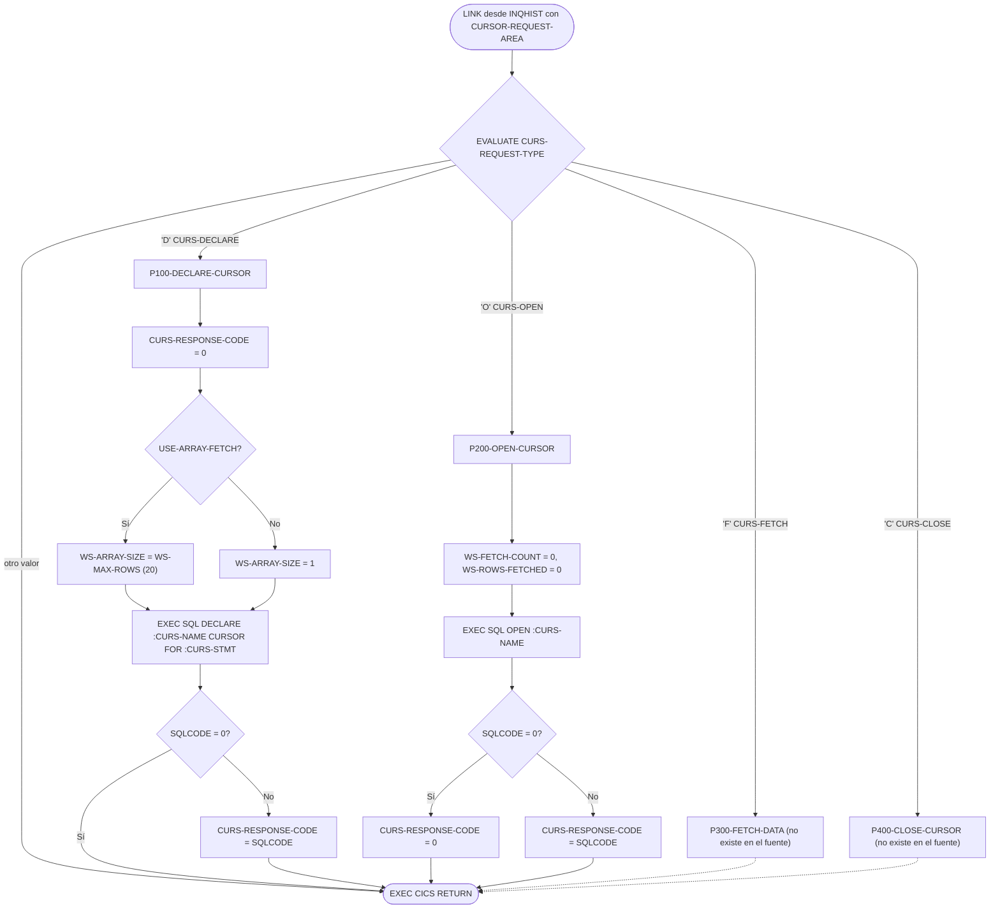
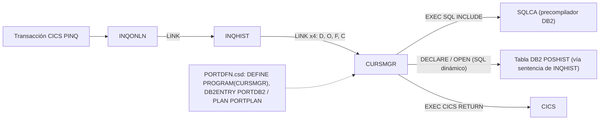

# CURSMGR — Gestor de cursores DB2 para programas online CICS

> Generado a partir del análisis del código fuente `src/programs/online/CURSMGR.cbl`. Ver el [grafo de dependencias global](../technical/dependency-graph.md).

## Ficha técnica
| Campo | Valor |
| --- | --- |
| Ruta | `src/programs/online/CURSMGR.cbl` |
| Categoría | online |
| Tipo | CICS online (subrutina de servicio invocada por `EXEC CICS LINK`) |
| Líneas | 91 |
| Punto de entrada | Subrutina invocada por `LINK` desde `INQHIST`; no tiene transacción CICS propia (en `PORTDFN.csd` solo existe `DEFINE PROGRAM(CURSMGR)`, sin `DEFINE TRANSACTION`) |
| Invocado por | `INQHIST` (párrafos `P200-GET-HISTORY` y `P250-FETCH-HISTORY`, cuatro `EXEC CICS LINK PROGRAM('CURSMGR')`) |
| Invoca a | Ningún programa (`CALL`/`LINK`). Solo ejecuta `EXEC SQL DECLARE CURSOR`, `EXEC SQL OPEN` y `EXEC CICS RETURN` |

## Propósito
`CURSMGR` pretende centralizar el ciclo de vida de los cursores DB2 que usan los programas de consulta online de la capa CICS (declarar, abrir, leer y cerrar) para que programas como `INQHIST` no tengan que incrustar SQL de cursor propio. Recibe una petición genérica (`CURSOR-REQUEST-AREA`) con un código de operación, el nombre del cursor, el texto de la sentencia `SELECT` y un área de datos de 3000 bytes donde debería devolver las filas leídas, con la opción de "array fetch" (lectura de hasta 20 filas por llamada). En el sistema encaja como componente de soporte de la consulta de histórico de transacciones (`PINQ` → `INQONLN` → `INQHIST` → `CURSMGR`) sobre la tabla DB2 `POSHIST`.

En su estado actual el fuente está **incompleto**: solo implementa la declaración (`P100-DECLARE-CURSOR`) y la apertura (`P200-OPEN-CURSOR`); los párrafos de lectura (`P300-FETCH-DATA`) y cierre (`P400-CLOSE-CURSOR`) que se invocan desde el `PROCEDURE DIVISION` no existen y el fichero termina truncado (ver [Observaciones](#observaciones-y-problemas-detectados)).

## Funcionamiento

### Flujo principal (`PROCEDURE DIVISION USING CURSOR-REQUEST-AREA`)
1. El programa no tiene párrafo de inicialización. Entra directamente en un `EVALUATE TRUE` sobre las condiciones de nivel 88 de `CURS-REQUEST-TYPE`:
   - `CURS-DECLARE` (`'D'`) → `PERFORM P100-DECLARE-CURSOR THRU P100-EXIT`.
   - `CURS-OPEN` (`'O'`) → `PERFORM P200-OPEN-CURSOR THRU P200-EXIT`.
   - `CURS-FETCH` (`'F'`) → `PERFORM P300-FETCH-DATA THRU P300-EXIT` (**párrafos no definidos en el fuente**).
   - `CURS-CLOSE` (`'C'`) → `PERFORM P400-CLOSE-CURSOR THRU P400-EXIT` (**párrafos no definidos en el fuente**).
   - No hay `WHEN OTHER`: cualquier otro valor no hace nada y no modifica `CURS-RESPONSE-CODE`.
2. Tras el `EVALUATE`, ejecuta `EXEC CICS RETURN END-EXEC` y devuelve el control al programa que hizo el `LINK`. Cada operación (`D`, `O`, `F`, `C`) es por tanto una invocación CICS independiente.

### `P100-DECLARE-CURSOR` / `P100-EXIT`
1. Inicializa `CURS-RESPONSE-CODE` a 0.
2. Si `USE-ARRAY-FETCH` (`CURS-ARRAY-FETCH = 'Y'`) mueve `WS-MAX-ROWS` (20) a `WS-ARRAY-SIZE`; en caso contrario mueve 1. Este valor no se vuelve a usar en el código existente.
3. Ejecuta `EXEC SQL DECLARE :CURS-NAME CURSOR FOR :CURS-STMT END-EXEC`, es decir, intenta declarar un cursor cuyo nombre y sentencia son variables host recibidas del llamador.
4. Si `SQLCODE` es distinto de 0 copia `SQLCODE` a `CURS-RESPONSE-CODE`.

### `P200-OPEN-CURSOR` / `P200-EXIT`
1. Pone a cero los contadores `WS-FETCH-COUNT` y `WS-ROWS-FETCHED`.
2. Ejecuta `EXEC SQL OPEN :CURS-NAME END-EXEC`.
3. Si `SQLCODE = 0` devuelve `CURS-RESPONSE-CODE = 0`; si no, copia `SQLCODE` a `CURS-RESPONSE-CODE`.
4. La etiqueta `P200-EXIT` es la última línea del fichero: no tiene punto final ni sentencia `EXIT.`.

### `P300-FETCH-DATA` y `P400-CLOSE-CURSOR`
No existen en el fuente. Por el diseño de la interfaz y por el uso que hace `INQHIST`, `P300-FETCH-DATA` debería ejecutar `FETCH` (individual o multi-fila según `WS-ARRAY-SIZE`), dejar las filas en `CURS-DATA-AREA`, informar `CURS-DATA-LENGTH` y devolver `SQLCODE` (0 o +100) en `CURS-RESPONSE-CODE`; `P400-CLOSE-CURSOR` debería ejecutar `CLOSE`. Esto es una inferencia: no está implementado en el repositorio.

## Interfaz

- **Parámetros / LINKAGE SECTION / COMMAREA**: el programa recibe `CURSOR-REQUEST-AREA` mediante `PROCEDURE DIVISION USING` (no usa el nombre `DFHCOMMAREA`). `INQHIST` lo invoca con `EXEC CICS LINK PROGRAM('CURSMGR') COMMAREA(WS-CURSOR-REQUEST) LENGTH(LENGTH OF WS-CURSOR-REQUEST)`; la estructura `WS-CURSOR-REQUEST` de `INQHIST` coincide campo a campo con la siguiente (3266 bytes):

  | Campo | PIC | Uso |
  | --- | --- | --- |
  | `CURS-REQUEST-TYPE` | `X` | Operación: `'D'` declarar, `'O'` abrir, `'F'` leer, `'C'` cerrar (niveles 88 `CURS-DECLARE`, `CURS-OPEN`, `CURS-FETCH`, `CURS-CLOSE`) |
  | `CURS-NAME` | `X(18)` | Nombre del cursor (`INQHIST` envía `'HISTORY_CURSOR'`) |
  | `CURS-STMT` | `X(240)` | Texto de la sentencia `SELECT` asociada al cursor |
  | `CURS-ARRAY-FETCH` | `X` | `'Y'` (`USE-ARRAY-FETCH`) / `'N'` (`NO-ARRAY-FETCH`). Lleva `VALUE 'N'`, sin efecto en LINKAGE |
  | `CURS-RESPONSE-CODE` | `S9(8) COMP` | Código de respuesta devuelto al llamador (0 o `SQLCODE`) |
  | `CURS-DATA-AREA` | `X(3000)` | Área de salida para las filas leídas (no se escribe en el código existente) |
  | `CURS-DATA-LENGTH` | `S9(4) COMP` | Longitud de datos devueltos (no se escribe en el código existente) |

- **Ficheros (DDNAME, organización, modo de apertura, clave)**: No aplica. El programa no tiene `FILE-CONTROL` ni `FILE SECTION`.

- **Tablas DB2 y sentencias SQL**: el programa no referencia ninguna tabla de forma estática; la tabla depende de la sentencia que le pase el llamador.

  | Párrafo | Sentencia | Tabla | Observación |
  | --- | --- | --- | --- |
  | `P100-DECLARE-CURSOR` | `DECLARE :CURS-NAME CURSOR FOR :CURS-STMT` | Dinámica (desde `INQHIST`: `POSHIST`) | Sintaxis no válida en DB2 (ver observaciones) |
  | `P200-OPEN-CURSOR` | `OPEN :CURS-NAME` | — | El nombre del cursor no puede ser variable host |
  | (`P300-FETCH-DATA`) | `FETCH` esperado | — | No implementado |
  | (`P400-CLOSE-CURSOR`) | `CLOSE` esperado | — | No implementado |

  La única sentencia real que circula por esta interfaz en el repositorio es la que construye `INQHIST.P200-GET-HISTORY`: `SELECT TRANS_DATE, TRANS_TYPE, TRANS_UNITS, TRANS_PRICE, TRANS_AMOUNT FROM POSHIST WHERE ACCOUNT_NO = ? ORDER BY TRANS_DATE DESC`. El plan DB2 (`PORTPLAN`, `DB2ENTRY PORTDB2` en `PORTDFN.csd`) se asocia a la transacción `PINQ`.

- **Mapas BMS / comandos CICS**: no usa mapas BMS. Único comando CICS: `EXEC CICS RETURN` (sin `TRANSID` ni `COMMAREA`, como corresponde a un programa enlazado con `LINK`). No usa `HANDLE CONDITION`, `RESP` ni `ABEND`.

- **Códigos de retorno / RETURN-CODE**: no usa `RETURN-CODE`. La respuesta al llamador se entrega en `CURS-RESPONSE-CODE`:

  | Operación | Valor | Cuándo |
  | --- | --- | --- |
  | `'D'` | 0 | `DECLARE` con `SQLCODE = 0` |
  | `'D'` | `SQLCODE` (≠ 0) | Error o aviso en `DECLARE` |
  | `'O'` | 0 | `OPEN` con `SQLCODE = 0` |
  | `'O'` | `SQLCODE` (≠ 0) | Error o aviso en `OPEN` (p. ej. cursor ya abierto, falta de variables para el marcador `?`) |
  | `'F'`, `'C'`, otros | sin cambio | No hay código que lo establezca; el llamador recibe el valor que tuviera antes |

  `INQHIST` interpreta `CURS-RESPONSE-CODE = 0` como éxito tras `'D'` y `'O'`, y `>= 0` tras `'F'` (para admitir `+100` = fin de cursor).

## Estructuras de datos clave

**Copybooks**: no utiliza ningún `COPY`. Incluye la SQLCA mediante el precompilador DB2 (`EXEC SQL INCLUDE SQLCA END-EXEC` dentro del nivel 01 `WS-DB2-AREA`), no a través del copybook `src/copybook/db2/SQLCA.cpy`. La estructura `CURSOR-REQUEST-AREA` está definida en línea, sin copybook compartido; `INQHIST` la replica a mano en `WS-CURSOR-REQUEST` (a diferencia de `DB2-REQUEST-AREA`, que sí tiene copybook `DB2REQ.cpy`).

**WORKING-STORAGE**:

| Campo | PIC / VALUE | Uso en el código |
| --- | --- | --- |
| `WS-DB2-AREA` → SQLCA | — | `SQLCODE` consultado tras `DECLARE` y `OPEN` |
| `WS-CURSOR-STATS.WS-FETCH-COUNT` | `S9(8) COMP VALUE 0` | Puesto a 0 en `P200-OPEN-CURSOR`; nunca incrementado |
| `WS-CURSOR-STATS.WS-ROWS-FETCHED` | `S9(8) COMP VALUE 0` | Puesto a 0 en `P200-OPEN-CURSOR`; nunca incrementado |
| `WS-CURSOR-STATS.WS-FETCH-TIME` | `S9(8) COMP VALUE 0` | Nunca referenciado |
| `WS-ARRAY-AREA.WS-MAX-ROWS` | `S9(4) COMP VALUE 20` | Tamaño máximo del array fetch |
| `WS-ARRAY-AREA.WS-ARRAY-SIZE` | `S9(4) COMP VALUE 0` | Fijado a 20 o 1 en `P100-DECLARE-CURSOR`; nunca leído |

Nota: al ser cada operación una invocación `LINK` distinta (y el programa está definido `RESIDENT(NO)` en `PORTDFN.csd`), la WORKING-STORAGE se reinicializa en cada llamada, por lo que `WS-ARRAY-SIZE` calculado en `'D'` no estaría disponible en un hipotético `'F'` posterior, y las estadísticas `WS-CURSOR-STATS` no pueden acumularse entre llamadas.

## Reglas de negocio y validaciones
El programa no implementa reglas de negocio propias; es una capa técnica. Las únicas decisiones codificadas son:

1. Despacho por tipo de petición (`EVALUATE TRUE` sobre `CURS-REQUEST-TYPE` = `'D'`/`'O'`/`'F'`/`'C'`). No se valida ni rechaza un tipo desconocido.
2. Tamaño de array fetch: `WS-ARRAY-SIZE = 20` si `CURS-ARRAY-FETCH = 'Y'`, `1` en otro caso (`P100-DECLARE-CURSOR`). El valor no tiene efecto en ninguna sentencia SQL existente.
3. Propagación de `SQLCODE`: cualquier `SQLCODE ≠ 0` en `DECLARE` u `OPEN` se copia tal cual a `CURS-RESPONSE-CODE`; `SQLCODE = 0` produce respuesta 0.
4. No se valida la longitud ni el contenido de `CURS-STMT` (240 bytes) ni de `CURS-NAME` (18 bytes).

## Manejo de errores y recuperación
- **FILE STATUS**: no aplica (sin ficheros).
- **SQLCODE**: comprobación simple tras `DECLARE` (`P100`) y `OPEN` (`P200`); el código se devuelve al llamador en `CURS-RESPONSE-CODE` sin traducción, sin registrar mensaje (`SQLERRMC` no se usa) y sin distinguir avisos (>0) de errores (<0). No hay `WHENEVER SQLERROR`.
- **Condiciones CICS**: no hay `HANDLE CONDITION`, `RESP`/`RESP2` ni `HANDLE ABEND`. Un abend en el programa se propaga al llamador (`INQHIST`, que sí define `HANDLE CONDITION ERROR(P999-ERROR-ROUTINE)`).
- **Checkpoint/restart, rollback**: no aplica. No ejecuta `COMMIT`, `ROLLBACK` ni `SYNCPOINT`; la unidad de trabajo la gobierna la transacción `PINQ`.
- **ERRPROC / ERRHNDL / DB2ERR / DB2RECV**: no los invoca. La recuperación queda en manos del llamador: `INQHIST` solo llama a `DB2RECV` para errores de conexión (`DB2ONLN`), no para los códigos devueltos por `CURSMGR`; ante `CURS-RESPONSE-CODE ≠ 0` simplemente omite la apertura/lectura y envía el cierre (`'C'`). `DB2RECV` dispone de una operación `RECV-CURSOR` (`'R'`, párrafo `P300-RECOVER-CURSOR`) que nadie utiliza para cursores de `CURSMGR`.

## Dependencias

- **Programas que lo invocan**: `INQHIST` (único, verificado en el código; `INQONLN` e `INQPORT` no lo referencian).
- **Programas invocados**: ninguno.
- **Copybooks**: ninguno (`COPY`). SQLCA por `EXEC SQL INCLUDE`.
- **Ficheros**: ninguno.
- **Tablas DB2**: ninguna referenciada estáticamente; en la práctica `POSHIST` (definida en `src/database/db2/POSHIST.sql`) a través de la sentencia que construye `INQHIST`.
- **Mapas BMS**: ninguno.
- **Definiciones CICS**: `DEFINE PROGRAM(CURSMGR) LANGUAGE(COBOL) DATALOCATION(ANY) EXECKEY(USER) RESIDENT(NO) GROUP(PORTGRP)` en `src/cics/PORTDFN.csd`.

## Observaciones y problemas detectados

1. **Fuente truncado / incompleto.** El fichero termina en la línea 91 con la etiqueta `P200-EXIT` sin punto ni sentencia `EXIT.`. Los párrafos `P300-FETCH-DATA`, `P300-EXIT`, `P400-CLOSE-CURSOR` y `P400-EXIT`, referenciados por `PERFORM ... THRU` en el `PROCEDURE DIVISION`, no existen. El programa no compila y las operaciones `'F'` (fetch) y `'C'` (close) que `INQHIST` necesita no están implementadas; nunca se escribe en `CURS-DATA-AREA` ni en `CURS-DATA-LENGTH`.
2. **`DECLARE CURSOR` con nombre y sentencia en variables host no es SQL válido.** `EXEC SQL DECLARE :CURS-NAME CURSOR FOR :CURS-STMT` y `EXEC SQL OPEN :CURS-NAME` no son aceptados por el precompilador DB2: el nombre de cursor debe ser un identificador literal y `DECLARE CURSOR` es declarativa (no ejecutable, no genera `SQLCODE`). Para SQL dinámico haría falta `PREPARE stmt FROM :CURS-STMT` + `DECLARE cursor CURSOR FOR stmt` + `OPEN cursor [USING :vars]`. La comprobación `IF SQLCODE NOT = 0` tras el `DECLARE` no tiene sentido porque un `DECLARE` no ejecuta nada.
3. **Alcance del cursor entre invocaciones `LINK`.** Aunque el SQL fuese válido, cada operación llega en una invocación CICS distinta con WORKING-STORAGE reinicializada (`RESIDENT(NO)`), por lo que `WS-ARRAY-SIZE` (decidido en `'D'`) y las estadísticas `WS-CURSOR-STATS` se pierden antes del `'F'`. El diseño de "una operación por `LINK`" es difícilmente compatible con un cursor DB2 mantenido entre llamadas.
4. **Recepción de la COMMAREA mediante `PROCEDURE DIVISION USING`.** El programa es invocado con `EXEC CICS LINK ... COMMAREA(...)`, pero direcciona el área con `PROCEDURE DIVISION USING CURSOR-REQUEST-AREA` en lugar del `DFHCOMMAREA` estándar de CICS. Probablemente el traductor CICS antepone `DFHEIBLK DFHCOMMAREA` al `USING`, con lo que `CURSOR-REQUEST-AREA` quedaría como un tercer parámetro no suministrado. Es el mismo patrón que usan `DB2ONLN` y `DB2RECV` en este repositorio, pero no es la convención CICS habitual (`INQHIST` e `INQONLN` sí usan `DFHCOMMAREA`).
5. **`VALUE 'N'` en LINKAGE SECTION.** `CURS-ARRAY-FETCH PIC X VALUE 'N'` lleva una cláusula `VALUE` sobre un elemento de LINKAGE (solo válida para niveles 88); el compilador la ignora con aviso. El valor real lo fija siempre el llamador (`INQHIST` envía `'Y'`).
6. **Sin `WHEN OTHER`.** Un `CURS-REQUEST-TYPE` no reconocido no produce error ni modifica `CURS-RESPONSE-CODE`; el llamador podría interpretar como éxito un valor residual.
7. **Funcionalidad anunciada no implementada.** La cabecera promete "cursor optimization techniques", "array fetching" y "cursor status monitoring"; solo existe el cálculo de `WS-ARRAY-SIZE` (nunca usado) y contadores que nunca se incrementan (`WS-FETCH-COUNT`, `WS-ROWS-FETCHED`) o no se referencian (`WS-FETCH-TIME`).
8. **Sin copybook para la interfaz.** `CURSOR-REQUEST-AREA` se define en línea y `INQHIST` la duplica manualmente en `WS-CURSOR-REQUEST`; cualquier cambio de layout debe replicarse a mano. `DB2REQ.cpy` demuestra que el repositorio sí usa copybooks para este tipo de áreas.
9. **Discrepancias con `system-architecture.md`.** La documentación de arquitectura (sección "Online Support Components", tabla 5.1.4 y diagramas) describe a `CURSMGR` como gestor de *cursor de pantalla* ("Handles cursor positioning", "Manages screen navigation", "Supports PF key processing", recurso "BMS Maps") y lo hace depender de `INQONLN` e `INQPORT` ("Format Display"). El código muestra que es un gestor de *cursores DB2*, no usa mapas BMS y solo lo invoca `INQHIST`. Manda el código.
10. **Problema en el llamador relacionado.** La sentencia que `INQHIST` entrega a `CURSMGR` contiene un marcador `?` (`WHERE ACCOUNT_NO = ?`) pero la interfaz no dispone de campo para pasar el valor del parámetro, y `P200-OPEN-CURSOR` hace `OPEN` sin cláusula `USING`; incluso con SQL dinámico correcto, la apertura fallaría. Además `INQHIST` mueve los 3000 bytes de `CURS-DATA-AREA` a `WS-HISTORY-TABLE` (10 filas × 32 bytes) sin ningún mapeo de columnas ni uso de `CURS-DATA-LENGTH`.
11. **Metadatos del grafo de dependencias.** El grafo indica correctamente `copybooks: []`, `tablas_DB2: []` y `comandos_CICS: [RETURN]`; conviene tener en cuenta que la lista `parrafos` (`P100-DECLARE-CURSOR`, `P100-EXIT`, `P200-OPEN-CURSOR`) omite `P200-EXIT` porque la etiqueta carece de punto final, síntoma del truncado descrito en el punto 1.

## Referencias
- Programa: [CURSMGR.cbl](../../src/programs/online/CURSMGR.cbl)
- Llamador: [INQHIST.cbl](../../src/programs/online/INQHIST.cbl) (párrafos `P200-GET-HISTORY`, `P250-FETCH-HISTORY`)
- Controlador de la transacción `PINQ`: [INQONLN.cbl](../../src/programs/online/INQONLN.cbl)
- Programas de soporte DB2 online relacionados: [DB2ONLN.cbl](../../src/programs/online/DB2ONLN.cbl), [DB2RECV.cbl](../../src/programs/online/DB2RECV.cbl)
- Definiciones CICS: [PORTDFN.csd](../../src/cics/PORTDFN.csd)
- Tabla DB2 consultada a través del cursor: [POSHIST.sql](../../src/database/db2/POSHIST.sql)
- Plan DB2: [PORTPLAN.sql](../../src/database/db2/PORTPLAN.sql)
- Copybook SQLCA del repositorio (no usado por este programa): [SQLCA.cpy](../../src/copybook/db2/SQLCA.cpy)
- Copybook de interfaz análogo (`DB2-REQUEST-AREA`): [DB2REQ.cpy](../../src/copybook/online/DB2REQ.cpy)
- Documentación de arquitectura: [system-architecture.md](../technical/system-architecture.md), [data-dictionary.md](../technical/data-dictionary.md)
- Grafo de dependencias: [dependency-graph.md](../technical/dependency-graph.md), [dependency-graph.json](../technical/dependency-graph.json)
