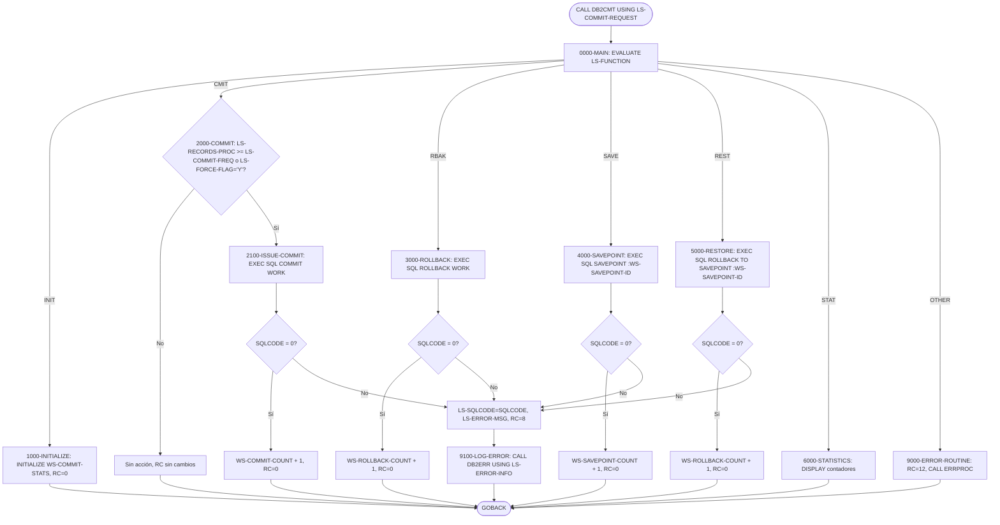
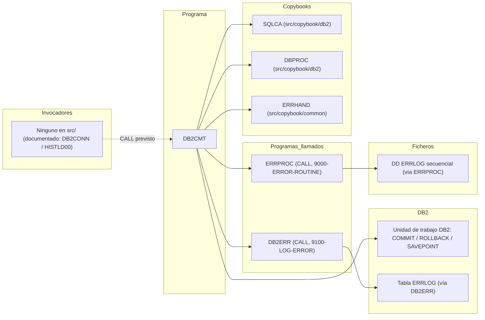

# DB2CMT — Controlador de commits, rollbacks y savepoints DB2

> Generado a partir del análisis del código fuente `src/programs/common/DB2CMT.cbl`. Ver el [grafo de dependencias global](../technical/dependency-graph.md).

## Ficha técnica
| Campo | Valor |
| --- | --- |
| Ruta | `src/programs/common/DB2CMT.cbl` |
| Categoría | common |
| Tipo | subrutina común (DB2, sin CICS ni ficheros propios) |
| Líneas | 170 |
| Punto de entrada | subrutina invocada por `CALL ... USING LS-COMMIT-REQUEST`; ninguno conocido en el repositorio |
| Invocado por | ninguno en `src/` (ningún `CALL 'DB2CMT'`, ningún JCL ni definición CICS lo referencia) |
| Invoca a | `ERRPROC` (CALL, errores de función inválida), `DB2ERR` (CALL, registro de errores SQL) |

## Propósito
`DB2CMT` ("DB2 Commit Controller") es una subrutina de la capa de soporte DB2 que centraliza el control de la unidad de trabajo DB2 para los programas batch de la CLBS: decide cuándo emitir `COMMIT WORK` en función de un contador de registros procesados y una frecuencia de commit, ejecuta `ROLLBACK WORK`, crea savepoints (`SAVEPOINT`), deshace hasta un savepoint (`ROLLBACK TO SAVEPOINT`) y mantiene estadísticas de cuántas de estas operaciones se han ejecutado. Según `system-architecture.md` forma, junto con `DB2CONN`, `DB2ERR` y `DB2STAT`, la "DB2 Support Layer" que da servicio al cargador de histórico `HISTLD00`. Sin embargo, en el código actual del repositorio ningún programa lo invoca (ver [Observaciones](#observaciones-y-problemas-detectados)).

## Funcionamiento
El programa no tiene bucle de proceso propio: es un despachador de una sola operación por llamada. El invocador rellena el área `LS-COMMIT-REQUEST`, indica el código de función en `LS-FUNCTION` y `DB2CMT` ejecuta exactamente un párrafo antes de hacer `GOBACK`.

### `0000-MAIN`
`EVALUATE TRUE` sobre las condiciones de nivel 88 de `LS-FUNCTION`:

| Valor de `LS-FUNCTION` | Condición 88 | Párrafo ejecutado |
| --- | --- | --- |
| `INIT` | `FUNC-INIT` | `1000-INITIALIZE` |
| `CMIT` | `FUNC-CMIT` | `2000-COMMIT` |
| `RBAK` | `FUNC-RBACK` | `3000-ROLLBACK` |
| `SAVE` | `FUNC-SAVE` | `4000-SAVEPOINT` |
| `REST` | `FUNC-REST` | `5000-RESTORE` |
| `STAT` | `FUNC-STAT` | `6000-STATISTICS` |
| cualquier otro | — | mueve `'Invalid function code'` a `ERR-TEXT` y ejecuta `9000-ERROR-ROUTINE` |

Tras el `EVALUATE` se ejecuta `GOBACK` incondicionalmente; no hay `STOP RUN`.

### `1000-INITIALIZE`
`INITIALIZE WS-COMMIT-STATS` (pone a cero `WS-COMMIT-COUNT`, `WS-ROLLBACK-COUNT` y `WS-SAVEPOINT-COUNT`) y `MOVE 0 TO LS-RETURN-CODE`. No hay conexión a DB2 ni ninguna sentencia SQL: se asume que el invocador ya ha conectado (p. ej. mediante `DB2CONN` o el párrafo `CONNECT-TO-DB2` de `DBPROC`).

### `2000-COMMIT`
Punto de commit condicional. Se ejecuta `2100-ISSUE-COMMIT` sólo si:

```
LS-RECORDS-PROC >= LS-COMMIT-FREQ  OR  LS-FORCE-COMMIT  (LS-FORCE-FLAG = 'Y')
```

Si la condición no se cumple, el párrafo termina sin tocar `LS-RETURN-CODE` ni ningún otro campo (el invocador recibe el área tal cual la envió). `DB2CMT` no reinicia `LS-RECORDS-PROC`: es responsabilidad del invocador poner el contador a cero tras un commit.

### `2100-ISSUE-COMMIT`
Emite `EXEC SQL COMMIT WORK END-EXEC`. Si `SQLCODE = 0`, incrementa `WS-COMMIT-COUNT` y devuelve `LS-RETURN-CODE = 0`. En caso contrario copia `SQLCODE` a `LS-SQLCODE`, pone `'Commit failed'` en `LS-ERROR-MSG`, `LS-RETURN-CODE = 8` y ejecuta `9100-LOG-ERROR`.

### `3000-ROLLBACK`
Emite `EXEC SQL ROLLBACK WORK END-EXEC` (rollback completo de la unidad de trabajo). Con `SQLCODE = 0` incrementa `WS-ROLLBACK-COUNT` y devuelve 0; si no, `LS-SQLCODE`, `'Rollback failed'`, `LS-RETURN-CODE = 8` y `9100-LOG-ERROR`.

### `4000-SAVEPOINT`
Copia `LS-SAVEPOINT-NAME` (18 caracteres) a la variable host `WS-SAVEPOINT-ID` y emite:

```sql
SAVEPOINT :WS-SAVEPOINT-ID ON ROLLBACK RETAIN CURSORS
```

Con `SQLCODE = 0` incrementa `WS-SAVEPOINT-COUNT` y devuelve 0; si no, `'Savepoint creation failed'`, `LS-RETURN-CODE = 8` y `9100-LOG-ERROR`. No se valida que el nombre no venga en blanco ni se usa la opción `UNIQUE`.

### `5000-RESTORE`
Copia `LS-SAVEPOINT-NAME` a `WS-SAVEPOINT-ID` y emite:

```sql
ROLLBACK TO SAVEPOINT :WS-SAVEPOINT-ID
```

Deshace los cambios posteriores al savepoint sin cerrar la unidad de trabajo. Con `SQLCODE = 0` incrementa **`WS-ROLLBACK-COUNT`** (el mismo contador que el rollback completo; no existe un contador específico de restauraciones) y devuelve 0; si no, `'Savepoint restore failed'`, `LS-RETURN-CODE = 8` y `9100-LOG-ERROR`.

### `6000-STATISTICS`
Cuatro `DISPLAY` con la cabecera `'DB2 Commit Controller Statistics:'` y los valores de `WS-COMMIT-COUNT`, `WS-ROLLBACK-COUNT` y `WS-SAVEPOINT-COUNT`. No modifica `LS-RETURN-CODE`. La salida va a SYSOUT en batch.

### `9000-ERROR-ROUTINE`
Sólo se alcanza con un código de función desconocido. Mueve `'DB2CMT'` a `ERR-PROGRAM`, `12` a `LS-RETURN-CODE` y hace `CALL 'ERRPROC' USING ERR-MESSAGE`. No se rellenan `ERR-CATEGORY`, `ERR-CODE`, `ERR-SEVERITY` ni `ERR-TIMESTAMP`.

### `9100-LOG-ERROR`
`CALL 'DB2ERR' USING LS-ERROR-INFO`. Pretende registrar el error SQL en la tabla `ERRLOG` a través de `DB2ERR`, pero la estructura pasada no coincide con la que espera `DB2ERR` (ver Observaciones).

### Diagrama de flujo



## Interfaz

- **Parámetros / LINKAGE SECTION / COMMAREA**: un único parámetro `LS-COMMIT-REQUEST` (115 bytes, sin `SYNC`), recibido por referencia con `PROCEDURE DIVISION USING`. No hay COMMAREA CICS.

| Campo | PIC | Dir. | Descripción |
| --- | --- | --- | --- |
| `LS-FUNCTION` | `X(4)` | E | Código de función: `INIT`, `CMIT`, `RBAK`, `SAVE`, `REST`, `STAT` |
| `LS-SAVEPOINT-NAME` | `X(18)` | E | Nombre del savepoint para `SAVE` y `REST` |
| `LS-RECORDS-PROC` | `S9(9) COMP` | E | Registros procesados desde el último commit (lo mantiene el invocador) |
| `LS-COMMIT-FREQ` | `S9(4) COMP` | E | Frecuencia de commit (máx. 9.999) |
| `LS-FORCE-FLAG` | `X(1)` | E | `'Y'` (`LS-FORCE-COMMIT`) fuerza el commit ignorando el umbral |
| `LS-RETURN-CODE` | `S9(4) COMP` | S | 0 / 8 / 12 (ver abajo) |
| `LS-ERROR-INFO.LS-SQLCODE` | `S9(9) COMP` | S | `SQLCODE` de la sentencia que falló |
| `LS-ERROR-INFO.LS-ERROR-MSG` | `X(80)` | S | Texto fijo del error (`Commit failed`, `Rollback failed`, `Savepoint creation failed`, `Savepoint restore failed`) |

- **Ficheros (DDNAME, organización, modo de apertura, clave)**: No aplica. El programa no tiene `FILE-CONTROL` ni `FILE SECTION`. Indirectamente, `ERRPROC` escribe en el fichero secuencial `ERRLOG` (DDNAME `ERRLOG`, `OPEN EXTEND`).

- **Tablas DB2 y sentencias SQL**: no accede a ninguna tabla; sólo emite sentencias de control de unidad de trabajo.

| Párrafo | Sentencia SQL | Variables host |
| --- | --- | --- |
| `2100-ISSUE-COMMIT` | `COMMIT WORK` | — |
| `3000-ROLLBACK` | `ROLLBACK WORK` | — |
| `4000-SAVEPOINT` | `SAVEPOINT :WS-SAVEPOINT-ID ON ROLLBACK RETAIN CURSORS` | `WS-SAVEPOINT-ID PIC X(18)` |
| `5000-RESTORE` | `ROLLBACK TO SAVEPOINT :WS-SAVEPOINT-ID` | `WS-SAVEPOINT-ID PIC X(18)` |

  Indirectamente, `DB2ERR` hace `INSERT INTO ERRLOG` (tabla definida en `src/database/db2/ERRLOG.sql`). No existe DBRM/BIND específico para `DB2CMT` en `src/database/db2/`; `PORTPLAN.sql` usa `PKLIST(*.PORTPKG.*)` con `RELEASE(COMMIT)`.

- **Mapas BMS / comandos CICS**: No aplica.

- **Códigos de retorno / RETURN-CODE**: el programa no usa el registro especial `RETURN-CODE`; devuelve el resultado en `LS-RETURN-CODE`:

| `LS-RETURN-CODE` | Cuándo |
| --- | --- |
| `0` | `INIT`; o `CMIT`/`RBAK`/`SAVE`/`REST` con `SQLCODE = 0` |
| `8` | La sentencia SQL devolvió `SQLCODE` distinto de 0 (incluidos warnings positivos); `LS-SQLCODE` y `LS-ERROR-MSG` informados |
| `12` | Código de función inválido (`WHEN OTHER`) |
| sin cambio | `CMIT` con umbral no alcanzado y sin forzado; `STAT` |

## Estructuras de datos clave

### Copybooks
| Copybook | Ruta | Qué aporta a `DB2CMT` |
| --- | --- | --- |
| `SQLCA` | `src/copybook/db2/SQLCA.cpy` | `EXEC SQL INCLUDE SQLCA` (define `SQLCODE`, `SQLSTATE`, etc.) y el grupo `SQL-STATUS-CODES` con constantes `SQLSTATE` (`SQL-SUCCESS`, `SQL-DEADLOCK`, `SQL-TIMEOUT`, ...). `DB2CMT` sólo usa `SQLCODE`; las constantes no se referencian. |
| `DBPROC` | `src/copybook/db2/DBPROC.cpy` | Grupo `DB2-ERROR-HANDLING` (mensaje formateado, `DB2-RETRY-COUNT`, `DB2-MAX-RETRIES` = 3, `DB2-RETRY-WAIT` = 100) **y** los párrafos `CONNECT-TO-DB2`, `DISCONNECT-FROM-DB2`, `DB2-ERROR-ROUTINE` y `CHECK-SQL-STATUS`. `DB2CMT` no referencia nada de este copybook (ver Observaciones). |
| `ERRHAND` | `src/copybook/common/ERRHAND.cpy` | `ERR-CATEGORIES`, `ERR-RETURN-CODES` (`ERR-SUCCESS` 0, `ERR-WARNING` 4, `ERR-ERROR` 8, `ERR-SEVERE` 12, `ERR-TERMINAL` 16), estructura `ERR-MESSAGE` (370 bytes) y constantes VSAM. `DB2CMT` sólo usa `ERR-PROGRAM` y `ERR-TEXT` de `ERR-MESSAGE`. |

### WORKING-STORAGE
| Campo | PIC | Uso |
| --- | --- | --- |
| `WS-SAVEPOINT-ID` | `X(18)` | Variable host (dentro de `BEGIN/END DECLARE SECTION`) con el nombre del savepoint |
| `WS-COMMIT-STATS.WS-COMMIT-COUNT` | `S9(9) COMP VALUE 0` | Commits correctos acumulados |
| `WS-COMMIT-STATS.WS-ROLLBACK-COUNT` | `S9(9) COMP VALUE 0` | Rollbacks completos **y** restauraciones a savepoint correctos |
| `WS-COMMIT-STATS.WS-SAVEPOINT-COUNT` | `S9(9) COMP VALUE 0` | Savepoints creados correctamente |
| `WS-CURRENT-TIMESTAMP` | `X(26)` | Declarado, nunca usado |

Los contadores viven en WORKING-STORAGE sin cláusula `INITIAL`, por lo que persisten entre llamadas mientras el programa permanezca cargado en la misma unidad de ejecución (comportamiento necesario para que `STAT` tenga sentido). Se reinician sólo con la función `INIT` o al recargar el módulo.

## Reglas de negocio y validaciones
1. **Commit por umbral**: se emite `COMMIT WORK` cuando `LS-RECORDS-PROC >= LS-COMMIT-FREQ`. Con `LS-COMMIT-FREQ = 0` (o negativo) la condición es siempre cierta y se hace commit en cada llamada `CMIT`.
2. **Commit forzado**: `LS-FORCE-FLAG = 'Y'` (exactamente mayúscula) fuerza el commit con independencia del contador; típicamente para el commit final de un job.
3. **El contador lo gestiona el invocador**: `DB2CMT` nunca modifica `LS-RECORDS-PROC`; si el invocador no lo reinicia a 0 tras un commit, todas las llamadas siguientes harán commit.
4. **Éxito estricto**: cualquier `SQLCODE` distinto de 0 (incluidos warnings positivos) se considera fallo, produce `LS-RETURN-CODE = 8` y se intenta registrar vía `DB2ERR`. No se distingue deadlock/timeout (`-911`/`-913`) ni se reintenta, aunque `DBPROC` incluya campos de reintento.
5. **Savepoints con cursores retenidos**: los savepoints se crean siempre con `ON ROLLBACK RETAIN CURSORS`, de modo que un `ROLLBACK TO SAVEPOINT` no cierra los cursores abiertos del invocador.
6. **Una operación por llamada**: no hay combinación de funciones (p. ej. `SAVE` + `CMIT`); cada `CALL` ejecuta exactamente un párrafo.
7. **Estadísticas**: `INIT` pone los contadores a cero; `STAT` sólo los muestra por `DISPLAY`, no los devuelve al invocador.
8. **Frecuencia máxima**: `LS-COMMIT-FREQ` es `S9(4) COMP`, por lo que el umbral máximo representable es 9.999 registros; los valores documentados en `data-dictionary.md` (500 y 1.000) y en `CKPRST.cpy` (`CK-COMMIT-FREQ` = 1.000) caben en ese rango.

## Manejo de errores y recuperación
- **FILE STATUS**: no aplica; el programa no abre ficheros.
- **SQLCODE**: se comprueba inmediatamente después de cada `EXEC SQL` con `IF SQLCODE = 0`. En caso de fallo se informa `LS-SQLCODE`, `LS-ERROR-MSG` (texto fijo por operación) y `LS-RETURN-CODE = 8`, y se llama a `9100-LOG-ERROR` → `CALL 'DB2ERR' USING LS-ERROR-INFO`. No se copia `SQLSTATE`, no hay reintentos y no se ejecuta `ROLLBACK` compensatorio tras un `COMMIT` fallido; la decisión queda en manos del invocador.
- **Función inválida**: `9000-ERROR-ROUTINE` fija `ERR-PROGRAM = 'DB2CMT'`, `LS-RETURN-CODE = 12` y llama a `ERRPROC`, que escribe el mensaje en el fichero secuencial `ERRLOG` y lo muestra por `DISPLAY`. `LS-SQLCODE`/`LS-ERROR-MSG` no se informan en este caso.
- **Condiciones CICS**: no aplica (no hay `EXEC CICS`).
- **Checkpoint/restart**: `DB2CMT` no escribe checkpoints ni interactúa con `CKPRST`/`BCHCTL`; sólo controla la unidad de trabajo DB2. La sincronización entre el commit DB2 y el checkpoint VSAM debe realizarla el invocador (como hace `HISTLD00` de forma inline en `2300-CHECK-COMMIT` → `2310-UPDATE-CHECKPOINT`).
- **Recuperación parcial**: el par `SAVE`/`REST` permite deshacer una parte de la unidad de trabajo sin perder el trabajo previo al savepoint; `RBAK` deshace toda la unidad de trabajo.
- **Párrafos de `DBPROC`** (`DB2-ERROR-ROUTINE`, `CHECK-SQL-STATUS`): incluidos en el fuente pero nunca ejecutados por `DB2CMT`.

## Dependencias



## Observaciones y problemas detectados

1. **Programa huérfano / discrepancia con `system-architecture.md`**: el diagrama 1.1 (`DB2CONN --> DB2CMT`) y la secuencia 2.2 (`HISTLD00` → `DB2CONN` → `DB2CMT: Commit Point`) presentan a `DB2CMT` como el punto de commit del cargador de histórico. En el código, `HISTLD00` emite sus propios `COMMIT WORK` inline (`2300-CHECK-COMMIT`, `3100-FINAL-COMMIT`) con su propio contador `WS-COMMIT-COUNT`, y `DB2CONN` no llama a `DB2CMT`. No hay ningún `CALL 'DB2CMT'`, JCL ni entrada CSD que lo invoque. Manda el código: `DB2CMT` está implementado pero no integrado.

2. **Desajuste de parámetros con `DB2ERR` (bug grave)**: `9100-LOG-ERROR` pasa `LS-ERROR-INFO` (84 bytes: `LS-SQLCODE S9(9) COMP` + `LS-ERROR-MSG X(80)`), pero `DB2ERR` espera `LS-ERROR-REQUEST` (204 bytes: `LS-FUNCTION X(4)`, `LS-PROGRAM-ID X(8)`, `LS-ERROR-INFO` con `SQLCODE`/`SQLSTATE X(5)`/`ERROR-TEXT X(80)`, `LS-ADDITIONAL-INFO X(100)`, `LS-RETURN-CODE`, `LS-RETRY-FLAG`). Consecuencias: `DB2ERR` interpreta los 4 bytes binarios del `SQLCODE` como código de función → nunca coincide con `LOG `/`DIAG`/`RETR` → cae en `WHEN OTHER` y llama a `ERRPROC` con `'Invalid function code'`; además escribe `LS-RETURN-CODE` en el desplazamiento 201, fuera de los 84 bytes recibidos, sobrescribiendo memoria del invocador situada tras `LS-COMMIT-REQUEST`. El error SQL real nunca se registra en `ERRLOG`.

3. **Desajuste de parámetros con `ERRPROC`**: `9000-ERROR-ROUTINE` pasa `ERR-MESSAGE` (370 bytes, empieza por `ERR-TIMESTAMP X(18)`), pero `ERRPROC` espera `LS-ERROR-REQUEST` (354 bytes, empieza por `LS-PROGRAM-ID X(8)`). Todos los campos quedan desplazados 18 bytes: `ERRPROC` leerá la fecha como programa, etc., y escribirá su `LS-RETURN-CODE` en la posición 352 de `ERR-MESSAGE` (dentro de `ERR-DETAILS`). El mismo defecto se repite en `DB2ERR`, `DBPROC` y otros programas que llaman a `ERRPROC USING ERR-MESSAGE`; es un problema sistémico de la pareja `ERRHAND`/`ERRPROC`, no exclusivo de `DB2CMT`.

4. **`COPY DBPROC` en WORKING-STORAGE incluye párrafos de PROCEDURE DIVISION**: `DBPROC.cpy` contiene, además del grupo `DB2-ERROR-HANDLING`, los párrafos `CONNECT-TO-DB2`, `DISCONNECT-FROM-DB2`, `DB2-ERROR-ROUTINE` y `CHECK-SQL-STATUS` con sentencias `EXEC SQL`, `IF`, `MOVE`, `CALL`. Al copiarse dentro de la `WORKING-STORAGE SECTION` (línea 22), el fuente no compilaría en Enterprise COBOL tal cual. Afecta igualmente a `DB2CONN`, `DB2ERR`, `DB2STAT` y `HISTLD00`. Adicionalmente, `DB2-ERROR-ROUTINE` referencia `ERR-PROGRAM`/`ERR-TEXT`, que se definen en `ERRHAND`, copiado **después** de `DBPROC`.

5. **Nombre de savepoint como variable host**: `SAVEPOINT :WS-SAVEPOINT-ID` y `ROLLBACK TO SAVEPOINT :WS-SAVEPOINT-ID`. Según la sintaxis documentada de DB2 for z/OS, `svpt-name` es un identificador SQL, no una variable host; probablemente el precompilador rechace estas sentencias. No se puede verificar en el repositorio (no hay resultados de precompilación); se anota como inferencia.

6. **Información de error incompleta**: en `9000-ERROR-ROUTINE` no se informan `ERR-CATEGORY`, `ERR-CODE`, `ERR-SEVERITY` (sin `VALUE`, contenido indefinido) ni `ERR-TIMESTAMP`; en `9100-LOG-ERROR` no se pasa `SQLSTATE` ni el identificador del programa.

7. **`LS-RETURN-CODE` no siempre se informa**: en `CMIT` sin umbral alcanzado y en `STAT` el campo conserva el valor previo del invocador; éste no puede distinguir "commit realizado" de "commit omitido" sin comparar contadores.

8. **Estadísticas mezcladas**: `5000-RESTORE` incrementa `WS-ROLLBACK-COUNT`, el mismo contador que `3000-ROLLBACK`; el informe `STAT` no distingue rollbacks completos de restauraciones parciales a savepoint.

9. **Códigos de retorno literales**: se usan los literales `0`, `8` y `12` en lugar de `ERR-SUCCESS`, `ERR-ERROR` y `ERR-SEVERE` definidos en `ERRHAND` (que sí se copia). Los valores coinciden con la tabla de códigos de retorno de `data-dictionary.md` (§8.2).

10. **Elementos no utilizados**: `WS-CURRENT-TIMESTAMP`, todo `DB2-ERROR-HANDLING` (incluidos `DB2-RETRY-COUNT`/`DB2-MAX-RETRIES`, pese a que la lógica de reintentos sería relevante para deadlocks/timeouts en commit), `SQL-STATUS-CODES` de `SQLCA.cpy` y las constantes VSAM de `ERRHAND`.

11. **Sin validación de entrada**: no se comprueba que `LS-SAVEPOINT-NAME` no esté en blanco, que `LS-COMMIT-FREQ` sea positivo, ni que `LS-FORCE-FLAG` sólo contenga `'Y'`/`'N'`. Con `LS-COMMIT-FREQ <= 0` se hace commit en cada llamada.

12. **Inconsistencia de nomenclatura menor**: la condición 88 `FUNC-RBACK` tiene valor `'RBAK'`.

13. **Sin BIND específico**: no existe DBRM ni sentencia `BIND PACKAGE` para `DB2CMT` en `src/database/db2/`; `PORTPLAN.sql` sólo define el plan con `PKLIST(*.PORTPKG.*)`. La pertenencia de `DB2CMT` a `PORTPKG` no se define en el repositorio.

## Referencias
- Programa: [DB2CMT.cbl](../../src/programs/common/DB2CMT.cbl)
- Copybooks: [SQLCA.cpy](../../src/copybook/db2/SQLCA.cpy), [DBPROC.cpy](../../src/copybook/db2/DBPROC.cpy), [ERRHAND.cpy](../../src/copybook/common/ERRHAND.cpy)
- Programas invocados: [DB2ERR.cbl](../../src/programs/common/DB2ERR.cbl), [ERRPROC.cbl](../../src/programs/common/ERRPROC.cbl)
- Programas relacionados de la capa DB2: [DB2CONN.cbl](../../src/programs/common/DB2CONN.cbl), [DB2STAT.cbl](../../src/programs/common/DB2STAT.cbl), [HISTLD00.cbl](../../src/programs/batch/HISTLD00.cbl)
- DDL / plan DB2: [ERRLOG.sql](../../src/database/db2/ERRLOG.sql), [PORTPLAN.sql](../../src/database/db2/PORTPLAN.sql)
- Checkpoint/restart: [CKPRST.cpy](../../src/copybook/batch/CKPRST.cpy)
- Documentación técnica: [system-architecture.md](../technical/system-architecture.md), [data-dictionary.md](../technical/data-dictionary.md), [dependency-graph.md](../technical/dependency-graph.md)
