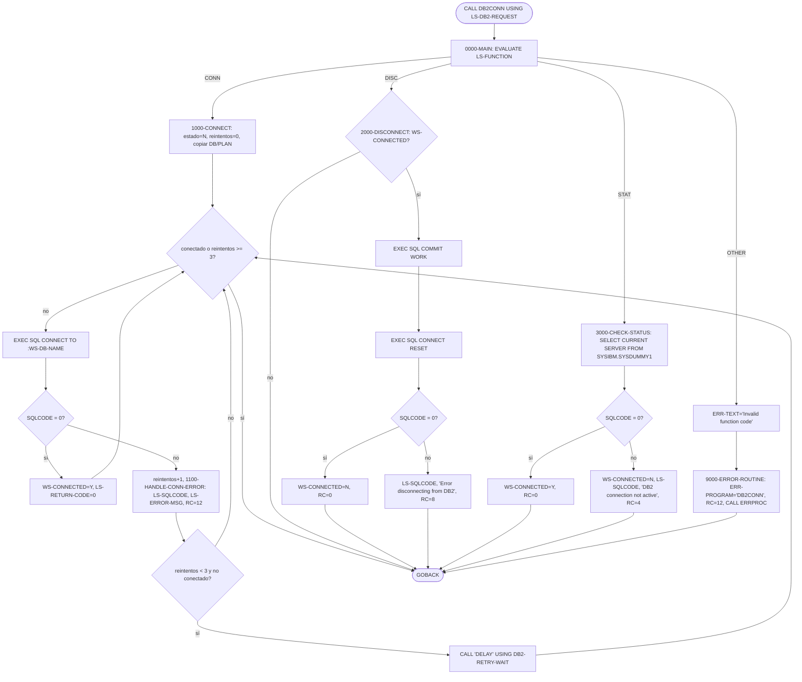
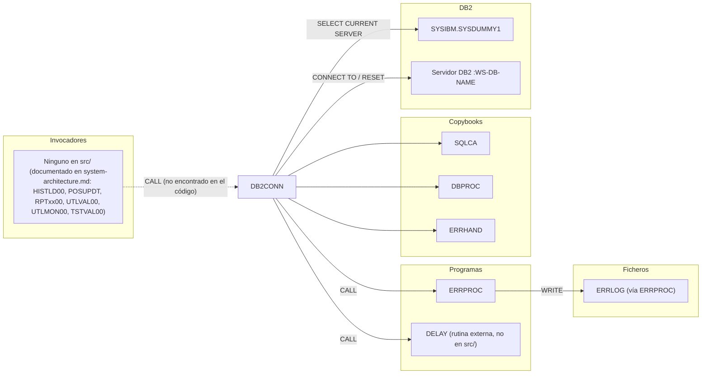

# DB2CONN — Gestor de conexión DB2 (conectar, desconectar y comprobar estado)

> Generado a partir del análisis del código fuente `src/programs/common/DB2CONN.cbl`. Ver el [grafo de dependencias global](../technical/dependency-graph.md).

## Ficha técnica
| Campo | Valor |
| --- | --- |
| Ruta | `src/programs/common/DB2CONN.cbl` |
| Categoría | common |
| Tipo | subrutina común (DB2, sin CICS) |
| Líneas | 154 |
| Punto de entrada | subrutina invocada por `CALL` (recibe `LS-DB2-REQUEST` en `LINKAGE SECTION`); ninguno conocido en el repositorio |
| Invocado por | Ningún programa de `src/` lo invoca (`CALL 'DB2CONN'` no aparece en ninguna parte). `system-architecture.md` lo declara como dependencia de HISTLD00, POSUPDT, RPTPOS00, RPTAUD00, RPTSTA00, UTLVAL00, UTLMON00 y TSTVAL00, pero el código no lo confirma (ver [Observaciones](#observaciones-y-problemas-detectados)). |
| Invoca a | `ERRPROC` (CALL estático, existe en `src/programs/common/ERRPROC.cbl`); `DELAY` (CALL estático, rutina externa no definida en el repositorio) |

## Propósito
DB2CONN centraliza la gestión de la conexión con el subsistema DB2 para los programas del sistema de carteras: establece la conexión con reintentos, la cierra de forma ordenada (con `COMMIT` previo) y permite comprobar si sigue activa. Está pensado como componente de la "capa de soporte DB2" descrita en `system-architecture.md`, junto a DB2CMT (commits), DB2ERR (errores SQL) y DB2STAT (estadísticas). Funciona como subrutina reutilizable: el programa llamador le pasa un área de petición con un código de función de 4 caracteres (`CONN`, `DISC`, `STAT`), el nombre del servidor DB2 y el plan, y recibe de vuelta un código de retorno, el `SQLCODE` y un mensaje de error.

## Funcionamiento

El programa no tiene inicialización ni terminación propias: cada `CALL` ejecuta un único despachador (`0000-MAIN`) que selecciona el párrafo según la función pedida y hace `GOBACK`. Al ser un subprograma sin la cláusula `INITIAL`, su `WORKING-STORAGE` (en particular el flag `WS-CONNECTION-STATE`) se conserva entre llamadas dentro de la misma unidad de ejecución, lo que le permite "recordar" si ya se conectó.

### `0000-MAIN`
1. `EVALUATE TRUE` sobre las condiciones de nivel 88 de `LS-FUNCTION`:
   - `FUNC-CONN` (`'CONN'`) → `PERFORM 1000-CONNECT`.
   - `FUNC-DISC` (`'DISC'`) → `PERFORM 2000-DISCONNECT`.
   - `FUNC-STAT` (`'STAT'`) → `PERFORM 3000-CHECK-STATUS`.
   - `WHEN OTHER` → mueve `'Invalid function code'` a `ERR-TEXT` y ejecuta `9000-ERROR-ROUTINE`.
2. `GOBACK` al llamador.

### `1000-CONNECT`
1. Fuerza el estado a desconectado (`SET WS-DISCONNECTED TO TRUE`) y pone `WS-RETRY-COUNT` a cero.
2. Copia `LS-DB-NAME` y `LS-PLAN-NAME` a las variables host `WS-DB-NAME` y `WS-PLAN-NAME` (declaradas dentro de `EXEC SQL BEGIN DECLARE SECTION`).
3. Bucle `PERFORM UNTIL WS-CONNECTED OR WS-RETRY-COUNT >= WS-MAX-RETRIES` (máximo 3 intentos):
   - `EXEC SQL CONNECT TO :WS-DB-NAME END-EXEC`.
   - Si `SQLCODE = 0`: `SET WS-CONNECTED TO TRUE` y `LS-RETURN-CODE = 0`.
   - Si no: incrementa `WS-RETRY-COUNT` y ejecuta `1100-HANDLE-CONN-ERROR`.
   - Si aún quedan reintentos y no se ha conectado: `CALL 'DELAY' USING DB2-RETRY-WAIT` (espera entre intentos; `DB2-RETRY-WAIT` vale 100 y procede del copybook DBPROC).
4. Al salir del bucle, si no se logró conectar, `LS-RETURN-CODE` queda en 12 (fijado por `1100-HANDLE-CONN-ERROR` en el último intento fallido) y `LS-SQLCODE`/`LS-ERROR-MSG` describen el último error.

### `1100-HANDLE-CONN-ERROR`
1. Copia `SQLCODE` a `LS-SQLCODE`.
2. `EVALUATE SQLCODE` para elegir el texto de `LS-ERROR-MSG`:
   - `-30081` → `'Maximum connections exceeded'`.
   - `-99999` → `'Network error connecting to DB2'`.
   - `OTHER` → `'General DB2 connection error'`.
3. `LS-RETURN-CODE = 12`.

No llama a `ERRPROC`: los errores de conexión solo se devuelven al llamador en `LS-ERROR-INFO`.

### `2000-DISCONNECT`
Solo actúa si `WS-CONNECTED` es verdadero (es decir, si en una llamada anterior de este mismo módulo se conectó o se comprobó el estado con éxito):
1. `EXEC SQL COMMIT WORK END-EXEC` (no se comprueba su `SQLCODE`).
2. `EXEC SQL CONNECT RESET END-EXEC`.
3. Si `SQLCODE = 0`: `SET WS-DISCONNECTED TO TRUE` y `LS-RETURN-CODE = 0`.
4. Si no: `LS-SQLCODE = SQLCODE`, `LS-ERROR-MSG = 'Error disconnecting from DB2'`, `LS-RETURN-CODE = 8`.

Si `WS-CONNECTED` es falso el párrafo no hace nada y **no modifica `LS-RETURN-CODE`** (el llamador recibe el valor que ya tuviera en su área).

### `3000-CHECK-STATUS`
1. `EXEC SQL SELECT CURRENT SERVER INTO :WS-DB-NAME FROM SYSIBM.SYSDUMMY1 END-EXEC` — consulta trivial que solo puede tener éxito si existe una conexión activa.
2. Si `SQLCODE = 0`: `SET WS-CONNECTED TO TRUE`, `LS-RETURN-CODE = 0`. El nombre del servidor recuperado queda en `WS-DB-NAME` pero **no se devuelve** al llamador (`LS-DB-NAME` no se actualiza).
3. Si no: `SET WS-DISCONNECTED TO TRUE`, `LS-SQLCODE = SQLCODE`, `LS-ERROR-MSG = 'DB2 connection not active'`, `LS-RETURN-CODE = 4`.

### `9000-ERROR-ROUTINE`
Solo se alcanza con un código de función inválido:
1. `ERR-PROGRAM = 'DB2CONN'`.
2. `LS-RETURN-CODE = 12`.
3. `CALL 'ERRPROC' USING ERR-MESSAGE` (estructura del copybook ERRHAND; solo se han rellenado `ERR-PROGRAM` y `ERR-TEXT`).

### Diagrama de flujo

## Interfaz

- **Parámetros / LINKAGE SECTION / COMMAREA**: el programa recibe por `CALL ... USING` una única estructura `LS-DB2-REQUEST` (definida directamente en el programa; no existe copybook que la comparta con los llamadores):

  | Campo | PIC | Dirección | Descripción |
  | --- | --- | --- | --- |
  | `LS-FUNCTION` | `X(4)` | entrada | Código de función: `'CONN'` (`FUNC-CONN`), `'DISC'` (`FUNC-DISC`), `'STAT'` (`FUNC-STAT`). |
  | `LS-DB-NAME` | `X(8)` | entrada | Nombre del servidor/ubicación DB2 al que conectar (`CONNECT TO`). Solo se usa en `CONN`. |
  | `LS-PLAN-NAME` | `X(8)` | entrada | Nombre del plan. Se copia a `WS-PLAN-NAME` pero **nunca se utiliza** en ninguna sentencia. |
  | `LS-RETURN-CODE` | `S9(4) COMP` | salida | 0, 4, 8 o 12 (ver más abajo). |
  | `LS-ERROR-INFO.LS-SQLCODE` | `S9(9) COMP` | salida | Último `SQLCODE` de error. Solo se rellena en caso de fallo. |
  | `LS-ERROR-INFO.LS-ERROR-MSG` | `X(80)` | salida | Texto descriptivo del error. Solo se rellena en caso de fallo. |

  No hay COMMAREA ni contexto CICS.

- **Ficheros (DDNAME, organización, modo de apertura, clave)**: el programa no declara `FILE-CONTROL` ni abre ficheros.

  | DDNAME | Organización | Modo | Clave |
  | --- | --- | --- | --- |
  | — | No aplica | — | — |

  (Indirectamente, `ERRPROC` escribe en el fichero secuencial `ERRLOG` cuando se invoca desde `9000-ERROR-ROUTINE`.)

- **Tablas DB2 y sentencias SQL**:

  | Párrafo | Sentencia | Objeto | Observación |
  | --- | --- | --- | --- |
  | `1000-CONNECT` | `CONNECT TO :WS-DB-NAME` | servidor DB2 (variable host) | Hasta 3 intentos. |
  | `2000-DISCONNECT` | `COMMIT WORK` | — | `SQLCODE` no comprobado. |
  | `2000-DISCONNECT` | `CONNECT RESET` | — | Cierra la conexión actual. |
  | `3000-CHECK-STATUS` | `SELECT CURRENT SERVER INTO :WS-DB-NAME FROM SYSIBM.SYSDUMMY1` | `SYSIBM.SYSDUMMY1` (tabla de catálogo DB2, no requiere DDL en el repositorio) | Se usa como "ping" de conexión. |

  El programa no accede a ninguna tabla de aplicación (POSHIST, ERRLOG, etc.).

- **Mapas BMS / comandos CICS**: No aplica (no contiene `EXEC CICS`).

- **Códigos de retorno / RETURN-CODE**: el programa no toca el registro especial `RETURN-CODE`; devuelve el resultado en `LS-RETURN-CODE`:

  | Valor | Cuándo | Equivalente ERRHAND |
  | --- | --- | --- |
  | 0 | `CONN`, `DISC` o `STAT` completados con `SQLCODE = 0`. | `ERR-SUCCESS` |
  | 4 | `STAT`: el `SELECT CURRENT SERVER` falla → no hay conexión activa. | `ERR-WARNING` |
  | 8 | `DISC`: `CONNECT RESET` devuelve `SQLCODE ≠ 0`. | `ERR-ERROR` |
  | 12 | `CONN`: agotados los 3 intentos sin conectar; o código de función inválido. | `ERR-SEVERE` |
  | (sin cambio) | `DISC` cuando `WS-CONNECTED` es falso: el campo no se modifica. | — |

## Estructuras de datos clave

### Copybooks
| Copybook | Ruta | Qué aporta a DB2CONN |
| --- | --- | --- |
| `SQLCA` | `src/copybook/db2/SQLCA.cpy` | Hace `EXEC SQL INCLUDE SQLCA` (proporciona `SQLCODE`, `SQLSTATE`, etc.) y define `SQL-STATUS-CODES` con constantes `SQLSTATE` (`SQL-SUCCESS`, `SQL-CONNECTION-ERROR` = `'08001'`, ...). DB2CONN usa `SQLCODE` pero **no** usa ninguna de las constantes `SQL-*`. |
| `DBPROC` | `src/copybook/db2/DBPROC.cpy` | Define `DB2-ERROR-HANDLING` con `DB2-RETRY-COUNT`, `DB2-MAX-RETRIES` (3) y `DB2-RETRY-WAIT` (100). DB2CONN solo utiliza `DB2-RETRY-WAIT` (como argumento de `DELAY`). El copybook contiene además párrafos de `PROCEDURE DIVISION` (`CONNECT-TO-DB2`, `DISCONNECT-FROM-DB2`, `DB2-ERROR-ROUTINE`, `CHECK-SQL-STATUS`) que DB2CONN no ejecuta. |
| `ERRHAND` | `src/copybook/common/ERRHAND.cpy` | Define `ERR-MESSAGE` (bloque de error estándar: `ERR-TIMESTAMP`, `ERR-PROGRAM`, `ERR-CATEGORY`, `ERR-CODE`, `ERR-SEVERITY`, `ERR-TEXT`, `ERR-DETAILS`) y las constantes `ERR-RETURN-CODES`. DB2CONN rellena solo `ERR-PROGRAM` y `ERR-TEXT` antes de llamar a `ERRPROC`. |

### WORKING-STORAGE
| Campo | PIC / VALUE | Uso |
| --- | --- | --- |
| `WS-DB-NAME` | `X(8)` (variable host) | Servidor destino de `CONNECT TO`; también recibe `CURRENT SERVER` en `STAT`. |
| `WS-PLAN-NAME` | `X(8)` (variable host) | Recibe `LS-PLAN-NAME`; no se usa después. |
| `WS-CONNECTION-STATE` | `X(1)`, sin `VALUE` | Flag de estado con 88 `WS-CONNECTED` (`'Y'`) / `WS-DISCONNECTED` (`'N'`). Persiste entre llamadas. Al no tener `VALUE`, su contenido antes del primer `CONN`/`STAT` no está definido por el código. |
| `WS-RETRY-COUNT` | `S9(4) COMP VALUE 0` | Contador de intentos de conexión. |
| `WS-MAX-RETRIES` | `S9(4) COMP VALUE 3` | Umbral de reintentos (duplica `DB2-MAX-RETRIES` de DBPROC). |
| `DB2-RETRY-WAIT` (DBPROC) | `S9(4) COMP VALUE 100` | Espera entre reintentos pasada a `DELAY`; la unidad (ms, centésimas, segundos) no está documentada. |

## Reglas de negocio y validaciones
El programa es puramente técnico; no implementa reglas de negocio de carteras. Las reglas que codifica son:

1. **Códigos de función admitidos**: exactamente `'CONN'`, `'DISC'` y `'STAT'`; cualquier otro valor se trata como error severo (RC 12) y se notifica a `ERRPROC`.
2. **Reintentos de conexión**: máximo 3 intentos (`WS-MAX-RETRIES`); entre intentos fallidos se espera `DB2-RETRY-WAIT` (100) mediante `DELAY`. Tras el último fallo no se espera.
3. **Clasificación de errores de conexión**: `SQLCODE -30081` → "Maximum connections exceeded"; `-99999` → "Network error connecting to DB2"; resto → "General DB2 connection error". En todos los casos RC 12.
4. **Desconexión ordenada**: antes de `CONNECT RESET` siempre se hace `COMMIT WORK` (nunca `ROLLBACK`), y solo si el módulo cree estar conectado.
5. **Comprobación de estado**: una conexión se considera activa si `SELECT CURRENT SERVER FROM SYSIBM.SYSDUMMY1` devuelve `SQLCODE 0`; el resultado actualiza el flag interno `WS-CONNECTION-STATE`.
6. **Jerarquía de severidad**: 0 éxito, 4 aviso (sin conexión en `STAT`), 8 error (fallo de desconexión), 12 severo (fallo de conexión o función inválida), coherente con `ERR-RETURN-CODES` de ERRHAND.

## Manejo de errores y recuperación
- **FILE STATUS**: no aplica (sin ficheros).
- **SQLCODE**: se comprueba tras `CONNECT TO`, `CONNECT RESET` y `SELECT CURRENT SERVER`, comparando siempre con 0 (los `SQLCODE` positivos/avisos se tratan como error). **No se comprueba** tras `COMMIT WORK`. El `SQLSTATE` no se consulta, a pesar de que SQLCA.cpy ofrece constantes para ello.
- **Reintentos**: solo para la conexión (3 intentos con espera vía `DELAY`). No hay reintentos en desconexión ni en comprobación de estado.
- **Notificación al llamador**: los errores SQL se devuelven en `LS-RETURN-CODE`, `LS-SQLCODE` y `LS-ERROR-MSG`; el llamador decide qué hacer. No se llama a `DB2ERR` ni se ejecuta `DB2-ERROR-ROUTINE` de DBPROC.
- **ERRPROC**: solo se invoca para un código de función inválido, mediante `CALL 'ERRPROC' USING ERR-MESSAGE`. ERRPROC escribe el bloque en `ERRLOG` (`OPEN EXTEND`) y lo muestra con `DISPLAY`. Ver en Observaciones el desajuste entre `ERR-MESSAGE` y la `LINKAGE SECTION` de ERRPROC.
- **Rollback / checkpoints / restart**: no hay `ROLLBACK`, checkpoints ni lógica de restart. La recuperación transaccional queda fuera de este módulo (DB2CMT / CKPRST).
- **Condiciones CICS**: no aplica.

## Dependencias

## Observaciones y problemas detectados

1. **`COPY DBPROC` dentro de `WORKING-STORAGE SECTION` incluye párrafos de procedimiento.** `DBPROC.cpy` contiene, además de datos, los párrafos `CONNECT-TO-DB2`, `DISCONNECT-FROM-DB2`, `DB2-ERROR-ROUTINE` y `CHECK-SQL-STATUS` con sentencias `EXEC SQL`, `IF`, `PERFORM` y `CALL`. Expandidos en la `DATA DIVISION`, esto no compila en Enterprise COBOL. El mismo problema afecta a DB2CMT, DB2ERR, DB2STAT e HISTLD00, que copian DBPROC en el mismo punto.
2. **Ningún programa invoca a DB2CONN.** `system-architecture.md` (§5.1 y diagramas §1/§2) lo presenta como dependencia de HISTLD00, POSUPDT, RPTPOS00, RPTAUD00, RPTSTA00, UTLVAL00, UTLMON00 y TSTVAL00, y como orquestador de DB2CMT/DB2ERR/DB2STAT. En el código no existe ningún `CALL 'DB2CONN'`, DB2CONN no llama a DB2CMT/DB2ERR/DB2STAT, y HISTLD00 se conecta directamente con `PERFORM CONNECT-TO-DB2` (párrafo de DBPROC, `CONNECT TO POSMVP` fijo). Manda el código: DB2CONN es hoy un módulo huérfano.
3. **`CALL 'DELAY'` referencia una rutina que no existe en el repositorio.** No hay fuente para `DELAY` en `src/` y no es un servicio estándar de Language Environment (los habituales serían `CEE3DLY` o `ILBOWAT0`); probablemente se espera un módulo externo. Además `DB2-RETRY-WAIT = 100` no indica unidad de tiempo.
4. **Desajuste entre `ERR-MESSAGE` (ERRHAND) y la `LINKAGE SECTION` de ERRPROC.** DB2CONN pasa `ERR-MESSAGE` (empieza por `ERR-TIMESTAMP`, 18 bytes; 370 bytes en total), pero ERRPROC mapea el parámetro como `LS-ERROR-REQUEST` (empieza por `LS-PROGRAM-ID`, sin timestamp; 354 bytes, con un `LS-RETURN-CODE` final). ERRPROC leerá los 8 primeros bytes del timestamp como nombre de programa, y `ERR-PROGRAM` (`'DB2CONN'`) caerá en `LS-CATEGORY`/`LS-ERROR-CODE`. El log de errores quedará desplazado. Es un defecto compartido por todos los llamadores de ERRPROC que pasan `ERR-MESSAGE`.
5. **`9000-ERROR-ROUTINE` rellena el bloque de error de forma incompleta.** Solo asigna `ERR-PROGRAM` y `ERR-TEXT`; `ERR-CATEGORY`, `ERR-CODE`, `ERR-SEVERITY` y `ERR-DETAILS` se envían con el contenido residual de `WORKING-STORAGE`. Además, en ese caso `LS-SQLCODE` y `LS-ERROR-MSG` no se informan al llamador, aunque `LS-RETURN-CODE` sí vale 12.
6. **`2000-DISCONNECT` no fija `LS-RETURN-CODE` cuando no hay conexión.** Si se pide `DISC` sin haber hecho antes `CONN`/`STAT` con éxito en esta misma carga del módulo, el párrafo no ejecuta nada y el código de retorno queda con el valor previo del área del llamador (indeterminado desde el punto de vista de DB2CONN).
7. **`WS-CONNECTION-STATE` no tiene `VALUE` inicial.** Antes del primer `CONN`/`STAT` ninguno de los 88 (`'Y'`/`'N'`) está garantizado; el comportamiento de `DISC` como primera llamada depende de la inicialización del compilador/enlazador.
8. **`COMMIT WORK` sin comprobar `SQLCODE`.** En `2000-DISCONNECT` el resultado del `COMMIT` se descarta; solo se evalúa el `SQLCODE` de `CONNECT RESET`. Un commit fallido pasaría inadvertido y se reportaría RC 0.
9. **`LS-PLAN-NAME` / `WS-PLAN-NAME` es código muerto.** Se copia pero no se usa en ninguna sentencia (en DB2 for z/OS el plan se selecciona por el attach facility, no con `CONNECT`). La interfaz sugiere una capacidad que no existe.
10. **Duplicidad de contadores de reintento.** El programa define `WS-RETRY-COUNT`/`WS-MAX-RETRIES` y a la vez copia `DB2-RETRY-COUNT`/`DB2-MAX-RETRIES` de DBPROC (ambos con máximo 3); usa los propios para contar y el del copybook solo para la espera. Dos fuentes de verdad para el mismo umbral.
11. **`SQLCODE -99999` probablemente no es un código DB2 for z/OS.** `-30081` sí es el error de comunicación DRDA; `-99999` no aparece en los mensajes de DB2 for z/OS (es habitual en el driver CLI/ODBC). La rama "Network error" probablemente no se alcanza nunca en z/OS. Es una inferencia a partir del código; el repositorio no documenta la procedencia de este código.
12. **`3000-CHECK-STATUS` no devuelve el servidor detectado.** `CURRENT SERVER` se guarda en `WS-DB-NAME` y sobrescribe el nombre pedido en la última conexión, pero no se copia a `LS-DB-NAME`; el llamador no puede saber a qué servidor está conectado.
13. **Nombre de servidor vs. nombre de base de datos.** El DDL (`POSHIST.sql`) define `POSMVP` como `DATABASE` DB2 (objeto lógico de almacenamiento), mientras que `CONNECT TO` espera un nombre de ubicación/servidor DRDA. DBPROC y DB2ONLN hacen `CONNECT TO POSMVP`, lo que sugiere que en el proyecto se usa el mismo identificador para ambas cosas; DB2CONN lo recibe por parámetro, así que hereda la ambigüedad.
14. **`LS-DB2-REQUEST` no está en ningún copybook.** El área de interfaz se define solo dentro de DB2CONN; el copybook online `DB2REQ.cpy` (`DB2-REQUEST-AREA`, función de 1 carácter `C`/`D`/`S`) tiene un diseño distinto e incompatible. Un llamador futuro debería replicar la estructura a mano.
15. **Aviso menor sobre `SQLCODE` positivos.** Todas las comparaciones son `SQLCODE = 0`; un `CONNECT` con aviso (`SQLCODE > 0`) se trataría como fallo y consumiría un reintento.

## Referencias
- Programa: [DB2CONN.cbl](../../src/programs/common/DB2CONN.cbl)
- Copybooks: [SQLCA.cpy](../../src/copybook/db2/SQLCA.cpy), [DBPROC.cpy](../../src/copybook/db2/DBPROC.cpy), [ERRHAND.cpy](../../src/copybook/common/ERRHAND.cpy)
- Programas relacionados: [ERRPROC.cbl](../../src/programs/common/ERRPROC.cbl) (invocado), [DB2CMT.cbl](../../src/programs/common/DB2CMT.cbl), [DB2ERR.cbl](../../src/programs/common/DB2ERR.cbl), [DB2STAT.cbl](../../src/programs/common/DB2STAT.cbl) (capa de soporte DB2), [HISTLD00.cbl](../../src/programs/batch/HISTLD00.cbl) (llamador según la arquitectura, no según el código), [DB2ONLN.cbl](../../src/programs/online/DB2ONLN.cbl) (equivalente online)
- Copybook de interfaz online comparable: [DB2REQ.cpy](../../src/copybook/online/DB2REQ.cpy)
- DDL: [POSHIST.sql](../../src/database/db2/POSHIST.sql) (define la base de datos `POSMVP`), [ERRLOG.sql](../../src/database/db2/ERRLOG.sql), [PORTPLAN.sql](../../src/database/db2/PORTPLAN.sql) (plan `PORTPLAN`)
- Documentación: [system-architecture.md](../technical/system-architecture.md), [data-dictionary.md](../technical/data-dictionary.md), [dependency-graph.md](../technical/dependency-graph.md), [dependency-graph.json](../technical/dependency-graph.json)
