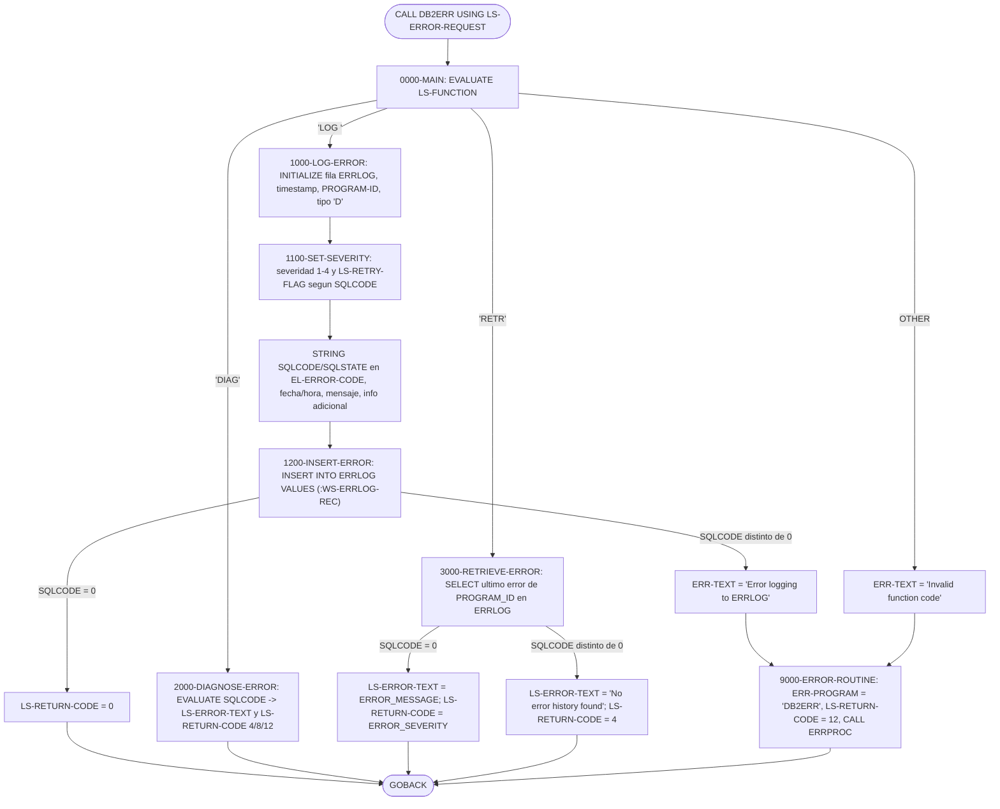
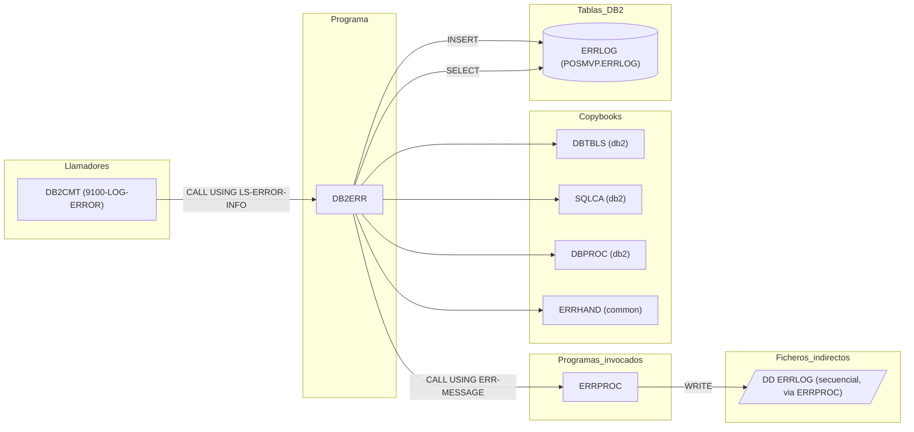

# DB2ERR — Manejador de errores SQL de DB2 (registro, diagnóstico y consulta en ERRLOG)

> Generado a partir del análisis del código fuente `src/programs/common/DB2ERR.cbl`. Ver el [grafo de dependencias global](../technical/dependency-graph.md).

## Ficha técnica
| Campo | Valor |
| --- | --- |
| Ruta | `src/programs/common/DB2ERR.cbl` |
| Categoría | common |
| Tipo | subrutina común (batch, sin comandos CICS) |
| Líneas | 200 |
| Punto de entrada | subrutina invocada por `CALL 'DB2ERR' USING ...` (no tiene JCL ni transacción CICS propia) |
| Invocado por | `DB2CMT` (párrafo `9100-LOG-ERROR`) |
| Invoca a | `ERRPROC` (`CALL 'ERRPROC' USING ERR-MESSAGE`) |

## Propósito
`DB2ERR` es la subrutina común de la capa de soporte DB2 encargada de tratar los errores SQL que se producen en los programas que acceden a DB2. Ofrece tres servicios seleccionables mediante un código de función: **registrar** el error en la tabla DB2 `ERRLOG` clasificándolo por severidad y decidiendo si la operación es reintentable (`LOG `), **diagnosticar** un `SQLCODE` devolviendo un texto explicativo y un código de retorno estándar (`DIAG`), y **recuperar** el último error registrado para un programa dado (`RETR`). Encaja en el flujo batch como pieza auxiliar del "DB2 Support Layer" descrito en `system-architecture.md`, junto con `DB2CONN`, `DB2CMT` y `DB2STAT`; en el código actual su único llamador es `DB2CMT`.

## Funcionamiento

El programa no tiene fase de inicialización ni bucle de proceso: es un despachador de una sola pasada que ejecuta un párrafo según el código de función recibido en la LINKAGE SECTION y devuelve el control con `GOBACK`.

### `0000-MAIN`
- `EVALUATE TRUE` sobre las condiciones de nivel 88 de `LS-FUNCTION`:
  - `FUNC-LOG` (`'LOG '`) → `PERFORM 1000-LOG-ERROR`.
  - `FUNC-DIAG` (`'DIAG'`) → `PERFORM 2000-DIAGNOSE-ERROR`.
  - `FUNC-RETR` (`'RETR'`) → `PERFORM 3000-RETRIEVE-ERROR`.
  - `WHEN OTHER` → mueve `'Invalid function code'` a `ERR-TEXT` y ejecuta `9000-ERROR-ROUTINE`.
- `GOBACK`.

### `1000-LOG-ERROR` (función `LOG `)
1. `INITIALIZE WS-ERRLOG-REC` (fila de trabajo de la tabla `ERRLOG`).
2. `ACCEPT WS-CURRENT-TIMESTAMP FROM TIME STAMP` y lo mueve a `EL-ERROR-TIMESTAMP`.
3. Rellena `EL-PROGRAM-ID` con `LS-PROGRAM-ID` y fija `EL-ERROR-TYPE = 'D'` (tipo *Data* según los niveles 88 de `DBTBLS`; todo error DB2 se clasifica como error de datos).
4. `PERFORM 1100-SET-SEVERITY` para calcular `EL-ERROR-SEVERITY` y el flag de reintento.
5. Edita el `SQLCODE` con `WS-FORMATTED-SQLCODE` (`PIC -Z(8)9`) y construye con `STRING` el texto `'SQLCODE: ' + código + ' STATE: ' + LS-SQLSTATE` en `EL-ERROR-CODE`.
6. Copia `LS-ERROR-TEXT` a `EL-ERROR-MESSAGE`, deriva `EL-PROCESS-DATE` y `EL-PROCESS-TIME` de `FUNCTION CURRENT-DATE` (subcadenas `(1:10)` y `(12:8)`), pone `EL-USER-ID` a espacios y copia `LS-ADDITIONAL-INFO` a `EL-ADDITIONAL-INFO`.
7. `PERFORM 1200-INSERT-ERROR`.

### `1100-SET-SEVERITY`
`EVALUATE LS-SQLCODE` contra las constantes de `WS-ERROR-CATEGORIES`:

| `SQLCODE` | Constante | `EL-ERROR-SEVERITY` | `LS-RETRY-FLAG` |
| --- | --- | --- | --- |
| -911 | `WS-DEADLOCK` | 2 (Warning) | `'Y'` (`LS-SHOULD-RETRY`) |
| -913 | `WS-TIMEOUT` | 2 (Warning) | `'Y'` |
| -30081 | `WS-CONNECTION-ERROR` | 4 (Severe) | `'N'` |
| -803 | `WS-DUP-KEY` | 1 (Info) | `'N'` |
| +100 | `WS-NOT-FOUND` | 1 (Info) | `'N'` |
| otro < 0 | — | 3 (Error) | `'N'` |
| otro ≥ 0 | — | 1 (Info) | `'N'` |

### `1200-INSERT-ERROR`
- `EXEC SQL INSERT INTO ERRLOG VALUES (:WS-ERRLOG-REC) END-EXEC` (inserción por estructura *host* completa, sin lista de columnas).
- Si `SQLCODE = 0` → `LS-RETURN-CODE = 0`. En caso contrario mueve `'Error logging to ERRLOG'` a `ERR-TEXT` y ejecuta `9000-ERROR-ROUTINE`. No se hace `COMMIT` ni `ROLLBACK`: la fila queda dentro de la unidad de trabajo del llamador.

### `2000-DIAGNOSE-ERROR` (función `DIAG`)
No accede a DB2. Traduce `LS-SQLCODE` a un texto en `LS-ERROR-TEXT` y a un código en `LS-RETURN-CODE`:

| `SQLCODE` | `LS-ERROR-TEXT` | `LS-RETURN-CODE` |
| --- | --- | --- |
| -911 | `Deadlock detected - retry transaction` | 4 |
| -913 | `Timeout occurred - retry transaction` | 4 |
| -30081 | `DB2 connection error - check availability` | 12 |
| -803 | `Duplicate key violation` | 8 |
| otro < 0 | `Unhandled DB2 error` | 12 |
| otro ≥ 0 (incluido +100) | `DB2 warning condition` | 4 |

### `3000-RETRIEVE-ERROR` (función `RETR`)
- `SELECT ERROR_MESSAGE, ERROR_SEVERITY, ADDITIONAL_INFO INTO :EL-ERROR-MESSAGE, :EL-ERROR-SEVERITY, :EL-ADDITIONAL-INFO FROM ERRLOG WHERE PROGRAM_ID = :LS-PROGRAM-ID AND ERROR_TIMESTAMP = (SELECT MAX(ERROR_TIMESTAMP) FROM ERRLOG WHERE PROGRAM_ID = :LS-PROGRAM-ID)`, es decir, la última fila registrada para el programa indicado.
- Si `SQLCODE = 0` → devuelve `EL-ERROR-MESSAGE` en `LS-ERROR-TEXT` y la severidad (1–4) en `LS-RETURN-CODE`.
- Si `SQLCODE ≠ 0` (tanto +100 como cualquier error negativo) → `LS-ERROR-TEXT = 'No error history found'` y `LS-RETURN-CODE = 4`.

### `9000-ERROR-ROUTINE`
- `MOVE 'DB2ERR' TO ERR-PROGRAM`, `MOVE 12 TO LS-RETURN-CODE` y `CALL 'ERRPROC' USING ERR-MESSAGE`. `ERR-TEXT` ya lo ha rellenado el párrafo llamante; el resto de campos de `ERR-MESSAGE` (`ERR-TIMESTAMP`, `ERR-CATEGORY`, `ERR-CODE`, `ERR-SEVERITY`, `ERR-DETAILS`) no se informan.

## Interfaz

- **Parámetros / LINKAGE SECTION / COMMAREA**: recibe por `PROCEDURE DIVISION USING` una única estructura `LS-ERROR-REQUEST` (204 bytes):

| Campo | PIC | Desplazamiento | Sentido | Descripción |
| --- | --- | --- | --- | --- |
| `LS-FUNCTION` | `X(4)` | 0 | Entrada | Código de función: `'LOG '`, `'DIAG'` o `'RETR'` (niveles 88 `FUNC-LOG`, `FUNC-DIAG`, `FUNC-RETR`) |
| `LS-PROGRAM-ID` | `X(8)` | 4 | Entrada | Programa que sufrió el error; se graba en `PROGRAM_ID` y se usa como filtro en `RETR` |
| `LS-ERROR-INFO.LS-SQLCODE` | `S9(9) COMP` | 12 | Entrada | `SQLCODE` a registrar/diagnosticar |
| `LS-ERROR-INFO.LS-SQLSTATE` | `X(5)` | 16 | Entrada | `SQLSTATE`, sólo se usa en el texto de `EL-ERROR-CODE` |
| `LS-ERROR-INFO.LS-ERROR-TEXT` | `X(80)` | 21 | Entrada/Salida | En `LOG ` es el mensaje a grabar; en `DIAG` y `RETR` se sobreescribe con el texto devuelto |
| `LS-ADDITIONAL-INFO` | `X(100)` | 101 | Entrada | Se copia a `ADDITIONAL_INFO` |
| `LS-RETURN-CODE` | `S9(4) COMP` | 201 | Salida | Ver "Códigos de retorno" |
| `LS-RETRY-FLAG` | `X(1)` | 203 | Salida | `'Y'` (`LS-SHOULD-RETRY`) / `'N'` (`LS-NO-RETRY`); sólo se informa en la función `LOG ` |

- **Ficheros (DDNAME, organización, modo de apertura, clave)**: No aplica. El programa no tiene `FILE-CONTROL`; el DDNAME `ERRLOG` que aparece en `ERRPROC` es un fichero secuencial distinto de la tabla DB2 del mismo nombre.

- **Tablas DB2 y sentencias SQL**:

| Tabla | Sentencia | Párrafo | Acceso | Observaciones |
| --- | --- | --- | --- | --- |
| `ERRLOG` | `INSERT INTO ERRLOG VALUES (:WS-ERRLOG-REC)` | `1200-INSERT-ERROR` | WRITE | Inserción por estructura host completa (10 columnas). Sin `COMMIT` |
| `ERRLOG` | `SELECT ERROR_MESSAGE, ERROR_SEVERITY, ADDITIONAL_INFO INTO ... WHERE PROGRAM_ID = :LS-PROGRAM-ID AND ERROR_TIMESTAMP = (SELECT MAX(ERROR_TIMESTAMP) ...)` | `3000-RETRIEVE-ERROR` | READ | Singleton `SELECT INTO` con subconsulta; sin indicador de nulos para `ADDITIONAL_INFO` |

  DDL de la tabla: [`ERRLOG.sql`](../../src/database/db2/ERRLOG.sql) (tablespace `POSMVP.ERRLOG`, clave primaria `(ERROR_TIMESTAMP, PROGRAM_ID)`, índice secundario `ERRLOG_IX1 (PROCESS_DATE, ERROR_SEVERITY DESC)`, `GRANT SELECT, INSERT ... TO POSAPP`). No hay DCLGEN; la estructura host proviene del copybook `DBTBLS`. El plan/paquete al que se vincula no se indica en el repositorio (`PORTPLAN.sql` define un `BIND PLAN` genérico con `PKLIST(*.PORTPKG.*)`).

- **Mapas BMS / comandos CICS**: No aplica.

- **Códigos de retorno / RETURN-CODE**: el programa no usa el registro especial `RETURN-CODE`; devuelve el resultado en `LS-RETURN-CODE`:

| Función | Valor | Cuándo |
| --- | --- | --- |
| `LOG ` | 0 | `INSERT` en `ERRLOG` correcto |
| `LOG ` | 12 | Fallo del `INSERT` (además se llama a `ERRPROC`) |
| `DIAG` | 4 | Deadlock (-911), timeout (-913) o cualquier `SQLCODE ≥ 0` |
| `DIAG` | 8 | Clave duplicada (-803) |
| `DIAG` | 12 | Error de conexión (-30081) o cualquier otro `SQLCODE < 0` |
| `RETR` | 1–4 | Se encontró historial: se devuelve la `ERROR_SEVERITY` de la última fila |
| `RETR` | 4 | No se encontró historial o falló el `SELECT` |
| cualquiera | 12 | Código de función inválido (además se llama a `ERRPROC`) |

  Los valores 0/4/8/12 coinciden con `ERR-SUCCESS`/`ERR-WARNING`/`ERR-ERROR`/`ERR-SEVERE` de `ERRHAND`, aunque el programa usa literales y no esas constantes. En `RETR` el valor devuelto es una severidad (1–4) y no un código de retorno estándar, lo que mezcla dos escalas en el mismo campo.

## Estructuras de datos clave

### Copybooks
| Copybook | Ruta | Qué aporta a `DB2ERR` |
| --- | --- | --- |
| `DBTBLS` | `src/copybook/db2/DBTBLS.cpy` | Estructuras host de las tablas `POSHIST` y `ERRLOG`. Se copia dentro del `DECLARE SECTION` con `REPLACING ==POSHIST-RECORD== BY ==WS-POSHIST-REC==` y `==ERRLOG-RECORD== BY ==WS-ERRLOG-REC==`. Sólo se usa `WS-ERRLOG-REC` y sus campos `EL-*`; `WS-POSHIST-REC` queda sin uso |
| `SQLCA` | `src/copybook/db2/SQLCA.cpy` | `EXEC SQL INCLUDE SQLCA` (campos `SQLCODE`, `SQLSTATE`) y constantes `SQL-*` de `SQLSTATE` (`'40001'`, `'40003'`, `'23505'`...). El programa lee `SQLCODE` tras cada sentencia; no usa las constantes `SQL-*` |
| `DBPROC` | `src/copybook/db2/DBPROC.cpy` | Área `DB2-ERROR-HANDLING` (mensaje formateado, `DB2-RETRY-COUNT`, `DB2-MAX-RETRIES = 3`, `DB2-RETRY-WAIT = 100`) y párrafos `CONNECT-TO-DB2`, `DISCONNECT-FROM-DB2`, `DB2-ERROR-ROUTINE`, `CHECK-SQL-STATUS`. **Ninguno de ellos se referencia en `DB2ERR`** |
| `ERRHAND` | `src/copybook/common/ERRHAND.cpy` | Estructura `ERR-MESSAGE` (con `ERR-PROGRAM` y `ERR-TEXT`) que se pasa a `ERRPROC`, y constantes `ERR-RETURN-CODES`, `ERR-CATEGORIES`, `ERR-VSAM-*` (no usadas) |

### WORKING-STORAGE propio
| Campo | PIC | Uso |
| --- | --- | --- |
| `WS-ERRLOG-REC` (grupo `01` + campos `EL-*` de `DBTBLS`) | ver DBTBLS | Fila host de `ERRLOG`: `EL-ERROR-TIMESTAMP X(26)`, `EL-PROGRAM-ID X(8)`, `EL-ERROR-TYPE X(1)` (88: `'S'`/`'A'`/`'D'`), `EL-ERROR-SEVERITY S9(4) COMP` (88: 1 Info, 2 Warn, 3 Error, 4 Severe), `EL-ERROR-CODE X(8)`, `EL-ERROR-MESSAGE X(200)`, `EL-PROCESS-DATE X(10)`, `EL-PROCESS-TIME X(8)`, `EL-USER-ID X(8)`, `EL-ADDITIONAL-INFO X(500)` |
| `WS-CURRENT-TIMESTAMP` | `X(26)` | Receptor del `ACCEPT ... FROM TIME STAMP` |
| `WS-FORMATTED-SQLCODE` | `-Z(8)9` (10 caracteres) | Edición numérica del `SQLCODE` para el texto de `EL-ERROR-CODE` |
| `WS-ERROR-CATEGORIES` | grupo | Constantes de clasificación: `WS-DEADLOCK = -911`, `WS-TIMEOUT = -913`, `WS-CONNECTION-ERROR = -30081`, `WS-DUP-KEY = -803`, `WS-NOT-FOUND = +100` |

No hay contadores, umbrales de commit ni flags de fin de fichero: el programa es sin estado entre llamadas (salvo el contenido residual de WORKING-STORAGE, que se reinicializa en `LOG ` con `INITIALIZE`).

## Reglas de negocio y validaciones
1. **Despacho por código de función**: sólo se aceptan `'LOG '`, `'DIAG'` y `'RETR'`; cualquier otro valor se considera error severo (RC 12) y se notifica a `ERRPROC`.
2. **Clasificación de `SQLCODE` en severidad** (`1100-SET-SEVERITY`): deadlock/timeout → 2 (Warning) y **reintentable**; error de conexión -30081 → 4 (Severe); clave duplicada -803 y no encontrado +100 → 1 (Info); resto de negativos → 3 (Error); resto de no negativos → 1 (Info). Sólo -911 y -913 activan `LS-SHOULD-RETRY`.
3. **Todo error registrado es de tipo `'D'` (Data)**: `EL-ERROR-TYPE` se fija siempre a `'D'`, sin usar `'S'` (System) ni `'A'` (Application), aunque el DDL y `DBTBLS` los contemplan.
4. **Formato del código de error**: se pretende grabar `SQLCODE: <código> STATE: <sqlstate>` en `ERROR_CODE` (ver observaciones sobre el truncamiento).
5. **`USER_ID` siempre en blanco**: no se recibe ni deduce el usuario; se graba `SPACES`.
6. **Mapeo de diagnóstico a códigos de retorno estándar** (`2000-DIAGNOSE-ERROR`): condiciones transitorias (deadlock, timeout, warnings) → 4; clave duplicada → 8; conexión y errores no contemplados → 12. El texto indica explícitamente "retry transaction" para -911/-913, pero la decisión de reintentar queda en manos del llamador.
7. **Recuperación del último error por programa** (`3000-RETRIEVE-ERROR`): se selecciona la fila con `MAX(ERROR_TIMESTAMP)` para el `PROGRAM_ID`; la unicidad está garantizada por la clave primaria `(ERROR_TIMESTAMP, PROGRAM_ID)`.
8. **Sin gestión transaccional propia**: `DB2ERR` no ejecuta `COMMIT` ni `ROLLBACK`; la persistencia de la fila de `ERRLOG` depende de que el llamador confirme la unidad de trabajo.

## Manejo de errores y recuperación
- **FILE STATUS**: no aplica (sin ficheros).
- **SQLCODE**: tras el `INSERT` y el `SELECT` se comprueba únicamente `SQLCODE = 0`. En el `INSERT`, cualquier otro valor (incluidos warnings positivos) se trata como fallo: `ERR-TEXT = 'Error logging to ERRLOG'`, `LS-RETURN-CODE = 12` y `CALL 'ERRPROC'`. En el `SELECT`, cualquier valor distinto de 0 (tanto +100 "no hay filas" como errores reales -9xx) se convierte en `'No error history found'` con RC 4, por lo que un fallo de acceso a la tabla queda enmascarado como "sin historial".
- **Condiciones CICS**: no aplica.
- **Checkpoint/restart y rollback**: no implementados en este programa. A diferencia del párrafo `DB2-ERROR-ROUTINE` del copybook `DBPROC` (que sí hace `ROLLBACK WORK`), `DB2ERR` nunca ejecuta `ROLLBACK`; tampoco reintenta (los campos `DB2-RETRY-COUNT`/`DB2-MAX-RETRIES` de `DBPROC` no se usan). El programa se limita a **señalar** la conveniencia de reintento mediante `LS-RETRY-FLAG` y los textos de diagnóstico.
- **Escalado a `ERRPROC`**: `9000-ERROR-ROUTINE` rellena `ERR-PROGRAM = 'DB2ERR'` y pasa `ERR-MESSAGE` (copybook `ERRHAND`) a `ERRPROC`, que escribe el mensaje en el fichero secuencial `ERRLOG` (DDNAME) y lo muestra por `DISPLAY`. No se informan `ERR-TIMESTAMP`, `ERR-CATEGORY` (p. ej. `ERR-CAT-SYSTEM`), `ERR-CODE`, `ERR-SEVERITY` ni `ERR-DETAILS`, y el retorno de `ERRPROC` no se comprueba.
- **Relación con `ERRHNDL`/`DB2RECV`**: `DB2ERR` no interviene en la capa online; el registro de errores CICS en `ERRLOG` lo hace `ERRHNDL` con una estructura de fila distinta (ver observaciones).

## Dependencias

## Observaciones y problemas detectados

### Problemas de compilación / precompilación (bloqueantes)
1. **`01 WS-ERRLOG-REC.` vacío y nombre duplicado** (líneas 18-21). El `COPY DBTBLS REPLACING ...` genera a su vez dos niveles `01` (`WS-POSHIST-REC` y `WS-ERRLOG-REC`), por lo que el `01 WS-ERRLOG-REC.` declarado justo antes del `COPY` queda sin subordinados ni `PIC` y, además, el nombre `WS-ERRLOG-REC` aparece definido dos veces. Ambas situaciones son errores de compilación en Enterprise COBOL, y la referencia `:WS-ERRLOG-REC` del `INSERT` sería ambigua para el precompilador DB2. `HISTLD00` usa `COPY DBTBLS` sin ese `01` previo, lo que sugiere que la línea 18 es un resto de una versión anterior.
2. **`COPY DBPROC` en WORKING-STORAGE incluye párrafos de PROCEDURE DIVISION** (`CONNECT-TO-DB2`, `DISCONNECT-FROM-DB2`, `DB2-ERROR-ROUTINE`, `CHECK-SQL-STATUS`). Es un problema del copybook compartido con `DB2CMT`, `DB2CONN`, `DB2STAT` y `HISTLD00`, pero impide compilar `DB2ERR` tal cual. Además `DB2-ERROR-ROUTINE` referencia `ERR-PROGRAM`/`ERR-TEXT`, definidos en `ERRHAND`, que se copia *después*.
3. **`ACCEPT WS-CURRENT-TIMESTAMP FROM TIME STAMP`** (línea 75) no es una forma válida de `ACCEPT` en Enterprise COBOL (sólo `DATE`, `DAY`, `DAY-OF-WEEK`, `TIME` o un nombre mnemotécnico definido en `SPECIAL-NAMES`, que aquí no existe). El mismo constructo aparece en `ERRPROC`. Aunque compilase como `ACCEPT ... FROM TIME`, devolvería `hhmmsscc` (8 caracteres), que no es un `TIMESTAMP` DB2 válido para la columna `ERROR_TIMESTAMP` (`SQLCODE -180`).

### Errores lógicos en tiempo de ejecución
4. **Interfaz incompatible con el único llamador (`DB2CMT`)**. `DB2CMT` ejecuta `CALL 'DB2ERR' USING LS-ERROR-INFO`, una estructura de 84 bytes (`LS-SQLCODE S9(9) COMP` + `LS-ERROR-MSG X(80)`), mientras que `DB2ERR` espera `LS-ERROR-REQUEST` (204 bytes) cuyo primer campo es `LS-FUNCTION X(4)`. Consecuencias: (a) los 4 bytes binarios del `SQLCODE` se interpretan como código de función, nunca coinciden con `'LOG '`/`'DIAG'`/`'RETR'` y se cae siempre en `'Invalid function code'`; (b) `9000-ERROR-ROUTINE` escribe `LS-RETURN-CODE` en el desplazamiento 201, fuera del área de 84 bytes del llamador, lo que corrompe la WORKING-STORAGE de `DB2CMT`. En la práctica, el registro de errores en la tabla `ERRLOG` que `DB2CMT` pretende hacer nunca se produce.
5. **`EL-ERROR-CODE` truncado a `'SQLCODE:'`**. El `STRING` de las líneas 84-87 genera 32 caracteres (`'SQLCODE: '` 9 + `WS-FORMATTED-SQLCODE` 10 + `' STATE: '` 8 + `LS-SQLSTATE` 5) sobre un campo `PIC X(8)`; sin `ON OVERFLOW`, sólo se almacenan los 8 primeros caracteres, siempre `'SQLCODE:'`. La columna `ERROR_CODE` nunca contiene el `SQLCODE` ni el `SQLSTATE` reales. Por contraste, `DBPROC` define `DB2-ERROR-MESSAGE` (107 bytes) con esa misma plantilla, pero no se usa.
6. **`EL-PROCESS-DATE` y `EL-PROCESS-TIME` mal derivados de `FUNCTION CURRENT-DATE`** (líneas 90-93). `CURRENT-DATE` devuelve `AAAAMMDDhhmmsscc±hhmm`; `(1:10)` produce `AAAAMMDDhh` (no es un `DATE` ISO `AAAA-MM-DD`) y `(12:8)` produce `mss cc ± hh` (no es un `TIME`). El `INSERT` en las columnas `PROCESS_DATE DATE` y `PROCESS_TIME TIME` fallaría con `SQLCODE -180/-181`, con lo que `1000-LOG-ERROR` terminaría siempre en `9000-ERROR-ROUTINE`.
7. **`SELECT INTO` sin indicador de nulos** en `3000-RETRIEVE-ERROR`: `ADDITIONAL_INFO` es `VARCHAR(500)` **nullable** en `ERRLOG.sql`, pero se recupera en `:EL-ADDITIONAL-INFO` sin variable indicadora; si la última fila tiene `ADDITIONAL_INFO` nulo se obtiene `SQLCODE -305` y la función devuelve erróneamente `'No error history found'`.
8. **Enmascaramiento de errores en `RETR`**: cualquier `SQLCODE ≠ 0` (p. ej. -911, -904, -305) se reporta como "sin historial" con RC 4; no se distingue `+100` de errores reales ni se escala a `ERRPROC`.
9. **`LS-RETRY-FLAG` sólo se informa en `LOG `**: `2000-DIAGNOSE-ERROR` produce textos "retry transaction" pero no activa `LS-SHOULD-RETRY`, y en `RETR` el flag queda con el valor que trajera el llamador.
10. **`ERR-MESSAGE` incompleto al llamar a `ERRPROC`**: sólo se rellenan `ERR-PROGRAM` y `ERR-TEXT`; `ERR-CATEGORY`, `ERR-CODE`, `ERR-SEVERITY`, `ERR-DETAILS` y `ERR-TIMESTAMP` se envían con contenido no inicializado. Además, la LINKAGE de `ERRPROC` (`LS-ERROR-REQUEST`, que empieza por `LS-PROGRAM-ID X(8)`) no coincide con el layout de `ERR-MESSAGE` (que empieza por `ERR-TIMESTAMP X(18)`), por lo que `ERRPROC` interpretaría los campos desplazados 18 bytes. Este desajuste afecta a todos los programas que hacen `CALL 'ERRPROC' USING ERR-MESSAGE`, no sólo a `DB2ERR`.
11. **Inconsistencia +100 entre `LOG ` y `DIAG`**: `1100-SET-SEVERITY` trata `WS-NOT-FOUND` explícitamente, mientras que `2000-DIAGNOSE-ERROR` lo deja caer en `WHEN OTHER` ("DB2 warning condition"). No es un error funcional, pero el resultado no es simétrico.
12. **Comprobación estricta `SQLCODE = 0` en el `INSERT`**: un `SQLCODE` positivo (warning) se trata como fallo severo (RC 12) aunque la fila se haya insertado.
13. **La fila de `ERRLOG` puede perderse**: al no haber `COMMIT`, si el llamador hace `ROLLBACK` después de registrar el error (comportamiento habitual tras un error DB2), el registro se deshace junto con la unidad de trabajo. Es una inferencia sobre el diseño, no un fallo de sintaxis.

### Código no utilizado
14. `WS-POSHIST-REC` (generado por el `REPLACING`), todos los párrafos y campos de `DBPROC` (`DB2-RETRY-COUNT`, `DB2-MAX-RETRIES`, `DB2-RETRY-WAIT`, `DB2-ERROR-MESSAGE`...), las constantes `SQL-*` de `SQLCA.cpy` y `ERR-RETURN-CODES`/`ERR-CATEGORIES`/`ERR-VSAM-*` de `ERRHAND` no se referencian en el programa.

### Discrepancias con la documentación técnica
15. **`system-architecture.md` (§6.1.1, §6.1.2 y §6.3)** atribuye a `DB2ERR` "Connection error recovery", "Deadlock resolution", "Transaction rollback management" y como método de recuperación "Rollback". El código sólo clasifica el `SQLCODE`, registra en `ERRLOG` y devuelve un flag de reintento; **no hace `ROLLBACK`, no reconecta ni reintenta**. Manda el código.
16. **`system-architecture.md` (§1.2, "DB2 Support Layer")** dibuja `DB2CONN --> DB2ERR`. En el código, `DB2CONN` no llama a `DB2ERR` (llama directamente a `ERRPROC`); el único llamador es `DB2CMT`.
17. **`data-dictionary.md` (§3.2)** describe una tabla `ERRLOG` con columnas `ERROR_CODE CHAR(4)`, `ACCOUNT_NO`, `FUND_ID`, `TRANS_ID`, `ERROR_DESC VARCHAR(100)` que no coincide ni con `src/database/db2/ERRLOG.sql` (10 columnas: `ERROR_TIMESTAMP`, `PROGRAM_ID`, `ERROR_TYPE`, `ERROR_SEVERITY`, `ERROR_CODE CHAR(8)`, `ERROR_MESSAGE`, `PROCESS_DATE`, `PROCESS_TIME`, `USER_ID`, `ADDITIONAL_INFO`) ni con `DBTBLS.cpy`. El programa sigue el DDL de `ERRLOG.sql`.
18. **Tres layouts distintos para la misma tabla `ERRLOG`**: `DB2ERR`/`DBTBLS` (10 columnas), `ERRHNDL.cbl` (8 host variables: `LOG-TIMESTAMP`, `LOG-PROGRAM`, `LOG-PARAGRAPH`, `LOG-SQLCODE`, `LOG-CICS-RESP`, `LOG-SEVERITY`, `LOG-MESSAGE`, `LOG-TRACE-ID`) y `data-dictionary.md` (7 columnas). Sólo el de `DB2ERR` es compatible con el DDL del repositorio; el `INSERT` de `ERRHNDL` fallaría contra esa tabla.
19. El nombre `ERRLOG` se usa a la vez para la **tabla DB2** (`DB2ERR`, `ERRHNDL`) y para el **DDNAME del fichero secuencial** de `ERRPROC`/`RPTAUD00` (`PROD.ERROR.LOG`), lo que puede inducir a confusión en el grafo de dependencias.

## Referencias
- Programa: [DB2ERR.cbl](../../src/programs/common/DB2ERR.cbl)
- Llamador: [DB2CMT.cbl](../../src/programs/common/DB2CMT.cbl)
- Programa invocado: [ERRPROC.cbl](../../src/programs/common/ERRPROC.cbl)
- Copybooks: [DBTBLS.cpy](../../src/copybook/db2/DBTBLS.cpy), [SQLCA.cpy](../../src/copybook/db2/SQLCA.cpy), [DBPROC.cpy](../../src/copybook/db2/DBPROC.cpy), [ERRHAND.cpy](../../src/copybook/common/ERRHAND.cpy)
- DDL: [ERRLOG.sql](../../src/database/db2/ERRLOG.sql), [PORTPLAN.sql](../../src/database/db2/PORTPLAN.sql)
- Programas relacionados (otros usuarios de `ERRLOG`): [ERRHNDL.cbl](../../src/programs/online/ERRHNDL.cbl), [HISTLD00.cbl](../../src/programs/batch/HISTLD00.cbl), [DB2CONN.cbl](../../src/programs/common/DB2CONN.cbl)
- Documentación técnica: [system-architecture.md](../technical/system-architecture.md), [data-dictionary.md](../technical/data-dictionary.md), [dependency-graph.md](../technical/dependency-graph.md), [dependency-graph.json](../technical/dependency-graph.json)
