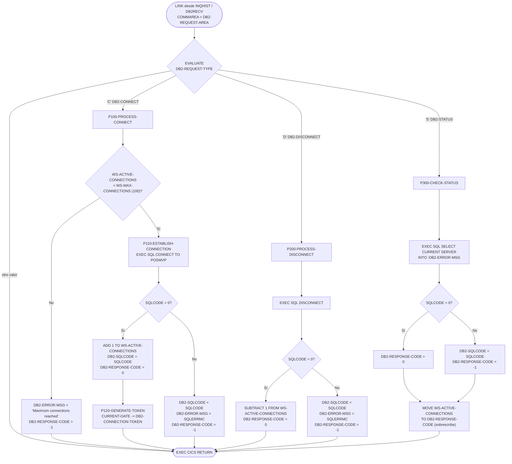
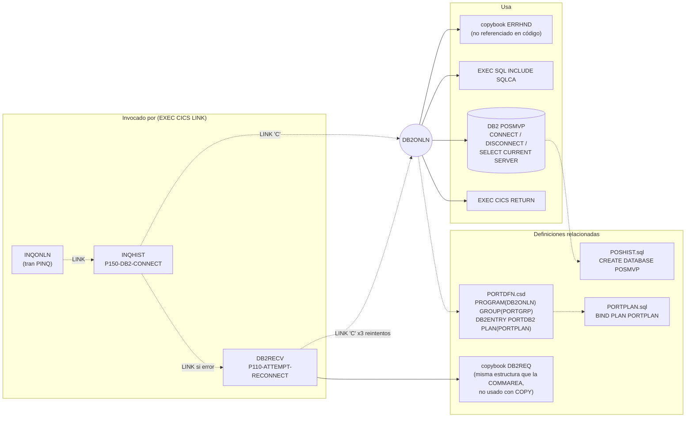

# DB2ONLN — Gestor de conexiones DB2 para la capa online CICS

> Generado a partir del análisis del código fuente `src/programs/online/DB2ONLN.cbl`. Ver el [grafo de dependencias global](../technical/dependency-graph.md).

## Ficha técnica
| Campo | Valor |
| --- | --- |
| Ruta | `src/programs/online/DB2ONLN.cbl` |
| Categoría | online |
| Tipo | CICS online (subprograma invocado por `EXEC CICS LINK`) |
| Líneas | 120 |
| Punto de entrada | Subrutina invocada por `LINK` con COMMAREA. No tiene transacción CICS propia; está definido como `PROGRAM(DB2ONLN)` en el grupo `PORTGRP` de `src/cics/PORTDFN.csd` y se ejecuta bajo la transacción `PINQ` (INQONLN → INQHIST → DB2ONLN) |
| Invocado por | `INQHIST` (párrafo `P150-DB2-CONNECT`) y `DB2RECV` (párrafo `P110-ATTEMPT-RECONNECT`), ambos vía `EXEC CICS LINK PROGRAM('DB2ONLN') COMMAREA(...)` |
| Invoca a | Ningún programa (ni `CALL` ni `LINK`). Ejecuta sentencias SQL embebidas (`CONNECT`, `DISCONNECT`, `SELECT CURRENT SERVER`) y el comando `EXEC CICS RETURN` |

## Propósito
DB2ONLN es el "controlador DB2 online" del sistema de gestión de carteras: centraliza, para los programas CICS de consulta (INQHIST y el recuperador DB2RECV), las operaciones de **conectar**, **desconectar** y **consultar el estado** de la conexión con la base de datos DB2 `POSMVP`, devolviendo al invocador un código de respuesta, el `SQLCODE`, un mensaje de error y un *token* de conexión. Según su cabecera y `system-architecture.md` debería gestionar un *pool* de conexiones y optimizar su reutilización; en el código actual el "pool" se reduce a un contador en WORKING-STORAGE (`WS-ACTIVE-CONNECTIONS`) limitado por `WS-MAX-CONNECTIONS` = 100, sin ninguna persistencia entre invocaciones (ver *Observaciones*).

Encaja en la capa online (CICS) como servicio de acceso a datos: INQONLN (transacción `PINQ`) enlaza con INQHIST, que antes de abrir el cursor de histórico (`CURSMGR`) pide a DB2ONLN una conexión; si falla, INQHIST delega en DB2RECV, que reintenta hasta 3 veces volviendo a enlazar con DB2ONLN.

## Funcionamiento
El programa no tiene párrafo de inicialización ni bucle: es un despachador de una sola petición por invocación.

1. **`PROCEDURE DIVISION USING DB2-REQUEST-AREA`** (líneas 39-52). Evalúa el campo `DB2-REQUEST-TYPE` de la COMMAREA recibida con un `EVALUATE TRUE`:
   - `DB2-CONNECT` (`'C'`) → `PERFORM P100-PROCESS-CONNECT THRU P100-EXIT`
   - `DB2-DISCONNECT` (`'D'`) → `PERFORM P200-PROCESS-DISCONNECT THRU P200-EXIT`
   - `DB2-STATUS` (`'S'`) → `PERFORM P300-CHECK-STATUS THRU P300-EXIT`
   - No existe `WHEN OTHER`: cualquier otro valor no hace nada y la COMMAREA se devuelve sin modificar.
   
   Tras el `EVALUATE` ejecuta `EXEC CICS RETURN END-EXEC`, que devuelve el control al programa que hizo el `LINK`.

2. **`P100-PROCESS-CONNECT`** (54-64). Comprueba el límite del "pool": si `WS-ACTIVE-CONNECTIONS < WS-MAX-CONNECTIONS` (100) ejecuta `P110-ESTABLISH-CONNECTION`; en caso contrario devuelve `DB2-RESPONSE-CODE = -1` y `DB2-ERROR-MSG = 'Maximum connections reached'` (sin informar `DB2-SQLCODE`).

3. **`P110-ESTABLISH-CONNECTION`** (66-81). Ejecuta `EXEC SQL CONNECT TO POSMVP END-EXEC`.
   - Si `SQLCODE = 0`: incrementa `WS-ACTIVE-CONNECTIONS`, copia `SQLCODE` a `DB2-SQLCODE`, pone `DB2-RESPONSE-CODE = 0` y genera el token (`P120-GENERATE-TOKEN`).
   - Si no: copia `SQLCODE` a `DB2-SQLCODE`, `SQLERRMC` a `DB2-ERROR-MSG` y pone `DB2-RESPONSE-CODE = -1`.

4. **`P120-GENERATE-TOKEN`** (83-89). Mueve `FUNCTION CURRENT-DATE` (21 caracteres) a `DB2-CONNECTION-TOKEN` (`PIC X(16)`, por lo que se trunca a `AAAAMMDDHHMMSScc`) y después intenta concatenar con `STRING` el propio token con `WS-ACTIVE-CONNECTIONS` de nuevo sobre `DB2-CONNECTION-TOKEN`. El resultado pretendido es un identificador "fecha-hora + nº de conexión"; en la práctica el token es la marca de tiempo truncada (ver *Observaciones*).

5. **`P200-PROCESS-DISCONNECT`** (91-103). Ejecuta `EXEC SQL DISCONNECT END-EXEC`. Si `SQLCODE = 0` decrementa `WS-ACTIVE-CONNECTIONS` y devuelve `DB2-RESPONSE-CODE = 0`; si no, informa `DB2-SQLCODE`, `DB2-ERROR-MSG` (= `SQLERRMC`) y `DB2-RESPONSE-CODE = -1`.

6. **`P300-CHECK-STATUS`** (105-120). Ejecuta `EXEC SQL SELECT CURRENT SERVER INTO :DB2-ERROR-MSG END-EXEC` (el nombre del servidor DB2 actual se deposita en el campo de mensaje de error). Si `SQLCODE = 0` pone `DB2-RESPONSE-CODE = 0`; si no, informa `DB2-SQLCODE` y `DB2-RESPONSE-CODE = -1`. **Inmediatamente después, y de forma incondicional**, sobrescribe `DB2-RESPONSE-CODE` con `WS-ACTIVE-CONNECTIONS`, por lo que el invocador recibe el número de conexiones activas como "respuesta" y pierde el indicador de error.

## Interfaz
- **Parámetros / LINKAGE SECTION / COMMAREA**: el programa declara en LINKAGE SECTION la estructura `DB2-REQUEST-AREA` (idéntica campo a campo al copybook `DB2REQ.cpy`, pero codificada en línea, no con `COPY`) y la recibe mediante `PROCEDURE DIVISION USING DB2-REQUEST-AREA`. Los invocadores la pasan como COMMAREA de `EXEC CICS LINK` (INQHIST desde `WS-DB2-REQUEST`, DB2RECV desde `WS-DB2-REQUEST` = `COPY DB2REQ`). Longitud total: 1 + 4 + 16 + 4 + 80 = 105 bytes.

  | Campo | PIC | Dirección | Descripción |
  | --- | --- | --- | --- |
  | `DB2-REQUEST-TYPE` | `X` | Entrada | `'C'` conectar (`DB2-CONNECT`), `'D'` desconectar (`DB2-DISCONNECT`), `'S'` estado (`DB2-STATUS`) |
  | `DB2-RESPONSE-CODE` | `S9(8) COMP` | Salida | `0` éxito, `-1` error. En `'S'` acaba conteniendo `WS-ACTIVE-CONNECTIONS` |
  | `DB2-CONNECTION-TOKEN` | `X(16)` | Salida | Token generado en `P120-GENERATE-TOKEN` tras un `CONNECT` correcto (marca de tiempo truncada) |
  | `DB2-ERROR-INFO.DB2-SQLCODE` | `S9(9) COMP` | Salida | `SQLCODE` de la última sentencia SQL (no se informa en el caso "máximo de conexiones" ni en `DISCONNECT`/`STATUS` correctos) |
  | `DB2-ERROR-INFO.DB2-ERROR-MSG` | `X(80)` | Salida | `SQLERRMC` en errores de `CONNECT`/`DISCONNECT`; texto fijo `'Maximum connections reached'`; en `'S'` el valor de `CURRENT SERVER` |

- **Ficheros (DDNAME, organización, modo de apertura, clave)**: No aplica. No hay `FILE-CONTROL`, `SELECT` ni ficheros CICS.

- **Tablas DB2 y sentencias SQL**: no accede a ninguna tabla de usuario; sólo sentencias de conexión/estado.

  | Párrafo | Sentencia | Objeto | Observación |
  | --- | --- | --- | --- |
  | `P110-ESTABLISH-CONNECTION` | `EXEC SQL CONNECT TO POSMVP END-EXEC` | `POSMVP` | `POSMVP` es el nombre de la *base de datos* creada en `src/database/db2/POSHIST.sql`, no una *location* DRDA; el mismo `CONNECT TO POSMVP` aparece en `src/copybook/db2/DBPROC.cpy` (batch) |
  | `P200-PROCESS-DISCONNECT` | `EXEC SQL DISCONNECT END-EXEC` | — | Sin operando (`CURRENT`/`ALL`/location) |
  | `P300-CHECK-STATUS` | `EXEC SQL SELECT CURRENT SERVER INTO :DB2-ERROR-MSG END-EXEC` | registro especial `CURRENT SERVER` | Sin cláusula `FROM` |
  | (WORKING-STORAGE) | `EXEC SQL INCLUDE SQLCA END-EXEC` | SQLCA | Dentro del nivel `01 WS-DB2-AREA` |

  El plan DB2 asociado a la transacción `PINQ` es `PORTPLAN` (`DEFINE DB2ENTRY(PORTDB2) PLAN(PORTPLAN)` y `DEFINE DB2TRAN(PINQ) ENTRY(PORTDB2)` en `PORTDFN.csd`; `BIND PLAN PORTPLAN PKLIST(*.PORTPKG.*)` en `src/database/db2/PORTPLAN.sql`). No existe en `src/` la definición del *package* `PORTPKG` ni un `DBRM`/bind específico para DB2ONLN.

- **Mapas BMS / comandos CICS**: no usa mapas BMS. Único comando CICS: `EXEC CICS RETURN END-EXEC` (sin `TRANSID`, sin `COMMAREA`), es decir, retorno al programa que hizo el `LINK`. No usa `RESP`, `HANDLE CONDITION`, `HANDLE ABEND`, `SYNCPOINT` ni `DELAY`.

- **Códigos de retorno / RETURN-CODE**: no utiliza el registro especial `RETURN-CODE`. El resultado se comunica por la COMMAREA:

  | Situación | `DB2-RESPONSE-CODE` | `DB2-SQLCODE` | `DB2-ERROR-MSG` | `DB2-CONNECTION-TOKEN` |
  | --- | --- | --- | --- | --- |
  | `'C'` con `CONNECT` correcto | `0` | `0` | sin cambios | marca de tiempo |
  | `'C'` con `CONNECT` erróneo | `-1` | `SQLCODE` | `SQLERRMC` | sin cambios |
  | `'C'` con pool lleno (>= 100) | `-1` | sin cambios | `'Maximum connections reached'` | sin cambios |
  | `'D'` correcto | `0` | sin cambios | sin cambios | sin cambios |
  | `'D'` erróneo | `-1` | `SQLCODE` | `SQLERRMC` | sin cambios |
  | `'S'` (cualquier resultado) | `WS-ACTIVE-CONNECTIONS` (sobrescribe el 0/-1) | `SQLCODE` sólo si error | `CURRENT SERVER` si éxito | sin cambios |
  | Tipo desconocido | sin cambios | sin cambios | sin cambios | sin cambios |

  Los invocadores comprueban únicamente `DB2-RESPONSE-CODE = 0` (DB2RECV `P110-ATTEMPT-RECONNECT`) o `NOT = 0` (INQHIST `P150-DB2-CONNECT`) y, en caso de error, propagan `DB2-SQLCODE` a `RECV-SQLCODE`.

## Estructuras de datos clave
**Copybooks**

| Copybook | Ruta | Aporta | Uso real en DB2ONLN |
| --- | --- | --- | --- |
| `ERRHND` | `src/copybook/online/ERRHND.cpy` | Estructura estándar de error online `ERROR-HANDLING` (`ERR-PROGRAM`, `ERR-PARAGRAPH`, `ERR-SQLCODE`, `ERR-CICS-RESP/RESP2`, `ERR-SEVERITY` con 88 `ERR-FATAL/WARNING/INFO`, `ERR-MESSAGE`, `ERR-ACTION` con 88 `ERR-RETURN/CONTINUE/ABEND`, `ERR-TRACE`) — es la COMMAREA que espera `ERRHNDL` | Se copia bajo `01 WS-ERROR-AREA` pero **ningún campo se referencia** en la PROCEDURE DIVISION |
| `SQLCA` (vía `EXEC SQL INCLUDE`) | generado por el precompilador DB2 (existe además `src/copybook/db2/SQLCA.cpy`, no usado aquí) | `SQLCODE`, `SQLERRMC`, etc. | `SQLCODE` y `SQLERRMC` se leen tras cada sentencia SQL |
| `DB2REQ` | `src/copybook/online/DB2REQ.cpy` | Define `DB2-REQUEST-AREA` | **No se usa** `COPY DB2REQ`; la estructura está duplicada literalmente en LINKAGE SECTION |

**WORKING-STORAGE**

| Campo | PIC / VALUE | Función |
| --- | --- | --- |
| `WS-DB2-AREA` | grupo 01 que contiene el `INCLUDE SQLCA` | Área de comunicación SQL |
| `WS-POOL-STATS.WS-TOTAL-CONNECTIONS` | `S9(8) COMP VALUE 0` | Declarado, **nunca referenciado** |
| `WS-POOL-STATS.WS-ACTIVE-CONNECTIONS` | `S9(8) COMP VALUE 0` | Contador de conexiones "activas": +1 en `CONNECT` OK, -1 en `DISCONNECT` OK; se devuelve como respuesta en `'S'` y se usa en el token |
| `WS-POOL-STATS.WS-AVAILABLE-CONNECTIONS` | `S9(8) COMP VALUE 0` | Declarado, **nunca referenciado** |
| `WS-POOL-STATS.WS-MAX-CONNECTIONS` | `S9(8) COMP VALUE 100` | Umbral máximo del "pool" comprobado en `P100-PROCESS-CONNECT` |
| `WS-ERROR-AREA` | grupo 01 + `COPY ERRHND` | No se usa |

Al ser un programa CICS, cada `LINK` obtiene una copia nueva de WORKING-STORAGE con sus `VALUE` iniciales; por tanto `WS-ACTIVE-CONNECTIONS` vale siempre 0 al entrar y, como máximo, 1 al salir. No hay `EXEC CICS` de memoria compartida (`GETMAIN SHARED`, TS/TD queues, CWA) que permita que el contador sobreviva entre invocaciones.

## Reglas de negocio y validaciones
DB2ONLN no implementa reglas de negocio de cartera; sus reglas son puramente técnicas:

1. **Despacho por tipo de petición**: sólo se reconocen `'C'`, `'D'` y `'S'`; cualquier otro valor se ignora silenciosamente (no hay `WHEN OTHER`, ni mensaje, ni código de error).
2. **Límite de conexiones**: una petición `'C'` sólo intenta el `CONNECT` si `WS-ACTIVE-CONNECTIONS < 100`; de lo contrario se rechaza con `-1` y `'Maximum connections reached'`. Dado el comportamiento de WORKING-STORAGE en CICS descrito arriba, esta rama es en la práctica inalcanzable.
3. **Contabilidad del pool**: `+1` tras `CONNECT` con `SQLCODE = 0`; `-1` tras `DISCONNECT` con `SQLCODE = 0`. No hay protección contra valores negativos.
4. **Generación de token**: el token es `FUNCTION CURRENT-DATE` truncado a 16 caracteres (`AAAAMMDDHHMMSScc`); la intención (según el `STRING`) es sufijarlo con el nº de conexión activa, cosa que no ocurre (ver *Observaciones*). El token no se valida ni se almacena en ninguna parte; INQHIST lo mueve a `WS-DB2-TOKEN` y nada más lo usa.
5. **Éxito = `SQLCODE = 0` estricto**: los `SQLCODE` positivos (avisos, p. ej. +100) se tratan como error en las tres operaciones.
6. **Estado**: la operación `'S'` devuelve el nombre del servidor DB2 actual en `DB2-ERROR-MSG` y el nº de conexiones activas en `DB2-RESPONSE-CODE`.

## Manejo de errores y recuperación
- **FILE STATUS**: No aplica (sin ficheros).
- **SQLCODE**: se comprueba explícitamente tras cada `EXEC SQL` (`IF SQLCODE = 0 ... ELSE ...`). En la rama de error se copian `SQLCODE` → `DB2-SQLCODE` y `SQLERRMC` → `DB2-ERROR-MSG` (en `'S'` sólo el `SQLCODE`) y se devuelve `-1`. No hay `EXEC SQL WHENEVER`, ni consulta de `SQLSTATE`, ni distinción de códigos concretos (-904, -911, -913, -30081, etc.).
- **Condiciones CICS**: ninguna. No se usa `RESP`/`RESP2`, `HANDLE CONDITION` ni `HANDLE ABEND`; el único comando (`RETURN`) no puede fallar de forma relevante.
- **Checkpoint / restart, COMMIT / ROLLBACK**: no existen. A pesar de que `system-architecture.md` atribuye a DB2ONLN el "control del ámbito de transacción", el programa no ejecuta `SYNCPOINT`, `COMMIT` ni `ROLLBACK`; el `ROLLBACK` online lo realiza `DB2RECV` (`P200-RECOVER-TRANSACTION`).
- **Llamadas a ERRPROC / ERRHNDL / DB2ERR**: ninguna. `ERRHND` se incluye pero no se rellena ni se enlaza con `ERRHNDL`. Los errores se devuelven pasivamente al invocador en la COMMAREA.
- **Recuperación externa (flujo real)**: es INQHIST quien, al recibir `DB2-RESPONSE-CODE NOT = 0`, enlaza con `DB2RECV` (`RECV-REQUEST-TYPE = 'C'`, `RECV-PROGRAM = 'INQHIST'`, `RECV-SQLCODE = DB2-SQLCODE`). DB2RECV (`P100-RECOVER-CONNECTION`) reintenta hasta `WS-MAX-RETRIES` = 3 veces el `LINK` a DB2ONLN con `'C'`, esperando `EXEC CICS DELAY INTERVAL(2)` entre intentos; si tiene éxito, INQHIST vuelve a ejecutar `P150-DB2-CONNECT` (una conexión más). Si agota los reintentos, INQHIST copia `RECV-MESSAGE` a `INQCOM-ERROR-MSG` y ejecuta `P999-ERROR-ROUTINE`.

## Dependencias

## Observaciones y problemas detectados
Todas las observaciones se basan en el código de `DB2ONLN.cbl` y de sus invocadores; las que dependen del comportamiento del traductor CICS, del precompilador DB2 o del compilador Enterprise COBOL se marcan como probables, pues el repositorio no incluye listados de compilación.

1. **`P300-CHECK-STATUS` pierde el indicador de error (bug lógico).** Tras fijar `DB2-RESPONSE-CODE` a 0 o -1 según `SQLCODE`, el párrafo ejecuta incondicionalmente `MOVE WS-ACTIVE-CONNECTIONS TO DB2-RESPONSE-CODE`, sobrescribiendo el resultado. Un invocador que compruebe `= 0` no puede distinguir "éxito sin conexiones" de "error". Ningún programa del repositorio usa hoy la petición `'S'`, por lo que el defecto está latente.
2. **El "pool de conexiones" no existe realmente.** `WS-ACTIVE-CONNECTIONS`, `WS-MAX-CONNECTIONS`, `WS-TOTAL-CONNECTIONS` y `WS-AVAILABLE-CONNECTIONS` viven en WORKING-STORAGE, que CICS inicializa en cada invocación. El contador vale 0 al entrar, la comprobación `< 100` siempre se cumple y la rama `'Maximum connections reached'` es inalcanzable. `WS-TOTAL-CONNECTIONS` y `WS-AVAILABLE-CONNECTIONS` nunca se referencian. La funcionalidad descrita en la cabecera ("Manages DB2 connection pool", "Optimizes connection reuse", "Monitors connection status") no está implementada.
3. **`P120-GENERATE-TOKEN` es defectuoso.** (a) `FUNCTION CURRENT-DATE` devuelve 21 caracteres y `DB2-CONNECTION-TOKEN` es `X(16)`: se trunca. (b) El `STRING` usa `DB2-CONNECTION-TOKEN` a la vez como emisor y receptor (solapamiento, resultado indefinido en COBOL) y, como el receptor ya está lleno con 16 caracteres, nunca se añade nada. (c) `WS-ACTIVE-CONNECTIONS` es `COMP` (binario); probablemente el compilador rechace su uso como operando emisor de `STRING`, que exige elementos de uso DISPLAY. El token resultante no es único ni contiene el nº de conexión.
4. **Recepción de la COMMAREA probablemente incorrecta.** El programa usa `PROCEDURE DIVISION USING DB2-REQUEST-AREA` en lugar de declarar `01 DFHCOMMAREA` en LINKAGE SECTION. Con el traductor CICS, `USING` recibe implícitamente `DFHEIBLK` y `DFHCOMMAREA` como primeros parámetros, por lo que `DB2-REQUEST-AREA` quedaría como un tercer parámetro no suministrado por el `LINK` (direccionamiento inválido). Mismo patrón en `DB2RECV`. Se señala como probable; depende de las opciones del traductor.
5. **Sentencias SQL probablemente inválidas en entorno CICS/DB2 for z/OS.**
   - `CONNECT TO POSMVP`: en CICS la conexión con DB2 la establece el *CICS-DB2 attachment facility* (`DB2ENTRY PORTDB2`/`DB2TRAN PINQ`), no un `CONNECT` explícito; además `POSMVP` es un nombre de base de datos (`CREATE DATABASE POSMVP` en `POSHIST.sql`), no una *location* de servidor. El mismo uso aparece en `DBPROC.cpy` para batch.
   - `DISCONNECT` sin operando: DB2 for z/OS exige `DISCONNECT CURRENT | ALL | location`.
   - `SELECT CURRENT SERVER INTO :DB2-ERROR-MSG` sin `FROM`: DB2 for z/OS requiere `FROM SYSIBM.SYSDUMMY1` (o `SET :hv = CURRENT SERVER`). Además el resultado se deposita en el campo de *mensaje de error*.
6. **Estructuras `01` anidadas probablemente no compilables.** `01 WS-DB2-AREA.` va seguido directamente de `EXEC SQL INCLUDE SQLCA` (que expande otro `01 SQLCA`) y `01 WS-ERROR-AREA.` va seguido de `COPY ERRHND` (que empieza por `01 ERROR-HANDLING`). Ambos niveles 01 quedan vacíos, sin `PIC` ni subordinados. Patrón repetido en `DB2RECV`, `INQHIST` y `SECMGR`.
7. **Copybook `ERRHND` incluido pero sin uso; `ERRHNDL` nunca invocado.** El programa no rellena `ERROR-HANDLING` ni enlaza con `ERRHNDL`, contradiciendo `system-architecture.md` (§5.2.2, `DB2 --> ERR[ERRHNDL]`).
8. **Duplicación de la estructura de petición.** `DB2-REQUEST-AREA` está definida tres veces con el mismo layout: en `DB2REQ.cpy`, en la LINKAGE SECTION de DB2ONLN y en la WORKING-STORAGE de INQHIST (`WS-DB2-REQUEST`). Sólo DB2RECV usa `COPY DB2REQ`. Riesgo de divergencia.
9. **Sin `WHEN OTHER` en el `EVALUATE`.** Un `DB2-REQUEST-TYPE` no reconocido devuelve la COMMAREA intacta; si el invocador no inicializó `DB2-RESPONSE-CODE`, interpretará basura como resultado.
10. **`DB2-SQLCODE` no se informa en todos los caminos.** En "máximo de conexiones" no se toca (DB2RECV propagaría un valor obsoleto a `RECV-SQLCODE`), y en `DISCONNECT`/`STATUS` correctos tampoco se pone a 0.
11. **Discrepancias con `documentation/technical/system-architecture.md` (manda el código):**
    - §5.1.4 dice que `DB2ONLN` depende de `DB2RECV`; en el código es al revés: `DB2RECV` enlaza con `DB2ONLN` y `DB2ONLN` no enlaza con nadie.
    - §5.1.4 y §5.2.2 indican que `INQPORT` y `SECMGR` usan `DB2ONLN`; ni `INQPORT.cbl` ni `SECMGR.cbl` contienen `LINK PROGRAM('DB2ONLN')` (SECMGR ejecuta su propio SQL directamente).
    - §1 atribuye a DB2ONLN "Controls transaction scope" y "Optimizes DB2 access"; no hay `COMMIT`/`ROLLBACK`/`SYNCPOINT` ni ninguna lógica de optimización.
    - §2.5 muestra a DB2ONLN devolviendo datos de consulta ("Query Data / Return Data"); DB2ONLN no ejecuta consultas sobre tablas, sólo gestiona la conexión.
12. **Observación en el invocador INQHIST**: `MOVE DB2-CONNECTION-TOKEN TO WS-DB2-TOKEN` referencia `WS-DB2-TOKEN`, que no está definido en `INQHIST.cbl` ni en `INQCOM.cpy` (error de compilación en INQHIST, no en DB2ONLN). Además, INQHIST nunca envía la petición `'D'`, por lo que las conexiones que DB2ONLN "abre" nunca se "cierran" desde el flujo online.
13. **Estilo**: `IDENTIFICATION DIVISION` en la línea 1 empieza en columna 9 (una posición más a la derecha que el resto), inofensivo en formato fijo pero inconsistente. `ENVIRONMENT DIVISION` está vacía (sin `CONFIGURATION SECTION`), a diferencia de los programas batch.

## Referencias
- Programa: [DB2ONLN.cbl](../../src/programs/online/DB2ONLN.cbl)
- Copybooks: [ERRHND.cpy](../../src/copybook/online/ERRHND.cpy), [DB2REQ.cpy](../../src/copybook/online/DB2REQ.cpy) (misma estructura que la COMMAREA), [SQLCA.cpy](../../src/copybook/db2/SQLCA.cpy)
- Invocadores: [INQHIST.cbl](../../src/programs/online/INQHIST.cbl), [DB2RECV.cbl](../../src/programs/online/DB2RECV.cbl), [INQONLN.cbl](../../src/programs/online/INQONLN.cbl)
- Programas relacionados: [ERRHNDL.cbl](../../src/programs/online/ERRHNDL.cbl), [CURSMGR.cbl](../../src/programs/online/CURSMGR.cbl), equivalente batch [DB2CONN.cbl](../../src/programs/common/DB2CONN.cbl) y [DBPROC.cpy](../../src/copybook/db2/DBPROC.cpy)
- Definiciones CICS: [PORTDFN.csd](../../src/cics/PORTDFN.csd)
- DB2: [PORTPLAN.sql](../../src/database/db2/PORTPLAN.sql), [POSHIST.sql](../../src/database/db2/POSHIST.sql) (`CREATE DATABASE POSMVP`)
- Documentación: [system-architecture.md](../technical/system-architecture.md), [data-dictionary.md](../technical/data-dictionary.md), [dependency-graph.md](../technical/dependency-graph.md)
