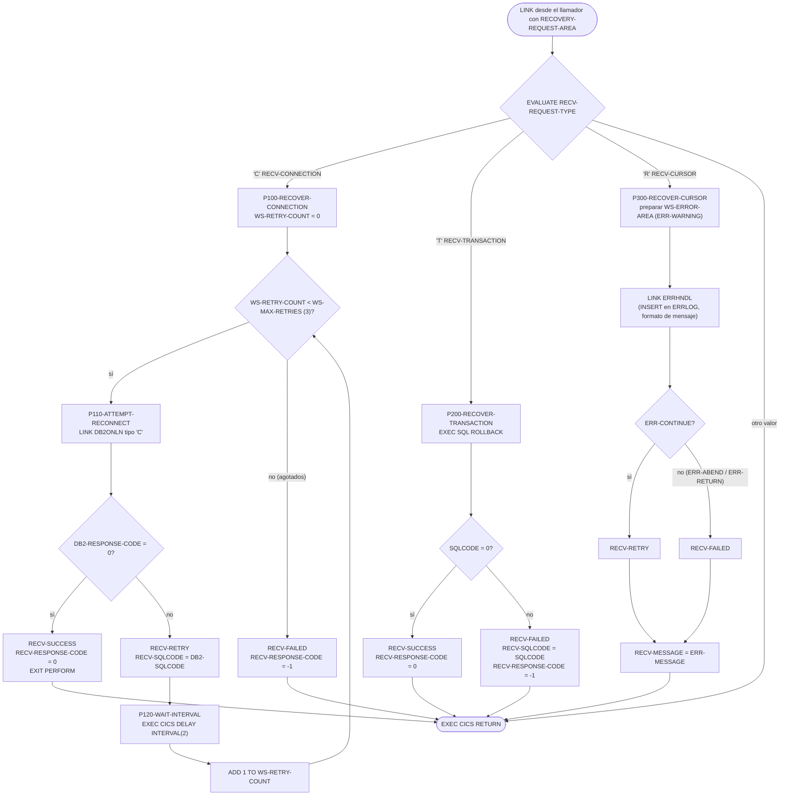
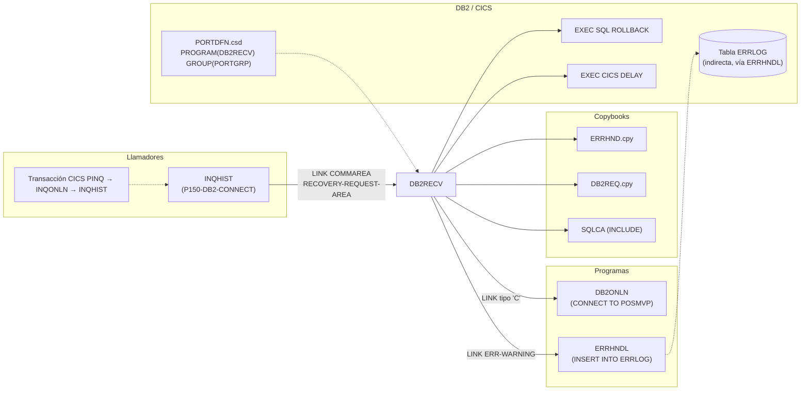

# DB2RECV — Gestor de recuperación DB2 para programas online (CICS)

> Generado a partir del análisis del código fuente `src/programs/online/DB2RECV.cbl`. Ver el [grafo de dependencias global](../technical/dependency-graph.md).

## Ficha técnica
| Campo | Valor |
| --- | --- |
| Ruta | `src/programs/online/DB2RECV.cbl` |
| Categoría | online |
| Tipo | CICS online (subrutina de servicio invocada por `EXEC CICS LINK`) |
| Líneas | 145 |
| Punto de entrada | Subrutina invocada por `LINK` con COMMAREA. Definida como `PROGRAM(DB2RECV)` en el grupo `PORTGRP` de `src/cics/PORTDFN.csd`; no tiene transacción CICS propia (la única transacción definida es `PINQ` → `INQONLN`). |
| Invocado por | `INQHIST` (párrafo `P150-DB2-CONNECT`, `EXEC CICS LINK PROGRAM('DB2RECV')`) |
| Invoca a | `DB2ONLN` (LINK, reconexión), `ERRHNDL` (LINK, registro de error de cursor) |

## Propósito
`DB2RECV` es el gestor de recuperación DB2 de la capa online (CICS) del sistema de carteras. Centraliza tres acciones de recuperación que los programas de consulta pueden solicitar cuando una operación DB2 falla: **reintentar la conexión** a DB2 (con reintentos y espera entre ellos), **deshacer la transacción** en curso (`ROLLBACK`) y **registrar un fallo de cursor** a través del manejador de errores centralizado `ERRHNDL`. Devuelve al llamador un estado (`S`uccess / `F`ailed / `R`etry), un código de respuesta y el `SQLCODE` asociado, para que éste decida si continúa, reintenta o abandona.

En el repositorio solo `INQHIST` lo utiliza, y únicamente para el caso de reconexión (`RECV-REQUEST-TYPE = 'C'`) cuando `DB2ONLN` no consigue conectar. Encaja en la capa de "DB2 Online Components" descrita en `system-architecture.md`, junto a `DB2ONLN` (gestor de conexiones) y `ERRHNDL` (manejador de errores).

## Funcionamiento

El programa no tiene párrafo de inicialización ni de terminación explícitos. La `PROCEDURE DIVISION` recibe el área `RECOVERY-REQUEST-AREA` mediante `USING`, evalúa el tipo de petición y ejecuta una de tres rutas, terminando siempre con `EXEC CICS RETURN`.

### Flujo principal (`PROCEDURE DIVISION`)
1. `EVALUATE TRUE` sobre las condiciones de nivel 88 de `RECV-REQUEST-TYPE`:
   - `RECV-CONNECTION` (`'C'`) → `P100-RECOVER-CONNECTION THRU P100-EXIT`.
   - `RECV-TRANSACTION` (`'T'`) → `P200-RECOVER-TRANSACTION THRU P200-EXIT`.
   - `RECV-CURSOR` (`'R'`) → `P300-RECOVER-CURSOR THRU P300-EXIT`.
   - No hay `WHEN OTHER`: con cualquier otro valor no se ejecuta nada y se devuelve el control sin tocar `RECV-STATUS` ni `RECV-RESPONSE-CODE`.
2. `EXEC CICS RETURN END-EXEC` devuelve el control al programa que hizo el `LINK`.

### `P100-RECOVER-CONNECTION` — reconexión con reintentos
1. Pone `WS-RETRY-COUNT` a 0.
2. Bucle `PERFORM UNTIL WS-RETRY-COUNT >= WS-MAX-RETRIES` (valor fijo 3):
   - Ejecuta `P110-ATTEMPT-RECONNECT`.
   - Si el intento deja `RECV-SUCCESS` activo → `EXIT PERFORM` (sale del bucle).
   - Si no → `P120-WAIT-INTERVAL` (espera) y `ADD 1 TO WS-RETRY-COUNT`.
3. Tras el bucle, si `WS-RETRY-COUNT >= WS-MAX-RETRIES` (se agotaron los intentos) → `SET RECV-FAILED TO TRUE` y `MOVE -1 TO RECV-RESPONSE-CODE`.

Resultado: hasta 3 intentos de conexión; entre intentos fallidos (incluido después del tercero) se espera `WS-RETRY-INTERVAL`.

### `P110-ATTEMPT-RECONNECT` — un intento de conexión vía `DB2ONLN`
1. `MOVE 'C' TO DB2-REQUEST-TYPE OF WS-DB2-REQUEST` (petición de conexión, `DB2-CONNECT` del copybook `DB2REQ`).
2. `EXEC CICS LINK PROGRAM('DB2ONLN') COMMAREA(WS-DB2-REQUEST) LENGTH(LENGTH OF WS-DB2-REQUEST)`. En `DB2ONLN` esto ejecuta `EXEC SQL CONNECT TO POSMVP` (párrafos `P100-PROCESS-CONNECT` / `P110-ESTABLISH-CONNECTION`) y devuelve `DB2-RESPONSE-CODE`, `DB2-SQLCODE`, `DB2-ERROR-MSG` y `DB2-CONNECTION-TOKEN`.
3. Si `DB2-RESPONSE-CODE OF WS-DB2-REQUEST = 0` → `SET RECV-SUCCESS TO TRUE`, `MOVE 0 TO RECV-RESPONSE-CODE`.
4. En caso contrario → `SET RECV-RETRY TO TRUE`, `MOVE DB2-SQLCODE OF WS-DB2-REQUEST TO RECV-SQLCODE`.

Nota: ni `DB2-ERROR-MSG` ni `DB2-CONNECTION-TOKEN` devueltos por `DB2ONLN` se copian al área del llamador.

### `P120-WAIT-INTERVAL` — espera entre reintentos
`EXEC CICS DELAY INTERVAL(WS-RETRY-INTERVAL) END-EXEC`, con `WS-RETRY-INTERVAL` = 2 (interpretado por CICS en formato `hhmmss`, es decir, 2 segundos). No se comprueba `RESP`.

### `P200-RECOVER-TRANSACTION` — rollback de la unidad de trabajo
1. `EXEC SQL ROLLBACK END-EXEC`.
2. Si `SQLCODE = 0` → `RECV-SUCCESS`, `RECV-RESPONSE-CODE = 0`.
3. Si no → `RECV-FAILED`, `MOVE SQLCODE TO RECV-SQLCODE`, `RECV-RESPONSE-CODE = -1`.

### `P300-RECOVER-CURSOR` — notificación de fallo de cursor a `ERRHNDL`
1. `MOVE SPACES TO WS-ERROR-AREA` (limpia toda el área `ERRHND`, incluidos sus campos binarios).
2. Rellena el área de error: `RECV-PROGRAM` → `ERR-PROGRAM`, `RECV-CURSOR` → `ERR-PARAGRAPH`, `RECV-SQLCODE` → `ERR-SQLCODE`, y `SET ERR-WARNING TO TRUE` (severidad `'W'`).
3. `EXEC CICS LINK PROGRAM('ERRHNDL') COMMAREA(WS-ERROR-AREA) LENGTH(LENGTH OF WS-ERROR-AREA)`. `ERRHNDL` inserta el error en la tabla DB2 `ERRLOG`, formatea `ERR-MESSAGE` y decide la acción (`P400-DETERMINE-ACTION`): `ERR-WARNING` → `ERR-CONTINUE`; si el `INSERT` en `ERRLOG` falla, `ERRHNDL` cambia la severidad a `ERR-FATAL` → `ERR-ABEND`.
4. Si `ERR-CONTINUE` → `SET RECV-RETRY TO TRUE`; en cualquier otro caso → `SET RECV-FAILED TO TRUE`.
5. `MOVE ERR-MESSAGE TO RECV-MESSAGE` (único punto del programa donde se rellena `RECV-MESSAGE`).

Esta ruta **no reabre ni reposiciona ningún cursor**: se limita a registrar el error y a indicar al llamador si puede reintentar. `RECV-RESPONSE-CODE` no se modifica en esta ruta.

## Interfaz

- **Parámetros / LINKAGE SECTION / COMMAREA**: el programa declara en `LINKAGE SECTION` el área `RECOVERY-REQUEST-AREA` y la recibe con `PROCEDURE DIVISION USING RECOVERY-REQUEST-AREA`. El llamador (`INQHIST`) la envía como `COMMAREA` de un `EXEC CICS LINK` (estructura espejo `WS-RECOVERY-REQUEST` en `INQHIST`; no existe un copybook común para ella).

  | Campo | PIC | Dirección | Descripción |
  | --- | --- | --- | --- |
  | `RECV-REQUEST-TYPE` | `X` | Entrada | `'C'` reconectar (`RECV-CONNECTION`), `'T'` rollback (`RECV-TRANSACTION`), `'R'` fallo de cursor (`RECV-CURSOR`). |
  | `RECV-RESPONSE-CODE` | `S9(8) COMP` | Salida | `0` éxito, `-1` fallo. No se modifica en la ruta `'R'` ni con tipos desconocidos. |
  | `RECV-SQLCODE` | `S9(9) COMP` | Entrada/Salida | Entrada: `SQLCODE` original del llamador (usado en la ruta `'R'` para el log). Salida: `SQLCODE` del último intento fallido (`'C'`) o del `ROLLBACK` (`'T'`). |
  | `RECV-PROGRAM` | `X(8)` | Entrada | Programa que solicita la recuperación (se pasa a `ERR-PROGRAM` en la ruta `'R'`). |
  | `RECV-CURSOR` | `X(18)` | Entrada | Nombre del cursor afectado (se pasa a `ERR-PARAGRAPH` en la ruta `'R'`). |
  | `RECV-MESSAGE` | `X(80)` | Salida | Mensaje formateado por `ERRHNDL`. Solo se rellena en la ruta `'R'`. |
  | `RECV-STATUS` | `X` | Salida | `'S'` `RECV-SUCCESS`, `'F'` `RECV-FAILED`, `'R'` `RECV-RETRY`. |

  Longitud total del área: 1 + 4 + 4 + (8 + 18 + 80) + 1 = 116 bytes.

- **Ficheros (DDNAME, organización, modo de apertura, clave)**: No aplica. El programa no tiene `FILE-CONTROL` ni accede a ficheros VSAM/secuenciales.

- **Tablas DB2 y sentencias SQL**:

  | Sentencia | Párrafo | Tabla | Observación |
  | --- | --- | --- | --- |
  | `EXEC SQL INCLUDE SQLCA` | `WORKING-STORAGE` | — | Área de comunicación SQL; se usa `SQLCODE` en `P200`. |
  | `EXEC SQL ROLLBACK` | `P200-RECOVER-TRANSACTION` | — | Deshace la unidad de trabajo DB2 en curso. No accede directamente a ninguna tabla. |

  Indirectamente, vía `ERRHNDL`, se inserta en `ERRLOG` (`src/database/db2/ERRLOG.sql`), y vía `DB2ONLN` se ejecuta `CONNECT TO POSMVP`. El plan CICS-DB2 aplicable es `PORTPLAN` (`DB2ENTRY(PORTDB2)` en `PORTDFN.csd`), definido en `src/database/db2/PORTPLAN.sql`.

- **Mapas BMS / comandos CICS**: no usa mapas BMS. Comandos CICS:

  | Comando | Párrafo | Detalle |
  | --- | --- | --- |
  | `EXEC CICS LINK PROGRAM('DB2ONLN')` | `P110-ATTEMPT-RECONNECT` | `COMMAREA(WS-DB2-REQUEST)`, `LENGTH(LENGTH OF WS-DB2-REQUEST)`; sin `RESP`. |
  | `EXEC CICS DELAY INTERVAL(WS-RETRY-INTERVAL)` | `P120-WAIT-INTERVAL` | Espera entre reintentos; sin `RESP`. |
  | `EXEC CICS LINK PROGRAM('ERRHNDL')` | `P300-RECOVER-CURSOR` | `COMMAREA(WS-ERROR-AREA)`, `LENGTH(LENGTH OF WS-ERROR-AREA)`; sin `RESP`. |
  | `EXEC CICS RETURN` | `PROCEDURE DIVISION` | Fin de programa; devuelve control al llamador del `LINK`. |

- **Códigos de retorno / RETURN-CODE**: no se usa `RETURN-CODE`. El resultado se comunica por `RECV-STATUS` y `RECV-RESPONSE-CODE`:

  | Ruta | Resultado | `RECV-STATUS` | `RECV-RESPONSE-CODE` | `RECV-SQLCODE` |
  | --- | --- | --- | --- | --- |
  | `'C'` | Conexión lograda en ≤ 3 intentos | `'S'` | `0` | `SQLCODE` del último intento fallido previo, o el valor de entrada si el primer intento tiene éxito |
  | `'C'` | 3 intentos fallidos | `'F'` | `-1` | `SQLCODE` del tercer intento |
  | `'T'` | `ROLLBACK` OK | `'S'` | `0` | sin cambios |
  | `'T'` | `ROLLBACK` KO | `'F'` | `-1` | `SQLCODE` del `ROLLBACK` |
  | `'R'` | `ERRHNDL` devuelve `ERR-CONTINUE` | `'R'` | sin cambios | sin cambios |
  | `'R'` | `ERRHNDL` devuelve otra acción | `'F'` | sin cambios | sin cambios |
  | otro | — | sin cambios | sin cambios | sin cambios |

## Estructuras de datos clave

### Copybooks
| Copybook | Ruta | Uso en `DB2RECV` |
| --- | --- | --- |
| `ERRHND` | `src/copybook/online/ERRHND.cpy` | Se incluye bajo `01 WS-ERROR-AREA`. Define el área de intercambio con `ERRHNDL`: `ERR-PROGRAM X(8)`, `ERR-PARAGRAPH X(30)`, `ERR-SQLCODE S9(9) COMP`, `ERR-CICS-RESP`/`ERR-CICS-RESP2 S9(8) COMP`, `ERR-SEVERITY` (`ERR-FATAL 'F'`, `ERR-WARNING 'W'`, `ERR-INFO 'I'`), `ERR-MESSAGE X(80)`, `ERR-ACTION` (`ERR-RETURN 'R'`, `ERR-CONTINUE 'C'`, `ERR-ABEND 'A'`), `ERR-TRACE` (`ERR-TRACE-ID X(16)`, `ERR-TIMESTAMP X(26)`). |
| `DB2REQ` | `src/copybook/online/DB2REQ.cpy` | Se incluye bajo `01 WS-DB2-REQUEST`. Define el área de petición a `DB2ONLN`: `DB2-REQUEST-TYPE` (`DB2-CONNECT 'C'`, `DB2-DISCONNECT 'D'`, `DB2-STATUS 'S'`), `DB2-RESPONSE-CODE S9(8) COMP`, `DB2-CONNECTION-TOKEN X(16)`, `DB2-ERROR-INFO` (`DB2-SQLCODE S9(9) COMP`, `DB2-ERROR-MSG X(80)`). `DB2RECV` es el único programa del repositorio que usa este copybook; `DB2ONLN` e `INQHIST` declaran la misma estructura en línea. |
| `SQLCA` | `EXEC SQL INCLUDE SQLCA` | Área de comunicación DB2 generada por el precompilador; `DB2RECV` solo consulta `SQLCODE` tras el `ROLLBACK`. |

Los copybooks `ERRHND` y `DB2REQ` se incluyen a continuación de un nivel `01` propio (`WS-ERROR-AREA`, `WS-DB2-REQUEST`), pero ambos copybooks comienzan con su propio nivel `01` (`ERROR-HANDLING`, `DB2-REQUEST-AREA`). Ver observaciones.

### WORKING-STORAGE
| Campo | PIC / VALUE | Función |
| --- | --- | --- |
| `WS-RETRY-COUNT` | `S9(4) COMP VALUE 0` | Contador de intentos de reconexión; se reinicia a 0 al entrar en `P100`. |
| `WS-MAX-RETRIES` | `S9(4) COMP VALUE 3` | Umbral máximo de intentos (3). Constante codificada, no parametrizable. |
| `WS-RETRY-INTERVAL` | `S9(8) COMP VALUE 2` | Intervalo de espera para `EXEC CICS DELAY INTERVAL` (2 → `hhmmss` = 2 segundos). |
| `WS-LAST-ERROR` | `S9(9) COMP VALUE 0` | Declarado pero **nunca referenciado**. |
| `WS-ERROR-AREA` | grupo (`COPY ERRHND`) | COMMAREA hacia `ERRHNDL`. |
| `WS-DB2-REQUEST` | grupo (`COPY DB2REQ`) | COMMAREA hacia `DB2ONLN`. |

## Reglas de negocio y validaciones
El programa es técnico (infraestructura de recuperación); no implementa reglas de negocio financieras. Las reglas implementadas son:

1. **Selección de acción por tipo de petición**: `'C'` → reconexión, `'T'` → rollback, `'R'` → registro de fallo de cursor. Cualquier otro valor se ignora silenciosamente (sin `WHEN OTHER`, sin estado de error).
2. **Política de reintentos de conexión**: máximo 3 intentos (`WS-MAX-RETRIES`), con espera de 2 segundos (`WS-RETRY-INTERVAL`) tras cada intento fallido. El bucle se corta en cuanto un intento tiene éxito (`EXIT PERFORM`).
3. **Criterio de éxito de conexión**: `DB2-RESPONSE-CODE = 0` devuelto por `DB2ONLN` (que a su vez exige `SQLCODE = 0` en `CONNECT TO POSMVP` y que no se haya alcanzado su máximo de 100 conexiones activas).
4. **Criterio de éxito de rollback**: `SQLCODE = 0` tras `EXEC SQL ROLLBACK`.
5. **Severidad fija para fallos de cursor**: siempre se notifica a `ERRHNDL` con `ERR-WARNING`, lo que en `ERRHNDL` se traduce en `ERR-CONTINUE` (y por tanto `RECV-RETRY`) salvo que el propio registro en `ERRLOG` falle (`ERR-FATAL` → `ERR-ABEND` → `RECV-FAILED`).
6. **Mapeo de estados**: `RECV-RETRY` indica al llamador que puede volver a intentarlo; `RECV-FAILED` que la recuperación ha fracasado; `RECV-SUCCESS` que puede continuar. Solo se emite `-1` en `RECV-RESPONSE-CODE` cuando se agotan los reintentos o falla el `ROLLBACK`.

## Manejo de errores y recuperación
- **FILE STATUS**: no aplica (sin ficheros).
- **SQLCODE**: solo se evalúa tras `EXEC SQL ROLLBACK` (`P200`). Los `SQLCODE` del `CONNECT` los evalúa `DB2ONLN` y llegan a `DB2RECV` a través de `DB2-RESPONSE-CODE` / `DB2-SQLCODE`. No hay `WHENEVER SQLERROR` ni tratamiento diferenciado por código (p. ej. deadlock -911/-913, conexión -30081).
- **Condiciones CICS**: no hay `HANDLE CONDITION`, `HANDLE ABEND`, ni opciones `RESP`/`NOHANDLE` en los `LINK` ni en el `DELAY`. Cualquier condición excepcional (p. ej. `PGMIDERR` si `DB2ONLN` o `ERRHNDL` no estuvieran definidos/disponibles, `LENGERR`, `INVREQ`) provocaría el abend de la tarea CICS con el comportamiento por defecto del sistema.
- **Checkpoint/restart**: no aplica (programa online, sin estado persistente; `WS-RETRY-COUNT` se reinicia en cada `LINK`).
- **Rollback**: la ruta `'T'` ejecuta `EXEC SQL ROLLBACK` sobre la unidad de trabajo del llamador. Ver observaciones sobre su validez en CICS.
- **Llamadas a manejadores**: `ERRHNDL` (LINK) solo se invoca en la ruta `'R'`; en las rutas `'C'` y `'T'` los fallos no se registran en `ERRLOG` ni se genera mensaje. No se invoca a `ERRPROC` ni `DB2ERR` (son componentes batch).
- **Recuperación vista desde el llamador (`INQHIST`)**: si `DB2ONLN` no conecta, `INQHIST` rellena `RECV-REQUEST-TYPE='C'`, `RECV-PROGRAM='INQHIST'`, `RECV-SQLCODE` y hace `LINK` a `DB2RECV`. Si vuelve `RECV-SUCCESS`, `INQHIST` vuelve a ejecutar `P150-DB2-CONNECT` (nueva conexión vía `DB2ONLN`); si no, copia `RECV-MESSAGE` a `INQCOM-ERROR-MSG` y va a `P999-ERROR-ROUTINE`.

## Dependencias

Ficheros DD, tablas DB2 propias y mapas BMS: ninguno.

## Observaciones y problemas detectados

1. **`EXEC SQL ROLLBACK` en un programa CICS (`P200-RECOVER-TRANSACTION`)**. En el entorno CICS-DB2 el punto de sincronización lo coordina CICS; las sentencias SQL `COMMIT`/`ROLLBACK` no están permitidas en programas CICS (DB2 devuelve un `SQLCODE` negativo, típicamente -925/-926) y debe usarse `EXEC CICS SYNCPOINT ROLLBACK`. Tal como está, la ruta `'T'` devolvería siempre `RECV-FAILED`. Esta ruta no se usa en ningún programa del repositorio.
2. **Tipo de dato de `WS-RETRY-INTERVAL` para `EXEC CICS DELAY INTERVAL`**. Está declarado `PIC S9(8) COMP` (binario), mientras que la opción `INTERVAL(hhmmss)` de CICS espera un valor decimal empaquetado (`PIC S9(7) COMP-3`). El traductor CICS puede rechazarlo o el intervalo puede interpretarse incorrectamente. Además, el intervalo de 2 segundos y el máximo de 3 reintentos están codificados en duro.
3. **Recepción del COMMAREA mediante `PROCEDURE DIVISION USING RECOVERY-REQUEST-AREA`**. Es la convención de una subrutina `CALL`, no la de un programa CICS enlazado con `LINK`, donde el área llega en `DFHCOMMAREA` (como hace `ERRHNDL`). Con el traductor CICS, `RECOVERY-REQUEST-AREA` probablemente no quedaría direccionada al COMMAREA enviado por `INQHIST`. `DB2ONLN` presenta el mismo patrón, por lo que podría tratarse de una simplificación deliberada de la suite.
4. **`RECV-MESSAGE` no se rellena en las rutas `'C'` y `'T'`**. `INQHIST` copia `RECV-MESSAGE` a `INQCOM-ERROR-MSG` cuando la reconexión fracasa, pero `DB2RECV` solo asigna `RECV-MESSAGE` en `P300`. El `DB2-ERROR-MSG` que devuelve `DB2ONLN` (p. ej. `'Maximum connections reached'` o `SQLERRMC`) se descarta, de modo que el usuario final recibe un mensaje vacío o con el contenido previo del área.
5. **Sin `WHEN OTHER` en el `EVALUATE` principal**. Un `RECV-REQUEST-TYPE` no reconocido devuelve el control sin modificar `RECV-STATUS` ni `RECV-RESPONSE-CODE`; el llamador podría interpretar valores residuales del área (`INQHIST` no inicializa `RECV-STATUS` antes del `LINK`).
6. **Espera innecesaria tras el último intento**. En `P100`, `P120-WAIT-INTERVAL` se ejecuta también después del tercer intento fallido, añadiendo 2 segundos de latencia antes de devolver `RECV-FAILED`.
7. **`MOVE SPACES TO WS-ERROR-AREA`** (`P300`) mueve espacios a un grupo que contiene campos binarios (`ERR-SQLCODE`, `ERR-CICS-RESP`, `ERR-CICS-RESP2`). `ERR-SQLCODE` se sobrescribe a continuación, pero `ERR-CICS-RESP` y `ERR-CICS-RESP2` quedan con `X'40404040'` (1.077.952.576 en decimal), valor que `ERRHNDL` inserta en `ERRLOG` como `LOG-CICS-RESP`. Lo correcto sería `INITIALIZE`.
8. **Semántica forzada en la ruta `'R'`**: `RECV-CURSOR` (nombre de cursor, `X(18)`) se pasa a `ERR-PARAGRAPH` (nombre de párrafo, `X(30)`), y `P300-RECOVER-CURSOR` en realidad no recupera ningún cursor (no interactúa con `CURSMGR`); solo registra el error y devuelve `RECV-RETRY`/`RECV-FAILED`. El nombre del párrafo y la cabecera del programa ("Manages transaction rollback", "Provides recovery status tracking") prometen más de lo implementado.
9. **`RECV-RESPONSE-CODE` no se establece en la ruta `'R'`**, por lo que un llamador que consulte ese campo tras una petición de cursor obtendría el valor de entrada.
10. **Campo `WS-LAST-ERROR` declarado y nunca usado**.
11. **Estructura de nivel `01` seguida de `COPY` que aporta otro `01`**. `WS-DB2-AREA`, `WS-ERROR-AREA` y `WS-DB2-REQUEST` se declaran como `01` y a continuación se incluye `SQLCA` / `ERRHND.cpy` / `DB2REQ.cpy`, que a su vez comienzan con un `01` (`SQLCA`, `ERROR-HANDLING`, `DB2-REQUEST-AREA`). Los `01` externos quedan como grupos sin subordinados ni `PICTURE`, lo que Enterprise COBOL rechaza en compilación, y las referencias `LENGTH OF WS-ERROR-AREA` / `LENGTH OF WS-DB2-REQUEST` y los calificadores `OF WS-DB2-REQUEST` no serían válidos. El mismo patrón aparece en `DB2ONLN`, `ERRHNDL`, `INQONLN` y `SECMGR`; probablemente es una convención simplificada de la suite, pero el código tal cual no compilaría.
12. **Ausencia total de control de condiciones CICS** (`RESP`, `HANDLE CONDITION`) en los `LINK` y el `DELAY`: un `PGMIDERR` o `LENGERR` abendaría la transacción `PINQ` en lugar de devolver `RECV-FAILED`.
13. **Interacción con `INQHIST` que provoca doble conexión y recursión**: cuando `DB2RECV` consigue conectar (vía `DB2ONLN`), no devuelve el `DB2-CONNECTION-TOKEN`, así que `INQHIST` vuelve a ejecutar `P150-DB2-CONNECT` (un `PERFORM` recursivo del mismo párrafo, comportamiento no definido en COBOL) y abre una segunda conexión, inflando `WS-ACTIVE-CONNECTIONS` en `DB2ONLN`. Es un problema del llamador, pero condicionado por la interfaz de `DB2RECV`.
14. **Discrepancias con `system-architecture.md`**:
    - La tabla 5.1.4 indica que `DB2ONLN` depende de `DB2RECV` y el diagrama 5.2.2 dibuja `DB2ONLN → DB2RECV`. El código muestra la relación inversa: `DB2RECV` hace `LINK` a `DB2ONLN`, y quien invoca a `DB2RECV` es `INQHIST`.
    - El diagrama 6.2.2 ("Online Recovery") muestra a `ERRHNDL` iniciando la recuperación en `DB2RECV`. En el código, `ERRHNDL` no invoca a `DB2RECV`; es `DB2RECV` quien hace `LINK` a `ERRHNDL` (ruta `'R'`).
    - La descripción del componente ("Controls session cleanup", "Maintains connection state") no se corresponde con funcionalidad presente en el código: no hay limpieza de sesión ni estado de conexión persistente (no se llama a `DB2ONLN` con `'D'` ni `'S'`).
    - `system-architecture.md` no menciona el copybook `DB2REQ`; el `data-dictionary.md` no documenta la estructura `RECOVERY-REQUEST-AREA`.
15. **Sin copybook común para `RECOVERY-REQUEST-AREA`**: la estructura está duplicada en `DB2RECV` (LINKAGE) y en `INQHIST` (`WS-RECOVERY-REQUEST`), con riesgo de desalineación si una de las copias cambia (a diferencia de `DB2REQ`, que sí existe como copybook pero solo lo usa `DB2RECV`).

## Referencias
- Programa: [DB2RECV.cbl](../../src/programs/online/DB2RECV.cbl)
- Copybooks: [ERRHND.cpy](../../src/copybook/online/ERRHND.cpy), [DB2REQ.cpy](../../src/copybook/online/DB2REQ.cpy)
- Programas relacionados: [INQHIST.cbl](../../src/programs/online/INQHIST.cbl) (llamador), [DB2ONLN.cbl](../../src/programs/online/DB2ONLN.cbl), [ERRHNDL.cbl](../../src/programs/online/ERRHNDL.cbl), [INQONLN.cbl](../../src/programs/online/INQONLN.cbl) (controlador de la transacción `PINQ`)
- Definiciones CICS: [PORTDFN.csd](../../src/cics/PORTDFN.csd)
- DDL / plan DB2: [ERRLOG.sql](../../src/database/db2/ERRLOG.sql), [POSHIST.sql](../../src/database/db2/POSHIST.sql) (base de datos `POSMVP`), [PORTPLAN.sql](../../src/database/db2/PORTPLAN.sql)
- Documentación técnica: [system-architecture.md](../technical/system-architecture.md), [data-dictionary.md](../technical/data-dictionary.md), [dependency-graph.md](../technical/dependency-graph.md), [dependency-graph.json](../technical/dependency-graph.json)
