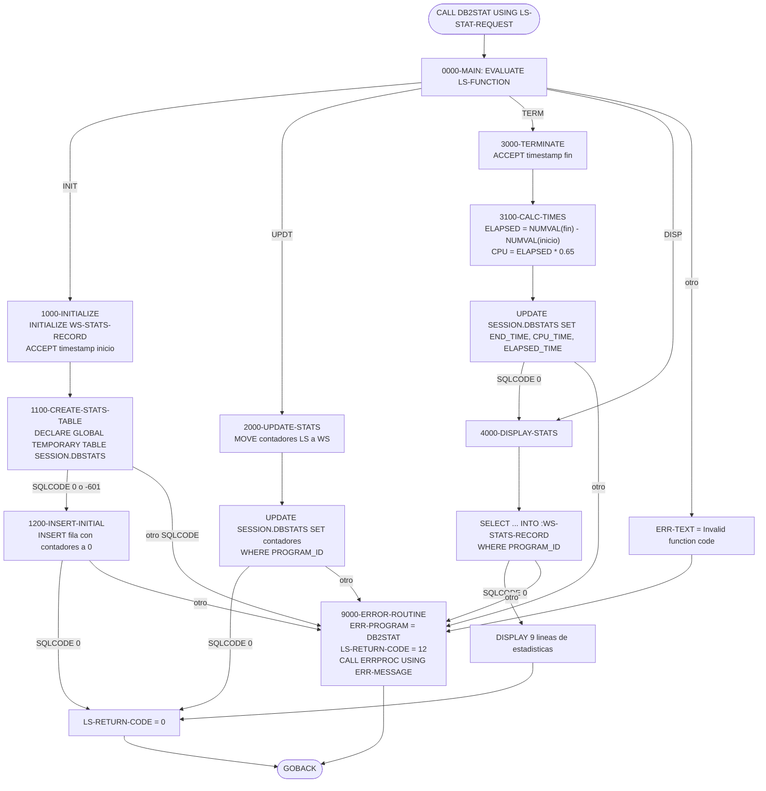
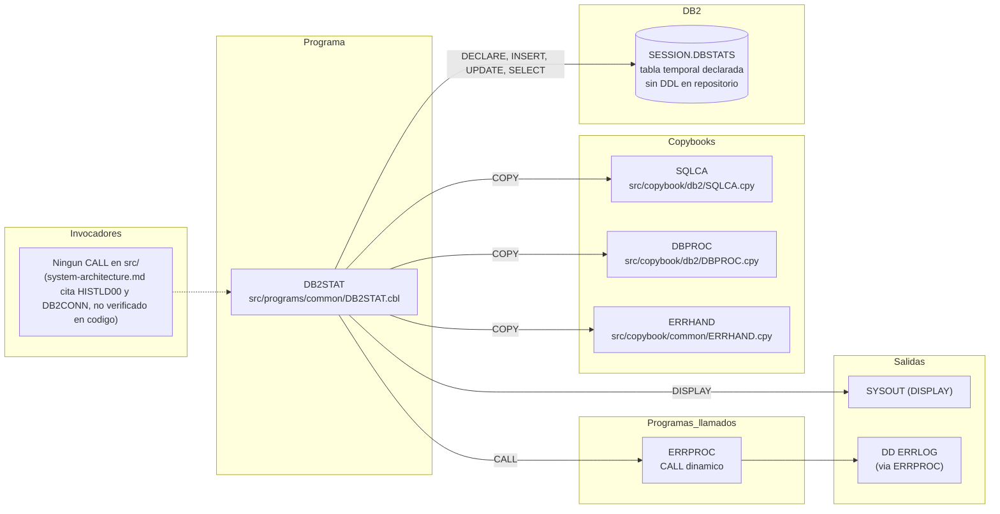

# DB2STAT — Recolector de estadísticas DB2 por programa (tabla temporal `SESSION.DBSTATS`)

> Generado a partir del análisis del código fuente `src/programs/common/DB2STAT.cbl`. Ver el [grafo de dependencias global](../technical/dependency-graph.md).

## Ficha técnica
| Campo | Valor |
| --- | --- |
| Ruta | `src/programs/common/DB2STAT.cbl` |
| Categoría | common |
| Tipo | subrutina común (batch, con SQL embebido; sin CICS) |
| Líneas | 228 |
| Punto de entrada | subrutina invocada por `CALL 'DB2STAT' USING <área LS-STAT-REQUEST>`; ningún JCL ni transacción CICS la ejecuta directamente |
| Invocado por | ninguno conocido en `src/` (no existe ningún `CALL 'DB2STAT'`). `system-architecture.md` la sitúa bajo `DB2CONN` y como receptora de "Update Statistics" desde `HISTLD00`, pero el código no lo confirma (ver Observaciones) |
| Invoca a | `ERRPROC` (`CALL 'ERRPROC' USING ERR-MESSAGE`, dinámico) |

## Propósito
`DB2STAT` es una subrutina de soporte DB2 que centraliza la recogida de estadísticas de ejecución de un programa (filas leídas, insertadas, actualizadas, borradas, commits, rollbacks, tiempo transcurrido y una estimación de CPU). Las estadísticas se guardan en una **tabla temporal global declarada** (`SESSION.DBSTATS`), que vive únicamente durante el hilo DB2 del trabajo que la invoca, y se muestran por `DISPLAY` (SYSOUT) al finalizar. Encaja en la "DB2 Support Layer" de la arquitectura junto a `DB2CONN`, `DB2CMT` y `DB2ERR`, como utilidad de instrumentación para los programas batch que acceden a DB2 (p. ej. `HISTLD00`), aunque en el estado actual del repositorio ningún programa la invoca realmente.

## Funcionamiento
El programa es un **despachador por código de función**: cada `CALL` ejecuta exactamente una operación (`INIT`, `UPDT`, `TERM` o `DISP`) y vuelve al llamador con `GOBACK`. El estado entre llamadas (identificador de programa, marca de tiempo de inicio) se conserva en WORKING-STORAGE, que en Enterprise COBOL persiste entre `CALL`s dentro de la misma unidad de ejecución al no declararse el programa como `INITIAL`.

### `0000-MAIN`
Evalúa los niveles 88 de `LS-FUNCTION`:

| Valor de `LS-FUNCTION` | Condición 88 | Párrafo ejecutado |
| --- | --- | --- |
| `'INIT'` | `FUNC-INIT` | `1000-INITIALIZE` |
| `'UPDT'` | `FUNC-UPDT` | `2000-UPDATE-STATS` |
| `'TERM'` | `FUNC-TERM` | `3000-TERMINATE` |
| `'DISP'` | `FUNC-DISP` | `4000-DISPLAY-STATS` |
| otro | — | `MOVE 'Invalid function code' TO ERR-TEXT` y `9000-ERROR-ROUTINE` |

Tras el `EVALUATE` ejecuta `GOBACK` incondicionalmente; no existe ningún bucle interno.

### `1000-INITIALIZE` (función `INIT`)
1. `INITIALIZE WS-STATS-RECORD` (pone a cero los contadores y a espacios los campos alfanuméricos).
2. Copia `LS-PROGRAM-ID` (programa monitorizado, 8 caracteres) a `WS-PROGRAM-ID`. Es el **único** punto donde se captura el identificador; el resto de funciones reutilizan el valor guardado.
3. `ACCEPT WS-CURRENT-TIMESTAMP FROM TIME STAMP` y lo copia a `WS-START-TIME` y `WS-START-TIMESTAMP` (este último se usa en `3100-CALC-TIMES`).
4. `PERFORM 1100-CREATE-STATS-TABLE` y `PERFORM 1200-INSERT-INITIAL`.

### `1100-CREATE-STATS-TABLE`
Ejecuta `DECLARE GLOBAL TEMPORARY TABLE SESSION.DBSTATS (...) ON COMMIT PRESERVE ROWS` con 11 columnas (ver Interfaz). Se acepta `SQLCODE = 0` y también `SQLCODE = -601` (objeto ya existente), lo que permite invocar `INIT` varias veces en el mismo hilo sin error. Cualquier otro `SQLCODE` produce `'Error creating stats table'` y `9000-ERROR-ROUTINE`.

### `1200-INSERT-INITIAL`
Inserta la fila inicial del programa: `PROGRAM_ID = :WS-PROGRAM-ID`, `START_TIME = CURRENT TIMESTAMP` (hora del servidor DB2, no la capturada con `ACCEPT`) y los seis contadores a 0. `END_TIME`, `CPU_TIME` y `ELAPSED_TIME` quedan `NULL`. Si `SQLCODE = 0` devuelve `LS-RETURN-CODE = 0`; en otro caso `'Error initializing stats'`.

### `2000-UPDATE-STATS` (función `UPDT`)
Copia los seis contadores recibidos en `LS-STAT-DATA` a sus homólogos de `WS-STATS-RECORD` y ejecuta un `UPDATE SESSION.DBSTATS SET ROWS_READ = ..., ROLLBACKS = ... WHERE PROGRAM_ID = :WS-PROGRAM-ID`. Los valores son **absolutos** (sustituyen a los anteriores), no incrementales: el llamador debe pasar los acumulados totales en cada llamada. Éxito → `LS-RETURN-CODE = 0`; error → `'Error updating stats'`.

### `3000-TERMINATE` (función `TERM`)
1. Toma la marca de tiempo actual (`ACCEPT ... FROM TIME STAMP`) en `WS-END-TIME`.
2. `PERFORM 3100-CALC-TIMES`.
3. `UPDATE SESSION.DBSTATS SET END_TIME = :WS-END-TIME, CPU_TIME = :WS-CPU-TIME, ELAPSED_TIME = :WS-ELAPSED-TIME WHERE PROGRAM_ID = :WS-PROGRAM-ID`.
4. Si `SQLCODE = 0`, pone `LS-RETURN-CODE = 0` y encadena `4000-DISPLAY-STATS` (el informe se imprime automáticamente al terminar). Si no, `'Error finalizing stats'`.

### `3100-CALC-TIMES`
```cobol
COMPUTE WS-ELAPSED-TIME = FUNCTION NUMVAL(WS-END-TIME(1:15))
                        - FUNCTION NUMVAL(WS-START-TIMESTAMP(1:15))
MOVE WS-ELAPSED-TIME TO WS-CPU-TIME
MULTIPLY 0.65 BY WS-CPU-TIME
```
Calcula el "tiempo transcurrido" como la diferencia numérica de los 15 primeros caracteres de las dos marcas de tiempo y estima la CPU como el **65 % del transcurrido** (constante fija; no se consulta ningún dato real de CPU). Ver Observaciones sobre la validez de este cálculo.

### `4000-DISPLAY-STATS` (función `DISP`, y también desde `TERM`)
`SELECT ROWS_READ, ..., CPU_TIME, ELAPSED_TIME INTO :WS-STATS-RECORD FROM SESSION.DBSTATS WHERE PROGRAM_ID = :WS-PROGRAM-ID`. Con `SQLCODE = 0` imprime por `DISPLAY` un bloque de 9 líneas ("DB2 Statistics for ...", contadores, CPU y tiempo transcurrido formateados con `WS-FORMATTED-TIME PIC ZZ,ZZ9.99` seguidos de `' seconds'`) y pone `LS-RETURN-CODE = 0`. Cualquier otro `SQLCODE` (incluido `+100`, sin fila) → `'Error retrieving stats'`.

### `9000-ERROR-ROUTINE`
`MOVE 'DB2STAT' TO ERR-PROGRAM`, `MOVE 12 TO LS-RETURN-CODE` y `CALL 'ERRPROC' USING ERR-MESSAGE`. No ejecuta `ROLLBACK`, no informa el `SQLCODE` y no rellena `ERR-CATEGORY`, `ERR-CODE`, `ERR-SEVERITY` ni `ERR-DETAILS`. Tras el retorno de `ERRPROC` el control vuelve al párrafo llamante y finalmente al `GOBACK` de `0000-MAIN`: el error no aborta el programa llamador.



## Interfaz
- **Parámetros / LINKAGE SECTION / COMMAREA**: un único parámetro `LS-STAT-REQUEST` (por referencia, `PROCEDURE DIVISION USING LS-STAT-REQUEST`). No se define en ningún copybook del repositorio; el llamador debe replicar la estructura:

| Campo | PIC | Dirección | Descripción |
| --- | --- | --- | --- |
| `LS-FUNCTION` | `X(4)` | entrada | `'INIT'`, `'UPDT'`, `'TERM'` o `'DISP'` |
| `LS-PROGRAM-ID` | `X(8)` | entrada | Programa monitorizado; solo se lee en `INIT` |
| `LS-STAT-DATA.LS-ROWS-READ` | `S9(9) COMP` | entrada | Filas leídas (acumulado) — solo `UPDT` |
| `LS-STAT-DATA.LS-ROWS-INSRT` | `S9(9) COMP` | entrada | Filas insertadas — solo `UPDT` |
| `LS-STAT-DATA.LS-ROWS-UPDT` | `S9(9) COMP` | entrada | Filas actualizadas — solo `UPDT` |
| `LS-STAT-DATA.LS-ROWS-DELT` | `S9(9) COMP` | entrada | Filas borradas — solo `UPDT` |
| `LS-STAT-DATA.LS-COMMITS` | `S9(9) COMP` | entrada | Commits — solo `UPDT` |
| `LS-STAT-DATA.LS-ROLLBACKS` | `S9(9) COMP` | entrada | Rollbacks — solo `UPDT` |
| `LS-RETURN-CODE` | `S9(4) COMP` | salida | `0` éxito, `12` error |

  Longitud total: 4 + 8 + 24 + 2 = 38 bytes.

- **Ficheros (DDNAME, organización, modo de apertura, clave)**: No aplica. El programa no tiene `FILE-CONTROL`; la única E/S no SQL es `DISPLAY` a SYSOUT. (`ERRPROC`, al que llama, escribe en el DD `ERRLOG`.)

- **Tablas DB2 y sentencias SQL**:

| Objeto | Sentencia | Párrafo | Observaciones |
| --- | --- | --- | --- |
| `SESSION.DBSTATS` | `DECLARE GLOBAL TEMPORARY TABLE ... ON COMMIT PRESERVE ROWS` | `1100-CREATE-STATS-TABLE` | Tabla temporal declarada, ámbito = hilo DB2 del llamador; no hay DDL en `src/database/db2/` porque no es una tabla persistente |
| `SESSION.DBSTATS` | `INSERT ... VALUES (:WS-PROGRAM-ID, CURRENT TIMESTAMP, 0,0,0,0,0,0)` | `1200-INSERT-INITIAL` | Una fila por `INIT` |
| `SESSION.DBSTATS` | `UPDATE ... SET` 6 contadores `WHERE PROGRAM_ID = :WS-PROGRAM-ID` | `2000-UPDATE-STATS` | Valores absolutos |
| `SESSION.DBSTATS` | `UPDATE ... SET END_TIME, CPU_TIME, ELAPSED_TIME WHERE PROGRAM_ID = :WS-PROGRAM-ID` | `3000-TERMINATE` | |
| `SESSION.DBSTATS` | `SELECT` 8 columnas `INTO :WS-STATS-RECORD WHERE PROGRAM_ID = :WS-PROGRAM-ID` | `4000-DISPLAY-STATS` | SELECT singleton, sin cursor |

  Definición de `SESSION.DBSTATS`:

| Columna | Tipo | NULL | Campo host equivalente |
| --- | --- | --- | --- |
| `PROGRAM_ID` | `CHAR(8)` | NOT NULL | `WS-PROGRAM-ID PIC X(8)` |
| `START_TIME` | `TIMESTAMP` | NOT NULL | `WS-START-TIME PIC X(26)` |
| `END_TIME` | `TIMESTAMP` | — | `WS-END-TIME PIC X(26)` |
| `ROWS_READ` | `INTEGER` | NOT NULL | `WS-ROWS-READ S9(9) COMP` |
| `ROWS_INSERTED` | `INTEGER` | NOT NULL | `WS-ROWS-INSERTED` |
| `ROWS_UPDATED` | `INTEGER` | NOT NULL | `WS-ROWS-UPDATED` |
| `ROWS_DELETED` | `INTEGER` | NOT NULL | `WS-ROWS-DELETED` |
| `COMMITS` | `INTEGER` | NOT NULL | `WS-COMMITS` |
| `ROLLBACKS` | `INTEGER` | NOT NULL | `WS-ROLLBACKS` |
| `CPU_TIME` | `DECIMAL(11,2)` | — | `WS-CPU-TIME S9(9)V99 COMP-3` |
| `ELAPSED_TIME` | `DECIMAL(11,2)` | — | `WS-ELAPSED-TIME S9(9)V99 COMP-3` |

  El programa **no** ejecuta `CONNECT`, `COMMIT` ni `ROLLBACK`: asume que el llamador ya dispone de un hilo DB2 (p. ej. vía `IKJEFT01`/`DSN RUN` o `DB2CONN`) y gestiona su propia unidad de trabajo.

- **Mapas BMS / comandos CICS**: No aplica.

- **Códigos de retorno / RETURN-CODE**: solo se informa `LS-RETURN-CODE` del área de enlace; el registro especial `RETURN-CODE` no se toca.

| `LS-RETURN-CODE` | Cuándo |
| --- | --- |
| `0` | Operación SQL completada con `SQLCODE = 0` (y, en `INIT`, `DECLARE` con `0` o `-601`) |
| `12` | Código de función no reconocido, o cualquier `SQLCODE` distinto de los aceptados. Coincide con `ERR-SEVERE` de `ERRHAND`, aunque el literal `12` está codificado directamente |
| sin cambios | Si `1100-CREATE-STATS-TABLE` falla, `1200-INSERT-INITIAL` se ejecuta igualmente y puede sobrescribir el `12` con `0` (ver Observaciones) |

## Estructuras de datos clave
### Copybooks
| Copybook | Ruta | Aporta a DB2STAT |
| --- | --- | --- |
| `SQLCA` | `src/copybook/db2/SQLCA.cpy` | `EXEC SQL INCLUDE SQLCA` (campos `SQLCODE`, `SQLSTATE`, ...) y constantes `SQL-STATUS-CODES` (`SQL-SUCCESS`, `SQL-NOT-FOUND`, `SQL-DUP-KEY`, ...). DB2STAT solo usa `SQLCODE`; las constantes no se referencian |
| `DBPROC` | `src/copybook/db2/DBPROC.cpy` | Estructura `DB2-ERROR-HANDLING` (mensaje formateado con SQLCODE/SQLSTATE, contadores de reintento `DB2-MAX-RETRIES = 3`, `DB2-RETRY-WAIT = 100`) **y** párrafos de PROCEDURE DIVISION (`CONNECT-TO-DB2`, `DISCONNECT-FROM-DB2`, `DB2-ERROR-ROUTINE`, `CHECK-SQL-STATUS`). DB2STAT no usa ninguno de ellos |
| `ERRHAND` | `src/copybook/common/ERRHAND.cpy` | `ERR-MESSAGE` (área pasada a `ERRPROC`: `ERR-TIMESTAMP`, `ERR-PROGRAM`, `ERR-CATEGORY`, `ERR-CODE`, `ERR-SEVERITY`, `ERR-TEXT X(80)`, `ERR-DETAILS X(256)`), categorías `ERR-CAT-*`, códigos `ERR-SUCCESS/WARNING/ERROR/SEVERE/TERMINAL` (0/4/8/12/16) y mensajes VSAM. DB2STAT solo rellena `ERR-PROGRAM` y `ERR-TEXT` |

### WORKING-STORAGE propia
| Campo | PIC | Uso |
| --- | --- | --- |
| `WS-STATS-RECORD` (dentro de `BEGIN/END DECLARE SECTION`) | grupo de 11 campos, imagen 1:1 de `SESSION.DBSTATS` | Variables host de todas las sentencias SQL; `WS-PROGRAM-ID` y `WS-START-TIME` persisten entre llamadas |
| `WS-CURRENT-TIMESTAMP` | `X(26)` | Receptor de `ACCEPT ... FROM TIME STAMP` |
| `WS-START-TIMESTAMP` | `X(26)` | Copia de la hora de `INIT` usada por `3100-CALC-TIMES` |
| `WS-FORMATTED-TIME` | `ZZ,ZZ9.99` | Edición de CPU/transcurrido para `DISPLAY` (máx. 99 999,99 s) |

No hay umbrales de commit, contadores de checkpoint ni flags de fin de fichero: toda la lógica es "una llamada = una operación".

## Reglas de negocio y validaciones
1. **Despacho por código de función**: solo se aceptan `INIT`, `UPDT`, `TERM`, `DISP`; cualquier otro valor es error severo (`12`).
2. **Ciclo de vida esperado**: `INIT` (una vez, crea tabla temporal e inserta la fila) → `UPDT` (N veces, contadores acumulados) → `TERM` (cierra la fila y muestra el informe). `DISP` puede llamarse en cualquier momento tras `INIT`.
3. **Idempotencia parcial del `DECLARE`**: `SQLCODE -601` (la tabla temporal ya existe en el hilo) se trata como éxito, permitiendo que varios programas de la misma unidad de trabajo compartan `SESSION.DBSTATS`. El `INSERT` posterior **no** es idempotente: dos `INIT` con el mismo `PROGRAM_ID` producen dos filas (no hay clave primaria).
4. **Los contadores son absolutos**: `UPDT` sustituye los seis valores; no suma.
5. **Cálculo de tiempos**: `ELAPSED_TIME = NUMVAL(fin(1:15)) - NUMVAL(inicio(1:15))`; `CPU_TIME = ELAPSED_TIME × 0,65` (estimación fija, no medida real).
6. **Identificación de la fila**: todas las sentencias filtran por `PROGRAM_ID = :WS-PROGRAM-ID`, capturado solo en `INIT`; `LS-PROGRAM-ID` pasado en `UPDT`/`TERM`/`DISP` se ignora.
7. **El informe se imprime siempre al terminar** (`TERM` encadena `4000-DISPLAY-STATS`) con formato `ZZ,ZZ9.99` y sufijo `' seconds'`.
8. **Sin control transaccional propio**: los `INSERT`/`UPDATE` quedan dentro de la unidad de trabajo del llamador; con `ON COMMIT PRESERVE ROWS` las filas sobreviven a los `COMMIT` intermedios del llamador.

## Manejo de errores y recuperación
- **FILE STATUS**: no aplica (sin ficheros).
- **SQLCODE**: tras cada sentencia se comprueba `SQLCODE = 0` (y `-601` en el `DECLARE`). No se distingue `+100` (sin fila) de errores reales, no se consultan `SQLSTATE` ni las constantes de `SQLCA.cpy`, y no se usan los reintentos definidos en `DBPROC` (`DB2-RETRY-COUNT`, `DB2-MAX-RETRIES`).
- **Condiciones CICS**: no aplica.
- **Checkpoint/restart**: no aplica; la tabla temporal se pierde al terminar el hilo DB2, por lo que las estadísticas no son recuperables tras un abend.
- **Rollback**: no se ejecuta ninguno (a diferencia de `DB2-ERROR-ROUTINE` de `DBPROC`, que sí hace `ROLLBACK WORK`, pero que DB2STAT no invoca).
- **Llamada a `ERRPROC`**: `9000-ERROR-ROUTINE` rellena `ERR-PROGRAM = 'DB2STAT'` y `ERR-TEXT` (texto fijo por párrafo, sin el `SQLCODE`), fija `LS-RETURN-CODE = 12` y llama a `ERRPROC USING ERR-MESSAGE`. `ERRPROC` (`src/programs/common/ERRPROC.cbl`) abre en `EXTEND` el DD `ERRLOG`, escribe el mensaje, lo muestra por `DISPLAY` y devuelve. El control retorna a DB2STAT, que termina con `GOBACK`; **no hay `STOP RUN` ni abend**, así que la decisión de abortar recae en el llamador según `LS-RETURN-CODE`.
- **No se llama a `DB2ERR`** ni a `ERRHNDL` (online).

## Dependencias


## Observaciones y problemas detectados
1. **Programa huérfano**: ningún programa de `src/` ejecuta `CALL 'DB2STAT'` ni existe JCL que lo cargue. `system-architecture.md` (§1 diagrama "DB2 Support Layer" y §2.2 "Transaction Processing Flow") indica que `DB2CONN` lo utiliza y que `HISTLD00` le envía "Update Statistics", pero `HISTLD00.cbl` solo llama a `ERRPROC` y muestra sus propias estadísticas en `3400-DISPLAY-STATS`, y `DB2CONN.cbl` tampoco lo invoca. Manda el código: la integración descrita en la arquitectura no está implementada.
2. **Colisión de nombres con un copybook inexistente**: `RPTSTA00.cbl` (línea 35) y `UTLMON00.cbl` (línea 43) hacen `COPY DB2STAT.` en la `FILE SECTION`, esperando un FD con la clave `STAT-KEY` para el fichero VSAM `DB2STATS` (`PROD.DB2.STATISTICS`). Ese copybook no existe en `src/copybook/` (es el "COPY sin resolver" que señala `dependency-graph.md`) y no guarda relación con este programa; la tabla temporal `SESSION.DBSTATS` de DB2STAT y el VSAM `DB2STATS` de esos programas son cosas distintas y no hay ningún proceso que vuelque una en otra.
3. **`COPY DBPROC` dentro de WORKING-STORAGE**: `DBPROC.cpy` contiene párrafos de PROCEDURE DIVISION (`CONNECT-TO-DB2`, `DISCONNECT-FROM-DB2`, `DB2-ERROR-ROUTINE`, `CHECK-SQL-STATUS`). Al copiarse en la `WORKING-STORAGE SECTION` (línea 33), esos párrafos quedan en la división de datos, lo que probablemente provoca errores de compilación. DB2STAT además no usa nada de ese copybook.
4. **`SELECT ... INTO :WS-STATS-RECORD` con número de columnas distinto**: se seleccionan 8 columnas pero la estructura host `WS-STATS-RECORD` tiene 11 campos (`PROGRAM_ID`, `START_TIME`, `END_TIME` no se seleccionan). El precompilador DB2 rechazará la sentencia (o en tiempo de ejecución se obtendría un error de correspondencia de variables host, del tipo `-313`). Además los campos `WS-PROGRAM-ID`/`WS-START-TIME` se sobrescribirían si la correspondencia fuera posicional.
5. **`ACCEPT ... FROM TIME STAMP`**: `TIME STAMP` no es un nombre mnemotécnico válido de `ACCEPT` en Enterprise COBOL (solo `DATE`, `DAY`, `DAY-OF-WEEK`, `TIME`, y `DATE YYYYMMDD`/`DAY YYYYDDD`). Probablemente no compila; el mismo patrón aparece en `ERRPROC.cbl`. `FUNCTION CURRENT-DATE` sería el equivalente estándar.
6. **Cálculo de tiempo transcurrido inválido** (`3100-CALC-TIMES`): restar `NUMVAL` de los 15 primeros caracteres de dos marcas de tiempo no produce segundos (los campos de fecha/hora no son decimales: 10:59:59 → 11:00:00 daría 4 041 en lugar de 1) y, si la marca contiene separadores (`-`, `.`, `:`), `NUMVAL` recibe un argumento no numérico. `CPU_TIME` es simplemente `ELAPSED_TIME × 0,65`, no una medida real de CPU, aunque el informe lo presenta como "CPU Time".
7. **Formato de `END_TIME`**: `START_TIME` se rellena con `CURRENT TIMESTAMP` de DB2, pero `END_TIME` se actualiza con el contenido de `WS-END-TIME` obtenido con `ACCEPT`; si ese texto no tiene formato `TIMESTAMP` válido, el `UPDATE` de `3000-TERMINATE` fallará (`-180`/`-181`). Las dos horas provienen además de relojes distintos (DB2 vs. aplicación).
8. **Flujo tras error en `1100-CREATE-STATS-TABLE`**: `1000-INITIALIZE` no comprueba el resultado y ejecuta igualmente `1200-INSERT-INITIAL`, que fallará (tabla inexistente) generando una segunda llamada a `ERRPROC`; o, si por algún motivo tuviera éxito, pondría `LS-RETURN-CODE = 0` ocultando el error anterior.
9. **`INIT` repetido produce filas duplicadas**: `SESSION.DBSTATS` no tiene clave primaria y el `-601` se tolera, así que dos `INIT` para el mismo `PROGRAM_ID` insertan dos filas; el `SELECT` singleton de `4000-DISPLAY-STATS` devolvería entonces `-811` y los `UPDATE` afectarían a ambas filas.
10. **`LS-PROGRAM-ID` ignorado fuera de `INIT`**: `UPDT`, `TERM` y `DISP` usan el `WS-PROGRAM-ID` guardado en WORKING-STORAGE. Si un mismo trabajo monitoriza varios programas, o si DB2STAT se invoca sin un `INIT` previo (o tras `CANCEL`), las sentencias filtran por un identificador vacío u obsoleto y fallan con `+100` (tratado como error `12`).
11. **Mensaje de error incompleto**: `9000-ERROR-ROUTINE` no informa `SQLCODE`/`SQLSTATE` ni rellena `ERR-CATEGORY`, `ERR-CODE`, `ERR-SEVERITY` o `ERR-DETAILS` (quedan con el valor inicial de WORKING-STORAGE), y codifica `12` en lugar de usar `ERR-SEVERE`. No se ejecuta `ROLLBACK` ni se recurre a `DB2ERR`, a diferencia de lo que describe `system-architecture.md` §6 para la capa DB2.
12. **Desajuste de layout entre `ERR-MESSAGE` y `ERRPROC`**: DB2STAT pasa `ERR-MESSAGE` (370 bytes; empieza por `ERR-TIMESTAMP X(18)`), pero `ERRPROC` declara `LS-ERROR-REQUEST` (354 bytes; empieza por `LS-PROGRAM-ID X(8)` y termina en `LS-RETURN-CODE`). Por tanto `ERRPROC` interpretará la marca de tiempo como nombre de programa y todos los campos aparecerán desplazados en el log. Es un problema compartido por todos los programas que llaman a `ERRPROC` con `ERR-MESSAGE` (`HISTLD00`, `BCHCTL00`, `DB2CMT`, ...), no exclusivo de DB2STAT.
13. **Sin copybook de interfaz**: `LS-STAT-REQUEST` no está definido en ningún `.cpy`; cada llamador tendría que redeclararlo manualmente, con riesgo de desalineación.
14. **`DISPLAY` como salida de informe**: adecuado solo en batch; el programa no es utilizable desde CICS (no hay `EXEC CICS`, y `DISPLAY` no es apropiado allí), lo que restringe su uso a la capa batch pese a estar en `common`.
15. `dependency-graph.json` lo clasifica correctamente (`tipo: db2`, `tablas_DB2: []`); la ausencia de `SESSION.DBSTATS` en la lista de tablas se debe a que es una tabla temporal declarada en el propio programa y no una tabla con DDL.

## Referencias
- Programa: [DB2STAT.cbl](../../src/programs/common/DB2STAT.cbl)
- Copybooks: [SQLCA.cpy](../../src/copybook/db2/SQLCA.cpy), [DBPROC.cpy](../../src/copybook/db2/DBPROC.cpy), [ERRHAND.cpy](../../src/copybook/common/ERRHAND.cpy)
- Programa invocado: [ERRPROC.cbl](../../src/programs/common/ERRPROC.cbl)
- Programas relacionados (referencian un copybook `DB2STAT` inexistente y el VSAM `DB2STATS`): [RPTSTA00.cbl](../../src/programs/batch/RPTSTA00.cbl), [UTLMON00.cbl](../../src/programs/utility/UTLMON00.cbl), [RPTSTA.jcl](../../src/jcl/batch/RPTSTA.jcl), [UTLMON.jcl](../../src/jcl/utility/UTLMON.jcl)
- Programas citados por la arquitectura como llamadores (no confirmado en código): [HISTLD00.cbl](../../src/programs/batch/HISTLD00.cbl), [DB2CONN.cbl](../../src/programs/common/DB2CONN.cbl)
- Documentación: [system-architecture.md](../technical/system-architecture.md), [data-dictionary.md](../technical/data-dictionary.md), [dependency-graph.md](../technical/dependency-graph.md), [dependency-graph.json](../technical/dependency-graph.json)
