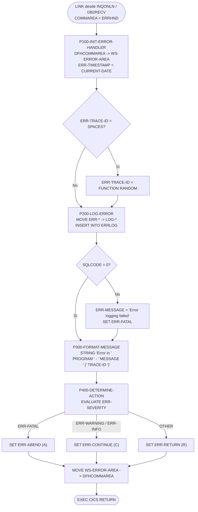
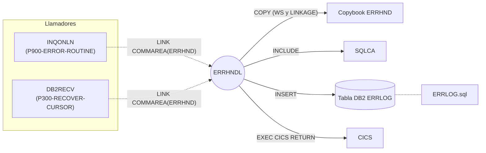

# ERRHNDL — Manejador centralizado de errores online (CICS)

> Generado a partir del análisis del código fuente `src/programs/online/ERRHNDL.cbl`. Ver el [grafo de dependencias global](../technical/dependency-graph.md).

## Ficha técnica
| Campo | Valor |
| --- | --- |
| Ruta | `src/programs/online/ERRHNDL.cbl` |
| Categoría | online |
| Tipo | CICS online (subrutina invocada por `EXEC CICS LINK`) |
| Líneas | 118 |
| Punto de entrada | Subrutina invocada por `LINK` con COMMAREA (no tiene transacción CICS propia; no está definido en `src/cics/PORTDFN.csd`) |
| Invocado por | `INQONLN` (párrafo `P900-ERROR-ROUTINE`), `DB2RECV` (párrafo `P300-RECOVER-CURSOR`) |
| Invoca a | Ningún programa. Escribe (`INSERT`) en la tabla DB2 `ERRLOG`. Comando CICS: `RETURN` |

## Propósito
`ERRHNDL` es el manejador de errores común de la capa online (CICS) del sistema de carteras. Recibe, vía COMMAREA, un bloque de error normalizado (copybook `ERRHND`) rellenado por el programa que detectó el problema, lo persiste en la tabla DB2 `ERRLOG` como registro de auditoría, construye un mensaje legible para el usuario y decide la acción que debe tomar el programa llamador (`R`etornar, `C`ontinuar o `A`bendar) en función de la severidad recibida.

En la arquitectura del sistema ocupa el papel de "Online Error Handler", homólogo de `ERRPROC` (batch) y `DB2ERR` (acceso DB2 en batch). Es una pieza pasiva: no muestra pantallas ni inicia recuperación por sí misma; se limita a registrar, formatear y devolver una decisión en la propia COMMAREA.

## Funcionamiento
El programa no tiene `PROCEDURE DIVISION USING`; accede a la COMMAREA a través de `DFHCOMMAREA` en la `LINKAGE SECTION`. El cuerpo principal ejecuta cuatro párrafos en secuencia y termina con `EXEC CICS RETURN`.

### Secuencia principal (líneas 38-50)
1. `PERFORM P100-INIT-ERROR-HANDLER THRU P100-EXIT`
2. `PERFORM P200-LOG-ERROR THRU P200-EXIT`
3. `PERFORM P300-FORMAT-MESSAGE THRU P300-EXIT`
4. `PERFORM P400-DETERMINE-ACTION THRU P400-EXIT`
5. `EXEC CICS RETURN END-EXEC` (sin `TRANSID`: devuelve el control al programa que hizo el `LINK`).

### `P100-INIT-ERROR-HANDLER`
- Copia la COMMAREA recibida (`DFHCOMMAREA`) a la copia local `WS-ERROR-AREA` (`MOVE DFHCOMMAREA TO WS-ERROR-AREA`). A partir de aquí todo el proceso trabaja sobre la copia de WORKING-STORAGE.
- Sella la hora del error: `MOVE FUNCTION CURRENT-DATE TO ERR-TIMESTAMP`. `CURRENT-DATE` devuelve 21 caracteres con formato `AAAAMMDDhhmmsscc±hhmm`, que se dejan en un campo `PIC X(26)` rellenado con espacios a la derecha.
- Si el llamador no aportó identificador de traza (`ERR-TRACE-ID = SPACES`) genera uno con `MOVE FUNCTION RANDOM TO ERR-TRACE-ID`. La intención es disponer de un identificador de correlación que luego se incrusta en el mensaje devuelto al usuario y en el registro de `ERRLOG`.
- No se comprueba `EIBCALEN`, es decir, no se valida que efectivamente haya llegado una COMMAREA ni su longitud.

### `P200-LOG-ERROR`
- Mueve campo a campo los datos del bloque de error a las host variables de `WS-ERRLOG-RECORD` (`LOG-TIMESTAMP`, `LOG-PROGRAM`, `LOG-PARAGRAPH`, `LOG-SQLCODE`, `LOG-CICS-RESP`, `LOG-SEVERITY`, `LOG-MESSAGE`, `LOG-TRACE-ID`). El campo `ERR-CICS-RESP2` del copybook **no** se registra.
- Ejecuta `EXEC SQL INSERT INTO ERRLOG VALUES (:LOG-TIMESTAMP, ..., :LOG-TRACE-ID)` — inserción posicional de 8 valores, sin lista de columnas.
- Si `SQLCODE NOT = 0` sobrescribe el mensaje con `'Error logging failed'` y eleva la severidad a fatal (`SET ERR-FATAL TO TRUE`). Esto convierte cualquier fallo del propio registro en un error fatal para el llamador, independientemente de la severidad original.
- No hay `COMMIT` ni `SYNCPOINT` explícitos: la inserción queda dentro de la unidad de trabajo CICS de la transacción llamadora y se confirmará (o deshará) con ella.

### `P300-FORMAT-MESSAGE`
Construye el texto para el usuario mediante `STRING ... INTO ERR-MESSAGE` con el patrón:

```
Error in <ERR-PROGRAM> - <ERR-MESSAGE> (<ERR-TRACE-ID>)
```

- `ERR-PROGRAM` se delimita por `SPACE` (se recorta el nombre del programa); el resto de fragmentos por `SIZE`.
- El destino (`ERR-MESSAGE`, 80 bytes) es a la vez uno de los orígenes del `STRING` (véase *Observaciones*). No se inicializa el destino ni se usa `POINTER`/`ON OVERFLOW`.

### `P400-DETERMINE-ACTION`
`EVALUATE TRUE` sobre las condiciones 88 de `ERR-SEVERITY` para fijar `ERR-ACTION`:

| Severidad recibida (`ERR-SEVERITY`) | Acción devuelta (`ERR-ACTION`) |
| --- | --- |
| `F` (`ERR-FATAL`) — incluido el caso en que `P200` la fuerza por fallo del `INSERT` | `A` (`ERR-ABEND`) |
| `W` (`ERR-WARNING`) | `C` (`ERR-CONTINUE`) |
| `I` (`ERR-INFO`) | `C` (`ERR-CONTINUE`) |
| Cualquier otro valor (espacios, valor no previsto) | `R` (`ERR-RETURN`) |

Finalmente devuelve el bloque completo al llamador: `MOVE WS-ERROR-AREA TO DFHCOMMAREA`. Así el llamador recibe el mismo layout `ERRHND` con `ERR-TIMESTAMP`, `ERR-TRACE-ID`, `ERR-MESSAGE` (ya formateado), `ERR-SEVERITY` (posiblemente elevada a `F`) y `ERR-ACTION` actualizados.



## Interfaz
- **Parámetros / LINKAGE SECTION / COMMAREA**: `01 DFHCOMMAREA` que incluye `COPY ERRHND` (estructura `ERROR-HANDLING`). Es una interfaz de entrada/salida: el llamador rellena los campos de contexto y `ERRHNDL` devuelve el mismo bloque actualizado.

  | Campo | PIC | Sentido | Uso en ERRHNDL |
  | --- | --- | --- | --- |
  | `ERR-PROGRAM` | X(8) | Entrada | Programa que detectó el error; se registra y se incluye en el mensaje |
  | `ERR-PARAGRAPH` | X(30) | Entrada | Párrafo (o cursor, en el caso de `DB2RECV`) donde se produjo; se registra |
  | `ERR-SQLCODE` | S9(9) COMP | Entrada | SQLCODE del error; se registra |
  | `ERR-CICS-RESP` | S9(8) COMP | Entrada | `EIBRESP`; se registra |
  | `ERR-CICS-RESP2` | S9(8) COMP | Entrada | `EIBRESP2`; **no se usa** en el programa |
  | `ERR-SEVERITY` | X | Entrada/Salida | `F`/`W`/`I`; puede ser forzada a `F` si falla el `INSERT` |
  | `ERR-MESSAGE` | X(80) | Entrada/Salida | Texto del error; se devuelve reformateado |
  | `ERR-ACTION` | X | Salida | `R`/`C`/`A`, decidido en `P400` |
  | `ERR-TRACE-ID` | X(16) | Entrada/Salida | Se genera si viene a espacios |
  | `ERR-TIMESTAMP` | X(26) | Salida | Se rellena siempre con `CURRENT-DATE` |

  Longitud total de la COMMAREA: 8+30+4+4+4+1+80+1+16+26 = **174 bytes** (los llamadores usan `LENGTH(LENGTH OF WS-ERROR-AREA)`).

- **Ficheros (DDNAME, organización, modo de apertura, clave)**: No aplica. El programa no declara `FILE-CONTROL` ni accede a ficheros.

- **Tablas DB2 y sentencias SQL**:

  | Tabla | Acceso | Sentencia | Host variables | Párrafo |
  | --- | --- | --- | --- | --- |
  | `ERRLOG` | WRITE | `INSERT INTO ERRLOG VALUES (...)` (8 valores posicionales, sin lista de columnas) | `LOG-TIMESTAMP`, `LOG-PROGRAM`, `LOG-PARAGRAPH`, `LOG-SQLCODE`, `LOG-CICS-RESP`, `LOG-SEVERITY`, `LOG-MESSAGE`, `LOG-TRACE-ID` | `P200-LOG-ERROR` |

  El DDL de la tabla está en [`ERRLOG.sql`](../../src/database/db2/ERRLOG.sql). Plan DB2 previsto para la capa online: `PORTPLAN` (`src/database/db2/PORTPLAN.sql`, `DB2ENTRY(PORTDB2)` en el CSD). No existe en el repositorio ningún JCL de precompilación/`BIND` específico para `ERRHNDL`.

- **Mapas BMS / comandos CICS**: No usa mapas BMS. Único comando CICS: `EXEC CICS RETURN` (sin `TRANSID`, sin `COMMAREA`). No usa `HANDLE CONDITION`, `RESP` ni `ABEND`.

- **Códigos de retorno / RETURN-CODE**: No usa `RETURN-CODE` ni `EIBRESP` propios. El "código de retorno" lógico es el campo `ERR-ACTION` de la COMMAREA:
  - `A` (`ERR-ABEND`): error fatal (o fallo al registrar en `ERRLOG`). `INQONLN` responde con `EXEC CICS ABEND ABCODE('IERR')`.
  - `C` (`ERR-CONTINUE`): aviso o información; el llamador puede continuar. `DB2RECV` lo traduce a `RECV-RETRY`.
  - `R` (`ERR-RETURN`): severidad no reconocida; el llamador debería retornar. `DB2RECV` lo trata (junto con `A`) como `RECV-FAILED`.

## Estructuras de datos clave
- **Copybook `ERRHND`** ([`src/copybook/online/ERRHND.cpy`](../../src/copybook/online/ERRHND.cpy)): define la estructura `ERROR-HANDLING` descrita en la tabla anterior, con las condiciones 88 de severidad (`ERR-FATAL`/`ERR-WARNING`/`ERR-INFO`) y de acción (`ERR-RETURN`/`ERR-CONTINUE`/`ERR-ABEND`). Se incluye **dos veces** en el programa: bajo `01 WS-ERROR-AREA` (WORKING-STORAGE, copia de trabajo) y bajo `01 DFHCOMMAREA` (LINKAGE, interfaz). Es el mismo copybook que usan `INQONLN`, `DB2ONLN`, `DB2RECV` y `SECMGR` para preparar sus áreas de error.
- **`WS-DB2-AREA`**: `EXEC SQL INCLUDE SQLCA` — área de comunicación DB2; solo se consulta `SQLCODE`.
- **`WS-ERRLOG-RECORD`** (host variables, dentro de `BEGIN/END DECLARE SECTION`):

  | Host variable | PIC | Origen |
  | --- | --- | --- |
  | `LOG-TIMESTAMP` | X(26) | `ERR-TIMESTAMP` |
  | `LOG-PROGRAM` | X(8) | `ERR-PROGRAM` |
  | `LOG-PARAGRAPH` | X(30) | `ERR-PARAGRAPH` |
  | `LOG-SQLCODE` | S9(9) COMP | `ERR-SQLCODE` |
  | `LOG-CICS-RESP` | S9(8) COMP | `ERR-CICS-RESP` |
  | `LOG-SEVERITY` | X | `ERR-SEVERITY` |
  | `LOG-MESSAGE` | X(80) | `ERR-MESSAGE` |
  | `LOG-TRACE-ID` | X(16) | `ERR-TRACE-ID` |

  Este layout es propio del programa y **no** coincide con el copybook `DBTBLS` (`ERRLOG-RECORD`, `src/copybook/db2/DBTBLS.cpy`) que sí sigue el DDL de `ERRLOG` y que utiliza `DB2ERR`.
- No hay contadores, umbrales de commit ni flags adicionales: el programa es puramente secuencial y sin estado.

## Reglas de negocio y validaciones
1. **Sellado de tiempo obligatorio**: `ERR-TIMESTAMP` se sobrescribe siempre con `FUNCTION CURRENT-DATE`, aunque el llamador hubiera informado un valor.
2. **Identificador de traza**: solo se genera (`FUNCTION RANDOM`) cuando `ERR-TRACE-ID` llega a espacios; si el llamador lo aporta, se respeta para permitir correlación entre programas.
3. **Registro incondicional**: todo error recibido se intenta insertar en `ERRLOG`, sea cual sea su severidad (incluidos `I` informativos).
4. **Escalado de severidad por fallo de log**: si el `INSERT` falla (`SQLCODE NOT = 0`), la severidad pasa a `F` y el mensaje se sustituye por `'Error logging failed'` (se pierde el mensaje original).
5. **Formato del mensaje de usuario**: `Error in <programa> - <mensaje> (<trace-id>)`, limitado a los 80 bytes de `ERR-MESSAGE`.
6. **Mapeo severidad → acción** (`P400-DETERMINE-ACTION`): `F`→`A`, `W`→`C`, `I`→`C`, otro→`R`. No existe ninguna severidad que produzca `R` de forma explícita; `R` es la salida por defecto para valores no previstos.
7. No se valida el contenido de ningún campo de entrada (ni longitud de COMMAREA, ni programa en blanco, ni severidad válida).

## Manejo de errores y recuperación
- **SQLCODE**: solo se comprueba tras el `INSERT INTO ERRLOG`. Cualquier valor distinto de 0 (incluidos avisos positivos como +100 o +802) se trata como fallo → severidad `F`, acción `A`. No se registra el `SQLCODE` del fallo de log en ningún sitio ni se llama a `DB2ERR`/`DB2RECV`.
- **Condiciones CICS**: no se codifica `RESP`/`HANDLE CONDITION`/`HANDLE ABEND`. El único comando (`RETURN`) no tiene tratamiento de errores. Si la COMMAREA no llega (`EIBCALEN = 0`), el acceso a `DFHCOMMAREA` produciría un abend de direccionamiento (p. ej. `ASRA`), ya que no se comprueba `EIBCALEN`.
- **FILE STATUS**: no aplica (sin ficheros).
- **Checkpoint/restart, rollback**: no realiza `SYNCPOINT` ni `ROLLBACK`; la inserción en `ERRLOG` forma parte de la unidad de trabajo del llamador. Si el llamador abenda (`ERR-ABEND` → `ABEND ABCODE('IERR')` en `INQONLN`), CICS deshará la unidad de trabajo y, con ella, **el propio registro de error insertado** (inferencia basada en el comportamiento estándar de backout de CICS/DB2; no hay nada en el código que lo evite).
- **Recuperación**: la responsabilidad recae en el llamador según `ERR-ACTION`:
  - `INQONLN.P900-ERROR-ROUTINE`: rellena `ERR-PROGRAM`, `ERR-PARAGRAPH`, `EIBRESP`/`EIBRESP2`, severidad `W`; tras el `LINK`, si `ERR-ABEND` ejecuta `EXEC CICS ABEND ABCODE('IERR')`; en caso contrario copia `ERR-MESSAGE` a `WS-ERROR-MESSAGE`.
  - `DB2RECV.P300-RECOVER-CURSOR`: inicializa el área a espacios, informa programa, nombre de cursor (en `ERR-PARAGRAPH`), `SQLCODE` y severidad `W`; tras el `LINK`, `ERR-CONTINUE` → `RECV-RETRY`, en otro caso `RECV-FAILED`; devuelve `ERR-MESSAGE` en `RECV-MESSAGE`.
- Llamadas a `ERRPROC`/`DB2ERR`: ninguna. `ERRHNDL` es el equivalente online de esos manejadores y no los reutiliza.

## Dependencias


No invoca a ningún otro programa (ni `CALL` ni `LINK`), no usa mapas BMS, ficheros VSAM ni rutinas de sistema.

## Observaciones y problemas detectados
Problemas en el código fuente (`ERRHNDL.cbl`):

1. **`INSERT` incompatible con el DDL de `ERRLOG`**. La sentencia inserta 8 valores posicionales sin lista de columnas, pero `ERRLOG.sql` define **10 columnas**, nueve de ellas `NOT NULL` (`ERROR_TIMESTAMP`, `PROGRAM_ID`, `ERROR_TYPE`, `ERROR_SEVERITY`, `ERROR_CODE`, `ERROR_MESSAGE`, `PROCESS_DATE`, `PROCESS_TIME`, `USER_ID`, `ADDITIONAL_INFO`). El bind/ejecución fallaría (SQLCODE -117, número de valores distinto del de columnas) y, aunque se corrigiera el número, el orden posicional hace que `LOG-PARAGRAPH X(30)` caiga en `ERROR_TYPE CHAR(1)`, `LOG-SQLCODE` en `ERROR_SEVERITY`, `LOG-CICS-RESP` (numérico) en `ERROR_CODE CHAR(8)`, `LOG-MESSAGE X(80)` en `PROCESS_DATE DATE`, etc. En la práctica, con este DDL **todo error acabaría en `'Error logging failed'` con acción `A` (abend)**.
2. **Formato de `LOG-TIMESTAMP` no válido para DB2**. `FUNCTION CURRENT-DATE` devuelve `AAAAMMDDhhmmsscc±hhmm` (21 caracteres), no el formato `TIMESTAMP` de DB2 (`AAAA-MM-DD-hh.mm.ss.ffffff`). Incluso con la tabla correcta el `INSERT` devolvería SQLCODE -180/-181.
3. **`MOVE FUNCTION RANDOM TO ERR-TRACE-ID`**: `RANDOM` devuelve un valor numérico no entero (0 ≤ x < 1). En Enterprise COBOL el `MOVE` de un numérico con decimales a un campo alfanumérico no está permitido (error de compilación); si compilara con reglas relajadas, el resultado no sería un identificador legible ni reproducible. Probablemente se pretendía usar `EIBTASKN`/`EIBTIME` o un contador.
4. **`STRING` con origen y destino solapados en `P300-FORMAT-MESSAGE`**: `ERR-MESSAGE` es a la vez fuente (`ERR-MESSAGE DELIMITED BY SIZE`) y destino (`INTO ERR-MESSAGE`). El estándar COBOL declara el resultado indefinido cuando los operandos se solapan; además, al usar `DELIMITED BY SIZE` sobre un campo de 80 bytes, el prefijo `Error in <programa> - ` (mín. 12 caracteres) garantiza que el texto original se truncará y que el trace-id y el paréntesis de cierre **nunca** cabrán en los 80 bytes. No hay `ON OVERFLOW`.
5. **Doble nivel 01 anidado con `COPY ERRHND`**. El copybook ya contiene `01 ERROR-HANDLING.`, y el programa lo incluye bajo `01 WS-ERROR-AREA.` y `01 DFHCOMMAREA.`. El resultado son dos registros `01 ERROR-HANDLING` (uno en WORKING-STORAGE y otro en LINKAGE) con los mismos nombres de campo, por lo que todas las referencias a `ERR-*` son **ambiguas** sin cualificación (`OF WS-ERROR-AREA`/`OF DFHCOMMAREA`), y `WS-ERROR-AREA`/`DFHCOMMAREA` quedan como niveles 01 sin subordinados ni `PIC`. Tal como está escrito, el programa no compilaría. (Los programas llamadores repiten el patrón `01 WS-ERROR-AREA. COPY ERRHND.` pero solo una vez, por lo que allí no hay ambigüedad.)
6. **Formato de codificación**: el fuente empieza en la columna 1 (`IDENTIFICATION DIVISION.` sin las 7 columnas de área de secuencia/indicador) a diferencia del resto de programas del repositorio, que respetan el formato fijo. Con el compilador en formato fijo las líneas se interpretarían incorrectamente.
7. **No se comprueba `EIBCALEN`** antes de acceder a `DFHCOMMAREA`.
8. **`ERR-CICS-RESP2` no se registra** en `ERRLOG` aunque el copybook lo prevé y `INQONLN` lo rellena; se pierde información de diagnóstico.
9. **Pérdida del mensaje original** cuando falla el log (`'Error logging failed'` sobrescribe `ERR-MESSAGE`), y el `SQLCODE` del fallo no se guarda en ningún campo.
10. **Escalado desproporcionado**: un error meramente informativo (`I`) cuyo registro falle se convierte en abend (`A`) del llamador.
11. **Host variables de nivel 05 sin 01 dentro de `DECLARE SECTION`** (`WS-ERRLOG-RECORD` se declara fuera y el `BEGIN DECLARE SECTION` va después del 01): sintácticamente inusual; el precompilador DB2 de z/OS no exige `DECLARE SECTION`, por lo que es más una anomalía de estilo que un error funcional.

Inconsistencias con la configuración y la documentación:

12. **`ERRHNDL` no está definido en `src/cics/PORTDFN.csd`**, mientras que el resto de programas online (`INQONLN`, `INQPORT`, `INQHIST`, `DB2ONLN`, `CURSMGR`, `DB2RECV`, `SECMGR`) sí tienen `DEFINE PROGRAM`. El `LINK` fallaría con `PGMIDERR` salvo que la región tenga autoinstall de programas.
13. **`system-architecture.md` atribuye a `ERRHNDL` funciones que el código no implementa**: "Screen error display", "Session recovery", "User message management" (sección 6.1.1) y un flujo `ERRHNDL → Error Screen` / `ERRHNDL → Recovery` / `ERRHNDL → DB2RECV: Initiate Recovery` (secciones 6.1.2 y 6.2.2). El programa no envía mapas ni invoca a `DB2RECV`; la relación real es la inversa (`DB2RECV` invoca a `ERRHNDL`). Manda el código.
14. **Dependencias documentadas que no existen en el código**: la tabla 5.1 de `system-architecture.md` indica que `INQPORT` e `INQHIST` dependen de `ERRHNDL` y que `DB2ONLN → ERRHNDL`; ninguno de esos tres programas contiene un `LINK PROGRAM('ERRHNDL')`. Los únicos llamadores reales son `INQONLN` y `DB2RECV` (coincide con `dependency-graph.json`). La misma tabla dice "ERRHNDL | None" en dependencias, cuando depende del copybook `ERRHND` y de la tabla `ERRLOG`.
15. **Tres definiciones distintas de `ERRLOG`**: `src/database/db2/ERRLOG.sql` (10 columnas), `documentation/technical/data-dictionary.md` §3.2 (7 columnas: `ERROR_CODE CHAR(4)`, `ACCOUNT_NO`, `FUND_ID`, `TRANS_ID`, `ERROR_DESC`) y el layout implícito de 8 columnas que asume `ERRHNDL`. Ninguna de las tres coincide con las demás. `DB2ERR` (batch) usa el copybook `DBTBLS`, coherente con `ERRLOG.sql`; `ERRHNDL` debería reutilizarlo.
16. `ERRLOG.sql` concede `INSERT` al rol `POSAPP`; el CSD define `DB2ENTRY(PORTDB2)` con `AUTHTYPE(USERID)`, de modo que el `INSERT` desde CICS se autoriza con el usuario de la transacción. No hay en el repositorio `GRANT` alguno para usuarios de terminal, por lo que la autorización real del `INSERT` online no está garantizada por lo versionado (inferencia).

## Referencias
- Programa: [ERRHNDL.cbl](../../src/programs/online/ERRHNDL.cbl)
- Copybook de interfaz: [ERRHND.cpy](../../src/copybook/online/ERRHND.cpy)
- DDL de la tabla: [ERRLOG.sql](../../src/database/db2/ERRLOG.sql); layout alternativo en [DBTBLS.cpy](../../src/copybook/db2/DBTBLS.cpy)
- Plan DB2: [PORTPLAN.sql](../../src/database/db2/PORTPLAN.sql)
- Definiciones CICS: [PORTDFN.csd](../../src/cics/PORTDFN.csd)
- Programas llamadores: [INQONLN.cbl](../../src/programs/online/INQONLN.cbl), [DB2RECV.cbl](../../src/programs/online/DB2RECV.cbl)
- Manejadores homólogos: [ERRPROC.cbl](../../src/programs/common/ERRPROC.cbl) (batch), [DB2ERR.cbl](../../src/programs/common/DB2ERR.cbl) (DB2)
- Documentación de contexto: [system-architecture.md](../technical/system-architecture.md), [data-dictionary.md](../technical/data-dictionary.md), [dependency-graph.md](../technical/dependency-graph.md)
