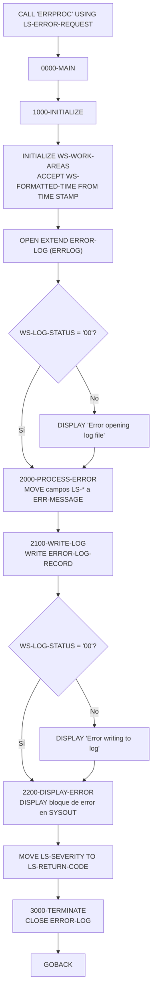
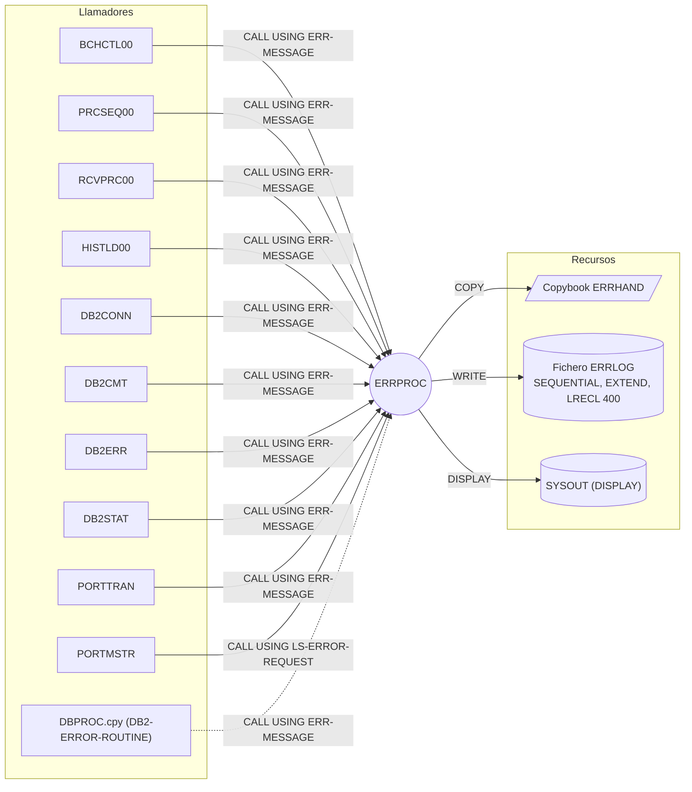

# ERRPROC — Subrutina estándar de proceso de errores batch

> Generado a partir del análisis del código fuente `src/programs/common/ERRPROC.cbl`. Ver el [grafo de dependencias global](../technical/dependency-graph.md).

## Ficha técnica
| Campo | Valor |
| --- | --- |
| Ruta | `src/programs/common/ERRPROC.cbl` |
| Categoría | common |
| Tipo | subrutina común (entorno batch, sin CICS ni DB2) |
| Líneas | 107 |
| Punto de entrada | subrutina invocada por `CALL 'ERRPROC' USING ...` desde otros programas; no existe JCL ni transacción CICS propia |
| Invocado por | `BCHCTL00`, `DB2CMT`, `DB2CONN`, `DB2ERR`, `DB2STAT`, `HISTLD00`, `PORTMSTR`, `PORTTRAN`, `PRCSEQ00`, `RCVPRC00` (y el copybook de procedimientos `DBPROC.cpy`, párrafo `DB2-ERROR-ROUTINE`) |
| Invoca a | ningún programa (no hay `CALL`, `EXEC CICS LINK` ni `EXEC SQL`) |

## Propósito
`ERRPROC` es el manejador de errores centralizado de la capa batch de la CLBS. Recibe de cualquier programa llamador una petición de error (programa origen, categoría, código, severidad, texto y detalles), le añade la marca de tiempo actual, la escribe como registro de 400 bytes en el fichero secuencial de log `ERRLOG` (modo `EXTEND`, es decir, añadiendo al final) y la vuelca también a `SYSOUT` mediante `DISPLAY`. Finalmente devuelve al llamador la severidad recibida como código de retorno en el propio área de comunicación. Según `system-architecture.md` (§6.1.1) es el "Batch Error Processor", homólogo de `ERRHNDL` (online/CICS) y `DB2ERR` (errores SQL); a diferencia de estos dos, `ERRPROC` no escribe en DB2 sino en un fichero plano.

## Funcionamiento
El programa es lineal: no tiene bucle de proceso porque trata exactamente un error por invocación. Cada `CALL` abre, escribe y cierra el fichero de log.

### `0000-MAIN`
Ejecuta en secuencia `1000-INITIALIZE`, `2000-PROCESS-ERROR` y `3000-TERMINATE` y termina con `GOBACK`. No se establece el registro especial `RETURN-CODE`.

### `1000-INITIALIZE`
1. `INITIALIZE WS-WORK-AREAS` — pone a valor inicial `WS-LOG-STATUS` y `WS-FORMATTED-TIME`.
2. `ACCEPT WS-FORMATTED-TIME FROM TIME STAMP` — obtiene la marca de tiempo (26 caracteres). Ver observaciones: `TIME STAMP` no es un origen estándar de `ACCEPT` en Enterprise COBOL.
3. `OPEN EXTEND ERROR-LOG` — abre el fichero `ERRLOG` en modo extensión (append). Si `WS-LOG-STATUS` ≠ `'00'` solo se emite `DISPLAY 'Error opening log file: ' WS-LOG-STATUS`; **el flujo continúa** igualmente.

### `2000-PROCESS-ERROR`
Construye el mensaje estándar `ERR-MESSAGE` (definido en el copybook `ERRHAND`, en WORKING-STORAGE del propio `ERRPROC`) a partir del área recibida `LS-ERROR-REQUEST`:

| Origen (LINKAGE) | Destino (`ERR-MESSAGE`) | Observación |
| --- | --- | --- |
| `WS-FORMATTED-TIME` X(26) | `ERR-TIMESTAMP` X(18) | truncamiento a 18 bytes |
| `LS-PROGRAM-ID` X(8) | `ERR-PROGRAM` X(8) | |
| `LS-CATEGORY` X(2) | `ERR-CATEGORY` X(2) | |
| `LS-ERROR-CODE` X(4) | `ERR-CODE` X(4) | |
| `LS-SEVERITY` S9(4) COMP | `ERR-SEVERITY` S9(4) COMP | |
| `LS-ERROR-TEXT` X(80) | `ERR-TEXT` X(80) | |
| `LS-ERROR-DETAILS` X(256) | `ERR-DETAILS` X(256) | |

Después ejecuta `2100-WRITE-LOG` y `2200-DISPLAY-ERROR`, y por último `MOVE LS-SEVERITY TO LS-RETURN-CODE`, con lo que el llamador recibe como código de retorno la misma severidad que envió.

### `2100-WRITE-LOG`
`MOVE ERR-MESSAGE TO LOG-DATA` (370 bytes copiados en un registro de 400; los 30 restantes quedan a espacios) y `WRITE ERROR-LOG-RECORD`. Si `WS-LOG-STATUS` ≠ `'00'` se emite `DISPLAY 'Error writing to log: ' WS-LOG-STATUS` y se continúa.

### `2200-DISPLAY-ERROR`
Vuelca en `SYSOUT` un bloque delimitado por líneas de `=` con la marca de tiempo, programa, categoría, código, severidad, mensaje y detalles. Se ejecuta siempre, con independencia de la severidad y de si el `WRITE` tuvo éxito.

### `3000-TERMINATE`
`CLOSE ERROR-LOG`. No se comprueba el `FILE STATUS` del cierre.

## Interfaz
- **Parámetros / LINKAGE SECTION / COMMAREA**: un único parámetro por referencia, `LS-ERROR-REQUEST` (354 bytes):

  | Campo | PIC | Desplazamiento | Sentido | Descripción |
  | --- | --- | --- | --- | --- |
  | `LS-PROGRAM-ID` | X(8) | 0 | entrada | Programa que detectó el error |
  | `LS-CATEGORY` | X(2) | 8 | entrada | Categoría (`VS`, `VL`, `PR`, `SY` según `ERRHAND`) |
  | `LS-ERROR-CODE` | X(4) | 10 | entrada | Código de error (p. ej. `FILE STATUS`) |
  | `LS-SEVERITY` | S9(4) COMP | 14 | entrada | Severidad (0/4/8/12/16 según `ERRHAND`) |
  | `LS-ERROR-TEXT` | X(80) | 16 | entrada | Texto del mensaje |
  | `LS-ERROR-DETAILS` | X(256) | 96 | entrada | Detalles adicionales (p. ej. clave del registro) |
  | `LS-RETURN-CODE` | S9(4) COMP | 352 | salida | Se rellena con el valor de `LS-SEVERITY` |

  Ningún campo de entrada se valida ni se normaliza.

- **Ficheros (DDNAME, organización, modo de apertura, clave)**:

  | Fichero COBOL | DDNAME | Organización | Modo | Registro | Clave | FILE STATUS |
  | --- | --- | --- | --- | --- | --- | --- |
  | `ERROR-LOG` | `ERRLOG` | `SEQUENTIAL` (`RECORDING MODE F`, `BLOCK CONTAINS 0`) | `OPEN EXTEND` (append) | `ERROR-LOG-RECORD` / `LOG-DATA` X(400) | no aplica | `WS-LOG-STATUS` |

  No existe en el repositorio ningún JCL que aporte la tarjeta `//ERRLOG DD` para los jobs que invocan a `ERRPROC`; la única definición de `ERRLOG` como DD está en `src/jcl/batch/RPTAUD.jcl` (`DSN=PROD.ERROR.LOG`) para el programa `RPTAUD00`, que no llama a `ERRPROC`. Tampoco aparece en `src/database/vsam/vsam-definitions.txt`.

- **Tablas DB2 y sentencias SQL**: No aplica (el programa no contiene `EXEC SQL`). Nótese que existe una tabla DB2 también llamada `ERRLOG` (`src/database/db2/ERRLOG.sql`) usada por `DB2ERR` y `ERRHNDL`; `ERRPROC` **no** escribe en ella.
- **Mapas BMS / comandos CICS**: No aplica.
- **Códigos de retorno / RETURN-CODE**:
  - `LS-RETURN-CODE` ← `LS-SEVERITY` (eco de la severidad recibida; valores esperados según `ERRHAND`: `+0` éxito, `+4` aviso, `+8` error, `+12` grave, `+16` terminal).
  - El registro especial `RETURN-CODE` **no** se modifica.
  - Los fallos de `OPEN`/`WRITE` del propio log **no** alteran el código de retorno: solo se notifican por `DISPLAY`.

## Estructuras de datos clave
- **Copybook `ERRHAND`** (`src/copybook/common/ERRHAND.cpy`), incluido en WORKING-STORAGE. Aporta:
  - `ERR-CATEGORIES`: constantes de categoría `ERR-CAT-VSAM` (`VS`), `ERR-CAT-VALID` (`VL`), `ERR-CAT-PROC` (`PR`), `ERR-CAT-SYSTEM` (`SY`). `ERRPROC` no las usa directamente; son para los llamadores.
  - `ERR-RETURN-CODES`: `ERR-SUCCESS` (+0), `ERR-WARNING` (+4), `ERR-ERROR` (+8), `ERR-SEVERE` (+12), `ERR-TERMINAL` (+16).
  - `ERR-MESSAGE` (370 bytes): `ERR-TIMESTAMP` (`ERR-DATE` X(10) + `ERR-TIME` X(8)), `ERR-PROGRAM` X(8), `ERR-CATEGORY` X(2), `ERR-CODE` X(4), `ERR-SEVERITY` S9(4) COMP, `ERR-TEXT` X(80), `ERR-DETAILS` X(256). Es la estructura que se graba en `ERRLOG` y se muestra por `DISPLAY`.
  - `ERR-VSAM-STATUSES` y `ERR-VSAM-MSGS`: códigos `FILE STATUS` VSAM (`00`, `22`, `23`, `10`) y textos asociados; tampoco los usa `ERRPROC`, sino los llamadores (p. ej. `PORTMSTR.2100-HANDLE-VSAM-ERROR`).
- **`WS-WORK-AREAS`** (propio del programa):
  - `WS-LOG-STATUS` X(2): `FILE STATUS` de `ERROR-LOG`.
  - `WS-FORMATTED-TIME` X(26): marca de tiempo obtenida con `ACCEPT ... FROM TIME STAMP`.
- **`ERROR-LOG-RECORD` / `LOG-DATA`** X(400): registro de salida; contiene `ERR-MESSAGE` (370 bytes) más 30 bytes de relleno. El campo `ERR-SEVERITY` se graba en binario (2 bytes COMP) dentro de un registro de texto.
- No hay contadores, umbrales de commit ni flags de control: el programa es apátrida (stateless) entre llamadas.

## Reglas de negocio y validaciones
El programa no implementa reglas de negocio propiamente dichas; su comportamiento es fijo:
1. Todo error recibido se registra **siempre** en `ERRLOG` y **siempre** se muestra en `SYSOUT`, sin filtrado por severidad ni por categoría.
2. La marca de tiempo la fija `ERRPROC` en el momento de la llamada (no la proporciona el llamador).
3. El código de retorno devuelto al llamador es idéntico a la severidad recibida (`LS-RETURN-CODE = LS-SEVERITY`); `ERRPROC` no escala ni reclasifica severidades.
4. El fichero de log se abre en modo `EXTEND`, por lo que los registros se acumulan al final del dataset entre ejecuciones.
5. No se realizan validaciones de los datos de entrada (categoría, código o severidad fuera de los valores definidos en `ERRHAND` se aceptan tal cual).

## Manejo de errores y recuperación
- **FILE STATUS de `ERRLOG`**: se comprueba tras `OPEN` y tras `WRITE`. En ambos casos la única acción es un `DISPLAY` informativo; el programa no aborta, no reintenta ni informa del fallo al llamador. Si el `OPEN` falla se intenta igualmente el `WRITE` y el `CLOSE` (que producirán a su vez estados distintos de `'00'`; el del `CLOSE` ni siquiera se comprueba).
- **SQLCODE / condiciones CICS**: no aplica.
- **Checkpoint / restart / rollback**: no implementados en `ERRPROC`. `system-architecture.md` §6.3 asocia a `ERRPROC` el método de recuperación "Checkpoint" (batch core) y "Restart" (utilidades), pero el código no contiene nada al respecto; la recuperación, si existe, la hace el llamador (p. ej. `HISTLD00.9000-ERROR-ROUTINE` ejecuta `ROLLBACK WORK` inmediatamente después de llamar a `ERRPROC`).
- **Llamadas a otros manejadores**: ninguna. `ERRPROC` es el último eslabón; no delega en `DB2ERR` ni en `ERRHNDL`.
- **Errores propios**: al no modificar `RETURN-CODE` ni provocar abend, un fallo total del log (p. ej. DD `ERRLOG` ausente) pasa inadvertido salvo por las líneas en `SYSOUT`.

## Dependencias

## Observaciones y problemas detectados
1. **Desalineación grave entre la interfaz de `ERRPROC` y la de casi todos sus llamadores.** `ERRPROC` espera `LS-ERROR-REQUEST` (354 bytes, empieza por `LS-PROGRAM-ID`), pero `BCHCTL00`, `PRCSEQ00`, `RCVPRC00`, `HISTLD00`, `DB2CONN`, `DB2CMT`, `DB2ERR`, `DB2STAT`, `PORTTRAN` y `DBPROC.cpy` le pasan `ERR-MESSAGE` (370 bytes, empieza por `ERR-TIMESTAMP` de 18 bytes). Como el paso es por referencia, `ERRPROC` interpreta los 18 bytes de `ERR-TIMESTAMP` del llamador (normalmente espacios o basura, porque los llamadores no lo rellenan) como `LS-PROGRAM-ID` + `LS-CATEGORY` + `LS-ERROR-CODE` + `LS-SEVERITY` + 2 bytes de `LS-ERROR-TEXT`; el `ERR-PROGRAM` y `ERR-TEXT` reales del llamador aparecen desplazados dentro de `LS-ERROR-TEXT`, y `MOVE LS-SEVERITY TO LS-RETURN-CODE` sobrescribe los bytes 238-239 de `ERR-DETAILS` del llamador. El log y el `DISPLAY` resultantes quedan corruptos y el llamador nunca recibe un código de retorno utilizable. Solo `PORTMSTR` usa la estructura correcta (`LS-ERROR-REQUEST`).
2. **`PORTMSTR` usa `LS-ERROR-REQUEST`, `LS-PROGRAM-ID`, `LS-CATEGORY`, `LS-ERROR-CODE`, `LS-SEVERITY`, `LS-ERROR-TEXT`, `LS-ERROR-DETAILS` y constantes de `ERRHAND` (`ERR-CAT-VSAM`, `ERR-WARNING`, …) sin declararlos**: no tiene `COPY ERRHAND` ni define esos campos en su LINKAGE SECTION (solo `LS-COMMAND-AREA`). Probablemente no compila tal cual. (Problema del llamador, no de `ERRPROC`, pero afecta a la única invocación con la interfaz correcta.)
3. **`ACCEPT WS-FORMATTED-TIME FROM TIME STAMP`**: `TIME STAMP` no es un origen estándar de `ACCEPT` en Enterprise COBOL (los válidos son `DATE`, `DAY`, `DAY-OF-WEEK`, `TIME` y nombres mnemotécnicos definidos en `SPECIAL-NAMES`). Probablemente requiere una extensión o un mnemónico no definido en el repositorio; otros programas del repositorio (`ERRHNDL`, `SECMGR`, `DB2ONLN`) usan `FUNCTION CURRENT-DATE`, que sería la forma portable.
4. **Truncamiento de la marca de tiempo**: `WS-FORMATTED-TIME` es X(26) pero `ERR-TIMESTAMP` es X(18) (`ERR-DATE` X(10) + `ERR-TIME` X(8)), por lo que se pierden los 8 últimos caracteres; además la subdivisión fecha/hora de `ERR-TIMESTAMP` no se garantiza que coincida con el formato devuelto por `TIME STAMP`.
5. **Fallos del propio log no son fatales ni se comunican**: si `OPEN EXTEND` falla, el programa sigue haciendo `WRITE` y `CLOSE`; ninguno de los tres estados afecta a `LS-RETURN-CODE` ni a `RETURN-CODE`. El `FILE STATUS` del `CLOSE` no se comprueba. En un sistema real esto puede hacer que se pierdan errores silenciosamente.
6. **No se establece `RETURN-CODE`**: el llamador solo puede conocer el resultado a través de `LS-RETURN-CODE`, que (véase 1) casi nunca está correctamente mapeado.
7. **Campo binario dentro de un registro de texto**: `ERR-SEVERITY` (S9(4) COMP) se graba tal cual en `LOG-DATA`, lo que dificulta leer o imprimir el fichero `ERRLOG` como texto.
8. **Definición incoherente del DDNAME `ERRLOG` en el repositorio**: `ERRPROC` lo define como fichero `SEQUENTIAL` de 400 bytes, mientras `RPTAUD00` lo declara `ORGANIZATION IS INDEXED` con `RECORD KEY IS ERR-KEY` (KSDS). El único JCL que lo aporta (`RPTAUD.jcl`, `DSN=PROD.ERROR.LOG`) es para `RPTAUD00`. Ningún JCL del repositorio incluye `//ERRLOG DD` para los jobs que ejecutan programas llamadores de `ERRPROC`, y `vsam-definitions.txt` no lo define. Además el mismo nombre `ERRLOG` designa una tabla DB2 (`ERRLOG.sql`) con un esquema distinto, alimentada por `DB2ERR` y `ERRHNDL`: existen por tanto dos almacenes de errores no unificados.
9. **Escala de severidad inconsistente**: `ERRHAND` usa 0/4/8/12/16, mientras que la tabla DB2 `ERRLOG` documenta `ERROR_SEVERITY` como 1=Info … 4=Severe, y `data-dictionary.md` §3.2 describe un `ERRLOG` con columnas distintas a las de `ERRLOG.sql`.
10. **Discrepancias con `system-architecture.md`**:
    - §5.1 lista como dependientes de `ERRPROC` a `POSUPDT`, `RPTPOS00`, `RPTAUD00`, `RPTSTA00`, `UTLMNT00`, `UTLVAL00`, `UTLMON00`, `TSTGEN00` y `TSTVAL00`; ninguno de ellos contiene `CALL 'ERRPROC'` en `src/` (varios solo hacen `COPY ERRHAND`).
    - §6.1.2 muestra que `ERRPROC` genera un "Error Report" y §6.3 le atribuye recuperación por "Checkpoint"/"Restart"; el código solo escribe el log y hace `DISPLAY`, sin informe ni lógica de checkpoint.
11. **Diseño**: abrir y cerrar el fichero en cada invocación es funcional pero costoso si se generan muchos errores (por ejemplo desde el bucle de `PORTTRAN`); además, al no haber reintentos ni sincronización, el modo `EXTEND` compartido entre varios jobs concurrentes podría dar contención sobre el dataset (inferencia; depende de la definición del dataset, no presente en el repositorio).

## Referencias
- Programa: [ERRPROC.cbl](../../src/programs/common/ERRPROC.cbl)
- Copybook: [ERRHAND.cpy](../../src/copybook/common/ERRHAND.cpy)
- Copybook de procedimientos DB2 que también invoca a ERRPROC: [DBPROC.cpy](../../src/copybook/db2/DBPROC.cpy)
- Llamadores: [BCHCTL00.cbl](../../src/programs/batch/BCHCTL00.cbl), [PRCSEQ00.cbl](../../src/programs/batch/PRCSEQ00.cbl), [RCVPRC00.cbl](../../src/programs/batch/RCVPRC00.cbl), [HISTLD00.cbl](../../src/programs/batch/HISTLD00.cbl), [DB2CONN.cbl](../../src/programs/common/DB2CONN.cbl), [DB2CMT.cbl](../../src/programs/common/DB2CMT.cbl), [DB2ERR.cbl](../../src/programs/common/DB2ERR.cbl), [DB2STAT.cbl](../../src/programs/common/DB2STAT.cbl), [PORTMSTR.cbl](../../src/programs/portfolio/PORTMSTR.cbl), [PORTTRAN.cbl](../../src/programs/portfolio/PORTTRAN.cbl)
- Otros usos del DDNAME `ERRLOG`: [RPTAUD00.cbl](../../src/programs/batch/RPTAUD00.cbl), [RPTAUD.jcl](../../src/jcl/batch/RPTAUD.jcl)
- Tabla DB2 homónima: [ERRLOG.sql](../../src/database/db2/ERRLOG.sql)
- Definiciones VSAM: [vsam-definitions.txt](../../src/database/vsam/vsam-definitions.txt)
- Documentación de arquitectura: [system-architecture.md](../technical/system-architecture.md), [data-dictionary.md](../technical/data-dictionary.md), [dependency-graph.md](../technical/dependency-graph.md)
