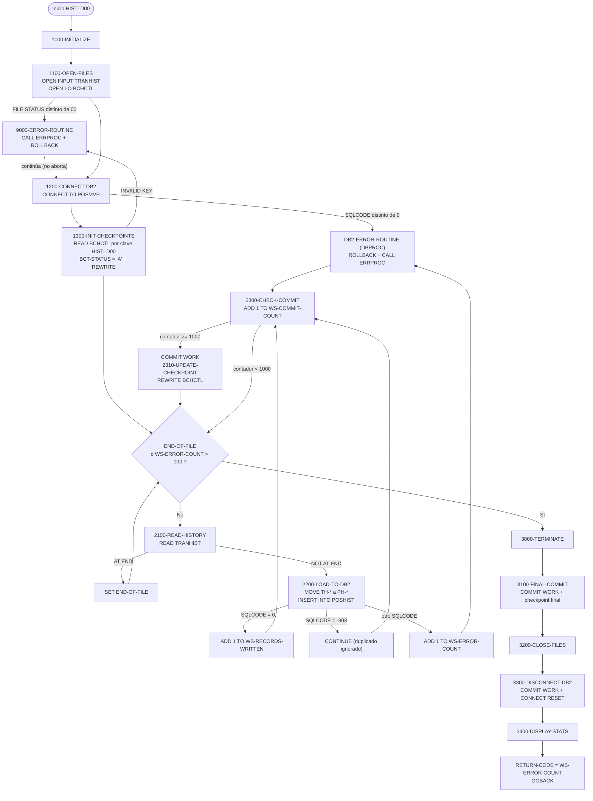
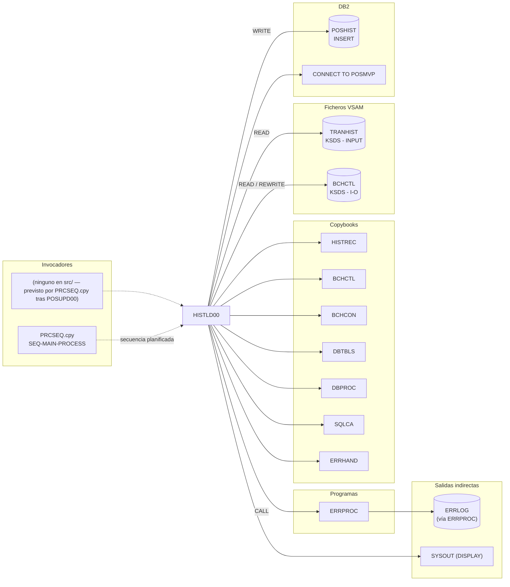

# HISTLD00 — Carga del histórico de transacciones VSAM en la tabla DB2 POSHIST

> Generado a partir del análisis del código fuente `src/programs/batch/HISTLD00.cbl`. Ver el [grafo de dependencias global](../technical/dependency-graph.md).

## Ficha técnica
| Campo | Valor |
| --- | --- |
| Ruta | `src/programs/batch/HISTLD00.cbl` |
| Categoría | batch |
| Tipo | batch (programa principal con SQL embebido, sin CICS) |
| Líneas | 233 |
| Punto de entrada | ninguno conocido en el repositorio (no existe JCL en `src/jcl/` que ejecute `PGM=HISTLD00`; la documentación de arquitectura lo sitúa como paso posterior a `POSUPD00` en el flujo batch diario) |
| Invocado por | Nadie en `src/` (sin `CALL`, sin JCL, sin CICS). Aparece en la secuencia `SEQ-MAIN-PROCESS` del copybook `PRCSEQ.cpy` (`TRNVAL00` → `POSUPD00` → `HISTLD00`) |
| Invoca a | `ERRPROC` (`CALL 'ERRPROC' USING ERR-MESSAGE`, tanto desde `9000-ERROR-ROUTINE` como desde `DB2-ERROR-ROUTINE` de `DBPROC`) |

## Propósito
`HISTLD00` ("Position History DB2 Load Program") es el programa batch que vuelca el fichero VSAM de histórico de transacciones (`TRANHIST`) a la tabla DB2 `POSHIST`, de modo que el histórico quede disponible para la capa de reporting y para la consulta online (`INQHIST`). Lee el fichero secuencialmente, mapea cada registro a la estructura host `POSHIST-RECORD` y lo inserta con un `INSERT` fila a fila, haciendo `COMMIT` cada 1000 registros y actualizando un registro de control/checkpoint en el fichero VSAM `BCHCTL`. Dentro del flujo batch descrito en `system-architecture.md` es el tercer paso del ciclo diario (`TRNVAL00` → `POSUPD00` → `HISTLD00` → reporting), aunque en el repositorio no existe JCL que lo lance.

## Funcionamiento

### `0000-MAIN`
1. `PERFORM 1000-INITIALIZE`: abre ficheros, conecta a DB2 y marca el registro de control como activo.
2. `PERFORM 2000-PROCESS UNTIL END-OF-FILE OR WS-ERROR-COUNT > 100`: bucle principal, un registro por iteración. Se abandona al llegar al fin de fichero o al superar los 100 errores SQL acumulados.
3. `PERFORM 3000-TERMINATE`: commit final, cierre de ficheros, desconexión de DB2 y estadísticas por `DISPLAY`.
4. `MOVE WS-ERROR-COUNT TO RETURN-CODE` y `GOBACK`: el código de retorno del paso es literalmente el número de errores.

### `1000-INITIALIZE`
- `1100-OPEN-FILES`: `OPEN INPUT TRANSACTION-HISTORY` (DD `TRANHIST`) y `OPEN I-O BATCH-CONTROL-FILE` (DD `BCHCTL`). Si el `FILE STATUS` no es `'00'` se rellena `ERR-TEXT` y se ejecuta `9000-ERROR-ROUTINE`, pero el programa **continúa** (no hay `STOP RUN`/`GOBACK`).
- `1200-CONNECT-DB2`: `PERFORM CONNECT-TO-DB2` (párrafo del copybook `DBPROC`): `EXEC SQL CONNECT TO POSMVP END-EXEC`; si `SQLCODE` ≠ 0 ejecuta `DB2-ERROR-ROUTINE`.
- `1300-INIT-CHECKPOINTS`: construye la clave del registro de control con `MOVE SPACES TO BCT-KEY` y `MOVE 'HISTLD00' TO BCT-JOB-NAME` (fecha de proceso y secuencia quedan en blanco), hace `READ BATCH-CONTROL-FILE` (lectura directa por clave, el fichero es `ACCESS MODE IS DYNAMIC`) y, si no existe (`INVALID KEY`), llama a `9000-ERROR-ROUTINE`. A continuación, exista o no el registro, mueve `BCT-STAT-ACTIVE` (`'A'`) a `BCT-STATUS` y hace `REWRITE BATCH-CONTROL-RECORD` sin comprobar el resultado.

### `2000-PROCESS` (bucle)
- `2100-READ-HISTORY`: `READ TRANSACTION-HISTORY`; en `AT END` activa `END-OF-FILE`, en `NOT AT END` incrementa `WS-RECORDS-READ`.
- Si `MORE-RECORDS`:
  - `2200-LOAD-TO-DB2`: `INITIALIZE POSHIST-RECORD` y trece `MOVE` de campos `TH-*` del registro de entrada a campos `PH-*` de la estructura host (cuenta, cartera, fecha y hora de transacción, tipo, valor, cantidad, precio, importe, comisiones, importe total, coste base y plusvalía). Después `EXEC SQL INSERT INTO POSHIST VALUES (:POSHIST-RECORD) END-EXEC` y evaluación de `SQLCODE`:
    - `0` → `ADD 1 TO WS-RECORDS-WRITTEN`.
    - `-803` (clave duplicada) → `CONTINUE`: el registro se ignora silenciosamente, sin contar como escrito ni como error.
    - cualquier otro → `ADD 1 TO WS-ERROR-COUNT` y `PERFORM DB2-ERROR-ROUTINE` (que hace `ROLLBACK WORK` y llama a `ERRPROC`).
  - `2300-CHECK-COMMIT`: `ADD 1 TO WS-COMMIT-COUNT`; cuando `WS-COMMIT-COUNT >= WS-COMMIT-THRESHOLD` (1000) ejecuta `EXEC SQL COMMIT WORK`, pone el contador a 0 y ejecuta `2310-UPDATE-CHECKPOINT`.
  - `2310-UPDATE-CHECKPOINT`: copia `WS-RECORDS-READ` y `WS-RECORDS-WRITTEN` a `BCT-RECORDS-READ` / `BCT-RECORDS-WRITTEN` y hace `REWRITE BATCH-CONTROL-RECORD`; en `INVALID KEY` invoca `9000-ERROR-ROUTINE`.

### `3000-TERMINATE`
- `3100-FINAL-COMMIT`: `EXEC SQL COMMIT WORK` y `PERFORM 2310-UPDATE-CHECKPOINT` (último checkpoint con los contadores finales).
- `3200-CLOSE-FILES`: `CLOSE TRANSACTION-HISTORY BATCH-CONTROL-FILE` (sin comprobar `FILE STATUS`).
- `3300-DISCONNECT-DB2`: `PERFORM DISCONNECT-FROM-DB2` (`DBPROC`): un segundo `COMMIT WORK` seguido de `CONNECT RESET`.
- `3400-DISPLAY-STATS`: `DISPLAY` de registros leídos, escritos y errores.

### `9000-ERROR-ROUTINE`
`MOVE 'HISTLD00' TO ERR-PROGRAM`, `CALL 'ERRPROC' USING ERR-MESSAGE` y `EXEC SQL ROLLBACK WORK END-EXEC`. No modifica ningún flag ni termina la ejecución: el control vuelve al párrafo que lo invocó.

## Interfaz

- **Parámetros / LINKAGE SECTION / COMMAREA**: No aplica. El programa no tiene `LINKAGE SECTION` ni `PROCEDURE DIVISION USING`; no recibe `PARM` del JCL.

- **Ficheros (DDNAME, organización, modo de apertura, clave)**:

| DDNAME | Nombre lógico (FD) | Organización / acceso | Modo de apertura | Clave (`RECORD KEY`) | FILE STATUS | Copybook del registro |
| --- | --- | --- | --- | --- | --- | --- |
| `TRANHIST` | `TRANSACTION-HISTORY` | `INDEXED` (KSDS), `ACCESS MODE IS SEQUENTIAL` | `INPUT` | `TH-KEY` (**no definido** en el FD: `HISTREC.cpy` define `HIST-KEY`) | `WS-TH-STATUS` | `HISTREC` |
| `BCHCTL` | `BATCH-CONTROL-FILE` | `INDEXED` (KSDS), `ACCESS MODE IS DYNAMIC` | `I-O` | `BCT-KEY` (= `BCT-JOB-NAME` X(8) + `BCT-PROCESS-DATE` X(8) + `BCT-SEQUENCE-NO` 9(4)) | `WS-BCT-STATUS` | `BCHCTL` |

  Sobre `TRANHIST` se hacen solo `READ` secuenciales; sobre `BCHCTL` un `READ` directo por clave en `1300-INIT-CHECKPOINTS` y `REWRITE` en `1300-INIT-CHECKPOINTS`, `2310-UPDATE-CHECKPOINT` y `3100-FINAL-COMMIT`. El programa no escribe ningún fichero de salida; las estadísticas van a `SYSOUT` mediante `DISPLAY`.

- **Tablas DB2 y sentencias SQL**:

| Tabla / recurso | Sentencia | Párrafo | Acceso | Observaciones |
| --- | --- | --- | --- | --- |
| Servidor/BD `POSMVP` | `CONNECT TO POSMVP` | `CONNECT-TO-DB2` (`DBPROC`) | — | `POSMVP` es el nombre de la base de datos creada en `POSHIST.sql` |
| `POSHIST` | `INSERT INTO POSHIST VALUES (:POSHIST-RECORD)` | `2200-LOAD-TO-DB2` | WRITE | Inserción por estructura host completa (18 columnas, sin lista de columnas explícita) |
| — | `COMMIT WORK` | `2300-CHECK-COMMIT`, `3100-FINAL-COMMIT`, `DISCONNECT-FROM-DB2` | — | Cada 1000 registros procesados y al terminar (dos veces) |
| — | `ROLLBACK WORK` | `9000-ERROR-ROUTINE`, `DB2-ERROR-ROUTINE` | — | Deshace la unidad de trabajo en curso ante cualquier error (VSAM o SQL) |
| — | `CONNECT RESET` | `DISCONNECT-FROM-DB2` | — | Desconexión al final |

  El programa no usa cursores ni `SELECT`; la tabla `ERRLOG` (definida en `DBTBLS`) se incluye en la `DECLARE SECTION` pero no se usa. El DDL de `POSHIST` está en `src/database/db2/POSHIST.sql` (clave primaria `ACCOUNT_NO, PORTFOLIO_ID, TRANS_DATE, TRANS_TIME`; es esa clave la que produce el `-803` que el programa trata como duplicado).

- **Mapas BMS / comandos CICS**: No aplica (programa batch puro, sin `EXEC CICS`).

- **Códigos de retorno / RETURN-CODE**:

| Valor de `RETURN-CODE` | Cuándo |
| --- | --- |
| `0` | Fin de fichero alcanzado sin ningún `SQLCODE` distinto de 0 y -803. |
| `1`..`100` | Fin de fichero alcanzado con N errores SQL (`WS-ERROR-COUNT`); todo lo demás se ha cargado y confirmado. |
| `101` | Se superaron los 100 errores: el bucle se interrumpe antes del fin de fichero, pero `3000-TERMINATE` hace igualmente `COMMIT` de lo insertado hasta ese momento (carga parcial confirmada). |

  Nota: el valor devuelto es un **recuento de errores**, no un código normalizado 0/4/8/12/16 como los definidos en `BCHCON` (`BCT-RC-*`) o `ERRHAND` (`ERR-*`). Los errores VSAM (apertura, `READ`/`REWRITE` de `BCHCTL`) **no** incrementan `WS-ERROR-COUNT` y por tanto no se reflejan en `RETURN-CODE`.

## Estructuras de datos clave

### Copybooks
| Copybook | Ubicación en el programa | Qué aporta |
| --- | --- | --- |
| `HISTREC` (`src/copybook/common/HISTREC.cpy`) | `FD TRANSACTION-HISTORY` | Registro `HISTORY-RECORD` (917 bytes): `HIST-KEY` (cartera + fecha + hora + secuencia), `HIST-RECORD-TYPE` (`PT`/`PS`/`TR`), `HIST-ACTION-CODE` (`A`/`C`/`D`), imágenes antes/después de 400 bytes, código de motivo y auditoría. Es un registro de **auditoría de cambios**, no de transacción financiera; el programa no referencia ninguno de sus campos (usa `TH-*`). |
| `BCHCTL` (`src/copybook/batch/BCHCTL.cpy`) | `FD BATCH-CONTROL-FILE` | Registro `BATCH-CONTROL-RECORD`: `BCT-KEY` (`BCT-JOB-NAME`, `BCT-PROCESS-DATE`, `BCT-SEQUENCE-NO`), `BCT-STATUS` con niveles 88 (`R/A/W/D/E`), control de proceso (paso, programa, hora inicio/fin), dependencias (hasta 10 prerrequisitos), `BCT-RETURN-INFO` y `BCT-STATISTICS` (`BCT-RESTART-COUNT`, `BCT-ATTEMPT-TS`, `BCT-COMPLETE-TS`). **No** define `BCT-RECORDS-READ` ni `BCT-RECORDS-WRITTEN`, que el programa utiliza. |
| `DBTBLS` (`src/copybook/db2/DBTBLS.cpy`) | `WORKING-STORAGE`, dentro de `EXEC SQL BEGIN/END DECLARE SECTION` | Estructuras host `POSHIST-RECORD` (18 campos `PH-*`, alineados con las 18 columnas de `POSHIST.sql`) y `ERRLOG-RECORD` (no usada). |
| `SQLCA` (`src/copybook/db2/SQLCA.cpy`) | `WORKING-STORAGE` | `EXEC SQL INCLUDE SQLCA` (`SQLCODE`, `SQLSTATE`) y constantes `SQL-STATUS-CODES` (`SQL-DUP-KEY` = `'23505'`, etc.), que el programa no usa: compara `SQLCODE` directamente con `0` y `-803`. |
| `DBPROC` (`src/copybook/db2/DBPROC.cpy`) | `WORKING-STORAGE` | Área `DB2-ERROR-HANDLING` (mensaje formateado `DB2-ERROR-MESSAGE`, contadores de reintento no usados) **y párrafos de procedimiento** `CONNECT-TO-DB2`, `DISCONNECT-FROM-DB2`, `DB2-ERROR-ROUTINE`, `CHECK-SQL-STATUS`, que el programa ejecuta con `PERFORM`. |
| `ERRHAND` (`src/copybook/common/ERRHAND.cpy`) | `WORKING-STORAGE` | Estructura `ERR-MESSAGE` (`ERR-TIMESTAMP`, `ERR-PROGRAM`, `ERR-CATEGORY`, `ERR-CODE`, `ERR-SEVERITY`, `ERR-TEXT` X(80), `ERR-DETAILS` X(256)) que se pasa a `ERRPROC`; constantes de categoría, severidad y estados VSAM (no usadas). |
| `BCHCON` (`src/copybook/batch/BCHCON.cpy`) | `WORKING-STORAGE` | Constantes del control batch. El programa solo usa `BCT-STAT-ACTIVE` (`'A'`); los umbrales `BCT-RC-*`, `BCT-MAX-RESTARTS`, mensajes, etc. no se utilizan. |

### WORKING-STORAGE propio
| Campo | PIC / valor inicial | Uso |
| --- | --- | --- |
| `WS-TH-STATUS`, `WS-BCT-STATUS` | `X(2)` | `FILE STATUS` de `TRANHIST` y `BCHCTL`. Solo se comprueban tras el `OPEN`. |
| `WS-RECORDS-READ` | `S9(9) COMP`, 0 | Registros leídos de `TRANHIST`; se copia al checkpoint. |
| `WS-RECORDS-WRITTEN` | `S9(9) COMP`, 0 | Inserciones con `SQLCODE = 0`; se copia al checkpoint. No se decrementa tras un `ROLLBACK`. |
| `WS-ERROR-COUNT` | `S9(9) COMP`, 0 | Errores SQL distintos de -803. Condición de parada (`> 100`) y valor de `RETURN-CODE`. |
| `WS-COMMIT-COUNT` | `S9(4) COMP`, 0 | Registros procesados desde el último `COMMIT`; se reinicia a 0 al confirmar. |
| `WS-COMMIT-THRESHOLD` | `S9(4) COMP`, 1000 | Frecuencia de commit/checkpoint (coincide con "History load: Every 1000 records" de `system-architecture.md` §8.3). |
| `WS-END-OF-FILE-SW` | `X(1)`, `'N'` | Niveles 88 `END-OF-FILE` (`'Y'`) y `MORE-RECORDS` (`'N'`). |

## Reglas de negocio y validaciones
- **Carga uno a uno sin transformación**: cada registro de `TRANHIST` genera exactamente una fila en `POSHIST`; los trece campos de negocio se copian con `MOVE` directos (cuenta, cartera, fecha/hora, tipo, valor, cantidad, precio, importe, comisiones, total, coste base, plusvalía). No hay `EVALUATE` por tipo de transacción, ni cálculos, ni validación de contenido.
- **Campos de auditoría no informados**: `PH-PROCESS-DATE`, `PH-PROCESS-TIME`, `PH-PROGRAM-ID`, `PH-USER-ID` y `PH-AUDIT-TIMESTAMP` quedan con el valor que deja `INITIALIZE` (espacios) y así se envían al `INSERT`, aunque las columnas correspondientes son `NOT NULL` y de tipo `DATE`/`TIME`/`TIMESTAMP` (solo `AUDIT_TIMESTAMP` tiene `WITH DEFAULT`).
- **Idempotencia por clave duplicada**: un `SQLCODE -803` (violación de la clave primaria `ACCOUNT_NO + PORTFOLIO_ID + TRANS_DATE + TRANS_TIME`) se considera "ya cargado" y se ignora sin contarlo. Es el único mecanismo que hace tolerable un rearranque desde el principio del fichero.
- **Umbral de commit**: `COMMIT WORK` y checkpoint cada 1000 registros **procesados** (`WS-COMMIT-COUNT` se incrementa también para duplicados y errores), no cada 1000 insertados.
- **Umbral de abandono**: el bucle termina cuando `WS-ERROR-COUNT > 100`, es decir, al error número 101; lo cargado hasta entonces se confirma.
- **Estado del job**: el registro de `BCHCTL` se marca `'A'` (activo) al inicio y se actualizan los contadores en cada checkpoint, pero nunca se pasa a `'D'` (done) ni `'E'` (error), ni se rellenan `BCT-RETURN-CODE`, `BCT-START-TIME`/`BCT-END-TIME` o `BCT-COMPLETE-TS`.
- **Código de retorno = número de errores** (ver tabla anterior).

## Manejo de errores y recuperación

| Situación | Detección | Tratamiento en el código | Efecto real |
| --- | --- | --- | --- |
| Error al abrir `TRANHIST` o `BCHCTL` | `WS-TH-STATUS` / `WS-BCT-STATUS` ≠ `'00'` | `ERR-TEXT` + `9000-ERROR-ROUTINE` | Se registra el error vía `ERRPROC`, se emite `ROLLBACK WORK` (antes de haber conectado a DB2) y el programa **sigue**: conecta a DB2, intenta `READ`/`REWRITE` sobre ficheros no abiertos y entra en el bucle. |
| Fallo en `CONNECT TO POSMVP` | `SQLCODE ≠ 0` en `CONNECT-TO-DB2` | `DB2-ERROR-ROUTINE` (`ROLLBACK`, `ERR-PROGRAM = 'DB2ERROR'`, `CALL ERRPROC`) | El programa continúa sin conexión; los `INSERT` posteriores fallarán y engordarán `WS-ERROR-COUNT` hasta 101. |
| Registro de control inexistente | `INVALID KEY` en el `READ` de `1300-INIT-CHECKPOINTS` | `9000-ERROR-ROUTINE` | Se ejecuta igualmente el `REWRITE` sobre un registro no leído (sin `INVALID KEY` ni comprobación de `WS-BCT-STATUS`). |
| Error de `REWRITE` en el checkpoint | `INVALID KEY` en `2310-UPDATE-CHECKPOINT` | `9000-ERROR-ROUTINE` | Se hace `ROLLBACK WORK` **después** de un `COMMIT WORK` ya ejecutado, por lo que no deshace nada; el proceso continúa. |
| `SQLCODE -803` en el `INSERT` | Comparación explícita | `CONTINUE` | Registro descartado como duplicado; no se contabiliza. |
| Otro `SQLCODE ≠ 0` en el `INSERT` | `ELSE` | `ADD 1 TO WS-ERROR-COUNT` + `DB2-ERROR-ROUTINE` | `ROLLBACK WORK` deshace **todas** las inserciones desde el último `COMMIT` (hasta 999 filas correctas), pero `WS-RECORDS-WRITTEN` y `WS-COMMIT-COUNT` no se ajustan: las estadísticas y el checkpoint sobrestiman lo realmente cargado y las filas deshechas no se reintentan. |
| Fin de fichero | `AT END` | `SET END-OF-FILE TO TRUE` | Salida normal del bucle. |
| Errores en `READ TRANHIST` distintos de fin de fichero, `CLOSE`, `COMMIT`, `ROLLBACK`, `CONNECT RESET` | — | No se comprueban `FILE STATUS` ni `SQLCODE` | Silenciosos. |

**Checkpoint/restart.** El mecanismo implementado es unidireccional: el programa *escribe* contadores en el registro `BCHCTL` (`BCT-RECORDS-READ`, `BCT-RECORDS-WRITTEN`) tras cada `COMMIT`, pero nunca los *lee* para reposicionarse (no hay `START` sobre `TRANHIST` ni salto de los N primeros registros). No se utiliza el copybook `CKPRST` ni el programa `CKPRST` que `BCHCTL.cpy` describe como responsables del checkpoint a nivel de programa. En un rearranque el fichero se procesa desde el principio y la protección frente a duplicados recae en el `-803`. Además, el `REWRITE` del checkpoint en VSAM y el `COMMIT` de DB2 no forman una unidad de trabajo coordinada: un fallo entre ambos deja el checkpoint desfasado respecto a lo confirmado en DB2.

**Rollback.** `ROLLBACK WORK` se emite tanto en `9000-ERROR-ROUTINE` (errores VSAM) como en `DB2-ERROR-ROUTINE` (errores SQL). Ninguna de las dos rutinas detiene el programa ni cambia el estado del job en `BCHCTL`.

**Llamadas a `ERRPROC`.** Ambas rutinas ejecutan `CALL 'ERRPROC' USING ERR-MESSAGE`. `ERRPROC` (`src/programs/common/ERRPROC.cbl`) escribe el mensaje en el fichero secuencial `ERRLOG` (`OPEN EXTEND`) y lo muestra por `DISPLAY`. Se rellenan solo `ERR-PROGRAM` y `ERR-TEXT`; `ERR-CATEGORY`, `ERR-CODE`, `ERR-SEVERITY` y `ERR-TIMESTAMP` quedan sin informar (`ERRPROC` sobreescribe el timestamp). No se invoca `DB2ERR` ni `ERRHNDL`.

## Dependencias

## Observaciones y problemas detectados

### Errores que impiden la compilación
1. **Campos `TH-*` no definidos.** El `FD TRANSACTION-HISTORY` incluye `HISTREC.cpy` (campos `HIST-*`), pero el programa referencia `TH-KEY` (en el `SELECT`) y `TH-ACCOUNT-NO`, `TH-PORTFOLIO-ID`, `TH-TRANS-DATE`, `TH-TRANS-TIME`, `TH-TRANS-TYPE`, `TH-SECURITY-ID`, `TH-QUANTITY`, `TH-PRICE`, `TH-AMOUNT`, `TH-FEES`, `TH-TOTAL-AMOUNT`, `TH-COST-BASIS`, `TH-GAIN-LOSS` (en `2200-LOAD-TO-DB2`). Ningún copybook de `src/copybook/` define un prefijo `TH-`; `HISTREC` ni siquiera contiene cuenta, valor, comisiones, coste base o plusvalía. El mapeo VSAM → DB2 es, por tanto, irrealizable tal y como está escrito.
2. **Campos `BCT-RECORDS-READ` / `BCT-RECORDS-WRITTEN` no definidos.** `2310-UPDATE-CHECKPOINT` los usa, pero `BCHCTL.cpy` no los contiene (sus estadísticas son `BCT-RESTART-COUNT`, `BCT-ATTEMPT-TS`, `BCT-COMPLETE-TS`).
3. **Párrafos de procedimiento incluidos en `WORKING-STORAGE`.** `COPY DBPROC` se sitúa en la `WORKING-STORAGE SECTION`, pero el copybook contiene los párrafos `CONNECT-TO-DB2`, `DISCONNECT-FROM-DB2`, `DB2-ERROR-ROUTINE` y `CHECK-SQL-STATUS`, que el programa ejecuta con `PERFORM`. En Enterprise COBOL los párrafos deben estar en la `PROCEDURE DIVISION`. El mismo patrón se repite en `DB2CONN`, `DB2CMT`, `DB2ERR` y `DB2STAT`, así que es un problema del copybook compartido, no exclusivo de este programa.

### Inconsistencias de datos y de interfaz
4. **`ERR-MESSAGE` no coincide con la `LINKAGE SECTION` de `ERRPROC`.** Se pasa `ERR-MESSAGE` (370 bytes, empieza por `ERR-TIMESTAMP` de 18 bytes), pero `ERRPROC` espera `LS-ERROR-REQUEST` (354 bytes, empieza por `LS-PROGRAM-ID` X(8) y termina en `LS-RETURN-CODE`). Todos los campos llegan desplazados 18 bytes: `ERRPROC` interpretaría el timestamp como programa, etc. El mismo desajuste existe en `DB2-ERROR-ROUTINE`.
5. **Columnas `NOT NULL` de auditoría enviadas en blanco.** `PH-PROCESS-DATE` (`DATE NOT NULL`), `PH-PROCESS-TIME` (`TIME NOT NULL`), `PH-PROGRAM-ID` y `PH-USER-ID` se insertan con espacios. Para `DATE`/`TIME` DB2 rechazará probablemente la fila (`SQLCODE -180/-181`), lo que en la práctica convertiría cada registro en un error hasta abortar en el 101.
6. **Longitudes/formatos VSAM vs DB2.** `PH-PORTFOLIO-ID` es X(10) (`CHAR(10)`) mientras que los identificadores de cartera del sistema (`HIST-PORTFOLIO-ID`, `TRN-PORTFOLIO-ID`, clave de `PORTMSTR`) son X(8); `PH-TRANS-DATE` es X(10) (formato ISO esperado por `DATE`) frente a las fechas `YYYYMMDD` X(8) de los ficheros. No hay conversión de formatos en el programa (no puede haberla porque los campos origen no existen).
7. **Longitud de registro de `TRANHIST`.** `HISTREC` ocupa 917 bytes y su clave `HIST-KEY` tiene 26 bytes (cartera+fecha+hora+secuencia); `vsam-definitions.txt` define `TRANHIST` con `RECORD LENGTH 300` y clave de 20 bytes (fecha+hora+cartera+secuencia); `data-dictionary.md` §2.3 lo describe como **ESDS** de 300 bytes con un tercer layout distinto (`HIST-TIMESTAMP`, `HIST-ACCOUNT-NO`, `HIST-FUND-ID`, ...). Los demás programas que leen `TRANHIST` (`RPTPOS00`, `UTLVAL00`) usan `TRNREC.cpy` (`TRN-*`, 152 bytes), no `HISTREC`. Manda el código, pero el código es internamente contradictorio.
8. **Clave del registro de control.** `1300-INIT-CHECKPOINTS` busca `BCT-JOB-NAME = 'HISTLD00'` con `BCT-PROCESS-DATE` en blanco y `BCT-SEQUENCE-NO` (numérico `9(4)`) relleno de espacios. Según el comentario de `BCHCTL.cpy` ("Job scheduler creates BCT record") y `data-dictionary.md` §2.4 (clave `PROCESS-DATE + PROCESS-ID`), los registros llevan fecha de proceso, por lo que la lectura solo funcionaría con un registro creado ad hoc con fecha y secuencia en blanco.
9. **Definición de `POSHIST` en `data-dictionary.md` §3.1** (`ACCOUNT_NO DECIMAL(9,0)`, `FUND_ID CHAR(6)`, `SHARE_BAL`...) no coincide con `POSHIST.sql` ni con `DBTBLS.cpy`. Manda el DDL de `src/database/db2/POSHIST.sql`, que sí es coherente con `DBTBLS`.

### Lógica incompleta o defectuosa
10. **Los errores no detienen el proceso.** Ni `9000-ERROR-ROUTINE` ni `DB2-ERROR-ROUTINE` abortan; un fallo de `OPEN`, de conexión o de lectura del registro de control deja al programa continuar con recursos no disponibles. El único límite es `WS-ERROR-COUNT > 100`, que solo cuenta errores SQL de `INSERT`.
11. **Rollback sin ajuste de contadores.** Ante un `SQLCODE` distinto de 0/-803 se hace `ROLLBACK WORK`, que deshace hasta 999 inserciones correctas ya contadas en `WS-RECORDS-WRITTEN`; esas filas no se reintentan y el checkpoint las da por cargadas. El diseño de "un error = perder el bloque" sin reintento contradice los ítems "Deadlock/timeout handling" y "Recovery procedures" marcados como completados en `development-backlog.md`.
12. **Sin lógica de restart real.** Se escriben contadores de checkpoint pero nunca se leen para reposicionar; no se usa `CKPRST` ni `BCT-RESTART-COUNT`. El diagrama "Checkpoint/Restart Framework" de `system-architecture.md` §4.2 (rama *Restart → Read Checkpoint*) no está implementado en este programa.
13. **Estado del job nunca cerrado.** `BCT-STATUS` queda en `'A'` para siempre; `BCT-STAT-DONE`/`BCT-STAT-ERROR`, `BCT-RETURN-CODE`, `BCT-END-TIME` y `BCT-COMPLETE-TS` no se informan, lo que impide a un secuenciador (`PRCSEQ00`/`RCVPRC00`) saber si el paso terminó.
14. **`ROLLBACK` tras `COMMIT` en `2310-UPDATE-CHECKPOINT`.** Si falla el `REWRITE`, el `ROLLBACK` de `9000-ERROR-ROUTINE` llega después del `COMMIT` y no deshace nada; además, en `1100-OPEN-FILES` se emite `ROLLBACK WORK` antes de haber ejecutado `CONNECT`.
15. **`COMMIT WORK` duplicado al final** (`3100-FINAL-COMMIT` y de nuevo en `DISCONNECT-FROM-DB2`). Inocuo pero redundante.
16. **`RETURN-CODE` no normalizado.** Devuelve el recuento de errores (0-101) en lugar de los códigos 0/4/8/12/16 de `BCHCON`/`ERRHAND` y de `system-architecture.md` §8.2; el criterio de planificación "RC <= 0004" de §9.1 equivaldría a "4 errores SQL o menos". Los errores VSAM no afectan al RC.
17. **Duplicados invisibles.** Los `-803` no se cuentan ni se muestran en `3400-DISPLAY-STATS`, por lo que `Records Read - Records Written - Errors` no cuadra y no hay forma de saber cuántos registros se descartaron.
18. **`FILE STATUS` sin comprobar** en `READ TRANSACTION-HISTORY` (errores distintos de fin de fichero), en el `REWRITE` de `1300-INIT-CHECKPOINTS` y en `CLOSE`.

### Discrepancias con la documentación de arquitectura
19. `system-architecture.md` §5.1.1 indica que `HISTLD00` depende de `DB2CONN` y el diagrama §2.2 lo hace interactuar con `DB2CONN`, `DB2CMT` y `DB2STAT`; el código no llama a ninguno de ellos (conecta y hace commit con los párrafos inline de `DBPROC`). Solo `ERRPROC` es una dependencia real.
20. §2.2 muestra a `POSUPD00` pasando "Position Updates" a `HISTLD00`; en el código no hay interfaz entre ambos programas (el único enlace es el fichero `TRANHIST`, y `POSUPDT.cbl` está vacío en el repositorio según el grafo de dependencias).
21. No existe ningún JCL en `src/jcl/` que ejecute `HISTLD00` (§4.1 y §9.1 lo sitúan en la ventana 1900-1930 tras `POSUPD00`); el programa figura como "sin invocador conocido" en el grafo de dependencias.
22. `DBPROC` define reintentos (`DB2-RETRY-COUNT`, `DB2-MAX-RETRIES`, `DB2-RETRY-WAIT`) y `SQLCA.cpy` define `SQL-DEADLOCK`/`SQL-TIMEOUT`, pero `HISTLD00` no implementa ningún reintento ante `-911`/`-913`.

## Referencias
- Programa: [HISTLD00.cbl](../../src/programs/batch/HISTLD00.cbl)
- Subrutina invocada: [ERRPROC.cbl](../../src/programs/common/ERRPROC.cbl)
- Copybooks:
  - [HISTREC.cpy](../../src/copybook/common/HISTREC.cpy)
  - [BCHCTL.cpy](../../src/copybook/batch/BCHCTL.cpy)
  - [BCHCON.cpy](../../src/copybook/batch/BCHCON.cpy)
  - [DBTBLS.cpy](../../src/copybook/db2/DBTBLS.cpy)
  - [DBPROC.cpy](../../src/copybook/db2/DBPROC.cpy)
  - [SQLCA.cpy](../../src/copybook/db2/SQLCA.cpy)
  - [ERRHAND.cpy](../../src/copybook/common/ERRHAND.cpy)
  - [PRCSEQ.cpy](../../src/copybook/batch/PRCSEQ.cpy) (secuencia estándar de procesos en la que aparece `HISTLD00`)
  - [TRNREC.cpy](../../src/copybook/common/TRNREC.cpy) y [CKPRST.cpy](../../src/copybook/batch/CKPRST.cpy) (referenciados en las observaciones)
- DDL DB2: [POSHIST.sql](../../src/database/db2/POSHIST.sql)
- Definiciones VSAM: [vsam-definitions.txt](../../src/database/vsam/vsam-definitions.txt)
- Documentación técnica: [system-architecture.md](../technical/system-architecture.md), [data-dictionary.md](../technical/data-dictionary.md), [development-backlog.md](../technical/development-backlog.md), [dependency-graph.md](../technical/dependency-graph.md)
- JCL: no existe ninguno para este programa en `src/jcl/`.
