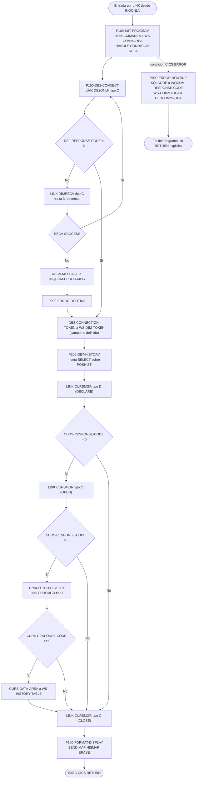
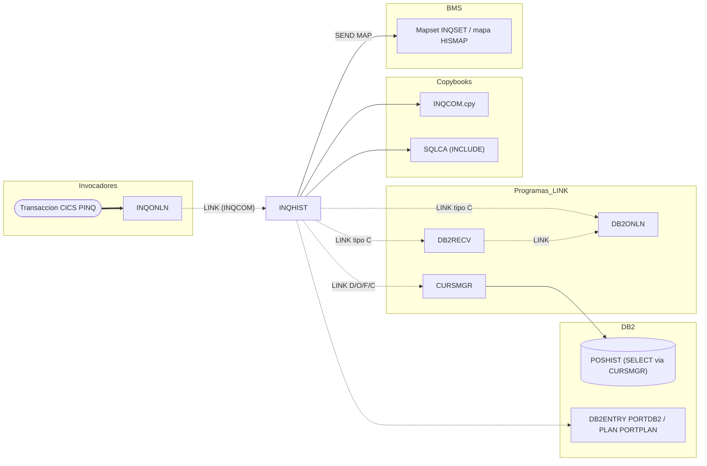

# INQHIST — Consulta online del histórico de transacciones (CICS/DB2)

> Generado a partir del análisis del código fuente `src/programs/online/INQHIST.cbl`. Ver el [grafo de dependencias global](../technical/dependency-graph.md).

## Ficha técnica
| Campo | Valor |
| --- | --- |
| Ruta | `src/programs/online/INQHIST.cbl` |
| Categoría | online |
| Tipo | CICS online (subprograma invocado por `EXEC CICS LINK`) |
| Líneas | 193 |
| Punto de entrada | Subrutina invocada por `LINK` desde `INQONLN` (transacción CICS `PINQ`, definida en `src/cics/PORTDFN.csd`). No tiene transacción propia. |
| Invocado por | `INQONLN` (párrafo `P400-HISTORY-INQUIRY`, cuando `INQCOM-FUNCTION = 'INQH'`) |
| Invoca a | `DB2ONLN` (LINK, conexión DB2), `DB2RECV` (LINK, recuperación de conexión), `CURSMGR` (LINK, ciclo de vida del cursor DB2). Mapa `HISMAP` del mapset `INQSET`. Copybook `INQCOM`. Tabla DB2 `POSHIST` (SQL dinámico embebido en texto). |

## Propósito
`INQHIST` es el manejador de la opción "2. Transaction History" del menú de consulta de carteras (`MENMAP`/`INQSET`). Su cometido es recuperar de la tabla DB2 `POSHIST` las últimas transacciones de una cuenta (fecha, tipo, unidades, precio e importe), cargarlas en una tabla interna de 10 entradas y mostrarlas en la pantalla `HISMAP`. Encaja en la capa online del sistema (CICS), por debajo del controlador `INQONLN`, y se apoya en los componentes de soporte DB2 online (`DB2ONLN`, `DB2RECV`, `CURSMGR`) en lugar de ejecutar SQL directamente.

Aunque la cabecera del programa anuncia "Supports scrolling through history", en el código no hay ninguna lógica de paginación (véase [Observaciones](#observaciones-y-problemas-detectados)).

## Funcionamiento

El programa es lineal: tres `PERFORM` consecutivos y un `EXEC CICS RETURN`. No hay bucle de proceso ni tratamiento de teclas de función.

### Procedimiento principal (sin nombre)
1. `PERFORM P100-INIT-PROGRAM THRU P100-EXIT` — inicialización y conexión DB2.
2. `PERFORM P200-GET-HISTORY THRU P200-EXIT` — declaración, apertura, fetch y cierre del cursor vía `CURSMGR`.
3. `PERFORM P300-FORMAT-DISPLAY THRU P300-EXIT` — envío del mapa `HISMAP`.
4. `EXEC CICS RETURN` — devuelve el control a `INQONLN` (fue invocado con `LINK`).

### `P100-INIT-PROGRAM`
- Copia `DFHCOMMAREA` (estructura `INQCOM`, 98 bytes) a la copia local `WS-COMMAREA`.
- Inicializa `WS-ROW-COUNT` a cero y activa el flag `NO-MORE-ROWS`.
- `EXEC CICS HANDLE CONDITION ERROR(P999-ERROR-ROUTINE)`: cualquier condición CICS de error no controlada por `RESP` desviará el flujo a `P999-ERROR-ROUTINE`.
- Ejecuta `P150-DB2-CONNECT`.

### `P150-DB2-CONNECT`
- Pone `DB2-REQUEST-TYPE = 'C'` (connect) y hace `EXEC CICS LINK PROGRAM('DB2ONLN')` con la COMMAREA `WS-DB2-REQUEST` (105 bytes, misma disposición que el copybook `DB2REQ`).
- Si `DB2-RESPONSE-CODE` es distinto de 0:
  - Rellena `WS-RECOVERY-REQUEST` con `RECV-REQUEST-TYPE = 'C'` (recuperación de conexión), `RECV-PROGRAM = 'INQHIST'` y el `DB2-SQLCODE` devuelto, y hace `LINK` a `DB2RECV`. `DB2RECV` reintenta la conexión hasta 3 veces con `EXEC CICS DELAY` de 2 segundos entre intentos.
  - Si `RECV-SUCCESS`: vuelve a ejecutar `P150-DB2-CONNECT` (PERFORM recursivo del propio párrafo).
  - Si no: copia `RECV-MESSAGE` a `INQCOM-ERROR-MSG OF WS-COMMAREA` y ejecuta `P999-ERROR-ROUTINE`; después el flujo **continúa** (no hay salida anticipada).
- Finalmente copia `DB2-CONNECTION-TOKEN` a `WS-DB2-TOKEN` (campo **no definido** en el programa; ver Observaciones).

### `P200-GET-HISTORY`
- Construye en `CURS-STMT` la sentencia:
  ```sql
  SELECT TRANS_DATE, TRANS_TYPE, TRANS_UNITS, TRANS_PRICE, TRANS_AMOUNT
    FROM POSHIST
   WHERE ACCOUNT_NO = ?
   ORDER BY TRANS_DATE DESC
  ```
- Secuencia de llamadas a `CURSMGR` con la COMMAREA `WS-CURSOR-REQUEST` (3.266 bytes), variando `CURS-REQUEST-TYPE`:
  1. `'D'` (DECLARE) → si `CURS-RESPONSE-CODE = 0`:
  2. `'O'` (OPEN) → si `CURS-RESPONSE-CODE = 0`:
  3. `PERFORM P250-FETCH-HISTORY`.
  4. `'C'` (CLOSE), **siempre**, aunque DECLARE u OPEN hayan fallado.
- El nombre lógico del cursor es `CURS-NAME = 'HISTORY_CURSOR'` y `CURS-ARRAY-FETCH = 'Y'` (petición de fetch por bloques).
- El marcador `?` de la cláusula `WHERE` nunca se asocia a `INQCOM-ACCOUNT-NO`: no existe ningún campo en `WS-CURSOR-REQUEST` para pasar variables host.

### `P250-FETCH-HISTORY`
- `CURS-REQUEST-TYPE = 'F'` y `LINK` a `CURSMGR`.
- Si `CURS-RESPONSE-CODE >= 0` (incluye `+100`, fin de datos) copia `CURS-DATA-AREA` (3.000 bytes) a `WS-HISTORY-TABLE` (320 bytes; el resto se trunca). No actualiza `WS-ROW-COUNT`, `WS-MORE-HISTORY` ni consulta `CURS-DATA-LENGTH`.

### `P300-FORMAT-DISPLAY`
- `EXEC CICS SEND MAP('HISMAP') MAPSET('INQSET') FROM(WS-HISTORY-TABLE) LENGTH(...) ERASE RESP(WS-RESPONSE-CODE)`.
- A pesar del nombre, no hay ningún formateo: los campos empaquetados `COMP-3` se envían tal cual y `WS-RESPONSE-CODE` no se evalúa después.

### `P999-ERROR-ROUTINE`
- Mueve `SQLCODE` (de la `SQLCA` local, que ningún `EXEC SQL` de este programa actualiza) a `INQCOM-RESPONSE-CODE OF WS-COMMAREA` y devuelve `WS-COMMAREA` a `DFHCOMMAREA`.
- Es la única ruta en la que la COMMAREA del llamador se actualiza; no emite `RETURN` ni `ABEND`, por lo que la ejecución sigue en el punto desde el que se hizo el `PERFORM` (o, si llega por `HANDLE CONDITION`, cae en `P999-EXIT` y termina el programa sin `EXEC CICS RETURN` explícito).



## Interfaz

- **Parámetros / LINKAGE SECTION / COMMAREA**: `DFHCOMMAREA` con la estructura del copybook `INQCOM` (98 bytes), recibida desde `INQONLN`:

  | Campo | PIC | Uso en INQHIST |
  | --- | --- | --- |
  | `INQCOM-FUNCTION` | `X(4)` (`'MENU'`, `'INQP'`, `'INQH'`, `'EXIT'`) | No se evalúa (el enrutamiento lo hace `INQONLN`). |
  | `INQCOM-ACCOUNT-NO` | `X(10)` | **No se utiliza** pese a ser la clave lógica de la consulta. |
  | `INQCOM-RESPONSE-CODE` | `S9(8) COMP` | Se rellena con `SQLCODE` solo en `P999-ERROR-ROUTINE`. |
  | `INQCOM-ERROR-MSG` | `X(80)` | Se rellena con `RECV-MESSAGE` si falla la recuperación de conexión. |

  En el camino normal (sin error) la COMMAREA del llamador **no se modifica**; `INQONLN` no recibe ningún indicador de éxito ni los datos recuperados.

- **Ficheros (DDNAME, organización, modo de apertura, clave)**: No aplica. El programa no tiene `FILE-CONTROL` ni accede a VSAM.

- **Tablas DB2 y sentencias SQL**:

  | Tabla | Acceso | Sentencia | Dónde se ejecuta |
  | --- | --- | --- | --- |
  | `POSHIST` | SELECT (solo lectura) | `SELECT TRANS_DATE, TRANS_TYPE, TRANS_UNITS, TRANS_PRICE, TRANS_AMOUNT FROM POSHIST WHERE ACCOUNT_NO = ? ORDER BY TRANS_DATE DESC` | Texto construido en `INQHIST` (`CURS-STMT`); la ejecución real se delega en `CURSMGR`. |

  `INQHIST` incluye `SQLCA` (`EXEC SQL INCLUDE SQLCA`) pero no contiene ningún otro `EXEC SQL`; toda la interacción con DB2 se realiza por `LINK` a `DB2ONLN` y `CURSMGR`. La conexión CICS-DB2 declarada en el CSD es `DB2ENTRY(PORTDB2)` con `PLAN(PORTPLAN)` para la transacción `PINQ`.

- **Mapas BMS / comandos CICS**:

  | Comando | Párrafo | Detalle |
  | --- | --- | --- |
  | `HANDLE CONDITION ERROR(P999-ERROR-ROUTINE)` | `P100-INIT-PROGRAM` | Captura genérica de condiciones CICS. |
  | `LINK PROGRAM('DB2ONLN')` | `P150-DB2-CONNECT` | COMMAREA `WS-DB2-REQUEST` (105 bytes). |
  | `LINK PROGRAM('DB2RECV')` | `P150-DB2-CONNECT` | COMMAREA `WS-RECOVERY-REQUEST` (116 bytes). |
  | `LINK PROGRAM('CURSMGR')` ×4 | `P200-GET-HISTORY`, `P250-FETCH-HISTORY` | COMMAREA `WS-CURSOR-REQUEST` (3.266 bytes); tipos `D`, `O`, `F`, `C`. |
  | `SEND MAP('HISMAP') MAPSET('INQSET') FROM(WS-HISTORY-TABLE) ERASE RESP(...)` | `P300-FORMAT-DISPLAY` | Único acceso a pantalla. No hay `RECEIVE MAP`. |
  | `RETURN` | Procedimiento principal | Devuelve el control a `INQONLN`. |

  Mapa `HISMAP` (mapset `INQSET`, `MODE=INOUT`, 24×80): título "Transaction History Inquiry", campo de entrada `HISAIN` (cuenta, 10 posiciones), cabeceras Date/Type/Units/Price/Amount, diez filas `ROW1`…`ROW10` de 65 caracteres, leyenda "PF3=Exit PF7=Previous PF8=Next" y campo de mensaje `HISMSG` (78, rojo). Ninguno de estos campos simbólicos se referencia por nombre en el programa.

- **Códigos de retorno / RETURN-CODE**: No usa `RETURN-CODE`. El único valor devuelto al llamador es `INQCOM-RESPONSE-CODE` = `SQLCODE` local (en la práctica el valor inicial de la `SQLCA`, normalmente 0) cuando se ejecuta `P999-ERROR-ROUTINE`, más `INQCOM-ERROR-MSG` si falló la recuperación de conexión. Los `LINK` no usan `RESP`, por lo que un `PGMIDERR` o `LENGERR` desencadenaría la condición `ERROR` capturada por `HANDLE CONDITION`.

## Estructuras de datos clave

| Copybook | Ubicación | Aporta |
| --- | --- | --- |
| `INQCOM` | `src/copybook/online/INQCOM.cpy` | Área de comunicación del subsistema de consulta (función, cuenta, código de respuesta, mensaje). Se copia dos veces: bajo `01 WS-COMMAREA` (WORKING-STORAGE) y bajo `01 DFHCOMMAREA` (LINKAGE), de ahí el uso de calificadores `OF WS-COMMAREA`. |
| `SQLCA` | `EXEC SQL INCLUDE SQLCA` (`src/copybook/db2/SQLCA.cpy`) | Área de comunicación SQL; solo se lee `SQLCODE` en `P999-ERROR-ROUTINE`. |

Campos de WORKING-STORAGE relevantes:

| Estructura / campo | Descripción |
| --- | --- |
| `WS-HISTORY-TABLE` / `WS-HISTORY-ENTRY OCCURS 10` | Tabla interna de 10 filas × 32 bytes = 320 bytes: `WS-TRANS-DATE X(10)`, `WS-TRANS-TYPE X(4)`, `WS-TRANS-UNITS`, `WS-TRANS-PRICE`, `WS-TRANS-AMOUNT` (`S9(9)V99 COMP-3`). Es el buffer que se envía al mapa. |
| `WS-FLAGS.WS-RESPONSE-CODE` | Recibe el `RESP` del `SEND MAP`; nunca se evalúa. |
| `WS-FLAGS.WS-MORE-HISTORY` (`MORE-ROWS`/`NO-MORE-ROWS`) | Indicador previsto para paginación; se inicializa a `'N'` y nunca cambia. |
| `WS-FLAGS.WS-ROW-COUNT` | Contador de filas; se pone a cero y nunca se incrementa. |
| `WS-DB2-REQUEST` | Réplica manual del copybook `DB2REQ` (sin los niveles 88): tipo de petición (`'C'`), código de respuesta, token de conexión de 16 bytes, `DB2-SQLCODE` y `DB2-ERROR-MSG`. |
| `WS-CURSOR-REQUEST` | Contrato con `CURSMGR`: `CURS-REQUEST-TYPE` (`D/O/F/C`), `CURS-NAME` (`'HISTORY_CURSOR'`), `CURS-STMT X(240)` (texto SQL), `CURS-ARRAY-FETCH` (`'Y'`), `CURS-RESPONSE-CODE`, `CURS-DATA-AREA X(3000)` y `CURS-DATA-LENGTH`. |
| `WS-RECOVERY-REQUEST` | Contrato con `DB2RECV`: tipo (`'C'` = conexión), código de respuesta, `RECV-SQLCODE`, `RECV-PROGRAM`, `RECV-CURSOR`, `RECV-MESSAGE` y `RECV-STATUS` (`S`/`F`/`R`). |

No hay umbrales de commit, contadores de checkpoint ni constantes de negocio: el programa es de solo lectura.

## Reglas de negocio y validaciones

Las reglas realmente codificadas son pocas:

1. El histórico se ordena por fecha de transacción descendente (`ORDER BY TRANS_DATE DESC`), es decir, se pretende mostrar primero lo más reciente.
2. Se muestran como máximo 10 transacciones (tamaño de `WS-HISTORY-TABLE` y número de filas `ROW1`…`ROW10` del mapa).
3. El filtro previsto es por número de cuenta (`WHERE ACCOUNT_NO = ?`), pero el valor de `INQCOM-ACCOUNT-NO` no llega a la sentencia.
4. Solo se intenta abrir el cursor si el `DECLARE` fue correcto, y solo se hace `FETCH` si el `OPEN` fue correcto; el `CLOSE` se pide incondicionalmente.
5. Un `FETCH` con `CURS-RESPONSE-CODE >= 0` (0 o `+100`) se considera válido y sus datos se copian a la tabla; los códigos negativos se ignoran silenciosamente.
6. Ante fallo de conexión DB2 se delega en `DB2RECV`, que aplica como máximo 3 reintentos separados 2 segundos.

No hay validaciones de entrada (formato de cuenta, cuenta vacía), ni `EVALUATE` de tipos de transacción, ni cálculos.

## Manejo de errores y recuperación

- **FILE STATUS**: no aplica (sin ficheros).
- **SQLCODE**: `INQHIST` no ejecuta SQL propio; los `SQLCODE` los devuelven `DB2ONLN` (`DB2-SQLCODE`) y `CURSMGR` (`CURS-RESPONSE-CODE`). El único uso local de `SQLCODE` es en `P999-ERROR-ROUTINE`, donde se copia a `INQCOM-RESPONSE-CODE` desde una `SQLCA` que nunca se ha actualizado.
- **Condiciones CICS**: `HANDLE CONDITION ERROR(P999-ERROR-ROUTINE)` en `P100-INIT-PROGRAM`. Los `LINK` no llevan `RESP`, así que un programa inexistente o una longitud errónea activarían esa rutina. El `SEND MAP` sí usa `RESP(WS-RESPONSE-CODE)`, lo que suprime la condición, pero el valor no se comprueba.
- **Recuperación de conexión DB2**: si `DB2ONLN` devuelve `DB2-RESPONSE-CODE ≠ 0` (p. ej. `-1` por `CONNECT` fallido o "Maximum connections reached"), se invoca `DB2RECV` en modo `'C'`. Si la recuperación tiene éxito se repite `P150-DB2-CONNECT` (que volverá a pedir una conexión nueva); si falla, se informa `INQCOM-ERROR-MSG` y se pasa por `P999-ERROR-ROUTINE`, pero **el programa sigue adelante** e intenta la consulta igualmente.
- **Errores de cursor**: no se invoca `DB2RECV` en modo `'R'` (cursor) ni `ERRHNDL`; un fallo en `DECLARE`/`OPEN`/`FETCH` simplemente deja `WS-HISTORY-TABLE` con su contenido inicial (espacios/basura de WORKING-STORAGE) y se envía la pantalla sin mensaje de error en `HISMSG`.
- **Checkpoint/restart, rollback, commit**: no aplica; es una consulta de solo lectura sin unidad de trabajo actualizadora. No se llama a `ERRPROC`, `ERRHNDL` ni `DB2ERR`.
- **Terminación**: no hay `ABEND` ni `RETURN` en rutas de error; todas las rutas desembocan en `P300-FORMAT-DISPLAY` y `EXEC CICS RETURN`, salvo la entrada por `HANDLE CONDITION`, que finaliza en `P999-EXIT` al llegar al final del código.

## Dependencias



## Observaciones y problemas detectados

1. **Campo no definido `WS-DB2-TOKEN`** (línea 125): `MOVE DB2-CONNECTION-TOKEN TO WS-DB2-TOKEN` referencia un dato que no existe en ninguna sección del programa ni en `INQCOM`. Error de compilación.
2. **`CURSMGR` está incompleto**: el fuente termina en `P200-EXIT` (línea 91, sin punto final) y no contiene los párrafos `P300-FETCH-DATA` ni `P400-CLOSE-CURSOR` que su `EVALUATE` referencia. Las peticiones `'F'` (fetch) y `'C'` (close) de `INQHIST` no tienen implementación, por lo que `CURS-DATA-AREA` nunca se rellena. Además, `CURSMGR` usa `DECLARE :CURS-NAME CURSOR FOR :CURS-STMT`, sintaxis no válida en DB2 (el nombre del cursor no puede ser una variable host y el SQL dinámico requiere `PREPARE`).
3. **La sentencia SQL no coincide con el DDL de `POSHIST`** (`src/database/db2/POSHIST.sql`): las columnas `TRANS_UNITS`, `TRANS_PRICE` y `TRANS_AMOUNT` no existen (la tabla define `QUANTITY`, `PRICE`, `AMOUNT`). `TRANS_TYPE` es `CHAR(2)` frente a `WS-TRANS-TYPE PIC X(4)`, y `ACCOUNT_NO` es `CHAR(8)` frente a `INQCOM-ACCOUNT-NO PIC X(10)`. La consulta fallaría con `SQLCODE -206`.
4. **El marcador `?` nunca se vincula**: `WS-CURSOR-REQUEST` no tiene ningún campo para variables host y `INQCOM-ACCOUNT-NO` no se usa en ningún sitio. La consulta no puede filtrarse por cuenta.
5. **`SEND MAP ... FROM(WS-HISTORY-TABLE)` con una estructura incompatible con el mapa simbólico**: `HISMAP` genera campos `ROW1O`…`ROW10O` de 65 bytes precedidos de longitud y atributos (y atributos de color/resalte por `DSATTS`), más `HISAINO` y `HISMSGO`; `WS-HISTORY-TABLE` son 320 bytes con campos `COMP-3` sin conversión a display. La pantalla mostraría datos corruptos. El programa tampoco usa `DFHBMSCA` ni el copybook simbólico del mapset (no existe en `src/`).
6. **Truncamiento y desajuste de tamaños**: `CURS-DATA-AREA` (3.000 bytes) se mueve a `WS-HISTORY-TABLE` (320 bytes); `CURSMGR` fija el array fetch en 20 filas (`WS-MAX-ROWS`) mientras que la tabla interna admite 10. `CURS-DATA-LENGTH` nunca se consulta.
7. **`P999-ERROR-ROUTINE` no es una rutina de error efectiva**: copia un `SQLCODE` que ningún `EXEC SQL` de `INQHIST` ha establecido, no informa `HISMSG`/`ERRMAP`, no llama a `ERRHNDL` y no interrumpe el flujo. Tras un fallo irrecuperable de conexión el programa sigue ejecutando `P200-GET-HISTORY` y `P300-FORMAT-DISPLAY`.
8. **Uso mixto del mismo párrafo como etiqueta de `HANDLE CONDITION` y destino de `PERFORM`**: si la condición se dispara dentro de un `PERFORM` activo, el control salta fuera del rango `THRU` con comportamiento indefinido. El `PERFORM P150-DB2-CONNECT` recursivo dentro de `P150-DB2-CONNECT` también es comportamiento indefinido en COBOL estándar y puede provocar un bucle si `DB2ONLN` sigue fallando después de que `DB2RECV` informe éxito.
9. **La COMMAREA nunca se devuelve al llamador en el camino correcto**: `MOVE WS-COMMAREA TO DFHCOMMAREA` solo se ejecuta en `P999-ERROR-ROUTINE`. `INQONLN` no recibe código de respuesta, mensaje ni datos; además `INQONLN` no evalúa `INQCOM-RESPONSE-CODE` tras el `LINK`.
10. **Anidamiento de niveles 01 en `COPY INQCOM`**: el copybook comienza con `01 INQCOM-AREA`, y se copia bajo `01 WS-COMMAREA` y `01 DFHCOMMAREA`, generando dos `01` consecutivos; `WS-COMMAREA`/`DFHCOMMAREA` quedan como grupos vacíos y los `MOVE DFHCOMMAREA TO WS-COMMAREA` no mueven los datos de `INQCOM`. Mismo patrón en `INQONLN` e `INQPORT`.
11. **Funcionalidad anunciada pero no implementada**: la cabecera dice "Supports scrolling through history" y el mapa muestra "PF7=Previous PF8=Next", pero no hay `RECEIVE MAP`, tratamiento de `EIBAID`, ni uso de `WS-MORE-HISTORY`/`WS-ROW-COUNT`. `system-architecture.md` atribuye a `INQHIST` "Displays audit information" y "Supports date range queries", que tampoco existen en el código.
12. **Discrepancias con `documentation/technical/system-architecture.md`**: la tabla 5.1.4 indica dependencias `DB2ONLN, ERRHNDL`; el código real depende de `DB2ONLN`, `DB2RECV` y `CURSMGR`, y nunca invoca `ERRHNDL`. El documento describe `CURSMGR` como gestor del cursor de pantalla/PF keys, cuando el fuente es un gestor de cursores DB2. El diagrama de secuencia muestra `HST->>CUR: Format Display` (CURSMGR formateando), lo que no ocurre: `INQHIST` envía el mapa directamente.
13. **Discrepancia con `documentation/technical/data-dictionary.md`**: el DDL de `POSHIST` allí documentado (`ACCOUNT_NO DECIMAL(9,0)`, `FUND_ID`, `SHARE_BAL`, …) no coincide ni con `POSHIST.sql` ni con las columnas que consulta `INQHIST`. Manda el código; ninguna de las tres versiones es coherente entre sí.
14. **Conexión DB2 desde CICS**: `DB2ONLN` ejecuta `EXEC SQL CONNECT TO POSMVP`, patrón propio de DRDA/batch; en CICS la conexión la gestiona el CICS-DB2 attachment facility con `DB2ENTRY(PORTDB2)`/`PLAN(PORTPLAN)` (definidos en `PORTDFN.csd`). El "token de conexión" que `INQHIST` recibe (y no puede almacenar) es, probablemente, un artefacto sin efecto real en un entorno CICS.
15. **Menor**: `WS-RESPONSE-CODE` del `SEND MAP` no se comprueba; los tres `LINK` carecen de `RESP`; `CURS-ARRAY-FETCH` y `CURS-NAME` llevan `VALUE` en WORKING-STORAGE, pero `CURS-DATA-LENGTH` y `CURS-RESPONSE-CODE` no se inicializan antes de la primera llamada; `DB2ONLN` guarda sus contadores de pool en WORKING-STORAGE, que en CICS se reinicia en cada `LINK`, por lo que el "pool" es ficticio.
16. **Contexto del llamador**: `INQONLN` hace `RECEIVE MAP('INQMAP')` y `SEND MAP('INQMNU')`, mapas que no existen en `INQSET` (los reales son `MENMAP`, `POSMAP`, `HISMAP`, `ERRMAP`), y consulta `WS-COMMAREA-FUNCTION`, campo inexistente (el real es `INQCOM-FUNCTION`). Es dudoso que `INQHIST` llegue a invocarse en la práctica.

## Referencias

- Programa: [INQHIST.cbl](../../src/programs/online/INQHIST.cbl)
- Llamador: [INQONLN.cbl](../../src/programs/online/INQONLN.cbl)
- Programas invocados: [DB2ONLN.cbl](../../src/programs/online/DB2ONLN.cbl), [DB2RECV.cbl](../../src/programs/online/DB2RECV.cbl), [CURSMGR.cbl](../../src/programs/online/CURSMGR.cbl)
- Copybooks: [INQCOM.cpy](../../src/copybook/online/INQCOM.cpy), [DB2REQ.cpy](../../src/copybook/online/DB2REQ.cpy) (estructura equivalente a `WS-DB2-REQUEST`), [SQLCA.cpy](../../src/copybook/db2/SQLCA.cpy)
- Mapas BMS: [INQSET.bms](../../src/maps/INQSET.bms) (mapa `HISMAP`)
- Definiciones CICS: [PORTDFN.csd](../../src/cics/PORTDFN.csd) (transacción `PINQ`, programas, mapset, `DB2ENTRY PORTDB2`)
- DDL: [POSHIST.sql](../../src/database/db2/POSHIST.sql), [PORTPLAN.sql](../../src/database/db2/PORTPLAN.sql)
- Documentación técnica: [system-architecture.md](../technical/system-architecture.md), [data-dictionary.md](../technical/data-dictionary.md), [dependency-graph.md](../technical/dependency-graph.md)
