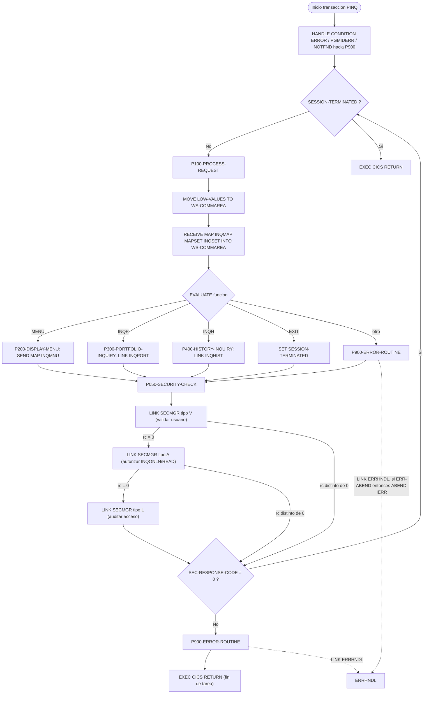
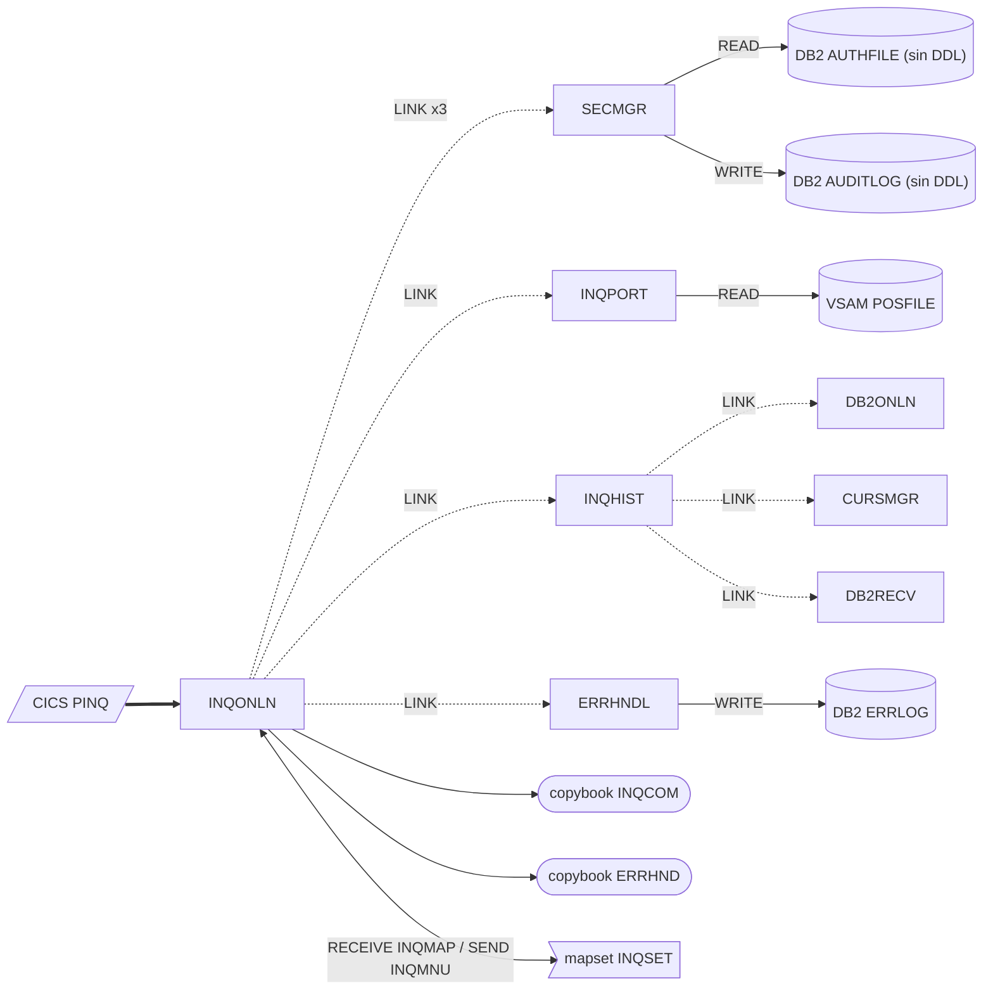

# INQONLN — Controlador CICS de la transacción de consulta de carteras (PINQ)

> Generado a partir del análisis del código fuente `src/programs/online/INQONLN.cbl`. Ver el [grafo de dependencias global](../technical/dependency-graph.md).

## Ficha técnica
| Campo | Valor |
| --- | --- |
| Ruta | `src/programs/online/INQONLN.cbl` |
| Categoría | online |
| Tipo | CICS online |
| Líneas | 171 |
| Punto de entrada | Transacción CICS `PINQ` (definida en `src/cics/PORTDFN.csd`, `DEFINE TRANSACTION(PINQ) PROGRAM(INQONLN)`) |
| Invocado por | CICS (transacción `PINQ`). Ningún otro programa lo invoca por `CALL` ni por `LINK`. |
| Invoca a | `EXEC CICS LINK` a `SECMGR`, `INQPORT`, `INQHIST` y `ERRHNDL`. Sin `CALL` estáticos. |

## Propósito
`INQONLN` es el programa inicial de la transacción CICS `PINQ` y actúa como controlador ("main handler") de la capa online del sistema de gestión de carteras. Recibe la petición del usuario a través del mapset BMS `INQSET`, decide qué función se ha solicitado (menú, consulta de posición de cartera, consulta de histórico de transacciones o salida) y delega el trabajo real en los subprogramas `INQPORT` (posiciones, fichero VSAM `POSFILE`) e `INQHIST` (histórico DB2 vía `CURSMGR`/`DB2ONLN`). Además coordina el control de seguridad (`SECMGR`: validación de usuario, autorización y auditoría) y el tratamiento centralizado de errores (`ERRHNDL`). El propio programa no accede a ficheros ni a DB2: toda la E/S de datos la realizan los programas enlazados.

## Funcionamiento

### Flujo principal (`PROCEDURE DIVISION`)
1. **Registro de condiciones CICS**: `EXEC CICS HANDLE CONDITION ERROR(P900-ERROR-ROUTINE) PGMIDERR(P900-ERROR-ROUTINE) NOTFND(P900-ERROR-ROUTINE)`. Cualquier condición `ERROR` genérica, programa no encontrado (`PGMIDERR`) o registro no encontrado (`NOTFND`) provoca un salto (no un `PERFORM`) a `P900-ERROR-ROUTINE`, siempre que el comando que la provoque no lleve la opción `RESP`.
2. **Bucle de sesión**: `PERFORM P100-PROCESS-REQUEST THRU P100-EXIT UNTIL SESSION-TERMINATED`. El programa es **conversacional**: permanece en el bucle recibiendo pantallas hasta que el usuario solicita `EXIT`. No hay `RETURN TRANSID` ni uso de `DFHCOMMAREA` entre interacciones (no es pseudoconversacional).
3. **Fin de tarea**: `EXEC CICS RETURN` sin `TRANSID` ni `COMMAREA`.

### `P100-PROCESS-REQUEST` / `P100-EXIT`
1. `MOVE LOW-VALUES TO WS-COMMAREA`: limpia el área de comunicación de trabajo en cada iteración (la `DFHCOMMAREA` recibida nunca se copia ni se consulta; `EIBCALEN` no se examina).
2. `EXEC CICS RECEIVE MAP('INQMAP') MAPSET('INQSET') INTO(WS-COMMAREA) RESP(WS-RESPONSE-CODE)`: lee la pantalla directamente sobre `WS-COMMAREA`. `WS-RESPONSE-CODE` no se comprueba después.
3. `EVALUATE WS-COMMAREA-FUNCTION` (véase «Observaciones»: este campo no está definido; la intención, según `INQCOM.cpy`, es evaluar `INQCOM-FUNCTION`):
   - `'MENU'` → `P200-DISPLAY-MENU`.
   - `'INQP'` → `P300-PORTFOLIO-INQUIRY`.
   - `'INQH'` → `P400-HISTORY-INQUIRY`.
   - `'EXIT'` → `SET SESSION-TERMINATED TO TRUE` (termina el bucle en la siguiente comprobación del `UNTIL`).
   - cualquier otro valor → `P900-ERROR-ROUTINE`.
4. **Control de seguridad a posteriori**: `PERFORM P050-SECURITY-CHECK THRU P050-EXIT`. Se ejecuta *después* de haber atendido la función (incluida la opción `EXIT`), en cada iteración.
5. Si `SEC-RESPONSE-CODE NOT = 0`: copia `SEC-ERROR-INFO` a `WS-ERROR-MESSAGE` (campo no definido), ejecuta `P900-ERROR-ROUTINE` y termina la tarea con `EXEC CICS RETURN` desde dentro del párrafo.

### `P200-DISPLAY-MENU` / `P200-EXIT`
`EXEC CICS SEND MAP('INQMNU') MAPSET('INQSET') ERASE RESP(WS-RESPONSE-CODE)`. Envía el menú principal borrando la pantalla. No se usa `FROM`, por lo que se envían solo los campos constantes del mapa físico. El código de respuesta no se comprueba.

### `P300-PORTFOLIO-INQUIRY` / `P300-EXIT`
`EXEC CICS LINK PROGRAM('INQPORT') COMMAREA(WS-COMMAREA) LENGTH(LENGTH OF WS-COMMAREA) RESP(WS-RESPONSE-CODE)`. `INQPORT` lee `POSFILE` por número de cuenta (`INQCOM-ACCOUNT-NO`) y envía el mapa `POSMAP`; si falla, devuelve `INQCOM-ERROR-MSG`/`INQCOM-RESPONSE-CODE` en la COMMAREA. `INQONLN` no inspecciona ninguno de los dos campos al volver.

### `P400-HISTORY-INQUIRY` / `P400-EXIT`
`EXEC CICS LINK PROGRAM('INQHIST') COMMAREA(WS-COMMAREA) LENGTH(LENGTH OF WS-COMMAREA) RESP(WS-RESPONSE-CODE)`. `INQHIST` conecta a DB2 (`DB2ONLN`/`DB2RECV`), abre un cursor sobre `POSHIST` mediante `CURSMGR` y envía el mapa `HISMAP`. Al igual que en `P300`, el resultado devuelto en la COMMAREA no se examina.

### `P900-ERROR-ROUTINE` / `P900-EXIT`
1. Rellena el área `ERRHND`: `ERR-PROGRAM = 'INQONLN'`, `ERR-PARAGRAPH = 'P900-ERROR-ROUTINE'`, `ERR-CICS-RESP = EIBRESP`, `ERR-CICS-RESP2 = EIBRESP2`, `SET ERR-WARNING TO TRUE`.
2. `EXEC CICS LINK PROGRAM('ERRHNDL') COMMAREA(WS-ERROR-AREA) LENGTH(LENGTH OF WS-ERROR-AREA)` (sin `RESP`). `ERRHNDL` inserta el error en la tabla DB2 `ERRLOG`, formatea `ERR-MESSAGE` y fija `ERR-ACTION` en función de `ERR-SEVERITY`.
3. Si `ERR-ABEND` → `EXEC CICS ABEND ABCODE('IERR')`.
4. `MOVE ERR-MESSAGE TO WS-ERROR-MESSAGE` (campo no definido). El mensaje nunca se envía a pantalla (el mapa `ERRMAP` existe en `INQSET` pero no se usa).

### `P050-SECURITY-CHECK` / `P050-EXIT`
Tres invocaciones encadenadas a `SECMGR` con la estructura `WS-SECURITY-REQUEST`, cada una condicionada al éxito de la anterior:
1. `SEC-REQUEST-TYPE = 'V'` (validar usuario). Antes, `EXEC CICS ASSIGN USERID(SEC-USER-ID)` obtiene el usuario CICS de la tarea. `SECMGR` vuelve a ejecutar `ASSIGN USERID` y compara ambos valores.
2. Si `SEC-RESPONSE-CODE = 0`: `SEC-REQUEST-TYPE = 'A'`, `SEC-RESOURCE-NAME = 'INQONLN'`, `SEC-ACCESS-TYPE = 'READ'` (autorizar). `SECMGR` consulta `AUTHFILE` (`SELECT COUNT(*) ... WHERE USER_ID = ... AND RESOURCE = ... AND ACCESS_TYPE = ...`).
3. Si `SEC-RESPONSE-CODE = 0`: `SEC-REQUEST-TYPE = 'L'` (auditar). `SECMGR` inserta una fila en `AUDITLOG`.

El código de respuesta que evalúa `P100` es el de la **última** llamada ejecutada; por tanto un fallo al escribir la auditoría (código 12) se trata igual que una denegación de acceso.

### Diagrama de flujo

## Interfaz
- **Parámetros / LINKAGE SECTION / COMMAREA**: `LINKAGE SECTION` declara `01 DFHCOMMAREA` seguido de `COPY INQCOM` (estructura `INQCOM-AREA`: `INQCOM-FUNCTION PIC X(4)`, `INQCOM-ACCOUNT-NO PIC X(10)`, `INQCOM-RESPONSE-CODE PIC S9(8) COMP`, `INQCOM-ERROR-MSG PIC X(80)`; 98 bytes). Sin embargo, el programa **nunca referencia `DFHCOMMAREA`**: trabaja exclusivamente con la copia de `WORKING-STORAGE` (`WS-COMMAREA`), que reinicializa en cada iteración y que pasa como COMMAREA a `INQPORT` e `INQHIST`.
- **Ficheros (DDNAME, organización, modo de apertura, clave)**: No aplica. `INQONLN` no declara `FILE-CONTROL` ni ejecuta comandos de fichero CICS; el acceso a `POSFILE` lo realiza `INQPORT`.
- **Tablas DB2 y sentencias SQL**: No aplica directamente (no hay `EXEC SQL`). Indirectamente, a través de los programas enlazados: `AUTHFILE` (lectura) y `AUDITLOG` (inserción) en `SECMGR`; `ERRLOG` (inserción) en `ERRHNDL`; `POSHIST` (cursor) en `INQHIST`/`CURSMGR`. La transacción `PINQ` tiene `DB2TRAN` asociado al `DB2ENTRY(PORTDB2)` con plan `PORTPLAN` en `PORTDFN.csd`.
- **Mapas BMS / comandos CICS**:

  | Comando | Párrafo | Recurso | Opciones relevantes |
  | --- | --- | --- | --- |
  | `HANDLE CONDITION` | Principal | — | `ERROR`, `PGMIDERR`, `NOTFND` → `P900-ERROR-ROUTINE` |
  | `RECEIVE MAP` | `P100` | mapa `INQMAP`, mapset `INQSET` | `INTO(WS-COMMAREA)`, `RESP` |
  | `SEND MAP` | `P200` | mapa `INQMNU`, mapset `INQSET` | `ERASE`, `RESP` (sin `FROM`) |
  | `LINK` | `P300` | `INQPORT` | `COMMAREA(WS-COMMAREA)`, `RESP` |
  | `LINK` | `P400` | `INQHIST` | `COMMAREA(WS-COMMAREA)`, `RESP` |
  | `LINK` | `P900` | `ERRHNDL` | `COMMAREA(WS-ERROR-AREA)`, sin `RESP` |
  | `ABEND` | `P900` | — | `ABCODE('IERR')` |
  | `ASSIGN` | `P050` | — | `USERID(SEC-USER-ID)` |
  | `LINK` (x3) | `P050` | `SECMGR` | `COMMAREA(WS-SECURITY-REQUEST)`, sin `RESP` |
  | `RETURN` | Principal y `P100` | — | sin `TRANSID`/`COMMAREA` |

  El mapset `INQSET` (`src/maps/INQSET.bms`, `MODE=INOUT`, `STORAGE=AUTO`, `TIOAPFX=YES`) define los mapas `MENMAP` (menú: campo `OPTION` de 1 posición numérica y `ERRMSG`), `POSMAP` (posición: `ACCTIN`, `FUNDOUT`, `NAMEOUT`, `UNITOUT`, `COSTOUT`, `VALOUT`, `POSMSG`), `HISMAP` (histórico: `HISAIN`, `ROW1`..`ROW10`, `HISMSG`) y `ERRMAP` (`ERRCOUT`, `ERRDOUT`). Los nombres `INQMAP` e `INQMNU` usados por el programa **no existen** en el mapset (ver «Observaciones»).
- **Códigos de retorno / RETURN-CODE**: El programa no fija `RETURN-CODE` ni devuelve COMMAREA a CICS. Termina con `EXEC CICS RETURN` (fin normal o fallo de seguridad) o con `ABEND ABCODE('IERR')` cuando `ERRHNDL` devuelve `ERR-ACTION = 'A'`.

## Estructuras de datos clave

| Estructura | Origen | Contenido y uso |
| --- | --- | --- |
| `WS-COMMAREA` + `COPY INQCOM` | `src/copybook/online/INQCOM.cpy` | Área de comunicación de la consulta: `INQCOM-FUNCTION` (con condiciones 88 `INQCOM-MENU`='MENU', `INQCOM-PORTFOLIO`='INQP', `INQCOM-HISTORY`='INQH', `INQCOM-EXIT`='EXIT'), `INQCOM-ACCOUNT-NO`, `INQCOM-RESPONSE-CODE`, `INQCOM-ERROR-MSG`. Destino del `RECEIVE MAP` y COMMAREA de `INQPORT`/`INQHIST`. |
| `WS-FLAGS` | WORKING-STORAGE | `WS-END-OF-SESSION PIC X VALUE 'N'` con 88 `SESSION-ACTIVE`('N') / `SESSION-TERMINATED`('Y'): controla el bucle conversacional. `WS-RESPONSE-CODE PIC S9(8) COMP`: receptor de `RESP` en `RECEIVE`, `SEND` y `LINK`; nunca se evalúa. |
| `WS-ERROR-AREA` + `COPY ERRHND` | `src/copybook/online/ERRHND.cpy` | Estructura `ERROR-HANDLING` compartida con `ERRHNDL`: `ERR-PROGRAM`, `ERR-PARAGRAPH`, `ERR-SQLCODE`, `ERR-CICS-RESP`, `ERR-CICS-RESP2`, `ERR-SEVERITY` (88 `ERR-FATAL`/`ERR-WARNING`/`ERR-INFO`), `ERR-MESSAGE`, `ERR-ACTION` (88 `ERR-RETURN`/`ERR-CONTINUE`/`ERR-ABEND`), `ERR-TRACE` (`ERR-TRACE-ID`, `ERR-TIMESTAMP`). Sin cláusulas `VALUE`; `ERR-SQLCODE` y `ERR-TRACE-ID` no se inicializan en `INQONLN`. |
| `WS-SECURITY-REQUEST` | WORKING-STORAGE (definida inline, sin copybook) | Réplica de `SECURITY-REQUEST-AREA` de `SECMGR`: `SEC-REQUEST-TYPE PIC X` ('V' validar, 'A' autorizar, 'L' auditar), `SEC-USER-ID X(8)`, `SEC-RESOURCE-NAME X(8)`, `SEC-ACCESS-TYPE X(8)`, `SEC-RESPONSE-CODE S9(8) COMP`, `SEC-ERROR-INFO X(80)`. No existe copybook común: cualquier cambio en `SECMGR` debe replicarse a mano. |
| `DFHCOMMAREA` + `COPY INQCOM` | LINKAGE SECTION | COMMAREA de entrada de la transacción; no se usa. |

No hay contadores, umbrales de commit ni áreas de checkpoint: el programa es puramente de control de pantalla y encadenamiento de `LINK`.

## Reglas de negocio y validaciones
1. **Despacho por código de función** (`EVALUATE` en `P100`): los únicos valores válidos son `'MENU'`, `'INQP'`, `'INQH'` y `'EXIT'`; cualquier otro se considera error y se registra vía `ERRHNDL`.
2. **Fin de sesión explícito**: la sesión conversacional solo termina cuando el usuario envía `'EXIT'` (o cuando falla el control de seguridad).
3. **Control de acceso en tres niveles** (`P050`): (a) el usuario CICS debe poder obtenerse con `ASSIGN USERID` y coincidir con el que obtiene `SECMGR`; (b) debe existir al menos una fila en `AUTHFILE` para `USER_ID = <usuario>`, `RESOURCE = 'INQONLN'`, `ACCESS_TYPE = 'READ'`; (c) el acceso debe quedar auditado en `AUDITLOG`. Si alguno de los tres pasos devuelve código distinto de 0 la tarea termina.
4. **Nivel de acceso fijo**: la autorización siempre se solicita para el recurso `INQONLN` con tipo `READ`, independientemente de la función pedida (no se distingue entre consultar posiciones o histórico).
5. **Severidad de error fija**: todo error notificado por `INQONLN` a `ERRHNDL` se marca como `ERR-WARNING` ('W'); `ERRHNDL` convierte las advertencias en `ERR-CONTINUE`, de modo que la sesión continúa. Solo si `ERRHNDL` falla al grabar en `ERRLOG` (marca `ERR-FATAL` → `ERR-ABEND`) se produce el `ABEND IERR`.
6. No existe validación del número de cuenta ni de ningún otro dato de entrada en este programa; se delega íntegramente en `INQPORT` e `INQHIST`.

## Manejo de errores y recuperación
- **Condiciones CICS**: `HANDLE CONDITION` cubre `ERROR`, `PGMIDERR` y `NOTFND` redirigiendo a `P900-ERROR-ROUTINE`. Sin embargo, los comandos `RECEIVE MAP`, `SEND MAP` y los `LINK` a `INQPORT`/`INQHIST` llevan `RESP`, lo que en CICS desactiva el `HANDLE CONDITION` para ese comando; como `WS-RESPONSE-CODE` no se comprueba nunca, los fallos de esos cuatro comandos (p. ej. `MAPFAIL`, `INVMPSZ`, `PGMIDERR`) pasan **silenciosamente**. El `HANDLE CONDITION` solo es efectivo para `ASSIGN`, los `LINK` a `SECMGR` y `ERRHNDL` y el `ABEND`.
- **Salto a `P900` por condición**: cuando CICS transfiere el control a `P900-ERROR-ROUTINE` por `HANDLE CONDITION`, lo hace como un `GO TO`, abandonando el `PERFORM ... UNTIL` en curso. Tras `P900-EXIT` el control cae secuencialmente en `P050-SECURITY-CHECK` y después llega al final físico del programa (equivalente a `GOBACK`), sin volver al bucle. Si dentro de `P900` el `LINK` a `ERRHNDL` provocase a su vez `PGMIDERR` (p. ej. por no estar definido en el CSD), el manejador se reinvocaría sobre sí mismo (probablemente un bucle).
- **Registro centralizado**: `P900` delega en `ERRHNDL`, que inserta en `ERRLOG`, compone el mensaje `'Error in INQONLN - <mensaje> (<trace-id>)'` y decide la acción (`ERR-ABEND` solo si el propio registro falló). `INQONLN` honra `ERR-ABEND` con `ABEND ABCODE('IERR')`; en los demás casos continúa.
- **Errores de seguridad**: `SEC-ERROR-INFO` (textos de `SECMGR`: `'User validation failed'`, `'Unable to obtain user credentials'`, `'Access denied'`, `'Authorization check failed'`, `'Audit logging failed'`) se intenta copiar a `WS-ERROR-MESSAGE` y se registra vía `P900`; a continuación la tarea termina con `EXEC CICS RETURN`. Nótese que `ERR-MESSAGE` no se rellena con `SEC-ERROR-INFO` antes de llamar a `ERRHNDL`, así que el texto que se graba en `ERRLOG` es el contenido previo (no inicializado) de `ERR-MESSAGE`.
- **Errores de los subprogramas**: `INQPORT` (`'Position not found for account'`, `'Error accessing position data'`) e `INQHIST` (`SQLCODE` en `INQCOM-RESPONSE-CODE`) devuelven el error en la COMMAREA `INQCOM`, pero `INQONLN` no la examina ni muestra nada al usuario.
- **FILE STATUS / SQLCODE / checkpoint-restart / rollback**: No aplica (no hay ficheros ni SQL en el programa; no hay `SYNCPOINT` ni `SYNCPOINT ROLLBACK`). La recuperación DB2 la gestionan `DB2RECV`/`DB2ONLN` por debajo de `INQHIST`.
- **Visualización de errores**: no se envía el mapa `ERRMAP` ni los campos `ERRMSG`/`POSMSG`/`HISMSG`; el usuario no recibe retroalimentación de error desde este programa.

## Dependencias

## Observaciones y problemas detectados

### Errores que impiden compilar o ejecutar correctamente
1. **`WS-COMMAREA-FUNCTION` no está definido** (línea 62). El copybook `INQCOM` define `INQCOM-FUNCTION`; ninguna estructura del programa contiene un campo con ese nombre. El `EVALUATE` central del programa no compila.
2. **`WS-ERROR-MESSAGE` no está definido** (líneas 84 y 135). Ni `INQCOM` ni `ERRHND` lo aportan. Aparece en otros programas del repositorio (`UTLMNT00`, `RPTAUD00`, etc.) como campo propio de cada uno; aquí parece un resto de copia.
3. **Nivel 01 dentro de nivel 01**: `01 WS-COMMAREA.` va seguido de `COPY INQCOM`, que a su vez define `01 INQCOM-AREA`; lo mismo ocurre con `WS-ERROR-AREA`/`ERROR-HANDLING` y `DFHCOMMAREA`/`INQCOM-AREA`. El resultado son tres niveles 01 sin subordinados; probablemente el compilador lo rechace o los trate como elementos de 1 byte, con lo que `LENGTH OF WS-COMMAREA` y `LENGTH OF WS-ERROR-AREA` no tendrían la longitud de las estructuras copiadas y los `LINK` pasarían una COMMAREA truncada. Otros programas online (`INQPORT`, `INQHIST`, `SECMGR`, `ERRHNDL`) repiten el mismo patrón.
4. **Nombres duplicados**: `COPY INQCOM` se incluye dos veces (WORKING-STORAGE y LINKAGE) sin `REPLACING`, por lo que `INQCOM-AREA` y todos sus campos existen por duplicado y cualquier referencia sin cualificar (`OF WS-COMMAREA` / `OF DFHCOMMAREA`) sería ambigua. El programa evita el problema solo porque no referencia ningún campo de `INQCOM`.
5. **Mapas inexistentes**: `RECEIVE MAP('INQMAP')` y `SEND MAP('INQMNU')` referencian mapas que no existen en `INQSET.bms` (mapas reales: `MENMAP`, `POSMAP`, `HISMAP`, `ERRMAP`). En ejecución provocarían `INVMPSZ`/`MAPFAIL` o error de resolución del mapa, que además quedaría ignorado por la opción `RESP` sin comprobar. Tampoco se incluye la copia simbólica del mapset (`COPY INQSET`), imprescindible para trabajar con los campos de pantalla.
6. **`RECEIVE MAP ... INTO(WS-COMMAREA)`**: el área receptora debería ser la estructura simbólica del mapa. `WS-COMMAREA` (`INQCOM`, 98 bytes en teoría) no tiene el mismo trazado que ningún mapa; el `RECEIVE` sin `LENGTH` escribe la longitud del mapa simbólico sobre `WS-COMMAREA`, con riesgo de sobrescribir `WS-FLAGS` y las áreas contiguas.
7. **Incoherencia mapa ↔ código de función**: el menú `MENMAP` captura una opción numérica de 1 carácter (`OPTION`, `1`/`2`/`3`), mientras que el programa espera códigos de 4 caracteres `'MENU'`/`'INQP'`/`'INQH'`/`'EXIT'` y un número de cuenta. No hay ninguna conversión entre ambos.

### Defectos de lógica
8. **Seguridad comprobada después de servir la petición**: `P050-SECURITY-CHECK` se ejecuta tras el `EVALUATE`, es decir, `INQPORT`/`INQHIST` ya han accedido a los datos cuando se comprueba si el usuario está autorizado. También se ejecuta cuando la función es `'EXIT'`.
9. **Control de seguridad repetido en cada interacción**: tres `LINK` a `SECMGR`, dos `ASSIGN`, un `SELECT COUNT(*)` y un `INSERT` en `AUDITLOG` por cada pantalla recibida.
10. **Validación de usuario tautológica**: `INQONLN` obtiene `SEC-USER-ID` con `ASSIGN USERID` y `SECMGR` lo compara con el resultado de otro `ASSIGN USERID` en la misma tarea; siempre coincide.
11. **Fallo de auditoría equivale a denegación**: el código evaluado en `P100` es el de la última llamada; un `'Audit logging failed'` (12) expulsa al usuario igual que un `'Access denied'` (8).
12. **`RESP` sin comprobar**: `WS-RESPONSE-CODE` se recibe en cuatro comandos y no se consulta en ninguno; combinado con `HANDLE CONDITION`, los errores de esos comandos se pierden.
13. **`HANDLE CONDITION` rompe el bucle**: el salto a `P900-ERROR-ROUTINE` desde un `PERFORM UNTIL` abandona el bucle y hace que el control caiga en `P050-SECURITY-CHECK` y termine el programa sin `RETURN` explícito (ver «Manejo de errores»).
14. **Mensajes de error nunca mostrados**: `ERR-MESSAGE`, `SEC-ERROR-INFO` e `INQCOM-ERROR-MSG` no se envían a ningún mapa; `ERRMAP` y los campos de mensaje de `INQSET` no se utilizan. `ERR-MESSAGE` tampoco se rellena antes de llamar a `ERRHNDL`, así que en `ERRLOG` se graba contenido no inicializado.
15. **Campos no inicializados**: `ERR-SQLCODE`, `ERR-TRACE-ID`, `ERR-MESSAGE`, `SEC-RESOURCE-NAME`, `SEC-ACCESS-TYPE` y `SEC-ERROR-INFO` carecen de `VALUE` y no se inicializan antes de su primer uso. `ERRHNDL` solo genera un `ERR-TRACE-ID` nuevo si el campo contiene `SPACES`, cosa que no está garantizada.
16. **Diseño conversacional**: el bucle `PERFORM ... UNTIL SESSION-TERMINATED` con `RECEIVE MAP` retiene la tarea y el terminal entre pantallas; no hay `RETURN TRANSID` ni paso de `COMMAREA`, y la `DFHCOMMAREA`/`EIBCALEN` de entrada se ignoran. En la primera iteración se hace `RECEIVE MAP` sin haber enviado ninguna pantalla.
17. **Sin tratamiento de teclas de función**: los mapas anuncian `PF3=Exit PF7=Previous PF8=Next` pero el programa no consulta `EIBAID` ni incluye `DFHAID`.
18. **`WS-SECURITY-REQUEST` sin copybook**: la estructura se duplica a mano respecto a `SECURITY-REQUEST-AREA` de `SECMGR`.

### Discrepancias con recursos y documentación
19. **`ERRHNDL` no está definido en `PORTDFN.csd`** (programas definidos: `INQONLN`, `INQPORT`, `INQHIST`, `DB2ONLN`, `CURSMGR`, `DB2RECV`, `SECMGR`). Sin autoinstalación de programas, el `LINK PROGRAM('ERRHNDL')` daría `PGMIDERR`, que a su vez reinvocaría `P900` (ver punto 13).
20. **Tablas sin DDL**: `AUTHFILE` y `AUDITLOG`, usadas por `SECMGR` en la ruta de seguridad de `INQONLN`, no tienen DDL en `src/database/db2/`. Además, el `INSERT INTO ERRLOG` de `ERRHNDL` (8 valores sin lista de columnas) no coincide con las 10 columnas de `src/database/db2/ERRLOG.sql`.
21. **`system-architecture.md`** (§5.1.4) indica que `INQONLN` depende de `SECMGR` y `CURSMGR`; el código no enlaza con `CURSMGR` y sí con `INQPORT`, `INQHIST` y `ERRHNDL`. El diagrama §2.3 muestra a `INQONLN` leyendo directamente el maestro de posiciones y DB2; en el código toda la E/S está delegada. El diagrama §2.5 sitúa la validación de acceso antes de la consulta; el código la hace después. Manda el código.
22. **`data-dictionary.md`** (§4.1) describe una COMMAREA `INQUERY-COMMAREA` (`INQ-FUNCTION PIC X(01)` con valores `'P'`/`'H'`, `INQ-ACCOUNT-NO PIC 9(09)`, `INQ-FUND-ID`, `INQ-RETURN-CODE`, `INQ-MESSAGE X(50)`) que no coincide con `INQCOM.cpy` (`INQCOM-FUNCTION PIC X(4)`, `INQCOM-ACCOUNT-NO PIC X(10)`, `INQCOM-RESPONSE-CODE S9(8) COMP`, `INQCOM-ERROR-MSG X(80)`). Manda el copybook.
23. **Cabecera del programa**: el comentario «Interfaces with DB2 for history» no se corresponde con el código (no hay `EXEC SQL`; el acceso a DB2 lo hace `INQHIST`). El backlog (`development-backlog.md`, Sprint 4) marca «Complete INQONLN implementation» como hecho, lo que contradice el estado real del fuente.

## Referencias
- Programa: [INQONLN.cbl](../../src/programs/online/INQONLN.cbl)
- Copybooks: [INQCOM.cpy](../../src/copybook/online/INQCOM.cpy), [ERRHND.cpy](../../src/copybook/online/ERRHND.cpy)
- Mapset BMS: [INQSET.bms](../../src/maps/INQSET.bms)
- Definiciones CICS: [PORTDFN.csd](../../src/cics/PORTDFN.csd)
- Programas enlazados: [SECMGR.cbl](../../src/programs/online/SECMGR.cbl), [INQPORT.cbl](../../src/programs/online/INQPORT.cbl), [INQHIST.cbl](../../src/programs/online/INQHIST.cbl), [ERRHNDL.cbl](../../src/programs/online/ERRHNDL.cbl)
- DDL relacionado: [ERRLOG.sql](../../src/database/db2/ERRLOG.sql), [POSHIST.sql](../../src/database/db2/POSHIST.sql)
- Documentación técnica: [dependency-graph.md](../technical/dependency-graph.md), [system-architecture.md](../technical/system-architecture.md), [data-dictionary.md](../technical/data-dictionary.md)
