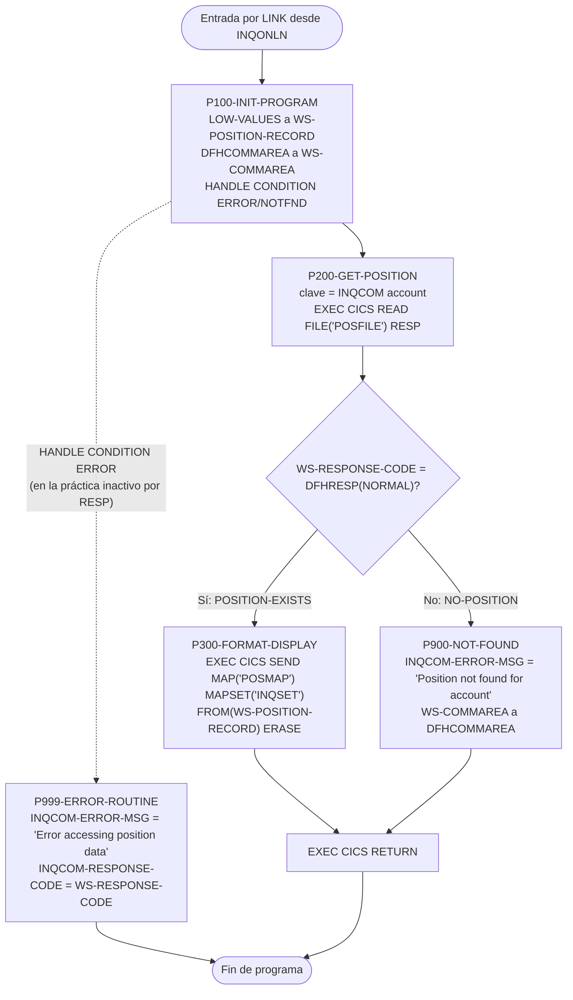
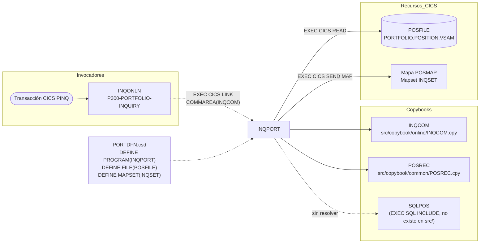

# INQPORT — Consulta online de posición de cartera (CICS)

> Generado a partir del análisis del código fuente `src/programs/online/INQPORT.cbl`. Ver el [grafo de dependencias global](../technical/dependency-graph.md).

## Ficha técnica
| Campo | Valor |
| --- | --- |
| Ruta | `src/programs/online/INQPORT.cbl` |
| Categoría | online |
| Tipo | CICS online (subprograma invocado por `EXEC CICS LINK`) |
| Líneas | 110 |
| Punto de entrada | Subrutina invocada por `LINK` desde `INQONLN` (transacción CICS `PINQ`, definida en `src/cics/PORTDFN.csd`); no tiene transacción propia |
| Invocado por | `INQONLN` (párrafo `P300-PORTFOLIO-INQUIRY`, `EXEC CICS LINK PROGRAM('INQPORT') COMMAREA(WS-COMMAREA)`) |
| Invoca a | Ningún programa (ni `CALL` ni `LINK`). Recursos CICS: fichero `POSFILE` (READ) y mapa `POSMAP` del mapset `INQSET` (SEND MAP) |

## Propósito
`INQPORT` es el manejador de la opción "Portfolio Position Inquiry" de la capa online del sistema. Recibe en la COMMAREA (copybook `INQCOM`) el número de cuenta introducido por el usuario, lee con `EXEC CICS READ` el registro de posición correspondiente del fichero VSAM `POSFILE` y, si existe, lo envía a pantalla con el mapa BMS `POSMAP` del mapset `INQSET`. Si la posición no existe o la lectura falla, devuelve un mensaje de error al programa llamador (`INQONLN`) a través de la COMMAREA. Es un programa de solo lectura: no actualiza ficheros ni tablas DB2 y no gestiona commits ni rollback.

## Funcionamiento

### Flujo principal (`PROCEDURE DIVISION`)
1. `PERFORM P100-INIT-PROGRAM THRU P100-EXIT` — inicialización y registro de condiciones CICS.
2. `PERFORM P200-GET-POSITION THRU P200-EXIT` — lectura del registro de posición en `POSFILE`.
3. `IF POSITION-EXISTS` → `PERFORM P300-FORMAT-DISPLAY THRU P300-EXIT`; en caso contrario `PERFORM P900-NOT-FOUND THRU P900-EXIT`.
4. `EXEC CICS RETURN END-EXEC` — devuelve el control al programa que hizo el `LINK` (`INQONLN`).

### Párrafo a párrafo
- **`P100-INIT-PROGRAM`**
  - `MOVE LOW-VALUES TO WS-POSITION-RECORD`: limpia el área de trabajo del registro de posición.
  - `MOVE DFHCOMMAREA TO WS-COMMAREA`: copia la COMMAREA recibida (estructura `INQCOM`) a WORKING-STORAGE para trabajar sobre una copia local.
  - `EXEC CICS HANDLE CONDITION ERROR(P999-ERROR-ROUTINE) NOTFND(P900-NOT-FOUND)`: registra dos rutinas de condición: cualquier error genérico salta a `P999-ERROR-ROUTINE` y un "registro no encontrado" a `P900-NOT-FOUND` (ver observaciones: en la práctica estas rutas quedan desactivadas por el uso de `RESP`).
- **`P200-GET-POSITION`**
  - Mueve el número de cuenta de la COMMAREA (`WS-COMMAREA-ACCOUNT-NO`) al campo de clave del registro (`POSITION-ACCOUNT OF WS-POSITION-RECORD`).
  - `EXEC CICS READ FILE('POSFILE') INTO(WS-POSITION-RECORD) RIDFLD(POSITION-ACCOUNT OF WS-POSITION-RECORD) RESP(WS-RESPONSE-CODE)`: lectura directa por clave del fichero VSAM `POSFILE`.
  - Si `WS-RESPONSE-CODE = DFHRESP(NORMAL)` activa el flag `POSITION-EXISTS`; para cualquier otro código de respuesta activa `NO-POSITION`.
- **`P300-FORMAT-DISPLAY`**
  - `EXEC CICS SEND MAP('POSMAP') MAPSET('INQSET') FROM(WS-POSITION-RECORD) ERASE RESP(WS-RESPONSE-CODE)`: envía la pantalla de posición usando directamente el registro leído como área de datos del mapa. No hay ningún formateo previo de campos (a pesar del nombre del párrafo) y el `RESP` del `SEND MAP` no se comprueba.
- **`P900-NOT-FOUND`**
  - Mueve el literal `'Position not found for account'` a `INQCOM-ERROR-MSG OF WS-COMMAREA` y devuelve la COMMAREA completa al llamador (`MOVE WS-COMMAREA TO DFHCOMMAREA`). No envía ninguna pantalla.
- **`P999-ERROR-ROUTINE`**
  - Mueve el literal `'Error accessing position data'` a `INQCOM-ERROR-MSG`, copia `WS-RESPONSE-CODE` a `INQCOM-RESPONSE-CODE` y devuelve la COMMAREA al llamador. Solo es alcanzable vía `HANDLE CONDITION ERROR`; el flujo normal nunca la ejecuta con `PERFORM`.

## Interfaz
- **Parámetros / LINKAGE SECTION / COMMAREA**: `DFHCOMMAREA` con la estructura del copybook `INQCOM` (`INQCOM-AREA`, 98 bytes), recibida por `LINK` desde `INQONLN`:

  | Campo | PIC | Uso en INQPORT |
  | --- | --- | --- |
  | `INQCOM-FUNCTION` | `X(4)` (`MENU`/`INQP`/`INQH`/`EXIT`) | No se consulta (el enrutado lo hace `INQONLN`) |
  | `INQCOM-ACCOUNT-NO` | `X(10)` | Entrada: cuenta a consultar (el código la referencia como `WS-COMMAREA-ACCOUNT-NO`, ver observaciones) |
  | `INQCOM-RESPONSE-CODE` | `S9(8) COMP` | Salida: solo se informa en `P999-ERROR-ROUTINE` con el `RESP` CICS |
  | `INQCOM-ERROR-MSG` | `X(80)` | Salida: mensaje de error en `P900-NOT-FOUND` y `P999-ERROR-ROUTINE` |

- **Ficheros (DDNAME, organización, modo de apertura, clave)**:

  | Recurso CICS | Definición (`PORTDFN.csd`) | Organización | Acceso en INQPORT | Clave usada |
  | --- | --- | --- | --- | --- |
  | `POSFILE` | `DSNAME(PORTFOLIO.POSITION.VSAM)`, `RECORDSIZE(200)`, `READ(YES) BROWSE(YES) ADD(YES) UPDATE(NO) DELETE(NO)` | VSAM KSDS (inferido: se lee por `RIDFLD`) | `EXEC CICS READ ... INTO` (lectura directa, sin `UPDATE`) | `RIDFLD(POSITION-ACCOUNT OF WS-POSITION-RECORD)` — campo no definido en `POSREC` (ver observaciones) |

  El programa no tiene `FILE-CONTROL` ni `FD`: todo el acceso a ficheros es vía CICS File Control. El dataset `PORTFOLIO.POSITION.VSAM` no aparece en `src/database/vsam/vsam-definitions.txt`; probablemente corresponde al maestro de posiciones que los programas batch abren con el DDNAME `POSMSTRE` (`PROD.POSITION.MASTER`), pero no se define en el repositorio.

- **Tablas DB2 y sentencias SQL**: No aplica. La única sentencia SQL es `EXEC SQL INCLUDE SQLPOS END-EXEC` (inclusión de un miembro que no existe en `src/`); no hay `SELECT`, `INCLUDE SQLCA` ni comprobación de `SQLCODE`.

- **Mapas BMS / comandos CICS**:

  | Comando | Párrafo | Detalle |
  | --- | --- | --- |
  | `HANDLE CONDITION ERROR(...) NOTFND(...)` | `P100-INIT-PROGRAM` | Registra `P999-ERROR-ROUTINE` y `P900-NOT-FOUND` |
  | `READ FILE('POSFILE') INTO RIDFLD RESP` | `P200-GET-POSITION` | Lectura directa por clave |
  | `SEND MAP('POSMAP') MAPSET('INQSET') FROM ERASE RESP` | `P300-FORMAT-DISPLAY` | Envía la pantalla de posición |
  | `RETURN` | Flujo principal | Devuelve el control a `INQONLN` |

  Mapa `POSMAP` (`src/maps/INQSET.bms`, 24x80): título "Portfolio Position Inquiry"; campo de entrada `ACCTIN` (10, `UNPROT,IC`); campos de salida protegidos `FUNDOUT` (6), `NAMEOUT` (30), `UNITOUT` (15), `COSTOUT` (15), `VALOUT` (15); línea de teclas "PF3=Exit PF7=Previous PF8=Next" y campo de mensaje `POSMSG` (78, rojo). El programa nunca hace `RECEIVE MAP` ni referencia individualmente estos campos.

- **Códigos de retorno / RETURN-CODE**: No utiliza `RETURN-CODE`. El resultado se comunica al llamador únicamente por la COMMAREA:
  - Éxito: la pantalla se ha enviado y la COMMAREA vuelve sin modificar (`INQCOM-ERROR-MSG` con el contenido que traía, `INQCOM-RESPONSE-CODE` sin informar).
  - `READ` con `RESP` distinto de `NORMAL` (incluido `NOTFND`, pero también `NOTOPEN`, `DISABLED`, `IOERR`, `LENGERR`, etc.): `INQCOM-ERROR-MSG = 'Position not found for account'`; el código `RESP` real no se devuelve.
  - Condición `ERROR` capturada por `HANDLE CONDITION`: `INQCOM-ERROR-MSG = 'Error accessing position data'` e `INQCOM-RESPONSE-CODE = WS-RESPONSE-CODE`.

## Estructuras de datos clave
| Copybook / área | Ubicación | Aporta |
| --- | --- | --- |
| `INQCOM` (`src/copybook/online/INQCOM.cpy`) | `WS-COMMAREA` y `DFHCOMMAREA` | Área de comunicación de la consulta online: función (`INQCOM-FUNCTION` con 88 `INQCOM-MENU`/`INQCOM-PORTFOLIO`/`INQCOM-HISTORY`/`INQCOM-EXIT`), cuenta, código de respuesta y mensaje de error |
| `POSREC` (`src/copybook/common/POSREC.cpy`) | `WS-POSITION-RECORD` | Registro de posición (`POSITION-RECORD`, 138 bytes): clave `POS-KEY` = `POS-PORTFOLIO-ID X(8)` + `POS-DATE X(8)` + `POS-INVESTMENT-ID X(10)`; datos `POS-QUANTITY S9(11)V9(4) COMP-3`, `POS-COST-BASIS S9(13)V9(2) COMP-3`, `POS-MARKET-VALUE S9(13)V9(2) COMP-3`, `POS-CURRENCY X(3)`, `POS-STATUS X(1)` (`A`/`C`/`P`); auditoría `POS-LAST-MAINT-DATE X(26)`, `POS-LAST-MAINT-USER X(8)`; `POS-FILLER X(50)` |
| `SQLPOS` (`EXEC SQL INCLUDE`) | `WS-DB2-POSITION` | Presumiblemente una DCLGEN de la tabla de posiciones; **no existe en el repositorio** y no se usa en ninguna sentencia |

Campos de WORKING-STORAGE propios:

| Campo | PIC / valor | Uso |
| --- | --- | --- |
| `WS-RESPONSE-CODE` | `S9(8) COMP` | Recibe el `RESP` del `READ` y del `SEND MAP`; se compara con `DFHRESP(NORMAL)` |
| `WS-POSITION-FOUND` | `X` inicial `'N'`; 88 `POSITION-EXISTS` (`'Y'`) / `NO-POSITION` (`'N'`) | Flag que decide entre `P300-FORMAT-DISPLAY` y `P900-NOT-FOUND` |
| `WS-MAP-FIELDS` (`WS-ACCOUNT-LABEL`, `WS-FUND-LABEL`, `WS-UNITS-LABEL`, `WS-COST-LABEL`, `WS-VALUE-LABEL`) | Literales `'Account:'`, `'Fund ID:'`, `'Units:'`, `'Cost Basis:'`, `'Market Value:'` | Etiquetas de pantalla; **no se referencian en ningún párrafo** (las etiquetas ya van como `INITIAL` en el mapa `POSMAP`) |

No hay contadores, umbrales de commit ni lógica de checkpoint: el programa procesa una única consulta por invocación.

## Reglas de negocio y validaciones
El programa implementa una lógica mínima; las únicas reglas que se pueden extraer del código son:
1. **Una consulta = una lectura directa por clave**: la cuenta recibida en la COMMAREA se usa tal cual como clave de `POSFILE`; no se valida que venga informada, que sea numérica ni que tenga la longitud de la clave del fichero.
2. **Existencia de la posición**: se considera que la posición existe si y solo si el `READ` devuelve `DFHRESP(NORMAL)`. Cualquier otro resultado se trata como "posición no encontrada".
3. **Presentación**: si existe, se envía el mapa `POSMAP` con `ERASE` (pantalla limpia) tomando el registro como área de datos del mapa; no se aplican formatos, conversiones de COMP-3 a display ni cálculos (no se calculan valoraciones, ganancias/pérdidas ni resúmenes de cartera).
4. **Sin control de estado del registro**: no se consulta `POS-STATUS` (`A`/`C`/`P`), por lo que se muestran igualmente posiciones cerradas o pendientes.
5. **Sin seguridad ni auditoría propias**: la comprobación de acceso la hace `INQONLN` (vía `SECMGR`), no `INQPORT`.

No hay `EVALUATE` de tipos de transacción, límites ni cálculos financieros en este programa.

## Manejo de errores y recuperación
- **FILE STATUS / SQLCODE**: no aplica (no hay ficheros COBOL nativos ni sentencias SQL ejecutables).
- **Condiciones CICS**:
  - `EXEC CICS HANDLE CONDITION ERROR(P999-ERROR-ROUTINE) NOTFND(P900-NOT-FOUND)` en `P100-INIT-PROGRAM`.
  - Los dos comandos que pueden fallar (`READ` y `SEND MAP`) llevan la opción `RESP(...)`. En CICS, la presencia de `RESP` en un comando inhibe el `HANDLE CONDITION` para ese comando, de modo que el tratamiento efectivo del `READ` es el `IF WS-RESPONSE-CODE = DFHRESP(NORMAL)` de `P200-GET-POSITION`, y el error del `SEND MAP` simplemente se ignora. `P999-ERROR-ROUTINE` queda, en la práctica, como código muerto.
  - `P900-NOT-FOUND` y `P999-ERROR-ROUTINE` informan `INQCOM-ERROR-MSG` (y, solo la segunda, `INQCOM-RESPONSE-CODE`) y devuelven la COMMAREA al llamador; ninguna de las dos envía pantalla ni llama a `ERRHNDL`.
  - Si la rama `HANDLE CONDITION` llegase a activarse, el control saltaría a mitad del `PERFORM ... THRU` en curso; tras `P999-EXIT` el programa terminaría por caída al final del código (no hay `EXEC CICS RETURN` después de `P999-EXIT`).
- **Checkpoint / restart / rollback**: no aplica; el programa es de solo lectura y no participa en unidades de trabajo recuperables.
- **ERRPROC / ERRHNDL / DB2ERR**: no se invoca ninguno. El mensaje devuelto en `INQCOM-ERROR-MSG` depende de que `INQONLN` lo procese; en el código actual de `INQONLN`, `P300-PORTFOLIO-INQUIRY` hace el `LINK` y no examina después `INQCOM-ERROR-MSG` ni `INQCOM-RESPONSE-CODE`, por lo que el mensaje no llega a mostrarse al usuario.

## Dependencias

## Observaciones y problemas detectados
1. **Referencia a un campo inexistente en la clave del `READ`**: `POSITION-ACCOUNT OF WS-POSITION-RECORD` (líneas 70 y 74) no está definido en `POSREC.cpy`, cuya clave es `POS-KEY` (`POS-PORTFOLIO-ID` + `POS-DATE` + `POS-INVESTMENT-ID`). El programa no compilaría tal cual.
2. **Referencia a un campo inexistente en la COMMAREA**: `WS-COMMAREA-ACCOUNT-NO` (línea 69) no existe; el campo de `INQCOM.cpy` se llama `INQCOM-ACCOUNT-NO`. Mismo patrón de error que `WS-COMMAREA-FUNCTION` en `INQONLN`.
3. **Copybook SQL inexistente**: `EXEC SQL INCLUDE SQLPOS END-EXEC` (línea 21) referencia un miembro que no está en `src/` (solo existe `src/copybook/db2/SQLCA.cpy`). Además obliga a pasar el programa por el precompilador DB2 sin que haya ninguna sentencia SQL ejecutable ni `INCLUDE SQLCA`. El grafo de dependencias no lo marca como copybook inexistente porque solo rastrea `COPY`.
4. **Niveles 01 anidados**: `01 WS-COMMAREA. COPY INQCOM.`, `01 WS-POSITION-RECORD. COPY POSREC.` y `01 DFHCOMMAREA. COPY INQCOM.` incluyen copybooks que a su vez empiezan por un nivel `01` (`INQCOM-AREA`, `POSITION-RECORD`). El resultado son registros 01 sin subordinados ni `PICTURE` seguidos de otro 01 independiente, por lo que los calificadores `OF WS-COMMAREA` / `OF WS-POSITION-RECORD` no resolverían como pretende el código y `INQCOM-AREA` quedaría definido dos veces (WORKING-STORAGE y LINKAGE). Probablemente el autor asumía copybooks de nivel 05.
5. **Desajuste semántico y de longitud de la clave**: la COMMAREA aporta una "cuenta" de 10 bytes (`INQCOM-ACCOUNT-NO`), mientras que la clave real del registro de posición es de 26 bytes (cartera + fecha + inversión). Aunque se corrigieran los nombres, un `READ` directo con esa clave parcial requeriría `GENERIC`/`KEYLENGTH`; con `RIDFLD` apuntando a un campo de 10 bytes, CICS tomaría como clave los 26 bytes a partir de esa dirección.
6. **`SEND MAP ... FROM(WS-POSITION-RECORD)` envía el registro crudo**: el área `FROM` de un `SEND MAP` debe ser la estructura simbólica generada por BMS (`POSMAPO`, con longitud/atributo/dato por campo). El programa no incluye el copybook simbólico de `INQSET`, nunca informa `FUNDOUT`, `NAMEOUT`, `UNITOUT`, `COSTOUT` ni `VALOUT`, y los importes COMP-3 no se convierten a formato visualizable. Lo que aparecería en pantalla no se corresponde con el mapa. El mapa además define `NAMEOUT` ("Fund Name") que no tiene fuente de datos en `POSREC`.
7. **`HANDLE CONDITION` neutralizado por `RESP`**: al llevar `RESP` tanto el `READ` como el `SEND MAP`, las rutinas `P999-ERROR-ROUTINE` (ERROR) y `P900-NOT-FOUND` (NOTFND) nunca se activan por `HANDLE CONDITION`; `P999-ERROR-ROUTINE` es código muerto y el `RESP` del `SEND MAP` no se comprueba.
8. **Todo error se reporta como "no encontrado"**: cualquier `RESP` distinto de `NORMAL` (fichero cerrado, deshabilitado, error de E/S, `LENGERR`…) se traduce a `'Position not found for account'` y el código `RESP` real no se copia a `INQCOM-RESPONSE-CODE`, lo que dificulta el diagnóstico.
9. **El mensaje de error no llega al usuario**: `P900-NOT-FOUND` no envía pantalla y `INQONLN` no examina la COMMAREA tras el `LINK`, por lo que en la ruta de error el terminal no recibe ninguna respuesta de la consulta. Tampoco se invoca `ERRHNDL`, a diferencia de lo que indica `system-architecture.md` (§5.1.4).
10. **Longitud de registro inconsistente**: `POSREC` define 138 bytes, `PORTDFN.csd` declara `RECORDSIZE(200)` para `POSFILE` y `data-dictionary.md` (§2.2) documenta 250 bytes con un layout distinto (`POS-ACCOUNT-NO 9(9)` + `POS-FUND-ID X(6)`). Un `READ INTO` sobre un área más corta que el registro puede provocar `LENGERR` o truncamiento (inferencia; depende de la definición real del fichero).
11. **Discrepancias con la documentación de arquitectura** (manda el código): `system-architecture.md` atribuye a `INQPORT` dependencias de `DB2ONLN`, `ERRHNDL`, `CURSMGR` y `SECMGR`, acceso a DB2 y funciones de "resúmenes de cartera" y "búsqueda de carteras" (§1.2.6, §2.5, §5.1.4, §5.2.2). El código solo hace un `READ` VSAM y un `SEND MAP`; no accede a DB2 ni invoca ningún programa. La cabecera del propio fuente ("Handles VSAM and DB2 access") también sobrestima lo implementado. El layout de COMMAREA de `data-dictionary.md` §4.1 (`INQUERY-COMMAREA`) tampoco coincide con `INQCOM.cpy`.
12. **Modelo de datos mezclado**: el programa está escrito contra un modelo cuenta/fondo (`account`, `Fund ID`, etiquetas `WS-MAP-FIELDS`, campos del mapa) mientras que `POSREC.cpy` y la tabla DB2 `INVESTMENT_POSITIONS` usan cartera/inversión (`PORTFOLIO_ID`, `INVESTMENT_ID`). Esto explica las referencias sin resolver de los puntos 1 y 5.
13. **Código sin uso**: el grupo `WS-MAP-FIELDS` (etiquetas) y el área `WS-DB2-POSITION` no se referencian en la PROCEDURE DIVISION.
14. **Entrada dependiente de un mapa inexistente**: la cuenta que recibe `INQPORT` la obtiene `INQONLN` con `RECEIVE MAP('INQMAP') ... INTO(WS-COMMAREA)`, pero `INQSET.bms` no define ningún mapa `INQMAP` (solo `MENMAP`, `POSMAP`, `HISMAP`, `ERRMAP`), por lo que en el estado actual no hay una vía funcional para que `INQCOM-ACCOUNT-NO` llegue informado.
15. **Fichero no definido en el repositorio**: `PORTFOLIO.POSITION.VSAM` (DSNAME de `POSFILE`) no aparece en `vsam-definitions.txt`, que documenta `PORTMSTR`, `TRANHIST` y `POSHIST`; los batch usan `PROD.POSITION.MASTER`. No se puede confirmar en `src/` la definición del cluster ni su clave.

## Referencias
- Programa: [INQPORT.cbl](../../src/programs/online/INQPORT.cbl)
- Programa llamador: [INQONLN.cbl](../../src/programs/online/INQONLN.cbl)
- Programa hermano (consulta de histórico): [INQHIST.cbl](../../src/programs/online/INQHIST.cbl)
- Copybooks: [INQCOM.cpy](../../src/copybook/online/INQCOM.cpy), [POSREC.cpy](../../src/copybook/common/POSREC.cpy)
- Mapset BMS: [INQSET.bms](../../src/maps/INQSET.bms)
- Definiciones CICS (transacción `PINQ`, programa `INQPORT`, fichero `POSFILE`, mapset `INQSET`): [PORTDFN.csd](../../src/cics/PORTDFN.csd)
- Definiciones VSAM: [vsam-definitions.txt](../../src/database/vsam/vsam-definitions.txt)
- DDL DB2 relacionado (tabla `INVESTMENT_POSITIONS`): [db2-definitions.sql](../../src/database/db2/db2-definitions.sql)
- Documentación de arquitectura: [system-architecture.md](../technical/system-architecture.md), [data-dictionary.md](../technical/data-dictionary.md)
- Grafo de dependencias: [dependency-graph.md](../technical/dependency-graph.md), [dependency-graph.json](../technical/dependency-graph.json)
