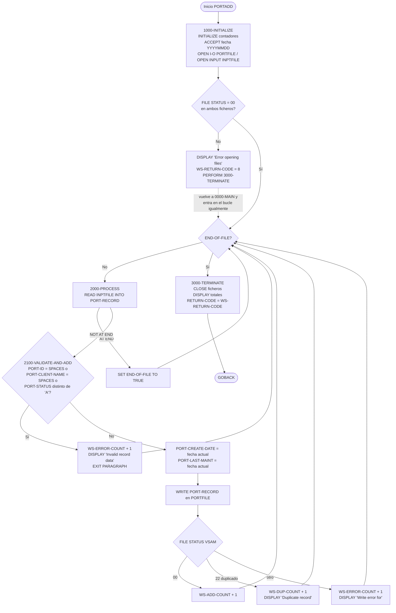
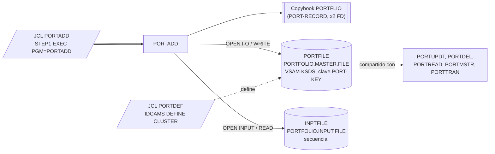

# PORTADD — Alta batch de carteras en el fichero maestro VSAM

> Generado a partir del análisis del código fuente `src/programs/portfolio/PORTADD.cbl`. Ver el [grafo de dependencias global](../technical/dependency-graph.md).

## Ficha técnica
| Campo | Valor |
| --- | --- |
| Ruta | `src/programs/portfolio/PORTADD.cbl` |
| Categoría | portfolio |
| Tipo | batch |
| Líneas | 148 |
| Punto de entrada | JCL `PORTADD` (`src/jcl/portfolio/PORTADD.jcl`, paso `STEP1`, `EXEC PGM=PORTADD`) |
| Invocado por | JCL `PORTADD`. Ningún programa COBOL lo invoca mediante `CALL` ni `EXEC CICS LINK`. |
| Invoca a | Ningún programa. No usa `CALL`, ni CICS, ni DB2. Solo copybook `PORTFLIO` y los ficheros `PORTFILE` (VSAM KSDS) e `INPTFILE` (secuencial). |

## Propósito
`PORTADD` es un programa batch sencillo de **alta masiva de carteras**: lee un fichero secuencial de entrada (`INPTFILE`) cuyos registros ya tienen el formato del registro maestro de cartera (`PORT-RECORD`, copybook `PORTFLIO`), aplica una validación mínima a cada uno, sella las fechas de creación y última modificación con la fecha del sistema y los inserta (`WRITE`) en el fichero maestro VSAM KSDS de carteras (`PORTFILE`, dataset `PORTFOLIO.MASTER.FILE`).

Pertenece al conjunto de utilidades de mantenimiento del maestro de carteras de la categoría `portfolio` (`PORTADD` alta, `PORTUPDT` modificación, `PORTDEL` baja, `PORTREAD` consulta, `PORTDEF` definición del VSAM). No forma parte de la cadena batch diaria descrita en `system-architecture.md` (TRNVAL00 → POSUPD00 → HISTLD00 → RPT*), ni usa el framework de control batch (BCHCTL, checkpoint/restart) ni el gestor de errores común `ERRPROC`.

## Funcionamiento

El programa sigue la estructura clásica inicialización → bucle de proceso → terminación. Todos los mensajes se emiten por `DISPLAY` (SYSOUT).

### `0000-MAIN`
1. `PERFORM 1000-INITIALIZE`.
2. `PERFORM 2000-PROCESS UNTIL END-OF-FILE` (bucle de lectura del fichero de entrada).
3. `PERFORM 3000-TERMINATE`.
4. `GOBACK`.

### `1000-INITIALIZE`
1. `INITIALIZE WS-WORK-AREAS`: pone a cero los contadores (`WS-ADD-COUNT`, `WS-ERROR-COUNT`, `WS-DUP-COUNT`), `WS-RETURN-CODE` y `WS-CURRENT-DATE`.
2. `ACCEPT WS-CURRENT-DATE FROM DATE YYYYMMDD`: obtiene la fecha del sistema en formato `AAAAMMDD`.
3. `OPEN I-O PORTFOLIO-FILE` (VSAM, `PORTFILE`) y `OPEN INPUT INPUT-FILE` (`INPTFILE`).
4. Si alguno de los dos `FILE STATUS` no es `'00'` (`NOT WS-SUCCESS-STATUS OR NOT WS-INPUT-SUCCESS`):
   - `DISPLAY 'Error opening files: ' 'PORT=' WS-FILE-STATUS 'INPT=' WS-INPUT-STATUS`.
   - `MOVE WS-ERROR (+8) TO WS-RETURN-CODE`.
   - `PERFORM 3000-TERMINATE` (cierra ficheros, muestra totales y fija `RETURN-CODE`).
   - **Importante**: tras el `PERFORM 3000-TERMINATE` el control vuelve a `0000-MAIN`, que sigue con el bucle `2000-PROCESS`; no hay `GOBACK`/`STOP RUN` en la rama de error (ver [Observaciones](#observaciones-y-problemas-detectados)).

### `2000-PROCESS` (se ejecuta una vez por iteración del bucle)
1. `READ INPUT-FILE INTO PORT-RECORD`: lee el siguiente registro secuencial y lo copia al área de registro (el `INTO` mueve el contenido leído al `PORT-RECORD` destino; ver observación sobre la ambigüedad del nombre).
2. `AT END` → `SET END-OF-FILE TO TRUE` (`WS-END-OF-FILE-SW = 'Y'`), lo que termina el bucle.
3. `NOT AT END` → `PERFORM 2100-VALIDATE-AND-ADD`.
4. No se comprueba `WS-INPUT-STATUS` tras la lectura: un error de E/S distinto de fin de fichero no se detecta.

### `2100-VALIDATE-AND-ADD`
1. **Validación** (`IF ... OR ... OR ...`): el registro se rechaza si
   - `PORT-ID = SPACES`, o
   - `PORT-CLIENT-NAME = SPACES`, o
   - `PORT-STATUS NOT = 'A'` (solo se admiten carteras activas).

   En caso de rechazo: `ADD 1 TO WS-ERROR-COUNT`, `DISPLAY 'Invalid record data: ' PORT-ID` y `EXIT PARAGRAPH` (se salta el alta).
2. **Sellado de fechas**: `MOVE WS-CURRENT-DATE TO PORT-CREATE-DATE` y `MOVE WS-CURRENT-DATE TO PORT-LAST-MAINT`. Las fechas que vengan en el fichero de entrada se sobrescriben siempre; el resto de campos (`PORT-ACCOUNT-NO`, `PORT-CLIENT-TYPE`, importes, `PORT-LAST-USER`, `PORT-LAST-TRANS`, `PORT-FILLER`) se graban tal como llegan.
3. **Alta**: `WRITE PORT-RECORD` sobre `PORTFOLIO-FILE` (acceso `RANDOM`, clave `PORT-KEY`).
4. **Evaluación del `FILE STATUS`** del VSAM (`EVALUATE TRUE`):
   - `WS-SUCCESS-STATUS` (`'00'`) → `ADD 1 TO WS-ADD-COUNT`.
   - `WS-DUP-STATUS` (`'22'`, clave duplicada) → `ADD 1 TO WS-DUP-COUNT`, `DISPLAY 'Duplicate record: ' PORT-ID`.
   - `WHEN OTHER` → `ADD 1 TO WS-ERROR-COUNT`, `DISPLAY 'Write error for: ' PORT-ID`.

   Ninguna de las tres ramas modifica `WS-RETURN-CODE`.

### `3000-TERMINATE`
1. `CLOSE PORTFOLIO-FILE INPUT-FILE` (no se comprueba el estado del cierre).
2. Muestra los totales: `'Records added:    '`, `'Duplicate records:'`, `'Errors occurred:  '`.
3. `MOVE WS-RETURN-CODE TO RETURN-CODE`: propaga el código de retorno del paso JCL.

## Interfaz

- **Parámetros / LINKAGE SECTION / COMMAREA**: No aplica. El programa no tiene `LINKAGE SECTION` ni `PROCEDURE DIVISION USING`; no lee `PARM` del JCL ni `SYSIN`.

- **Ficheros (DDNAME, organización, modo de apertura, clave)**:

| Fichero COBOL | DDNAME | Dataset (JCL `PORTADD`) | Organización / acceso | Apertura | Clave | FILE STATUS | Operaciones |
| --- | --- | --- | --- | --- | --- | --- | --- |
| `PORTFOLIO-FILE` | `PORTFILE` | `PORTFOLIO.MASTER.FILE` (`DISP=SHR`) | `INDEXED` (VSAM KSDS), `ACCESS MODE IS RANDOM` | `I-O` | `RECORD KEY IS PORT-KEY` (18 bytes: `PORT-ID` X(8) + `PORT-ACCOUNT-NO` X(10)) | `WS-FILE-STATUS` | `OPEN`, `WRITE`, `CLOSE` |
| `INPUT-FILE` | `INPTFILE` | `PORTFOLIO.INPUT.FILE` (`DISP=OLD`) | `SEQUENTIAL` | `INPUT` | — | `WS-INPUT-STATUS` | `OPEN`, `READ ... INTO`, `CLOSE` |

  Ambos `FD` usan el mismo layout (`COPY PORTFLIO`), por lo que el fichero de entrada debe tener registros de 148 bytes con la misma estructura que el maestro (longitud calculada a partir del copybook: 18 + 31 + 17 + 16 + 16 + 50).

- **Tablas DB2 y sentencias SQL**: No aplica.

- **Mapas BMS / comandos CICS**: No aplica.

- **Códigos de retorno / RETURN-CODE**:

| Valor | Condición |
| --- | --- |
| `0` | Ejecución normal, **incluso si ha habido registros inválidos, duplicados o errores de `WRITE`** (esos casos solo se contabilizan y se muestran por `DISPLAY`). |
| `8` (`WS-ERROR`) | Fallo en el `OPEN` de `PORTFOLIO-FILE` o de `INPUT-FILE` (`FILE STATUS` distinto de `'00'`). |

  La constante `WS-SUCCESS` (+0) se define pero no se usa. Otras salidas: mensajes `DISPLAY` en SYSOUT (`Records added`, `Duplicate records`, `Errors occurred` y un mensaje por cada registro rechazado, duplicado o con error de escritura).

## Estructuras de datos clave

### Copybook `PORTFLIO` (`src/copybook/common/PORTFLIO.cpy`)
Layout del registro maestro de cartera `PORT-RECORD` (148 bytes). Se incluye **dos veces**, en el `FD PORTFOLIO-FILE` y en el `FD INPUT-FILE`.

| Campo | PIC | Uso en PORTADD |
| --- | --- | --- |
| `PORT-KEY` | grupo (18 bytes) | Clave del KSDS (`RECORD KEY`). |
| `PORT-ID` | `X(8)` | Validado ≠ `SPACES`; se muestra en todos los mensajes de error. |
| `PORT-ACCOUNT-NO` | `X(10)` | Parte de la clave; **no se valida**. |
| `PORT-CLIENT-NAME` | `X(30)` | Validado ≠ `SPACES`. |
| `PORT-CLIENT-TYPE` | `X(1)` (88: `I`/`C`/`T`) | Se graba tal cual; **no se valida**. |
| `PORT-CREATE-DATE` | `9(8)` | Sobrescrito con la fecha del sistema. |
| `PORT-LAST-MAINT` | `9(8)` | Sobrescrito con la fecha del sistema. |
| `PORT-STATUS` | `X(1)` (88: `A`/`C`/`S`) | Debe ser `'A'` (se compara con el literal, no con el 88 `PORT-ACTIVE`). |
| `PORT-TOTAL-VALUE`, `PORT-CASH-BALANCE` | `S9(13)V99 COMP-3` | Se graban tal cual llegan del fichero de entrada. |
| `PORT-LAST-USER`, `PORT-LAST-TRANS` | `X(8)`, `9(8)` | Se graban tal cual; no se informa el usuario ni la transacción del alta. |
| `PORT-FILLER` | `X(50)` | Reservado. |

### WORKING-STORAGE
| Campo | Definición | Función |
| --- | --- | --- |
| `WS-PROGRAM-NAME` | `X(08) VALUE 'PORTADD  '` | Nombre del programa; no se referencia en el código (el literal tiene 9 caracteres y se trunca). |
| `WS-SUCCESS` / `WS-ERROR` | `S9(4)` `+0` / `+8` | Códigos de retorno; solo `WS-ERROR` se usa. |
| `WS-FILE-STATUS` | `X(02)` | Estado del VSAM. 88: `WS-SUCCESS-STATUS` `'00'`, `WS-DUP-STATUS` `'22'`, `WS-EOF-STATUS` `'10'` (este último no se usa). |
| `WS-INPUT-STATUS` | `X(02)` | Estado del secuencial. 88: `WS-INPUT-SUCCESS` `'00'`, `WS-INPUT-EOF` `'10'` (no se usa; el fin de fichero se detecta con `AT END`). |
| `WS-END-OF-FILE-SW` | `X VALUE 'N'` | Condición de salida del bucle principal (88 `END-OF-FILE` / `NOT-END-OF-FILE`). |
| `WS-ADD-COUNT` | `9(7)` | Registros grabados con éxito. |
| `WS-DUP-COUNT` | `9(7)` | Registros rechazados por clave duplicada (status `22`). |
| `WS-ERROR-COUNT` | `9(7)` | Registros inválidos + errores de `WRITE` distintos de duplicado. |
| `WS-RETURN-CODE` | `S9(4)` | Código de retorno a propagar a `RETURN-CODE`. |
| `WS-CURRENT-DATE` | `9(8)` | Fecha del sistema `AAAAMMDD`. |

No existen umbrales de commit, checkpoints ni contadores de frecuencia: el programa no usa el framework `CKPRST`/`BCHCTL`.

## Reglas de negocio y validaciones

1. **Solo se dan de alta carteras activas**: `PORT-STATUS` debe ser exactamente `'A'`; cualquier otro valor (`'C'` cerrada, `'S'` suspendida, blanco, etc.) rechaza el registro.
2. **Identificador obligatorio**: `PORT-ID` no puede estar en blanco.
3. **Nombre de cliente obligatorio**: `PORT-CLIENT-NAME` no puede estar en blanco.
4. **Fechas de auditoría fijadas por el sistema**: `PORT-CREATE-DATE` y `PORT-LAST-MAINT` se fijan a la fecha de ejecución, ignorando lo que traiga el fichero de entrada.
5. **No se permite sobrescribir carteras existentes**: se usa `WRITE` (no `REWRITE`); si la clave `PORT-KEY` ya existe, el VSAM devuelve `22` y el registro se contabiliza como duplicado sin modificar el maestro.
6. **Un registro rechazado no detiene el proceso**: todas las incidencias por registro se cuentan y se sigue con el siguiente; solo el fallo de apertura de ficheros se trata como error de programa (`RC=8`).
7. **Sin más validaciones**: no se comprueba `PORT-ACCOUNT-NO` (parte de la clave), `PORT-CLIENT-TYPE` (I/C/T), la coherencia numérica de los importes `COMP-3`, ni los campos de auditoría `PORT-LAST-USER`/`PORT-LAST-TRANS`. Tampoco existe cruce con ningún otro fichero o tabla (no hay validación de existencia de cuenta ni de cliente).

## Manejo de errores y recuperación

- **Errores de fichero (`FILE STATUS`)**:
  - Apertura: se comprueban ambos estados tras los dos `OPEN`. En caso de error se muestra un mensaje con ambos estados, se fija `WS-RETURN-CODE = 8` y se ejecuta `3000-TERMINATE`. Sin embargo, el programa no termina ahí (ver observaciones).
  - Lectura del secuencial: solo se gestiona `AT END`. Un `FILE STATUS` de error (p. ej. `30`, `47`) no ejecuta ni `AT END` ni `NOT AT END`, con lo que no se detecta.
  - Escritura en el VSAM: se distingue `'00'` (éxito), `'22'` (duplicado) y cualquier otro (error genérico). Ninguno modifica el código de retorno.
  - Cierre: no se comprueba el estado tras `CLOSE`.
- **SQLCODE / DB2**: No aplica (sin DB2).
- **Condiciones CICS**: No aplica (batch puro).
- **Checkpoint/restart y control batch**: no implementado. No usa `CKPRST`, `BCHCTL`, `PRCSEQ` ni ficheros de control. Al no haber commits intermedios (VSAM no transaccional en batch), un abend deja el maestro con las altas ya escritas; una reejecución del mismo fichero de entrada dará `22` (duplicado) para las ya grabadas y añadirá el resto, por lo que el proceso es en la práctica re-ejecutable, aunque los contadores de la segunda ejecución reflejarán duplicados.
- **Rollback**: no aplica; las escrituras VSAM son definitivas.
- **Llamadas a `ERRPROC` / `ERRHNDL` / `DB2ERR`**: ninguna. Todo el tratamiento de errores se limita a `DISPLAY` y contadores locales; no se escribe en ningún log de errores ni de auditoría.

## Dependencias

- **Programas llamados**: ninguno.
- **Programas llamadores**: ninguno (solo el JCL).
- **Copybooks**: `PORTFLIO` (existe en `src/copybook/common/`).
- **Tablas DB2**: ninguna.
- **Mapas BMS**: ninguno.
- **Definición del VSAM**: `src/jcl/portfolio/PORTDEF.jcl` (IDCAMS) y `src/database/vsam/vsam-definitions.txt` (documental). Ninguna definición en el repositorio para `PORTFOLIO.INPUT.FILE`; probablemente se genera fuera del sistema o con `TSTGEN00` (que escribe registros `PORTFLIO` en `PORTOUT`, aunque con un layout propio distinto).

## Observaciones y problemas detectados

1. **Nombres de datos duplicados (probable error de compilación)**: el copybook `PORTFLIO` se incluye en los dos `FD`, de modo que `PORT-RECORD`, `PORT-KEY`, `PORT-ID`, etc. quedan definidos dos veces. El programa los referencia sin cualificar (`RECORD KEY IS PORT-KEY`, `READ INPUT-FILE INTO PORT-RECORD`, `WRITE PORT-RECORD`, `IF PORT-ID ...`), lo que en Enterprise COBOL produce errores de nombre no único. Para compilar habría que cualificar (`PORT-RECORD OF PORTFOLIO-FILE`) o definir un layout propio para `INPUT-FILE` (como hace `PORTUPDT` con `UPDATE-RECORD`).
2. **El error de apertura no detiene el programa**: en `1000-INITIALIZE`, tras `PERFORM 3000-TERMINATE` no hay `GOBACK`/`STOP RUN`. El control vuelve a `0000-MAIN`, que ejecuta `PERFORM 2000-PROCESS UNTIL END-OF-FILE`. Como los ficheros están cerrados, el `READ` falla (status `47`), no se ejecuta ni `AT END` ni `NOT AT END`, `END-OF-FILE` nunca se activa y el programa **entra en un bucle infinito**. Si en algún momento saliera, `3000-TERMINATE` se ejecutaría una segunda vez (doble `CLOSE`). El mismo patrón aparece en `PORTUPDT`.
3. **Errores de lectura no controlados**: en `2000-PROCESS` no se examina `WS-INPUT-STATUS`. Cualquier error de E/S en `INPTFILE` distinto de fin de fichero provoca el mismo bucle infinito descrito arriba.
4. **Código de retorno poco informativo**: registros inválidos, duplicados y errores de `WRITE` no alteran `RETURN-CODE`, que queda en `0`. Esto contradice la tabla de códigos de retorno de `data-dictionary.md` (§8.2: `0004` avisos, `0008` errores) y dificulta condicionar pasos posteriores en el JCL.
5. **Discrepancia de longitud de registro con la definición VSAM**: el registro `PORT-RECORD` mide 148 bytes, pero `PORTDEF.jcl` define `PORTFOLIO.MASTER.FILE` con `RECORDSIZE(200 200)` (longitud fija de 200) y `vsam-definitions.txt` documenta `RECORDSIZE(400 400)` con clave de 12 bytes (`ID 8 + tipo de cuenta 2 + sucursal 2`). La clave del programa (`PORT-KEY`, 18 bytes) coincide con `KEYS(18 0)` de `PORTDEF.jcl` pero no con los 12 bytes de `vsam-definitions.txt`. Con un cluster de longitud fija 200, el `WRITE` de 148 bytes probablemente fallaría (caería en `WHEN OTHER`).
6. **Layouts incompatibles del mismo fichero dentro del repositorio**: `PORTMSTR` accede a `PORTFILE` con un registro propio de 100 bytes (`PORT-ID X(10)`, `PORT-NAME X(50)`, clave `PORT-ID`) y `PORTTRAN` con el copybook `PORTREC` (que no existe en `src/`) y clave `PORT-ID`; ambos incompatibles con el `PORTFLIO` (148 bytes, clave `PORT-KEY` de 18 bytes) que usa `PORTADD`. Los registros dados de alta por `PORTADD` no serían legibles correctamente por esos programas. Solo `PORTUPDT`, `PORTDEL` y `PORTREAD` comparten el layout `PORTFLIO`.
7. **Ausencia en la documentación de arquitectura**: `PORTADD` (y el resto de programas `portfolio`) no aparece en `system-architecture.md` ni en las tablas de dependencias de batch (§5.1); tampoco `data-dictionary.md` describe el fichero maestro de carteras (`PORTFLIO`), solo el de posiciones (`POSMSTRE`). El código es la única fuente para este programa.
8. **No sigue los estándares de la arquitectura para batch**: no usa `ERRPROC`, `ERRHAND`, `RTNCODE`, checkpoint/restart ni log de auditoría (`AUDPROC`), a diferencia de lo que `system-architecture.md` §6 establece para los programas batch. El alta no deja rastro de auditoría (`PORT-LAST-USER` y `PORT-LAST-TRANS` no se informan).
9. **Validación incompleta**: no se valida `PORT-ACCOUNT-NO` (parte de la clave; puede quedar en blanco), `PORT-CLIENT-TYPE` (valores `I`/`C`/`T` definidos en el copybook y no comprobados) ni los importes `COMP-3` (un valor no empaquetado válido procedente del fichero de entrada se grabaría tal cual).
10. **Cabecera mal alineada**: la primera línea del fuente tiene el `*` en la columna 8 (Área A) en lugar de la columna 7 (indicador de comentario), por lo que el compilador probablemente la trate como código y emita un error. Ocurre también en otros programas de la carpeta (`PORTUPDT`, `PORTDEL`).
11. **Detalles menores**: `WS-PROGRAM-NAME PIC X(08)` se inicializa con un literal de 9 caracteres (`'PORTADD  '`, truncado con aviso de compilación) y no se usa; `WS-SUCCESS`, `WS-EOF-STATUS` y `WS-INPUT-EOF` tampoco se usan; el mensaje de error de apertura concatena `'PORT='` e `'INPT='` sin separador; la comparación de estado usa el literal `'A'` en lugar del 88 `PORT-ACTIVE` del copybook.
12. **JCL**: `STEPLIB` apunta al marcador `YOUR.LOADLIB`; `PORTFILE` se asigna con `DISP=SHR` aunque el programa lo abre en `I-O` (aceptable solo por `SHAREOPTIONS(2 3)`); no hay pasos de respaldo previo ni condicionales `COND`.

## Referencias

- Programa: [PORTADD.cbl](../../src/programs/portfolio/PORTADD.cbl)
- Copybook: [PORTFLIO.cpy](../../src/copybook/common/PORTFLIO.cpy)
- JCL de ejecución: [PORTADD.jcl](../../src/jcl/portfolio/PORTADD.jcl)
- JCL de definición del VSAM maestro: [PORTDEF.jcl](../../src/jcl/portfolio/PORTDEF.jcl)
- Definiciones VSAM documentales: [vsam-definitions.txt](../../src/database/vsam/vsam-definitions.txt)
- Programas relacionados que comparten `PORTFILE`: [PORTUPDT.cbl](../../src/programs/portfolio/PORTUPDT.cbl), [PORTDEL.cbl](../../src/programs/portfolio/PORTDEL.cbl), [PORTREAD.cbl](../../src/programs/portfolio/PORTREAD.cbl), [PORTMSTR.cbl](../../src/programs/portfolio/PORTMSTR.cbl), [PORTTRAN.cbl](../../src/programs/portfolio/PORTTRAN.cbl)
- Documentación de contexto: [system-architecture.md](../technical/system-architecture.md), [data-dictionary.md](../technical/data-dictionary.md), [dependency-graph.md](../technical/dependency-graph.md)
