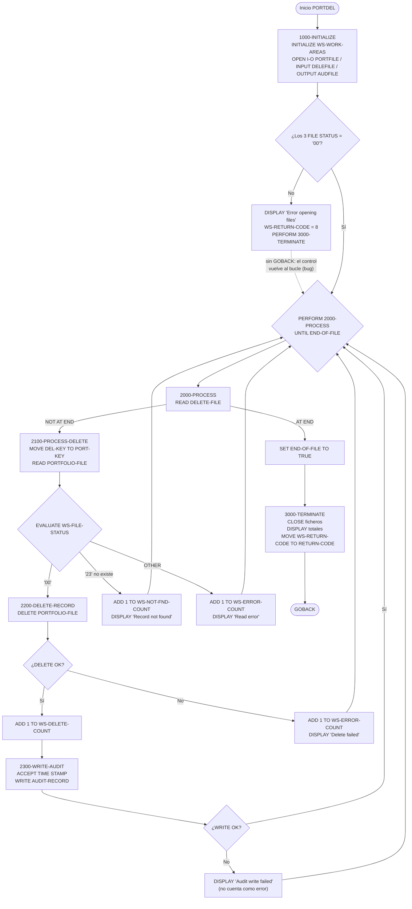
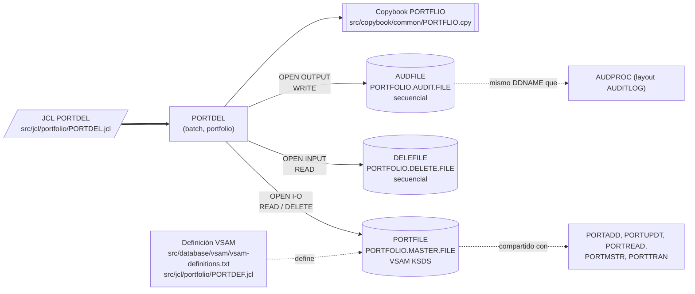

# PORTDEL — Baja batch de carteras del fichero maestro VSAM

> Generado a partir del análisis del código fuente `src/programs/portfolio/PORTDEL.cbl`. Ver el [grafo de dependencias global](../technical/dependency-graph.md).

## Ficha técnica
| Campo | Valor |
| --- | --- |
| Ruta | `src/programs/portfolio/PORTDEL.cbl` |
| Categoría | portfolio |
| Tipo | batch |
| Líneas | 194 |
| Punto de entrada | JCL `PORTDEL` (`src/jcl/portfolio/PORTDEL.jcl`, paso `STEP1`, `EXEC PGM=PORTDEL`) |
| Invocado por | JCL:PORTDEL. Ningún programa COBOL lo llama con `CALL` ni `LINK` |
| Invoca a | Ningún programa (sin `CALL`, sin `EXEC CICS`, sin `EXEC SQL`). Copybook `PORTFLIO`. Ficheros `PORTFILE`, `DELEFILE`, `AUDFILE` |

## Propósito
`PORTDEL` es el programa batch de **baja de carteras**: lee un fichero secuencial de solicitudes de borrado (`DELEFILE`), localiza cada cartera en el fichero maestro VSAM KSDS (`PORTFILE`) por su clave `PORT-ID` + `PORT-ACCOUNT-NO`, elimina físicamente el registro con `DELETE` y deja una traza de auditoría propia en un fichero secuencial (`AUDFILE`). Encaja en la capa de mantenimiento batch del maestro de carteras junto con `PORTADD` (altas), `PORTUPDT` (modificaciones) y `PORTREAD` (consulta), todos ellos lanzados por JCL independientes en `src/jcl/portfolio/`. No utiliza DB2, CICS ni el framework de checkpoint/restart del sistema.

## Funcionamiento

El programa sigue la estructura clásica de tres fases (inicialización, bucle de proceso, terminación) controlada desde `0000-MAIN`.

### `0000-MAIN`
1. `PERFORM 1000-INITIALIZE`.
2. `PERFORM 2000-PROCESS UNTIL END-OF-FILE` — un registro de `DELEFILE` por iteración.
3. `PERFORM 3000-TERMINATE`.
4. `GOBACK`.

### `1000-INITIALIZE`
- `INITIALIZE WS-WORK-AREAS`: pone a cero los contadores (`WS-DELETE-COUNT`, `WS-ERROR-COUNT`, `WS-NOT-FND-COUNT`), `WS-RETURN-CODE` y limpia `WS-TIMESTAMP`.
- Abre los tres ficheros: `OPEN I-O PORTFOLIO-FILE`, `OPEN INPUT DELETE-FILE`, `OPEN OUTPUT AUDIT-FILE`.
- Si alguno de los tres FILE STATUS no es `'00'`, muestra por `DISPLAY` los tres códigos (`PORT=`, `DEL=`, `AUD=`), mueve `WS-ERROR` (+8) a `WS-RETURN-CODE` y ejecuta `PERFORM 3000-TERMINATE`. **No hay `GOBACK`/`STOP RUN` tras ese PERFORM**, de modo que el control vuelve a `0000-MAIN` y el bucle de proceso se ejecuta igualmente sobre ficheros ya cerrados (ver [Observaciones](#observaciones-y-problemas-detectados)).

### `2000-PROCESS`
- `READ DELETE-FILE`:
  - `AT END` → `SET END-OF-FILE TO TRUE` (termina el bucle de `0000-MAIN`).
  - `NOT AT END` → `PERFORM 2100-PROCESS-DELETE`.
- Cualquier otro estado de lectura distinto de éxito o fin de fichero no se evalúa: la iteración termina sin hacer nada y el bucle continúa.

### `2100-PROCESS-DELETE`
- `MOVE DEL-KEY TO PORT-KEY`: copia la clave de 18 bytes (`DEL-ID` 8 + `DEL-ACCT-NO` 10) del registro de solicitud a la clave del maestro.
- `READ PORTFOLIO-FILE` (acceso aleatorio por `PORT-KEY`, sin cláusula `INVALID KEY`; el resultado se evalúa vía `WS-FILE-STATUS`).
- `EVALUATE TRUE`:
  - `WS-SUCCESS-STATUS` (`'00'`) → `PERFORM 2200-DELETE-RECORD`.
  - `WS-REC-NOT-FND` (`'23'`) → `ADD 1 TO WS-NOT-FND-COUNT` y `DISPLAY 'Record not found: ' PORT-KEY`.
  - `OTHER` → `ADD 1 TO WS-ERROR-COUNT` y `DISPLAY 'Read error for: ' PORT-KEY`.

### `2200-DELETE-RECORD`
- `DELETE PORTFOLIO-FILE` (borra el registro cuya clave está en `PORT-KEY`; con `ACCESS MODE IS RANDOM` no depende de la lectura previa, aunque ésta ya se ha hecho).
- Si `WS-SUCCESS-STATUS` → `ADD 1 TO WS-DELETE-COUNT` y `PERFORM 2300-WRITE-AUDIT`.
- Si no → `ADD 1 TO WS-ERROR-COUNT` y `DISPLAY 'Delete failed for: ' PORT-KEY`.

### `2300-WRITE-AUDIT`
- `ACCEPT WS-TIMESTAMP FROM TIME STAMP` (26 caracteres).
- Rellena `AUDIT-RECORD`: `AUD-TIMESTAMP` ← `WS-TIMESTAMP`, `AUD-ACTION` ← `'DELETE'`, `AUD-KEY` ← `PORT-KEY`, `AUD-REASON` ← `DEL-REASON-CODE`, `AUD-STATUS` ← `PORT-STATUS` (estado que tenía la cartera antes de borrarse; el área de registro del FD conserva la imagen leída).
- `WRITE AUDIT-RECORD`; si `WS-AUD-STATUS` no es `'00'` solo hace `DISPLAY 'Audit write failed for: ' PORT-KEY` (no incrementa ningún contador ni altera el código de retorno).

### `3000-TERMINATE`
- `CLOSE PORTFOLIO-FILE DELETE-FILE AUDIT-FILE` (sin comprobar FILE STATUS).
- Muestra los tres totales: `Records deleted:`, `Records not found:`, `Errors occurred:`.
- `MOVE WS-RETURN-CODE TO RETURN-CODE` (0 salvo que haya fallado el `OPEN`).

## Interfaz

- **Parámetros / LINKAGE SECTION / COMMAREA**: No aplica. El programa no tiene `LINKAGE SECTION` ni `PROCEDURE DIVISION USING`; toda su entrada procede de los ficheros asignados en el JCL.

- **Ficheros (DDNAME, organización, modo de apertura, clave)**:

| Fichero COBOL | DDNAME | Dataset (JCL `PORTDEL`) | Organización / acceso | Apertura | Clave | FILE STATUS | Registro |
| --- | --- | --- | --- | --- | --- | --- | --- |
| `PORTFOLIO-FILE` | `PORTFILE` | `PORTFOLIO.MASTER.FILE` (`DISP=SHR`) | `INDEXED`, `ACCESS MODE IS RANDOM` (VSAM KSDS) | `I-O` | `PORT-KEY` (18 bytes: `PORT-ID` X(8) + `PORT-ACCOUNT-NO` X(10)) | `WS-FILE-STATUS` | `PORT-RECORD` (copybook `PORTFLIO`, 148 bytes) |
| `DELETE-FILE` | `DELEFILE` | `PORTFOLIO.DELETE.FILE` (`DISP=OLD`) | `SEQUENTIAL` | `INPUT` | — | `WS-DEL-STATUS` | `DELETE-RECORD` (80 bytes) |
| `AUDIT-FILE` | `AUDFILE` | `PORTFOLIO.AUDIT.FILE` (`DISP=MOD`) | `SEQUENTIAL` | `OUTPUT` | — | `WS-AUD-STATUS` | `AUDIT-RECORD` (80 bytes, definido en el propio programa) |

  Operaciones sobre cada fichero: `PORTFILE` → `READ` aleatorio + `DELETE`; `DELEFILE` → `READ` secuencial hasta `AT END`; `AUDFILE` → `WRITE` por cada borrado correcto.

- **Tablas DB2 y sentencias SQL**: No aplica (no hay `EXEC SQL`, ni `SQLCA`, ni copybooks DB2).

- **Mapas BMS / comandos CICS**: No aplica (programa batch puro, sin `EXEC CICS`).

- **Códigos de retorno / RETURN-CODE**:

| Valor | Cuándo |
| --- | --- |
| `0` | Ejecución normal, **incluso si ha habido registros no encontrados, errores de lectura, errores de `DELETE` o fallos al escribir la auditoría**. Solo se informa por `DISPLAY` y contadores. |
| `8` (`WS-ERROR`) | Fallo en el `OPEN` de cualquiera de los tres ficheros en `1000-INITIALIZE`. Es el único camino que modifica `WS-RETURN-CODE`. |

  El código se asigna al registro especial `RETURN-CODE` en `3000-TERMINATE` justo antes del `GOBACK` de `0000-MAIN`.

## Estructuras de datos clave

### Copybooks
| Copybook | Ruta | Uso en PORTDEL |
| --- | --- | --- |
| `PORTFLIO` | `src/copybook/common/PORTFLIO.cpy` | Layout del registro maestro de cartera `PORT-RECORD`, incluido en el `FD PORTFOLIO-FILE`. Aporta `PORT-KEY` (clave del KSDS), `PORT-CLIENT-INFO`, `PORT-PORTFOLIO-INFO` (con `PORT-STATUS` y sus 88 `PORT-ACTIVE`/`PORT-CLOSED`/`PORT-SUSPENDED`), `PORT-FINANCIAL-INFO` (dos `COMP-3`), `PORT-AUDIT-INFO` y `PORT-FILLER`. Longitud total 148 bytes. De todos ellos PORTDEL solo usa `PORT-KEY` y `PORT-STATUS`. |

### Registros definidos en el propio programa (FILE SECTION)
`DELETE-RECORD` (80 bytes) — solicitud de baja:

| Campo | PIC | Descripción |
| --- | --- | --- |
| `DEL-KEY` | grupo (18) | Clave a borrar; se mueve tal cual a `PORT-KEY` |
| `DEL-ID` | X(8) | Identificador de cartera |
| `DEL-ACCT-NO` | X(10) | Número de cuenta |
| `DEL-REASON-CODE` | X(2) | Motivo: `'01'` `DEL-CLOSED`, `'02'` `DEL-TRANSFERRED`, `'03'` `DEL-REQUESTED` (las 88 no se evalúan en ningún sitio) |
| `DEL-FILLER` | X(60) | Relleno, no usado |

`AUDIT-RECORD` (80 bytes) — traza de auditoría propia de PORTDEL (**no** es el copybook `AUDITLOG`):

| Campo | PIC | Contenido |
| --- | --- | --- |
| `AUD-TIMESTAMP` | X(26) | `ACCEPT ... FROM TIME STAMP` |
| `AUD-ACTION` | X(6) | Literal `'DELETE'` |
| `AUD-KEY` | X(18) | `PORT-KEY` borrada |
| `AUD-REASON` | X(2) | `DEL-REASON-CODE` de la solicitud |
| `AUD-STATUS` | X(1) | `PORT-STATUS` de la cartera antes del borrado |
| `AUD-FILLER` | X(27) | Relleno |

### WORKING-STORAGE
| Elemento | Definición | Función |
| --- | --- | --- |
| `WS-PROGRAM-NAME` | X(08) VALUE `'PORTDEL  '` | Nombre del programa; no se referencia en el PROCEDURE DIVISION (el literal tiene 9 caracteres para un campo de 8) |
| `WS-SUCCESS` / `WS-ERROR` | S9(4) +0 / +8 | Constantes de retorno; solo se usa `WS-ERROR` |
| `WS-FILE-STATUS` | X(02) | Estado de `PORTFILE`; 88: `WS-SUCCESS-STATUS` `'00'`, `WS-REC-NOT-FND` `'23'`, `WS-EOF-STATUS` `'10'` (esta última nunca se usa) |
| `WS-DEL-STATUS` | X(02) | Estado de `DELEFILE`; 88: `WS-DEL-SUCCESS` `'00'`, `WS-DEL-EOF` `'10'` (no usada; el fin se detecta con `AT END`) |
| `WS-AUD-STATUS` | X(02) | Estado de `AUDFILE`; 88 `WS-AUD-SUCCESS` `'00'` |
| `WS-END-OF-FILE-SW` | X VALUE `'N'` | Interruptor de fin de `DELEFILE`; 88 `END-OF-FILE` `'Y'` / `NOT-END-OF-FILE` `'N'`. Condición de salida del bucle principal |
| `WS-DELETE-COUNT` | 9(7) | Registros borrados con éxito |
| `WS-NOT-FND-COUNT` | 9(7) | Solicitudes cuya clave no existe en el maestro (status `'23'`) |
| `WS-ERROR-COUNT` | 9(7) | Errores de `READ` (status distinto de `'00'`/`'23'`) o de `DELETE` sobre `PORTFILE` |
| `WS-RETURN-CODE` | S9(4) | Código que se mueve a `RETURN-CODE` al terminar |
| `WS-TIMESTAMP` | X(26) | Sello temporal para la auditoría |

No existen umbrales de commit, contadores de checkpoint ni límites de errores: el programa procesa todo `DELEFILE` de principio a fin sin condición de parada anticipada.

## Reglas de negocio y validaciones

Las reglas realmente implementadas en el código son muy pocas:

1. **Una solicitud = un borrado**: cada registro de `DELEFILE` se trata de forma independiente; su `DEL-KEY` (18 bytes) se usa directamente como clave del maestro (`PORT-KEY`). No hay cabeceras, trailers, ordenación requerida ni control de duplicados en el fichero de solicitudes.
2. **Existencia previa**: solo se intenta el `DELETE` si el `READ` aleatorio por clave devuelve `'00'`. Un status `'23'` se contabiliza como "no encontrado" (no como error) y se sigue con la siguiente solicitud.
3. **Borrado físico e incondicional**: si la cartera existe se elimina siempre, con independencia de su `PORT-STATUS` (`A`ctiva, `C`errada, `S`uspendida), de su `PORT-TOTAL-VALUE`/`PORT-CASH-BALANCE` o del `DEL-REASON-CODE`. Los niveles 88 `DEL-CLOSED`/`DEL-TRANSFERRED`/`DEL-REQUESTED` y `PORT-ACTIVE`/`PORT-CLOSED`/`PORT-SUSPENDED` están definidos pero **no se consultan**; no se valida que el motivo sea uno de los tres valores conocidos.
4. **Auditoría solo de borrados correctos**: se escribe un `AUDIT-RECORD` únicamente cuando el `DELETE` ha tenido éxito; los intentos fallidos o no encontrados no dejan traza en `AUDFILE`, solo en `SYSOUT` vía `DISPLAY`.
5. **Sin actualización de campos de mantenimiento**: al tratarse de un borrado, no se tocan `PORT-LAST-MAINT`, `PORT-LAST-USER` ni `PORT-LAST-TRANS`.
6. **Resumen final**: siempre se muestran los tres contadores (`Records deleted`, `Records not found`, `Errors occurred`) por `DISPLAY`.

## Manejo de errores y recuperación

- **FILE STATUS**: cada fichero tiene su propio campo de estado. Se comprueba tras `OPEN` (los tres a la vez), tras `READ PORTFOLIO-FILE` (`EVALUATE` sobre `'00'`, `'23'`, `OTHER`), tras `DELETE` y tras `WRITE AUDIT-RECORD`. **No** se comprueba tras `READ DELETE-FILE` (solo `AT END`/`NOT AT END`) ni tras `CLOSE`.
- **Error en OPEN**: `DISPLAY` de los tres estados, `WS-RETURN-CODE = 8` y `PERFORM 3000-TERMINATE`. Como no hay `GOBACK` inmediato, `0000-MAIN` continúa con `PERFORM 2000-PROCESS UNTIL END-OF-FILE` sobre un `DELETE-FILE` ya cerrado (o nunca abierto). En Enterprise COBOL un `READ` sobre un fichero no abierto devuelve un status de la clase `4x` (probablemente `'47'`), que no dispara `AT END`; por tanto `END-OF-FILE` nunca se activa y el bucle **no termina** (bucle infinito), además de ejecutarse `3000-TERMINATE` por segunda vez al final. Es el problema más grave del programa.
- **Errores de READ/DELETE sobre el maestro**: se cuentan en `WS-ERROR-COUNT` y se informan por `DISPLAY`, pero no cambian `WS-RETURN-CODE`; el job termina con `RC=0`.
- **Error al escribir auditoría**: solo `DISPLAY`; el registro ya ha sido borrado, no se cuenta como error y no se deshace nada. Puede quedar un borrado sin traza de auditoría.
- **SQLCODE / condiciones CICS**: no aplica (sin DB2 ni CICS).
- **Checkpoint/restart y rollback**: no implementados. El programa no usa `CKPRST`, `BCHCTL` ni `PRCSEQ`; una caída a mitad de `DELEFILE` deja el maestro parcialmente actualizado y, al relanzar, las claves ya borradas se contabilizarán como `Records not found`. Al no haber `COMMIT`/rollback (VSAM sin gestor de recuperación), tampoco hay unidad de trabajo lógica.
- **Rutinas comunes de error**: no se llama a `ERRPROC`, `ERRHNDL`, `DB2ERR` ni `AUDPROC`; toda la notificación se hace con `DISPLAY` a `SYSOUT`.

## Dependencias

No hay programas invocados (`CALL`/`LINK`), tablas DB2 ni mapas BMS.

## Observaciones y problemas detectados

1. **Bucle infinito tras error de OPEN (bug grave)**. En `1000-INITIALIZE`, cuando falla algún `OPEN` se hace `PERFORM 3000-TERMINATE` pero no `GOBACK`/`STOP RUN`. El control vuelve a `0000-MAIN`, que ejecuta `PERFORM 2000-PROCESS UNTIL END-OF-FILE`; el `READ DELETE-FILE` sobre un fichero cerrado no dispara `AT END`, `END-OF-FILE` nunca se pone a `'Y'` y el programa no termina. Además `3000-TERMINATE` se ejecutaría dos veces (segundo `CLOSE` sobre ficheros cerrados). Corrección esperable: añadir `GOBACK` tras el `PERFORM 3000-TERMINATE` del `END-IF`.
2. **`RETURN-CODE` no refleja los errores de proceso**. `WS-RETURN-CODE` solo se pone a 8 si falla el `OPEN`. Errores de `READ`, de `DELETE` o de escritura de auditoría dejan el job en `RC=0`, por lo que un scheduler no detectaría la incidencia; los contadores `WS-ERROR-COUNT`/`WS-NOT-FND-COUNT` solo se muestran por `DISPLAY`.
3. **Fallo de auditoría silencioso**. En `2300-WRITE-AUDIT`, un `WRITE` fallido solo genera un `DISPLAY`: no se incrementa `WS-ERROR-COUNT`, no se altera el código de retorno y el borrado ya está consumado, dejando un borrado sin traza.
4. **Sin validaciones de negocio**. Ni `DEL-REASON-CODE` (88 `DEL-CLOSED`/`DEL-TRANSFERRED`/`DEL-REQUESTED`) ni `PORT-STATUS` (88 `PORT-ACTIVE`/`PORT-CLOSED`/`PORT-SUSPENDED`) se evalúan: se pueden borrar carteras activas, con saldo (`PORT-CASH-BALANCE`/`PORT-TOTAL-VALUE` distintos de cero) o con un motivo no reconocido. Tampoco se comprueba el FILE STATUS de `READ DELETE-FILE` fuera de `AT END`, ni el de `CLOSE`.
5. **Formato de auditoría incompatible con el estándar del sistema**. PORTDEL define su propio `AUDIT-RECORD` de 80 bytes y escribe directamente en `AUDFILE`, mientras que la rutina común `AUDPROC` (usada por `PORTMSTR` y `PORTTRAN`) escribe en el mismo DDNAME `AUDFILE` con el layout del copybook `AUDITLOG` (392 bytes, `AUD-ACTION` X(8) con valor `'DELETE  '`, `AUD-STATUS` X(4), imágenes antes/después…). Si ambos apuntan al mismo dataset `PORTFOLIO.AUDIT.FILE`, los registros de PORTDEL serían ilegibles para cualquier consumidor que espere el layout `AUDITLOG` (p. ej. `RPTAUD00`, que incluye ese copybook). Además PORTDEL abre con `OPEN OUTPUT` (dependiendo del `DISP=MOD` del JCL para no truncar) mientras `AUDPROC` usa `OPEN EXTEND`.
6. **Discrepancias en la definición del maestro `PORTFILE`**. El copybook `PORTFLIO` describe un registro de 148 bytes con clave de 18 bytes (`PORT-ID` 8 + `PORT-ACCOUNT-NO` 10). `src/database/vsam/vsam-definitions.txt` documenta `PORTMSTR` con `RECORD LENGTH 400`, `KEY LENGTH 12` y una estructura de clave distinta (Portfolio ID 8 + Account Type 2 + Branch ID 2), y su `DEFINE CLUSTER` de `PORTFOLIO.MASTER.FILE` usa `KEYS(12 0) RECORDSIZE(400 400)`. `src/jcl/portfolio/PORTDEF.jcl` define el mismo dataset con `KEYS(18 0) RECORDSIZE(200 200)`. A su vez `PORTMSTR.cbl` accede a `PORTFILE` con un layout propio de 100 bytes y clave `PORT-ID` X(10). Con cualquiera de las dos definiciones IDCAMS, el `OPEN I-O` de PORTDEL fallaría probablemente con status `'39'` (atributos en conflicto) en un z/OS real, y por el bug nº 1 el job quedaría en bucle. Manda el código: la clave efectiva que usa PORTDEL es la de 18 bytes de `PORTFLIO`.
7. **`ACCEPT WS-TIMESTAMP FROM TIME STAMP`**. `TIME STAMP` no es una opción documentada de `ACCEPT ... FROM` en Enterprise COBOL (solo `DATE`, `DAY`, `DAY-OF-WEEK`, `TIME`), por lo que probablemente no compila tal cual; el patrón se repite en `AUDPROC`, `ERRPROC`, `DB2ERR`, `DB2STAT`, `PRCSEQ00` y `RCVPRC00`. Otros programas del repositorio usan `FUNCTION CURRENT-DATE` (p. ej. `PORTTRAN`), que sería la alternativa correcta.
8. **Literal más largo que el campo**: `WS-PROGRAM-NAME PIC X(08) VALUE 'PORTDEL  '` (9 caracteres) provoca un aviso de truncamiento en compilación; el campo, además, no se usa.
9. **Elementos definidos y no usados**: `WS-SUCCESS`, `WS-EOF-STATUS`, `WS-DEL-EOF`, `WS-PROGRAM-NAME`, `DEL-FILLER`, las 88 de `DEL-REASON-CODE`.
10. **Sin integración con el framework batch descrito en `system-architecture.md`**: el documento de arquitectura define checkpoint/restart (`BCHCTL`, `CKPRST`), `ERRPROC` como manejador estándar de errores batch y `AUDPROC` como rutina de auditoría; PORTDEL no usa ninguno. El propio documento de arquitectura **no menciona `PORTDEL`** ni al resto de utilidades de `src/programs/portfolio/` (`PORTADD`, `PORTUPDT`, `PORTREAD`), y `data-dictionary.md` no describe el layout `PORTFLIO` ni los ficheros `DELEFILE`/`AUDFILE`; la única referencia documental a PORTDEL está en el grafo de dependencias.
11. **Concurrencia**: `PORTFILE` se asigna con `DISP=SHR` en el JCL y el cluster tiene `SHAREOPTIONS(2 3)`, lo que permite que otros jobs/CICS lean (y con opción 3, escriban) mientras PORTDEL borra; no hay ENQ ni control de integridad adicional en el programa.
12. **Fichero de solicitudes sin controles**: `DELEFILE` se lee sin cabecera/trailer ni recuento de control; una solicitud duplicada produce un borrado y después un "not found", sin advertencia específica.

## Referencias

- Programa: [PORTDEL.cbl](../../src/programs/portfolio/PORTDEL.cbl)
- JCL de ejecución: [PORTDEL.jcl](../../src/jcl/portfolio/PORTDEL.jcl)
- Copybook del registro maestro: [PORTFLIO.cpy](../../src/copybook/common/PORTFLIO.cpy)
- Definición VSAM del maestro: [vsam-definitions.txt](../../src/database/vsam/vsam-definitions.txt) y [PORTDEF.jcl](../../src/jcl/portfolio/PORTDEF.jcl)
- Auditoría estándar del sistema (para contraste): [AUDPROC.cbl](../../src/programs/common/AUDPROC.cbl), [AUDITLOG.cpy](../../src/copybook/common/AUDITLOG.cpy)
- Programas hermanos sobre el mismo maestro: [PORTADD.cbl](../../src/programs/portfolio/PORTADD.cbl), [PORTUPDT.cbl](../../src/programs/portfolio/PORTUPDT.cbl), [PORTREAD.cbl](../../src/programs/portfolio/PORTREAD.cbl), [PORTMSTR.cbl](../../src/programs/portfolio/PORTMSTR.cbl)
- Documentación técnica: [grafo de dependencias](../technical/dependency-graph.md), [modelo JSON](../technical/dependency-graph.json), [system-architecture.md](../technical/system-architecture.md), [data-dictionary.md](../technical/data-dictionary.md)
