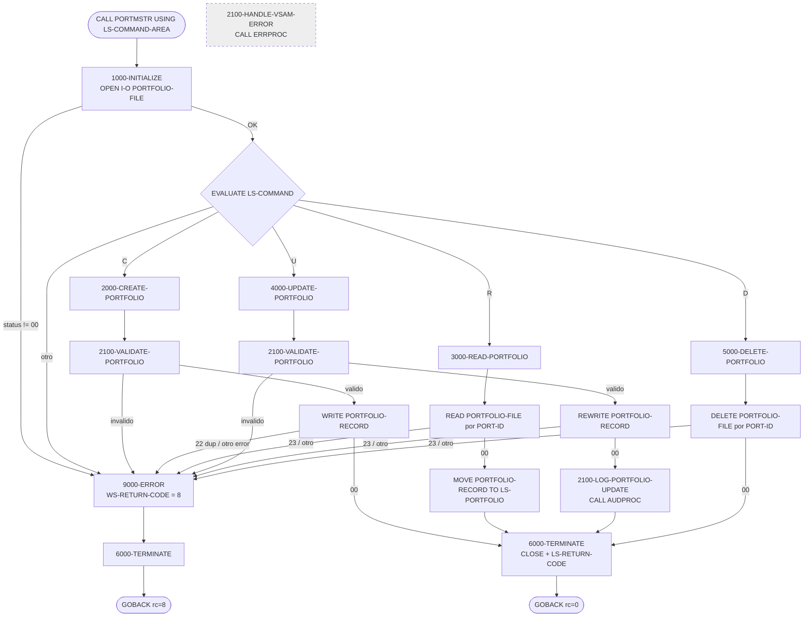
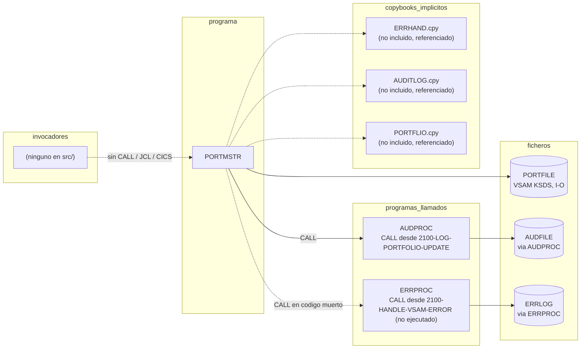

# PORTMSTR — Mantenimiento CRUD del fichero maestro de carteras

> Generado a partir del análisis del código fuente `src/programs/portfolio/PORTMSTR.cbl`. Ver el [grafo de dependencias global](../technical/dependency-graph.md).

## Ficha técnica
| Campo | Valor |
| --- | --- |
| Ruta | `src/programs/portfolio/PORTMSTR.cbl` |
| Categoría | portfolio |
| Tipo | subrutina común (módulo invocado por `CALL`, recibe `LS-COMMAND-AREA` en `LINKAGE SECTION`; el grafo automático lo clasifica como *batch* porque no usa CICS ni DB2) |
| Líneas | 288 |
| Punto de entrada | ninguno conocido (no existe JCL `EXEC PGM=PORTMSTR`, ni transacción CICS, ni `CALL 'PORTMSTR'` en `src/`) |
| Invocado por | — (ningún programa del repositorio lo invoca) |
| Invoca a | `ERRPROC` (desde `2100-HANDLE-VSAM-ERROR`, párrafo nunca ejecutado) y `AUDPROC` (desde `2100-LOG-PORTFOLIO-UPDATE`, sólo en la operación de actualización) |

## Propósito
`PORTMSTR` es el módulo de mantenimiento del fichero maestro de carteras (Portfolio Master File). Ofrece a un programa llamador una interfaz única de tipo CRUD sobre el fichero VSAM KSDS `PORTFILE`: crear (`C`), leer (`R`), actualizar (`U`) y borrar (`D`) un registro de cartera identificado por `PORT-ID`. El llamador pasa el comando, la imagen del registro de 100 bytes y recibe un código de retorno.

Dentro del sistema encaja en la capa de *portfolio management* junto con `PORTADD`, `PORTREAD`, `PORTUPDT` y `PORTDEL` (que hacen operaciones equivalentes pero como jobs batch autónomos alimentados por ficheros secuenciales). A diferencia de ellos, `PORTMSTR` está pensado como servicio reutilizable invocado por `CALL`, e incorpora (de forma incompleta, ver [Observaciones](#observaciones-y-problemas-detectados)) la integración con los servicios comunes de error (`ERRPROC`) y auditoría (`AUDPROC`). En el estado actual del repositorio ningún programa lo invoca, por lo que su papel real en los flujos batch/online es únicamente el de módulo de referencia.

## Funcionamiento

El programa procesa **una sola operación por invocación**: abre el fichero, ejecuta el comando recibido, cierra el fichero y devuelve el control. No hay bucle de proceso ni lectura secuencial.

### `0000-MAIN`
1. `PERFORM 1000-INITIALIZE`.
2. `EVALUATE TRUE` sobre los niveles 88 de `LS-COMMAND`:
   - `CREATE-PORT` (`'C'`) → `2000-CREATE-PORTFOLIO`
   - `READ-PORT` (`'R'`) → `3000-READ-PORTFOLIO`
   - `UPDATE-PORT` (`'U'`) → `4000-UPDATE-PORTFOLIO`
   - `DELETE-PORT` (`'D'`) → `5000-DELETE-PORTFOLIO`
   - `WHEN OTHER` → mensaje `'Invalid command'` y `9000-ERROR`.
3. `PERFORM 6000-TERMINATE` y `GOBACK`.

### `1000-INITIALIZE`
- `INITIALIZE WS-WORK-AREAS` (pone `WS-RETURN-CODE` a 0 y `WS-CURRENT-DATE` a espacios).
- `OPEN I-O PORTFOLIO-FILE`. Si `WS-PORT-STATUS` no es `'00'` → `'Error opening Portfolio file'` y `9000-ERROR`.
- `ACCEPT WS-CURRENT-DATE FROM DATE YYYYMMDD`. El valor obtenido **no se utiliza** en ningún otro punto del programa.

### `2000-CREATE-PORTFOLIO`
1. `MOVE LS-PORTFOLIO TO PORTFOLIO-RECORD` (la imagen completa del registro la aporta el llamador, incluida `PORT-CREATE-DATE`).
2. `PERFORM 2100-VALIDATE-PORTFOLIO`; si `WS-RETURN-CODE NOT = WS-SUCCESS` → `9000-ERROR`.
3. `WRITE PORTFOLIO-RECORD`.
4. Si `PORT-DUP-KEY` (`'22'`) → `'Portfolio ID already exists'` y `9000-ERROR`.
5. Si `NOT PORT-SUCCESS` → `'Error writing Portfolio record'` y `9000-ERROR`.

### `2100-VALIDATE-PORTFOLIO`
Validación de formato, común a alta y modificación. Cada fallo asigna el texto de error, pone `WS-RETURN-CODE = WS-ERROR` (+8) y sale con `EXIT PARAGRAPH`:
1. `PORT-ID(1:4) NOT = 'PORT'` o `PORT-ID(5:5) IS NOT NUMERIC` → `'Invalid Portfolio ID format'`.
2. `PORT-NAME = SPACES` → `'Portfolio Name is required'`.
3. `PORT-STATUS` no está en `'A'`, `'I'`, `'C'` (nivel 88 `VALID-STATUS` sobre `WS-VALID-STATUS`) → `'Invalid Portfolio Status'`.

### `3000-READ-PORTFOLIO`
1. `MOVE LS-PORTFOLIO TO PORTFOLIO-RECORD` (sólo interesa `PORT-ID`, que es la `RECORD KEY`).
2. `READ PORTFOLIO-FILE` (lectura aleatoria por clave; el fichero es `ACCESS MODE IS DYNAMIC` y no se usa `NEXT`).
3. `EVALUATE TRUE`:
   - `PORT-SUCCESS` → `MOVE PORTFOLIO-RECORD TO LS-PORTFOLIO` (devuelve el registro al llamador).
   - `PORT-NOT-FOUND` (`'23'`) → `'Portfolio not found'` y `9000-ERROR`.
   - `WHEN OTHER` → `'Error reading Portfolio'` y `9000-ERROR`.

### `4000-UPDATE-PORTFOLIO`
1. `MOVE LS-PORTFOLIO TO PORTFOLIO-RECORD`.
2. `PERFORM 2100-VALIDATE-PORTFOLIO`; si hay error → `9000-ERROR`.
3. `REWRITE PORTFOLIO-RECORD` **sin `READ` previo** (válido en VSAM con acceso dinámico/aleatorio: el registro a sustituir se localiza por `RECORD KEY`).
4. Si `PORT-NOT-FOUND` → `'Portfolio not found for update'` y `9000-ERROR`.
5. Si `NOT PORT-SUCCESS` → `'Error updating Portfolio'` y `9000-ERROR`.
6. `PERFORM 2100-LOG-PORTFOLIO-UPDATE` → `CALL 'AUDPROC'`.

### `5000-DELETE-PORTFOLIO`
1. `MOVE LS-PORTFOLIO TO PORTFOLIO-RECORD`.
2. `DELETE PORTFOLIO-FILE` (borrado aleatorio por `PORT-ID`, sin lectura previa ni validación de formato).
3. Si `PORT-NOT-FOUND` → `'Portfolio not found for deletion'` y `9000-ERROR`.
4. Si `NOT PORT-SUCCESS` → `'Error deleting Portfolio'` y `9000-ERROR`.

### `6000-TERMINATE`
- `CLOSE PORTFOLIO-FILE` (el estado resultante no se comprueba).
- `MOVE WS-RETURN-CODE TO LS-RETURN-CODE`.

### `9000-ERROR`
- `MOVE WS-ERROR TO WS-RETURN-CODE` (+8).
- `PERFORM 6000-TERMINATE` y `GOBACK`. El `GOBACK` dentro de un párrafo ejecutado por `PERFORM` termina el programa inmediatamente, de modo que tras un error nunca se vuelve al párrafo llamador ni al `PERFORM 6000-TERMINATE` de `0000-MAIN`. El texto guardado en `WS-ERROR-TEXT` **no se muestra ni se devuelve** al llamador.

### `2100-HANDLE-VSAM-ERROR` (código muerto)
Comentado en el fuente como *"Example error handling call"*. Rellena una estructura `LS-ERROR-REQUEST` (programa, categoría `ERR-CAT-VSAM`, código de fichero, severidad según `WS-FILE-STATUS` sea `'22'`/`'23'`/otro, detalles con `PORT-KEY`) y hace `CALL 'ERRPROC' USING LS-ERROR-REQUEST`. **Ningún párrafo lo ejecuta** y todos los campos que referencia están sin definir (ver Observaciones).

### `2100-LOG-PORTFOLIO-UPDATE`
Comentado como *"Example audit logging call"*. Construye `LS-AUDIT-REQUEST` con `LS-SYSTEM-ID='PORTFOLIO'`, `LS-PROGRAM='PORTMSTR'`, `LS-TYPE='TRAN'`, `LS-ACTION='UPDATE  '`, `LS-STATUS='SUCC'`, clave (`PORT-ID`, `PORT-ACCOUNT-NO`), imágenes antes/después (`WS-BEFORE-IMAGE`, `PORT-RECORD`) y mensaje `'Portfolio updated successfully'`, y hace `CALL 'AUDPROC' USING LS-AUDIT-REQUEST`. Sí es invocado (desde `4000-UPDATE-PORTFOLIO`) pero, igual que el anterior, referencia campos inexistentes.

## Interfaz

- **Parámetros / LINKAGE SECTION / COMMAREA**: `PROCEDURE DIVISION USING LS-COMMAND-AREA` (103 bytes):

  | Campo | PIC | Descripción |
  | --- | --- | --- |
  | `LS-COMMAND` | `X(01)` | Operación: `'C'` crear, `'R'` leer, `'U'` actualizar, `'D'` borrar. Cualquier otro valor → error. |
  | `LS-PORTFOLIO` | `X(100)` | Imagen del registro `PORTFOLIO-RECORD`. Entrada en C/U (registro completo) y en R/D (basta `PORT-ID` en los 10 primeros bytes); salida en R (registro leído). |
  | `LS-RETURN-CODE` | `S9(4) COMP` | Código de retorno: `0` éxito, `8` error. |

- **Ficheros (DDNAME, organización, modo de apertura, clave)**:

  | DDNAME | Fichero COBOL | Organización / acceso | Apertura | Clave | Registro |
  | --- | --- | --- | --- | --- | --- |
  | `PORTFILE` | `PORTFOLIO-FILE` | `INDEXED` (VSAM KSDS), `ACCESS MODE IS DYNAMIC` | `I-O` | `PORT-ID PIC X(10)` (posición 1) | 100 bytes fijos, definido inline en la `FD` (no usa copybook) |

  Layout del registro (`PORTFOLIO-RECORD`): `PORT-ID X(10)`, `PORT-NAME X(50)`, `PORT-CREATE-DATE X(10)`, `PORT-STATUS X(01)`, `PORT-TOTAL-VALUE S9(13)V99 COMP-3` (8 bytes), `FILLER X(24)`.

  Ningún JCL del repositorio ejecuta `PORTMSTR`; en los JCL de los programas hermanos (`PORTADD.jcl`, `PORTREAD.jcl`, `PORTUPDT.jcl`, `PORTDEL.jcl`) `PORTFILE` apunta a `DSN=PORTFOLIO.MASTER.FILE`, definido en `PORTDEF.jcl`. Cabe suponer que `PORTMSTR` usaría el mismo dataset, pero **no se define en el repositorio**.

- **Tablas DB2 y sentencias SQL**: No aplica (no hay `EXEC SQL`).

- **Mapas BMS / comandos CICS**: No aplica (no hay `EXEC CICS`).

- **Códigos de retorno / RETURN-CODE**: el programa no toca el registro especial `RETURN-CODE`; devuelve el resultado en `LS-RETURN-CODE`:

  | Valor | Origen | Cuándo |
  | --- | --- | --- |
  | `+0` (`WS-SUCCESS`) | `6000-TERMINATE` | Operación completada con `FILE STATUS '00'`. |
  | `+8` (`WS-ERROR`) | `9000-ERROR` | Comando inválido, error de `OPEN`, validación fallida, clave duplicada (`'22'`), registro no encontrado (`'23'`) o cualquier otro `FILE STATUS` distinto de `'00'`. |

  El motivo concreto del error (`WS-ERROR-TEXT`) no se propaga al llamador ni se escribe en ningún log.

## Estructuras de datos clave

**Copybooks utilizados**: ninguno. El programa no contiene sentencias `COPY`; el layout del registro está definido inline y difiere del copybook estándar `PORTFLIO` (ver Observaciones). Los párrafos `2100-HANDLE-VSAM-ERROR` y `2100-LOG-PORTFOLIO-UPDATE` están escritos como si estuvieran incluidos `ERRHAND` (constantes `ERR-CAT-VSAM`, `ERR-WARNING`, `ERR-ERROR`, `ERR-VSAM-DUPKEY`, `ERR-VSAM-NOTFND`, `ERR-VSAM-22`, `ERR-VSAM-23`, `ERR-OTHER`), `PORTFLIO` (`PORT-KEY`, `PORT-ACCOUNT-NO`, `PORT-RECORD`) y las áreas de petición de `ERRPROC`/`AUDPROC`, pero ninguno se incluye.

**WORKING-STORAGE relevante**:

| Campo | PIC / VALUE | Uso |
| --- | --- | --- |
| `WS-PROGRAM-NAME` | `X(08) 'PORTMSTR'` | Declarado, no referenciado. |
| `WS-SUCCESS` / `WS-ERROR` | `S9(4) +0` / `+8` | Códigos de retorno lógico. |
| `WS-ERROR-TEXT` | `X(50)` | Texto descriptivo del último error; se asigna pero nunca se muestra ni se devuelve. |
| `WS-PORT-STATUS` | `X(02)` | `FILE STATUS` de `PORTFOLIO-FILE`. 88: `PORT-SUCCESS '00'`, `PORT-EOF '10'`, `PORT-NOT-FOUND '23'`, `PORT-DUP-KEY '22'`. |
| `WS-VALID-STATUS` | `X(01)` | Área auxiliar para evaluar `VALID-STATUS` (`'A' 'I' 'C'`). |
| `WS-END-OF-FILE-SW` | `X 'N'` | Declarado con 88 `END-OF-FILE`/`NOT-END-OF-FILE`; no se usa (no hay lectura secuencial). |
| `WS-CURRENT-DATE` | `X(10)` | Recibe `DATE YYYYMMDD` (8 caracteres); no se usa. |
| `WS-RETURN-CODE` | `S9(4) COMP +0` | Código de retorno interno, copiado a `LS-RETURN-CODE` en `6000-TERMINATE`. |

No hay contadores, umbrales de commit ni lógica de checkpoint: el programa procesa un único registro por llamada.

## Reglas de negocio y validaciones

Implementadas en `2100-VALIDATE-PORTFOLIO`, aplicadas **sólo** en crear y actualizar (no en leer ni borrar):

1. **Formato del identificador de cartera**: `PORT-ID` debe empezar por el literal `'PORT'` (bytes 1-4) seguido de cinco dígitos numéricos (bytes 5-9). El byte 10 de `PORT-ID` no se valida.
2. **Nombre obligatorio**: `PORT-NAME` no puede ser espacios.
3. **Estado permitido**: `PORT-STATUS` debe ser `'A'`, `'I'` o `'C'`. Los valores no se documentan en el programa; por analogía con `PORTFLIO.cpy` (`'A'` activo, `'C'` cerrado) `'I'` sería probablemente *inactivo*, aunque el copybook define `'S'` (suspendido) en lugar de `'I'`.
4. **Unicidad**: en la creación, un `FILE STATUS '22'` (clave duplicada) se reporta como `'Portfolio ID already exists'`.
5. **Existencia**: en lectura, actualización y borrado, `FILE STATUS '23'` se reporta como cartera no encontrada.
6. **Auditoría de actualizaciones**: tras un `REWRITE` correcto se registra un evento de auditoría (`TRAN` / `UPDATE  ` / `SUCC`) a través de `AUDPROC`. Las altas y bajas **no** generan auditoría.

El programa no calcula ni modifica ningún campo del registro (`PORT-TOTAL-VALUE`, `PORT-CREATE-DATE`, etc.): almacena tal cual la imagen recibida del llamador.

## Manejo de errores y recuperación

- **FILE STATUS**: todas las operaciones de E/S (`OPEN`, `WRITE`, `READ`, `REWRITE`, `DELETE`) se comprueban mediante los niveles 88 de `WS-PORT-STATUS`. Se distinguen únicamente `'00'`, `'22'` y `'23'`; cualquier otro estado cae en un mensaje genérico. El `CLOSE` de `6000-TERMINATE` no se comprueba.
- **Estrategia de error**: centralizada en `9000-ERROR`, que fija `WS-RETURN-CODE = +8`, cierra el fichero y hace `GOBACK`. Es una política de *fail-fast*: el primer error aborta la invocación. No hay `DISPLAY` ni escritura en log; el llamador sólo recibe `LS-RETURN-CODE = 8`.
- **ERRPROC**: el único `CALL 'ERRPROC'` está en `2100-HANDLE-VSAM-ERROR`, párrafo que nunca se ejecuta. En la práctica el subsistema estándar de errores (log `ERRLOG` + `DISPLAY` formateado) **no se utiliza**.
- **AUDPROC**: se invoca tras cada actualización correcta. `AUDPROC` abre `AUDFILE` en `EXTEND`, escribe un registro `AUDIT-RECORD` (copybook `AUDITLOG`) y devuelve `LS-RETURN-CODE` 0/8 en su propia área de petición; `PORTMSTR` no comprueba ese código de retorno.
- **SQLCODE / CICS**: no aplica.
- **Checkpoint / restart / rollback**: no hay. Al ser un único registro por llamada, no existen puntos de sincronización; la operación VSAM es efectiva en cuanto termina la sentencia de E/S. Si `AUDPROC` fallara tras el `REWRITE`, la actualización quedaría aplicada sin rastro de auditoría.
- **Fallo de OPEN**: si `OPEN I-O` falla, `9000-ERROR` ejecuta igualmente `CLOSE PORTFOLIO-FILE` sobre un fichero no abierto (`FILE STATUS '42'`), cuyo resultado se ignora; no tiene efectos adversos.

## Dependencias

## Observaciones y problemas detectados

### Errores de compilación (el programa no compila tal cual)
1. **Campos sin definir en `2100-HANDLE-VSAM-ERROR`**: `LS-PROGRAM-ID`, `LS-CATEGORY`, `LS-ERROR-CODE`, `LS-SEVERITY`, `LS-ERROR-TEXT`, `LS-ERROR-DETAILS`, `LS-ERROR-REQUEST`, `WS-FILE-STATUS`, `PORT-KEY`, y las constantes `ERR-CAT-VSAM`, `ERR-VSAM-DUPKEY`, `ERR-VSAM-NOTFND`, `ERR-WARNING`, `ERR-ERROR`, `ERR-VSAM-22`, `ERR-VSAM-23`, `ERR-OTHER` (estas últimas existen en `src/copybook/common/ERRHAND.cpy`, pero el programa no hace `COPY ERRHAND`). La estructura `LS-ERROR-REQUEST` es la `LINKAGE SECTION` de `ERRPROC`, no de `PORTMSTR`.
2. **Campos sin definir en `2100-LOG-PORTFOLIO-UPDATE`**: `LS-AUDIT-REQUEST`, `LS-SYSTEM-ID`, `LS-USER-ID`, `LS-PROGRAM`, `LS-TERMINAL`, `LS-TYPE`, `LS-ACTION`, `LS-STATUS`, `LS-PORT-ID`, `LS-ACCT-NO`, `LS-BEFORE-IMAGE`, `LS-AFTER-IMAGE`, `LS-MESSAGE` (son la `LINKAGE SECTION` de `AUDPROC`), además de `USERID`, `TERMINAL-ID`, `WS-BEFORE-IMAGE`, `PORT-ACCOUNT-NO` y `PORT-RECORD` (los dos últimos pertenecen a `PORTFLIO.cpy`, que no se incluye). `USERID` y `TERMINAL-ID` no existen en ningún copybook del repositorio; parecen suponer un contexto CICS que este programa no tiene.
3. **Cabecera en columna 8**: la primera línea del fuente tiene el asterisco en la columna 8 (Área A) en lugar de la columna 7 (indicador de comentario), lo que en formato fijo de Enterprise COBOL produce un error de sintaxis. El mismo defecto aparece en `PORTUPDT.cbl`.

### Lógica incompleta / código muerto
4. `2100-HANDLE-VSAM-ERROR` nunca es ejecutado (`PERFORM`) por ningún párrafo; en consecuencia `ERRPROC` no se invoca realmente y el grafo de dependencias registra una llamada que sólo existe en código muerto.
5. Ambos párrafos están marcados en el fuente como *"Example ... call"*: son plantillas copiadas (probablemente de `PORTTRAN`, que sí incluye `ERRHAND` y `AUDITLOG`) sin adaptar al programa.
6. `WS-BEFORE-IMAGE` (imagen previa para la auditoría) no tiene origen posible: `4000-UPDATE-PORTFOLIO` hace `REWRITE` sin `READ` previo, así que el programa nunca dispone del registro anterior.
7. `WS-ERROR-TEXT` se asigna en todos los caminos de error pero nunca se muestra, se registra ni se devuelve al llamador; el diagnóstico se pierde y el llamador sólo sabe que hubo un error (`8`).
8. Variables declaradas y no usadas: `WS-PROGRAM-NAME`, `WS-CURRENT-DATE` (se acepta la fecha y no se aprovecha, p. ej. para informar `PORT-CREATE-DATE`), `WS-END-OF-FILE-SW`, `PORT-EOF`.
9. Numeración de párrafos inconsistente: el prefijo `2100-` se usa para tres párrafos distintos (`2100-VALIDATE-PORTFOLIO`, `2100-HANDLE-VSAM-ERROR`, `2100-LOG-PORTFOLIO-UPDATE`), rompiendo la convención jerárquica del resto del repositorio.
10. Auditoría asimétrica: sólo se audita la actualización; altas y bajas no generan registro en `AUDFILE`, mientras que `PORTDEL` (programa hermano) sí audita los borrados.
11. No se comprueba el `LS-RETURN-CODE` devuelto por `AUDPROC`.

### Incoherencias de layout del fichero maestro
12. El registro de `PORTMSTR` (100 bytes, clave `PORT-ID X(10)` en posición 1) **no coincide con ninguna otra definición del repositorio**:
    - `src/copybook/common/PORTFLIO.cpy` (usado por `PORTADD`, `PORTREAD`, `PORTUPDT`, `PORTDEL`): clave `PORT-KEY` de 18 bytes (`PORT-ID X(8)` + `PORT-ACCOUNT-NO X(10)`), registro de 148 bytes, campos `PORT-CLIENT-NAME X(30)`, `PORT-CREATE-DATE 9(8)`, `PORT-CASH-BALANCE`, etc.
    - `src/jcl/portfolio/PORTDEF.jcl` (`DEFINE CLUSTER PORTFOLIO.MASTER.FILE`): `RECORDSIZE(200 200)`, `KEYS(18 0)`.
    - `src/database/vsam/vsam-definitions.txt`: fichero llamado `PORTMSTR` (mismo nombre que el programa), registro de 400 bytes, clave de 12 bytes (Portfolio ID 8 + Account Type 2 + Branch ID 2).
    Si `PORTMSTR` abriera el cluster definido por `PORTDEF.jcl`, el `OPEN` fallaría con `FILE STATUS '39'` (atributos de fichero incompatibles) y el programa devolvería `8` sin más detalle.
13. Los valores válidos de estado difieren: `PORTMSTR` acepta `'A' 'I' 'C'`; `PORTFLIO.cpy` define `'A'` (activo), `'C'` (cerrado) y `'S'` (suspendido). El valor `'I'` no existe en el copybook y `'S'` sería rechazado por `PORTMSTR`.
14. La regla de formato `'PORT' + 5 dígitos` (9 caracteres significativos) no encaja con el `PORT-ID X(8)` del copybook ni con los 8 bytes de *Portfolio ID* de `vsam-definitions.txt`; además deja sin validar el décimo byte.
15. En la auditoría, `PORT-ID X(10)` se mueve a `LS-PORT-ID X(8)` de `AUDPROC`, con truncamiento de los dos últimos caracteres (si el programa compilase).

### Discrepancias con la documentación
16. `documentation/technical/system-architecture.md` no menciona `PORTMSTR` (ni ninguno de los programas de `src/programs/portfolio/`); la arquitectura documenta la gestión de carteras únicamente a través de la consulta online `INQPORT` y de los flujos batch `TRNVAL00`/`POSUPD00`/`HISTLD00`. `data-dictionary.md` tampoco describe el fichero maestro de carteras (sólo `TRANFILE`, `POSMSTRE`, etc.).
17. `dependency-graph.json` clasifica el programa como `"tipo": "batch"`. El código lo desmiente: tiene `PROCEDURE DIVISION USING` y devuelve el resultado por `LINKAGE`, es decir, es una **subrutina**. No obstante, no existe ningún `CALL 'PORTMSTR'` en `src/`, por lo que actualmente es código huérfano.
18. `src/copybook/common/RETHND.cpy` usa `PORTMSTR` como ejemplo de uso del área estándar de retorno (`MODULE-ID`, `FUNCTION-ID`, `ERROR-CODE`...), pero el programa no incluye `RETHND` ni sigue esa convención.
19. Existe una tabla DB2 `PORTFOLIO_MASTER` en `src/database/db2/db2-definitions.sql` con un layout diferente (`PORTFOLIO_ID CHAR(8)`, `ACCOUNT_TYPE`, `BRANCH_ID`, `CLIENT_ID`, `CURRENCY_CODE`, `RISK_LEVEL`...). `PORTMSTR` trabaja exclusivamente contra VSAM; no hay ningún mecanismo en el repositorio que sincronice ambas representaciones del maestro de carteras.

## Referencias
- Programa: [PORTMSTR.cbl](../../src/programs/portfolio/PORTMSTR.cbl)
- Programas invocados: [AUDPROC.cbl](../../src/programs/common/AUDPROC.cbl), [ERRPROC.cbl](../../src/programs/common/ERRPROC.cbl)
- Copybooks referenciados implícitamente (no incluidos): [ERRHAND.cpy](../../src/copybook/common/ERRHAND.cpy), [AUDITLOG.cpy](../../src/copybook/common/AUDITLOG.cpy), [PORTFLIO.cpy](../../src/copybook/common/PORTFLIO.cpy), [RETHND.cpy](../../src/copybook/common/RETHND.cpy)
- Definiciones del fichero maestro: [vsam-definitions.txt](../../src/database/vsam/vsam-definitions.txt), [PORTDEF.jcl](../../src/jcl/portfolio/PORTDEF.jcl)
- Programas hermanos de la capa portfolio: [PORTADD.cbl](../../src/programs/portfolio/PORTADD.cbl), [PORTREAD.cbl](../../src/programs/portfolio/PORTREAD.cbl), [PORTUPDT.cbl](../../src/programs/portfolio/PORTUPDT.cbl), [PORTDEL.cbl](../../src/programs/portfolio/PORTDEL.cbl), [PORTTRAN.cbl](../../src/programs/portfolio/PORTTRAN.cbl)
- DDL DB2 relacionado: [db2-definitions.sql](../../src/database/db2/db2-definitions.sql)
- Documentación técnica: [system-architecture.md](../technical/system-architecture.md), [data-dictionary.md](../technical/data-dictionary.md), [dependency-graph.md](../technical/dependency-graph.md)
