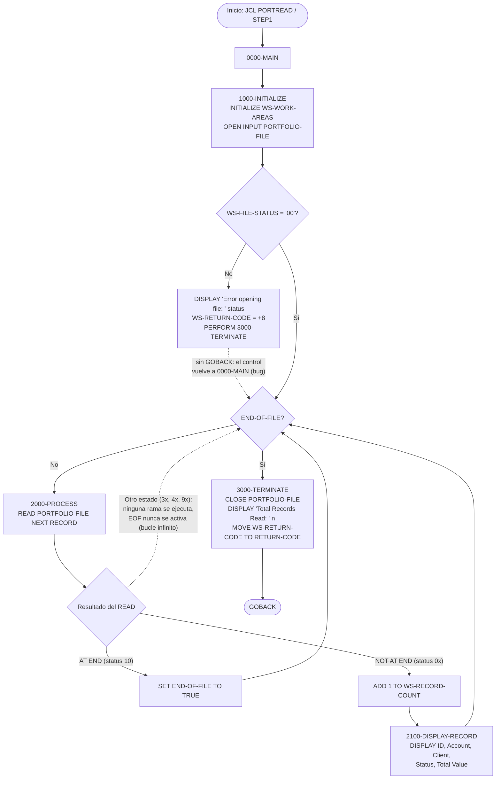
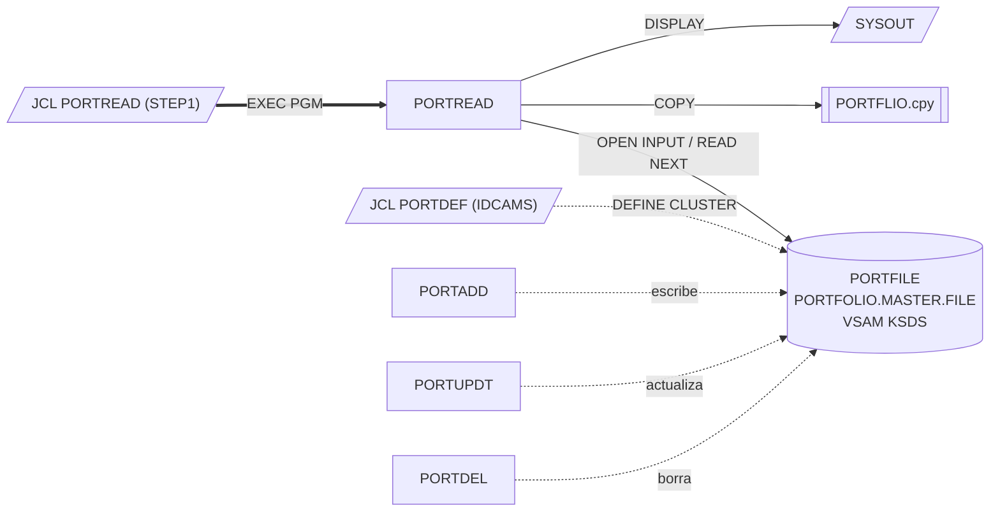

# PORTREAD — Lectura secuencial y volcado del fichero maestro de carteras

> Generado a partir del análisis del código fuente `src/programs/portfolio/PORTREAD.cbl`. Ver el [grafo de dependencias global](../technical/dependency-graph.md).

## Ficha técnica
| Campo | Valor |
| --- | --- |
| Ruta | `src/programs/portfolio/PORTREAD.cbl` |
| Categoría | portfolio |
| Tipo | batch |
| Líneas | 111 |
| Punto de entrada | JCL `PORTREAD` (`src/jcl/portfolio/PORTREAD.jcl`, paso `STEP1`, `EXEC PGM=PORTREAD`) |
| Invocado por | `JCL:PORTREAD` únicamente. Ningún programa COBOL lo invoca con `CALL` ni `EXEC CICS LINK`. |
| Invoca a | Ningún programa (sin `CALL`, sin `LINK`, sin rutinas de sistema). Único recurso externo: fichero VSAM `PORTFILE`. Copybook: `PORTFLIO`. |

## Propósito
PORTREAD es un programa batch de utilidad que recorre secuencialmente, de principio a fin, el fichero maestro de carteras (`PORTFOLIO-FILE`, DDNAME `PORTFILE`, VSAM KSDS) y escribe por `DISPLAY` (SYSOUT) un resumen de cada registro (identificador, cuenta, nombre de cliente, estado y valor total), seguido del número total de registros leídos. Según su propia cabecera, "demuestra las capacidades de lectura del fichero de carteras": es una herramienta de verificación/inspección de datos, no un proceso de negocio.

Encaja en el grupo de programas de mantenimiento del maestro de carteras (`PORTADD`, `PORTUPDT`, `PORTDEL`, `PORTREAD`, `PORTTEST`), que comparten el copybook `PORTFLIO` y el DDNAME `PORTFILE`. No forma parte de la cadena batch principal descrita en `system-architecture.md` (`TRNVAL00` → `POSUPD00` → `HISTLD00` → informes), no usa DB2, CICS, checkpoint/restart ni las rutinas comunes de error (`ERRPROC`).

## Funcionamiento
El programa sigue la estructura clásica inicialización → bucle de proceso → terminación, con cinco párrafos:

1. **`0000-MAIN`** — Párrafo de control. Ejecuta `1000-INITIALIZE`, después `PERFORM 2000-PROCESS UNTIL END-OF-FILE` (el bucle de lectura) y finalmente `3000-TERMINATE`. Termina con `GOBACK`.

2. **`1000-INITIALIZE`** — Inicializa `WS-WORK-AREAS` (`WS-RECORD-COUNT` = 0, `WS-RETURN-CODE` = 0) con `INITIALIZE`. Abre `PORTFOLIO-FILE` en modo `INPUT`. Si el `FILE STATUS` resultante no es `'00'` (`NOT WS-SUCCESS-STATUS`), muestra `'Error opening file: '` seguido del estado, mueve `WS-ERROR` (+8) a `WS-RETURN-CODE` y ejecuta `PERFORM 3000-TERMINATE`. **Importante:** tras ese `PERFORM` no hay `GOBACK`/`STOP RUN`, por lo que el control vuelve a `0000-MAIN`, que continúa con el bucle de lectura (ver [Observaciones](#observaciones-y-problemas-detectados)).

3. **`2000-PROCESS`** — Ejecuta `READ PORTFOLIO-FILE NEXT RECORD` (lectura secuencial por clave ascendente, sin `START` previo, es decir desde el primer registro del KSDS).
   - `AT END` (estado `'10'`): `SET END-OF-FILE TO TRUE`, lo que hace terminar el bucle de `0000-MAIN`.
   - `NOT AT END`: incrementa `WS-RECORD-COUNT` y ejecuta `2100-DISPLAY-RECORD`.
   - No hay comprobación explícita de `WS-FILE-STATUS` después del `READ`.

4. **`2100-DISPLAY-RECORD`** — Escribe en SYSOUT seis líneas por registro:
   - `'Portfolio Record: '` + `WS-RECORD-COUNT` (contador secuencial, 7 dígitos)
   - `'  ID: '` + `PORT-ID`
   - `'  Account: '` + `PORT-ACCOUNT-NO`
   - `'  Client: '` + `PORT-CLIENT-NAME`
   - `'  Status: '` + `PORT-STATUS`
   - `'  Total Value: '` + `PORT-TOTAL-VALUE`
   - una línea en blanco de separación.
   
   Solo se muestran 5 de los 12 campos elementales del registro; no se muestran `PORT-CLIENT-TYPE`, fechas, `PORT-CASH-BALANCE` ni la información de auditoría.

5. **`3000-TERMINATE`** — Cierra `PORTFOLIO-FILE` (sin comprobar el estado del `CLOSE`), muestra `'Total Records Read: '` + `WS-RECORD-COUNT` y mueve `WS-RETURN-CODE` al registro especial `RETURN-CODE`, que se convierte en el código de retorno del paso JCL.

## Interfaz
- **Parámetros / LINKAGE SECTION / COMMAREA**: No aplica. El programa no tiene `LINKAGE SECTION` ni `PROCEDURE DIVISION USING`; no lee `PARM=` del JCL ni `SYSIN`.

- **Ficheros (DDNAME, organización, modo de apertura, clave)**:

| Nombre lógico (FD) | DDNAME | Dataset (JCL) | Organización | Modo de acceso | Apertura | Clave | FILE STATUS |
| --- | --- | --- | --- | --- | --- | --- | --- |
| `PORTFOLIO-FILE` | `PORTFILE` | `PORTFOLIO.MASTER.FILE` (`DISP=SHR`) | `INDEXED` (VSAM KSDS) | `DYNAMIC` (solo se usa `READ ... NEXT`) | `INPUT` | `PORT-KEY` (`PORT-ID` X(8) + `PORT-ACCOUNT-NO` X(10) = 18 bytes) | `WS-FILE-STATUS` |

  Otros DD del JCL: `STEPLIB` (`YOUR.LOADLIB`, marcador de posición), `SYSOUT` (destino de los `DISPLAY`), `SYSPRINT`, `SYSUDUMP`.

- **Tablas DB2 y sentencias SQL**: No aplica.

- **Mapas BMS / comandos CICS**: No aplica.

- **Códigos de retorno / RETURN-CODE**:

| Valor | Constante | Cuándo |
| --- | --- | --- |
| `0` | `WS-SUCCESS` (nunca se referencia explícitamente; es el valor inicial de `WS-RETURN-CODE`) | Recorrido completo del fichero hasta `AT END`. |
| `8` | `WS-ERROR` | Fallo en `OPEN INPUT PORTFOLIO-FILE` (estado distinto de `'00'`). En la práctica, por el defecto descrito en Observaciones, es dudoso que el paso llegue a terminar con este código. |

  Los errores de `READ` distintos de fin de fichero y los errores de `CLOSE` no modifican el código de retorno. El JCL no define condiciones `COND`/`IF` sobre el RC.

## Estructuras de datos clave

### Copybook `PORTFLIO` (`src/copybook/common/PORTFLIO.cpy`)
Se incluye con `COPY PORTFLIO` bajo el `FD PORTFOLIO-FILE`, por lo que define el área de registro del fichero (`PORT-RECORD`). Longitud calculada: **148 bytes**.

| Nivel | Campo | PIC | Bytes | Descripción / valores |
| --- | --- | --- | --- | --- |
| 05 | `PORT-KEY` | grupo | 18 | Clave primaria del KSDS |
| 10 | `PORT-ID` | `X(8)` | 8 | Identificador de cartera (mostrado) |
| 10 | `PORT-ACCOUNT-NO` | `X(10)` | 10 | Número de cuenta (mostrado) |
| 05 | `PORT-CLIENT-INFO` | grupo | 31 | |
| 10 | `PORT-CLIENT-NAME` | `X(30)` | 30 | Nombre del cliente (mostrado) |
| 10 | `PORT-CLIENT-TYPE` | `X(1)` | 1 | 88: `PORT-INDIVIDUAL` 'I', `PORT-CORPORATE` 'C', `PORT-TRUST` 'T' |
| 05 | `PORT-PORTFOLIO-INFO` | grupo | 17 | |
| 10 | `PORT-CREATE-DATE` | `9(8)` | 8 | Fecha de alta (formato no documentado en el copybook; probablemente AAAAMMDD) |
| 10 | `PORT-LAST-MAINT` | `9(8)` | 8 | Fecha de último mantenimiento |
| 10 | `PORT-STATUS` | `X(1)` | 1 | 88: `PORT-ACTIVE` 'A', `PORT-CLOSED` 'C', `PORT-SUSPENDED` 'S' (mostrado) |
| 05 | `PORT-FINANCIAL-INFO` | grupo | 16 | |
| 10 | `PORT-TOTAL-VALUE` | `S9(13)V99 COMP-3` | 8 | Valor total de la cartera (mostrado) |
| 10 | `PORT-CASH-BALANCE` | `S9(13)V99 COMP-3` | 8 | Saldo de efectivo |
| 05 | `PORT-AUDIT-INFO` | grupo | 16 | |
| 10 | `PORT-LAST-USER` | `X(8)` | 8 | Último usuario que modificó |
| 10 | `PORT-LAST-TRANS` | `9(8)` | 8 | Última transacción |
| 05 | `PORT-FILLER` | `X(50)` | 50 | Reservado |

### WORKING-STORAGE
| Grupo | Campo | PIC / valor | Uso |
| --- | --- | --- | --- |
| `WS-CONSTANTS` | `WS-PROGRAM-NAME` | `X(08)` VALUE `'PORTREAD '` | No se utiliza en la `PROCEDURE DIVISION`. El literal tiene 9 caracteres para un campo de 8 (truncamiento en compilación). |
| `WS-CONSTANTS` | `WS-SUCCESS` | `S9(4)` VALUE +0 | No se utiliza. |
| `WS-CONSTANTS` | `WS-ERROR` | `S9(4)` VALUE +8 | RC de error de apertura. |
| `WS-SWITCHES` | `WS-FILE-STATUS` | `X(02)` | `FILE STATUS` del fichero. 88: `WS-SUCCESS-STATUS` '00', `WS-EOF-STATUS` '10', `WS-REC-NOT-FND` '23'. Solo se evalúa `WS-SUCCESS-STATUS` (tras el `OPEN`); `WS-EOF-STATUS` y `WS-REC-NOT-FND` no se usan. |
| `WS-SWITCHES` | `WS-END-OF-FILE-SW` | `X` VALUE 'N' | 88: `END-OF-FILE` 'Y', `NOT-END-OF-FILE` 'N'. Controla el bucle `PERFORM ... UNTIL END-OF-FILE`. |
| `WS-WORK-AREAS` | `WS-RECORD-COUNT` | `9(7)` | Contador de registros leídos (máx. 9.999.999; sin control de desbordamiento). |
| `WS-WORK-AREAS` | `WS-RETURN-CODE` | `S9(4)` | Código de retorno interno, copiado a `RETURN-CODE` en `3000-TERMINATE`. |

No hay umbrales de commit, contadores de checkpoint ni parámetros configurables: el programa procesa el fichero completo en una única pasada.

## Reglas de negocio y validaciones
El programa no implementa reglas de negocio propiamente dichas; es un volcado de datos. Las únicas condiciones codificadas son:

1. **Apertura correcta**: tras `OPEN INPUT`, `WS-FILE-STATUS` debe ser `'00'`; en caso contrario se informa el error y `WS-RETURN-CODE` pasa a +8.
2. **Fin de fichero**: la lectura termina cuando el `READ NEXT` devuelve la condición `AT END` (estado `'10'`).
3. **Conteo**: cada registro leído con éxito incrementa `WS-RECORD-COUNT` en 1; el total se informa al final.
4. **Sin filtros**: se muestran todos los registros, independientemente de `PORT-STATUS` o `PORT-CLIENT-TYPE`. Los niveles 88 del copybook (`PORT-ACTIVE`, `PORT-CORPORATE`, etc.) no se evalúan.
5. **Sin cálculos**: no se acumulan importes (`PORT-TOTAL-VALUE`, `PORT-CASH-BALANCE`) ni se realizan totales de control.

## Manejo de errores y recuperación
- **FILE STATUS**: solo se comprueba después del `OPEN`. El `READ NEXT` se apoya exclusivamente en `AT END` / `NOT AT END`; cualquier estado de error distinto de `'10'` (por ejemplo `'30'` error permanente de E/S, `'47'` fichero no abierto, `'9x'` errores VSAM) no se detecta: al tener el fichero cláusula `FILE STATUS` y no existir `DECLARATIVES`, la ejecución continúa sin que se ejecute ninguna de las dos ramas, `END-OF-FILE` nunca se activa y el bucle de `0000-MAIN` no termina. El `CLOSE` tampoco se verifica.
- **Ruta de error de apertura**: informa por `DISPLAY`, fija RC 8 y ejecuta `3000-TERMINATE` (que hace `CLOSE` sobre un fichero no abierto, estado `'42'` ignorado, e imprime el total 0). Al no abandonar el programa, `0000-MAIN` sigue con `2000-PROCESS`, cuyo `READ` sobre un fichero cerrado devuelve estado `'47'` y desemboca en el bucle infinito descrito arriba (el paso terminaría probablemente por tiempo de CPU o cancelación del operador, no con RC 8).
- **SQLCODE / condiciones CICS**: No aplica (sin DB2 ni CICS).
- **Checkpoint/restart, rollback**: No implementados. El programa es de solo lectura, así que una reejecución completa es segura desde el punto de vista de los datos.
- **Rutinas comunes**: No llama a `ERRPROC`, `ERRHNDL` ni `DB2ERR`; no escribe en `ERRLOG` ni `AUDFILE`. Toda la salida de diagnóstico va a `SYSOUT` mediante `DISPLAY`.

## Dependencias

Programas que comparten el copybook `PORTFLIO`: `PORTADD`, `PORTDEL`, `PORTTEST`, `PORTUPDT`, `TSTGEN00`. Programas que comparten el DDNAME `PORTFILE`: `PORTADD`, `PORTDEL`, `PORTMSTR`, `PORTTRAN`, `PORTUPDT` (los dos últimos con layouts de registro propios, ver Observaciones).

## Observaciones y problemas detectados
1. **Bug: la ruta de error de apertura no termina el programa.** En `1000-INITIALIZE`, tras el `PERFORM 3000-TERMINATE` falta un `GOBACK`/`STOP RUN`. El control vuelve a `0000-MAIN`, que ejecuta `2000-PROCESS` sobre un fichero no abierto; como el `READ` falla con un estado que no es `'10'`, `END-OF-FILE` nunca se activa y el programa entra en bucle infinito. Además, si de algún modo se saliera del bucle, `3000-TERMINATE` se ejecutaría dos veces (doble `CLOSE`, doble mensaje de total).
2. **Errores de lectura no controlados.** `2000-PROCESS` no evalúa `WS-FILE-STATUS` tras el `READ NEXT`. Cualquier estado de error distinto de fin de fichero produce el mismo bucle infinito del punto anterior en lugar de un fin controlado con RC de error.
3. **`CLOSE` sin verificación** en `3000-TERMINATE`.
4. **Literal truncado**: `WS-PROGRAM-NAME PIC X(08) VALUE 'PORTREAD '` tiene un literal de 9 caracteres (espacio final); el compilador lo trunca con aviso. Sin impacto funcional (el campo no se usa).
5. **Código muerto**: `WS-PROGRAM-NAME`, `WS-SUCCESS`, `WS-EOF-STATUS` y `WS-REC-NOT-FND` se definen pero nunca se referencian. `ACCESS MODE IS DYNAMIC` no es necesario para el uso real (solo `READ NEXT` sin `START`); `SEQUENTIAL` sería suficiente.
6. **Salida de `PORT-TOTAL-VALUE` sin edición.** Se hace `DISPLAY` directo de un campo `S9(13)V99 COMP-3`, por lo que probablemente se imprima como numérico sin punto decimal ni formato de signo legible; para un informe legible convendría un campo de edición (`PIC -(13)9.99`).
7. **Discrepancias en la definición física del fichero `PORTFOLIO.MASTER.FILE`** (el código manda, pero conviene registrarlas):
   - El copybook `PORTFLIO` define un registro de **148 bytes** con clave de **18 bytes** (`PORT-ID` + `PORT-ACCOUNT-NO`). El `FD` no lleva `RECORD CONTAINS`, así que la longitud lógica es la del copybook.
   - `src/jcl/portfolio/PORTDEF.jcl` define el clúster con `RECORDSIZE(200 200)` y `KEYS(18 0)`: coincide en la clave pero no en la longitud (registro fijo de 200 frente a 148). En un entorno real esta desigualdad provocaría probablemente estado `'39'` (atributos incompatibles) en el `OPEN`.
   - `src/database/vsam/vsam-definitions.txt` describe el maestro de carteras (`PORTMSTR`) con registro de **400 bytes** y clave de **12 bytes** (Portfolio ID 8 + Account Type 2 + Branch ID 2), y un `DEFINE CLUSTER` con `RECORDSIZE(400 400) KEYS(12 0)`. Ni la longitud ni la composición de la clave coinciden con `PORTFLIO`.
   - `PORTMSTR.cbl` accede al mismo DDNAME `PORTFILE` con un layout propio en línea de 100 bytes (`RECORD CONTAINS 100`, clave `PORT-ID X(10)`), y `PORTTRAN.cbl` lo hace con `COPY PORTREC` (copybook que no existe en `src/`) y clave `PORT-ID`. Ambos son incompatibles con `PORTFLIO`. Existen por tanto al menos tres layouts distintos para el "mismo" fichero maestro de carteras en `src/`.
8. **Ausencia en la documentación de arquitectura.** `system-architecture.md` no menciona `PORTREAD` ni el grupo de programas `PORT*`, y `data-dictionary.md` no documenta el layout `PORTFLIO` (documenta `POSMSTRE`, `TRANHIST`, `BCHCTL`, etc.). `PORTREAD` tampoco aparece entre los Process IDs de control batch (`TRNVAL00`, `POSUPD00`, `HISTLD00`, `RPTGEN00`), lo que confirma su carácter de utilidad aislada.
9. **JCL con marcadores de posición**: `STEPLIB` apunta a `YOUR.LOADLIB`; hay que sustituirlo antes de ejecutar. Sin `COND`/`IF` que evalúen el RC del paso.
10. **Sin integración con el marco de errores/auditoría** del sistema (`ERRPROC`, `AUDPROC`, checkpoint/restart), a diferencia de programas como `PORTMSTR` o `PORTTRAN`. Es coherente con su naturaleza de programa de demostración, pero limita su uso en producción.

## Referencias
- Programa: [PORTREAD.cbl](../../src/programs/portfolio/PORTREAD.cbl)
- Copybook: [PORTFLIO.cpy](../../src/copybook/common/PORTFLIO.cpy)
- JCL de ejecución: [PORTREAD.jcl](../../src/jcl/portfolio/PORTREAD.jcl)
- JCL de definición del VSAM: [PORTDEF.jcl](../../src/jcl/portfolio/PORTDEF.jcl)
- Definiciones VSAM: [vsam-definitions.txt](../../src/database/vsam/vsam-definitions.txt)
- Programas relacionados que usan `PORTFILE`/`PORTFLIO`: [PORTADD.cbl](../../src/programs/portfolio/PORTADD.cbl), [PORTUPDT.cbl](../../src/programs/portfolio/PORTUPDT.cbl), [PORTDEL.cbl](../../src/programs/portfolio/PORTDEL.cbl), [PORTTEST.cbl](../../src/programs/portfolio/PORTTEST.cbl), [PORTMSTR.cbl](../../src/programs/portfolio/PORTMSTR.cbl), [PORTTRAN.cbl](../../src/programs/portfolio/PORTTRAN.cbl)
- Documentación técnica: [dependency-graph.md](../technical/dependency-graph.md), [system-architecture.md](../technical/system-architecture.md), [data-dictionary.md](../technical/data-dictionary.md)
