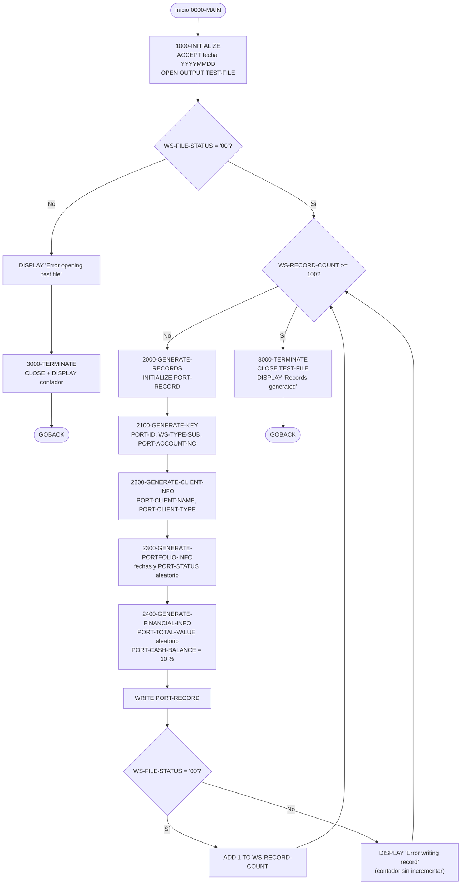
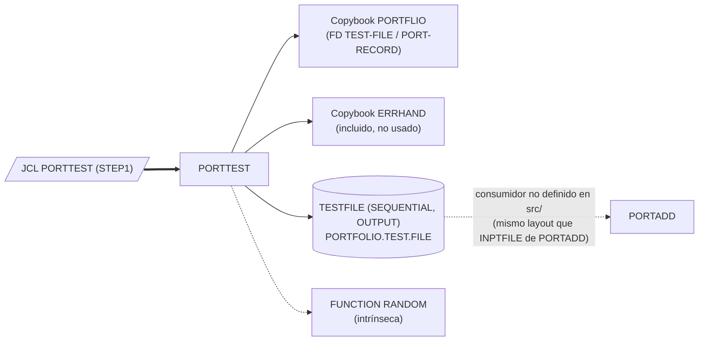

# PORTTEST — Generador batch de datos de prueba de carteras

> Generado a partir del análisis del código fuente `src/programs/portfolio/PORTTEST.cbl`. Ver el [grafo de dependencias global](../technical/dependency-graph.md).

## Ficha técnica
| Campo | Valor |
| --- | --- |
| Ruta | `src/programs/portfolio/PORTTEST.cbl` |
| Categoría | portfolio |
| Tipo | batch |
| Líneas | 119 |
| Punto de entrada | JCL `PORTTEST` (`src/jcl/portfolio/PORTTEST.jcl`, paso `STEP1`, `EXEC PGM=PORTTEST`) |
| Invocado por | JCL:PORTTEST (ningún programa COBOL lo llama mediante `CALL` ni `LINK`) |
| Invoca a | Ningún programa. Solo usa los copybooks `PORTFLIO` y `ERRHAND`, y la función intrínseca `FUNCTION RANDOM` |

## Propósito
`PORTTEST` es una utilidad batch autónoma que genera un fichero secuencial con 100 registros sintéticos de cartera (maestro de carteras) con el formato del copybook `PORTFLIO`. Su finalidad es disponer de datos de prueba para los programas de mantenimiento del maestro de carteras de la categoría *portfolio* (`PORTADD`, `PORTUPDT`, `PORTDEL`, `PORTREAD`, `PORTMSTR`), que comparten el mismo layout de registro. No forma parte del flujo batch productivo (control `BCHCTL00`, checkpoint/restart, DB2), no accede a VSAM ni a DB2 y no está referenciado desde `system-architecture.md`, que solo describe `TSTGEN00` como generador de datos de prueba; `PORTTEST` es, por tanto, un generador más simple y específico del subsistema de carteras.

## Funcionamiento

### `0000-MAIN`
Párrafo principal. Ejecuta `1000-INITIALIZE`, itera `2000-GENERATE-RECORDS` con `PERFORM ... UNTIL WS-RECORD-COUNT >= WS-MAX-RECORDS` (100 registros) y finaliza con `3000-TERMINATE` y `GOBACK`. La condición `UNTIL` se evalúa antes de cada iteración (semántica por defecto `TEST BEFORE`).

### `1000-INITIALIZE`
1. Obtiene la fecha del sistema con `ACCEPT WS-CURRENT-DATE FROM DATE YYYYMMDD` (formato `AAAAMMDD`, `PIC 9(8)`).
2. Abre el fichero de salida: `OPEN OUTPUT TEST-FILE` (DDNAME `TESTFILE`).
3. Si `WS-FILE-STATUS` es distinto de `'00'`, muestra `Error opening test file: nn` por `DISPLAY`, ejecuta `3000-TERMINATE` (que intenta cerrar el fichero y muestra el contador) y hace `GOBACK` directamente desde este párrafo, abortando el programa. No se modifica `RETURN-CODE`.

### `2000-GENERATE-RECORDS`
Genera y escribe un registro por iteración:
1. `INITIALIZE PORT-RECORD`: pone a espacios los campos alfanuméricos y a cero los numéricos del registro (incluidos `PORT-LAST-USER`, `PORT-LAST-TRANS` y `PORT-FILLER`, que no se rellenan después).
2. `PERFORM 2100-GENERATE-KEY`, `2200-GENERATE-CLIENT-INFO`, `2300-GENERATE-PORTFOLIO-INFO`, `2400-GENERATE-FINANCIAL-INFO`.
3. `WRITE PORT-RECORD`.
4. Si `WS-FILE-STATUS = '00'` incrementa `WS-RECORD-COUNT`; en caso contrario muestra `Error writing record: nn` y **no** incrementa el contador (ver [Observaciones](#observaciones-y-problemas-detectados): riesgo de bucle infinito).

### `2100-GENERATE-KEY`
- `STRING 'PORT' WS-RECORD-COUNT DELIMITED BY SIZE INTO PORT-ID`: intenta construir el identificador de cartera concatenando el literal `PORT` y el contador (5 dígitos). Como `PORT-ID` es `PIC X(8)` y el resultado tendría 9 caracteres, la operación desborda y se trunca silenciosamente (no hay `ON OVERFLOW`).
- `MOVE FUNCTION RANDOM(WS-RECORD-COUNT) TO WS-TYPE-SUB`: usa el contador como semilla y mueve el valor aleatorio (un número real en el intervalo `[0,1)`) a `WS-TYPE-SUB`, que es `PIC 9(1)`. El resultado es siempre `0` (ver observaciones).
- `COMPUTE PORT-ACCOUNT-NO = WS-RECORD-COUNT + 1000000000`: pretende asignar números de cuenta consecutivos a partir de `1000000000`, pero `PORT-ACCOUNT-NO` es `PIC X(10)` (alfanumérico), lo que no es un receptor válido para `COMPUTE`.

### `2200-GENERATE-CLIENT-INFO`
- `STRING WS-NAME-PREFIX WS-RECORD-COUNT DELIMITED BY SIZE INTO PORT-CLIENT-NAME`: nombre del cliente `TEST` + contador de 5 dígitos (p. ej. `TEST00007`), que cabe en `PIC X(30)`; el resto del campo queda a espacios por el `INITIALIZE` previo.
- `MOVE WS-CLIENT-TYPES(WS-TYPE-SUB:1) TO PORT-CLIENT-TYPE`: selecciona por modificación de referencia un carácter de la cadena `'ICT'` (Individual, Corporate, Trust) usando `WS-TYPE-SUB` como posición. Al valer `WS-TYPE-SUB` siempre `0`, la posición está fuera de rango.

### `2300-GENERATE-PORTFOLIO-INFO`
- Asigna la fecha del sistema a `PORT-CREATE-DATE` y `PORT-LAST-MAINT`.
- `COMPUTE WS-STATUS-SUB = FUNCTION RANDOM * 3 + 1`: obtiene un entero en `1..3` (truncado) y elige el estado en la cadena `'ACS'` (`A` = activa, `C` = cerrada, `S` = suspendida) con `MOVE WS-STATUS-TYPES(WS-STATUS-SUB:1) TO PORT-STATUS`. Esta parte sí funciona correctamente.

### `2400-GENERATE-FINANCIAL-INFO`
- `PORT-TOTAL-VALUE = FUNCTION RANDOM * 1000000`: valor total aleatorio en `[0, 1.000.000)` con dos decimales (truncado a `S9(13)V99 COMP-3`).
- `PORT-CASH-BALANCE = PORT-TOTAL-VALUE * .10`: el saldo de efectivo es siempre el 10 % del valor total.

### `3000-TERMINATE`
`CLOSE TEST-FILE` (sin comprobar el `FILE STATUS`) y `DISPLAY 'Records generated: ' WS-RECORD-COUNT`.

## Interfaz
- **Parámetros / LINKAGE SECTION / COMMAREA**: No aplica. El programa no tiene `LINKAGE SECTION` ni recibe `PARM` del JCL.
- **Ficheros (DDNAME, organización, modo de apertura, clave)**:

  | Fichero COBOL | DDNAME | Organización | Modo de apertura | Clave | Layout | Dataset (JCL) |
  | --- | --- | --- | --- | --- | --- | --- |
  | `TEST-FILE` | `TESTFILE` | `SEQUENTIAL` (QSAM) | `OUTPUT` | Ninguna | `PORT-RECORD` (copybook `PORTFLIO`, 148 bytes) | `PORTFOLIO.TEST.FILE`, `DISP=(NEW,CATLG,DELETE)`, `RECFM=FB,LRECL=200` |

- **Tablas DB2 y sentencias SQL**: No aplica.
- **Mapas BMS / comandos CICS**: No aplica.
- **Códigos de retorno / RETURN-CODE**: El programa nunca modifica `RETURN-CODE`, por lo que el paso termina con `RC=0` tanto en ejecución normal como cuando falla el `OPEN`. Las únicas señales de error son los mensajes `DISPLAY` en `SYSOUT`. El copybook `ERRHAND` define los códigos estándar (`ERR-SUCCESS`, `ERR-WARNING`, …) pero no se utilizan. El JCL no tiene condiciones `COND`/`IF` que dependan del código de retorno.

## Estructuras de datos clave

### Copybooks
| Copybook | Ruta | Uso en PORTTEST |
| --- | --- | --- |
| `PORTFLIO` | `src/copybook/common/PORTFLIO.cpy` | Se incluye bajo el `FD TEST-FILE` y define el registro `PORT-RECORD` (148 bytes): `PORT-KEY` (`PORT-ID` X(8) + `PORT-ACCOUNT-NO` X(10)), `PORT-CLIENT-INFO` (`PORT-CLIENT-NAME` X(30), `PORT-CLIENT-TYPE` X(1) con niveles 88 `I`/`C`/`T`), `PORT-PORTFOLIO-INFO` (`PORT-CREATE-DATE` 9(8), `PORT-LAST-MAINT` 9(8), `PORT-STATUS` X(1) con niveles 88 `A`/`C`/`S`), `PORT-FINANCIAL-INFO` (`PORT-TOTAL-VALUE` y `PORT-CASH-BALANCE`, `S9(13)V99 COMP-3`), `PORT-AUDIT-INFO` (`PORT-LAST-USER` X(8), `PORT-LAST-TRANS` 9(8)) y `PORT-FILLER` X(50). |
| `ERRHAND` | `src/copybook/common/ERRHAND.cpy` | Se incluye en `WORKING-STORAGE` (categorías de error, códigos de retorno estándar, estructura `ERR-MESSAGE`, códigos VSAM). **Ningún campo se referencia** en la `PROCEDURE DIVISION`; su inclusión es puramente convencional. |

### WORKING-STORAGE relevante
| Campo | Definición | Función |
| --- | --- | --- |
| `WS-FILE-STATUS` | `PIC X(2)` | `FILE STATUS` de `TEST-FILE`; se comprueba tras `OPEN` y `WRITE`, no tras `CLOSE`. |
| `WS-RECORD-COUNT` | `PIC 9(5) VALUE 0` | Contador de registros escritos correctamente; controla el bucle, se usa como semilla de `RANDOM` y como sufijo de `PORT-ID`, `PORT-CLIENT-NAME` y `PORT-ACCOUNT-NO`. |
| `WS-MAX-RECORDS` | `PIC 9(5) VALUE 100` | Umbral de registros a generar (fijo, no parametrizable). |
| `WS-CURRENT-DATE` | `PIC 9(8)` | Fecha del sistema `AAAAMMDD` usada para `PORT-CREATE-DATE` y `PORT-LAST-MAINT`. |
| `WS-CLIENT-TYPES` | `PIC X(3) VALUE 'ICT'` | Tabla implícita de tipos de cliente (Individual, Corporate, Trust), indexada por modificación de referencia. |
| `WS-STATUS-TYPES` | `PIC X(3) VALUE 'ACS'` | Tabla implícita de estados (Active, Closed, Suspended). |
| `WS-NAME-PREFIX` | `PIC X(4) VALUE 'TEST'` | Prefijo del nombre de cliente sintético. |
| `WS-TYPE-SUB` | `PIC 9(1)` | Posición (1..3 esperada) dentro de `WS-CLIENT-TYPES`. |
| `WS-STATUS-SUB` | `PIC 9(1)` | Posición (1..3) dentro de `WS-STATUS-TYPES`. |

## Reglas de negocio y validaciones
Reglas efectivamente implementadas en el código (independientemente de que algunas fallen en la práctica, ver observaciones):
1. Se generan exactamente `WS-MAX-RECORDS` = 100 registros correctamente escritos; el contador solo avanza con `FILE STATUS '00'`.
2. Identificador de cartera pretendido: `'PORT' + contador` (`PORT00000`…`PORT00099`), truncado a 8 caracteres.
3. Número de cuenta pretendido: `1000000000 + contador` (cuentas consecutivas desde `1000000000`).
4. Nombre de cliente: `'TEST' + contador de 5 dígitos`, relleno con espacios hasta 30 caracteres.
5. Tipo de cliente: uno de `I`, `C`, `T` seleccionado "aleatoriamente" a partir de `FUNCTION RANDOM` sembrado con el contador (el algoritmo es determinista para una misma secuencia de contadores).
6. Fecha de creación y de última modificación = fecha de ejecución del job.
7. Estado de la cartera: `A`, `C` o `S` con probabilidad aproximadamente uniforme (`RANDOM * 3 + 1` truncado a entero).
8. Valor total de la cartera: aleatorio uniforme en `[0, 1.000.000)` con dos decimales.
9. Saldo de efectivo: siempre el 10 % del valor total (`PORT-TOTAL-VALUE * .10`).
10. Campos de auditoría (`PORT-LAST-USER`, `PORT-LAST-TRANS`) y `PORT-FILLER` quedan en los valores del `INITIALIZE` (espacios / ceros).
11. No existe ninguna validación de los datos generados ni de duplicidad de claves; el programa no lee ninguna entrada.

## Manejo de errores y recuperación
- **FILE STATUS**: solo se inspecciona `WS-FILE-STATUS` tras `OPEN OUTPUT` y tras cada `WRITE`. En el `OPEN` fallido se muestra un mensaje, se ejecuta `3000-TERMINATE` (que hace `CLOSE` de un fichero no abierto, cuyo status resultante se ignora) y se termina con `GOBACK`. En el `WRITE` fallido se muestra un mensaje y se continúa el bucle sin incrementar el contador.
- **`CLOSE`**: no se comprueba el estado.
- **Códigos de retorno**: `RETURN-CODE` no se establece nunca; el JCL no puede distinguir una ejecución fallida de una correcta.
- **SQLCODE / CICS**: No aplica (no hay DB2 ni CICS).
- **Checkpoint/restart y rollback**: No aplica; el programa no usa `CKPRST`, `BCHCTL00` ni ningún mecanismo de reinicio. Al ser el dataset de salida `DISP=(NEW,CATLG,DELETE)`, un fallo del paso borra el fichero y una relanzada partiría de cero (pero fallaría por dataset ya catalogado si el paso previo terminó bien).
- **Rutinas de error comunes**: no llama a `ERRPROC`, `ERRHNDL` ni `DB2ERR`, aunque incluye el copybook `ERRHAND`, cuyos campos (`ERR-MESSAGE`, `ERR-RETURN-CODES`, …) no se utilizan.

## Dependencias

Leyenda: flecha continua gruesa = invocación desde JCL; flecha continua = copybook/fichero usado; flecha discontinua = relación inferida (no existe en el código un JCL que encadene `PORTFOLIO.TEST.FILE` con ningún programa).

## Observaciones y problemas detectados
1. **Truncamiento y claves duplicadas en `PORT-ID`** (`2100-GENERATE-KEY`): `STRING 'PORT' WS-RECORD-COUNT` produce 9 caracteres (`PORT` + 5 dígitos) sobre un campo `PIC X(8)`. Sin cláusula `ON OVERFLOW`, `STRING` se detiene al llenar el receptor y se pierde el último dígito del contador. Con 100 registros (`00000`..`00099`) se obtienen solo 10 valores distintos (`PORT0000`, `PORT0001`, …, `PORT0009`), cada uno repetido 10 veces. Como `PORT-ID`/`PORT-KEY` es la clave del maestro de carteras (`PORTMSTR`, `PORTADD`, `PORTREAD`, `PORTUPDT`, `PORTDEL`), cargar este fichero en el VSAM produciría errores de clave duplicada (status `22`).
2. **`WS-TYPE-SUB` siempre vale 0 y la modificación de referencia queda fuera de rango** (`2100-GENERATE-KEY` / `2200-GENERATE-CLIENT-INFO`): `FUNCTION RANDOM` devuelve un valor en `[0,1)`; al moverlo a `WS-TYPE-SUB` (`PIC 9(1)`, sin decimales) la parte fraccionaria se trunca y el resultado es `0`. `WS-CLIENT-TYPES(0:1)` es una posición inválida (las posiciones válidas son 1..3): con la opción de compilación `SSRANGE` el programa abendaría en tiempo de ejecución; sin ella se leería el byte anterior al campo (comportamiento indefinido), por lo que `PORT-CLIENT-TYPE` nunca contendría `I`/`C`/`T` de forma fiable. La intención evidente era algo análogo a `RANDOM * 3 + 1`, como sí se hace para `WS-STATUS-SUB`.
3. **`COMPUTE` sobre un campo alfanumérico**: `PORT-ACCOUNT-NO` está definido en `PORTFLIO` como `PIC X(10)`. `COMPUTE PORT-ACCOUNT-NO = WS-RECORD-COUNT + 1000000000` no es válido en Enterprise COBOL (el receptor de un `COMPUTE` debe ser numérico o numérico editado) y probablemente provoque un error de compilación. Habría que usar un campo numérico intermedio y `MOVE`.
4. **Riesgo de bucle infinito en `2000-GENERATE-RECORDS`**: si un `WRITE` falla de forma persistente (p. ej. status `34`, espacio agotado, o `30`), el contador no se incrementa y `PERFORM ... UNTIL WS-RECORD-COUNT >= WS-MAX-RECORDS` no termina nunca, generando mensajes `Error writing record` indefinidamente hasta que el job sea cancelado.
5. **`RETURN-CODE` nunca se informa**: los errores de `OPEN` y `WRITE` solo se reflejan en `SYSOUT`; el paso termina con `RC=0`. Los códigos estándar de `ERRHAND` (`ERR-ERROR`, `ERR-SEVERE`) están disponibles pero no se usan.
6. **Copybook `ERRHAND` incluido pero sin uso**: ninguno de sus campos se referencia. No es un error funcional, pero es código muerto en `WORKING-STORAGE`.
7. **Discrepancia de longitud de registro con el JCL**: el registro `PORT-RECORD` mide 148 bytes (8+10+30+1+8+8+1+8+8+8+8+50), mientras que `PORTTEST.jcl` codifica `DCB=(RECFM=FB,LRECL=200,BLKSIZE=0)`. Para un fichero QSAM de registros fijos, esta inconsistencia entre la `FD` y el `LRECL` del DD hace probable un fallo del `OPEN` (status `39`) o, en su caso, un fichero con longitud de registro incompatible con los programas lectores.
8. **Discrepancia con `vsam-definitions.txt`**: la definición del maestro `PORTMSTR` indica longitud de registro 400 y clave de 12 bytes (Portfolio ID 8 + Account Type 2 + Branch ID 2), mientras que el copybook `PORTFLIO` que usa `PORTTEST` (y el resto de programas *portfolio*) define un registro de 148 bytes con `PORT-KEY` de 18 bytes (`PORT-ID` 8 + `PORT-ACCOUNT-NO` 10). Además, `PORTMSTR.cbl` declara `RECORD KEY IS PORT-ID` (8 bytes) frente a `RECORD KEY IS PORT-KEY` (18 bytes) en `PORTREAD`/`PORTADD`. Manda el código: los datos generados siguen `PORTFLIO`, pero no son coherentes con el IDCAMS `DEFINE CLUSTER` documentado.
9. **Sin consumidor definido en el repositorio**: el dataset `PORTFOLIO.TEST.FILE` no aparece en ningún otro JCL ni programa. El layout coincide con el fichero `INPTFILE` (`PORTFOLIO.INPUT.FILE`) de `PORTADD`, por lo que probablemente la intención era alimentar `PORTADD`, pero esa relación no está materializada en `src/`.
10. **No aparece en `system-architecture.md`**: la arquitectura documenta únicamente `TSTGEN00` como generador de datos de prueba (con fichero de configuración, semilla persistente y `ERRPROC`). `PORTTEST` duplica parcialmente esa función de forma simplificada (volumen fijo de 100, sin configuración, sin gestión de errores estándar) y no está integrado en el "Test Layer" descrito.
11. **Formato de la primera línea**: el comentario de cabecera de la línea 1 comienza en la columna 3 (`  *====`), no en la columna 7 como el resto de comentarios; en formato fijo el carácter `=` cae en el área de indicador (columna 7), lo que probablemente genere al menos un aviso o error del compilador. Es un defecto cosmético de origen.
12. **`DISP=(NEW,CATLG,DELETE)` sin borrado previo**: relanzar el job tras una ejecución correcta falla en la asignación del dataset porque ya está catalogado; no existe paso `IEFBR14`/`IDCAMS DELETE` previo.
13. **Campos de auditoría vacíos**: `PORT-LAST-USER` (espacios) y `PORT-LAST-TRANS` (ceros) no se rellenan, lo que puede hacer que los registros generados no superen validaciones que exijan usuario o transacción de última modificación.

## Referencias
- Programa: [PORTTEST.cbl](../../src/programs/portfolio/PORTTEST.cbl)
- JCL de ejecución: [PORTTEST.jcl](../../src/jcl/portfolio/PORTTEST.jcl)
- Copybooks: [PORTFLIO.cpy](../../src/copybook/common/PORTFLIO.cpy), [ERRHAND.cpy](../../src/copybook/common/ERRHAND.cpy)
- Definiciones VSAM del maestro de carteras: [vsam-definitions.txt](../../src/database/vsam/vsam-definitions.txt)
- Programas que comparten el layout `PORTFLIO` (posibles consumidores de los datos): [PORTADD.cbl](../../src/programs/portfolio/PORTADD.cbl), [PORTREAD.cbl](../../src/programs/portfolio/PORTREAD.cbl), [PORTUPDT.cbl](../../src/programs/portfolio/PORTUPDT.cbl), [PORTDEL.cbl](../../src/programs/portfolio/PORTDEL.cbl), [PORTMSTR.cbl](../../src/programs/portfolio/PORTMSTR.cbl)
- Generador de pruebas documentado en la arquitectura: [TSTGEN00.cbl](../../src/programs/test/TSTGEN00.cbl)
- Documentación técnica: [system-architecture.md](../technical/system-architecture.md), [data-dictionary.md](../technical/data-dictionary.md), [dependency-graph.md](../technical/dependency-graph.md)
