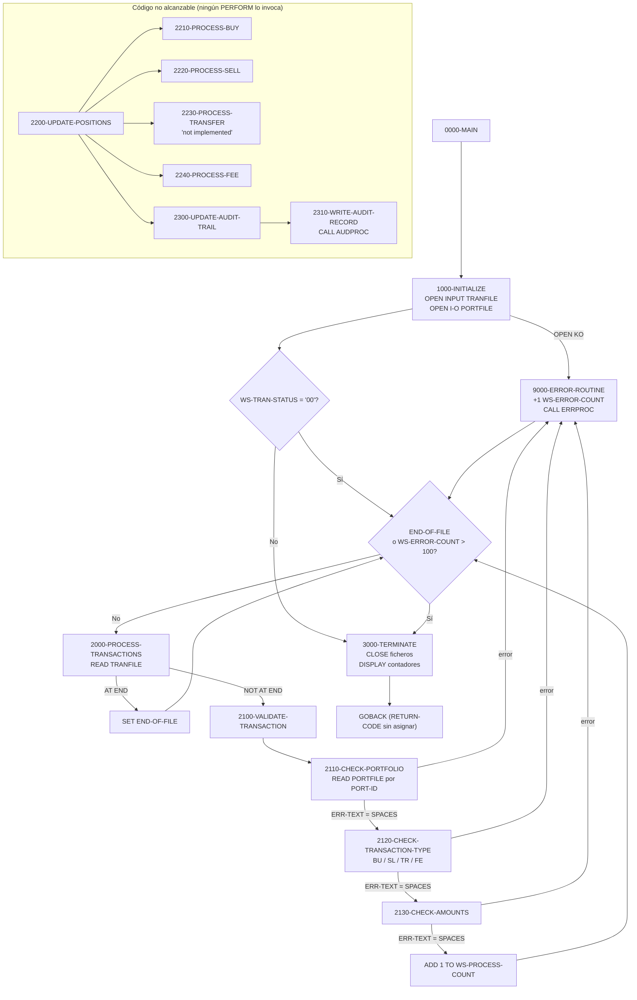
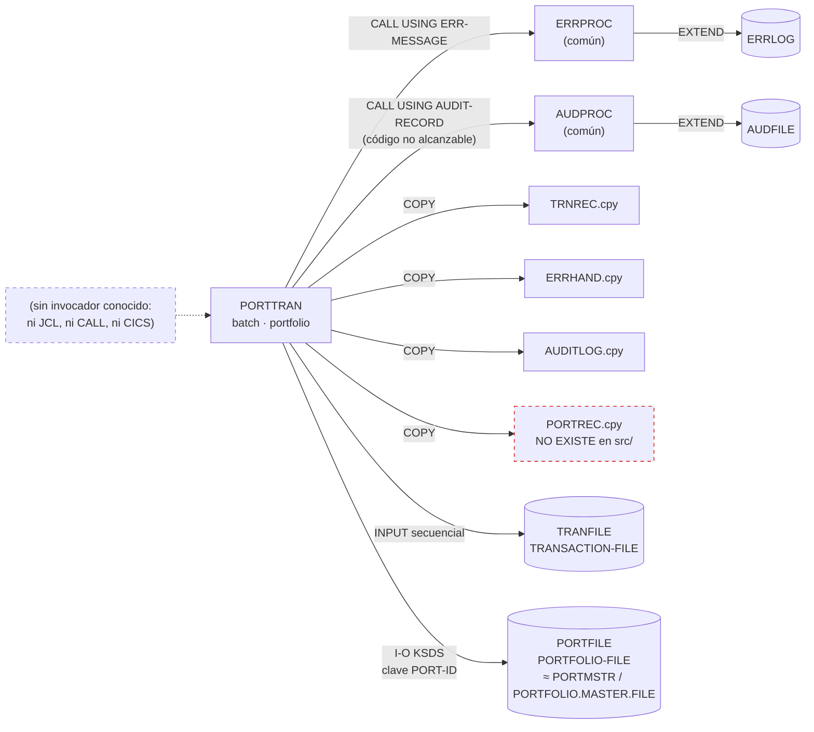

# PORTTRAN — Proceso batch de transacciones de cartera (compra, venta, traspaso y comisión)

> Generado a partir del análisis del código fuente `src/programs/portfolio/PORTTRAN.cbl`. Ver el [grafo de dependencias global](../technical/dependency-graph.md).

## Ficha técnica
| Campo | Valor |
| --- | --- |
| Ruta | `src/programs/portfolio/PORTTRAN.cbl` |
| Categoría | portfolio |
| Tipo | batch |
| Líneas | 317 |
| Punto de entrada | Ninguno conocido (no existe JCL con `EXEC PGM=PORTTRAN` ni transacción CICS en `src/`) |
| Invocado por | Nadie (no hay `CALL`, `LINK` ni JCL que lo referencie) |
| Invoca a | `AUDPROC` (CALL estático), `ERRPROC` (CALL estático) |

## Propósito
`PORTTRAN` es el programa batch de "Portfolio Transaction Processing": lee secuencialmente un fichero de transacciones financieras (`TRANFILE`, layout `TRNREC`), valida cada registro contra el maestro de carteras VSAM KSDS (`PORTFILE`) y, en teoría, aplica el efecto de la transacción sobre las posiciones de la cartera (compra `BU`, venta `SL`, traspaso `TR`, comisión `FE`) dejando un rastro de auditoría vía `AUDPROC` y los errores vía `ERRPROC`. Encaja en la capa batch de la categoría *portfolio*, junto a `PORTADD`, `PORTUPDT`, `PORTDEL` y `PORTREAD`, que también operan sobre `PORTFILE`.

Nota importante: tal como está escrito el código, el bucle principal **solo valida** las transacciones; el párrafo que actualiza posiciones y escribe auditoría (`2200-UPDATE-POSITIONS`) nunca se ejecuta (ver [Observaciones](#observaciones-y-problemas-detectados)). El `development-backlog.md` lo da por completado, pero el código no lo respalda.

## Funcionamiento

### `0000-MAIN`
1. `PERFORM 1000-INITIALIZE`.
2. Si `WS-TRAN-STATUS = '00'` (el fichero de transacciones abrió bien), ejecuta `2000-PROCESS-TRANSACTIONS` en bucle hasta que se cumpla `END-OF-FILE` **o** `WS-ERROR-COUNT > 100` (corte por exceso de errores: se detiene al alcanzar 101 errores).
3. `PERFORM 3000-TERMINATE` y `GOBACK`. Nunca se asigna `RETURN-CODE`, por lo que el paso termina con RC=0 aunque haya habido errores.

### `1000-INITIALIZE`
- `INITIALIZE WS-FILE-STATUS WS-COUNTERS`, `SET MORE-RECORDS TO TRUE`.
- `OPEN INPUT TRANSACTION-FILE`; si `WS-TRAN-STATUS NOT = '00'` → `ERR-TEXT = 'Error opening transaction file'` y `9000-ERROR-ROUTINE` (pero **no** aborta: sigue con el siguiente OPEN).
- `OPEN I-O PORTFOLIO-FILE`; si `WS-PORT-STATUS NOT = '00'` → `ERR-TEXT = 'Error opening portfolio file'` y `9000-ERROR-ROUTINE`. Un fallo aquí no impide entrar en el bucle de proceso (el `IF` de `0000-MAIN` solo mira `WS-TRAN-STATUS`).

### `2000-PROCESS-TRANSACTIONS` (cuerpo del bucle)
- `READ TRANSACTION-FILE`:
  - `AT END` → `SET END-OF-FILE TO TRUE`.
  - `NOT AT END` → `ADD 1 TO WS-READ-COUNT` y `PERFORM 2100-VALIDATE-TRANSACTION`.
- No hay ninguna llamada a `2200-UPDATE-POSITIONS` tras la validación.

### `2100-VALIDATE-TRANSACTION`
Encadena tres validaciones usando `ERR-TEXT` (del copybook `ERRHAND`) como semáforo: se limpia a `SPACES` y cada comprobación solo se ejecuta si la anterior no dejó mensaje.
1. `2110-CHECK-PORTFOLIO`
2. `2120-CHECK-TRANSACTION-TYPE`
3. `2130-CHECK-AMOUNTS`

Si al final `ERR-TEXT = SPACES` → `ADD 1 TO WS-PROCESS-COUNT`; en caso contrario → `9000-ERROR-ROUTINE`.

### `2110-CHECK-PORTFOLIO`
- Si `TRN-PORTFOLIO-ID = SPACES` → `'Portfolio ID is required'` y `EXIT PARAGRAPH`.
- `MOVE TRN-PORTFOLIO-ID TO PORT-ID` y `READ PORTFOLIO-FILE` (acceso RANDOM por clave). Solo se trata `INVALID KEY`, que construye `'Invalid Portfolio ID: ' + TRN-PORTFOLIO-ID` en `ERR-TEXT`. Cualquier otro FILE STATUS distinto de 2x no se examina.

### `2120-CHECK-TRANSACTION-TYPE`
`EVALUATE TRN-TYPE`: `'BU'`, `'SL'`, `'TR'`, `'FE'` → `CONTINUE`; `WHEN OTHER` → `'Invalid Transaction Type: ' + TRN-TYPE`.

### `2130-CHECK-AMOUNTS`
- `TRN-QUANTITY <= ZERO` → `'Quantity must be greater than zero'` (para todos los tipos, incluido `FE`).
- `TRN-PRICE <= ZERO AND TRN-TYPE NOT = 'TR'` → `'Price must be greater than zero'`.
- `TRN-AMOUNT <= ZERO AND TRN-TYPE NOT = 'TR'` → `'Amount must be greater than zero'`.

### `2200-UPDATE-POSITIONS` (código muerto: no se ejecuta desde ningún párrafo)
`EVALUATE TRN-TYPE` → `2210-PROCESS-BUY` / `2220-PROCESS-SELL` / `2230-PROCESS-TRANSFER` / `2240-PROCESS-FEE`, y después `PERFORM 2300-UPDATE-AUDIT-TRAIL` incondicionalmente (aunque la actualización haya fallado).

- **`2210-PROCESS-BUY`**: relee la cartera por `PORT-ID`; `INVALID KEY` → `'Portfolio not found for update'`, error y `EXIT PARAGRAPH`. Después `ADD TRN-QUANTITY TO PORT-TOTAL-UNITS`, `ADD TRN-AMOUNT TO PORT-TOTAL-COST` y `REWRITE PORTFOLIO-RECORD` (`INVALID KEY` → `'Error updating portfolio'`).
- **`2220-PROCESS-SELL`**: misma relectura; si `PORT-TOTAL-UNITS < TRN-QUANTITY` → `'Insufficient units for sale'`, error y salida. Si no, `SUBTRACT TRN-QUANTITY FROM PORT-TOTAL-UNITS`, `SUBTRACT TRN-AMOUNT FROM PORT-TOTAL-COST` y `REWRITE`.
- **`2230-PROCESS-TRANSFER`**: **no implementado**; siempre `'Transfer processing not implemented'` → `9000-ERROR-ROUTINE`.
- **`2240-PROCESS-FEE`**: relectura; `SUBTRACT TRN-AMOUNT FROM PORT-TOTAL-COST` (no toca unidades) y `REWRITE`.

### `2300-UPDATE-AUDIT-TRAIL` (código muerto)
- `INITIALIZE AUDIT-RECORD`; `AUD-TIMESTAMP = FUNCTION CURRENT-DATE`; `AUD-PROGRAM = 'PORTTRAN'`; `AUD-USER-ID = FUNCTION USER-ID`; `AUD-TYPE = 'TRAN'`.
- `AUD-ACTION` según tipo: `BU` → `'CREATE  '`, `SL` → `'DELETE  '`, `TR`/`FE` → `'UPDATE  '`.
- `AUD-STATUS = 'SUCC'` si `WS-PORT-STATUS = '00'`, si no `'FAIL'` (refleja el resultado de la última operación sobre `PORTFILE`, normalmente el `REWRITE`).
- `AUD-PORTFOLIO-ID = TRN-PORTFOLIO-ID`, `AUD-ACCOUNT-NO = PORT-ACCOUNT-NO`, `AUD-BEFORE-IMAGE = PORT-RECORD` (el comentario dice "estado original", pero en ese punto el registro ya ha sido modificado y reescrito).
- `STRING 'Transaction: ' TRN-TYPE ' Amount: ' TRN-AMOUNT ' Units: ' TRN-QUANTITY INTO AUD-MESSAGE`.
- `PERFORM 2310-WRITE-AUDIT-RECORD`.

### `2310-WRITE-AUDIT-RECORD` (código muerto)
`CALL 'AUDPROC' USING AUDIT-RECORD`; si `RETURN-CODE NOT = ZERO` → `'Error writing audit record'` y `9000-ERROR-ROUTINE`.

### `3000-TERMINATE`
`CLOSE TRANSACTION-FILE PORTFOLIO-FILE` (sin comprobar el estado) y tres `DISPLAY` con `WS-READ-COUNT`, `WS-PROCESS-COUNT` y `WS-ERROR-COUNT`.

### `9000-ERROR-ROUTINE`
`ADD 1 TO WS-ERROR-COUNT`, `ERR-CATEGORY = ERR-CAT-PROC` (`'PR'`), `ERR-PROGRAM = 'PORTTRAN'` y `CALL 'ERRPROC' USING ERR-MESSAGE`. No fija `ERR-CODE`, `ERR-SEVERITY` ni `ERR-DETAILS`, y **siempre retorna al llamador**: ningún error es fatal por sí mismo; solo el contador (>100) detiene el bucle.

## Interfaz
- **Parámetros / LINKAGE SECTION / COMMAREA**: No aplica. El programa no tiene `LINKAGE SECTION` ni `PROCEDURE DIVISION USING`; se ejecuta como programa principal batch.

- **Ficheros**:

| DDNAME | Nombre COBOL | Organización / acceso | Modo de apertura | Clave | Layout (FD) |
| --- | --- | --- | --- | --- | --- |
| `TRANFILE` | `TRANSACTION-FILE` | `SEQUENTIAL` / `SEQUENTIAL`, `RECORDING MODE F`, `BLOCK CONTAINS 0` | `INPUT` | — | `COPY TRNREC` (`TRANSACTION-RECORD`) |
| `PORTFILE` | `PORTFOLIO-FILE` | `INDEXED` / `RANDOM`, `RECORDING MODE F`, `BLOCK CONTAINS 0` | `I-O` (READ + REWRITE) | `RECORD KEY IS PORT-ID` | `COPY PORTREC` (**copybook inexistente en `src/`**) |

  `FILE STATUS`: `WS-TRAN-STATUS` y `WS-PORT-STATUS` (`PIC X(2)`, agrupados en `WS-FILE-STATUS`). No hay ficheros de salida propios: la auditoría y el log de errores los escriben `AUDPROC` (`AUDFILE`) y `ERRPROC` (`ERRLOG`) respectivamente.

  El dataset físico no se conoce porque no hay JCL para este programa; otros jobs de la misma categoría (`PORTADD.jcl`, `PORTUPDT.jcl`, `PORTDEL.jcl`, `PORTREAD.jcl`) asignan `PORTFILE` a `PORTFOLIO.MASTER.FILE`, que en `vsam-definitions.txt` es el KSDS `PORTMSTR` (LRECL 400, clave de 12 bytes en posición 1).

- **Tablas DB2 y sentencias SQL**: No aplica (no hay `EXEC SQL`).

- **Mapas BMS / comandos CICS**: No aplica (no hay `EXEC CICS`).

- **Códigos de retorno / RETURN-CODE**: El programa nunca asigna `RETURN-CODE`; termina siempre con el valor que tuviera el registro especial (0 en una ejecución normal), independientemente de `WS-ERROR-COUNT`. En `2310-WRITE-AUDIT-RECORD` consulta `RETURN-CODE` tras `CALL 'AUDPROC'`, pero `AUDPROC` no modifica `RETURN-CODE` (informa por `LS-RETURN-CODE` dentro de su parámetro), así que esa comprobación no es efectiva. Los únicos indicadores fiables del resultado son los tres `DISPLAY` de `3000-TERMINATE` y el log de `ERRPROC`.

## Estructuras de datos clave

### Copybooks
| Copybook | Ubicación | Dónde se incluye | Aporta |
| --- | --- | --- | --- |
| `TRNREC` | `src/copybook/common/TRNREC.cpy` | FD de `TRANSACTION-FILE` | `TRANSACTION-RECORD`: `TRN-KEY` (`TRN-DATE` X(8), `TRN-TIME` X(6), `TRN-PORTFOLIO-ID` X(8), `TRN-SEQUENCE-NO` X(6)), `TRN-DATA` (`TRN-INVESTMENT-ID` X(10), `TRN-TYPE` X(2) con 88 `BU/SL/TR/FE`, `TRN-QUANTITY` S9(11)V9(4) COMP-3, `TRN-PRICE` S9(11)V9(4) COMP-3, `TRN-AMOUNT` S9(13)V9(2) COMP-3, `TRN-CURRENCY` X(3), `TRN-STATUS` X(1) con 88 `P/D/F/R`), `TRN-AUDIT` (`TRN-PROCESS-DATE` X(26), `TRN-PROCESS-USER` X(8)), `TRN-FILLER` X(50). |
| `PORTREC` | **No existe en `src/`** | FD de `PORTFOLIO-FILE` | Debería definir `PORT-ID` (clave), `PORT-ACCOUNT-NO`, `PORT-TOTAL-UNITS`, `PORT-TOTAL-COST`, `PORT-RECORD` y `PORTFOLIO-RECORD`, que son los nombres que usa el programa. El copybook más parecido es `PORTFLIO.cpy` (`PORT-RECORD` con `PORT-KEY` = `PORT-ID` X(8) + `PORT-ACCOUNT-NO` X(10), `PORT-TOTAL-VALUE`, `PORT-CASH-BALANCE`, etc.), pero **no** contiene `PORT-TOTAL-UNITS`, `PORT-TOTAL-COST` ni un nivel 01 `PORTFOLIO-RECORD`. |
| `ERRHAND` | `src/copybook/common/ERRHAND.cpy` | WORKING-STORAGE | `ERR-CATEGORIES` (`ERR-CAT-PROC` = `'PR'` es la que usa el programa), `ERR-RETURN-CODES` (0/4/8/12/16, no usados), `ERR-MESSAGE` (`ERR-TIMESTAMP` X(18), `ERR-PROGRAM` X(8), `ERR-CATEGORY` X(2), `ERR-CODE` X(4), `ERR-SEVERITY` S9(4) COMP, `ERR-TEXT` X(80), `ERR-DETAILS` X(256)), `ERR-VSAM-STATUSES` y `ERR-VSAM-MSGS` (no usados). `ERR-TEXT` hace además de flag de validación. |
| `AUDITLOG` | `src/copybook/common/AUDITLOG.cpy` | WORKING-STORAGE | `AUDIT-RECORD`: `AUD-HEADER` (`AUD-TIMESTAMP` X(26), `AUD-SYSTEM-ID`, `AUD-USER-ID`, `AUD-PROGRAM`, `AUD-TERMINAL` X(8) cada uno), `AUD-TYPE` X(4) (`TRAN/USER/SYST`), `AUD-ACTION` X(8) (`CREATE/UPDATE/DELETE/...`), `AUD-STATUS` X(4) (`SUCC/FAIL/WARN`), `AUD-KEY-INFO` (`AUD-PORTFOLIO-ID` X(8), `AUD-ACCOUNT-NO` X(10)), `AUD-BEFORE-IMAGE` X(100), `AUD-AFTER-IMAGE` X(100), `AUD-MESSAGE` X(100). Longitud total 392 bytes. |

### WORKING-STORAGE propio
| Campo | Definición | Uso |
| --- | --- | --- |
| `WS-TRAN-STATUS` / `WS-PORT-STATUS` | `PIC X(2)` dentro de `WS-FILE-STATUS` | FILE STATUS de `TRANFILE` y `PORTFILE`. `WS-TRAN-STATUS` decide si se entra en el bucle; `WS-PORT-STATUS` decide `AUD-STATUS`. |
| `WS-READ-COUNT` | `PIC 9(8) COMP` | Transacciones leídas. |
| `WS-PROCESS-COUNT` | `PIC 9(8) COMP` | Transacciones que superan las tres validaciones (no implica actualización). |
| `WS-ERROR-COUNT` | `PIC 9(8) COMP` | Errores acumulados (incluye errores de OPEN). Umbral de corte del bucle: `> 100`. |
| `WS-EOF-FLAG` | `PIC X(1)`; 88 `END-OF-FILE` = `'Y'`, `MORE-RECORDS` = `'N'` | Fin de fichero de transacciones. |

No hay umbrales de commit/checkpoint, contadores de reintentos ni área de restart: el programa no usa `CKPRST`, `BCHCTL` ni DB2.

## Reglas de negocio y validaciones
1. **Cartera obligatoria**: `TRN-PORTFOLIO-ID` no puede ser espacios.
2. **Cartera existente**: `TRN-PORTFOLIO-ID` debe existir como clave `PORT-ID` en `PORTFILE` (lectura aleatoria; `INVALID KEY` = inexistente).
3. **Tipo de transacción**: solo se aceptan `BU` (compra), `SL` (venta), `TR` (traspaso) y `FE` (comisión). Los estados `TRN-STATUS` (`P/D/F/R`) **no** se comprueban ni se actualizan: una transacción ya procesada (`D`) o revertida (`R`) se volvería a tratar.
4. **Cantidad**: `TRN-QUANTITY > 0` para todos los tipos, incluidas las comisiones `FE`, aunque `2240-PROCESS-FEE` no usa la cantidad.
5. **Precio e importe**: `TRN-PRICE > 0` y `TRN-AMOUNT > 0` salvo para `TR`, que queda exento de ambas comprobaciones. No se verifica la coherencia `TRN-AMOUNT ≈ TRN-QUANTITY × TRN-PRICE`, ni la divisa (`TRN-CURRENCY`), ni `TRN-INVESTMENT-ID`.
6. **Compra (`BU`)** (código no alcanzable): `PORT-TOTAL-UNITS += TRN-QUANTITY`, `PORT-TOTAL-COST += TRN-AMOUNT`.
7. **Venta (`SL`)** (no alcanzable): requiere `PORT-TOTAL-UNITS >= TRN-QUANTITY` ("Insufficient units for sale"); entonces `PORT-TOTAL-UNITS -= TRN-QUANTITY`, `PORT-TOTAL-COST -= TRN-AMOUNT`. No hay control de que `PORT-TOTAL-COST` quede negativo.
8. **Traspaso (`TR`)**: rechazado siempre con "Transfer processing not implemented".
9. **Comisión (`FE`)** (no alcanzable): `PORT-TOTAL-COST -= TRN-AMOUNT`; no modifica unidades. No se comprueba saldo suficiente.
10. **Corte por errores**: el proceso se detiene cuando `WS-ERROR-COUNT` supera 100; las transacciones restantes no se leen.
11. **Auditoría** (no alcanzable): un registro `AUDIT-RECORD` por transacción con `AUD-TYPE = 'TRAN'`, acción `CREATE` (compra), `DELETE` (venta) o `UPDATE` (traspaso/comisión) y estado `SUCC/FAIL` según el último FILE STATUS de `PORTFILE`.
12. **Contador de procesadas**: `WS-PROCESS-COUNT` cuenta validaciones superadas, no actualizaciones aplicadas.

## Manejo de errores y recuperación
- **Ficheros (FILE STATUS)**: solo se comprueba explícitamente el estado tras los dos `OPEN`. Las lecturas de `PORTFILE` y los `REWRITE` se protegen únicamente con `INVALID KEY` (estados 2x); estados 3x/4x/9x (fichero no abierto, error lógico, error físico) no se tratan y, al no existir `DECLARATIVES`, provocarían un abend en tiempo de ejecución. El `READ` secuencial de `TRANFILE` solo trata `AT END`. Los `CLOSE` no se verifican.
- **Fallo en `OPEN`**: se registra vía `ERRPROC` pero el programa continúa. Si falla `TRANFILE`, `0000-MAIN` omite el bucle y termina "limpio" (RC=0). Si falla solo `PORTFILE`, el bucle se ejecuta igualmente y el primer `READ PORTFOLIO-FILE` operaría sobre un fichero no abierto.
- **Errores de validación**: se acumulan en `WS-ERROR-COUNT` y se envían a `ERRPROC` con `ERR-CATEGORY = 'PR'` (procesamiento; no se usa `ERR-CAT-VALID`), `ERR-PROGRAM = 'PORTTRAN'` y el texto en `ERR-TEXT`. `ERR-CODE`, `ERR-SEVERITY`, `ERR-DETAILS` y `ERR-TIMESTAMP` no se rellenan (ERRPROC pone su propio timestamp).
- **`ERRPROC`** (`src/programs/common/ERRPROC.cbl`): abre `ERRLOG` en `EXTEND`, escribe el mensaje, lo muestra por `DISPLAY` y devuelve la severidad en `LS-RETURN-CODE`. PORTTRAN ignora ese retorno.
- **`AUDPROC`** (`src/programs/common/AUDPROC.cbl`): abre `AUDFILE` en `EXTEND`, escribe `AUDIT-RECORD` y devuelve 0/8 en `LS-RETURN-CODE`. PORTTRAN comprueba `RETURN-CODE` (registro especial), que AUDPROC no toca.
- **SQLCODE / CICS**: No aplica.
- **Checkpoint / restart / rollback**: No existe. Cada `REWRITE` sobre el KSDS es definitivo; si el job cae a mitad no hay forma de reanudar ni de deshacer, y como `TRN-STATUS` nunca se actualiza, una reejecución volvería a aplicar todas las transacciones del fichero. Tampoco se integra con `BCHCTL00`/`CKPRST` descritos en `system-architecture.md`.
- **Tope de errores**: `WS-ERROR-COUNT > 100` es el único mecanismo de parada anticipada.

## Dependencias

## Observaciones y problemas detectados
1. **`COPY PORTREC` no existe en `src/`** (confirmado por el grafo de dependencias). El programa no compila tal cual. Ningún copybook del repositorio define `PORT-TOTAL-UNITS`, `PORT-TOTAL-COST` ni `PORTFOLIO-RECORD`; `PORTFLIO.cpy` define `PORT-RECORD`, `PORT-ID` y `PORT-ACCOUNT-NO` pero con campos financieros distintos (`PORT-TOTAL-VALUE`, `PORT-CASH-BALANCE`). Probablemente `PORTREC` fue un layout previo o previsto que nunca se incorporó.
2. **Dos nombres para el registro de cartera**: `REWRITE PORTFOLIO-RECORD` (2210/2220/2240) frente a `MOVE PORT-RECORD TO AUD-BEFORE-IMAGE` (2300). Un mismo FD solo puede tener un nivel 01 con uno de esos nombres salvo que `PORTREC` declare ambos; en cualquier caso es inconsistente.
3. **`2200-UPDATE-POSITIONS` nunca se invoca**: `2100-VALIDATE-TRANSACTION` solo incrementa `WS-PROCESS-COUNT`. Todo el bloque de actualización de posiciones y auditoría (`2200`–`2310`) es código muerto. En consecuencia el programa, aunque compilase, no modificaría ninguna cartera ni escribiría auditoría. Esto contradice `development-backlog.md` (Sprint 1), que marca como completadas "Update portfolio positions", "Generate audit records" y "Transfer between portfolios".
4. **`2230-PROCESS-TRANSFER` no está implementado**: rechaza siempre la transacción con error, pese a que `TR` se acepta en la validación y el backlog lo da por hecho.
5. **Clave del KSDS inconsistente con `vsam-definitions.txt`**: el programa declara `RECORD KEY IS PORT-ID` (8 bytes si se toma `PORTFLIO`), mientras que el maestro `PORTMSTR` se define con clave de 12 bytes (`PORT-KEY` = ID + cuenta). Un `OPEN` contra el dataset real fallaría por discrepancia de clave. (Además, `PORTMSTR.cbl` usa un tercer layout con `PORT-ID` X(10) y LRECL 100, así que en el repositorio conviven tres definiciones distintas del registro de cartera.)
6. **Desalineación de parámetros con `AUDPROC`**: se pasa `AUDIT-RECORD`, cuyo primer campo es `AUD-TIMESTAMP` X(26), pero `AUDPROC` espera `LS-AUDIT-REQUEST`, que empieza directamente por `LS-SYSTEM-ID` X(8) (sin timestamp). Todos los campos quedan desplazados 26 bytes, y `LS-RETURN-CODE` (que AUDPROC escribe) cae dentro de `AUD-MESSAGE`. `PORTMSTR` sí construye un `LS-AUDIT-REQUEST` propio; PORTTRAN debería hacer lo mismo.
7. **Desalineación de parámetros con `ERRPROC`**: se pasa `ERR-MESSAGE` (empieza por `ERR-TIMESTAMP` X(18)) pero `ERRPROC` espera `LS-ERROR-REQUEST`, que empieza por `LS-PROGRAM-ID` X(8). ERRPROC leería el programa, categoría, código y texto desde offsets incorrectos (el log mostraría basura o espacios). El mismo patrón se ve en otros programas del repositorio, pero `PORTMSTR` muestra la forma correcta (área `LS-ERROR-REQUEST` propia).
8. **Comprobación de `RETURN-CODE` inefectiva** tras `CALL 'AUDPROC'`: AUDPROC devuelve el resultado en `LS-RETURN-CODE`, no en el registro especial `RETURN-CODE`, de modo que un fallo de auditoría nunca se detectaría.
9. **`FUNCTION USER-ID`** no forma parte, hasta donde alcanza este análisis, del conjunto de funciones intrínsecas de Enterprise COBOL; produciría un error de compilación. `PORTMSTR` usa en su lugar un campo `USERID`.
10. **`STRING` con operandos COMP-3**: `TRN-AMOUNT` y `TRN-QUANTITY` (empaquetados) se usan como emisores de `STRING ... INTO AUD-MESSAGE`. `STRING` exige emisores alfanuméricos o numéricos `DISPLAY` enteros, por lo que probablemente no compile; y aunque lo hiciera, el importe no se vería en formato legible.
11. **"Before image" que no es previa**: en `2300` se copia `PORT-RECORD` a `AUD-BEFORE-IMAGE` después de haber modificado y reescrito el registro; el comentario del código ("Store original portfolio state") no se cumple y `AUD-AFTER-IMAGE` queda vacío.
12. **Semántica de `AUD-ACTION` discutible**: una compra se audita como `CREATE` y una venta como `DELETE`, aunque ambas son actualizaciones (`UPDATE`) sobre un registro existente.
13. **`RETURN-CODE` nunca se asigna**: un job con 101 errores y proceso truncado termina con RC=0, lo que impide encadenar pasos condicionales (`COND`) en JCL. `ERR-RETURN-CODES` de `ERRHAND` está disponible pero sin usar.
14. **Tratamiento de errores de OPEN no fatal**: tras un `OPEN` fallido el programa continúa; si solo falla `PORTFILE`, entra en el bucle y leería un fichero no abierto (FILE STATUS 47, no cubierto por `INVALID KEY`, sin `DECLARATIVES` → abend).
15. **`TRN-STATUS` ignorado**: no se filtran transacciones ya procesadas/revertidas ni se marca `D`/`F` tras el proceso; `TRN-PROCESS-DATE` y `TRN-PROCESS-USER` tampoco se rellenan (el fichero es de solo lectura). Sin checkpoint/restart, una reejecución duplicaría efectos.
16. **Sin punto de entrada**: no existe JCL para PORTTRAN ni entrada en `PORTDFN.csd`; el resto de programas *portfolio* sí tienen su `.jcl`. `system-architecture.md` describe el flujo de transacciones con `TRNVAL00`/`POSUPD00`/`HISTLD00` y no menciona PORTTRAN (y `TRNVAL00`/`POSUPD00` no existen en `src/`), por lo que la documentación de arquitectura y el código no están alineados.
17. Menores: `ERR-CATEGORY` siempre `'PR'` aunque la mayoría de errores son de validación (`'VL'` disponible en `ERRHAND`); `ERR-VSAM-STATUSES`/`ERR-VSAM-MSGS` importados y sin usar; `WS-PROCESS-COUNT` se etiqueta como "Transactions Process" pero cuenta validaciones; el `IF ERR-TEXT = SPACES` como flag impide distinguir "sin error" de un mensaje vacío.

## Referencias
- Programa: [PORTTRAN.cbl](../../src/programs/portfolio/PORTTRAN.cbl)
- Copybooks:
  - [TRNREC.cpy](../../src/copybook/common/TRNREC.cpy)
  - [ERRHAND.cpy](../../src/copybook/common/ERRHAND.cpy)
  - [AUDITLOG.cpy](../../src/copybook/common/AUDITLOG.cpy)
  - [PORTFLIO.cpy](../../src/copybook/common/PORTFLIO.cpy) (candidato más cercano al inexistente `PORTREC`)
- Subrutinas invocadas:
  - [AUDPROC.cbl](../../src/programs/common/AUDPROC.cbl)
  - [ERRPROC.cbl](../../src/programs/common/ERRPROC.cbl)
- Definiciones de ficheros: [vsam-definitions.txt](../../src/database/vsam/vsam-definitions.txt)
- Programas relacionados sobre `PORTFILE`: [PORTADD.cbl](../../src/programs/portfolio/PORTADD.cbl), [PORTUPDT.cbl](../../src/programs/portfolio/PORTUPDT.cbl), [PORTDEL.cbl](../../src/programs/portfolio/PORTDEL.cbl), [PORTREAD.cbl](../../src/programs/portfolio/PORTREAD.cbl), [PORTMSTR.cbl](../../src/programs/portfolio/PORTMSTR.cbl)
- JCL de referencia para `PORTFILE` (no existe JCL propio de PORTTRAN): [PORTUPDT.jcl](../../src/jcl/portfolio/PORTUPDT.jcl), [PORTDEL.jcl](../../src/jcl/portfolio/PORTDEL.jcl)
- Documentación técnica: [dependency-graph.md](../technical/dependency-graph.md), [system-architecture.md](../technical/system-architecture.md), [development-backlog.md](../technical/development-backlog.md)
