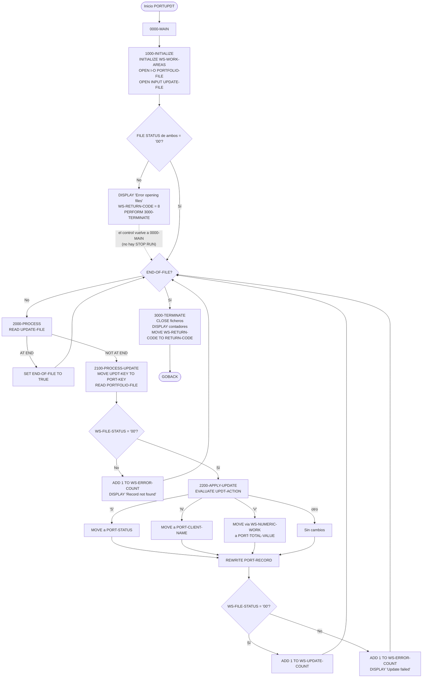
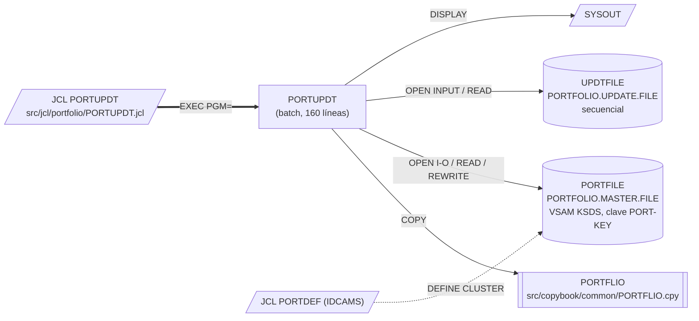

# PORTUPDT — Actualización batch de registros del maestro de carteras

> Generado a partir del análisis del código fuente `src/programs/portfolio/PORTUPDT.cbl`. Ver el [grafo de dependencias global](../technical/dependency-graph.md).

## Ficha técnica
| Campo | Valor |
| --- | --- |
| Ruta | `src/programs/portfolio/PORTUPDT.cbl` |
| Categoría | portfolio |
| Tipo | batch |
| Líneas | 160 |
| Punto de entrada | JCL `PORTUPDT` (`src/jcl/portfolio/PORTUPDT.jcl`, paso `STEP1`, `EXEC PGM=PORTUPDT`) |
| Invocado por | JCL `PORTUPDT`. Ningún programa COBOL lo invoca mediante `CALL` ni `EXEC CICS LINK`. |
| Invoca a | Ningún programa (no hay `CALL`, `LINK` ni sentencias SQL/CICS). Usa el copybook `PORTFLIO` y los ficheros `PORTFILE` (KSDS) y `UPDTFILE` (secuencial). |

## Propósito
`PORTUPDT` es un programa batch de mantenimiento del **fichero maestro de carteras** (`PORTFOLIO.MASTER.FILE`, VSAM KSDS). Lee secuencialmente un fichero de movimientos de actualización (`UPDTFILE`) en el que cada registro identifica una cartera (ID + número de cuenta) y una acción (`S` = cambiar estado, `N` = cambiar nombre de cliente, `V` = cambiar valor total), localiza el registro correspondiente en el maestro por clave y lo reescribe con el nuevo valor.

Forma parte del conjunto de utilidades batch de la carpeta `portfolio` (junto a `PORTADD`, `PORTDEL`, `PORTREAD`, `PORTTEST`, `PORTDEF`) que realizan el CRUD básico sobre el maestro de carteras. No participa del flujo batch nocturno descrito en `system-architecture.md` (TRNVAL00 → POSUPD00 → HISTLD00 → informes) ni utiliza el framework de checkpoint/restart, ERRPROC o AUDPROC: es un programa autónomo y sencillo.

## Funcionamiento

### `0000-MAIN`
Orquesta el programa: ejecuta `1000-INITIALIZE`, luego `2000-PROCESS` en bucle `UNTIL END-OF-FILE`, después `3000-TERMINATE` y termina con `GOBACK`.

### `1000-INITIALIZE`
1. `INITIALIZE WS-WORK-AREAS` (contadores y código de retorno a cero).
2. `OPEN I-O PORTFOLIO-FILE` (maestro KSDS, acceso `RANDOM` por `PORT-KEY`).
3. `OPEN INPUT UPDATE-FILE` (fichero secuencial de movimientos).
4. Si alguno de los dos `FILE STATUS` no es `'00'`, muestra `Error opening files: PORT=xx UPDT=yy`, mueve `WS-ERROR` (+8) a `WS-RETURN-CODE` y ejecuta `3000-TERMINATE`. **No** detiene el programa: el control vuelve a `0000-MAIN`, que continúa con el bucle de proceso (ver [Observaciones](#observaciones-y-problemas-detectados)).

### `2000-PROCESS`
Lee el siguiente registro de `UPDATE-FILE`:
- `AT END` → `SET END-OF-FILE TO TRUE` (fin del bucle).
- `NOT AT END` → `PERFORM 2100-PROCESS-UPDATE`.

### `2100-PROCESS-UPDATE`
1. `MOVE UPDT-KEY TO PORT-KEY` (la clave del movimiento, 18 bytes = `UPDT-ID` + `UPDT-ACCT-NO`, se copia sobre la clave del maestro `PORT-ID` + `PORT-ACCOUNT-NO`).
2. `READ PORTFOLIO-FILE` (lectura aleatoria por clave).
3. Si `WS-FILE-STATUS = '00'` → `PERFORM 2200-APPLY-UPDATE`.
4. En caso contrario incrementa `WS-ERROR-COUNT` y muestra `Record not found: <clave>` (cualquier estado distinto de `'00'`, no solo el `'23'`).

### `2200-APPLY-UPDATE`
Aplica el cambio según `UPDT-ACTION` con un `EVALUATE TRUE`:

| Condición 88 | `UPDT-ACTION` | Efecto sobre `PORT-RECORD` |
| --- | --- | --- |
| `UPDT-STATUS` | `'S'` | `MOVE UPDT-NEW-VALUE TO PORT-STATUS` (solo el primer byte de los 50 llega a `PORT-STATUS PIC X(1)`) |
| `UPDT-NAME` | `'N'` | `MOVE UPDT-NEW-VALUE TO PORT-CLIENT-NAME` (truncado a 30 bytes) |
| `UPDT-VALUE` | `'V'` | `MOVE UPDT-NEW-VALUE TO WS-NUMERIC-WORK` y después `MOVE WS-NUMERIC-WORK TO PORT-TOTAL-VALUE` (conversión alfanumérico → numérico → COMP-3) |
| *(otro)* | cualquier otro valor | No hay `WHEN OTHER`: el registro no se modifica |

A continuación, **siempre** ejecuta `REWRITE PORT-RECORD`. Si el `FILE STATUS` es `'00'` incrementa `WS-UPDATE-COUNT`; si no, incrementa `WS-ERROR-COUNT` y muestra `Update failed for: <clave>`.

### `3000-TERMINATE`
Cierra ambos ficheros, muestra `Updates processed: n` y `Errors occurred: n`, y mueve `WS-RETURN-CODE` al registro especial `RETURN-CODE`.

### Diagrama de flujo

## Interfaz

- **Parámetros / LINKAGE SECTION / COMMAREA**: No aplica. El programa no tiene `LINKAGE SECTION` ni `PROCEDURE DIVISION USING`; no recibe `PARM` del JCL.

- **Ficheros (DDNAME, organización, modo de apertura, clave)**:

| DDNAME | Nombre COBOL | Organización / acceso | Modo de apertura | Clave / registro | FILE STATUS | DSN en JCL |
| --- | --- | --- | --- | --- | --- | --- |
| `PORTFILE` | `PORTFOLIO-FILE` | `INDEXED`, `ACCESS MODE IS RANDOM` (VSAM KSDS) | `OPEN I-O` (READ + REWRITE) | `RECORD KEY IS PORT-KEY` (18 bytes: `PORT-ID` X(8) + `PORT-ACCOUNT-NO` X(10)); registro `PORT-RECORD` de 148 bytes (copybook `PORTFLIO`) | `WS-FILE-STATUS` | `PORTFOLIO.MASTER.FILE`, `DISP=SHR` |
| `UPDTFILE` | `UPDATE-FILE` | `SEQUENTIAL` | `OPEN INPUT` | Sin clave; registro `UPDATE-RECORD` de 69 bytes definido en el propio programa | `WS-UPDT-STATUS` | `PORTFOLIO.UPDATE.FILE`, `DISP=OLD` |

  Además el JCL asigna `SYSOUT`, `SYSPRINT` y `SYSUDUMP` a `SYSOUT=*` (los `DISPLAY` del programa salen por `SYSOUT`).

- **Tablas DB2 y sentencias SQL**: No aplica (no hay `EXEC SQL`).

- **Mapas BMS / comandos CICS**: No aplica (programa batch puro, sin `EXEC CICS`).

- **Códigos de retorno / RETURN-CODE**:

| Valor | Cuándo |
| --- | --- |
| `0` (`WS-SUCCESS`) | Ejecución normal, **incluso si ha habido errores de registro** (`WS-ERROR-COUNT > 0`): los fallos de lectura/`REWRITE` individuales solo se cuentan y se muestran, no alteran `WS-RETURN-CODE`. |
| `8` (`WS-ERROR`) | Únicamente cuando falla el `OPEN` de alguno de los dos ficheros en `1000-INITIALIZE`. Nótese que en este caso el programa no termina de forma limpia (ver Observaciones), por lo que en la práctica este código puede no llegar a devolverse. |

## Estructuras de datos clave

### Copybook `PORTFLIO` (`src/copybook/common/PORTFLIO.cpy`)
Define el registro del maestro de carteras `PORT-RECORD` (148 bytes) usado en la `FD PORTFOLIO-FILE`:

| Campo | PIC | Uso en PORTUPDT |
| --- | --- | --- |
| `PORT-KEY` → `PORT-ID` X(8), `PORT-ACCOUNT-NO` X(10) | 18 bytes | Clave de lectura aleatoria; se rellena desde `UPDT-KEY` |
| `PORT-CLIENT-NAME` | X(30) | Destino de la acción `N` |
| `PORT-CLIENT-TYPE` (88: `I`/`C`/`T`) | X(1) | No se usa |
| `PORT-CREATE-DATE`, `PORT-LAST-MAINT` | 9(8) | No se usan (no se actualiza la fecha de último mantenimiento) |
| `PORT-STATUS` (88: `PORT-ACTIVE` `A`, `PORT-CLOSED` `C`, `PORT-SUSPENDED` `S`) | X(1) | Destino de la acción `S` (sin validar contra los 88) |
| `PORT-TOTAL-VALUE` | S9(13)V99 COMP-3 | Destino de la acción `V` |
| `PORT-CASH-BALANCE` | S9(13)V99 COMP-3 | No se usa |
| `PORT-LAST-USER`, `PORT-LAST-TRANS` | X(8), 9(8) | No se usan (no se registra auditoría) |
| `PORT-FILLER` | X(50) | — |

### Registro de entrada `UPDATE-RECORD` (definido en la `FD UPDATE-FILE`, 69 bytes)

| Campo | PIC | Descripción |
| --- | --- | --- |
| `UPDT-KEY` → `UPDT-ID` X(8), `UPDT-ACCT-NO` X(10) | 18 bytes | Clave de la cartera a actualizar; misma longitud y orden que `PORT-KEY` |
| `UPDT-ACTION` | X(1) | Tipo de actualización. 88: `UPDT-STATUS` = `'S'`, `UPDT-VALUE` = `'V'`, `UPDT-NAME` = `'N'` |
| `UPDT-NEW-VALUE` | X(50) | Nuevo valor, en formato carácter para las tres acciones |

### WORKING-STORAGE

| Campo | PIC / valor | Uso |
| --- | --- | --- |
| `WS-PROGRAM-NAME` | X(08) VALUE `'PORTUPDT '` | No se usa (el literal tiene 9 caracteres para un campo de 8) |
| `WS-SUCCESS` / `WS-ERROR` | S9(4) +0 / +8 | Códigos de retorno; solo `WS-ERROR` se utiliza |
| `WS-FILE-STATUS` | X(2); 88 `WS-SUCCESS-STATUS` `'00'`, `WS-EOF-STATUS` `'10'`, `WS-REC-NOT-FND` `'23'` | FILE STATUS del maestro. Solo se consulta `WS-SUCCESS-STATUS`; `WS-EOF-STATUS` y `WS-REC-NOT-FND` no se usan |
| `WS-UPDT-STATUS` | X(2); 88 `WS-UPDT-SUCCESS` `'00'`, `WS-UPDT-EOF` `'10'` | FILE STATUS del fichero de movimientos; solo se consulta tras el `OPEN` |
| `WS-END-OF-FILE-SW` | X(1) `'N'`; 88 `END-OF-FILE` `'Y'`, `NOT-END-OF-FILE` `'N'` | Control del bucle principal |
| `WS-UPDATE-COUNT` | 9(7) | Nº de `REWRITE` correctos |
| `WS-ERROR-COUNT` | 9(7) | Nº de registros no encontrados + `REWRITE` fallidos |
| `WS-RETURN-CODE` | S9(4) | Se copia a `RETURN-CODE` en `3000-TERMINATE` |
| `WS-NUMERIC-WORK` | S9(13)V99 (DISPLAY) | Área intermedia para convertir `UPDT-NEW-VALUE` a numérico antes de moverlo al campo COMP-3 |

No existen umbrales de commit/checkpoint: el programa no hace checkpoints ni `COMMIT`; cada `REWRITE` se aplica directamente sobre el VSAM.

## Reglas de negocio y validaciones

1. **Identificación de la cartera**: la clave del movimiento (`UPDT-ID` + `UPDT-ACCT-NO`) debe coincidir exactamente con una clave existente del maestro (`READ` aleatorio). Si no existe (o el `READ` falla por cualquier motivo), el movimiento se rechaza y se cuenta como error.
2. **Tipos de acción soportados** (`UPDT-ACTION`):
   - `'S'`: sustituye `PORT-STATUS` por el primer carácter de `UPDT-NEW-VALUE`.
   - `'N'`: sustituye `PORT-CLIENT-NAME` por los 30 primeros caracteres de `UPDT-NEW-VALUE`.
   - `'V'`: sustituye `PORT-TOTAL-VALUE` por la conversión numérica de `UPDT-NEW-VALUE`.
   - Cualquier otro código: el registro se reescribe sin cambios y se cuenta como actualización correcta.
3. **No hay validaciones de contenido**: no se comprueba que el nuevo estado sea `A`/`C`/`S`, que el nombre no esté en blanco, ni que el nuevo valor sea numérico (`IS NUMERIC`) antes de la conversión. Contrasta con `PORTADD`, que sí valida `PORT-ID`, `PORT-CLIENT-NAME` y `PORT-STATUS` antes de escribir.
4. **Sin actualización de auditoría**: no se modifican `PORT-LAST-MAINT`, `PORT-LAST-USER` ni `PORT-LAST-TRANS`, ni se escribe ningún fichero de auditoría (a diferencia de `PORTDEL`, que escribe `AUDFILE`, o `PORTMSTR`, que llama a `AUDPROC`).
5. **Procesamiento "todo o nada" por registro, no por lote**: cada movimiento se aplica de forma independiente; un error en un registro no detiene el proceso ni deshace los anteriores.
6. **Contadores de resumen**: al final se informa el número de actualizaciones correctas y de errores por `DISPLAY`.

## Manejo de errores y recuperación

- **FILE STATUS**: ambos ficheros tienen cláusula `FILE STATUS`, por lo que los errores de E/S no provocan un abend automático; el programa decide qué hacer tras cada operación. No hay `DECLARATIVES`/`USE AFTER ERROR`.
  - `OPEN`: si cualquiera de los dos falla se muestra el mensaje con ambos estados, se fija `WS-RETURN-CODE = 8` y se ejecuta `3000-TERMINATE` desde dentro de `1000-INITIALIZE`. Al no haber `STOP RUN`/`GOBACK` en ese punto, `0000-MAIN` continúa con `PERFORM 2000-PROCESS UNTIL END-OF-FILE` sobre ficheros cerrados (ver Observaciones).
  - `READ UPDATE-FILE`: solo se contemplan `AT END`/`NOT AT END`. Un estado de error distinto de `'10'` (p. ej. `'30'`, `'47'`) no ejecuta ninguna de las dos ramas y no activa `END-OF-FILE`, por lo que el bucle volvería a intentar la lectura indefinidamente.
  - `READ PORTFOLIO-FILE`: cualquier estado ≠ `'00'` se trata como "Record not found" y se contabiliza como error; se sigue con el siguiente movimiento.
  - `REWRITE PORT-RECORD`: cualquier estado ≠ `'00'` se muestra como "Update failed" y se contabiliza como error; se sigue con el siguiente movimiento.
  - `CLOSE`: no se comprueba el estado.
- **SQLCODE / condiciones CICS**: No aplica.
- **Checkpoint/restart y rollback**: no implementados. El programa no usa el fichero de control batch (`BCHCTL`), no llama a `CKPRST`, y las actualizaciones VSAM se hacen sin ningún mecanismo de deshacer. Si el job se cancela a mitad, el maestro queda parcialmente actualizado y una re-ejecución volvería a aplicar todos los movimientos del fichero (idempotente para `S`/`N`/`V`, ya que son sustituciones, pero sin garantía si el fichero de entrada cambia).
- **Rutinas comunes de error**: no llama a `ERRPROC`, `ERRHNDL` ni `DB2ERR`. Toda la notificación de errores se hace mediante `DISPLAY` a `SYSOUT`.
- **RETURN-CODE**: solo refleja fallos de apertura; los errores de registro no elevan el código de retorno, por lo que un planificador que dependa de `COND`/RC no detectaría movimientos rechazados.

## Dependencias

No hay programas invocados (`CALL`/`LINK`), tablas DB2 ni mapas BMS. El fichero `PORTFOLIO.MASTER.FILE` es compartido con `PORTADD`, `PORTDEL`, `PORTREAD` y `PORTMSTR`, y se define con el JCL `PORTDEF`.

## Observaciones y problemas detectados

1. **Fallo de apertura no detiene el programa (bug).** En `1000-INITIALIZE`, tras un `OPEN` fallido se ejecuta `PERFORM 3000-TERMINATE` pero no hay `GOBACK`/`STOP RUN`. El control vuelve a `0000-MAIN`, que ejecuta `PERFORM 2000-PROCESS UNTIL END-OF-FILE` sobre `UPDATE-FILE` cerrado. El `READ` devolverá un estado de error (probablemente `'47'`), que no activa `AT END`, por lo que `END-OF-FILE` nunca se pone a `'Y'` y el programa entra en **bucle infinito**. Además `3000-TERMINATE` se ejecutaría dos veces (segundo `CLOSE` sobre ficheros ya cerrados). Debería añadirse un `GOBACK` (o `STOP RUN`) tras el `PERFORM 3000-TERMINATE` del `END-IF`.
2. **Errores de lectura del fichero de movimientos no controlados.** `2000-PROCESS` solo trata `AT END`/`NOT AT END`; cualquier otro `FILE STATUS` de `UPDATE-FILE` (`WS-UPDT-STATUS`) se ignora y puede provocar el mismo bucle infinito del punto anterior. `WS-UPDT-STATUS` nunca se consulta después del `OPEN`.
3. **Conversión numérica de la acción `V` probablemente incorrecta.** `MOVE UPDT-NEW-VALUE (PIC X(50)) TO WS-NUMERIC-WORK (PIC S9(13)V99)` es un `MOVE` alfanumérico → numérico: el emisor se trata como un entero sin signo y se alinea por la derecha, de modo que, si el importe viene justificado a la izquierda con espacios a la derecha (lo habitual en un campo X(50)), los dígitos significativos se pierden y en `WS-NUMERIC-WORK` quedan espacios/ceros. No se admite punto decimal ni signo, y no se valida `IS NUMERIC`, por lo que un valor no numérico puede acabar en `PORT-TOTAL-VALUE` (COMP-3) como dato inválido y provocar un `S0C7` en programas que lo usen aritméticamente. Sería necesario un campo de entrada numérico editado o una conversión explícita (p. ej. `FUNCTION NUMVAL`).
4. **Truncamientos silenciosos.** La acción `S` mueve un X(50) a `PORT-STATUS` X(1) (solo cuenta el primer byte) y la acción `N` mueve X(50) a `PORT-CLIENT-NAME` X(30) (se pierden 20 caracteres) sin ninguna advertencia.
5. **Sin validación del nuevo estado.** No se comprueba que el valor movido a `PORT-STATUS` sea uno de los definidos en el copybook (`A`, `C`, `S`); se aceptan estados arbitrarios.
6. **Acción desconocida se contabiliza como éxito.** El `EVALUATE` no tiene `WHEN OTHER`; un `UPDT-ACTION` distinto de `S`/`N`/`V` no cambia nada, pero el registro se reescribe igualmente y suma a `WS-UPDATE-COUNT`, sin mensaje de error.
7. **`RETURN-CODE` no refleja errores de registro.** `WS-ERROR-COUNT > 0` no modifica `WS-RETURN-CODE`; el job termina con RC=0 aunque todos los movimientos se rechacen. Los códigos `WS-SUCCESS`, `WS-REC-NOT-FND`, `WS-EOF-STATUS` y `WS-UPDT-EOF` están definidos pero no se usan.
8. **Mensaje "Record not found" engañoso.** Cualquier `FILE STATUS` ≠ `'00'` en el `READ` del maestro (p. ej. `'30'`, `'90'`, `'92'`) se reporta como registro no encontrado, aunque exista el 88 `WS-REC-NOT-FND` (`'23'`) para distinguirlo.
9. **No se actualizan los campos de auditoría.** `PORT-LAST-MAINT`, `PORT-LAST-USER` y `PORT-LAST-TRANS` del copybook no se tocan, y no se genera registro de auditoría (ni `AUDFILE` como `PORTDEL`, ni `AUDPROC` como `PORTMSTR`). La fecha de último mantenimiento queda obsoleta tras cada actualización.
10. **`WS-PROGRAM-NAME PIC X(08) VALUE 'PORTUPDT '`**: el literal tiene 9 caracteres (espacio final) para un campo de 8; el compilador lo truncará con un aviso. El campo además no se usa.
11. **Inconsistencia en la definición del VSAM maestro.** El registro `PORT-RECORD` del copybook mide 148 bytes con clave de 18 bytes en posición 1. Sin embargo:
    - `src/jcl/portfolio/PORTDEF.jcl` define `PORTFOLIO.MASTER.FILE` con `RECORDSIZE(200 200)` y `KEYS(18 0)`;
    - `src/database/vsam/vsam-definitions.txt` documenta el mismo DSN con `RECORDSIZE(400 400)`, `KEYS(12 0)` y una clave "Portfolio ID (8) + Account Type (2) + Branch ID (2)";
    - `PORTMSTR.cbl` usa un layout distinto de 100 bytes con clave `PORT-ID` X(10).
    Con la definición de `PORTDEF.jcl` (longitud fija 200 ≠ 148) el `OPEN` desde `PORTUPDT` fallaría probablemente con `FILE STATUS '39'` (atributos de fichero en conflicto), lo que a su vez dispararía el bug del punto 1. Manda el código, pero las tres fuentes son incompatibles entre sí.
12. **Discrepancias con la documentación técnica.** `system-architecture.md` no menciona `PORTUPDT` ni el resto de utilidades `portfolio`, y describe que los programas batch dependen de `ERRPROC`, del framework de checkpoint/restart (`BCHCTL`) y de auditoría; `PORTUPDT` no usa ninguno de ellos. `data-dictionary.md` no documenta el layout `PORTFLIO` ni el fichero `PORTFOLIO.UPDATE.FILE`; además define `ACCOUNT-NO` como `NUMERIC 9`, mientras que el copybook usa `PORT-ACCOUNT-NO PIC X(10)`.
13. **Cabecera sin autor** (`Author: [Author name]`), como el resto de fuentes del repositorio; sin impacto funcional.

## Referencias

- Programa: [PORTUPDT.cbl](../../src/programs/portfolio/PORTUPDT.cbl)
- Copybook: [PORTFLIO.cpy](../../src/copybook/common/PORTFLIO.cpy)
- JCL de ejecución: [PORTUPDT.jcl](../../src/jcl/portfolio/PORTUPDT.jcl)
- JCL de definición del VSAM maestro: [PORTDEF.jcl](../../src/jcl/portfolio/PORTDEF.jcl)
- Definiciones VSAM: [vsam-definitions.txt](../../src/database/vsam/vsam-definitions.txt)
- Programas relacionados sobre el mismo maestro: [PORTADD.cbl](../../src/programs/portfolio/PORTADD.cbl), [PORTDEL.cbl](../../src/programs/portfolio/PORTDEL.cbl), [PORTREAD.cbl](../../src/programs/portfolio/PORTREAD.cbl), [PORTMSTR.cbl](../../src/programs/portfolio/PORTMSTR.cbl)
- Documentación técnica: [dependency-graph.md](../technical/dependency-graph.md), [system-architecture.md](../technical/system-architecture.md), [data-dictionary.md](../technical/data-dictionary.md)
