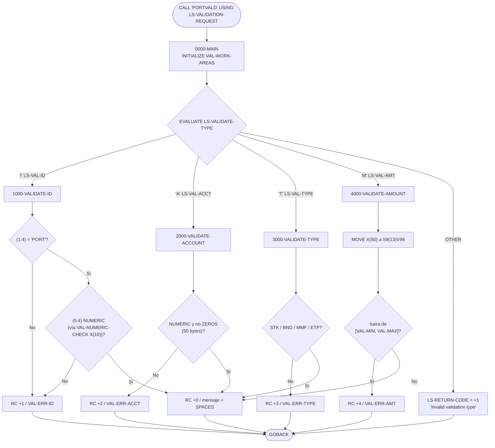
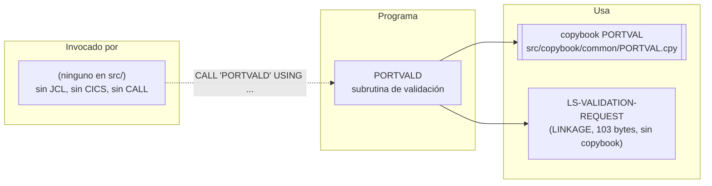

# PORTVALD — Subrutina de validación de datos de cartera

> Generado a partir del análisis del código fuente `src/programs/portfolio/PORTVALD.cbl`. Ver el [grafo de dependencias global](../technical/dependency-graph.md).

## Ficha técnica
| Campo | Valor |
| --- | --- |
| Ruta | `src/programs/portfolio/PORTVALD.cbl` |
| Categoría | portfolio |
| Tipo | subrutina común (invocable por `CALL`; sin ficheros, sin DB2, sin CICS) |
| Líneas | 120 |
| Punto de entrada | ninguno conocido (no hay `EXEC PGM=PORTVALD` en ningún JCL, ni definición CICS, ni `CALL 'PORTVALD'` en `src/`) |
| Invocado por | ninguno en el repositorio (programa huérfano) |
| Invoca a | ningún programa; solo usa el copybook `PORTVAL` |

> Nota: `dependency-graph.json` clasifica el programa como `tipo: batch`. El código, sin embargo, es una subrutina pura: no tiene `INPUT-OUTPUT SECTION`, recibe sus datos por `LINKAGE SECTION` (`PROCEDURE DIVISION USING`) y termina con `GOBACK`. En esta documentación manda el código.

## Propósito
`PORTVALD` es una subrutina de validación de datos elementales de cartera. Recibe un único bloque de parámetros con el tipo de validación deseada (`I` = identificador de cartera, `A` = número de cuenta, `T` = tipo de inversión, `M` = importe) y el valor a comprobar, y devuelve un código de retorno numérico y un mensaje de error de 50 caracteres. Está pensada como servicio reutilizable de la capa de mantenimiento de carteras (programas `PORT*`), pero en el estado actual del repositorio ningún programa la invoca; los programas que sí validan datos de cartera (p. ej. `PORTMSTR` en `2100-VALIDATE-PORTFOLIO`) implementan sus propias reglas de forma independiente.

## Funcionamiento
El programa no tiene inicialización de ficheros ni bucle de proceso: es un despachador de una sola pasada.

1. **`0000-MAIN`**
   - `INITIALIZE VAL-WORK-AREAS`: pone a cero/espacios las áreas de trabajo del copybook `PORTVAL` (`VAL-NUMERIC-CHECK`, `VAL-TEMP-NUM`, `VAL-ERROR-CODE`, `VAL-ERROR-MSG`).
   - `EVALUATE TRUE` sobre las condiciones de nivel 88 de `LS-VALIDATE-TYPE`:
     - `LS-VAL-ID` (`'I'`) → `PERFORM 1000-VALIDATE-ID`
     - `LS-VAL-ACCT` (`'A'`) → `PERFORM 2000-VALIDATE-ACCOUNT`
     - `LS-VAL-TYPE` (`'T'`) → `PERFORM 3000-VALIDATE-TYPE`
     - `LS-VAL-AMT` (`'M'`) → `PERFORM 4000-VALIDATE-AMOUNT`
     - `WHEN OTHER` → `LS-RETURN-CODE = VAL-INVALID-ID` (+1) y `LS-ERROR-MSG = 'Invalid validation type'` (literal en el programa, no en el copybook).
   - `GOBACK`: devuelve el control al llamador. No se toca el registro especial `RETURN-CODE`; toda la salida va por el área de LINKAGE.

2. **`1000-VALIDATE-ID`** — el identificador de cartera debe empezar por `'PORT'` seguido de 4 dígitos.
   - Si `LS-INPUT-VALUE(1:4) NOT = VAL-ID-PREFIX` (`'PORT'`) → código `VAL-INVALID-ID` (+1), mensaje `VAL-ERR-ID` (`'Invalid Portfolio ID format'`) y `EXIT PARAGRAPH`.
   - `MOVE LS-INPUT-VALUE(5:4) TO VAL-NUMERIC-CHECK` y, si `VAL-NUMERIC-CHECK IS NOT NUMERIC`, mismo código y mensaje de error.
   - En caso contrario → `VAL-SUCCESS` (+0) y mensaje en blanco.
   - Ver [Observaciones](#observaciones-y-problemas-detectados): por el tamaño de `VAL-NUMERIC-CHECK` (`PIC X(10)`) la comprobación numérica falla siempre.

3. **`2000-VALIDATE-ACCOUNT`** — el número de cuenta debe ser numérico y distinto de cero.
   - Si `LS-INPUT-VALUE IS NOT NUMERIC OR LS-INPUT-VALUE = ZEROS` → `VAL-INVALID-ACCT` (+2), mensaje `VAL-ERR-ACCT` (`'Invalid Account Number format'`).
   - En caso contrario → `VAL-SUCCESS`.
   - La prueba se hace sobre los 50 bytes completos de `LS-INPUT-VALUE`, no sobre 10 posiciones como indica el comentario del párrafo.

4. **`3000-VALIDATE-TYPE`** — el tipo de inversión debe ser uno de `'STK'`, `'BND'`, `'MMF'`, `'ETF'`.
   - Condición combinada abreviada: `IF LS-INPUT-VALUE NOT = 'STK' AND NOT = 'BND' AND NOT = 'MMF' AND NOT = 'ETF'` → `VAL-INVALID-TYPE` (+3), mensaje `VAL-ERR-TYPE` (`'Invalid Investment Type'`).
   - La comparación alfanumérica rellena el literal con espacios hasta 50 bytes, por lo que el valor debe venir alineado a la izquierda y el resto del campo en blanco.
   - En caso contrario → `VAL-SUCCESS`.

5. **`4000-VALIDATE-AMOUNT`** — el importe debe estar dentro de un rango.
   - `MOVE LS-INPUT-VALUE TO VAL-TEMP-NUM` (de `PIC X(50)` a `PIC S9(13)V99`, sin comprobación `NUMERIC` previa).
   - Si `VAL-TEMP-NUM < VAL-MIN-AMOUNT OR VAL-TEMP-NUM > VAL-MAX-AMOUNT` → `VAL-INVALID-AMT` (+4), mensaje `VAL-ERR-AMT` (`'Amount outside valid range'`).
   - En caso contrario → `VAL-SUCCESS`.
   - Los límites coinciden con el rango representable de `S9(13)V99`, por lo que la condición de error nunca puede cumplirse (ver Observaciones).

## Interfaz
- **Parámetros / LINKAGE SECTION / COMMAREA**: un único parámetro `LS-VALIDATION-REQUEST` recibido por referencia (`PROCEDURE DIVISION USING LS-VALIDATION-REQUEST`). No se define en ningún copybook: el llamador debe replicar la estructura.

  | Campo | PIC | Dirección | Descripción |
  | --- | --- | --- | --- |
  | `LS-VALIDATE-TYPE` | `X(1)` | entrada | Tipo de validación. 88: `LS-VAL-ID`='I', `LS-VAL-ACCT`='A', `LS-VAL-TYPE`='T', `LS-VAL-AMT`='M' |
  | `LS-INPUT-VALUE` | `X(50)` | entrada | Valor a validar (siempre alfanumérico, 50 bytes) |
  | `LS-RETURN-CODE` | `S9(4) COMP` | salida | Código de resultado (ver tabla más abajo) |
  | `LS-ERROR-MSG` | `X(50)` | salida | Mensaje de error, o `SPACES` si la validación es correcta |

  Longitud total del área: 1 + 50 + 2 + 50 = 103 bytes.

- **Ficheros (DDNAME, organización, modo de apertura, clave)**: No aplica. El programa no tiene `INPUT-OUTPUT SECTION` ni `FILE SECTION`.

- **Tablas DB2 y sentencias SQL**: No aplica.

- **Mapas BMS / comandos CICS**: No aplica.

- **Códigos de retorno / RETURN-CODE**: el programa no modifica el registro especial `RETURN-CODE`; el resultado se devuelve en `LS-RETURN-CODE`, tomando los valores definidos en `VAL-RETURN-CODES` del copybook `PORTVAL`:

  | Valor | Constante | Cuándo | Mensaje (`LS-ERROR-MSG`) |
  | --- | --- | --- | --- |
  | +0 | `VAL-SUCCESS` | Validación superada (cualquier tipo) | `SPACES` |
  | +1 | `VAL-INVALID-ID` | Prefijo distinto de `PORT` o posiciones 5-8 no numéricas; **también** cuando `LS-VALIDATE-TYPE` no es I/A/T/M | `'Invalid Portfolio ID format'` o `'Invalid validation type'` |
  | +2 | `VAL-INVALID-ACCT` | Cuenta no numérica (50 bytes) o igual a ceros | `'Invalid Account Number format'` |
  | +3 | `VAL-INVALID-TYPE` | Tipo distinto de STK/BND/MMF/ETF | `'Invalid Investment Type'` |
  | +4 | `VAL-INVALID-AMT` | Importe fuera de `[VAL-MIN-AMOUNT, VAL-MAX-AMOUNT]` (inalcanzable en la práctica) | `'Amount outside valid range'` |

## Estructuras de datos clave
### Copybook `PORTVAL` (`src/copybook/common/PORTVAL.cpy`)
Único copybook del programa; se incluye en `WORKING-STORAGE` y aporta cuatro grupos:

| Grupo | Campos | Uso en PORTVALD |
| --- | --- | --- |
| `VAL-RETURN-CODES` | `VAL-SUCCESS` +0, `VAL-INVALID-ID` +1, `VAL-INVALID-ACCT` +2, `VAL-INVALID-TYPE` +3, `VAL-INVALID-AMT` +4 (todos `PIC S9(4)` DISPLAY) | Origen de los valores movidos a `LS-RETURN-CODE` (`S9(4) COMP`; la conversión la hace el `MOVE`) |
| `VAL-ERROR-MESSAGES` | `VAL-ERR-ID`, `VAL-ERR-ACCT`, `VAL-ERR-TYPE`, `VAL-ERR-AMT` (`PIC X(50)`) | Textos movidos a `LS-ERROR-MSG` |
| `VAL-CONSTANTS` | `VAL-MIN-AMOUNT` `S9(13)V99` = -9999999999999.99; `VAL-MAX-AMOUNT` `S9(13)V99` = +9999999999999.99; `VAL-ID-PREFIX` `X(4)` = `'PORT'` | Umbrales de `4000-VALIDATE-AMOUNT` y prefijo de `1000-VALIDATE-ID` |
| `VAL-WORK-AREAS` | `VAL-NUMERIC-CHECK` `X(10)`; `VAL-TEMP-NUM` `S9(13)V99`; `VAL-ERROR-CODE` `S9(4)`; `VAL-ERROR-MSG` `X(50)` | Inicializados en `0000-MAIN`. Solo se usan `VAL-NUMERIC-CHECK` (1000) y `VAL-TEMP-NUM` (4000); `VAL-ERROR-CODE` y `VAL-ERROR-MSG` no se referencian nunca |

### WORKING-STORAGE propio
No hay campos propios más allá del copybook: sin flags, contadores, ni umbrales de commit (el programa no procesa lotes ni accede a recursos externos).

### Relación con otros layouts del repositorio
- `PORTFLIO.cpy` define `PORT-ID PIC X(8)` y `PORT-ACCOUNT-NO PIC X(10)`, lo que encaja con las reglas «`PORT` + 4 dígitos» y «cuenta de 10 dígitos» que enuncian los comentarios de `PORTVALD`.
- `PORTMSTR.cbl`, en cambio, usa `PORT-ID PIC X(10)` y valida `PORT` + 5 dígitos; `PORTTEST.cbl` genera claves con `STRING 'PORT' WS-RECORD-COUNT` y `TSTGEN00` usa `WS-PORT-ID PIC X(10)`. No existe una definición única del formato del identificador de cartera en el repositorio.

## Reglas de negocio y validaciones
1. **Tipo de petición**: `LS-VALIDATE-TYPE` debe ser exactamente `'I'`, `'A'`, `'T'` o `'M'`; cualquier otro valor se rechaza con +1 (`'Invalid validation type'`).
2. **Identificador de cartera (`'I'`)**: posiciones 1-4 iguales a `'PORT'` (constante `VAL-ID-PREFIX`) y posiciones 5-8 numéricas. Las posiciones 9-50 de `LS-INPUT-VALUE` no se inspeccionan.
3. **Número de cuenta (`'A'`)**: los 50 bytes de `LS-INPUT-VALUE` deben ser dígitos (`IS NUMERIC`) y no todos cero. El comentario del código habla de «10 numeric digits», pero la regla realmente codificada exige que todo el campo sea numérico.
4. **Tipo de inversión (`'T'`)**: valor (alineado a la izquierda, resto en blanco) igual a uno de `STK` (acciones), `BND` (bonos), `MMF` (fondo monetario) o `ETF`. Es una comparación literal; no hay tabla ni copybook con este dominio de valores, y ningún otro programa del repositorio usa estos códigos (los tipos de transacción de `TRNREC.cpy` son `BU`/`SL`/`TR`/`FE`).
5. **Importe (`'M'`)**: tras la conversión a `S9(13)V99`, debe cumplir -9.999.999.999.999,99 ≤ importe ≤ +9.999.999.999.999,99. No se valida que el dato de entrada sea numérico ni se interpreta signo o punto decimal.
6. **Contrato de salida**: en cada validación superada se fuerza `LS-RETURN-CODE = 0` y `LS-ERROR-MSG = SPACES`, de modo que el llamador puede reutilizar la misma área en llamadas sucesivas sin limpiarla.

Ninguna de las reglas de `data-dictionary.md` §5 (existencia de la cuenta en el maestro de clientes, existencia del fondo, fecha no futura, etc.) se implementa aquí: `PORTVALD` solo hace validaciones de formato en memoria.

## Manejo de errores y recuperación
- **FILE STATUS**: no aplica (sin ficheros).
- **SQLCODE**: no aplica (sin DB2).
- **Condiciones CICS**: no aplica.
- **Checkpoints / restart / rollback**: no aplica; el programa no mantiene estado entre llamadas ni actualiza recursos.
- **ERRPROC / ERRHNDL / DB2ERR**: no se invocan. El tratamiento de errores consiste exclusivamente en devolver `LS-RETURN-CODE` ≠ 0 y el texto correspondiente en `LS-ERROR-MSG`; la decisión de abortar, registrar o reintentar recae en el llamador.
- **Abends potenciales**: el `MOVE LS-INPUT-VALUE TO VAL-TEMP-NUM` de `4000-VALIDATE-AMOUNT` se ejecuta sin comprobar previamente `IS NUMERIC`; si el llamador pasa un valor con espacios, signo o punto decimal, el contenido resultante de `VAL-TEMP-NUM` es indefinido y la comparación posterior puede provocar una excepción de datos (S0C7) en tiempo de ejecución según las opciones de compilación (`NUMPROC`, `TRUNC`, etc.).

## Dependencias

No hay ficheros, tablas DB2, mapas BMS ni programas llamados.

## Observaciones y problemas detectados
1. **Programa huérfano.** Ningún programa hace `CALL 'PORTVALD'`, ningún JCL lo ejecuta y no está definido en `src/cics/PORTDFN.csd`. `dependency-graph.md` lo lista entre los «programas sin invocador conocido». La estructura `LS-VALIDATION-REQUEST` tampoco existe como copybook, lo que dificulta que un futuro llamador la replique correctamente.
2. **Bug en `1000-VALIDATE-ID`: la validación numérica falla siempre.** Se mueven 4 caracteres (`LS-INPUT-VALUE(5:4)`) a `VAL-NUMERIC-CHECK`, que es `PIC X(10)`; el `MOVE` rellena las 6 posiciones restantes con espacios, y un campo con espacios nunca satisface `IS NUMERIC`. En consecuencia, cualquier identificador —incluso uno correcto como `PORT1234`— se rechaza con `VAL-INVALID-ID`. La solución sería probar `LS-INPUT-VALUE(5:4) IS NUMERIC` directamente o dimensionar `VAL-NUMERIC-CHECK` a `X(4)`.
3. **`2000-VALIDATE-ACCOUNT` no implementa la regla documentada.** El comentario dice «Account number must be 10 numeric digits», pero la prueba `IS NUMERIC` se aplica a los 50 bytes de `LS-INPUT-VALUE`. Una cuenta de 10 dígitos alineada a la izquierda y seguida de espacios se rechaza; solo pasaría un valor con los 50 bytes numéricos (p. ej. relleno de ceros a la izquierda), que además no se limita a 10 dígitos.
4. **`4000-VALIDATE-AMOUNT` no puede detectar ningún error de rango.** `VAL-MIN-AMOUNT` y `VAL-MAX-AMOUNT` son exactamente el mínimo y el máximo representables en `PIC S9(13)V99`, por lo que `VAL-TEMP-NUM < VAL-MIN-AMOUNT OR VAL-TEMP-NUM > VAL-MAX-AMOUNT` es siempre falso: el párrafo devuelve `VAL-SUCCESS` para cualquier entrada (o produce datos indefinidos). Además, el `MOVE` de un `X(50)` a un campo numérico trata la fuente como un entero sin signo de 50 dígitos: no se interpretan signo ni decimales, y los dígitos significativos se toman de las 13 posiciones de la derecha (truncando por la izquierda). No hay comprobación `IS NUMERIC` previa.
5. **Código de retorno ambiguo para tipo de petición inválido.** `WHEN OTHER` reutiliza `VAL-INVALID-ID` (+1), el mismo valor que un identificador de cartera incorrecto, con un literal (`'Invalid validation type'`) que no está en `PORTVAL.cpy`. El llamador no puede distinguir ambos casos por el código.
6. **Campos muertos.** `VAL-ERROR-CODE` y `VAL-ERROR-MSG` de `VAL-WORK-AREAS` se inicializan pero nunca se usan.
7. **Formato del identificador de cartera inconsistente en el repositorio.** `PORTVALD` exige `PORT` + 4 dígitos (8 bytes, coherente con `PORTFLIO.cpy`); `PORTMSTR` exige `PORT` + 5 dígitos sobre un campo de 10 bytes; `src/templates/database/db2-handling.cbl` usa `'PORT00001'` (9 bytes). No existe una fuente única de verdad.
8. **Dominio de tipos de inversión sin respaldo.** Los valores `STK`/`BND`/`MMF`/`ETF` no aparecen en ningún copybook, DDL ni en `data-dictionary.md` (que habla de `FUND-ID` y `CUSIP`); son exclusivos de este programa.
9. **Discrepancia con la documentación técnica.** `system-architecture.md` y `data-dictionary.md` no mencionan `PORTVALD` ni la capa de programas `PORT*`; `dependency-graph.json` lo etiqueta como `batch` cuando es una subrutina llamada. La cabecera del fuente tiene el autor sin rellenar (`[Author name]`).
10. **Sin validación de longitud del importe frente al diccionario.** `data-dictionary.md` define `AMOUNT` como `NUMERIC 11,2` (±99999999.99) mientras que `PORTVAL.cpy` usa `S9(13)V99`; el rango aceptado por `PORTVALD` es mayor que el del diccionario de datos.

## Referencias
- Programa: [PORTVALD.cbl](../../src/programs/portfolio/PORTVALD.cbl)
- Copybook: [PORTVAL.cpy](../../src/copybook/common/PORTVAL.cpy)
- Layouts relacionados (para contraste de formatos): [PORTFLIO.cpy](../../src/copybook/common/PORTFLIO.cpy), [PORTMSTR.cbl](../../src/programs/portfolio/PORTMSTR.cbl) (párrafo `2100-VALIDATE-PORTFOLIO`), [TRNREC.cpy](../../src/copybook/common/TRNREC.cpy)
- Definiciones CICS (donde no aparece): [PORTDFN.csd](../../src/cics/PORTDFN.csd)
- Documentación técnica: [dependency-graph.md](../technical/dependency-graph.md), [dependency-graph.json](../technical/dependency-graph.json), [system-architecture.md](../technical/system-architecture.md), [data-dictionary.md](../technical/data-dictionary.md)
